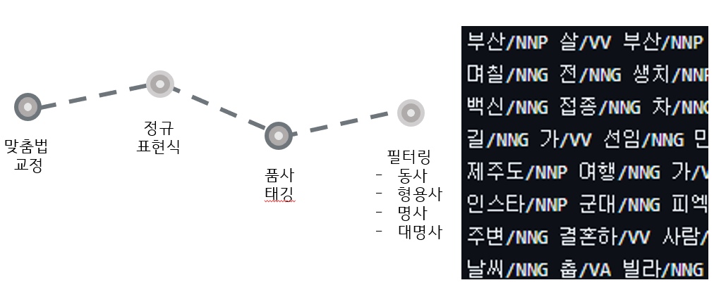
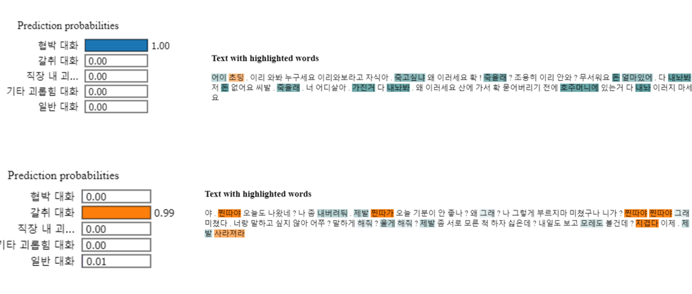

# 학습 내용

---

- W&B
- 대화 유형 분류(classification) 모델 구축
	- 일반 대화 데이터셋 구축
	- 데이터 전처리
	- baseline 구축
	- 모델 정의
		- 사전 훈련된 모델을 활용한 모델 구축
		- 경량 모델 구축
	- 훈련 후 f1 score 체크
	- kaggle Submission
	- XAI

---

## W&B

---

사용법

	1. W&B 사용을 위한 로그인 필요!
		- API키를 통해 로그인
		- ''' wandb.login(key = "your api key")  '''
	2. Sweep의 config 설정
		- Sweep의 이름, metric, method, parameters 포함 되어야함
			- name -> 지정되지 않았을 경우 이름이 랜덤으로 생성되어 새로Sweep을 동작시켰을 때 같은 Sweep으로 묶이지 않음
			- metric ->  학습이 잘 진행되고 있는지, 오버피팅이 발생하지 않는지 등을 판별할 지표, 해당 지표가 크게 되는 것이 목표인지 작게 되는 것이 목표인지 설정
			- method ->  grid, random, bayes 제공
				- beyes의 경우 확률 분포 값으로 앞선 두 방식을 통해서 최적의 하이퍼 파라미터에 근사했지만 좀 더 세밀한 조정이 필요할 경우 사용
			- parameters -> 실험할 하이퍼 파라미터가 포함되어야 함
		'''

		sweep_config = {
		"name": "sweep_test_nlp",
		"metric": {"name": "val_loss", "goal": "minimize"},
    		"method": "random",
    		"parameters": {
        		"learning_rate" : {
            			"min" : 0.001,
            			"max" : 0.1
            			},
        		"epoch" : {
            			"distribution" : "int_uniform",
            			"min" : 5,
            			"max" : 10
            			}
                    
        		}
    		}

		'''
	3. train 함수 설정
		- 하나의 run이 완결성있게 들어가야함
		- init - 모델 학습 - 기록 구조
		'''

		def train():
		    default_config = {
		        "vocab" : 1000,
		        "embeddings" : 64,
		        "units_1" : 256,
	        	"units_2" : 256,
	        	"units_3" : 1024,
		        "class_num" : 4,
		        "learning_rate" : 0.005,
		        "optimizer" : "adam",
		        "loss" : "sparse_categorical_crossentropy",
		        "metrics" : ["accuracy"],
		        "epoch" : 5,
		        "batch_size" : 32
		    }

		    wandb.init(config = default_config)
		    config = wandb.config

		    # Model

		    model=keras.models.Sequential()
		    model.add(keras.layers.Embedding(config.vocab, config.embeddings))
		    model.add(keras.layers.GRU(units = config.units_1, return_sequences = True))
		    model.add(keras.layers.GRU(units = config.units_2))
		    model.add(keras.layers.Dense(config.units_3, activation='relu'))
		    model.add(keras.layers.Dense(config.class_num, activation='softmax'))

		    # 머신 러닝 학습때 여러가지 optimzier를 사용할 경우나 learning rate를 조절할 경우에는 아래와 같은 형태의 코드를 응용합니다.

		    if config.optimizer == 'adam':
		        optimizer = keras.optimizers.Adam(learning_rate = config.learning_rate)
    
		    model.compile(optimizer = optimizer,
		                  loss = config.loss,
		                  metrics = config.metrics)

		    # WandbCallback 함수는 후술합니다.
    
		    model.fit(X_train, y_train,
		              epochs = config.epoch,
		              batch_size = config.batch_size,
		              validation_data = (X_val, y_val),
		              callbacks = [WandbCallback()])
    
		    test_loss, test_accuracy = model.evaluate(X_test, y_test, verbose=2)
    	
		    # wandb.log 함수 안에 기록하고 싶은 정보를 담습니다.
    
		    wandb.log({"Test Accuracy Rate: " : round(test_accuracy * 100, 2),
		               "Test Error Rate: " : round((1 - test_accuracy) * 100, 2)})

		'''
	4. wandb 실행 
		'''

		# entity와 project에 본인의 아이디와 프로젝트명을 입력하세요

		sweep_id = wandb.sweep(sweep_config,
		                       entity = "vieisi8-123",
		                       project = "ex")

		# run the sweep
		wandb.agent(sweep_id,
		            function=train,
		            count=10)

		'''

---

## 대화 유형 분류(classification) 모델 구축

---

### 일반 대화 데이터셋 구축

---

일반 대화 데이터셋

	AI-Hub : 주제별 텍스트 일상 대화 데이터

---

### 데이터 전처리

---

---

### baseline 구축

---

	- 경량 모델
		- RNN 유형
		- 트랜스포머 유형
	- 사전 훈련된 모델
		- HuggingFace 모델 가져오는 유형

---

### 모델 정의

---

	- 경량 모델 구축
		- 1D CNN 모델
		- 기본 트랜스포머 모델
	- 사전 훈련된 모델을 활용한 모델 구축
		- klue-bert
		- KoELECTRA

---

### 훈련 후 f1 score 체크

---

모델별 F1 score

	- 1D CNN
		- F1 score : 0.063
	- transformer
		- F1 score : 0.813
	- KoELECTRA
		- F1 score : 0.891
	- KLUE-BERT
		- F1 score : 0.924

	∴  klue-bert 모델 선택

최적의 하이퍼파라미터 값 찾기

	wandb 사용

	- Learning_rate, epoch의 최적 값 찾기 위함
		- Metric : val_custom_f1score, maximize
		- Method : random search
		- learning_rate : 1e-5 ~ 9e-5
		- Epoch : 10 ~15

		val_custom_f1score??

			-> 모델 훈련중 y_true y_pred 사이의 f1_score구하도록 metric으로 설정함
			-> 모델이 로짓 값을 뱉어 내기 때문에 전처리를 위한 커스텀 진행

	결과 

	-> Learning_rate -> 0.000079
	   Epoch -> 15

실제 하이퍼파라미터 값 설정

	- learning_rate -> 25e-5
	- epoch -> 6

	최적 값으로 설정하지 않은 이유??

		- 문제점 
			- 실제 훈련 환경에서의 과대적합
		- 해결 방법
			- learning_rate 
				- 원래 learning_rate 값인  5e-5에서 감소하며 실험

			- Epoch
				- Val_f1_score를 참조해 과대 적합 일어나기 전 epoch 선정

---

### kaggle Submission

---

Label 예측 값

kaggle sumission 후 F1 score

	0.74579

---

### XAI

---

XAI??

	XAI(eXplainable AI, 설명 가능한 AI)는 AI 시스템의 의사결정 과정을 인간이 이해할 수 있도록 만드는 기술

DARPA의 XAI 개발 전략

	설명 가능 모델 & 설명 인터페이스

				↓	

	 AI 성능을 유지하면서 인간이 이해할 수 있는 설명 가능한 모델과 설명 인터페이스를 개발하는 것을 목표로 함

국소적 설명 가능 모델 : 독립적 설명

	국소적 설명 가능 모델(LIME)?

		-> 복잡한 인공지능 모델이 왜 특정 결정을 내렸는지를 이해하기 위해 사용

	장점

	- 모델의 구조를 알 필요가 없어 모델에 독립적이므로, 어떤 모델에도 적용 가능
	- 각 특징이 개별 예측에 미친 영향을 쉽게 이해할 수 있음
	- 특정 예측에 대한 상세한 설명을 제공

