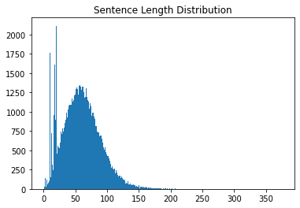
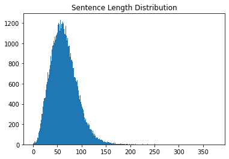
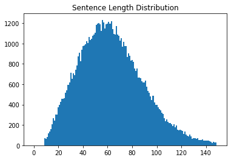

# 학습 내용

---

- 데이터 다운로드 및 분석
		- 학습 환경을 구성, 필요한 데이터 다운로드
- 공백 기반 토큰화
		- 공백 기반 토큰화 실습, 문제점 확인
- 형태소 기반 토큰화
		- KoNLPy, 그중에서도 가장 성능이 준수한 MeCab클래스 활용 실습

---

## 데이터 다운로드 및 분석

---

라이브러리 import

	'''

	import os

	import matplotlib.pyplot as plt
	import tensorflow as tf
	import numpy as np

	%matplotlib inline

	'''

데이터 다운

	'''

	# https://github.com/jungyeul/korean-parallel-corpora/raw/master/korean-english-news-v1/korean-english-park.train.tar.gz

	import os
	path_to_file = os.getenv('HOME')+'/aiffel/sp_tokenizer/data/korean-english-park.train.ko'

	with open(path_to_file, "r") as f:
	    raw = f.read().splitlines()

	print("Data Size:", len(raw))

	print("Example:")
	for sen in raw[0:100][::20]: print(">>", sen)

	'''

	결과:   Data Size: 94123
		Example:
		>> 개인용 컴퓨터 사용의 상당 부분은 "이것보다 뛰어날 수 있느냐?"
		>> 북한의 핵무기 계획을 포기하도록 하려는 압력이 거세지고 있는 가운데, 일본과 북한의 외교관들이 외교 관계를 정상화하려는 회담을 재개했다.
		>> "경호 로보트가 침입자나 화재를 탐지하기 위해서 개인적으로, 그리고 전문적으로 사용되고 있습니다."
		>> 수자원부 당국은 논란이 되고 있고, 막대한 비용이 드는 이 사업에 대해 내년에 건설을 시작할 계획이다.
		>> 또한 근력 운동은 활발하게 걷는 것이나 최소한 20분 동안 뛰는 것과 같은 유산소 활동에서 얻는 운동 효과를 심장과 폐에 주지 않기 때문에, 연구학자들은 근력 운동이 심장에 큰 영향을 미치는지 여부에 대해 논쟁을 해왔다.

문장의 최단 길이, 최장 길이, 평균 길이를 구한 후 문장 길이 분포 시각화

	'''

	min_len = 999
	max_len = 0
	sum_len = 0

	for sen in raw:
	    length = len(sen)
	    if min_len > length: min_len = length
	    if max_len < length: max_len = length
	    sum_len += length

	print("문장의 최단 길이:", min_len)
	print("문장의 최장 길이:", max_len)
	print("문장의 평균 길이:", sum_len // len(raw))

	sentence_length = np.zeros((max_len), dtype=int)

	for sen in raw:
	    sentence_length[len(sen)-1] += 1

	plt.bar(range(max_len), sentence_length, width=1.0)
	plt.title("Sentence Length Distribution")
	plt.show()

	'''

	결과:   문장의 최단 길이: 1
		문장의 최장 길이: 377
		문장의 평균 길이: 60

대체 길이가 1인 문장 확인

	'''

	def check_sentence_with_length(raw, length):
	    count = 0
    
	    for sen in raw:
	        if len(sen) == length:
	            print(sen)
	            count += 1
	            if count > 100: return

	check_sentence_with_length(raw, 1)

	'''

	결과: ’

문장의 수가 1500을 초과하는 문장 길이를 추출

	'''

	for idx, _sum in enumerate(sentence_length):
	    # 문장의 수가 1500을 초과하는 문장 길이를 추출합니다.
	    if _sum > 1500:
	        print("Outlier Index:", idx+1)

	'''

	결과:   Outlier Index: 11
		Outlier Index: 19
		Outlier Index: 21

길이가 11인 문장들 확인

	'''

	check_sentence_with_length(raw, 11)

	'''

	결과:   케냐 야생동물 고아원
		경유 1200원대로…
		더 내려야 하는 이유
		케냐 야생동물 고아원
		경유 1200원대로…
		더 내려야 하는 이유
		케냐 야생동물 고아원
			등등

중복을 제거한 후, 앞에서 분포를 확인

	'''

	min_len = 999
	max_len = 0
	sum_len = 0

	cleaned_corpus = list(set(raw))  # set를 사용해서 중복을 제거합니다.
	print("Data Size:", len(cleaned_corpus))

	for sen in cleaned_corpus:
	    length = len(sen)
	    if min_len > length: min_len = length
	    if max_len < length: max_len = length
	    sum_len += length

	print("문장의 최단 길이:", min_len)
	print("문장의 최장 길이:", max_len)
	print("문장의 평균 길이:", sum_len // len(cleaned_corpus))

	sentence_length = np.zeros((max_len), dtype=int)

	for sen in cleaned_corpus:   # 중복이 제거된 코퍼스 기준
	    sentence_length[len(sen)-1] += 1

	plt.bar(range(max_len), sentence_length, width=1.0)
	plt.title("Sentence Length Distribution")
	plt.show()

	'''

		-> 기본 자료형 set 활용해 중복 제거

	결과:   Data Size: 77591
		문장의 최단 길이: 1
		문장의 최장 길이: 377
		문장의 평균 길이: 64

길이가 10 미만, 길이 150 이상의 데이터 제거 후 시각화

	'''

	max_len = 150
	min_len = 10

	# 길이 조건에 맞는 문장만 선택합니다.
	filtered_corpus = [s for s in cleaned_corpus if (len(s) < max_len) & (len(s) >= min_len)]

	# 분포도를 다시 그려봅니다.
	sentence_length = np.zeros((max_len), dtype=int)

	for sen in filtered_corpus:
	    sentence_length[len(sen)-1] += 1

	plt.bar(range(max_len), sentence_length, width=1.0)
	plt.title("Sentence Length Distribution")
	plt.show()

	'''

