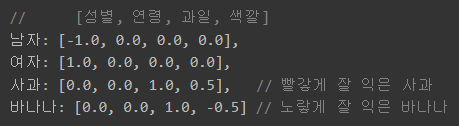
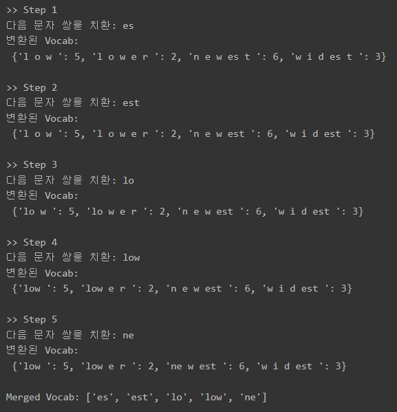

# 학습 내용

---

- 전처리: 자연어의 노이즈 제거
	- 자연어에 포함된 대표적인 세 가지 노이즈 유형 확인, 해결 방법학습
- 분산표현: 바나나와 사과의 관계를 어떻게 표현?
	- 분산표현이 무엇인지 희소표현과 같이 학습
- 토큰화: 그녀는? 그녀+는?
	- 대표적인 토큰화 기법인 공백, 형태소 기반 토큰화에 대해 학습
- 토큰화: 다른 방법들
	- OOV 문제를 해결한 BPE, BPE를 변형한 WPM에 대해 학습
- 토큰에게 의미를 부여하기
	- 토큰화 기법이 아닌 단어 간 의미를 찾는 대표적인 세 가지 유형 학습

---

## 전처리: 자연어의 노이즈 제거

---

이상적인 데이터의 형태

	교과서적인 문장들!

		-> 문법이나 언어 사용 관습의 일정한 패턴을 따른 텍스트 데이터

노이즈?

	

	->  위 그림과 같은 변형들이 자연어처리 모델 입장에서는 노이즈

이상적이지 않은 데이터에서의 노이즈

	- 불완전한 문장으로 구성된 대화의 경우
		- A: "아니아니" "오늘이 아니고" "내일이지" / B: "그럼 오늘 사야겠네. 내일 필요하니까?"
	- 문장의 길이가 너무 길거나 짧은 경우
		- A: "ㅋㅋㅋ", "ㅠㅠㅠ" / A: "이 편지는 영국에서부터 시작되어…"
	- 채팅 데이터에서 문장 시간 간격이 너무 긴 경우
		- A: "겨울왕국2" / B: "보러가자" / A: "엊그제 봤는데 잼씀" / B: "오늘 저ㄴ 아니 ㅡㅡ" / A: "나 10만원만 빌려줄 수 있어?" / …… / B: "아 미안 지금 봤다 아직 필요해?"

근본적인 노이즈

	- 문장부호 
		- Hi, my name is John. ("Hi," "my", ..., "John." 으로 분리됨)
	- 대소문자 
		- First, open the first chapter. (First와 first를 다른 단어로 인식)
	- 특수문자 
		- He is a ten-year-old boy. (ten-year-old를 한 단어로 인식)

1. 노이즈 유형 - 문장부호

	문장부호를 단어와 분리

	-> 문장부호 양쪽에 공백을 추가

	'''

	def pad_punctuation(sentence, punc):
	    for p in punc:
	        sentence = sentence.replace(p, " " + p + " ")

	    return sentence

	sentence = "Hi, my name is john."

	print(pad_punctuation(sentence, [".", "?", "!", ","]))

	'''

		-> replace() 라는 직관적인 함수 사용

	결과: Hi ,  my name is john . 

2. 노이즈 유형 -  대소문자

	First와 first 는 같은 의미를 갖고 있음에도 컴퓨터는 f와 F를 다르다고 구분 지어 버릴 수 있음

		->  모든 단어를 소문자로 바꾸는 방법

	'''

	sentence = "First, open the first chapter."

	print(sentence.lower())

	'''

	결과: first, open the first chapter.

		전체를 대문자로 바꾸어도 상관없음(upper() 함수 사용)

3. 노이즈 유형 - 특수문자

	사용할 알파벳과 기호들을 정의해 이를 제외하곤 모두 제거

	'''

	import re

	sentence = "He is a ten-year-old boy."
	sentence = re.sub("([^a-zA-Z.,?!])", " ", sentence)

	print(sentence)

	'''

	결과:  He is a ten year old boy.

문장을 정제하는 함수 정의

	'''

	# From The Project Gutenberg
	# (https://www.gutenberg.org/files/2397/2397-h/2397-h.htm)

	corpus = \
	"""
	In the days that followed I learned to spell in this uncomprehending way a great many words, among them pin, hat, cup and a few verbs like sit, stand and walk. 
	But my teacher had been with me several weeks before I understood that everything has a name.
	One day, we walked down the path to the well-house, attracted by the fragrance of the honeysuckle with which it was covered. 
	Some one was drawing water and my teacher placed my hand under the spout. 
	As the cool stream gushed over one hand she spelled into the other the word water, first slowly, then rapidly. 
	I stood still, my whole attention fixed upon the motions of her fingers. 
	Suddenly I felt a misty consciousness as of something forgotten—a thrill of returning thought; and somehow the mystery of language was revealed to me. 
	I knew then that "w-a-t-e-r" meant the wonderful cool something that was flowing over my hand. 
	That living word awakened my soul, gave it light, hope, joy, set it free! 
	There were barriers still, it is true, but barriers that could in time be swept away.
	""" 

	def cleaning_text(text, punc, regex):
	    # 노이즈 유형 (1) 문장부호 공백추가
	    for p in punc:
	        text = text.replace(p, " " + p + " ")

	    # 노이즈 유형 (2), (3) 소문자화 및 특수문자 제거
	    text = re.sub(regex, " ", text).lower()

	    return text

	print(cleaning_text(corpus, [".", ",", "!", "?"], "([^a-zA-Z0-9.,?!\n])"))

	'''

	결과:   in the days that followed i learned to spell in this uncomprehending way a great many words ,  among them pin ,  hat ,  cup and a few verbs like sit ,  stand and walk .  
		but my teacher had been with me several weeks before i understood that everything has a name . 
		one day ,  we walked down the path to the well house ,  attracted by the fragrance of the honeysuckle with which it was covered .  
		some one was drawing water and my teacher placed my hand under the spout .  
		as the cool stream gushed over one hand she spelled into the other the word water ,  first slowly ,  then rapidly .  
		i stood still ,  my whole attention fixed upon the motions of her fingers .  
		suddenly i felt a misty consciousness as of something forgotten a thrill of returning thought  and somehow the mystery of language was revealed to me .  
		i knew then that  w a t e r  meant the wonderful cool something that was flowing over my hand .  
		that living word awakened my soul ,  gave it light ,  hope ,  joy ,  set it free !  
		there were barriers still ,  it is true ,  but barriers that could in time be swept away . 

---

## 분산표현 : 바나나와 사과의 관계를 어떻게 표현할까?

---

희소 표현

	One-Hot-Incoding

희소 표현의 단점

	- 불필요한 메모리와 연산량이 낭비
	- 워드 벡터끼리는 단어들 간의 의미적 유사도를 계산할 수 없음

분산 표현

	추상적인 속성들이 정의된 차원 안에 골고루 분산되어 표현

		ex) embedding_layer = tf.keras.layers.Embedding(input_dim=100, output_dim=256)

---

## 토큰화 : 그녀는? 그녀+는?

---

토큰화 기법?

	한 문장에서 단어의 수를 결정하는 기법

공백 기반 토큰화

	 공백을 기반으로 토큰화를 진행

	'''

	corpus = \
	"""
	in the days that followed i learned to spell in this uncomprehending way a great many words ,  among them pin ,  hat ,  cup and a few verbs like sit ,  stand and walk .  
	but my teacher had been with me several weeks before i understood that everything has a name . 
	one day ,  we walked down the path to the well house ,  attracted by the fragrance of the honeysuckle with which it was covered .  
	some one was drawing water and my teacher placed my hand under the spout .  
	as the cool stream gushed over one hand she spelled into the other the word water ,  first slowly ,  then rapidly .  
	i stood still ,  my whole attention fixed upon the motions of her fingers .  
	suddenly i felt a misty consciousness as of something forgotten a thrill of returning thought  and somehow the mystery of language was revealed to me .  
	i knew then that  w a t e r  meant the wonderful cool something that was flowing over my hand .  
	that living word awakened my soul ,  gave it light ,  hope ,  joy ,  set it free !  
	there were barriers still ,  it is true ,  but barriers that could in time be swept away . 
	"""

	tokens = corpus.split()

	print("문장이 포함하는 Tokens:", tokens)

	'''

	결과: 문장이 포함하는 Tokens: ['in', 'the', 'days', 'that', 'followed', 'i', 'learned', 'to', 'spell', 'in', 'this', 'uncomprehending', 'way', 'a', 'great', 'many', 'words', ',', 'among', 'them', 'pin', ',', 'hat', ',', 'cup', 'and', 'a', 'few', 'verbs', 'like', 'sit', ',', 'stand', 'and', 'walk', '.', 'but', 'my', 'teacher', 'had', 'been', 'with', 'me', 'several', 'weeks', 'before', 'i', 'understood', 'that', 'everything', 'has', 'a', 'name', '.', 'one', 'day', ',', 'we', 'walked', 'down', 'the', 'path', 'to', 'the', 'well', 'house', ',', 'attracted', 'by', 'the', 'fragrance', 'of', 'the', 'honeysuckle', 'with', 'which', 'it', 'was', 'covered', '.', 'some', 'one', 'was', 'drawing', 'water', 'and', 'my', 'teacher', 'placed', 'my', 'hand', 'under', 'the', 'spout', '.', 'as', 'the', 'cool', 'stream', 'gushed', 'over', 'one', 'hand', 'she', 'spelled', 'into', 'the', 'other', 'the', 'word', 'water', ',', 'first', 'slowly', ',', 'then', 'rapidly', '.', 'i', 'stood', 'still', ',', 'my', 'whole', 'attention', 'fixed', 'upon', 'the', 'motions', 'of', 'her', 'fingers', '.', 'suddenly', 'i', 'felt', 'a', 'misty', 'consciousness', 'as', 'of', 'something', 'forgotten', 'a', 'thrill', 'of', 'returning', 'thought', 'and', 'somehow', 'the', 'mystery', 'of', 'language', 'was', 'revealed', 'to', 'me', '.', 'i', 'knew', 'then', 'that', 'w', 'a', 't', 'e', 'r', 'meant', 'the', 'wonderful', 'cool', 'something', 'that', 'was', 'flowing', 'over', 'my', 'hand', '.', 'that', 'living', 'word', 'awakened', 'my', 'soul', ',', 'gave', 'it', 'light', ',', 'hope', ',', 'joy', ',', 'set', 'it', 'free', '!', 'there', 'were', 'barriers', 'still', ',', 'it', 'is', 'true', ',', 'but', 'barriers', 'that', 'could', 'in', 'time', 'be', 'swept', 'away', '.']

형태소 기반 토큰화

	뜻을 가진 가장 작은 말의 단위인 형태소를 기반으로 토큰화 진행

	한국어 형태소 분석기

		- KoNLPy
			- 내부적으로 5가지의 형태소 분석 Class를 포함

	'''

	from konlpy.tag import Hannanum,Kkma,Komoran,Mecab,Okt

	tokenizer_list = [Hannanum(),Kkma(),Komoran(),Mecab(),Okt()]

	kor_text = '코로나바이러스는 2019년 12월 중국 우한에서 처음 발생한 뒤 전 세계로 확산된, 새로운 유형의 호흡기 감염 질환입니다.'

	for tokenizer in tokenizer_list:
	    print('[{}] \n{}'.format(tokenizer.__class__.__name__, tokenizer.pos(kor_text)))

	'''

	결과:   [Hannanum] 
		[('코로나바이러스', 'N'), ('는', 'J'), ('2019년', 'N'), ('12월', 'N'), ('중국', 'N'), ('우한', 'N'), ('에서', 'J'), ('처음', 'M'), ('발생', 'N'), ('하', 'X'), ('ㄴ', 'E'), ('뒤', 'N'), ('전', 'N'), ('세계', 'N'), ('로', 'J'), ('확산', 'N'), ('되', 'X'), ('ㄴ', 'E'), (',', 'S'), ('새롭', 'P'), ('은', 'E'), ('유형', 'N'), ('의', 'J'), ('호흡기', 'N'), ('감염', 'N'), ('질환', 'N'), ('이', 'J'), ('ㅂ니다', 'E'), ('.', 'S')]
		[Kkma] 
		[('코로나', 'NNG'), ('바', 'NNG'), ('이러', 'MAG'), ('슬', 'VV'), ('는', 'ETD'), ('2019', 'NR'), ('년', 'NNM'), ('12', 'NR'), ('월', 'NNM'), ('중국', 'NNG'), ('우', 'NNG'), ('하', 'XSV'), ('ㄴ', 'ETD'), ('에', 'VV'), ('서', 'ECD'), ('처음', 'NNG'), ('발생', 'NNG'), ('하', 'XSV'), ('ㄴ', 'ETD'), ('뒤', 'NNG'), ('전', 'NNG'), ('세계', 'NNG'), ('로', 'JKM'), ('확산', 'NNG'), ('되', 'XSV'), ('ㄴ', 'ETD'), (',', 'SP'), ('새', 'NNG'), ('롭', 'XSA'), ('ㄴ', 'ETD'), ('유형', 'NNG'), ('의', 'JKG'), ('호흡기', 'NNG'), ('감염', 'NNG'), ('질환', 'NNG'), ('이', 'VCP'), ('ㅂ니다', 'EFN'), ('.', 'SF')]
		[Komoran] 
		[('코로나바이러스', 'NNP'), ('는', 'JX'), ('2019', 'SN'), ('년', 'NNB'), ('12월', 'NNP'), ('중국', 'NNP'), ('우', 'NNP'), ('한', 'NNP'), ('에서', 'JKB'), ('처음', 'NNG'), ('발생', 'NNG'), ('하', 'XSV'), ('ㄴ', 'ETM'), ('뒤', 'NNG'), ('전', 'MM'), ('세계로', 'NNP'), ('확산', 'NNG'), ('되', 'XSV'), ('ㄴ', 'ETM'), (',', 'SP'), ('새롭', 'VA'), ('ㄴ', 'ETM'), ('유형', 'NNP'), ('의', 'JKG'), ('호흡기', 'NNG'), ('감염', 'NNP'), ('질환', 'NNG'), ('이', 'VCP'), ('ㅂ니다', 'EF'), ('.', 'SF')]
		[Mecab] 
		[('코로나', 'NNP'), ('바이러스', 'NNG'), ('는', 'JX'), ('2019', 'SN'), ('년', 'NNBC'), ('12', 'SN'), ('월', 'NNBC'), ('중국', 'NNP'), ('우한', 'NNP'), ('에서', 'JKB'), ('처음', 'NNG'), ('발생', 'NNG'), ('한', 'XSV+ETM'), ('뒤', 'NNG'), ('전', 'NNG'), ('세계', 'NNG'), ('로', 'JKB'), ('확산', 'NNG'), ('된', 'XSV+ETM'), (',', 'SC'), ('새로운', 'VA+ETM'), ('유형', 'NNG'), ('의', 'JKG'), ('호흡기', 'NNG'), ('감염', 'NNG'), ('질환', 'NNG'), ('입니다', 'VCP+EF'), ('.', 'SF')]
		[Okt] 
		[('코로나바이러스', 'Noun'), ('는', 'Josa'), ('2019년', 'Number'), ('12월', 'Number'), ('중국', 'Noun'), ('우한', 'Noun'), ('에서', 'Josa'), ('처음', 'Noun'), ('발생', 'Noun'), ('한', 'Josa'), ('뒤', 'Noun'), ('전', 'Noun'), ('세계', 'Noun'), ('로', 'Josa'), ('확산', 'Noun'), ('된', 'Verb'), (',', 'Punctuation'), ('새로운', 'Adjective'), ('유형', 'Noun'), ('의', 'Josa'), ('호흡기', 'Noun'), ('감염', 'Noun'), ('질환', 'Noun'), ('입니다', 'Adjective'), ('.', 'Punctuation')]

사전에 없는 단어의 문제

	자주 등장한 상위 N개의 단어만 사용하고 나머지는 <unk>같은 특수한 토큰(Unknown Token)으로 치환

		ex) <unk>는 2019년 12월 중국 <unk>에서 처음 발생한 뒤 전 세계로 확산된, 새로운 유형의 호흡기 감염 질환입니다.

	-> OOV(Out-Of-Vocabulary) 문제

---

## 토큰화 : 다른 방법들

---

Wordpiece Model(WPM)?

	한 단어를 여러 개의 Subword의 집합으로 보는 방법

		-> pre+view, pre+dict

Byte Pair Encoding(BPE)

	가장 많이 등장하는 바이트 쌍(Byte Pair) -> 새로운 단어로 치환하는 방법

	

	장점

	- 자주 등장하는 문자 쌍을 합치면, 접두어나 접미어의 의미를 캐치
	- 처음 등장하는 단어는 문자(알파벳)들의 조합 -> OOV 문제를 완전히 해결
	- 아무리 큰 데이터도 원하는 크기로 OOV 문제없이 사전을 정의 가능

	'''

	import re, collections

	# 임의의 데이터에 포함된 단어들입니다.
	# 우측의 정수는 임의의 데이터에 해당 단어가 포함된 빈도수입니다.
	vocab = {
	    'l o w '      : 5,
	    'l o w e r '  : 2,
	    'n e w e s t ': 6,
	    'w i d e s t ': 3
	}

	num_merges = 5

	def get_stats(vocab):
	    """
	    단어 사전을 불러와
	    단어는 공백 단위로 쪼개어 문자 list를 만들고
	    빈도수와 쌍을 이루게 합니다. (symbols)
	    """
	    pairs = collections.defaultdict(int)
    
	    for word, freq in vocab.items():
	        symbols = word.split()

	        for i in range(len(symbols) - 1):             # 모든 symbols를 확인하여 
	            pairs[symbols[i], symbols[i + 1]] += freq  # 문자 쌍의 빈도수를 저장합니다. 
        
	    return pairs

	def merge_vocab(pair, v_in):
	    """
	    문자 쌍(pair)과 단어 리스트(v_in)를 입력받아
	    각각의 단어에서 등장하는 문자 쌍을 치환합니다.
	    (하나의 글자처럼 취급)
	    """
	    v_out = {}
	    bigram = re.escape(' '.join(pair))
	    p = re.compile(r'(?<!\S)' + bigram + r'(?!\S)')
    
	    for word in v_in:
	        w_out = p.sub(''.join(pair), word)
	        v_out[w_out] = v_in[word]
        
	    return v_out, pair[0] + pair[1]

	token_vocab = []

	for i in range(num_merges):
	    print(">> Step {0}".format(i + 1))
    
	    pairs = get_stats(vocab)
	    best = max(pairs, key=pairs.get)  # 가장 많은 빈도수를 가진 문자 쌍을 반환합니다.
	    vocab, merge_tok = merge_vocab(best, vocab)
	    print("다음 문자 쌍을 치환:", merge_tok)
	    print("변환된 Vocab:\n", vocab, "\n")
    
	    token_vocab.append(merge_tok)
    
	print("Merged Vocab:", token_vocab)

	'''

	결과:

Wordpiece Model(WPM)

	구글에서 BPE를 변형해 제안한 알고리즘

	BPE에 대해 두 가지 차별성

	- 공백 복원을 위해 단어의 시작 부분에 언더바 _ 를 추가
		- [_i, _am, _a, _b, o, y, _a, n, d, _you, _are, _a, _gir, l]
	- 빈도수 기반이 아닌 가능도(Likelihood)를 증가시키는 방향으로 문자 쌍을 합침 (더 '그럴듯한' 토큰을 만들어냄)

구글에서 WPM를 만든 이유

	한국어, 일본어 텍스트 처리를 위해!

	
WPM 장점

	- 한국어 같은 모델의 토크나이저로 WPM이 좋은 대안이 될 수 있음
	- 어떤 언어든 무관하게 적용 가능한 language-neutral하고 general한 기법
		- 훨씬 활용도가 큼

WPM 단점

	아쉽게도 공개되어 있지 않음

해결 방법

	구글의 SentencePiece 라이브러리를 통해 고성능의 BPE를 사용할 수 있음

SentencePiece의 장점

	전처리 과정도 포함되어 있어서, 데이터를 따로 정제할 필요가 없어 간편

---

soynlp?

	한국어를 위한 토크나이저

		-> 단어 추출, 품사 판별, 전처리 기능도 제공

soynlp의 토크나이저 지향점

	학습데이터를 이용하지 않으면서 데이터에 존재하는 단어를 찾거나, 문장을 단어열로 분해, 혹은 품사 판별을 할 수 있는 비지도학습 접근법을 지향

		-> 문장에서 처음 단어를 받아들일 때 단어의 경계를 알아야 올바르게 토큰화 가능 

			-> 이때 단어의 경계를 비지도학습을 통해 결정하겠다는 말

	-> 통계 기반 토크나이저로 분류하기도 함

---

## 토큰에게 의미를 부여하기

---

Word2Vec?

	동시에 등장하는 단어끼리는 연관성이 있다는 아이디어로 시작된 알고리즘

두가지 방식

	- CBOW(Continuous Bag of Words)
		- 대용량 데이터에 더 빠르고 적합할 수 있음
	- Skip-Gram
		- 소규모 데이터나 희소 단어가 많은 상황에 더 나은 성능을 보일 가능성이 큼

Word2Vec은 딥러닝 모델이 아닌 이유??

	은닉층이 1개인 얕은 신경망(shallow neural network)

---

FastText

Word2Vec 문제점

	연산의 빈부격차가 존재

		ex) 자주 등장하지 않는 단어

			-> 최악의 경우 단 한 번의 연산만을 거쳐 랜덤하게 초기화된 값과 크게 다르지 않은 상태로 알고리즘이 종료

FastText의 해결 방법

	BPE와 비슷한 아이디어를 적용

---

ELMo - the 1st Contextualized Word Embedding

Word Embedding 알고리즘들의 문제점

	고정적

		-> 동음이의어를 처리할 수 없다!!!

Contextualized Word Embedding?

	단어의 의미 벡터를 구하기 위해서는 그 단어가 사용된 주변 단어의 맥락을 넘어서 사용된 시퀀스 전체의 맥락이 함께 고려되는 Word Embedding이 필요한 것

Q. 양방향 LSTM을 활용한 ELMo 모델에서 Contextual Word Embedding이 되는 벡터는 어떤 벡터 3가지를 합쳐서 얻어지나?

	A. 기존 어휘 임베딩(입력 토큰의 word vector), 순방향 LSTM의 hidden state vector, 역방향 LSTM의 hidden state vector

Contextualized Word Embedding이 사용된 모델

	ELMo나 BERT 등에 많이 사용됨
