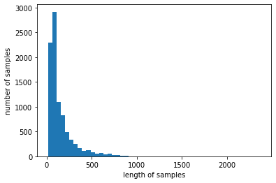
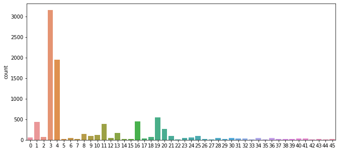
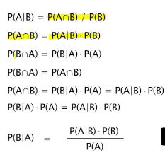
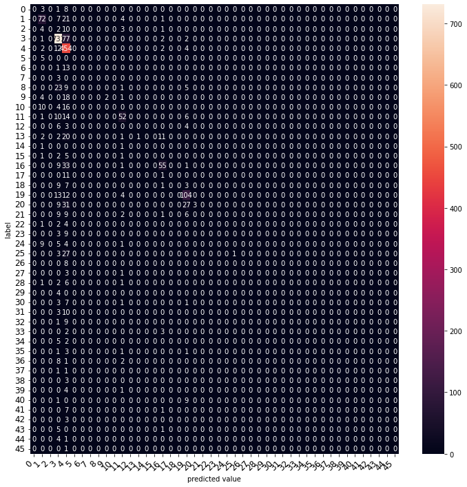

# 학습 내용

---

- 머신러닝을 이용한 텍스트 분류
- 로이터 뉴스 데이터 (1) 데이터 확인
	- 데이터 확인, 분포 확인
- 로이터 뉴스 데이터 (2) 데이터 복원
	- 원본 뉴스 데이터로 복원
- 벡터화
	- 벡터화를 진행
- 나이브 베이즈 분류기
	- 사이킷런을 통한 나이브 베이즈 분류기 학습
- F1-Score, Confusion Matrix
	- 다양한 성능 평가 지표 학습
- 다양한 머신러닝 모델 사용 (1)
	- 좋은 성능을 얻기 위한 여러 다른 모델들 학습
- 다양한 머신러닝 모델 사용 (2)
	- 좋은 성능을 얻기 위한 여러 다른 모델들 학습

---

## 머신러닝을 이용한 텍스트 분류

---

텍스트 분류(Text Classification)??

	주어진 텍스트를 사전 정의된 클래스(Pre-defined Class)들로 분류하는 자연어 처리 태스크

		-> 자연어 처리 태스크 중 가장 기본, 비즈니스 영역에서도 가장 수요가 높음

	- '스팸 메일 자동 분류'
	- '사용자의 리뷰로부터 긍정, 부정을 판단하는 감성 분류'
	- '포털 사이트가 언론사의 뉴스들을 문화, 정치 등으로 자동 분류하여 보여주는 뉴스 카테고리 분류' 등등

텍스트 분류의 AI 알고리즘을 통한 일반적인 과정

	1. 문장 | 문서 벡터화
	2. AI 모델에 입력
	3. 예측한 카테고리 리턴

대표적인 텍스트 분류

	- 클래스가 2개인 경우인 이진 분류(Binary Classification)
	- 클래스 3개 이상인 경우인 다중 클래스 분류(Multiclass Classification)

---

## 로이터 뉴스 데이터 (1) 데이터 확인

---

사용할 데이터

	로이터 뉴스 데이터

		-> 46개의 클래스로 구성

필요한 라이브러리 import

	'''

	from tensorflow.keras.datasets import reuters
	import matplotlib.pyplot as plt
	import seaborn as sns
	import numpy as np
	import pandas as pd

	'''

훈련 데이터와 테스트 데이터 로드

	'''

	(x_train, y_train), (x_test, y_test) = reuters.load_data(num_words=10000, test_split=0.2)
	
	print('훈련 샘플의 수: {}'.format(len(x_train)))
	print('테스트 샘플의 수: {}'.format(len(x_test)))
	
	'''

		-> 1~10,000번 단어만 사용

	결과: 훈련 샘플의 수: 8982
	      테스트 샘플의 수: 2246

데이터 분포 확인

	'''

	print('훈련용 뉴스의 최대 길이 :{}'.format(max(len(l) for l in x_train)))
	print('훈련용 뉴스의 평균 길이 :{}'.format(sum(map(len, x_train))/len(x_train)))

	plt.hist([len(s) for s in x_train], bins=50)
	plt.xlabel('length of samples')
	plt.ylabel('number of samples')
	plt.show()

	'''

	결과: 훈련용 뉴스의 최대 길이 :2376
	      훈련용 뉴스의 평균 길이 :145.5398574927633

레이블 분포 확인

	'''

	fig, axe = plt.subplots(ncols=1)
	fig.set_size_inches(11,5)
	sns.countplot(x=y_train)
	plt.show()

	'''

	결과:

---

## 로이터 뉴스 데이터 (2) 데이터 복원

---

원본 뉴스 데이터로 복원

	정수 시퀀스로 변환된 데이터를 '굳이' 다시 텍스트로 변환

로이터 뉴스 데이터

	'단어'를 key값으로, 고유한 '정수'를 value로 가지는 dictionary를 제공

word_index 저장

	'''

	word_index = reuters.get_word_index(path="reuters_word_index.json")

	'''

특별한 토큰들

	0번, 1번, 2번 -> <pad>, <sos>, <unk>

	'''

	index_to_word = { index+3 : word for word, index in word_index.items() }

	# index_to_word에 숫자 0은 <pad>, 숫자 1은 <sos>, 숫자 2는 <unk>를 넣어줍니다.
	for index, token in enumerate(("<pad>", "<sos>", "<unk>")):
	  index_to_word[index]=token

	'''

단어장(Vocabulary)?

	기계가 알고 있는 단어들의 집합

OOV(Out-Of-Vocabulary) 또는 UNK(Unknown)?

	기계가 미처 배우지 못한 모르는 단어

		 모르는 단어로 판단 -> <unk>라는 일관된 특별 토큰으로 변환

텍스트 데이터로 변환

	'''

	decoded = []
	for i in range(len(x_train)):
	    t = ' '.join([index_to_word[index] for index in x_train[i]])
	    decoded.append(t)

	x_train = decoded

	decoded = []
	for i in range(len(x_test)):
	    t = ' '.join([index_to_word[index] for index in x_test[i]])
	    decoded.append(t)

	x_test = decoded

	'''

---

## 벡터화

---

필요한 라이브러리 import

	'''

	from sklearn.feature_extraction.text import CountVectorizer
	from sklearn.feature_extraction.text import TfidfTransformer

	'''

사용할 벡터화 방법

	 Bag of Words 가설을 기반으로 하는 DTM, TF-IDF 행렬

DTM 생성, DTM 크기 확인

	'''

	dtmvector = CountVectorizer()
	x_train_dtm = dtmvector.fit_transform(x_train)
	print(x_train_dtm.shape)

	'''

	결과: (8982, 9670)

		-> (훈련 데이터셋 수, 단어수)

TF-IDF Matrix 생성

	'''

	tfidf_transformer = TfidfTransformer()
	tfidfv = tfidf_transformer.fit_transform(x_train_dtm)
	print(tfidfv.shape)

	'''

	결과: (8982, 9670)

		-> 추가적인 전처리를 하지 않는 이상, DTM과 동일한 크기를 가짐

---

## 나이브 베이즈 분류기

---

필요한 라이브러리 import 

	'''

	from sklearn.naive_bayes import MultinomialNB #다항분포 나이브 베이즈 모델
	from sklearn.linear_model import LogisticRegression, SGDClassifier
	from sklearn.naive_bayes import ComplementNB
	from sklearn.tree import DecisionTreeClassifier
	from sklearn.ensemble import RandomForestClassifier
	from sklearn.ensemble import GradientBoostingClassifier
	from sklearn.ensemble import VotingClassifier
	from sklearn.svm import LinearSVC
	from sklearn.metrics import accuracy_score #정확도 계산

	'''

나이브 베이즈 분류기(Multinomial Naive Bayes Classifier)

나이브 베이즈 분류기 모델 정의 및 훈련

	'''

	model = MultinomialNB()
	model.fit(tfidfv, y_train)

	'''

정확도 측정

	'''

	x_test_dtm = dtmvector.transform(x_test) #테스트 데이터를 DTM으로 변환
	tfidfv_test = tfidf_transformer.transform(x_test_dtm) #DTM을 TF-IDF 행렬로 변환

	predicted = model.predict(tfidfv_test) #테스트 데이터에 대한 예측
	print("정확도:", accuracy_score(y_test, predicted)) #예측값과 실제값 비교

	'''

	결과: 정확도: 0.6567230632235085

---

## F1-Score, Confusion Matrix

---

필요한 라이브러리 import

	'''

	from sklearn.metrics import classification_report
	from sklearn.metrics import confusion_matrix

	'''

정밀도, 재현율, F1점수 계산

	'''

	print(classification_report(y_test, model.predict(tfidfv_test), zero_division=0))

	'''

	결과:                   precision    recall  f1-score   support

	                   0       0.00      0.00      0.00        12
	                   1       0.62      0.69      0.65       105
	                   2       0.00      0.00      0.00        20
	                   3       0.81      0.90      0.85       813
	                   4       0.51      0.96      0.67       474
	                   5       0.00      0.00      0.00         5
	                   6       0.00      0.00      0.00        14
	           	   7       0.00      0.00      0.00         3
		           8       0.00      0.00      0.00        38
		           9       1.00      0.08      0.15        25
		          10       0.00      0.00      0.00        30
		          11       0.66      0.63      0.64        83
		          12       0.00      0.00      0.00        13
		          13       1.00      0.03      0.05        37
		          14       0.00      0.00      0.00         2
		          15       0.00      0.00      0.00         9
		          16       0.69      0.56      0.61        99
		          17       0.00      0.00      0.00        12
		          18       0.00      0.00      0.00        20
		          19       0.60      0.78      0.68       133
		          20       1.00      0.04      0.08        70
		          21       0.00      0.00      0.00        27
		          22       0.00      0.00      0.00         7
		          23       0.00      0.00      0.00        12
		          24       0.00      0.00      0.00        19
	        	  25       1.00      0.03      0.06        31
		          26       0.00      0.00      0.00         8
		          27       0.00      0.00      0.00         4
		          28       0.00      0.00      0.00        10
	        	  29       0.00      0.00      0.00         4
		          30       0.00      0.00      0.00        12
		          31       0.00      0.00      0.00        13
		          32       0.00      0.00      0.00        10
 		          33       0.00      0.00      0.00         5
		          34       0.00      0.00      0.00         7
		          35       0.00      0.00      0.00         6
		          36       0.00      0.00      0.00        11
		          37       0.00      0.00      0.00         2
		          38       0.00      0.00      0.00         3
		          39       0.00      0.00      0.00         5
		          40       0.00      0.00      0.00        10
		          41       0.00      0.00      0.00         8
		          42       0.00      0.00      0.00         3
		          43       0.00      0.00      0.00         6
		          44       0.00      0.00      0.00         5
	 	          45       0.00      0.00      0.00         1

		    accuracy                           0.66      2246
		   macro avg       0.17      0.10      0.10      2246
		weighted avg       0.59      0.66      0.58      2246

			    macro: 단순평균
			 -> weighted: 각 클래스에 속하는 표본의 개수로 가중평균
			    accuracy: 정확도. 전체 학습 데이터의 개수에서 클래스를 정확하게 맞춘 개수의 비율

Confusion Matrix 시각화

	'''

	def graph_confusion_matrix(model, x_test, y_test):#, classes_name):
	  df_cm = pd.DataFrame(confusion_matrix(y_test, model.predict(x_test)))#, index=classes_name, columns=classes_name)
	  fig = plt.figure(figsize=(12,12))
	  heatmap = sns.heatmap(df_cm, annot=True, fmt="d")
	  heatmap.yaxis.set_ticklabels(heatmap.yaxis.get_ticklabels(), rotation=0, ha='right', fontsize=12)
	  heatmap.xaxis.set_ticklabels(heatmap.xaxis.get_ticklabels(), rotation=45, ha='right', fontsize=12)
	  plt.ylabel('label')
	  plt.xlabel('predicted value')

	graph_confusion_matrix(model, tfidfv_test, y_test)

	'''

	결과:

---

## 다양한 머신러닝 모델 사용 (1)

---

Complement Naive Bayes Classifier(CNB)

	데이터의 불균형을 고려하여 가중치를 부여하는 특징

	'''

	cb = ComplementNB()
	cb.fit(tfidfv, y_train)

	predicted = cb.predict(tfidfv_test) #테스트 데이터에 대한 예측
	print("정확도:", accuracy_score(y_test, predicted)) #예측값과 실제값 비교

	'''

	결과: 정확도: 0.7707034728406055

로지스틱 회귀(Logistic Regression)

	소프트맥스(softmax) 함수를 사용한 다중 클래스 분류 알고리즘을 지원

		-> 소프트맥스 회귀(Softmax Regression)

	소프트맥스 함수?

		-> 클래스가 N개일 때, N차원의 벡터가 '각 클래스가 정답일 확률'을 표현하도록 정규화해주는 함수

	'''

	lr = LogisticRegression(C=10000, penalty='l2', max_iter=3000)
	lr.fit(tfidfv, y_train)

	predicted = lr.predict(tfidfv_test) #테스트 데이터에 대한 예측
	print("정확도:", accuracy_score(y_test, predicted)) #예측값과 실제값 비교

	'''

	결과: 정확도: 0.8107747105966162

선형 서포트 벡터 머신(Linear Support Vector Machine)

	대표적인 선형 분류 알고리즘

		-> 이진 분류 모델

	이진 분류 알고리즘을 다중 클래스 분류 알고리즘으로 사용하는 방법

		-> 일대다(one-vs.-rest 또는 one-vs.-all) 방법

			->  각 클래스를 다른 모든 클래스와 구분하도록 이진 분류 모델을 학습

	'''

	lsvc = LinearSVC(C=1000, penalty='l1', max_iter=3000, dual=False)
	lsvc.fit(tfidfv, y_train)

	# Linear SVC 테스트 데이터에 대한 예측해보세요
	predicted = lsvc.predict(tfidfv_test) #테스트 데이터에 대한 예측
	print("정확도:", accuracy_score(y_test, predicted)) #예측값과 실제값 비교

	'''

	결과: 정확도: 0.7853962600178095

---

## 다양한 머신러닝 모델 사용 (2)

---

결정 트리(Decision Tree)

	분류와 회귀 문제에 널리 사용하는 모델

	'''

	tree = DecisionTreeClassifier(max_depth=10, random_state=0)
	tree.fit(tfidfv, y_train)

	predicted = tree.predict(tfidfv_test) #테스트 데이터에 대한 예측
	print("정확도:", accuracy_score(y_test, predicted)) #예측값과 실제값 비교

	'''

	결과: 정확도: 0.6202137132680321

		-> 고차원이고 희소한 데이터에 대해서는 성능이 나오지 않는다는 특징

랜덤 포레스트(Random Forest)

	여러 머신러닝 모델을 연결하여 더 강력한 모델을 만드는 기법

	'''

	forest = RandomForestClassifier(n_estimators=5, random_state=0)
	forest.fit(tfidfv, y_train)

	predicted = forest.predict(tfidfv_test) #테스트 데이터에 대한 예측
	print("정확도:", accuracy_score(y_test, predicted)) #예측값과 실제값 비교

	'''

	결과: 정확도: 0.674087266251113

그래디언트 부스팅 트리(GradientBoostingClassifier)

	- 여러 개의 결정 트리를 묶어 만드는 앙상블 모델
		- 랜덤 포레스트와 다르게 이전 트리의 오차를 보완하는 방식으로 순차적으로 트리 생성
	- 일부 특성을 무시한다는 특징
	- 일반적으로 1 ~ 5 정도의 깊지 않은 트리를 사용
		- 메모리도 적게 사용하고 예측도 빠름
	- 단점
		- 훈련 시간의 속도가 좀 오래 걸림
		- 트리 기반 모델의 특성으로 인해서 희소한 고차원 데이터에 대해서는 잘 동작하지 않는다는 단점

	'''

	grbt = GradientBoostingClassifier(random_state=0) # verbose=3
	grbt.fit(tfidfv, y_train)

	predicted = grbt.predict(tfidfv_test) #테스트 데이터에 대한 예측
	print("정확도:", accuracy_score(y_test, predicted)) #예측값과 실제값 비교

	'''

	결과: 정확도: 0.7662511130899377

보팅(Voting)

	앙상블 모델중 투표를 통해 결과를 도출하는 모델

	'''

	# 개별 분류기 정의
	log_reg = LogisticRegression(penalty='l2', solver='liblinear')
	complement_nb = ComplementNB()
	gradient_boost = GradientBoostingClassifier()

	# VotingClassifier 정의
	voting_classifier = VotingClassifier(
	    estimators=[('lr', log_reg), ('cnb', complement_nb), ('gb', gradient_boost)],
	    voting='soft'
	)

	voting_classifier.fit(tfidfv, y_train)

	predicted = voting_classifier.predict(tfidfv_test) #테스트 데이터에 대한 예측
	print("정확도:", accuracy_score(y_test, predicted)) #예측값과 실제값 비교

	'''

	결과: 정확도: 0.796527159394479
