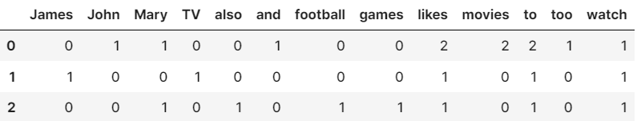
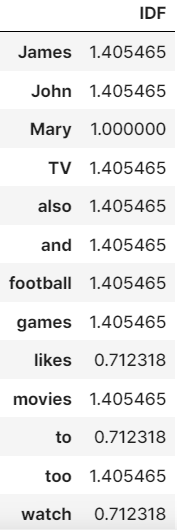
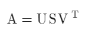
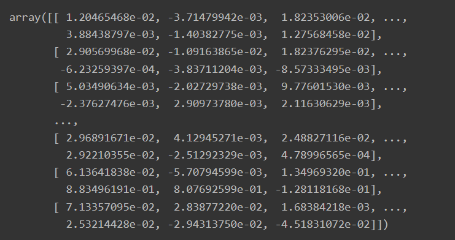
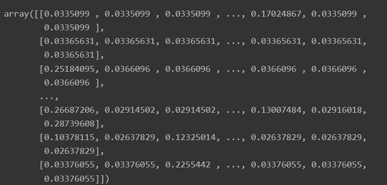

# 학습 내용

---

- 단어 빈도를 이용한 벡터화 (1) Bag of Words
	- 전처리 과정에서 텍스트를 숫자 벡터로 변환하는 벡터화(Vectorization) 과정 학습
- 단어 빈도를 이용한 벡터화 (2) Bag of Words 구현
	- 벡터화(Vectorization) 방법 중 통계와 머신 러닝을 활용한 방법 학습
- 단어 빈도를 이용한 벡터화 (3) DTM과 코사인 유사도
	- 코사인 유사도 학습
- 단어 빈도를 이용한 벡터화 (4) DTM의 구현, 한계점
	- DTM(Document-Term Matrix)이 가지고 있는 두 가지 한계점 학습
- 단어 빈도를 이용한 벡터화 (5) TF-IDF
	- 단어의 중요도를 판단하여 가중치를 주는 방법인 TF-IDF 학습
- 단어 빈도를 이용한 벡터화 (6) TF-IDF 구현
	- TF-IDF 구현
- LSA와 LDA (1) LSA
	- DTM이나 TF-IDF의 문제점을 해결할 수 있는 LSA(Latent Semantic Analysis) 학습
- LSA와 LDA (2) LSA 실습
	- LSA(Latent Semantic Analysis) 실습
- LSA와 LDA (3) LDA
	- LDA(Latent Dirichlet Allocation) 학습
- LSA와 LDA (4) LDA 실습
	- LDA(Latent Dirichlet Allocation) 실습
- 텍스트 분포를 이용한 비지도 학습 토크나이저 (1) 형태소 분석기와 단어 미등록 문제
	- 텍스트의 분포를 이용해서 토큰화를 수행하는 비지도 학습 토크나이저 학습
- 텍스트 분포를 이용한 비지도 학습 토크나이저 (2) soynlp
	- 품사 태깅, 형태소 분석 등을 지원하는 한국어 형태소 분석기 soynlp 학습

---

## 단어 빈도를 이용한 벡터화 (1) Bag of Words

---

머신러닝 모델

	기계이기 때문 ->  텍스트보다는 수치화된 숫자를 더 잘 처리

벡터화(Vectorization)?

	텍스트 -> 숫자 벡터로 변환

벡터화 방법

	- 통계와 머신 러닝을 활용한 방법
	- 인공 신경망을 활용하는 방법

Bag of Words??

	자연어 처리(Natural Language Processing)나 정보 검색(Information Retrieval)에서 쓰이는 매우 간단한 단어 표현 방법

		-> 문서 내의 단어들의 분포를 보고 이 문서의 특성을 파악하는 기법(BoW)

	 Bag of Words는 문서를 단어들의 가방으로 가정

	1. 어떤 한 문서에 등장하는 텍스트를 전부 단어 단위로 토큰화(tokenization)
	2. 이 단어들을 전부 가방에 집어넣음
	3. 이 가방을 마구 흔듬 -> 단어들의 순서는 무시되고 전부 섞이게 됨

		사과라는 단어가 6번 등장했다면?

			-> 이 가방에는 사과라는 단어가 6개 있을 것

				-> 중복을 제거하지 않고, 단어들을 카운트

		∴  단어들의 순서는 무시, 단어들의 빈도 정보 그대로 보존

Bow 예시

	- doc1 = 'John likes to watch movies. Mary likes movies too.'
		- BoW1 = {"John":1, "likes":2, "to":1, "watch":1, "movies":2, "Mary":1, "too":1}
	- doc2 = 'Mary also likes to watch football games.'
		- BoW2 = {"Mary":1, "also":1, "likes":1, "to":1, "watch":1, "football":1, "games":1}
	- 각 key, 각 value
		- 단어, 각 단어가 주어진 문서에 등장한 횟수
	- BoW VS  BoW1
		- 본질적으로 동일

---

## 단어 빈도를 이용한 벡터화 (2) Bag of Words 구현

---

keras Tokenizer 활용

	'''

	from tensorflow.keras.preprocessing.text import Tokenizer

	sentence = ["John likes to watch movies. Mary likes movies too! Mary also likes to watch football games."]

	tokenizer = Tokenizer()
	tokenizer.fit_on_texts(sentence) # 단어장 생성
	bow = dict(tokenizer.word_counts) # 각 단어와 각 단어의 빈도를 bow에 저장

	print("Bag of Words :", bow) # bow 출력
	print('단어장(Vocabulary)의 크기 :', len(tokenizer.word_counts)) # 중복을 제거한 단어들의 개수

	'''

	결과: Bag of Words : {'john': 1, 'likes': 3, 'to': 2, 'watch': 2, 'movies': 2, 'mary': 2, 'too': 1, 'also': 1, 'football': 1, 'games': 1}
	      단어장(Vocabulary)의 크기 : 10

단어장(Vocabulary)??

	중복을 제거한 단어들의 집합

scikit-learn CountVectorizer 활용

	'''

	from sklearn.feature_extraction.text import CountVectorizer

	sentence = ["John likes to watch movies. Mary likes movies too! Mary also likes to watch football games."]

	vector = CountVectorizer()
	bow = vector.fit_transform(sentence).toarray()

	print('Bag of Words : ', bow) # 코퍼스로부터 각 단어의 빈도수를 기록한다.
	print('각 단어의 인덱스 :', vector.vocabulary_) # 각 단어의 인덱스가 어떻게 부여되었는지를 보여준다.

	'''

	결과: Bag of Words :  [[1 1 1 1 3 2 2 2 1 2]]
	      각 단어의 인덱스 : {'john': 3, 'likes': 4, 'to': 7, 'watch': 9, 'movies': 6, 'mary': 5, 'too': 8, 'also': 0, 'football': 1, 'games': 2}

vector.fit_transform(입력 문장).toarray()

	-> 각 단어의 빈도만 출력될 뿐, 어떤 단어의 빈도인지는 나오지 않음

vector.vocabulary_

	-> 각 단어에 부여된 인덱스를 확인

단어장 크기 확인

	'''

	print('단어장(Vocabulary)의 크기 :', len(vector.vocabulary_))

	'''

	결과: 단어장(Vocabulary)의 크기 : 10

---

## 단어 빈도를 이용한 벡터화 (3) DTM과 코사인 유사도

---

DTM(Document-Term Matrix)??

	직역하면 문서-단어 행렬이며, 여러 문서의 Bag of Words를 하나의 행렬로 구현한 것

		-> 각 문서에 등장한 단어의 빈도수를 하나의 행렬로 통합

			-> 문서를 행으로, 단어를 열로 가지는 행렬

DTM ex)

	- Doc 1: Intelligent applications creates intelligent business processes
	- Doc 2: Bots are intelligent applications
	- Doc 3: I do business intelligence

DTM 사용하는 이유

	각 문서들을 비교하고, 각 문서 간 유사도를 구할 수 있게 됨

	위 문서의 DTM을 통한 각 문서 벡터의 유사도 계산

	'''

	import numpy as np
	from numpy import dot
	from numpy.linalg import norm

	doc1 = np.array([0,1,1,1]) # 문서1 벡터
	doc2 = np.array([1,0,1,1]) # 문서2 벡터
	doc3 = np.array([2,0,2,2]) # 문서3 벡터

	def cos_sim(A, B):
	    return dot(A, B)/(norm(A)*norm(B))

	print('{:.2f}'.format(cos_sim(doc1, doc2))) #문서1과 문서2의 코사인 유사도
	print('{:.2f}'.format(cos_sim(doc1, doc3))) #문서1과 문서3의 코사인 유사도
	print('{:.2f}'.format(cos_sim(doc2, doc3))) #문서2과 문서3의 코사인 유사도

	'''

	결과: 0.67
	      0.67
	      1.00

		-> 값이 1에 가까울수록 유사도가 높다고 판단

---

## 단어 빈도를 이용한 벡터화 (4) DTM의 구현, 한계점

---

scikit-learn CountVectorizer 활용

	'''

	from sklearn.feature_extraction.text import CountVectorizer

	corpus = [
	    'John likes to watch movies',
	    'Mary likes movies too',
	    'Mary also likes to watch football games',    
	]
	vector = CountVectorizer()

	print(vector.fit_transform(corpus).toarray()) # 코퍼스로부터 각 단어의 빈도수를 기록.
	print(vector.vocabulary_) # 각 단어의 인덱스가 어떻게 부여되었는지를 보여준다.

	'''

	결과: [[0 0 0 1 1 0 1 1 0 1]
	       [0 0 0 0 1 1 1 0 1 0]
	       [1 1 1 0 1 1 0 1 0 1]]
	      {'john': 3, 'likes': 4, 'to': 7, 'watch': 9, 'movies': 6, 'mary': 5, 'too': 8, 'also': 0, 'football': 1, 'games': 2}

DTM의 한계점

	- 대부분의 값이 0을 가진다는 특징
	- 단어의 빈도에만 집중하는 방법 자체의 한계

---

## 단어 빈도를 이용한 벡터화 (5) TF-IDF

---

TF-IDF(Term Frequency-Inverse Document Frequency)??

	모든 문서에서 자주 등장하는 단어는 중요도가 낮다고 판단하며, 특정 문서에서만 자주 등장하는 단어는 중요도가 높다고 판단하는 것

		-> 불용어처럼 중요도가 낮으면서 모든 문서에 등장하는 단어들이 노이즈가 되는 것을 완화

		-> DTM을 만든 뒤에 TF-IDF 가중치를 DTM에 적용

TF?

	DTM이 이미 TF 행렬!!

TF-IDF 행렬

	 DTM의 각 단어에 IDF 값을 곱하면 완성

---

TF-IDF 계산하기

	위 그림은 TF-IDF의 수식

---

## 단어 빈도를 이용한 벡터화 (6) TF-IDF 구현

---

TF-IDF 구현

	'''

	from math import log
	import pandas as pd

	docs = [
	  'John likes to watch movies and Mary likes movies too',
	  'James likes to watch TV',
	  'Mary also likes to watch football games',  
	]

	vocab = list(set(w for doc in docs for w in doc.split()))
	vocab.sort()

	print('단어장의 크기 :', len(vocab))
	print(vocab)

	N = len(docs) # 총 문서의 수

	def tf(t, d):
	    return d.count(t)
 
	def idf(t):
	    df = 0
	    for doc in docs:
	        df += t in doc    
	    return log(N/(df + 1)) + 1
 
	def tfidf(t, d):
	    return tf(t,d)* idf(t)

	'''

		결과: 단어장의 크기 : 13
		      ['James', 'John', 'Mary', 'TV', 'also', 'and', 'football', 'games', 'likes', 'movies', 'to', 'too', 'watch']

		-> log 항의 분모에 1을 더해줌

			-> 특정 단어가 전체 문서에서 등장하지 않을 경우에 분모가 0이 되는 상황을 방지하기 위함

	DTM 생성

	'''

	result = []
	for i in range(N): # 각 문서에 대해서 아래 명령을 수행
	    result.append([])
	    d = docs[i]
	    for j in range(len(vocab)):
	        t = vocab[j]
        
	        result[-1].append(tf(t, d))
        
	tf_ = pd.DataFrame(result, columns = vocab)
	tf_

	'''

		결과: 

	각 단어의 IDF 계산

	'''

	result = []
	for j in range(len(vocab)):
	    t = vocab[j]
	    result.append(idf(t))

	idf_ = pd.DataFrame(result, index = vocab, columns=["IDF"])
	idf_

	'''

	결과: 

	TF-IDF 행렬 계산

		-> DTM에 있는 각 단어의 TF에 각 단어의 IDF를 곱해준 값

	'''

	result = []
	for i in range(N):
	    result.append([])
	    d = docs[i]
	    for j in range(len(vocab)):
	        t = vocab[j]
        
	        result[-1].append(tfidf(t,d))

	tfidf_ = pd.DataFrame(result, columns = vocab)
	tfidf_

	'''

		결과: 

			James		John		Mary	TV		also		and		football	games		likes		movies		to		too		watch
		0	0.000000	1.405465	1.0	0.000000	0.000000	1.405465	0.000000	0.000000	1.424636	2.81093		1.424636	1.405465	0.712318
		1	1.405465	0.000000	0.0	1.405465	0.000000	0.000000	0.000000	0.000000	0.712318	0.00000		0.712318	0.000000	0.712318
		2	0.000000	0.000000	1.0	0.000000	1.405465	0.000000	1.405465	1.405465	0.712318	0.00000		0.712318	0.000000	0.712318

scikit-learn TFidVectorizer 활용

	'''

	from sklearn.feature_extraction.text import TfidfVectorizer

	corpus = [
	  'John likes to watch movies and Mary likes movies too',
	  'James likes to watch TV',
	  'Mary also likes to watch football games',  
	]

	tfidfv = TfidfVectorizer().fit(corpus)
	vocab = list(tfidfv.vocabulary_.keys()) # 단어장을 리스트로 저장
	vocab.sort() # 단어장을 알파벳 순으로 정렬

	# TF-IDF 행렬에 단어장을 데이터프레임의 열로 지정하여 데이터프레임 생성
	tfidf_ = pd.DataFrame(tfidfv.transform(corpus).toarray(), columns = vocab)
	tfidf_

	'''

	결과:

			also		and		football	games		james		john		likes		mary		movies		to		too		tv		watch
		0	0.000000	0.321556	0.000000	0.000000	0.000000	0.321556	0.379832	0.244551	0.643111	0.189916	0.321556	0.000000	0.189916
		1	0.000000	0.000000	0.000000	0.000000	0.572929	0.000000	0.338381	0.000000	0.000000	0.338381	0.000000	0.572929	0.338381
		2	0.464997	0.000000	0.464997	0.464997	0.000000	0.000000	0.274634	0.353642	0.000000	0.274634	0.000000	0.000000	0.274634

		-> log 항의 분자에도 1을 더해주며, TF-IDF의 결과에 L2 Norm까지 추가로 수행한다는 점

---

## LSA와 LDA (1) LSA

---

DTM과 TF-IDF의 근본적인 한계

	단어의 의미를 벡터로 표현하지 못함

LSA(Latent Semantic Analysis)??

	잠재 의미 분석

	-> 전체 코퍼스에서 문서 속 단어들 사이의 관계를 찾아내는 자연어 처리 정보 검색 기술

		-> 단어와 단어 사이, 문서와 문서 사이, 단어와 문서 사이의 의미적 유사성 점수를 찾아낼 수 있음

---

특잇값 분해

- LSA를 이해하려면 먼저 선형대수학의 특잇값 분해(Singular Value Decompotion) 에 대해 이해할 필요가 있음

[고유값 (Eigenvalue) 과 고유벡터 (Eigenvector))](https://modulabs.co.kr/blog/eigenvalue-and-eigenvector/)

	-> 위 문서에서 부록 : 행렬의 종류에서 단위행렬, 역행렬, 직교 행렬, 정방 행렬의 내용 확인

특잇값 분해(Singular Value Decomposition, SVD)??

	m × n 크기의 임의의 사각 행렬 A를 위의 그림의 Full SVD와 같이 특이 벡터(singular vector)의 행렬와 특잇값(singular value)의 대각행렬로 분해하는 것

조금 특별한 특잇값 분해

	특잇값 가운데 가장 큰(다시 말해, 가장 중요한) t개만 남기고 해당 특잇값에 대응되는 특이 벡터(singular vector) 들로 행렬 A를 근사(approximate) 하도록 함

		-> 절단된 특잇값 분해(Truncated SVD)

Truncated SVD

	행렬 Σ의 대각 원솟값 중에서 상윗값 t개만 남게 되며, U행렬과 V행렬의 t열까지만 남음

		-> 세 행렬에서 값(정보)의 손실이 일어나 기존의 행렬 A를 정확히 복구할 수는 없게 됨

하이퍼파라미터 t

	 t를 크게 잡으면 기존의 행렬 A로부터 다양한 의미를 가져갈 수 있지만, 노이즈를 제거하려면 t를 작게 잡아야 함

LSA와 Truncated SVD

	LSA는 DTM이나 TF-IDF 행렬 등에 Truncated SVD를 수행

		
	-> 분해하여 얻은 행렬 3r개는 각각 '문서들과 관련된 의미들을 표현한 행렬', '단어들과 관련된 의미를 표현한 행렬' , '각 의미의 중요도를 표현한 행렬' 이라고 해석

Truncated SVD 그림을 통해 LSA를 좀 더 자세히 이해

	하이퍼파라미터 t ->  k로 표현

	- m을 문서의 수, n을 단어의 수라고 하였을 때
		- Truncated SVD를 통해 얻은 행렬 Uk는 m×k의 크기를 가짐
			- 문서의 수에 해당되는 m의 크기는 줄어들지 않음
			- 이때 Uk 의 각 행은 각 문서를 표현하는 문서 벡터
		- Vkt는 k×n의 크기를 가지는 행렬이 됨
			- 각 열은 각 단어를 나타내는 n 차원의 단어 벡터가 됨
	- 벡터의 차원이 저차원으로 축소된 셈

Vkt 행렬

	k열은 전체 코퍼스로부터 얻어낸 k개의 주요 주제(topic)라고 간주할 수 있음

---

LSA와 LDA (2) LSA 실습

---

필요한 라이브러리 import

	'''

	import pandas as pd
	import numpy as np
	import urllib.request
	from sklearn.feature_extraction.text import CountVectorizer
	from sklearn.feature_extraction.text import TfidfVectorizer
	import nltk
	from nltk.corpus import stopwords
	from nltk.stem import WordNetLemmatizer

	'''

NLTK 데이터셋 다운로드

	'''

	nltk.download('punkt')
	nltk.download('wordnet')
	nltk.download('stopwords')

	'''

실습을 위한 데이터 다운로드

	'''

	import os

	csv_filename = os.getenv('HOME')+'/aiffel/topic_modelling/data/abcnews-date-text.csv'

	urllib.request.urlretrieve("https://raw.githubusercontent.com/franciscadias/data/master/abcnews-date-text.csv", 
                           filename=csv_filename)

	'''

데이터프레임에 저장

	'''

	data = pd.read_csv(csv_filename, on_bad_lines='skip')
	data.shape

	'''

	결과: (1082168, 2)

headline_text 별도 저장

	'''

	text = data[['headline_text']].copy()

	'''

데이터 중복 확인

	'''

	text.nunique() # 중복을 제외하고 유일한 시퀀스를 가지는 샘플의 개수를 출력

	'''

	결과: headline_text    1054983
	      dtype: int64

중복 샘플 제거

	'''

	text.drop_duplicates(inplace=True) # 중복 샘플 제거
	text.reset_index(drop=True, inplace=True)
	text.shape

	'''

	결과: (1054983, 1)

불용어 제거

	'''

	# NLTK 토크나이저를 이용해서 토큰화
	text['headline_text'] = text.apply(lambda row: nltk.word_tokenize(row['headline_text']), axis=1)

	# 불용어 제거
	stop_words = stopwords.words('english')
	text['headline_text'] = text['headline_text'].apply(lambda x: [word for word in x if word not in (stop_words)])

	'''

단어 정규화, 길이가 1 ~ 2인 단어 제거

	'''

	# 단어 정규화. 3인칭 단수 표현 -> 1인칭 변환, 과거형 동사 -> 현재형 동사 등을 수행한다.
	text['headline_text'] = text['headline_text'].apply(lambda x: [WordNetLemmatizer().lemmatize(word, pos='v') for word in x])

	# 길이가 1 ~ 2인 단어는 제거.
	text = text['headline_text'].apply(lambda x: [word for word in x if len(word) > 2])

	'''

역토큰화

	DTM을 생성하는 CountVectorizer 또는 TF-IDF 행렬을 생성하는 TfidfVectorizer의 입력으로 사용하기 위해 역토큰화(detokenization) 수행

	'''

	# 역토큰화 (토큰화 작업을 역으로 수행)
	detokenized_doc = []
	for i in range(len(text)):
	    t = ' '.join(text[i])
	    detokenized_doc.append(t)

	train_data = detokenized_doc

	'''

DTM 생성

	'''

	# 상위 5000개의 단어만 사용
	c_vectorizer = CountVectorizer(stop_words='english', max_features = 5000)
	document_term_matrix = c_vectorizer.fit_transform(train_data)

	print('행렬의 크기 :',document_term_matrix.shape)

	'''
	
	결과: 행렬의 크기 : (1054983, 5000)

		-> (문서의 수 × 단어 집합의 크기)

scikit-learn TruncatedSVD 활용

	토픽의 수 10으로 지정 

	'''

	from sklearn.decomposition import TruncatedSVD

	n_topics = 10
	lsa_model = TruncatedSVD(n_components = n_topics)
	lsa_model.fit_transform(document_term_matrix)

	'''

	결과:

크기 확인

	'''

	print(lsa_model.components_.shape)

	'''

	결과: (10, 5000)

전체 코퍼스의 k개의 주제(topic)로 판단하고 각 주제에서 n개씩 단어를 출력

	'''

	terms = c_vectorizer.get_feature_names_out() # 단어 집합. 5,000개의 단어가 저장됨.

	def get_topics(components, feature_names, n=5):
	    for idx, topic in enumerate(components):
	        print("Topic %d:" % (idx+1), [(feature_names[i], topic[i].round(5)) for i in topic.argsort()[:-n - 1:-1]])
	get_topics(lsa_model.components_, terms)

	'''

	결과: Topic 1: [('police', 0.74635), ('man', 0.45352), ('charge', 0.21092), ('new', 0.1409), ('court', 0.11157)]
	      Topic 2: [('man', 0.69421), ('charge', 0.30036), ('court', 0.168), ('face', 0.11475), ('murder', 0.10657)]
	      Topic 3: [('new', 0.83679), ('plan', 0.23637), ('say', 0.18297), ('govt', 0.11058), ('council', 0.10947)]
	      Topic 4: [('say', 0.73744), ('plan', 0.35889), ('govt', 0.16807), ('council', 0.13033), ('urge', 0.07286)]
	      Topic 5: [('plan', 0.73552), ('council', 0.17264), ('govt', 0.13994), ('urge', 0.08654), ('water', 0.06699)]
	      Topic 6: [('govt', 0.53502), ('court', 0.26588), ('urge', 0.25123), ('fund', 0.20818), ('face', 0.15988)]
	      Topic 7: [('charge', 0.57345), ('court', 0.38875), ('face', 0.32911), ('murder', 0.11562), ('plan', 0.10452)]
	      Topic 8: [('win', 0.61276), ('court', 0.30844), ('kill', 0.24332), ('crash', 0.17228), ('australia', 0.10415)]
	      Topic 9: [('win', 0.67364), ('charge', 0.31034), ('report', 0.07852), ('urge', 0.07787), ('govt', 0.06358)]
	      Topic 10: [('council', 0.86162), ('charge', 0.1276), ('water', 0.0848), ('fund', 0.07935), ('crash', 0.07493)]

---

## LSA와 LDA (3) LDA

---

토픽 모델링(Topic Modelling)?

	 문서의 집합에서 토픽을 찾아내는 프로세스

잠재 디리클레 할당(Latent Dirichlet Allocation, LDA)???

	- 토픽 모델링의 또 다른 대표적인 알고리즘
	- 문서들이 토픽들의 혼합으로 구성되어 있으며, 토픽들은 확률 분포에 기반하여 단어들을 생성한다고 가정
	- 데이터가 주어지면, LDA는 이 가정에 따라 단어들의 분포로부터 문서가 생성되는 과정을 역추적해 문서의 토픽을 찾아냄

LDA(Latent Dirichlet Allocation) 시뮬레이션

	[LDA Topic Modeling Simulation](https://lettier.com/projects/lda-topic-modeling/)

		-> 위 문서에서  LDA 시뮬레이션 가능

			-> 별도의 코드 작성 없이 입력한 문서들로부터 DTM을 만들고 LDA를 수행한 결과를 보여주는 웹 사이트

				1. '+ Add Document'를 통해 다수의 단어로 구성된 다수의 문서를 추가하세요.
				2. 좌측의 'Topics'의 값을 원하는 값으로 지정해보세요. 이 값은 이 코퍼스에서 몇 개의 주제를 얻을 것인지 정하는 하이퍼파라미터값입니다.
				3. 'Run LDA'를 누르고 결과로 나오는 두 개의 행렬을 확인합니다.

LDA(Latent Dirichlet Allocation)의 두 가지 결과

	-> 각 토픽의 단어 분포, 각 문서의 토픽 분포 2가지를 추정

	토픽의 단어 분포

		-> 즉 특정 토픽에 특정 단어가 나타날 확률을 추정

		ex) 위의 그림의 좌측에서 'Topics'라고 적혀져 있는 부분을 보면, 그중 초록색 토픽에 'brain'이라는 단어가 등장할 확률은 0.04

	그림 중앙의 'Documents'

		-> 주어진 문서에는 노란색, 분홍색, 하늘색 토픽이라는 세 가지 토픽이 존재하는 것을 확인 가능

	그림 우측에 'Topic proportions and assignments'

		-> 그 아래에 있는 막대그래프는 문서에 존재하는 토픽의 비율을 시각화한 그래프

LDA의 가정

	모든 문서 하나, 하나가 작성될 때 그 문서의 작성자는 아래와 같은 생각을 했다는 가정

		-> '나는 이 문서를 작성하기 위해서 이런 주제들을 넣을거고, 이런 주제들을 위해서는 이런 단어들을 넣을 거야.'

LDA의 직관 이해

	[위키독스: 잠재 디리클레 할당](https://wikidocs.net/30708)

		위 문서 참조

LSA와 LDA의 메커니즘을 각각 한 줄로 요약

	- LSA : DTM을 차원 축소 해 축소 차원에서 근접 단어들을 토픽으로 묶음
	- LDA : 단어가 특정 토픽에 존재할 확률과 문서에 특정 토픽이 존재할 확률을 결합확률로 추정해 토픽 추출

LDA 아키텍처 설명

	[55. 텍스트 데이터 분석 [토픽 모델] - (4) LDA 모형](https://serviceapi.nmv.naver.com/flash/convertIframeTag.nhn?vid=A008B9E1EAFC02C99F92928155487839090E&outKey=V1210ad4156cf64ce0c6a3e18cecaae499f6528784c999ca6541c3e18cecaae499f65&width=544&height=306) 

		위 동영상 참조

---

## LSA와 LDA (4) LDA 실습

---

TF-IDF 행렬 생성

	'''

	# 상위 5,000개의 단어만 사용
	tfidf_vectorizer = TfidfVectorizer(stop_words='english', max_features=5000)
	tf_idf_matrix = tfidf_vectorizer.fit_transform(train_data)

	# TF-IDF 행렬의 크기를 확인해봅시다.
	print('행렬의 크기 :', tf_idf_matrix.shape)

	'''

	결과: 행렬의 크기 : (1054983, 5000)

scikit-learn LDA Model 활용

	토픽의 개수 10개로 지정

	'''

	from sklearn.decomposition import LatentDirichletAllocation

	lda_model = LatentDirichletAllocation(n_components=10, learning_method='online', random_state=777, max_iter=1)
	lda_model.fit_transform(tf_idf_matrix)

	print(lda_model.components_.shape)

	'''

	결과: 

	     (10, 5000)

10개의 토픽과 각 토픽에서의 단어의 비중 확인

	'''

	terms = tfidf_vectorizer.get_feature_names_out() # 단어 집합. 5,000개의 단어가 저장됨.

	def get_topics(components, feature_names, n=5):
	    for idx, topic in enumerate(components):
	        print("Topic %d:" % (idx+1), [(feature_names[i], topic[i].round(5)) for i in topic.argsort()[:-n-1:-1]])

	get_topics(lda_model.components_, terms)

	'''

	결과: Topic 1: [('australia', 9359.06334), ('sydney', 5854.97288), ('attack', 4784.76322), ('change', 4193.63035), ('year', 3924.88997)]
	      Topic 2: [('government', 6344.07413), ('charge', 5947.12292), ('man', 4519.7974), ('state', 3658.16422), ('live', 3625.10473)]
	      Topic 3: [('australian', 7666.65651), ('say', 7561.01807), ('police', 5513.22932), ('home', 4048.38409), ('report', 3796.04446)]
	      Topic 4: [('melbourne', 5298.35047), ('south', 4844.59835), ('death', 4281.78433), ('china', 3214.44581), ('women', 3029.28443)]
	      Topic 5: [('win', 5704.0914), ('canberra', 4322.0963), ('die', 4025.63057), ('open', 3771.65243), ('warn', 3577.47151)]
	      Topic 6: [('court', 5246.3124), ('world', 4536.86331), ('country', 4166.34794), ('woman', 3983.97748), ('crash', 3793.50267)]
	      Topic 7: [('election', 5418.5038), ('adelaide', 4864.95604), ('house', 4478.6135), ('school', 3966.82676), ('2016', 3955.11155)]
	      Topic 8: [('trump', 8189.58575), ('new', 6625.2724), ('north', 3705.40987), ('rural', 3521.42659), ('donald', 3356.26657)]
	      Topic 9: [('perth', 4552.8151), ('kill', 4093.61782), ('break', 2695.71958), ('budget', 2596.93268), ('children', 2586.01957)]
	      Topic 10: [('queensland', 5552.68506), ('coast', 3825.32603), ('tasmanian', 3550.75997), ('shoot', 3185.71575), ('service', 2695.21462)]
	
---

## 텍스트 분포를 이용한 비지도 학습 토크나이저 (1) 형태소 분석기와 단어 미등록 문제

---

비지도 학습 토크나이저?

	텍스트의 분포를 이용해서 토큰화를 수행

형태소 분석기의 필요성

	한국어는 교착어!

		-> 교착어이기 때문에 띄어쓰기 단위 토큰화가 제대로 동작하지 않음

교착어??

	하나의 낱말(엄밀히는 하나의 어절)이 하나의 어근(root)(혹은 어간(stem))과 각각 단일한 기능을 가지는 하나 이상의 접사(affix)의 결합으로 이루어져 있는 언어

		-> 조사라는 품사는 교착어에만 존재

형태소 분석기 사용

	'''

	from konlpy.tag import Okt

	kor_text = "사과의 놀라운 효능이라는 글을 봤어. 그래서 오늘 사과를 먹으려고 했는데 사과가 썩어서 슈퍼에 가서 사과랑 오렌지 사 왔어"

	tokenizer = Okt()
	print(tokenizer.morphs(kor_text))

	'''

	결과: ['사과', '의', '놀라운', '효능', '이라는', '글', '을', '봤어', '.', '그래서', '오늘', '사과', '를', '먹으려고', '했는데', '사과', '가', '썩어서', '슈퍼', '에', '가서', '사과', '랑', '오렌지', '사', '왔어']

기존의 형태소 분석기의 한계

	등록된 단어를 기준으로 형태소를 분류해 내어 새롭게 만들어진 단어를 인식하기 어렵다는 특징(OOV)

---

## 텍스트 분포를 이용한 비지도 학습 토크나이저 (2) soynlp

---

soynlp?

	- 품사 태깅, 형태소 분석 등을 지원하는 한국어 형태소 분석기
	- 비지도 학습으로 형태소 분석을 한다는 특징
	- 데이터에 자주 등장하는 단어들을 형태소로 분석
	- 내부적으로 단어 점수표로 동작(응집 확률(cohesion probability), 브랜칭 엔트로피(branching entropy) 활용)

soynlp 실습

	soynlp 깃허브에서 제공하는 예제 말뭉치 다운로드

	'''

	import urllib.request

	txt_filename = os.getenv('HOME')+'/aiffel/topic_modelling/data/2016-10-20.txt'

	urllib.request.urlretrieve("https://raw.githubusercontent.com/lovit/soynlp/master/tutorials/2016-10-20.txt",\
	                            filename=txt_filename)

	'''

문서 단위로 분리

	'''

	from soynlp import DoublespaceLineCorpus

	# 말뭉치에 대해서 다수의 문서로 분리
	corpus = DoublespaceLineCorpus(txt_filename)
	len(corpus)

	'''

	결과: 30091

soynlp 학습

	비지도학습 형태소 분석기이므로 학습 과정을 거쳐야 함

		-> 전체 코퍼스로부터 응집 확률과 브랜칭 엔트로피 단어 점수표를 만드는 과정

	'''

	from soynlp.word import WordExtractor

	word_extractor = WordExtractor()
	word_extractor.train(corpus)
	word_score_table = word_extractor.extract()

	'''

	결과: training was done. used memory 2.652 Gb
	      all cohesion probabilities was computed. # words = 223348
	      all branching entropies was computed # words = 361598
	      all accessor variety was computed # words = 361598	

soynlp의 응집 확률(cohesion probability)

응집 확률??

	- 내부 문자열(substring)이 얼마나 응집하여 자주 등장하는지를 판단하는 척도
	- 문자열을 문자 단위로 분리하여 내부 문자열을 만드는 과정에서, 왼쪽부터 순서대로 문자를 추가하면서 각 문자열이 주어졌을 때 그다음 문자가 나올 확률을 계산하여 누적 곱을 한 값
	- 이 값이 높을수록 전체 코퍼스에서 이 문자열 시퀀스는 하나의 단어로 등장할 가능성이 높음

ex) '반포한강공원에'라는 7의 길이를 가진 문자 시퀀스에 대해서 각 내부 문자열의 스코어를 구하는 과정

응집 확률 계산

	'''

	word_score_table["반포한"].cohesion_forward

	'''

	결과: 0.08838002913645132

	'''

	word_score_table["반포한강공"].cohesion_forward

	'''

	결과: 0.2972877884078849

	'''

	word_score_table["반포한강공원"].cohesion_forward

	'''

	결과: 0.37891487632839754

soynlp의 브랜칭 엔트로피(branching entropy)

브랜칭 엔트로피(Branching Entropy)??

	- 확률 분포의 엔트로피값 사용
	- 주어진 문자열에서 다음 문자가 등장할 수 있는 가능성을 판단하는 척도
	- 주어진 문자 시퀀스에서 다음 문자 예측을 위해 헷갈리는 정도라고 비유 가능
	- 브랜칭 엔트로피의 값은 하나의 완성된 단어에 가까워질수록 문맥으로 인해 정확히 예측할 수 있게 되므로 점차 줄어듬

브랜칭 엔트로피 계산

	'''

	word_score_table["디스"].right_branching_entropy

	'''

	결과: 1.6371694761537934

	'''

	word_score_table["디스플"].right_branching_entropy

	'''

	결과: -0.0

		-> 디스플'이라는 문자열 다음에는 다음 문자로 '레'가 오는 것이 너무나 명백하기 때문에 0이란 값을 가짐

	'''

	word_score_table["디스플레"].right_branching_entropy

	'''

	결과: -0.0

		-> '디스플레' 다음도 마찬가지

	'''

	word_score_table["디스플레이"].right_branching_entropy

	'''

	결과: 3.1400392861792916

		-> 갑자기 값이 급증!!

			-> 문자 시퀀스 '디스플레이'라는 문자 시퀀스 다음에는 조사나 다른 단어가 나올 수 있는 다양한 경우가 있을 수 있기 때문

			-> 하나의 단어가 끝나면 그 경계 부분부터 다시 브랜칭 엔트로피값이 증가함을 의미

soynlp의 LTokenizer

띄어쓰기 단위로 잘 나뉜 문장

	L 토크나이저(LTokenizer)를 사용하면 좋음

한국어의 띄어쓰기 단위로 나눈 어절 토큰

	L 토큰 + R 토큰의 형식

		- '공원에' -> '공원 + 에'
		-  '공부하는' -> '공부 + 하는'

L 토크나이저

	L 토큰 + R 토큰으로 나누되, 점수가 가장 높은 L 토큰을 찾아내는 분리 기준을 가지고 있음

	'''

	from soynlp.tokenizer import LTokenizer

	scores = {word:score.cohesion_forward for word, score in word_score_table.items()}
	l_tokenizer = LTokenizer(scores=scores)
	l_tokenizer.tokenize("국제사회와 우리의 노력들로 범죄를 척결하자", flatten=False)

	'''

	결과: [('국제사회', '와'), ('우리', '의'), ('노력', '들로'), ('범죄', '를'), ('척결', '하자')]

최대 점수 토크나이저

	띄어쓰기가 되어 있지 않은 문장에서 점수가 높은 글자 시퀀스를 순차적으로 찾아내는 토크나이저

	'''

	from soynlp.tokenizer import MaxScoreTokenizer

	maxscore_tokenizer = MaxScoreTokenizer(scores=scores)
	maxscore_tokenizer.tokenize("국제사회와우리의노력들로범죄를척결하자")

	'''

	결과: ['국제사회', '와', '우리', '의', '노력', '들로', '범죄', '를', '척결', '하자']
