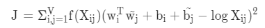

# 학습 내용

---

- 벡터화
	- 텍스트를 벡터화하는 방법 학습
- 벡터화 실습: 원-핫 인코딩 구현
	- 원-핫 인코딩 구현
- 워드 임베딩
	- 희소 벡터의 특징, 문제점 학습
- Word2Vec (1) 분포 가설
	- 분포 가설 학습
- Word2Vec (2) CBoW
	- CBoW(Continuous Bag of words) 학습
- Word2Vec (3) Skip-gram과 Negative Sampling
	- Skip-gram 학습
- Word2Vec (4) 영어 Word2Vec 실습과 OOV 문제
	- OOV(Out Of Vocabuary) 문제 학습
- 임베딩 벡터의 시각화
	- 임베딩 벡터들 시각화
- FastText
	- FastText 원리 학습
- GloVe
	- GloVe 원리 학습

---

## 벡터화

---

Bag of words?

	단어의 순서를 고려하지 않고, 단어의 등장 빈도(frequency)만을 고려해서 단어를 벡터화 방법

DTM(문서 단어 행렬, Document-Term Matrix)?

	Bag of words를 사용하여 문서 간 유사도를 비교하기 위해 만든 행렬

	ex) 문서1 : you know I want your love
	    문서2 : I like you
	    문서3 : what should I do

		-> 길이가 1인 단어를 제거

	->  대부분의 값이 0이라는 특징

		-> 희소 벡터(sparse vector)

단어장(vocabulary)?

	중복 카운트는 배제한 단어들의 집합(set)

DTM의 문제점

	문서의 유사도를 비교하는 경우

		-> 두 문서에서 공통적으로 등장하는 단어가 많으면 그 두 문서는 유사하다고 판단

			-> 별로 중요하지도 않은 단어인데도 모든 문서에서 공통적으로 등장하는 단어가 있다는 것

TF-IDF

	DTM의 문제점을 해결하고자 단어마다 중요 가중치를 다르게 주는 방법

		-> 여전히 희소 벡터

원-핫 인코딩(one-hot encoding)??

	모든 단어의 관계를 독립적으로 정의

	진행 방식

	1. 텍스트 데이터에서 단어들의 집합인 단어장(vocabulary) 생성
	2. 단어장에 있는 모든 단어에 대해서 1부터 V까지 고유한 정수 부여
		- 이 정수는 단어장에 있는 각 단어의 일종의 인덱스 역할
	3. 해당 단어의 인덱스 위치만 1이고 나머지는 전부 0의 값을 가지는 벡터 생성
		- 각 단어는 V(vocab_size)차원의 벡터로 표현

원-핫 인코딩 ex)

	문서 1 : 강아지, 고양이, 강아지			    	강아지: 1번	컴퓨터: 4번
	문서 2 : 애교, 고양이				->  	고양이: 2번	노트북: 5번
	문서 3 : 컴퓨터, 노트북				    	애교: 3 번

	∴  강아지 : [1, 0, 0, 0, 0]
	   고양이 : [0, 1, 0, 0, 0]
	   애교   : [0, 0, 1, 0, 0]
	   컴퓨터 : [0, 0, 0, 1, 0]
	   노트북 : [0, 0, 0, 0, 1]

TF(Term Frequency)?

	문장을 구성하는 단어들의 원-핫 벡터들을 모두 더해서 문장의 단어 개수로 나눈 것과 같음

---

## 벡터화 실습: 원-핫 인코딩 구현

---

한국어 실습을 위한 한국어 형태소 분석기 패키지 

	KoNLPy

	설치
	-> pip install konlpy

필요한 라이브러리 import 

	'''

	import re
	from konlpy.tag import Okt
	from collections import Counter

	'''

전처리

	정규 표현식을 사용해 특수문자들 제거 -> 한글과 공백을 제외 특수문자만 제거

		-> 자음의 범위는 'ㄱ ~ ㅎ', 모음의 범위는 'ㅏ ~ ㅣ', 완성형 한글의 범위는 '가 ~ 힣'와 같이 지정

			-> [^ㄱ-ㅎㅏ-ㅣ가-힣 ]

	'''

	text = "임금님 귀는 당나귀 귀! 임금님 귀는 당나귀 귀! 실컷~ 소리치고 나니 속이 확 뚫려 살 것 같았어."

	reg = re.compile("[^ㄱ-ㅎㅏ-ㅣ가-힣 ]")
	text = reg.sub('', text)
	print(text)

	'''

	결과: 임금님 귀는 당나귀 귀 임금님 귀는 당나귀 귀 실컷 소리치고 나니 속이 확 뚫려 살 것 같았어

토큰화

	한국어 -> 주로 형태소 분석기를 통해서 토큰 단위로 나눔

	'''

	okt=Okt()
	tokens = okt.morphs(text)
	print(tokens)

	'''

	결과: ['임금님', '귀', '는', '당나귀', '귀', '임금님', '귀', '는', '당나귀', '귀', '실컷', '소리', '치고', '나니', '속이', '확', '뚫려', '살', '것', '같았어']

단어장 생성

	빈도수가 높은 단어일수록 낮은 정수를 부여

	1. 각 단어의 빈도수 체크

		'''

		vocab = Counter(tokens)
		print(vocab)

		'''

		결과: Counter({'귀': 4, '임금님': 2, '는': 2, '당나귀': 2, '실컷': 1, '소리': 1, '치고': 1, '나니': 1, '속이': 1, '확': 1, '뚫려': 1, '살': 1, '것': 1, '같았어': 1})

	2. 등장 빈도수가 높은 상위 5개의 단어만 저장

		'''

		vocab_size = 5
		vocab = vocab.most_common(vocab_size)
		print(vocab)
	
		'''
	
		결과: [('귀', 4), ('임금님', 2), ('는', 2), ('당나귀', 2), ('실컷', 1)]

	3. 높은 빈도수를 가진 단어일수록 낮은 정수 인덱스 부여

		'''

		word2idx={word[0] : index+1 for index, word in enumerate(vocab)}
		print(word2idx)

		'''

		결과: {'귀': 1, '임금님': 2, '는': 3, '당나귀': 4, '실컷': 5}

원-핫 벡터 생성

	'''

	def one_hot_encoding(word, word2index):
	       one_hot_vector = [0]*(len(word2index))
	       index = word2index[word]
	       one_hot_vector[index-1] = 1
	       return one_hot_vector

	one_hot_encoding("임금님", word2idx)

	'''

	결과: [0, 1, 0, 0, 0]

케라스를 통한 원-핫 인코딩

	'''

	from tensorflow.keras.preprocessing.text import Tokenizer
	from tensorflow.keras.utils import to_categorical

	text = [['강아지', '고양이', '강아지'],['애교', '고양이'], ['컴퓨터', '노트북']]

	t = Tokenizer()
	t.fit_on_texts(text)

	vocab_size = len(t.word_index) + 1

	sub_text = ['강아지', '고양이', '강아지', '컴퓨터']
	encoded = t.texts_to_sequences([sub_text])

	one_hot = to_categorical(encoded, num_classes = vocab_size)
	print(one_hot)

	'''

	결과: [[[0. 1. 0. 0. 0. 0.]
	        [0. 0. 1. 0. 0. 0.]
	        [0. 1. 0. 0. 0. 0.]
	        [0. 0. 0. 0. 1. 0.]]]

---

## 워드 임베딩

---

희소 벡터(Sparse Vector)의 문제점

	차원의 저주(curse of dimensionality)

	'강아지'와 '고양이'라는 두 단어의 의미적 유사성 VS  '강아지'와 '컴퓨터'라는 두 단어의 의미적 유사성

		->  '강아지'와 '고양이'는 귀여운 애완동물이고, '컴퓨터'는 데이터를 처리하는 전자기기라는 것을 반영 X

			-> 원-핫 벡터 간 내적 -> 서로 직교(orthogonal)해 그 값이 0

	∴  단어 벡터 간 유사도를 구할 수 없음

희소 벡터의 해결책

	임베딩 벡터

워드 임베딩?

	- 한 단어를 벡터로 바꿉니다. 그런데 그 벡터의 길이를 일정하게 정해줌
		- 벡터의 길이가 단어장 크기보다 매우 작기 때문에 각 벡터 값에 정보가 축약
		- 밀집 벡터(dense vector)
	- 밀집 벡터에서는 대부분 값이 0이 아님
		- 각 벡터 값의 의미가 파악하기 어려울 정도로 많은 의미를 함축

	- 단어가 갖는 특성을 계산 가능
	- 인공 신경망을 이용한 방법 사용
		- 인공 신경망을 학습해가는 과정을 이용해 벡터의 값을 조정해 가는 방법
		- 학습이 끝나면 단어가 들어가야 할 위치나 의미에 맞게 단어 벡터의 값이 결정됨
		ex) //      [둥근,빨간,단맛,신맛]
		    사과  : [0.8, 0.7, 0.7, 0.1] // 0.8만큼 둥글고, 0.7만큼 빨갛고, 0.7만큼 달고, 0.1만큼 신 것은 사과다
		    바나나: [0.1, 0.0, 0.8. 0.0] // 0.1만큼 둥글고, 0.0만큼 빨갛고, 0.8만큼 달고, 0.0만큼 신 것은 바나나다
		    귤    : [0.7, 0.5, 0.6, 0.5] // 0.7만큼 둥글고, 0.5만큼 빨갛고, 0.6만큼 달고, 0.5만큼 신 것은 귤이다

---

## Word2Vec (1) 분포 가설

---

Word2Vec

	단어를 벡터로 표현하는 방법의 일종

		-> 저차원으로 이루어져 있고, 단어의 의미를 여러 차원에 분산하여 표현한 벡터

Word2Vec의 핵심 아이디어

	분포 가설(distributional hypothesis)을 따름

분포 가설?

	비슷한 문맥에서 같이 등장하는 경향이 있는 단어들은 비슷한 의미를 가짐

		-> 같이 등장하는 경향이 적은 단어들에 비해 '강아지', '애교, '귀여운'과 같은 단어들을 상대적으로 유사도가 높은 벡터로 생성

---

## Word2Vec (2) CBoW

---

Word2Vec의 두가지 방법

	- CBoW
		- 주변에 있는 단어들을 통해 중간에 있는 단어들을 예측하는 방법
	- Skip-gram
		- 중간에 있는 단어로 주변 단어들을 예측하는 방법

CBoW(Continuous Bag of words)

- ex) "I like natural language processing."

	-> 중간에 있는 단어를 예측하는 방법이므로  {"i", "like", "language", "processing"}으로부터 "natural"을 예측하는 것

	- 중심 단어(center word)
		- 예측해야 하는 단어 "natural"
	- 주변 단어(context word)
		- 예측에 사용되는 단어들
	- 윈도우(window)
		- 중심 단어를 예측하기 위해 앞, 뒤로 몇 개의 단어를 볼지
		- 윈도우 크기가 m일 때, 중심 단어를 예측하기 위해 참고하는 주변 단어의 개수는 2m

	- 슬라이딩 윈도우(sliding window)
		- 윈도우를 계속 움직여서 주변 단어와 중심 단어를 바꿔가며 학습을 위한 데이터 셋 생성

	 ex) 윈도우 크기 = 1 / ((주변 단어의 셋), 중심 단어)
	    ((like), I), ((I, natural), like), ((like, language), natural), ((natural, processing), language), ((language), processing)  

	- 선택된 데이터셋  
		- 원-핫 벡터화 되어 CBoW나 Skip-gram의 입력이 됨

CBoW의 동작 메커니즘

	윈도우 크기가 m이라면 2m개의 주변 단어를 이용해 1개의 중심 단어를 예측하는 과정에서 두 개의 가중치 행렬(matrix)을 학습하는 것

		-> 가중치 W, W' 학습 (얕은 신경망(Shallow Neural Network) 학습)

CBoW 신경망 구조

	- 입력층
		- 주변 단어 각각의 원-핫 벡터가 위치한 곳
	- 출력층
		- 중심 단어의 원-핫 벡터가 위치한 곳
	- 입력층과 출력층의 크기
		- 단어 집합의 크기인 V로 고정
		- 원-핫 벡터로 표현
	- 은닉층의 크기
		- 사용자가 정의해주는 하이퍼파라미터!(N)

입력층 -> 은닉층

	(주변 단어)각각의 원-핫 벡터 * 첫 번째 가중치 행렬(V × N)

		-> 각 단어의 정수 인덱스 i에 해당되는 위치에만 1의 값을 가짐

			-> 원-핫 벡터와 가중치 행렬과의 곱은 가중치 행렬의 i 위치에 있는 행을 그대로 가져오는 것과 동일

				-> 룩업 테이블(lookup table)

	∴ 2m개의 주변 단어 벡터들 

		-> 각각 N의 크기를 가짐

	벡터들을 모두 합하거나, 평균을 구한 값

		-> 최종 은닉층의 결과(N차원의 벡터)

			-> 활성화 함수나 편향(bias)을 더하는 연산 X

			-> 투사층(projection layer)이라고 불림

은닉층 -> 출력층

	은닉층에서 생성된 N차원의 벡터 * 두 번째 가중치 행렬(N × V)

		-> 벡터의 차원은 V

			-> 활성화 함수로 소프트맥스 함수를 사용

				-> 모든 차원의 총합이 1이 되는 벡터로 변경

학습 목표

	출력층의 벡터를 중심 단어의 원-핫 벡터와의 손실(loss)을 최소화

		-> 첫 번째 가중치 행렬 W, 두 번째 가중치 행렬 W' 업데이트

			-> W의 행, W'의 열 중 어떤 것을 임베딩 벡터로 사용할지를 결정

			-> W와 W'의 평균치 사용 하기도 함

CBoW의 문제점

	Out-of-vocabulary(단어 집합에 없는 단어), Polysemy(다의어), 문맥 파악의 한계 등등

---

## Word2Vec (3) Skip-gram과 Negative Sampling

---

Skip-gram

	중심 단어로부터 주변 단어를 예측

Skip-gram의 데이터셋

	(중심 단어, 주변 단어)

	-> (i, like) (like, I), (like, natural), (natural, like), (natural, language), (language, natural), (language, processing), (processing, language)

Skip-gram 시각화

	-> 은닉층에서 다수의 벡터의 덧셈과 평균을 구하는 과정이 없어짐

		-> CBoW와 메커니즘 자체는 동일

네거티브 샘플링(negative sampling)

	Word2Vec을 사용할 땐 SGNS(Skip-Gram with Negative Sampling) 사용

		-> Skip-gram을 사용하면서 네거티브 샘플링(Negative Sampling) 이란 방법도 사용

			-> Word2Vec의 구조는 연산량이 지나치게 많아 실제로 사용하기 어려움

Skip-gram의 학습 과정의 문제점

	모델 구조는 단순해 보이지만 복잡한 과정을 거침

		-> 단어가 중심 단어나 주변 단어와 전혀 상관없는 단어라도 복잡한 과정을 거침

			->  이 작업은 너무너무 느림!!

네거티브 샘플링?

	연산량을 줄이기 위해서 소프트맥스 함수를 사용한 V개 중 1개를 고르는 다중 클래스 분류 문제

		-> 시그모이드 함수를 사용한 이진 분류 문제로 바꿈

	-> 기존의 skip-gram

	-> 네거티브 샘플링

	중심 단어와 주변 단어를 입력값으로 받아 이 두 단어가 정말로 이웃 관계면(실제로 중심 단어와 주변 단어의 관계면) 1을 또는 0을 출력하는 문제로 바꾸는 것

		-> 다중 분류 문제에서 이진 분류 문제로 변경됨

네거티브 샘플링 ex

	예문 : Thou shalt not make a machine in the likeness of a human mind, 윈도우 크기가 2

1. 데이터셋 생성

	-> skip-gram의 데이터셋

		-> input word == 중심 단어, target word == 주변 단어

2. 새롭게 레이블 생성

	-> 슬라이딩 윈도우를 통해서 만들어진 정상적인 데이터셋 == 1

3. 거짓 데이터셋 생성

	-> 랜덤으로 단어장에 있는 아무 단어나 가져와 target word로 하는 거짓 데이터셋 생성

		-> 0으로 레이블링

			-> 거짓(negative) 데이터셋을 만들기 때문에 이 방법이 네거티브 샘플링라고 불림

4. 이진 분류 문제로 학습

	-> 이진 분류 문제로 간주

		-> 중심 단어와 주변 단어를 내적하고, 출력층의 시그모이드 함수를 지나게 하여 1 또는 0의 레이블로부터 오차를 구해서 역전파를 수행(학습)

네거티브 샘플링의 장점

	- 상당량의 연산량을 줄일 수 있음

---

## Word2Vec (4) 영어 Word2Vec 실습과 OOV 문제

---

영어 데이터로 직접 Word2Vec 훈련

	파이썬의 gensim 패키지를 통해 Word2Vec 모델 사용 가능

사용할 데이터 

	-> NLTK에서 제공하는 코퍼스

gensim 패키지?

	-> 토픽 모델링을 위한 NLP 패키지

- NLTK 코퍼스 다운

	'''

	import nltk
	nltk.download('abc')
	nltk.download('punkt')

	'''

- 코퍼스 저장

	'''

	from nltk.corpus import abc
	corpus = abc.sents()

	'''

- 모델 학습

	'''

	from gensim.models import Word2Vec

	model = Word2Vec(sentences = corpus, vector_size = 100, window = 5, min_count = 5, workers = 4, sg = 0)

	'''

	각 파라미터가 의미하는 바

	- vector size = 학습 후 임베딩 벡터의 차원
	- window = 컨텍스트 윈도우 크기
	- min_count = 단어 최소 빈도수 제한 (빈도가 적은 단어들은 학습 X)
	- workers = 학습을 위한 프로세스 수
	- sg = 0은 CBoW, 1은 Skip-gram.

- 코사인 유사도가 높은 단어들 출력

	'''

	model_result = model.wv.most_similar("man")
	print(model_result)

	'''

	결과: [('woman', 0.9233373999595642), ('skull', 0.911032497882843), ('Bang', 0.9056490063667297), ('asteroid', 0.9051957130432129), ('third', 0.9020178318023682), ('baby', 0.8993921279907227), ('dog', 0.8985978364944458), ('bought', 0.8975234031677246), ('rally', 0.8912491798400879), ('disc', 0.8888981342315674)]

- 모델 저장

	'''

	from gensim.models import KeyedVectors

	model.wv.save_word2vec_format('~/aiffel/word_embedding/w2v') 

	'''

- 모델 load

	'''

	loaded_model = KeyedVectors.load_word2vec_format("~/aiffel/word_embedding/w2v")

	'''

Word2Vec의 OOV 문제

	사전에 없는 단어에 대해서 Word2Vec은 임베딩 벡터값을 얻을 수 없음

---

## 임베딩 벡터의 시각화

---

임베딩 벡터 시각화

	임베딩 프로젝터(embedding projector) 사용

		-> 구글이 공개한 임베딩 벡터의 시각화 오픈소스

			-> 어떤 임베딩 벡터들이 가까운 거리에 군집이 되어 있고, 특정 임베딩 벡터와 유클리드 거리나 코사인 유사도가 높은지 확인

1. 필요한 파일 생성

	벡터값이 저장된 파일, 메타파일

	python -m gensim.scripts.word2vec2tensor --input 경로 --output 경로

		-> 위 커맨드를 통해 벡터값이 저장된 파일, 메타파일 생성

2. 임베딩 프로젝터 사용

	[Embedding Projector](https://projector.tensorflow.org/)

		-> 위 사이트에 생성된 파일 업로드

	-> 워드 임베딩 모델 시각화

---

## FastText

---

FastText??

	메커니즘 자체는 Word2Vec을 그대로 따르고 있음

		-> 문자 단위 n-gram(character-level n-gram) 표현을 학습

Word2Vec의 차이점

	- Word2Vec
		- 더 이상 깨질 수 없는 단위로 구분
	- FastText
		- 단어 내부의 내부 단어(subwords)들을 학습한다는 아이디어

FastText의 n-gram에서의 n

	- 단어들이 얼마나 분리되는지 결정하는 하이퍼파라미터

	 ex) n=3 

		<pa, par, art, rti, tia, ial, al>, <partial>

	- n의 최솟값과 최댓값으로 범위 설정 가능

		-> 기본값으로 각각 3과 6으로 설정

	 ex) n = 3 ~ 6

		<pa, par, art, rti, ita, ial, al>, <par, arti, rtia, tial, ial>, <part, ...중략... , <partial>

	    -> 저 단어들 각각에 대해서 Word2Vec을 수행

	- 최종 단어

	 ex) partial = <pa + par + art + rti + ita + ial + al> + <par + arti + rtia + tial + ial> + <part + ...중략...  + <partial>

FastText의 학습 방법

	Word2Vec과 마찬가지로 네거티브 샘플링 사용

	Word2Vec과 다른 점

		-> 학습 과정에서 중심 단어에 속한 문자 단위 n-gram 단어 벡터들을 모두 업데이트

OOV와 오타에 대한 대응

	Word2Vec과 달리 OOV와 오타에 강건하다는 특징

		-> 단어장에 없는 단어라도, 해당 단어의 n-gram이 다른 단어에 존재하면 이로부터 벡터값을 얻는다는 원리

한국어에서의 FastText

	자소 단위로 분리

		-> 초성, 중성, 종성을 분리한다고 하고, 종성이 존재하지 않는 경우에는 _라는 토큰을 대신

	 ex) 텐서플로우

		 <ㅌㅔ,ㅌㅔㄴ,ㅔㄴㅅ,ㄴㅅㅓ,ㅅㅓ_, ...중략... >

---

## GloVe

---

글로브(Global Vectors for Word Representation, GloVe)??

	2014년에 미국 스탠포드 대학에서 개발한 워드 임베딩 방법론

GloVe의 특징

	워드 임베딩의 두 가지 접근 방법 사용

	- 카운트 기반
	- 예측 기반

카운트 기반 방법?

	LSA(Latent Semantic Analysis)

		->  DTM을 차원 축소하여 밀집 표현(dense representation)으로 임베딩 하는 방법

잠재 의미 분석(LSA, Latent Semantic Analysis)??

	DTM에 특잇값 분해를 사용하여 잠재된 의미를 이끌어내는 방법론

LSA의 한계점

	- 차원 축소의 특성으로 인해 새로운 단어가 추가되면 다시 DTM을 만들어 새로 차원 축소해야 함
	- 단어 벡터간 유사도를 계산하는 측면에서 Word2Vec보다 성능이 떨어짐

예측 기반의 방법??

	Word2Vec과 같은 방법

		-> 인공 신경망이 예측한 값으로부터 실제 레이블과의 오차를 구하고, 손실 함수를 통해서 인공 신경망을 학습하는 방식

GloVe의 성능 지표

	Word2Vec보다 반드시 뛰어나다고 장담하기는 어렵고, Word2Vec에 거의 준하는 성능을 보여준다고 평가

윈도우 기반 동시 등장 행렬(Window based Co-occurrence Matrix)

	corpus

		- I like deep learning.
		- I like NLP.
		- I enjoy flying.

	행과 열을 전체 단어장(vocabulary)의 단어들로 구성하고, 어떤 i 단어의 윈도우 크기(window Size) 내에서 k 단어가 등장한 횟수를 i행 k열에 기재한 행렬

		-> 전치(transpose)해도 동일한 행렬이 된다는 특징

동시 등장 확률(Co-occurrence Probability)

	동시 등장 확률 P(k|i)

		-> 동시 등장 행렬로부터 특정 단어 i의 전체 등장 횟수를 카운트하고, 특정 단어 i가 등장했을 때 어떤 단어 k가 등장한 횟수를 카운트하여 계산한 조건부 확률

			i -> 중심 단어(center word)
			k -> 주변 단어(context word)

GloVe의 손실 함수 설계

	동시 등장 확률을 이용해 손실 함수를 설계

		-> 동시 등장 행렬을 사용하고 있으니 코퍼스의 전체적인 통계 정보를 활용하는 '카운트 기반'의 방법론, 손실 함수를 통해 모델을 학습시키므로 '예측 기반'의 방법론

GloVe의 아이디어

	중심 단어 벡터와 주변 단어 벡터의 내적이 전체 코퍼스에서의 동시 등장 빈도의 로그값이 되도록 만드는 것

		-> 전체 코퍼스에서의 동시 등장 빈도의 로그값과 중심 단어 벡터와 주변 단어 벡터의 내적값의 차이가 최소화되도록 두 벡터의 값을 학습하는 것

GloVe의 변수

GloVe의 손실 함수

	-> 중심 단어와 주변 단어 벡터의 내적이 동시 등장 빈도의 로그값과의 차이를 줄이도록 설계

	동시 등장 빈도의 값 f(Xik)이 굉장히 낮은 경우에는 거의 도움이 되지 않는 정보라고 판단

		-> f(Xik)의 값에 영향을 받는 가중치 함수(Weighting function)를 도입

	함수의 최댓값이 1로 정해져 있음

		-> 'It is'와 같은 불용어의 동시 등장 빈도수가 높을 때 지나친 가중을 주지 않기 위함

GloVe의 한계점

	- OOV 문제
	
	pre-trained GloVe 모델

		-> 알파벳 소문자만 인식한다는 문제
