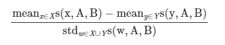
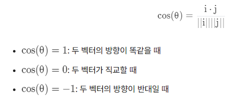
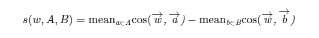
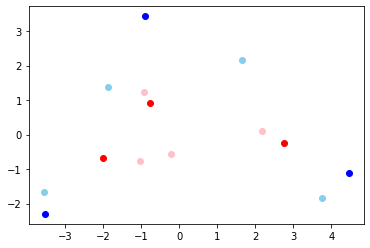
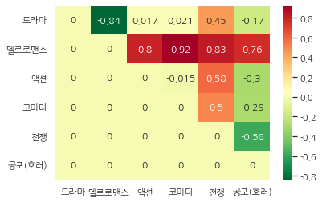

# 학습 내용

---

- 인공지능은 객관적일까?
- 워드 임베딩의 편향성
	- 워드 임베딩의 편향성이 무엇인지 학습
- WEAT를 통한 편향성 측정
	- WEAT를 통한 편향성 측정 학습
- WEAT 구현하기
	- WEAT score 코드 구현
- 사전학습된 Word Embedding에 WEAT 적용
	- target, attribute 셋을 만들어서 WEAT score 계산
- 직접 만드는 Word Embedding에 WEAT 적용(1)
	- 주어진 데이터를 활용해 WEAT score 계산
- 직접 만드는 Word Embedding에 WEAT 적용(2)
	- 주어진 데이터를 활용해 WEAT score 계산

---

## 인공지능은 객관적일까?

---

잘못된 머신러닝 학습에 대한 유명한 사례

	목적

		-> 한 데이터 제조업체에서 충돌 실험을 통해 탑승자의 신체 움직임을 파악하고 안전성을 높이고자 함

	결과 

		-> 여성 탑승자가 남성 탑승자보다 사망률이 높음

	Why??

		-> 차량 실험에서 쓰인 데이터가 남성 위주였기 때문

			->  데이터로부터 편향성 이 생긴 경우

인공지능의 편향성

	데이터 안에 이미 편향성이 내재되어 있다면 이를 통해 나온 결과도 편향성을 가질 수 밖에 없다!!

		-> 위의 예시를 통해 알 수 있음

인공지능이 가진 편향성 예방

	자연어처리 분야, 그중에서도 워드 임베딩과 관련된 연구가 많이 이루어지고 있음

		-> 언어의 사용패턴이 담긴 코퍼스야말로 인간 무의식 속에 감추어진 편향성이 고스란히 드러나는 데이터셋

		-> 그 언어의 의미가 워드 임베딩에 추상적인 형태로 담겨 있는데, 최근 연구를 통해 그 임베딩 공간에서 편향성을 정량적으로 측정하는 방법론들이 발표됨

---

## 워드 임베딩의 편향성

---

	-> 학습된 Word Embedding을 2차원으로 차원 축소해서 시각화했을 때, 분명히 젠더 중립적인 단어임에도 불구하고 편향성이 생김

WEAT(Word Embedding Association Test)??

	- 임베딩 모델의 편향을 측정하는 방식 중 하나
		- 워드 임베딩에 내포된 편향성도 정량적으로 측정할 방법은 없을까요? 에서 출발한 방법

	 ex) 남자(Male)가 Scientist에, 여자(Female)가 Art에 가깝다라는 편향을 Word Embedding 상에서 정의하는 방법

		- Science와 Art가 모두 완벽히 젠더 중립적
			- Word Embedding 상에서도 Science, Art가 Male, Female의 두 단어와의 거리가 동일해야 할 것

		- 만약 정말 편향이 존재한다면
			- Science와 Male 간의 거리가 Science와 Female 간의 거리보다 가깝고, 거꾸로 Art와 Male 간의 거리는 Art와 Female간의 거리보다 멀어야 함

			-> 코사인 유사도로 계산

	- target? attribute?
		- 개념을 가장 잘 대표하는 단어들을 여러 개 골라 생성된 단어 셋(set)
		- target
			- 분석하고자 하는 개념이나 집단을 대표하는 단어들의 집합
		- attribute
			- 특정 속성이나 개념을 대표하는 단어들의 집합

	 ex) Science를 대표하는 target 단어 셋 X, Art를 대표하는 target 단어 셋 Y

	     Male을 대표하는 attribute 단어 셋 A, Female을 대표하는 attribute 단어 셋 B

	- WEAT score?
		- 두 개념축 사이의 편향성을 나타내는 지표
		- 절댓값이 클수록 두 개념축 사이의 편향성이 크게 나타나는 것으로 해석

	 ex) 

		- 편향성이 없다면
			- X에 속한 단어들은 A에 속한 단어들과의 거리와 B에 속한 단어들과의 거리가 별 차이가 없어야 함
		- 반대의 경우라면 
			- 뚜렷하게 차이가 존재

사람의 편향성 테스트

	-> 구글 개발진들이 논문으로 작성한 WEAT 개념을 소개하면서 첨부한 실험 결과표

	- 파란색
		- 사람의 편향과 같은 경우
	- 노란색
		- 사람의 편향과 반대인 경우

	결과적인 부분

		-> 대부분의 색이 파란색인 것을 볼 수 있음

			-> 사람이 가진 편향이 자연어 코퍼스 데이터에 반영되어 있음

				-> 이 데이터로 만든 워드 임베딩 모델은 그 편향을 내재할 수밖에 없다는 점

---

## WEAT를 통한 편향성 측정

---

WEAT score?

	식의 분자 부분

		-> target X, Y에 속하는 각 단어 x, y들이 개념축 A-B에 대해 가지는 편향성을 각각 평균 내서 뺀 차이

	식의 분모 부분

		->  X, Y에 속하는 모든 단어들이 가지는 편향성 값의 표준편차(std)

cosine similarity?

	두 벡터 사이의 cosine 값을 이용하여 두 벡터의 유사도를 측정

		-> -1 ~ 1의 범위를 가지며, 두 벡터의 방향이 얼마나 유사한지를 나타냄

s(W,A,B)?

	target에 있는 단어 w가 두 attribute 셋 A, B에 속한 단어들과의 유사도의 평균(mean)값이 얼마나 차이 나는지를 측정

		-> 개별 단어 w가 개념축 A-B에 대해 가지는 편향성을 계산한 값

	범위

		-2 ~ 2사이의 값을 가짐

	크기의 의미

		절댓값이 클수록 w는 A-B 개념축에 대해 편향성을 가진다는 뜻

---

## WEAT 구현

---

필요한 라이브러리 import

	'''

	import numpy as np
	from numpy import dot
	from numpy.linalg import norm

	'''

단어 셋 정의

	두 개의 target 단어 셋 X, Y와 두 개의 attribute 단어 셋 A, B 정의

		-> 두 개의 target 셋의 크기가 같아야 하며, 두 개의 attribute 셋의 크기가 같아야함

	'''

	target_X = {
	    '장미': [4.1, 1.2, -2.4, 0.5, 4.1],
	    '튤립': [3.1, 0.5, 3.6, 1.7, 5.8],
	    '백합': [2.9, -1.3, 0.4, 1.1, 3.7],
	    '데이지': [5.4, 2.5, 4.6, -1.0, 3.6]
	}
	target_Y = {
	    '거미': [-1.5, 0.2, -0.6, -4.6, -5.3],
	    '모기': [0.4, 0.7, -1.9, -4.5, -2.9],
	    '파리': [0.9, 1.4, -2.3, -3.9, -4.7],
	    '메뚜기': [0.7, 0.9, -0.4, -4.1, -3.9]
	}
	attribute_A = {
	    '사랑':[2.8,  4.2, 4.3,  0.3, 5.0],
	    '행복':[3.8,  3. , -1.2,  4.4, 4.9],
	    '웃음':[3.7, -0.3,  1.2, -2.5, 3.9]
	}
	attribute_B = {
	    '재난': [-0.2, -2.8, -4.7, -4.3, -4.7],
	    '고통': [-4.5, -2.1,  -3.8, -3.6, -3.1],
	    '증오': [-3.6, -3.3, -3.5,  -3.7, -4.4]
	}

	'''

		-> 무작위 임베딩으로 설정

	'''

	X = np.array([v for v in target_X.values()])
	Y = np.array([v for v in target_Y.values()])

	A = np.array([v for v in attribute_A.values()])
	B = np.array([v for v in attribute_B.values()])

	'''

WEAT score의 수식 코드화

	'''

	def cos_sim(i, j):
	    return dot(i, j.T)/(norm(i)*norm(j))

	def s(w, A, B):
	    c_a = cos_sim(w, A)
	    c_b = cos_sim(w, B)
	    mean_A = np.mean(c_a, axis=-1)
	    mean_B = np.mean(c_b, axis=-1)
	    return mean_A - mean_B

	def weat_score(X, Y, A, B):
    
	    s_X = s(X, A, B)
	    s_Y = s(Y, A, B)

	    mean_X = np.mean(s_X)
	    mean_Y = np.mean(s_Y)
    
  	    std_dev = np.std(np.concatenate([s_X, s_Y], axis=0))
    
	    return  (mean_X-mean_Y)/std_dev

	'''

WEAT score 계산

	'''

	print(round(weat_score(X, Y, A, B), 3))

	'''

	결과: 1.932

		-> 꽃은 유쾌한 단어와 상대적으로 가깝고, 곤충은 불쾌한 단어와 가깝다는 것을 수치적으로 확인 가능

PCA를 통한 차원 축소한 시각화

	'''

	from sklearn.decomposition import PCA
	pca = PCA(n_components=2)
	pc_A = pca.fit_transform(A)
	pc_B = pca.fit_transform(B)
	pc_X = pca.fit_transform(X)
	pc_Y = pca.fit_transform(Y)

	import matplotlib.pyplot as plt
	fig, ax = plt.subplots()
	ax.scatter(pc_A[:,0],pc_A[:,1], c='blue', label='A')
	ax.scatter(pc_B[:,0],pc_B[:,1], c='red', label='B')
	ax.scatter(pc_X[:,0],pc_X[:,1], c='skyblue', label='X')
	ax.scatter(pc_Y[:,0],pc_Y[:,1], c='pink', label='Y')

	'''

	결과:

---

## 사전학습된 Word Embedding에 WEAT 적용

---

사용할 모델

	구글에서 학습한 모델

모델 load

	'''

	import os

	data_dir = '~/aiffel/weat' 
	model_dir = os.path.join(data_dir, 'GoogleNews-vectors-negative300.bin')

	from gensim.models import KeyedVectors

	# 50만개의 단어만 활용합니다. 메모리가 충분하다면 limit 파라미터값을 생략하여 300만개를 모두 활용할 수 있습니다. 
	w2v = KeyedVectors.load_word2vec_format(model_dir, binary=True, limit=500000)

	'''

모델 확인

	'''

	# print(len(w2v.vocab))   # Gensim 3.X 버전까지는 w2v.vocab을 직접 접근할 수 있습니다. 
	print(len(w2v.index_to_key))   # Gensim 4.0부터는 index_to_key를 활용해 vocab size를 알 수 있습니다. 
	print(len(w2v['I']))                    # 혹은 단어를 key로 직접 vector를 얻을 수 있습니다. 
	print(w2v.vectors.shape)

	'''

	결과: 500000
	      300
	      (500000, 300)

모델의 편향성 확인

	'''

	target_X = ['science', 'technology', 'physics', 'chemistry', 'Einstein', 'NASA', 'experiment', 'astronomy']
	target_Y = ['poetry', 'art', 'Shakespeare', 'dance', 'literature', 'novel', 'symphony', 'drama']
	attribute_A = ['brother', 'father', 'uncle', 'grandfather', 'son', 'he', 'his', 'him']
	attribute_B = ['sister', 'mother', 'aunt', 'grandmother', 'daughter', 'she', 'hers', 'her']

	X = np.array([w2v[word] for word in target_X])
	Y = np.array([w2v[word] for word in target_Y])
	A = np.array([w2v[word] for word in attribute_A])
	B = np.array([w2v[word] for word in attribute_B])

	weat_score(X, Y, A, B)

	'''

	결과: 1.2624874

		-> 과학과 관련된 단어가 남성과 관련된 단어와 가깝고, 예술과 관련된 단어가 여성과 관련된 단어와 가깝게 나타남

---

## 직접 만드는 Word Embedding에 WEAT 적용(1)

---

수행 과정

	1. 형태소 분석기를 이용하여 품사가 명사인 경우, 해당 단어 추출
	2. 추출된 결과로 embedding model 생성
	3. TF/IDF로 해당 데이터를 가장 잘 표현하는 단어 셋 생성
	4. embedding model과 단어 셋으로 WEAT score 계산

1. 형태소 분석기를 이용하여 품사가 명사인 경우 해당 단어를 추출

	synopsis.txt 사용

		-> 2001년부터 2019년 8월까지 제작된 영화들의 시놉시스 정보

	- 명사 추출

		'''

		from konlpy.tag import Okt
		okt = Okt()
		tokenized = []
		with open(os.getenv('HOME')+'/aiffel/weat/synopsis.txt', 'r') as file:
		    while True:
		        line = file.readline()
		        if not line: break
		        words = okt.pos(line, stem=True, norm=True)
		        res = []
		        for w in words:
		            if w[1] in ["Noun"]:
		                res.append(w[0])    # 명사일 때만 tokenized 에 저장
		        tokenized.append(res)

		'''

2. 추출된 결과로 embedding model 생성
	
	Word2Vec 학습

		'''

		from gensim.models import Word2Vec

		# tokenized에 담긴 데이터를 가지고 나만의 Word2Vec을 생성합니다. (Gensim 4.0 기준)
		model = Word2Vec(tokenized, vector_size=100, window=5, min_count=3, sg=0)  
		model.wv.most_similar(positive=['영화'])

		# Gensim 3.X 에서는 아래와 같이 생성합니다. 
		# model = Word2Vec(tokenized, size=100, window=5, min_count=3, sg=0)  
		# model.most_similar(positive=['영화'])

		'''

		결과:   [('작품', 0.9036737680435181),
			 ('다큐멘터리', 0.8401896953582764),
			 ('드라마', 0.8196604251861572),
			 ('영화로', 0.8000906705856323),
			 ('코미디', 0.7950778007507324),
			 ('형식', 0.7902755737304688),
			 ('감동', 0.7840465307235718),
			 ('주제', 0.7799090147018433),
			 ('스토리', 0.7629789113998413),
			 ('소재', 0.759117841720581)]

---

## 직접 만드는 Word Embedding에 WEAT 적용(2)

---

3. TF-IDF로 해당 데이터를 가장 잘 표현하는 단어 셋 생성

	 targets_X, targets_Y, attribute_A, attribute_B 지정

		- target(영화의 구분)
			- 예술영화, 일반영화(상업영화)
		- attribute(장르 구분)
			- 드라마 장르, 액션 장르

			-> 드라마 장르에는 예술영화적 성격이 강하고, 액션 장르에는 일반(상업)영화적 성격이 강할 것이라는 편향성 확인

	target 데이터셋 생성

		명사 추출

		'''

		import os
		from sklearn.feature_extraction.text import TfidfVectorizer
		import numpy as np
		from konlpy.tag import Okt

		art_txt = 'synopsis_art.txt'
		gen_txt = 'synopsis_gen.txt'

		def read_token(file_name):
		    okt = Okt()
		    result = []
		    with open(os.getenv('HOME')+'/aiffel/weat/'+file_name, 'r') as fread: 
		        print(file_name, '파일을 읽고 있습니다.')
		        while True:
		            line = fread.readline() 
		            if not line: break 
		            tokenlist = okt.pos(line, stem=True, norm=True) 
		            for word in tokenlist:
		                if word[1] in ["Noun"]:#, "Adjective", "Verb"]:
		                    result.append((word[0])) 
		    return ' '.join(result)

		art = read_token(art_txt)
		gen = read_token(gen_txt)

		'''

		TF-IDF방식을 사용해 단어 셋 구성

			상위 100개의 단어들 중 중복되는 단어를 제외하고 상위 n(=15)개의 단어를 추출

		'''

		vectorizer = TfidfVectorizer()
		X = vectorizer.fit_transform([art, gen])

		m1 = X[0].tocoo()   # art를 TF-IDF로 표현한 sparse matrix를 가져옵니다. 
		m2 = X[1].tocoo()   # gen을 TF-IDF로 표현한 sparse matrix를 가져옵니다. 

		w1 = [[i, j] for i, j in zip(m1.col, m1.data)]
		w2 = [[i, j] for i, j in zip(m2.col, m2.data)]

		w1.sort(key=lambda x: x[1], reverse=True)   #art를 구성하는 단어들을 TF-IDF가 높은 순으로 정렬합니다. 
		w2.sort(key=lambda x: x[1], reverse=True)   #gen을 구성하는 단어들을 TF-IDF가 높은 순으로 정렬합니다.

		n = 15
		w1_, w2_ = [], []
		for i in range(100):
		    w1_.append(vectorizer.get_feature_names()[w1[i][0]])
		    w2_.append(vectorizer.get_feature_names()[w2[i][0]])

		# w1에만 있고 w2에는 없는, 예술영화를 잘 대표하는 단어를 15개 추출한다.
		target_art, target_gen = [], []
		for i in range(100):
		    if (w1_[i] not in w2_) and (w1_[i] in model.wv): target_art.append(w1_[i])
		    if len(target_art) == n: break 

		# w2에만 있고 w1에는 없는, 일반영화를 잘 대표하는 단어를 15개 추출한다.
		for i in range(100):
		    if (w2_[i] not in w1_) and (w2_[i] in model.wv): target_gen.append(w2_[i])
		    if len(target_gen) == n: break

		print(target_art)
		print(target_gen)

		'''

		결과: ['아빠', '음악', '결심', '운명', '지금', '여인', '이름', '이후', '준비', '감정', '만난', '처음', '충격', '누구', '그린']
		      ['서울', '애니메이션', '여성', '가지', '주인공', '대해', '연출', '사회', '다큐멘터리', '부문', '섹스', '바로', '의도', '계획', '정체']

	attribute 데이터셋 생성

		주요 장르 5개 지정

		'''

		genre_txt = ['synopsis_drama.txt', 'synopsis_romance.txt', 'synopsis_action.txt', 'synopsis_comedy.txt', 'synopsis_war.txt', 'synopsis_horror.txt']
		genre_name = ['드라마', '멜로로맨스', '액션', '코미디', '전쟁', '공포(호러)']

		'''

		명사 추출

		'''

		genre = []
		for file_name in genre_txt:
		    genre.append(read_token(file_name))

		'''

		TF-IDF방식을 사용해 단어 셋 구성

		'''

		vectorizer = TfidfVectorizer()
		X = vectorizer.fit_transform(genre)

		m = [X[i].tocoo() for i in range(X.shape[0])]

		w = [[[i, j] for i, j in zip(mm.col, mm.data)] for mm in m]

		for i in range(len(w)):
		    w[i].sort(key=lambda x: x[1], reverse=True)
		attributes = []
		for i in range(len(w)):
		    print(genre_name[i], end=': ')
		    attr = []
		    j = 0
		    while (len(attr) < 15):
		        if vectorizer.get_feature_names()[w[i][j][0]] in model.wv:
		            attr.append(vectorizer.get_feature_names()[w[i][j][0]])
		            print(vectorizer.get_feature_names()[w[i][j][0]], end=', ')
		        j += 1
		    attributes.append(attr)
		    print()

		'''

			-> 단어 셋이 적기 때문에 중복 제거 X

		결과:   드라마: 자신, 영화제, 그녀, 사람, 사랑, 위해, 영화, 시작, 국제, 남자, 친구, 이야기, 여자, 아버지, 엄마, 
			멜로로맨스: 그녀, 사랑, 자신, 시작, 남자, 남편, 여자, 사람, 친구, 위해, 마음, 섹스, 결혼, 서로, 아내, 
			액션: 위해, 자신, 시작, 조직, 사건, 사람, 그녀, 경찰, 전쟁, 친구, 모든, 목숨, 사실, 세계, 가족, 
			코미디: 그녀, 자신, 시작, 위해, 사랑, 사람, 친구, 영화, 남자, 여자, 영화제, 가족, 과연, 마을, 사건, 
			전쟁: 전쟁, 위해, 전투, 시작, 작전, 독일군, 부대, 독일, 윈터스, 자신, 사람, 공격, 임무, 연합군, 병사, 
			공포(호러): 시작, 위해, 사람, 자신, 친구, 그녀, 사건, 공포, 발견, 죽음, 마을, 남자, 가족, 영화, 하나, 

4. embedding model과 단어 셋으로 WEAT score 계산

	target_X, target_Y

		-> art, gen으로 고정

	attribute_A, attribute_B

		-> 바꿔가면서 진행

	결과를 21x21 매트릭스 형태로 표현

		'''

		matrix = [[0 for _ in range(len(genre_name))] for _ in range(len(genre_name))]

		X = np.array([model.wv[word] for word in target_art])
		Y = np.array([model.wv[word] for word in target_gen])

		for i in range(len(genre_name)-1):
		    for j in range(i+1, len(genre_name)):
		        A = np.array([model.wv[word] for word in attributes[i]])
		        B = np.array([model.wv[word] for word in attributes[j]])
		        matrix[i][j] = weat_score(X, Y, A, B)

		'''

	 WEAT score값 확인

		'''

		for i in range(len(genre_name)-1):
		    for j in range(i+1, len(genre_name)):
		        print(genre_name[i], genre_name[j],matrix[i][j])

		'''

		결과:   드라마 멜로로맨스 -0.8416527
			드라마 액션 0.017359285
			드라마 코미디 0.020642493
			드라마 전쟁 0.44631344
			드라마 공포(호러) -0.17428069
			멜로로맨스 액션 0.79681635
			멜로로맨스 코미디 0.92481905
			멜로로맨스 전쟁 0.8268095
			멜로로맨스 공포(호러) 0.76454854
			액션 코미디 -0.014537987
			액션 전쟁 0.58126587
			액션 공포(호러) -0.30029336
			코미디 전쟁 0.49836487
			코미디 공포(호러) -0.2924638
			전쟁 공포(호러) -0.5815715

시각화

	'''

	import numpy as np; 
	import seaborn as sns; 

	np.random.seed(0)

	# 한글 지원 폰트
	sns.set(font='NanumGothic')

	# 마이너스 부호 

	plt.rcParams['axes.unicode_minus'] = False

	ax = sns.heatmap(matrix, xticklabels=genre_name, yticklabels=genre_name, annot=True,  cmap='RdYlGn_r')
	ax

	'''

	결과:

