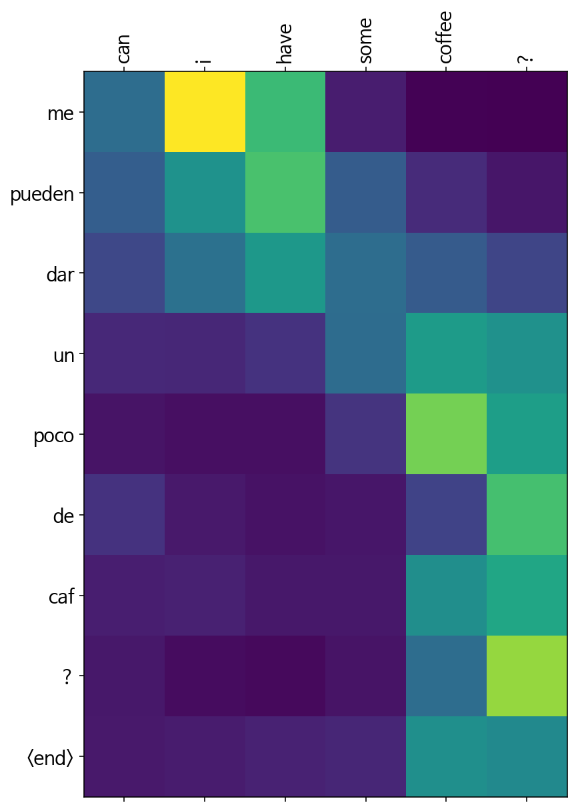

# 학습 내용

---

- 데이터 전처리
	- 필요한 데이터를 준비, 전처리
- 모델 설계
	- Bahdanau Attention을 사용해 코드 실습
- 훈련하기 (1) Optimizer & Loss -Encoder-Decoder 구조 정의
- 훈련하기 (2) train_step 구현
	- Loss를 계산한 후 반환하는 함수 학습
- 훈련하기 (3) 훈련 시작
	- 학습 진행, 시각화

---

matplotlib 한국어를 지원하는 폰트로 변경

	'''

	import matplotlib as mpl
	import matplotlib.pyplot as plt
 
	%config InlineBackend.figure_format = 'retina'
 
	import matplotlib.font_manager as fm
	fontpath = '/usr/share/fonts/truetype/nanum/NanumBarunGothic.ttf'
	font = fm.FontProperties(fname=fontpath, size=9)
	plt.rc('font', family='NanumBarunGothic') 
	mpl.font_manager.findfont(font)

	'''

---

## 데이터 전처리

---

필요한 라이브러리 import 

	'''

	import tensorflow as tf
	import numpy as np

	from sklearn.model_selection import train_test_split

	import matplotlib.ticker as ticker
	import matplotlib.pyplot as plt

	import time
	import re
	import os
	import io

	'''

데이터 다운

	tf.keras.utils.get_file() 함수 사용

		-> URL로부터 데이터를 다운받고, 압축된 형식일 경우 해제까지 알아서 할 수 있는 똑똑한 함수!

	'''

	path_to_zip = tf.keras.utils.get_file(
	    'spa-eng.zip',
	    origin='http://storage.googleapis.com/download.tensorflow.org/data/spa-eng.zip',
	    extract=True)

	path_to_file = os.path.dirname(path_to_zip)+"/spa-eng/spa.txt"

	'''

데이터 정제 함수 정의

	'''

	def preprocess_sentence(sentence, s_token=False, e_token=False):
	    sentence = sentence.lower().strip()

	    sentence = re.sub(r"([?.!,])", r" \1 ", sentence)
	    sentence = re.sub(r'[" "]+', " ", sentence)
	    sentence = re.sub(r"[^a-zA-Z?.!,]+", " ", sentence)

	    sentence = sentence.strip()

	    if s_token:
	        sentence = '<start> ' + sentence

	    if e_token:
	        sentence += ' <end>'
    
	    return sentence

	'''

데이터 정제 수행

	원활한 학습을 위해 데이터는 상위 3만 개만 사용

	'''

	enc_corpus = []
	dec_corpus = []

	num_examples = 30000

	for pair in raw[:num_examples]:
	    eng, spa = pair.split("\t")

	    enc_corpus.append(preprocess_sentence(eng))
	    dec_corpus.append(preprocess_sentence(spa, s_token=True, e_token=True))

	print("English:", enc_corpus[100])   # go away !
	print("Spanish:", dec_corpus[100])   # <start> salga de aqu ! <end>

	'''

	결과:   English: go away !
		Spanish: <start> salga de aqu ! <end>

토큰화 함수 정의

	'''

	def tokenize(corpus):
	    tokenizer = tf.keras.preprocessing.text.Tokenizer(filters='')
	    tokenizer.fit_on_texts(corpus)

	    tensor = tokenizer.texts_to_sequences(corpus)

	    tensor = tf.keras.preprocessing.sequence.pad_sequences(tensor, padding='post')

	    return tensor, tokenizer

	'''

토큰화 수행 및 데이터셋 분리

	'''

	# 토큰화하기
	x, enc_tokenizer = tokenize(enc_corpus)
	y, dec_tokenizer = tokenize(dec_corpus)

	# train_test_split을 활용해서 훈련 데이터와 검증 데이터로 분리하기
	enc_train, enc_test, dec_train, dec_test = train_test_split(x, y, test_size=0.2, random_state=42)

	'''

---

## 모델 셜계

---

모델 구조

BahdanauAttention 정의

	'''

	class BahdanauAttention(tf.keras.layers.Layer):
	    def __init__(self, units):
	        super(BahdanauAttention, self).__init__()
	        self.w_dec = tf.keras.layers.Dense(units)
	        self.w_enc = tf.keras.layers.Dense(units)
	        self.w_com = tf.keras.layers.Dense(1)
    
	    def call(self, h_enc, h_dec):
	        # h_enc shape: [batch x length x units]
	        # h_dec shape: [batch x units]

	        h_enc = self.w_enc(h_enc)
	        h_dec = tf.expand_dims(h_dec, 1)
	        h_dec = self.w_dec(h_dec)

	        score = self.w_com(tf.nn.tanh(h_dec + h_enc))
        
	        attn = tf.nn.softmax(score, axis=1)

	        context_vec = attn * h_enc
	        context_vec = tf.reduce_sum(context_vec, axis=1)

	        return context_vec, attn

	'''

Encoder 생성 함수 정의

	'''

	class Encoder(tf.keras.Model):
	    def __init__(self, vocab_size, embedding_dim, enc_units):
	        super(Encoder, self).__init__()
        
	        self.enc_units = enc_units
	        self.embedding = tf.keras.layers.Embedding(vocab_size, embedding_dim)
	        self.gru = tf.keras.layers.GRU(enc_units,
	                                       return_sequences=True)
        
	    def call(self, x):
	        out = self.embedding(x)
	        out = self.gru(out)
        
	        return out

	'''

Decoder 생성 함수 정의

	'''

	class Decoder(tf.keras.Model):
	    def __init__(self, vocab_size, embedding_dim, dec_units):
	        super(Decoder, self).__init__()
	        self.dec_units = dec_units
	        self.embedding = tf.keras.layers.Embedding(vocab_size, embedding_dim)
	        self.gru = tf.keras.layers.GRU(dec_units,
	                                       return_sequences=True,
	                                       return_state=True)
	        self.fc = tf.keras.layers.Dense(vocab_size)

	        self.attention = BahdanauAttention(self.dec_units)

	    def call(self, x, h_dec, enc_out):
	        context_vec, attn = self.attention(enc_out, h_dec)

	        out = self.embedding(x)
	        out = tf.concat([tf.expand_dims(context_vec, 1), out], axis=-1)
        
	        out, h_dec = self.gru(out)
	        out = tf.reshape(out, (-1, out.shape[2]))
	        out = self.fc(out)

	        return out, h_dec, attn

	'''

Encoder & Decoder 정의 및 필요한 변수 정의

	'''

	BATCH_SIZE     = 64
	SRC_VOCAB_SIZE = len(enc_tokenizer.index_word) + 1
	TGT_VOCAB_SIZE = len(dec_tokenizer.index_word) + 1

	units         = 1024
	embedding_dim = 512

	encoder = Encoder(SRC_VOCAB_SIZE, embedding_dim, units)
	decoder = Decoder(TGT_VOCAB_SIZE, embedding_dim, units)

	'''

---

## 훈련하기 (1) Optimizer & Loss

---

Optimizer & Loss 정의

	'''

	optimizer = tf.keras.optimizers.Adam()
	loss_object = tf.keras.losses.SparseCategoricalCrossentropy(
	    from_logits=True, reduction='none')

	def loss_function(real, pred):
	    mask = tf.math.logical_not(tf.math.equal(real, 0))
	    loss = loss_object(real, pred)
    
	    mask = tf.cast(mask, dtype=loss.dtype)
	    loss *= mask
    
	    return tf.reduce_mean(loss)

	'''

		-  일반적으론 Adam 외의 것을 사용하지 않음

		- from_logits = True 
			- 모델의 출력값을 그대로 전달하므로 True

		- 패딩에 대한 처리 해주기 위해 mask 사용
			- 정답지에서 0 토큰을 찾아내어 그 부분에 대한 Loss는 구하지 않도록 하는 역할

---

## 훈련하기 (2) train_step 구현

---

train_step 함수 정의

	'''

	@tf.function
	def train_step(src, tgt, encoder, decoder, optimizer, dec_tok):
	    bsz = src.shape[0]
	    loss = 0

	    with tf.GradientTape() as tape:
	        enc_out = encoder(src)
	        h_dec = enc_out[:, -1]
        
	        dec_src = tf.expand_dims([dec_tok.word_index['<start>']] * bsz, 1)

	        for t in range(1, tgt.shape[1]):
	            pred, h_dec, _ = decoder(dec_src, h_dec, enc_out)

	            loss += loss_function(tgt[:, t], pred)
	            dec_src = tf.expand_dims(tgt[:, t], 1)
        
	    batch_loss = (loss / int(tgt.shape[1]))

	    variables = encoder.trainable_variables + decoder.trainable_variables
	    gradients = tape.gradient(loss, variables)
	    optimizer.apply_gradients(zip(gradients, variables))
    
	    return batch_loss

	'''

		- @tf.function 데코레이터
			- 훈련 외적인 텐서플로우 연산을 GPU에서 동작하게 해 훈련을 가속할 수 있도록 도와줌

		- tf.GradientTape()
			- 모델이 각 스텝의 최종 단계에서 미분값을 구하는 데에 사용

훈련 과정

	1. Encoder에 소스 문장을 전달해 컨텍스트 벡터인 enc_out 을 생성
	2. t=0일 때, Decoder의 Hidden State는 Encoder의 Final State로 정의. h_dec = enc_out[:, -1]
	3. Decoder에 입력으로 전달할 <start> 토큰 문장 생성
	4. <start> 문장과 enc_out, Hidden State를 기반으로 다음 단어(t=1)를 예측. pred
	5. 예측된 단어와 정답 간의 Loss를 구한 후, t=1의 정답 단어를 다음 입력으로 사용 (예측 단어 X)
	6. 반복!

---

## 훈련하기 (3) 훈련 시작

---

eval_step 함수 정의

	'''

	@tf.function
	def eval_step(src, tgt, encoder, decoder, dec_tok):
	    bsz = src.shape[0]
	    loss = 0

	    enc_out = encoder(src)

	    h_dec = enc_out[:, -1]
    
	    dec_src = tf.expand_dims([dec_tok.word_index['<start>']] * bsz, 1)

	    for t in range(1, tgt.shape[1]):
	        pred, h_dec, _ = decoder(dec_src, h_dec, enc_out)

	        loss += loss_function(tgt[:, t], pred)
	        dec_src = tf.expand_dims(tgt[:, t], 1)
        
	    batch_loss = (loss / int(tgt.shape[1]))
    
	    return batch_loss

	'''

학습 수행

	'''

	from tqdm import tqdm    # tqdm
	import random

	EPOCHS = 10

	for epoch in range(EPOCHS):
	    total_loss = 0
    
	    idx_list = list(range(0, enc_train.shape[0], BATCH_SIZE))
	    random.shuffle(idx_list)
	    t = tqdm(idx_list)

	    for (batch, idx) in enumerate(t):
	        batch_loss = train_step(enc_train[idx:idx+BATCH_SIZE],
	                                dec_train[idx:idx+BATCH_SIZE],
	                                encoder,
	                                decoder,
	                                optimizer,
	                                dec_tokenizer)
    
	        total_loss += batch_loss
        
	        t.set_description_str('Epoch %2d' % (epoch + 1))
	        t.set_postfix_str('Loss %.4f' % (total_loss.numpy() / (batch + 1)))
    
	    test_loss = 0
    
	    idx_list = list(range(0, enc_test.shape[0], BATCH_SIZE))
	    random.shuffle(idx_list)
	    t = tqdm(idx_list)

	    for (test_batch, idx) in enumerate(t):
	        test_batch_loss = eval_step(enc_test[idx:idx+BATCH_SIZE],
	                                    dec_test[idx:idx+BATCH_SIZE],
	                                    encoder,
	                                    decoder,
	                                    dec_tokenizer)
    
	        test_loss += test_batch_loss

	        t.set_description_str('Test Epoch %2d' % (epoch + 1))
	        t.set_postfix_str('Test Loss %.4f' % (test_loss.numpy() / (test_batch + 1)))

	'''

Attention Map을 통한 시각화

	'''

	def evaluate(sentence, encoder, decoder):
	    attention = np.zeros((dec_train.shape[-1], enc_train.shape[-1]))
    
	    sentence = preprocess_sentence(sentence)
	    inputs = enc_tokenizer.texts_to_sequences([sentence.split()])
	    inputs = tf.keras.preprocessing.sequence.pad_sequences(inputs,
	                                                           maxlen=enc_train.shape[-1],
	                                                           padding='post')

	    result = ''

	    enc_out = encoder(inputs)

	    dec_hidden = enc_out[:, -1]
	    dec_input = tf.expand_dims([dec_tokenizer.word_index['<start>']], 0)

	    for t in range(dec_train.shape[-1]):
	        predictions, dec_hidden, attention_weights = decoder(dec_input,
	                                                             dec_hidden,
	                                                             enc_out)

	        attention_weights = tf.reshape(attention_weights, (-1, ))
	        attention[t] = attention_weights.numpy()

	        predicted_id = \
	        tf.argmax(tf.math.softmax(predictions, axis=-1)[0]).numpy()

	        result += dec_tokenizer.index_word[predicted_id] + ' '

	        if dec_tokenizer.index_word[predicted_id] == '<end>':
	            return result, sentence, attention

	        dec_input = tf.expand_dims([predicted_id], 0)

	    return result, sentence, attention

	def plot_attention(attention, sentence, predicted_sentence):
	    fig = plt.figure(figsize=(10,10))
	    ax = fig.add_subplot(1, 1, 1)
	    ax.matshow(attention, cmap='viridis')

	    fontdict = {'fontsize': 14}

	    ax.set_xticklabels([''] + sentence, fontdict=fontdict, rotation=90)
	    ax.set_yticklabels([''] + predicted_sentence, fontdict=fontdict)

	    ax.xaxis.set_major_locator(ticker.MultipleLocator(1))
	    ax.yaxis.set_major_locator(ticker.MultipleLocator(1))

	    plt.show()

	def translate(sentence, encoder, decoder):
	    result, sentence, attention = evaluate(sentence, encoder, decoder)

	    print('Input: %s' % (sentence))
	    print('Predicted translation: {}'.format(result))
    
	    attention = attention[:len(result.split()), :len(sentence.split())]
	    plot_attention(attention, sentence.split(), result.split(' '))

	translate("Can I have some coffee?", encoder, decoder)

	'''

	결과:   Input: can i have some coffee ?
		Predicted translation: me pueden dar un poco de caf ? <end> 

