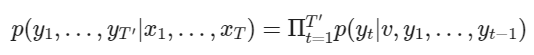

# 학습 내용

---

- 우리가 만드는 언어 모델
	- 언어 모델 학습
- Sequence to Sequence 문제
	- seq2seq 문제가 무엇인지 학습
- Sequence to Sequence 구현
	- seq2seq를 TensorFlow로 구현
- Attention! (1) Bahdanau Attention
	- Bahdanau Attention 학습
- Attention! (2) Luong Attention
	- Luong Attention 학습

---

## 우리가 만드는 언어 모델

---

언어 모델(Language Model)??

	주어진 단어들을 보고 다음 단어를 맞추는 모델

		-> 단어의 시퀀스를 보고 다음 단어에 확률을 할당 하는 모델

			-> P(Wn|W1,.....,Wn-1;θ)

통계적 언어 모델의 한계점

	등장한 적 없는 단어나 문장에 대해 모델링 X

[언어모델(Language Model)](https://ratsgo.github.io/from%20frequency%20to%20semantics/2017/09/16/LM/)

신경망 언어 모델??

	시초는 Feed-Forward 신경망 언어 모델

		-> 지금의 Embedding 레이어의 아이디어인 모델

[피드 포워드 신경망 언어 모델(NNLM)](https://wikidocs.net/45609)

Embedding 벡터 장점

	단어 간의 유사도를 표현 가능

Embedding 벡터 한계점

	예측에 정해진 개수의 단어만 참고

---

## Sequence to Sequence 문제

---

RNN??

	고정된 크기의 Weight가 선언되고 입력을 순차적으로 "적립"하는 방식을 채택

RNN의 한계점

	- 기울기 소실(Vanishing Gradient) 문제
	- 번역에 사용하기는 어려움
		- 나는 점심을 먹는다 -> I eat lunch
		- 나는 -> I
		- 나는 점심을 -> I lunch
		- 나는 점심을 먹는다 -> I lunch eat(?)

Sequence to Sequence(Seq2Seq)??

	-> 구글이 제안한 문장 전체를 보고 나서 생성하는 구조

논문:

[Sequence to Sequence Learning with Neural Networks](https://proceedings.neurips.cc/paper_files/paper/2014/file/a14ac55a4f27472c5d894ec1c3c743d2-Paper.pdf)

정리한 글:

[Seq2seq (2): Sequence to Sequence Learning with Neural Networks](https://reniew.github.io/35/)

	- x: Input Sequence
	- y: Output Sequence
	- v: 인코더의 입력 x에 대한 고정된 크기의 Representation Vector 아웃풋으로서, 디코더의 입력으로 사용됨

	-> Input Sequence을 이용한  Output Sequence 확률 = 모든 타임스텝의 곱(현재 타임 스텝 전까지의 출력값 & 컨텍스트 벡터을 이용한 현재 타임스탭의 Output Sequence 확률)

Q. Encoder은 입력 문장의 모든 단어들을 순차적으로 입력받고 모든 단어를 압축한 단 하나의 [    ]를 만듦

	A. 컨텍스트 벡터

---

## Sequence to Sequence 구현

---

구현 제약 조건

	입력으로 Embedding된 단어만 전달 (Hidden State에 전달 X) 

LSTM Encoder

	'''

	import tensorflow as tf

	class Encoder(tf.keras.Model):
	  def __init__(self, vocab_size, embedding_dim, enc_units):
	    super(Encoder, self).__init__()
	    self.embedding = tf.keras.layers.Embedding(vocab_size, embedding_dim)
	    self.lstm = tf.keras.layers.LSTM(enc_units) # return_sequences 매개변수를 기본값 False로 전달

	  def call(self, x):
	    print("입력 Shape:", x.shape)

	    x = self.embedding(x)
	    print("Embedding Layer를 거친 Shape:", x.shape)

	    output = self.lstm(x)
	    print("LSTM Layer의 Output Shape:", output.shape)

	    return output

	'''

		-> Encoder 클래스의 반환 값이 곧 컨텍스트 벡터(Context Vector) 

필요한 변수들 선언

	'''

	vocab_size = 30000
	emb_size = 256
	lstm_size = 512
	batch_size = 1
	sample_seq_len = 3

	'''

인코딩 실행

	'''

	encoder = Encoder(vocab_size, emb_size, lstm_size)
	sample_input = tf.zeros((batch_size, sample_seq_len))

	sample_output = encoder(sample_input) 

	'''

	결과:   입력 Shape: (1, 3)
		Embedding Layer를 거친 Shape: (1, 3, 256)
		LSTM Layer의 Output Shape: (1, 512)

인코더 구조

LSTM Decoder

	'''

	# Encoder 구현에 사용된 변수들을 이어 사용함에 유의!

	class Decoder(tf.keras.Model):
	  def __init__(self, vocab_size, embedding_dim, dec_units):
	    super(Decoder, self).__init__()
	    self.embedding = tf.keras.layers.Embedding(vocab_size, embedding_dim)
	    self.lstm = tf.keras.layers.LSTM(dec_units,
	                                     return_sequences=True) # return_sequences 매개변수를 True로 설정
	    self.fc = tf.keras.layers.Dense(vocab_size)
	    self.softmax = tf.keras.layers.Softmax(axis=-1)

	  def call(self, x, context_v):  # 디코더의 입력 x와 인코더의 컨텍스트 벡터를 인자로 받는다. 
	    print("입력 Shape:", x.shape)

	    x = self.embedding(x)
	    print("Embedding Layer를 거친 Shape:", x.shape)

	    context_v = tf.repeat(tf.expand_dims(context_v, axis=1),
	                          repeats=x.shape[1], axis=1)
	    x = tf.concat([x, context_v], axis=-1)  # 컨텍스트 벡터를 concat 해준다
	    print("Context Vector가 더해진 Shape:", x.shape)

	    x = self.lstm(x)
	    print("LSTM Layer의 Output Shape:", x.shape)

	    output = self.fc(x)
	    print("Decoder 최종 Output Shape:", output.shape)

	    return self.softmax(output)

	'''

		- Fully Connected 레이어가 추가됨
		- Softmax 함수도 추가됨
		- return_sequences=True
			- State 값이 아닌 Sequence 값을 출력

디코더 실행

	'''

	decoder = Decoder(vocab_size, emb_size, lstm_size)
	sample_input = tf.zeros((batch_size, sample_seq_len))

	dec_output = decoder(sample_input, sample_output)  # Decoder.call(x, context_v) 을 호출

	'''

	결과:   입력 Shape: (1, 3)
		Embedding Layer를 거친 Shape: (1, 3, 256)
		Context Vector가 더해진 Shape: (1, 3, 768)
		LSTM Layer의 Output Shape: (1, 3, 512)
		Decoder 최종 Output Shape: (1, 3, 30000)

Seq2seq 구조

---

## Attention! (1) Bahdanau Attention

---

Seq2Seq의 발전 형태

	Attention 메커니즘 도입!

Bahdanau의 주장

	 Seq2Seq의 컨텍스트 벡터가 고정된 길이로 정보를 압축하는 것이 손실을 야기함

Bahdanau Attention

	ncoder의 최종 State 값만을 사용하는 기존의 방식이 아닌, 매 스텝의 Hidden State를 활용해 컨텍스트 벡터를 구축하는 Attention 메커니즘을 제안

논문: 

[NEURAL MACHINE TRANSLATION BY JOINTLY LEARNING TO ALIGN AND TRANSLATE0](https://arxiv.org/pdf/1409.0473)

정리 글: 

[Attention mechanism in NLP. From seq2seq + attention to BERT ](https://lovit.github.io/machine%20learning/2019/03/17/attention_in_nlp/)

Attention Map?

	Attention의 시각화!

		->  모델의 안정성을 점검할 수 있고, 모델이 의도와 다르게 작동될 경우 그 원인을 찾아내는 데에 이용될 수 있음

Sequence 모델의 쓰임새

	- Sequence Labeling: 품사 태깅
		- Xi와 Yi의 관계를 구하는 문제
	- Sequence to Sequence: 번역
		- X1:n과 동일한 의미를 가지는 Y1:m을 만드는 문제

seq2seq과 attn-seq2seq의 차이점

	-> 유일한 차이는 attention이 있는 경우엔 바로 context vector c에 첨자 i가 붙어있다는 점

attn-seq2seq의 Encoder-Decoder 구조에 대한 수식

	-> 왼쪽 부분은 Xj를 입력으로, yi를 출력으로 하는 인코더-디코더 부분을 도식화한 것

		-> i는 디코더의 인덱스, j는 인코더의 인덱스라는 점

context vector c에 첨자 i가 붙어 ci 가 된다는 것?

	-> 인코더가 X를 해석한 context ci 는 디코더의 포지션 i에 따라 다르게 표현(represent)되어야 함

 ex) 나는 밥을 먹었다 -> I ate lunch

	- 영어 문장의 첫 번째(i=0) 단어 'I'를 만들어야 할 때 인코더가 한글 문장을 해석한 컨텍스트 벡터에서는 '나는'이 강조되어야 함
	- 영어 문장의 세 번째(i=2) 단어 'lunch'를 만들어야 할 때 인코더의 컨텍스트 벡터에서는 '밥을'이 강조되어야 함

attention의 정의

	디코더가 현재 시점 i에서 보기에 인코더의 어느 부분 j가 중요한가?

		-> 이 가중치가 바로 attention인 것

attention 계산

	- 인코더 j번째 hidden state hj가 얼마나 강조되어야 할지를 결정하는 가중치
		- aji
	- 이 가중치는 다시 디코더의 직전 스텝의 hidden state si-1와 hj의 유사도가 높을수록 높아지게 되어 있음

시각화 글을 소개:

[어텐션 (Attention)](https://modulabs.co.kr/blog/introducing-attention/)

주의❗ 위 시각화 글의 1 단계

	모든 인코더 hidden state의 점수 얻기 부분에서 두 Hidden State의 평가 함수에 내적을 사용

		-> 일반적인 attention 설명을 위해 내적을 사용했을 뿐

	Bahdanau attention에서 실제 평가 함수는 아래와 같이 특정 벡터 공간으로 매핑된 두 Hidden State의 합을 사용

BahdanauAttention 시각화 gif

	0. 히든 상태 준비
		- 사용 가능한 모든 인코더 히든 상태 (위 그림에서 녹색) 와 첫 번째 디코더 히든 상태 (위 그림에서 빨간색) 를 준비
	1. 각 인코더 히든 상태에 대한 점수 얻기
		- 점수(스칼라)는 점수 함수(정렬 점수 함수 또는 정렬 모델이라고도 함)에 의해 얻어짐
	2. 모든 점수를 소프트맥스 레이어에 통과
		- 점수를 소프트맥스 레이어에 넣어 소프트맥스 점수(스칼라)의 합이 1이 되도록 변환
		- 이 소프트맥스 점수는 어텐션 분포를 나타냄
	3. 각 인코더 히든 상태에 해당 소프트맥스 점수를 곱
		- 정렬 벡터 또는 주석 벡터를 얻음
		- 정렬이 이루어지는 메커니즘
	4. 정렬 벡터 합산
		- 정렬 벡터를 합산해 컨텍스트 벡터 생성
	5. 컨텍스트 벡터를 디코더에 입력

BahdanauAttention 구현

	'''

	class BahdanauAttention(tf.keras.layers.Layer):
	  def __init__(self, units):
	    super(BahdanauAttention, self).__init__()
	    self.W_decoder = tf.keras.layers.Dense(units)
	    self.W_encoder = tf.keras.layers.Dense(units)
	    self.W_combine = tf.keras.layers.Dense(1)

	  def call(self, H_encoder, H_decoder):
	    print("[ H_encoder ] Shape:", H_encoder.shape)

	    H_encoder = self.W_encoder(H_encoder)
	    print("[ W_encoder X H_encoder ] Shape:", H_encoder.shape)

	    print("\n[ H_decoder ] Shape:", H_decoder.shape)
	    H_decoder = tf.expand_dims(H_decoder, 1)
	    H_decoder = self.W_decoder(H_decoder)
    
	    print("[ W_decoder X H_decoder ] Shape:", H_decoder.shape)

	    score = self.W_combine(tf.nn.tanh(H_decoder + H_encoder))
	    print("[ Score_alignment ] Shape:", score.shape)
    
	    attention_weights = tf.nn.softmax(score, axis=1)
	    print("\n최종 Weight:\n", attention_weights.numpy())

	    context_vector = attention_weights * H_decoder
	    context_vector = tf.reduce_sum(context_vector, axis=1)

	    return context_vector, attention_weights

	W_size = 100

	print("Hidden State를 {0}차원으로 Mapping\n".format(W_size))

	attention = BahdanauAttention(W_size)

	enc_state = tf.random.uniform((1, 10, 512))
	dec_state = tf.random.uniform((1, 512))

	_ = attention(enc_state, dec_state)

	'''

	결과:   Hidden State를 100차원으로 Mapping

		[ H_encoder ] Shape: (1, 10, 512)
		[ W_encoder X H_encoder ] Shape: (1, 10, 100)

		[ H_decoder ] Shape: (1, 512)
		[ W_decoder X H_decoder ] Shape: (1, 1, 100)
		[ Score_alignment ] Shape: (1, 10, 1)

		최종 Weight:
		 [[[0.1089576 ]
		  [0.12197591]
		  [0.07933597]
		  [0.12756844]
		  [0.07157221]
		  [0.11524253]
		  [0.09588533]
		  [0.03720603]
		  [0.11522716]
		  [0.12702878]]]

		-> Softmax를 거쳐 나온 값은 0-1 사이의 값으로 각 단어가 차지하는 비중

Attention Map을 통한 시각화 

---

## Attention! (2) Luong Attention

---

Bahdanau Attention의 단점

	Decoder의 현재 Hidden State를 구하기 위해 한 스텝 이전의 Hidden State를 활용하는 것은 연산적으로 비효율적

	-> 디코더의 Hidden State의 역할을 하게되는 st를 구할 때 ct가 사용되게 됨

		-> RNN의 재귀 연산이 수행되는 도중에 ct가 구해질 때까지 기다려야 함
	

Luong Attention

        Bahdanau의 방식을 약간 발전시킨 형태

	- Bahdanau Attention의 경우와는 다르게 ct를 구할 때 st-1이 사용되는 것이 아니라 st를 사용
		- Hidden State Vector st는 그냥 RNN의 Hidden State의 역할만 수행
		- 출력 yt를 구할 때는 새로운 st를 거치게 됨

Luong Attention의 장점

	Computation Path가 간소화가 된다는 점

		-> 출력 yt을 구하는 부분과 RNN의 재귀 연산이 수행되는 부분을 분리 가능하기 때문

Luong Attention의 개념 정리:

[(Attention) Luong Attention 개념 정리](https://hcnoh.github.io/2019-01-01-luong-attention)

논문: 

[Effective Approaches to Attention-based Neural Machine Translation](https://arxiv.org/pdf/1508.04025)

LuongAttention 구현

	'''

	class LuongAttention(tf.keras.layers.Layer):
	  def __init__(self, units):
	    super(LuongAttention, self).__init__()
	    self.W_combine = tf.keras.layers.Dense(units)

	  def call(self, H_encoder, H_decoder):
	    print("[ H_encoder ] Shape:", H_encoder.shape)

	    WH = self.W_combine(H_encoder)
	    print("[ W_encoder X H_encoder ] Shape:", WH.shape)

	    H_decoder = tf.expand_dims(H_decoder, 1)
	    alignment = tf.matmul(WH, tf.transpose(H_decoder, [0, 2, 1]))
	    print("[ Score_alignment ] Shape:", alignment.shape)

	    attention_weights = tf.nn.softmax(alignment, axis=1)
	    print("\n최종 Weight:\n", attention_weights.numpy())

	    attention_weights = tf.squeeze(attention_weights, axis=-1)
	    context_vector = tf.matmul(attention_weights, H_encoder)

	    return context_vector, attention_weights

	emb_dim = 512

	attention = LuongAttention(emb_dim)

	enc_state = tf.random.uniform((1, 10, emb_dim))
	dec_state = tf.random.uniform((1, emb_dim))

	_ = attention(enc_state, dec_state)

	'''

	결과:   [ H_encoder ] Shape: (1, 10, 512)
		[ W_encoder X H_encoder ] Shape: (1, 10, 512)
		[ Score_alignment ] Shape: (1, 10, 1)

		최종 Weight:
		 [[[7.6974561e-03]
		  [3.5228247e-03]
		  [2.9655016e-04]
		  [1.4992045e-02]
		  [7.7845822e-03]
		  [9.0677792e-01]
		  [1.3326210e-03]
		  [5.7495654e-02]
		  [7.0200113e-05]
		  [3.0134643e-05]]]

		-> Bahdanau의 Score 함수와는 다르게 하나의 Weight만을 사용하는 것이 특징

		-> 어떤 벡터 공간에 매핑해주는 과정이 없기 때문에 Weight의 크기는 단어 Embedding 크기와 동일해야 연산이 가능
