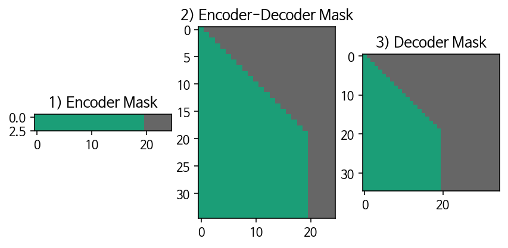

# 학습 내용

---

- 내부 모듈 구현
	- 트랜스포머를 완성하는 데에 필요한 모듈들 학습
- 모듈 조립하기
	- 완성한 모듈로 트랜스포머 모델을 만드는 방법 학습
- 모델 밖의 조력자들
	- 데이터의 특성이나 학습 과정에 따라 달라지는 부분 학습

---

matplotlib에서 한국어를 지원하는 폰트로 변경

	'''

	import matplotlib as mpl
	import matplotlib.pyplot as plt
	import matplotlib.font_manager as fm

	%config InlineBackend.figure_format = 'retina'
 
	fontpath = '/usr/share/fonts/truetype/nanum/NanumBarunGothic.ttf'
	font = fm.FontProperties(fname=fontpath, size=9)
	plt.rc('font', family='NanumBarunGothic') 
	mpl.font_manager.findfont(font)

	'''

---

## 내부 모듈 구현

---

트랜스포머의 흐름

	1. 입력 데이터 → [ batch_size x length ]
	2. Source & Target Embedding → [ batch_size x length x d_emb ]
	3. Positional Encoding 강의 노드에서 구현을 했었죠? 2번의 결과에 더해지므로 shape 변화는 없습니다.
	4. Multi-Head Attention 아래와 같이 여러 개의 서브 모듈들이 존재합니다.
		1. Split Heads →[ batch_size x length x heads x (d_emb / n_heads) ]
		2. Masking for Masked Attention
		3. Scaled Dot Product Attention
		4. Combine Heads →[ batch_size x length x d_emb ]
	5. Residual Connection
	6. Layer Normalization
	7. Position-wise Feed-Forward Network_ → [ batch_size x length x d_ff ]
	8. Output Linear Layer → [ batch_size x length x vocab_size ]

		-> Positional Encoding, Multi-Head Attention, Position-wise Feed-Forward Network 모듈을 제외하면 이미 텐서플로우 내부에 구현되어 있음

필요한 라이브러리 import 

	'''

	import numpy as np
	import tensorflow as tf
	import matplotlib.pyplot as plt

	import re
	import os
	import io
	import time
	import random

	import seaborn # Attention 시각화를 위해 필요!

	'''

Positional Encoding

	'''

	def positional_encoding(pos, d_model):
	    def cal_angle(position, i):
	        return position / np.power(10000, int(i) / d_model)

	    def get_posi_angle_vec(position):
	        return [cal_angle(position, i) for i in range(d_model)]

	    sinusoid_table = np.array([get_posi_angle_vec(pos_i) for pos_i in range(pos)])
	    sinusoid_table[:, 0::2] = np.sin(sinusoid_table[:, 0::2])
	    sinusoid_table[:, 1::2] = np.cos(sinusoid_table[:, 1::2])
	    return sinusoid_table

	'''

Multi-Head Attention

	- split_heads()
		- Embedding된 입력을 Head 수로 분할
	- scaled_dot_product_attention()
		- 분할된 입력으로부터 Attention 값 계산
	- combine_heads()
		- 연산이 종료되고 분할된 Head를 다시 하나로 결합

		-> MultiHeadAttention 클래스를 정의

	'''

	class MultiHeadAttention(tf.keras.layers.Layer):
	    def __init__(self, d_model, num_heads):
	        super(MultiHeadAttention, self).__init__()
	        self.num_heads = num_heads
	        self.d_model = d_model
            
	        self.depth = d_model // self.num_heads
            
	        self.W_q = tf.keras.layers.Dense(d_model)
	        self.W_k = tf.keras.layers.Dense(d_model)
	        self.W_v = tf.keras.layers.Dense(d_model)
            
	        self.linear = tf.keras.layers.Dense(d_model)

	    def scaled_dot_product_attention(self, Q, K, V, mask):
	        d_k = tf.cast(K.shape[-1], tf.float32)
	        QK = tf.matmul(Q, K, transpose_b=True)

	        scaled_qk = QK / tf.math.sqrt(d_k)

	        if mask is not None: scaled_qk += (mask * -1e9)  

	        attentions = tf.nn.softmax(scaled_qk, axis=-1)
	        out = tf.matmul(attentions, V)

	        return out, attentions
            

	    def split_heads(self, x):
	        batch_size = x.shape[0]
	        split_x = tf.reshape(x, (batch_size, -1, self.num_heads, self.depth))
	        split_x = tf.transpose(split_x, perm=[0, 2, 1, 3])

	        return split_x

	    def combine_heads(self, x):
	        batch_size = x.shape[0]
	        combined_x = tf.transpose(x, perm=[0, 2, 1, 3])
	        combined_x = tf.reshape(combined_x, (batch_size, -1, self.d_model))

	        return combined_x

        
	    def call(self, Q, K, V, mask):
	        WQ = self.W_q(Q)
	        WK = self.W_k(K)
	        WV = self.W_v(V)
        
	        WQ_splits = self.split_heads(WQ)
	        WK_splits = self.split_heads(WK)
	        WV_splits = self.split_heads(WV)
            
	        out, attention_weights = self.scaled_dot_product_attention(
	            WQ_splits, WK_splits, WV_splits, mask)
    				        
	        out = self.combine_heads(out)
	        out = self.linear(out)
                
	        return out, attention_weights

	'''

Position-wise Feed-Forward Network

	'''

	class PoswiseFeedForwardNet(tf.keras.layers.Layer):
	    def __init__(self, d_model, d_ff):
	        super(PoswiseFeedForwardNet, self).__init__()
	        self.w_1 = tf.keras.layers.Dense(d_ff, activation='relu')
	        self.w_2 = tf.keras.layers.Dense(d_model)

	    def call(self, x):
	        out = self.w_1(x)
	        out = self.w_2(out)
            
	        return out

	'''

---

## 모듈 조립

---

인코더, 디코더 정의 방법

	텐서플로우의 Dense 레이어를 사용하듯이 EncoderLayer, DecoderLayer를 쓸 수 있게 tf.keras.layers.Layer 클래스를 상속받아 레이어 클래스로 정의

Encoder 레이어 구현

	'''

	class EncoderLayer(tf.keras.layers.Layer):
	    def __init__(self, d_model, n_heads, d_ff, dropout):
	        super(EncoderLayer, self).__init__()

	        self.enc_self_attn = MultiHeadAttention(d_model, n_heads)
	        self.ffn = PoswiseFeedForwardNet(d_model, d_ff)

	        self.norm_1 = tf.keras.layers.LayerNormalization(epsilon=1e-6)
	        self.norm_2 = tf.keras.layers.LayerNormalization(epsilon=1e-6)

	        self.dropout = tf.keras.layers.Dropout(dropout)
        
	    def call(self, x, mask):

	        """
	        Multi-Head Attention
	        """
	        residual = x
	        out = self.norm_1(x)
	        out, enc_attn = self.enc_self_attn(out, out, out, mask)
	        out = self.dropout(out)
	        out += residual
        
	        """
	        Position-Wise Feed Forward Network
	        """
	        residual = out
	        out = self.norm_2(out)
	        out = self.ffn(out)
	        out = self.dropout(out)
	        out += residual
        
	        return out, enc_attn

	'''

Normalization Layer의 위치?

	- 실제 논문
		- [Input] - [Module] - [Residual] - [Norm] (Module = MHA, FFN)
	- Official 구현인 구글의 Tensor2Tensor
		- [Input] - [Norm] - [Module] - [Residual]

		-> Official 구현 방식 사용함

Decoder 레이어 구현

	'''

	class DecoderLayer(tf.keras.layers.Layer):
	    def __init__(self, d_model, num_heads, d_ff, dropout):
	        super(DecoderLayer, self).__init__()

	        self.dec_self_attn = MultiHeadAttention(d_model, num_heads)
	        self.enc_dec_attn = MultiHeadAttention(d_model, num_heads)

	        self.ffn = PoswiseFeedForwardNet(d_model, d_ff)

	        self.norm_1 = tf.keras.layers.LayerNormalization(epsilon=1e-6)
	        self.norm_2 = tf.keras.layers.LayerNormalization(epsilon=1e-6)
	        self.norm_3 = tf.keras.layers.LayerNormalization(epsilon=1e-6)

	        self.dropout = tf.keras.layers.Dropout(dropout)
    
	    def call(self, x, enc_out, causality_mask, padding_mask):

	        """
	        Masked Multi-Head Attention
	        """
	        residual = x
	        out = self.norm_1(x)
 	       out, dec_attn = self.dec_self_attn(out, out, out, padding_mask)
	        out = self.dropout(out)
	        out += residual

	        """
	        Multi-Head Attention
	        """
	        residual = out
	        out = self.norm_2(out)
	        out, dec_enc_attn = self.enc_dec_attn(out, enc_out, enc_out, causality_mask)
	        out = self.dropout(out)
	        out += residual
        
	        """
	        Position-Wise Feed Forward Network
	        """
	        residual = out
	        out = self.norm_3(out)
	        out = self.ffn(out)
	        out = self.dropout(out)
	        out += residual

	        return out, dec_attn, dec_enc_attn

	'''

Encoder, Decoder 클래스 정의

	'''

	class Encoder(tf.keras.Model):
	    def __init__(self,
	                 n_layers,
	                 d_model,
	                 n_heads,
	                 d_ff,
	                 dropout):
	        super(Encoder, self).__init__()
	        self.n_layers = n_layers
	        self.enc_layers = [EncoderLayer(d_model, n_heads, d_ff, dropout) 
	                        for _ in range(n_layers)]
        
	    def call(self, x, mask):
	        out = x
    
	        enc_attns = list()
	        for i in range(self.n_layers):
	            out, enc_attn = self.enc_layers[i](out, mask)
	            enc_attns.append(enc_attn)
        
	        return out, enc_attns

	'''

	'''

	class Decoder(tf.keras.Model):
	    def __init__(self,
	                 n_layers,
	                 d_model,
	                 n_heads,
	                 d_ff,
	                 dropout):
	        super(Decoder, self).__init__()
	        self.n_layers = n_layers
	        self.dec_layers = [DecoderLayer(d_model, n_heads, d_ff, dropout) 
	                            for _ in range(n_layers)]
                            
                            
	    def call(self, x, enc_out, causality_mask, padding_mask):
	        out = x
    
	        dec_attns = list()
	        dec_enc_attns = list()
	        for i in range(self.n_layers):
	            out, dec_attn, dec_enc_attn = \
	            self.dec_layers[i](out, enc_out, causality_mask, padding_mask)

	            dec_attns.append(dec_attn)
	            dec_enc_attns.append(dec_enc_attn)

	        return out, dec_attns, dec_enc_attns

	'''

Transformer 조립

	- shared 변수 == True 일 경우 
		- Decoder Embedding과 출력층 Linear의 Weight를 공유

	'''

	class Transformer(tf.keras.Model):
	    def __init__(self,
	                    n_layers,
	                    d_model,
	                    n_heads,
	                    d_ff,
	                    src_vocab_size,
	                    tgt_vocab_size,
	                    pos_len,
	                    dropout=0.2,
	                    shared=True):
	        super(Transformer, self).__init__()
	        self.d_model = tf.cast(d_model, tf.float32)

	        self.enc_emb = tf.keras.layers.Embedding(src_vocab_size, d_model)
	        self.dec_emb = tf.keras.layers.Embedding(tgt_vocab_size, d_model)

	        self.pos_encoding = positional_encoding(pos_len, d_model)
	        self.dropout = tf.keras.layers.Dropout(dropout)

	        self.encoder = Encoder(n_layers, d_model, n_heads, d_ff, dropout)
	        self.decoder = Decoder(n_layers, d_model, n_heads, d_ff, dropout)

	        self.fc = tf.keras.layers.Dense(tgt_vocab_size)

	        self.shared = shared

	        if shared: self.fc.set_weights(tf.transpose(self.dec_emb.weights))

	    def embedding(self, emb, x):
	        seq_len = x.shape[1]
	        out = emb(x)

	        if self.shared: out *= tf.math.sqrt(self.d_model)

	        out += self.pos_encoding[np.newaxis, ...][:, :seq_len, :]
	        out = self.dropout(out)

	        return out

        
	    def call(self, enc_in, dec_in, enc_mask, causality_mask, dec_mask):
	        enc_in = self.embedding(self.enc_emb, enc_in)
	        dec_in = self.embedding(self.dec_emb, dec_in)

	        enc_out, enc_attns = self.encoder(enc_in, enc_mask)
        
	        dec_out, dec_attns, dec_enc_attns = \
	        self.decoder(dec_in, enc_out, causality_mask, dec_mask)
        
	        logits = self.fc(dec_out)
        
	        return logits, enc_attns, dec_attns, dec_enc_attns

	'''

---

## 모델 밖의 조력자들

---

Masking

	'''

	import numpy as np
	import tensorflow as tf

	def generate_padding_mask(seq):
	    seq = tf.cast(tf.math.equal(seq, 0), tf.float32)
	    return seq[:, tf.newaxis, tf.newaxis, :]

	def generate_causality_mask(src_len, tgt_len):
	    mask = 1 - np.cumsum(np.eye(src_len, tgt_len), 0)
	    return tf.cast(mask, tf.float32)

	def generate_masks(src, tgt):
	    enc_mask = generate_padding_mask(src)
	    dec_enc_mask = generate_padding_mask(src)
	    dec_mask = generate_padding_mask(tgt)

	    dec_causality_mask = generate_causality_mask(tgt.shape[1], tgt.shape[1])
	    dec_mask = tf.maximum(dec_mask, dec_causality_mask)

	    return enc_mask, dec_enc_mask, dec_mask

	'''

making 시각화

	- 첫 번째 마스크
		- 각 배치 별로 데이터의 꼬리 부분을 Masking
	- 나머지 마스크
		- Causality Mask와 Padding Mask를 결합한 형태

Optimizer & Learning Rate 구현

	'''

	class LearningRateScheduler(tf.keras.optimizers.schedules.LearningRateSchedule):
	    def __init__(self, d_model, warmup_steps=4000):
	        super(LearningRateScheduler, self).__init__()
	        self.d_model = d_model
	        self.warmup_steps = warmup_steps
    
	    def __call__(self, step):
	        arg1 = step ** -0.5
	        arg2 = step * (self.warmup_steps ** -1.5)
        
	        return (self.d_model ** -0.5) * tf.math.minimum(arg1, arg2)

	learning_rate = LearningRateScheduler(512)
	optimizer = tf.keras.optimizers.Adam(learning_rate,
	                                     beta_1=0.9,
	                                     beta_2=0.98, 
	                                     epsilon=1e-9)

	'''
