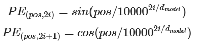
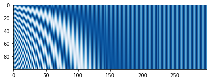
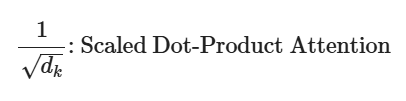
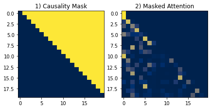
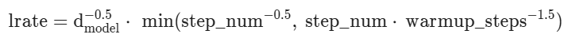
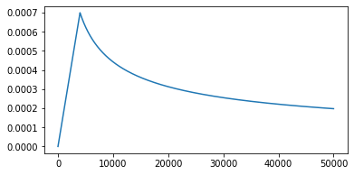

# 학습 내용

---

- Attention의 역사
	- Attention 개념 학습
- Attention Is All You Need!
	- Transformer의 Attention 개념 학습
- Positional Encoding
	- Positional Encoding 원리 학습
- Multi-Head Attention
	- Multi-Head Attention 원리 학습
- Position-wise Feed-Forward Networks
	- Position-wise Feed-Forward Networks 원리 학습
- Additional Techniques
	- Add & Norm 학습
- 트랜스포머, 그 후엔
	- BERT와 GPT 학습

---

## Attention의 역사

---

Sequence-to-sequence(Seq2seq)?

	Encoder-Decoder 구조

		-> 문맥 전체를 반영한 번역이 가능

	->  LSTM을 사용한 Encoder-Decoder 구조

		- Encoder에 Input Sequence x를 넣으면 고정된 크기의 Representation Vector v에 모든 정보를 담아 Decoder에게 전달
		- Decoder는 전달받은 v를 기반으로 Output Sequence y를 생성
		- v는 컨텍스트 벡터(context vector)

Attention을 제안한 이유

	고정된 크기의 컨텍스트 벡터를 사용하는 것 -> 필연적으로 정보의 손실 야기

Attention?

	모든 단어를 같은 비중으로 압축하지 말고, 번역하는 데에 중요한 단어만 큰 비중을 줘 압축하는 방법

Bahdanau Attention 한계점

	T 스텝에서 Decoder의 Hidden State를 구하기 위해 T-1 스텝의 Hidden State를 사용해야 한다는 것

		-> 재귀적으로 동작하는 RNN에 역행하는 연산이므로 효율적 X

			-> Luong이 제안한 Attention으로 극복 가능

---

## Attention Is All You Need!

---

논문 서론의 한 구절

	RNN과 CNN을 완전히 배제하고 Attention 메커니즘에만 기반을 둔 새롭고 단순한 구조

		-> Transformer 제안

RNN류의 한계점

	- 기울기 소실(Vanishing Gradient)
	- 병렬 처리 불가능
		- 순차적으로 계산하기 때문

트랜스포머의 특징

	연속성이라는 개념을 과감히 배제

		-> Attention으로 각 단어들의 상관관계를 구하는 데 집중

트랜스포머의 구조

	-> Encoder-Decoder 구조 사용

		-> Enc-Enc-...-Dec-Dec-... 구조

---

## Positional Encoding

---

문장의 연속성을 배제해 발생한 문제를 해결할 방법

	-> 문장에 연속성을 부여하는 새로운 방법

Positional Encoding의 두 가지 방법

	- 데이터에 0~1사이의 label을 붙인다. 0이 첫번째 단어, 1이 마지막 단어
	- 각 time-step마다 선형적으로 숫자를 할당하는 것

Positional Encoding이 만족해야 할 4가지 조건

	1. 각 time-step(문장에서 단어의 위치)마다 하나의 유일한 encoding 값을 출력
	2. 서로 다른 길이의 문장에 있어서 두 time-step 간 거리는 일정해야 함
	3. 모델에 대한 일반화가 가능해야 함
		- 더 긴 길이의 문장이 나왔을 때 적용될 수 있어야 함
		- 즉, 순서를 나타내는 값 들이 특정 범위 내에 있어야 함 
	4. 하나의 key 값처럼 결정되어야 함 
		- 매번 다른 값이 나와선 안됨

논문의 Positional Encoding 수식

	- pos 
		- 단어가 위치한 Time-step을 의미
	- i
		-  Encoding 차원의 Index
	- dmodel
		- 모델의 Embedding 차원 수

		-> Sinusoid(사인파) Embedding이라고 칭함

Sinusoid(사인파) Embedding ex)

	'''

	import numpy as np

	def positional_encoding(pos, d_model):
	    def cal_angle(position, i):
	        return position / np.power(10000, int(i) / d_model)

	    def get_posi_angle_vec(position):
	        return [cal_angle(position, i) for i in range(d_model)]

	    sinusoid_table = np.array([get_posi_angle_vec(pos_i) for pos_i in range(pos)])

	    sinusoid_table[:, 0::2] = np.sin(sinusoid_table[:, 0::2])
	    sinusoid_table[:, 1::2] = np.cos(sinusoid_table[:, 1::2])

	    return sinusoid_table

	pos = 7
	d_model = 4
	i = 0

	print("Positional Encoding 값:\n", positional_encoding(pos, d_model))

	print("")
	print("if pos == 0, i == 0: ", np.sin(0 / np.power(10000, 2 * i / d_model)))
	print("if pos == 1, i == 0: ", np.sin(1 / np.power(10000, 2 * i / d_model)))
	print("if pos == 2, i == 0: ", np.sin(2 / np.power(10000, 2 * i / d_model)))
	print("if pos == 3, i == 0: ", np.sin(3 / np.power(10000, 2 * i / d_model)))

	print("")
	print("if pos == 0, i == 1: ", np.cos(0 / np.power(10000, 2 * i + 1 / d_model)))
	print("if pos == 1, i == 1: ", np.cos(1 / np.power(10000, 2 * i + 1 / d_model)))
	print("if pos == 2, i == 1: ", np.cos(2 / np.power(10000, 2 * i + 1 / d_model)))
	print("if pos == 3, i == 1: ", np.cos(3 / np.power(10000, 2 * i + 1 / d_model)))

	'''

	결과:   Positional Encoding 값:
		 [[ 0.          1.          0.          1.        ]
		 [ 0.84147098  0.99500417  0.00999983  0.9999995 ]
		 [ 0.90929743  0.98006658  0.01999867  0.999998  ]
		 [ 0.14112001  0.95533649  0.0299955   0.9999955 ]
		 [-0.7568025   0.92106099  0.03998933  0.999992  ]
		 [-0.95892427  0.87758256  0.04997917  0.9999875 ]
		 [-0.2794155   0.82533561  0.05996401  0.999982  ]]

		if pos == 0, i == 0:  0.0
		if pos == 1, i == 0:  0.8414709848078965
		if pos == 2, i == 0:  0.9092974268256817
		if pos == 3, i == 0:  0.1411200080598672

		if pos == 0, i == 1:  1.0
		if pos == 1, i == 1:  0.9950041652780258
		if pos == 2, i == 1:  0.9800665778412416
		if pos == 3, i == 1:  0.955336489125606

		-> print 부분은 하드 코딩해본 것

시각화

	'''

	import matplotlib.pyplot as plt

	plt.figure(figsize=(7, 7))
	plt.imshow(positional_encoding(100, 300), cmap='Blues')
	plt.show()

	'''

	결과: 

	-> 각 스텝마다 고유한 값을 가지는 것을 확인 가능

Positional Embedding?

	수식적으로 계산한 Position 값이 X

		-> Position에 대한 정보를 담은 Embedding 레이어를 선언하여 위치에 대한 정보를 학습

	훈련 중 값이 변한다고 하더라도 그것은 모든 문장에 대해 동일하게 적용되기에 문제 X

두 방법의 BLEU Score 점수 차이

	거의 동일한(±0.1 BLEU) 결과를 보였음

		-> 논문 저자들은 길이가 길어져도 부담이 없는 Sinusoid Embedding을 채택

			-> Positional Embedding은 문장의 길이만큼 Embedding Table의 크기 때문!

---

## Multi-Head Attention

---

Multi-Head Attention?

	Positional Embedding이 된 문장으로부터 Attention을 추출하는 부분

Masked Multi-Head Attention??

	Multi-Head Attention과 동일하지만 인과 관계 마스킹(Causality Masking) 이라는 과정이 하나 더 추가됨

Multi-Head Attention 모듈의 구조

	Linear 레이어, Scaled Dot-Product Attention 레이어

Scaled Dot-Product Attention?

	- 오른쪽 
		- 전통적인 attention 개념
		- 바로 디코더의 포지션 i에서 바라본 인코더의 context vector  ci를 해석하기 위해, 인코더의 각 포지션 j에 부여한 가중치
		- 디코더의 state si와 인코더의 state hj 사이의 유사도를 통해 계산
	- 왼쪽
		- Scaled Dot-Product Attention
		- Q와 K의 유사도를 dot product로 계산해 softmax를 취한 값을 attention 가중치로 삼고, 이것으로 V(value)를 재해석해 준 것
		- 인코더 쪽에서 hj 하나만 존재 하던 것 -> K와 V 2가지로 분화

참고 글

[reniew's blog: Transformer: Attention is all you need](https://reniew.github.io/43/)

 

Q. 트랜스포머의 Attention은 위의 식으로 Attention 값을 나눠준다는 것에서 "Scaled" Dot-Product Attention이라고 불림. 이 Scale 과정은 어떤 의미를 가지나? (또는, 왜 필요한가?)

	A. Embedding 차원 수가 깊어지면 깊어질수록 Dot-Product의 값은 커지게 되어 Softmax를 거치고 나면 미분 값이 작아지는 현상이 나타남 
	   그 경우를 대비해 Scale 작업이 필요

자기 회귀(Autoregressive)

	1. Decoder의 첫 입력으로 start 토큰이 들어감
	2. Decoder는 컨텍스트 벡터로 압축된 입력 문장과 start 토큰만을 단서로 첫 번째 단어를 생성
	3. 그다음 스텝도 같은 단서에 추가로 방금 Decoder 본인이 생성한 첫 번째 단어를 포함하여 두 번째 단어를 생성

		-> 자기 자신을 입력으로 하여 자기 자신을 예측하는 것

			-> 이런 특성을 지칭함

트랜스포머에서의 자기 회귀적인 특성

	모든 단어를 병렬적으로 처리하기에 자기 회귀적인 특성을 잃어버림

		-> 문장을 생성할 수 없다는 의미!!

인과 관계 마스킹(Causality Masking)??

	목표하는 문장의 일부를 가려 인위적으로 연속성을 학습 하게 하는 방법

		-> 자기 회귀적인 특성을 살리기 위해 추가한 것

	-> 모든 Time-Step에 대한 입력을 한 번에 처리하면서 자기 회귀적인 특성도 유지

	-> 대각항을 포함하지 않는 삼각 행렬의 모양새를 가짐

		-> 입력 문장만을 보고 첫 번째 단어를 생성하는 것은 타겟 문장을 모두 가리는 것이 타당하니 대각항을 포함하는 게 맞지만

			-> 그럴 경우 Attention 값을 구하는 과정에서 마지막(혹은 첫 번째) 행이 0개 요소에 대해 Softmax를 취하게 되므로 오류를 야기

				-> <start> 토큰을 활용해 마스크가 대각항을 포함하지 않는 형태가 되게끔 만든 것

시각화

	'''

	import numpy as np
	import tensorflow as tf
	import matplotlib.pyplot as plt

	def make_dot_product_tensor(shape):
	    A = tf.random.uniform(shape, minval=-3, maxval=3)
	    B = tf.transpose(tf.random.uniform(shape, minval=-3, maxval=3), [1, 0])

	    return tf.tensordot(A, B, axes=1)

	def generate_causality_mask(seq_len):
	    mask = 1 - np.cumsum(np.eye(seq_len, seq_len), 0)
	    return mask

	sample_tensor = make_dot_product_tensor((20, 512))
	sample_tensor = sample_tensor / tf.sqrt(512.)

	mask = generate_causality_mask(sample_tensor.shape[0])

	fig = plt.figure(figsize=(7, 7))

	ax1 = fig.add_subplot(121)
	ax2 = fig.add_subplot(122)

	ax1.set_title('1) Causality Mask')
	ax2.set_title('2) Masked Attention')

	ax1.imshow((tf.ones(sample_tensor.shape) + mask).numpy(), cmap='cividis')

	mask *= -1e9
	ax2.imshow(tf.nn.softmax(sample_tensor + mask, axis=-1).numpy(), cmap='cividis')

	plt.show()

	'''

	결과: 

	-> 마스킹은 마스킹 할 영역을 -∞로 채우고 그 외 영역을 0으로 채운 배열을 Dot-Product된 값에 더해주는 방식으로 진행

Multi-Head Attention?

	-> '여러 개의 Head로 나누어 처리하면 Embedding의 다양한 정보를 캐치할 수 있지 않을까?' 라는 아이디어를 제시

Multi-Head Attention ex)

	Embedding된 10개 단어의 문장이 [10, 512]의 형태를 가진다면

		-> Multi-Head Attention은 이를 [10, 8, 64]로 분할하여 연산

		-> 각 64차원의 Embedding을 독립적으로 Attention한 후

		-> 이를 이어붙여 다시금 [10, 512]의 형태로 되돌리며 연산 끝

Multi-Head Attention의 Linear 레이어 역할

	- Head로 쪼갠 Embedding들끼리 유사한 특성을 가진다는 보장이 없기 때문에 Linear 레이어를 추가
		- 데이터를 특정 분포로 매핑 시키는 역할
	- Head가 Attention 한 값이 균일한 분포를 가질 거란 보장이 없기 때문에 Linear 레이어 사용
		- 모든 Attention 값을 합쳐준 후 최종적으로 Linear 레이어

---

## Position-wise Feed-Forward Networks

---

Position-wise Feed-Forward Networks

	-> W는 Linear 레이어를 의미하고, max(0, x) 함수는 활성 함수 ReLU

		-> 10단어로 이루어진 Attention된 문장 [10, 512]를 [10, 2048] 공간으로 매핑, 활성함수를 적용한 후 다시 [10, 512] 공간으로 되돌리는 것

---

## Additional Techniques

---

Layer Normalization?

	데이터를 Feature 차원에서 정규화를 하는 방법

		-> 분포를 일정하게 맞춰주는 것

Learning Rate Schedular?

	Adam Optimizer 사용

		-> Learning Rate를 수식에 따라 변화시키며 사용했다는 것

	'''

	import matplotlib.pyplot as plt
	import numpy as np

	d_model = 512
	warmup_steps = 4000

	lrates = []
	for step_num in range(1, 50000):
	    lrate = (np.power(d_model, -0.5)) * np.min(
	        [np.power(step_num, -0.5), step_num * np.power(warmup_steps, -1.5)])
	    lrates.append(lrate)

	plt.figure(figsize=(6, 3))
	plt.plot(lrates)
	plt.show()

	'''

	-> Learning Rate를 사용하면 초반 학습이 잘되지 않은 상태에서의 학습 효율이 늘어나고, 어느 정도 학습이 된 후반에는 디테일한 튜닝을 통해 Global Minimum을 찾아가는 효과가 나게됨

Weight Sharing?

	하나의 Weight를 두 개 이상의 레이어가 동시에 사용

		-> 언어 모델의 Embedding 레이어와 최종 Linear 레이어가 동일한 사이즈의 Weight를 가짐

		-> 트랜스포머에서는 Decoder의 Embedding 레이어와 출력층 Linear 레이어의 Weight를 공유하는 방식 사용
