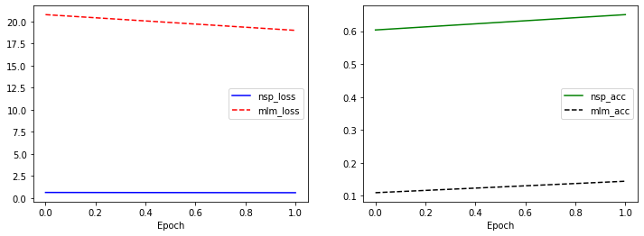

# 학습 내용

---

- Tokenizer 준비
	- BPE를 바탕으로 단어 분석
- 데이터 전처리 (1) MASK 생성
	- Masked LM은 어떻게 만들까?
- 데이터 전처리 (2) NSP pair 생성
	- 다음에 이어질 문장으로 가장 적절한 것은?
- 데이터 전처리 (3) 데이터셋 완성
	- NSP에 맞게 데이터셋 세팅
- BERT 모델 구현
	- 나만의 작고 소중한 BERT
- pretrain 진행
	- pretrained model 제작

---

## Tokenizer 준비

---

토크나이징 기법

	BPE 등의 subword 기반의 토크나이징 기법이 주요한 방법론으로 굳어졌음!!

		-> GPT의 BPE, BERT의 WordPiece 모델 등의 성공이 더욱 사람들에게 subword 기반의 토크나이저에 대한 확신을 줌

필요한 라이브러리 import 

	'''

	from __future__ import absolute_import, division, print_function, unicode_literals

	import tensorflow as tf
	import tensorflow.keras.backend as K

	import os
	import re
	import math
	import numpy as np
	import pandas as pd
	import random
	import collections
	import json
	import shutil
	import zipfile
	import copy
	from datetime import datetime

	import matplotlib.pyplot as plt
	import sentencepiece as spm
	from tqdm.notebook import tqdm

	random_seed = 1234
	random.seed(random_seed)
	np.random.seed(random_seed)
	tf.random.set_seed(random_seed)

	'''

sentencepiece 모델 생성

	한글 나무위키 코퍼스로사용, vocab_size: 32000

	'''

	import sentencepiece as spm
	import os

	corpus_file = os.getenv('HOME')+'/aiffel/bert_pretrain/data/kowiki.txt'
	prefix = os.getenv('HOME')+'/aiffel/bert_pretrain/models/ko_32000'
	vocab_size = 32000

	spm.SentencePieceTrainer.train(f"--input={corpus_file} --model_prefix={prefix} --vocab_size={vocab_size + 7} --model_type=bpe --max_sentence_length=999999 --pad_id=0 --pad_piece=[PAD] --unk_id=1 --unk_piece=[UNK] --bos_id=2 --bos_piece=[BOS] --eos_id=3 --eos_piece=[EOS] --user_defined_symbols=[SEP],[CLS],[MASK]")
	
	'''

SentencePiece 모델 load

	'''

	data_dir = os.getenv('HOME')+'/aiffel/bert_pretrain/data'
	model_dir = os.getenv('HOME')+'/aiffel/bert_pretrain/models'

	# vocab loading
	vocab = spm.SentencePieceProcessor()
	vocab.load(f"{model_dir}/ko_32000.model")

	'''

특수 토큰을 포함한 토큰화

	'''

	# [CLS], tokens a, [SEP], tokens b, [SEP] 형태의 token 생성
	string_a = "추적추적 비가 내리는 날이었어 그날은 왠지 손님이 많아 첫 번에 삼십 전 둘째번 오십 전 오랜만에 받아보는 십 전짜리 백통화 서푼에"
	string_b = "손바닥 위엔 기쁨의 눈물이 흘러 컬컬한 목에 모주 한잔을 적셔 몇 달 포 전부터 콜록거리는 아내 생각에 그토록 먹고 싶다던"
	tokens_org = ["[CLS]"] + vocab.encode_as_pieces(string_a) + ["[SEP]"] + vocab.encode_as_pieces(string_b) + ["[SEP]"]
	print(tokens_org)

	'''

	결과: ['[CLS]', '▁추적', '추', '적', '▁비가', '▁내리는', '▁날', '이었', '어', '▁그날', '은', '▁', '왠', '지', '▁손', '님이', '▁많아', '▁첫', '▁번에', '▁삼', '십', '▁전', '▁둘째', '번', '▁오', '십', '▁전', '▁오랜', '만에', '▁받아', '보는', '▁십', '▁전', '짜리', '▁백', '통', '화', '▁서', '푼', '에', '[SEP]', '▁손바닥', '▁위', '엔', '▁기쁨', '의', '▁눈', '물이', '▁흘러', '▁컬', '컬', '한', '▁목에', '▁모', '주', '▁한', '잔', '을', '▁적', '셔', '▁몇', '▁달', '▁포', '▁전부터', '▁콜', '록', '거리는', '▁아내', '▁생각에', '▁그', '토록', '▁먹고', '▁싶다', '던', '[SEP]']

---

## 데이터 전처리 (1) MASK 생성

---

BERT의 Masked Language Model(MLM)?

	- 마스킹 된 다음 빈칸에 알맞은 단어는? 문제를 푸는 형식으로 구성
	- 학습 데이터의 전체에서 15%를 [MASK] 토큰으로 랜덤하게 바꿈
		- 80%는 [MASK] 토큰
		- 10%는 무작위로 랜덤한 토큰
		- 나머지 10%는 원래의 토큰을 그대로 사용

create_pretrain_mask() 정의

	Masked LM을 위한 코퍼스 생성 메소드

	'''

	def create_pretrain_mask(tokens, mask_cnt, vocab_list):
	    """
	    마스크 생성
	    :param tokens: tokens
	    :param mask_cnt: mask 개수 (전체 tokens의 15%)
	    :param vocab_list: vocab list (random token 용)
	    :return tokens: mask된 tokens
	    :return mask_idx: mask된 token의 index
	    :return mask_label: mask된 token의 원래 값
	    """
	    # 단어 단위로 mask 하기 위해서 index 분할 (띄어쓰기)
	    cand_idx = []  # word 단위의 index array
	    for (i, token) in enumerate(tokens_org):
	        if token == "[CLS]" or token == "[SEP]":
	            continue
	        if 0 < len(cand_idx) and not token.startswith(u"\u2581"):  # u"\u2581"는 단어의 시작을 의미하는 값
	            cand_idx[-1].append(i)
	        else:
	            cand_idx.append([i])

	    # random mask를 위해서 순서를 섞음 (shuffle)
	    random.shuffle(cand_idx)

	    # masking
	    mask_lms = []  # mask 된 값
	    for index_set in cand_idx:
	        if len(mask_lms) >= mask_cnt:  # 핸재 mask된 개수가 15%를 넘으면 중지
	            break
	        if len(mask_lms) + len(index_set) > mask_cnt:  # 이번에 mask할 개수를 포함해 15%를 넘으면 skip
	            continue
	        dice = random.random()  # 0과 1 사이의 확률 값

	        for index in index_set:
	            # len(tokens) 이내에서만 접근하도록 제한
	            if index >= len(tokens):
	                continue
	            masked_token = None
	            if dice < 0.8:  # 80% replace with [MASK]
	                masked_token = "[MASK]"
	            elif dice < 0.9: # 10% keep original
	                masked_token = tokens[index]
	            else:  # 10% random word
	                masked_token = random.choice(vocab_list)
	            mask_lms.append({"index": index, "label": tokens[index]})
	            tokens[index] = masked_token

	    # mask_lms 정렬 후 mask_idx, mask_label 추출 (sorted 사용)
	    mask_lms = sorted(mask_lms, key=lambda x: x["index"])
	    mask_idx = [p["index"] for p in mask_lms]
	    mask_label = [p["label"] for p in mask_lms]

	    return tokens, mask_idx, mask_label

	'''

create_pretrain_mask() 실행 순서

	1. 띄어쓰기 단위로 mask하기 위해서 index 분할
	2. random mask를 위해서 index 순서를 섞음
	3. masking 작업
	4. mask_idx, mask_label 추출

create_pretrain_mask() 메서드 실험

	'''

	# tokens가 mask되므로 재 실행을 위해서 넣어줌 (테스트용)
	tokens = copy.deepcopy(tokens_org)

	tokens, mask_idx, mask_label = create_pretrain_mask(tokens, mask_cnt, vocab_list)

	print("tokens_org")
	print(tokens_org, "\n")
	print("tokens")
	print(tokens, "\n")

	print("mask_idx   :", mask_idx)
	print("mask_label :", mask_label)

	'''

	결과:   tokens_org
		['[CLS]', '▁추적', '추', '적', '▁비가', '▁내리는', '▁날', '이었', '어', '▁그날', '은', '▁', '왠', '지', '▁손', '님이', '▁많아', '▁첫', '▁번에', '▁삼', '십', '▁전', '▁둘째', '번', '▁오', '십', '▁전', '▁오랜', '만에', '▁받아', '보는', '▁십', '▁전', '짜리', '▁백', '통', '화', '▁서', '푼', '에', '[SEP]', '▁손바닥', '▁위', '엔', '▁기쁨', '의', '▁눈', '물이', '▁흘러', '▁컬', '컬', '한', '▁목에', '▁모', '주', '▁한', '잔', '을', '▁적', '셔', '▁몇', '▁달', '▁포', '▁전부터', '▁콜', '록', '거리는', '▁아내', '▁생각에', '▁그', '토록', '▁먹고', '▁싶다', '던', '[SEP]'] 

		tokens
		['[CLS]', '▁추적', '추', '적', '▁비가', '▁내리는', '▁날', '이었', '어', '▁그날', '은', '▁', '왠', '지', '▁손', '님이', '▁많아', '▁첫', '[MASK]', '▁삼', '십', '▁전', '▁둘째', '번', '[MASK]', '[MASK]', '▁전', '▁오랜', '만에', '▁받아', '보는', '▁그레이트', '▁전', '짜리', '▁백', '통', '화', '▁서', '푼', '에', '[SEP]', '▁손바닥', '▁위', '엔', '[MASK]', '[MASK]', '▁눈', '물이', '▁흘러', '[MASK]', '[MASK]', '[MASK]', '▁목에', '▁모', '주', '▁한', '잔', '을', '▁적', '셔', '▁몇', '▁달', '▁포', '▁전부터', '▁콜', '록', '거리는', '▁아내', '▁생각에', '▁그', '토록', '▁먹고', '▁싶다', '던', '[SEP]'] 

		mask_idx   : [18, 24, 25, 31, 44, 45, 49, 50, 51, 63]

---

## 데이터 전처리 (2) NSP pair 생성

---

Next Sentence Prediction?

	문장 2개를 붙여 놓고 두 문장이 이어지는 것인지 아닌지 문장 호응관계를 맞출 수 있게 하는 것

	ex)
	[CLS]여름의 마지막 해수욕 누가 제일 늦게 바다에서 나왔나 [SEP] 그 사람이 바다의 뚜껑 닫지 않고 돌아가[SEP] → TRUE(IsNext)

	[CLS]여름의 마지막 해수욕 누가 제일 늦게 바다에서 나왔나 [SEP] 한강에서 자전거 타며 아이스아메리카노를 마시고 싶다[SEP] → FALSE(NotNext)

예시 문장 생성

	'''

	string = """추적추적 비가 내리는 날이었어
	그날은 왠지 손님이 많아
	첫 번에 삼십 전 둘째 번 오십 전
	오랜만에 받아보는 십 전짜리 백통화 서푼에
	손바닥 위엔 기쁨의 눈물이 흘러
	컬컬한 목에 모주 한잔을 적셔
	몇 달 포 전부터 콜록거리는 아내
	생각에 그토록 먹고 싶다던
	설렁탕 한 그릇을 이제는 살 수 있어
	집으로 돌아가는 길 난 문득 떠올라
	아내의 목소리가 거칠어만 가는 희박한 숨소리가
	오늘은 왠지 나가지 말라던 내 옆에 있어 달라던
	그리도 나가고 싶으면 일찍이라도 들어와 달라던
	아내의 간절한 목소리가 들려와
	나를 원망하듯 비는 점점 거세져
	싸늘히 식어가는 아내가 떠올라 걱정은 더해져
	난 몰라 오늘은 운수 좋은 날
	난 맨날 이렇게 살 수 있으면 얼마나 좋을까"""

	'''

예시 문장 줄 단위로 tokenize

	'''

	# 줄 단위로 tokenize
	doc = [vocab.encode_as_pieces(line) for line in string.split("\n")]
	doc[:3]

	'''

	결과:   [['▁추적', '추', '적', '▁비가', '▁내리는', '▁날', '이었', '어'],
		 ['▁그날', '은', '▁', '왠', '지', '▁손', '님이', '▁많아'],
		 ['▁첫', '▁번에', '▁삼', '십', '▁전', '▁둘째', '▁번', '▁오', '십', '▁전']]

특수 token, sequence의 최대 길이 지정

	특수 token: [CLS]와 [SEP]

	'''

	# 최대 길이
	n_test_seq = 64
	# 최소 길이
	min_seq = 8
	# [CLS], tokens_a, [SEB], tokens_b, [SEP]
	max_seq = n_test_seq - 3

	'''

trim_tokens() 메서드 정의

	두 문장의 최대 길이를 유지하도록 - token A의 길이가 max_seq보다 길면 앞에서부터 토큰을 제거

					 - token B의 길이가 길면 뒤에서부터 토큰을 제거

	'''

	def trim_tokens(tokens_a, tokens_b, max_seq):
	    """
	    tokens_a, tokens_b의 길이를 줄임 최대 길이: max_seq
	    :param tokens_a: tokens A
	    :param tokens_b: tokens B
	    :param max_seq: 두 tokens 길이의 최대 값
	    """
	    while True:
	        total_length = len(tokens_a) + len(tokens_b)
	        if total_length <= max_seq:
	            break

	        if len(tokens_a) > len(tokens_b):
	            del tokens_a[0]
	        else:
	            tokens_b.pop()

	'''

create_pretrain_instances() 메서드 정의

	Next Sentence Prediction을 위한 코퍼스 생성 메소드

	'''

	def create_pretrain_instances(vocab, doc, n_seq, mask_prob, vocab_list):
	    """
	    doc별 pretrain 데이터 생성
	    """
	    # for CLS], [SEP], [SEP]
	    max_seq = n_seq - 3

	    instances = []
	    current_chunk = []
	    current_length = 0
	    for i in range(len(doc)):
	        current_chunk.append(doc[i])  # line 단위로 추가
	        current_length += len(doc[i])  # current_chunk의 token 수
	        if 1 < len(current_chunk) and (i == len(doc) - 1 or current_length >= max_seq):  # 마지막 줄 이거나 길이가 max_seq 이상 인 경우

	            # token a
	            a_end = 1
	            if 1 < len(current_chunk):
	                a_end = random.randrange(1, len(current_chunk))
	            tokens_a = []
	            for j in range(a_end):
	                tokens_a.extend(current_chunk[j])
	            # token b
	            tokens_b = []
	            for j in range(a_end, len(current_chunk)):
	                tokens_b.extend(current_chunk[j])

	            if random.random() < 0.5:  # 50% 확률로 swap
	                is_next = 0    # False
	                tokens_t = tokens_a
	                tokens_a = tokens_b
	                tokens_b = tokens_t
	            else:
	                is_next = 1   # True
	            # max_seq 보다 큰 경우 길이 조절
	            trim_tokens(tokens_a, tokens_b, max_seq)
	            assert 0 < len(tokens_a)
	            assert 0 < len(tokens_b)

	            # tokens & segment 생성
	            tokens = ["[CLS]"] + tokens_a + ["[SEP]"] + tokens_b + ["[SEP]"]
	            segment = [0] * (len(tokens_a) + 2) + [1] * (len(tokens_b) + 1)
            
	            # mask
	            tokens, mask_idx, mask_label = create_pretrain_mask(tokens, int((len(tokens) - 3) * 0.15), vocab_list)

	            instance = {
	                "tokens": tokens,
	                "segment": segment,
	                "is_next": is_next,
	                "mask_idx": mask_idx,
	                "mask_label": mask_label
	            }
	            instances.append(instance)

	            current_chunk = []
	            current_length = 0
	    return instances

	'''

create_pretrain_instances() 실행 순서

	doc별 pretrain 데이터 생성
	
	1. 토큰 A와 토큰 B 분리
	2. 50% 확률로 swap
	3. trim_tokens 메서드를 통해 max_seq 이하로 조정
	4. tokens & segment 생성
	5. masking
	6. 각 정보를 담은 instance 생성

create_pretrain_instances() 테스트

	'''

	instances = create_pretrain_instances(vocab, doc, n_test_seq, 0.15, vocab_list)

	# 최종 데이터셋 결과 확인
	for instance in instances:
	    print(instance)

	'''

	결과:   {'tokens': ['[CLS]', '▁추적', '추', '적', '▁비가', '▁내리는', '▁날', '이었', '어', '▁그날', '은', '▁', '왠', '지', '▁손', '님이', '▁많아', '▁첫', '▁번에', '[MASK]', '[MASK]', '▁전', '▁둘째', '▁번', '▁오', '십', '▁전', '[SEP]', '▁오랜', '만에', '▁받아', '보는', '▁십', '▁전', '[MASK]', '[MASK]', '[MASK]', '화', '▁서', '푼', '에', '▁손바닥', '▁위', '엔', '▁기쁨', '의', '▁눈', '물이', '▁흘러', '▁컬', '컬', '한', '[MASK]', '▁모', '주', '▁한', '잔', '을', '고시', '▁쾰른', '▁몇', '▁달', '▁포', '[SEP]'], 'segment': [0, 0, 0, 0, 0, 0, 0, 0, 0, 0, 0, 0, 0, 0, 0, 0, 0, 0, 0, 0, 0, 0, 0, 0, 0, 0, 0, 0, 1, 1, 1, 1, 1, 1, 1, 1, 1, 1, 1, 1, 1, 1, 1, 1, 1, 1, 1, 1, 1, 1, 1, 1, 1, 1, 1, 1, 1, 1, 1, 1, 1, 1, 1, 1], 'is_next': 1, 'mask_idx': [19, 20, 34, 35, 36, 41, 52, 58, 59], 'mask_label': ['▁삼', '십', '짜리', '▁백', '통', '▁손바닥', '▁목에', '▁적', '셔']}
		{'tokens': ['[CLS]', '[MASK]', '[MASK]', '[MASK]', '▁목소리가', '▁들려', '[MASK]', '[MASK]', '[MASK]', '▁그', '토록', '▁먹고', '▁싶다', '던', '▁설', '렁', '탕', '▁한', '▁그릇', '을', '▁이제는', '[MASK]', '▁수', '▁있어', '[MASK]', '[MASK]', '▁길', '▁난', '▁문', '득', '▁떠올', '라', '▁아내의', '▁목소리가', '▁거칠', '어', '만', '▁가는', '▁희', '박한', '▁숨', '소', '리가', '▁오늘', '은', '▁', '왠', '지', '▁나가지', '▁말라', '던', '▁내', '▁옆에', '▁있어', '▁달라', '던', '▁그리', '도', '▁나가', '고', '▁싶', '으면', '▁일찍', '[SEP]'], 'segment': [0, 0, 0, 0, 0, 0, 0, 0, 1, 1, 1, 1, 1, 1, 1, 1, 1, 1, 1, 1, 1, 1, 1, 1, 1, 1, 1, 1, 1, 1, 1, 1, 1, 1, 1, 1, 1, 1, 1, 1, 1, 1, 1, 1, 1, 1, 1, 1, 1, 1, 1, 1, 1, 1, 1, 1, 1, 1, 1, 1, 1, 1, 1, 1], 'is_next': 0, 'mask_idx': [1, 2, 3, 6, 7, 8, 21, 24, 25], 'mask_label': ['▁아내의', '▁간', '절한', '와', '[SEP]', '▁생각에', '▁살', '▁집으로', '▁돌아가는']}
		{'tokens': ['[CLS]', '▁나를', '▁원', '망', '[MASK]', '듯', '▁비는', '▁점점', '▁거세', '져', '[SEP]', '▁싸', '늘', '히', '[MASK]', '[MASK]', '가는', '▁아내가', '[MASK]', '라', '▁걱', '정은', '[MASK]', '[MASK]', '▁난', '▁몰', '라', '▁오늘', '은', '▁운수', '▁좋은', '▁날', '▁난', '▁맨', '날', '▁이렇게', '▁살', '▁수', '▁있으면', '▁얼마나', '▁좋', '을', '까', '[SEP]'], 'segment': [0, 0, 0, 0, 0, 0, 0, 0, 0, 0, 0, 1, 1, 1, 1, 1, 1, 1, 1, 1, 1, 1, 1, 1, 1, 1, 1, 1, 1, 1, 1, 1, 1, 1, 1, 1, 1, 1, 1, 1, 1, 1, 1, 1], 'is_next': 1, 'mask_idx': [4, 14, 15, 18, 22, 23], 'mask_label': ['하', '▁식', '어', '▁떠올', '▁더', '해져']}

---

## 데이터 전처리 (3) 데이터셋 완성

---

kowiki.txt 확인

	'''

	corpus_file = os.getenv('HOME')+'/aiffel/bert_pretrain/data/kowiki.txt'

	# line count 확인
	total = 0
	with open(corpus_file, 'r') as in_f:
	    for line in in_f:
	        total += 1

	total

	'''

	결과: 3957761

make_pretrain_data() 메서드 정의

	BERT pretrain 데이터셋 생성 메소드

	'''

	def make_pretrain_data(vocab, in_file, out_file, n_seq, mask_prob=0.15):
	    """ pretrain 데이터 생성 """
	    def save_pretrain_instances(out_f, doc):
	        instances = create_pretrain_instances(vocab, doc, n_seq, mask_prob, vocab_list)

	        for instance in instances:
	            out_f.write(json.dumps(instance, ensure_ascii=False))
	            out_f.write("\n")

	    # 특수문자 7개를 제외한 vocab_list 생성
	    vocab_list = []
	    for id in range(7, len(vocab)):
	        if not vocab.is_unknown(id):        # 생성되는 단어 목록이 unknown인 경우는 제거합니다. 
	            vocab_list.append(vocab.id_to_piece(id))

	    # line count 확인
	    line_cnt = 0
	    with open(in_file, "r") as in_f:
	        for line in in_f:
	            line_cnt += 1

	    with open(in_file, "r") as in_f:
	        with open(out_file, "w") as out_f:
	            doc = []
	            for line in tqdm(in_f, total=line_cnt):
	                line = line.strip()
	                if line == "":  # line이 빈줄 일 경우 (새로운 단락)
	                    if 0 < len(doc):
	                        save_pretrain_instances(out_f, doc)
                        
	                        doc = []
	                        if 0 < line_cnt:  # 테스트를 위해서 부분 처리함
	                            line_cnt -= 1
	                        else:
	                            break
	                else:  # line이 빈줄이 아닐 경우 tokenize 해서 doc에 저장
	                    pieces = vocab.encode_as_pieces(line)  # line을 토큰화하여 pieces에 저장
	                    if 0 < len(pieces):
	                        doc.append(pieces)
	            if 0 < len(doc):  # 마지막에 처리되지 않은 doc가 있는 경우
	                save_pretrain_instances(out_f, doc)
                
	                doc = []

	'''

make_pretrain_data() 실행 순서

	1. 특수문자 7개를 제외한 vocab_list 생성
	2. line count 확인
	3. 각 line을 가져와 공백 제거 후 줄 여부 확인
		- line이 빈 줄일 경우
			- save_pretrain_instances 호출
			- doc 초기화
			- line_cnt -1
		- line이 빈줄이 아닐 경우
			- 토큰화하여 pieces에 저장
			- doc에 추가
	4. 마지막에 처리되지 않은 doc가 있는 경우 
		- save_pretrain_instances 호출
                - doc 초기화

전체 코퍼스에 make_pretrain_data() 구동

	'''

	pretrain_json_path = os.getenv('HOME')+'/aiffel/bert_pretrain/data/bert_pre_train.json'

	make_pretrain_data(vocab, corpus_file, pretrain_json_path, 128)

	total = 0
	with open(pretrain_json_path, "r") as f:
	    for line in f:
	        total += 1
	total

	'''

	결과: 862285

메모리 사용량을 최소화하는 방법

	np.memmap 사용!

	'''

	n_seq = 128
	# [CLS], tokens_a, [SEP], tokens_b, [SEP]
	max_seq = n_seq - 3

	# np.memmap을 사용하면 메모리를 적은 메모리에서도 대용량 데이터 처리가 가능 함
	enc_tokens = np.memmap(filename='enc_tokens.memmap', mode='w+', dtype=np.int32, shape=(total, n_seq))
	segments = np.memmap(filename='segments.memmap', mode='w+', dtype=np.int32, shape=(total, n_seq))
	labels_nsp = np.memmap(filename='labels_nsp.memmap', mode='w+', dtype=np.int32, shape=(total,))
	labels_mlm = np.memmap(filename='labels_mlm.memmap', mode='w+', dtype=np.int32, shape=(total, n_seq))

	# 라인 단위로 처리
	with open(pretrain_json_path, "r") as f:
	    for i, line in enumerate(tqdm(f, total=total)):
	        if 5 < i:  # 테스트를 위해서 5개만 확인
	            break
	        data = json.loads(line)
	        # encoder token
	        enc_token = [vocab.piece_to_id(p) for p in data["tokens"]]
	        enc_token += [0] * (n_seq - len(enc_token))
	        # segment
	        segment = data["segment"]
	        segment += [0] * (n_seq - len(segment))
	        # nsp label
	        label_nsp = data["is_next"]
	        # mlm label
	        mask_idx = np.array(data["mask_idx"], dtype=np.int)
	        mask_label = np.array([vocab.piece_to_id(p) for p in data["mask_label"]], dtype=np.int)
	        label_mlm = np.full(n_seq, dtype=np.int, fill_value=0)
	        label_mlm[mask_idx] = mask_label

	        assert len(enc_token) == len(segment) == len(label_mlm) == n_seq

	        enc_tokens[i] = enc_token
	        segments[i] = segment
	        labels_nsp[i] = label_nsp
	        labels_mlm[i] = label_mlm

	'''

load_pre_train_data() 메서드 정의

	'''

	def load_pre_train_data(vocab, filename, n_seq, count=None):
	    """
	    학습에 필요한 데이터를 로드
	    :param vocab: vocab
	    :param filename: 전처리된 json 파일
	    :param n_seq: 시퀀스 길이 (number of sequence)
	    :param count: 데이터 수 제한 (None이면 전체)
	    :return enc_tokens: encoder inputs
	    :return segments: segment inputs
	    :return labels_nsp: nsp labels
	    :return labels_mlm: mlm labels
	    """
  	  total = 0
	    with open(filename, "r") as f:
	        for line in f:
	            total += 1
	            # 데이터 수 제한
	            if count is not None and count <= total:
	                break
    
	    # np.memmap을 사용하면 메모리를 적은 메모리에서도 대용량 데이터 처리가 가능 함
	    enc_tokens = np.memmap(filename='enc_tokens.memmap', mode='w+', dtype=np.int32, shape=(total, n_seq))
	    segments = np.memmap(filename='segments.memmap', mode='w+', dtype=np.int32, shape=(total, n_seq))
	    labels_nsp = np.memmap(filename='labels_nsp.memmap', mode='w+', dtype=np.int32, shape=(total,))
	    labels_mlm = np.memmap(filename='labels_mlm.memmap', mode='w+', dtype=np.int32, shape=(total, n_seq))

	    with open(filename, "r") as f:
	        for i, line in enumerate(tqdm(f, total=total)):
	            if total <= i:
	                print("data load early stop", total, i)
	                break
	            data = json.loads(line)
	            # encoder token
	            enc_token = [vocab.piece_to_id(p) for p in data["tokens"]]
	            enc_token += [0] * (n_seq - len(enc_token))
	            # segment
	            segment = data["segment"]
	            segment += [0] * (n_seq - len(segment))
	            # nsp label
	            label_nsp = data["is_next"]
	            # mlm label
	            mask_idx = np.array(data["mask_idx"], dtype=np.int)
	            mask_label = np.array([vocab.piece_to_id(p) for p in data["mask_label"]], dtype=np.int)
	            label_mlm = np.full(n_seq, dtype=np.int, fill_value=0)
	            label_mlm[mask_idx] = mask_label

	            assert len(enc_token) == len(segment) == len(label_mlm) == n_seq

	            enc_tokens[i] = enc_token
	            segments[i] = segment
	            labels_nsp[i] = label_nsp
	            labels_mlm[i] = label_mlm

	    return (enc_tokens, segments), (labels_nsp, labels_mlm)

	'''

데이터 load

	'''

	# 128000건만 메모리에 로딩
	pre_train_inputs, pre_train_labels = load_pre_train_data(vocab, pretrain_json_path, 128, count=128000)

	'''

---

## BERT 모델 구현

---

BERT의 임베딩

유틸리티 함수 정의

	'''

	def get_pad_mask(tokens, i_pad=0):
	    """
	    pad mask 계산하는 함수
	    :param tokens: tokens (bs, n_seq)
	    :param i_pad: id of pad
	    :return mask: pad mask (pad: 1, other: 0)
	    """
	    mask = tf.cast(tf.math.equal(tokens, i_pad), tf.float32)
	    mask = tf.expand_dims(mask, axis=1)
	    return mask

	'''

	'''

	def get_ahead_mask(tokens, i_pad=0):
	    """
	    ahead mask 계산하는 함수
	    :param tokens: tokens (bs, n_seq)
	    :param i_pad: id of pad
	    :return mask: ahead and pad mask (ahead or pad: 1, other: 0)
	    """
	    n_seq = tf.shape(tokens)[1]
	    ahead_mask = 1 - tf.linalg.band_part(tf.ones((n_seq, n_seq)), -1, 0)
	    ahead_mask = tf.expand_dims(ahead_mask, axis=0)
	    pad_mask = get_pad_mask(tokens, i_pad)
	    mask = tf.maximum(ahead_mask, pad_mask)
	    return mask

	'''

	'''

	@tf.function(experimental_relax_shapes=True)
	def gelu(x):
	    """
	    gelu activation 함수
	    :param x: 입력 값
	    :return: gelu activation result
	    """
	    return 0.5*x*(1+tf.tanh(np.sqrt(2/np.pi)*(x+0.044715*tf.pow(x, 3))))

	'''

	'''

	def kernel_initializer(stddev=0.02):
	    """
	    parameter initializer 생성
	    :param stddev: 생성할 랜덤 변수의 표준편차
	    """
	    return tf.keras.initializers.TruncatedNormal(stddev=stddev)

	'''

	'''

	def bias_initializer():
	    """
	    bias initializer 생성
	    """
	    return tf.zeros_initializer

	'''

	'''

	class Config(dict):
	    """
	    json을 config 형태로 사용하기 위한 Class
	    :param dict: config dictionary
	    """
	    __getattr__ = dict.__getitem__
	    __setattr__ = dict.__setitem__

	    @classmethod
	    def load(cls, file):
	        """
	        file에서 Config를 생성 함
	        :param file: filename
	        """
	        with open(file, 'r') as f:
	            config = json.loads(f.read())
	            return Config(config)

	'''

Token Embedding 구현

	'''

	class SharedEmbedding(tf.keras.layers.Layer):
	    """
	    Weighed Shaed Embedding Class
	    """
	    def __init__(self, config, name="weight_shared_embedding"):
	        """
	        생성자
	        :param config: Config 객체
	        :param name: layer name
	        """
	        super().__init__(name=name)

	        self.n_vocab = config.n_vocab
	        self.d_model = config.d_model
    
	    def build(self, input_shape):
	        """
	        shared weight 생성
	        :param input_shape: Tensor Shape (not used)
	        """
	        with tf.name_scope("shared_embedding_weight"):
	            self.shared_weights = self.add_weight(
	                "weights",
	                shape=[self.n_vocab, self.d_model],
	                initializer=kernel_initializer()
	            )

	    def call(self, inputs, mode="embedding"):
	        """
	        layer 실행
	        :param inputs: 입력
	        :param mode: 실행 모드
	        :return: embedding or linear 실행 결과
	        """
	        # mode가 embedding일 경우 embedding lookup 실행
	        if mode == "embedding":
	            return self._embedding(inputs)
	        # mode가 linear일 경우 linear 실행
	        elif mode == "linear":
	            return self._linear(inputs)
	        # mode가 기타일 경우 오류 발생
	        else:
	            raise ValueError(f"mode {mode} is not valid.")
    
	    def _embedding(self, inputs):
	        """
	        embedding lookup
	        :param inputs: 입력
	        """
	        embed = tf.gather(self.shared_weights, tf.cast(inputs, tf.int32))
	        return embed

	    def _linear(self, inputs):  # (bs, n_seq, d_model)
	        """
	        linear 실행
	        :param inputs: 입력
	        """
	        n_batch = tf.shape(inputs)[0]
	        n_seq = tf.shape(inputs)[1]
	        inputs = tf.reshape(inputs, [-1, self.d_model])  # (bs * n_seq, d_model)
	        outputs = tf.matmul(inputs, self.shared_weights, transpose_b=True)
	        outputs = tf.reshape(outputs, [n_batch, n_seq, self.n_vocab])  # (bs, n_seq, n_vocab)
	        return outputs

	'''

Position Embedding 구현

	위치 정보가 담긴 임베딩 레이어를 하나 더 사용해 Position Embedding 벡터를 학습시켜서, BERT의 입력에 Position Embedding을 더해 줌

	'''

	class PositionEmbedding(tf.keras.layers.Layer):
	    """
	    Position Embedding Class
	    """
	    def __init__(self, config, name="position_embedding"):
	        """
	        생성자
	        :param config: Config 객체
	        :param name: layer name
	        """
	        super().__init__(name=name)
        
	        self.embedding = tf.keras.layers.Embedding(config.n_seq, config.d_model, embeddings_initializer=kernel_initializer())

	    def call(self, inputs):
	        """
	        layer 실행
	        :param inputs: 입력
	        :return embed: position embedding lookup 결과
	        """
	        position = tf.cast(tf.math.cumsum(tf.ones_like(inputs), axis=1, exclusive=True), tf.int32)
	        embed = self.embedding(position)
	        return embed

	'''

ScaleDotProductAttention 구현

	'''

	class ScaleDotProductAttention(tf.keras.layers.Layer):
	    """
	    Scale Dot Product Attention Class
	    """
	    def __init__(self, name="scale_dot_product_attention"):
	        """
	        생성자
	        :param name: layer name
	        """
	        super().__init__(name=name)

	    def call(self, Q, K, V, attn_mask):
	        """
	        layer 실행
	        :param Q: Q value
	        :param K: K value
	        :param V: V value
	        :param attn_mask: 실행 모드
	        :return attn_out: attention 실행 결과
	        """
	        attn_score = tf.matmul(Q, K, transpose_b=True)
	        scale = tf.math.sqrt(tf.cast(tf.shape(K)[-1], tf.float32))
	        attn_scale = tf.math.divide(attn_score, scale)
	        attn_scale -= 1.e9 * attn_mask
	        attn_prob = tf.nn.softmax(attn_scale, axis=-1)
	        attn_out = tf.matmul(attn_prob, V)
	        return attn_out

	'''

MultiHeadAttention 구현

	'''

	class MultiHeadAttention(tf.keras.layers.Layer):
	    """
	    Multi Head Attention Class
	    """
	    def __init__(self, config, name="multi_head_attention"):
	        """
	        생성자
	        :param config: Config 객체
	        :param name: layer name
	        """
	        super().__init__(name=name)

	        self.d_model = config.d_model
	        self.n_head = config.n_head
	        self.d_head = config.d_head

	        # Q, K, V input dense layer
	        self.W_Q = tf.keras.layers.Dense(config.n_head * config.d_head, kernel_initializer=kernel_initializer(), bias_initializer=bias_initializer())
	        self.W_K = tf.keras.layers.Dense(config.n_head * config.d_head, kernel_initializer=kernel_initializer(), bias_initializer=bias_initializer())
	        self.W_V = tf.keras.layers.Dense(config.n_head * config.d_head, kernel_initializer=kernel_initializer(), bias_initializer=bias_initializer())
	        # Scale Dot Product Attention class
	        self.attention = ScaleDotProductAttention(name="self_attention")
	        # output dense layer
	        self.W_O = tf.keras.layers.Dense(config.d_model, kernel_initializer=kernel_initializer(), bias_initializer=bias_initializer())

    
	    def call(self, Q, K, V, attn_mask):
	        """
	        layer 실행
	        :param Q: Q value
	        :param K: K value
	        :param V: V value
	        :param attn_mask: 실행 모드
	        :return attn_out: attention 실행 결과
	        """
	        # reshape Q, K, V, attn_mask
	        batch_size = tf.shape(Q)[0]
	        Q_m = tf.transpose(tf.reshape(self.W_Q(Q), [batch_size, -1, self.n_head, self.d_head]), [0, 2, 1, 3])  # (bs, n_head, Q_len, d_head)
	        K_m = tf.transpose(tf.reshape(self.W_K(K), [batch_size, -1, self.n_head, self.d_head]), [0, 2, 1, 3])  # (bs, n_head, K_len, d_head)
	        V_m = tf.transpose(tf.reshape(self.W_V(V), [batch_size, -1, self.n_head, self.d_head]), [0, 2, 1, 3])  # (bs, n_head, K_len, d_head)
	        attn_mask_m = tf.expand_dims(attn_mask, axis=1)
	        # Scale Dot Product Attention with multi head Q, K, V, attn_mask
	        attn_out = tf.map_fn(lambda x: self.attention(x[0], x[1], x[2], x[3]), 
	                     elems=(Q_m, K_m, V_m, attn_mask_m), 
	                     dtype=tf.float32) # (bs, n_head, Q_len, d_head)
	        # transpose and liner
	        attn_out = tf.transpose(attn_out, [0, 2, 1, 3])  # (bs, Q_len, n_head, d_head)
	        attn_out = tf.reshape(attn_out, [batch_size, -1, self.d_model])  # (bs, Q_len, d_model)
	        attn_out = self.W_O(attn_out) # (bs, Q_len, d_model)

	        return attn_out

	'''

PositionWiseFeedForward 구현

	'''

	class PositionWiseFeedForward(tf.keras.layers.Layer):
	    """
	    Position Wise Feed Forward Class
	    """
	    def __init__(self, config, name="feed_forward"):
	        """
	        생성자
	        :param config: Config 객체
	        :param name: layer name
	        """
	        super().__init__(name=name)

	        self.W_1 = tf.keras.layers.Dense(config.d_ff, activation=gelu, kernel_initializer=kernel_initializer(), bias_initializer=bias_initializer())
	        self.W_2 = tf.keras.layers.Dense(config.d_model, kernel_initializer=kernel_initializer(), bias_initializer=bias_initializer())

	    def call(self, inputs):
	        """
	        layer 실행
	        :param inputs: inputs
	        :return ff_val: feed forward 실행 결과
	        """
	        ff_val = self.W_2(self.W_1(inputs))
	        return ff_val

	'''

EncoderLayer 구현

	'''

	class EncoderLayer(tf.keras.layers.Layer):
	    """
	    Encoder Layer Class
	    """
	    def __init__(self, config, name="encoder_layer"):
	        """
	        생성자
	        :param config: Config 객체
	        :param name: layer name
	        """
	        super().__init__(name=name)

	        self.self_attention = MultiHeadAttention(config)
	        self.norm1 = tf.keras.layers.LayerNormalization(epsilon=config.layernorm_epsilon)

	        self.ffn = PositionWiseFeedForward(config)
	        self.norm2 = tf.keras.layers.LayerNormalization(epsilon=config.layernorm_epsilon)

	        self.dropout = tf.keras.layers.Dropout(config.dropout)
 
	    def call(self, enc_embed, self_mask):
	        """
	        layer 실행
	        :param enc_embed: enc_embed 또는 이전 EncoderLayer의 출력
	        :param self_mask: enc_tokens의 pad mask
	        :return enc_out: EncoderLayer 실행 결과
	        """
	        self_attn_val = self.self_attention(enc_embed, enc_embed, enc_embed, self_mask)
	        norm1_val = self.norm1(enc_embed + self.dropout(self_attn_val))

	        ffn_val = self.ffn(norm1_val)
	        enc_out = self.norm2(norm1_val + self.dropout(ffn_val))

	        return enc_out

	'''

BERT Layer 구현

	'''

	class BERT(tf.keras.layers.Layer):
	    """
	    BERT Class
	    """
	    def __init__(self, config, name="bert"):
	        """
	        생성자
	        :param config: Config 객체
	        :param name: layer name
	        """
	        super().__init__(name=name)

	        self.i_pad = config.i_pad
	        self.embedding = SharedEmbedding(config)
	        self.position = PositionEmbedding(config)
	        self.segment = tf.keras.layers.Embedding(2, config.d_model, embeddings_initializer=kernel_initializer())
	        self.norm = tf.keras.layers.LayerNormalization(epsilon=config.layernorm_epsilon)
        
	        self.encoder_layers = [EncoderLayer(config, name=f"encoder_layer_{i}") for i in range(config.n_layer)]

	        self.dropout = tf.keras.layers.Dropout(config.dropout)

    
	    def call(self, inputs):
	        """
	        layer 실행
	        :param inputs: (enc_tokens, segments)
	        :return logits: dec_tokens에 대한 다음 토큰 예측 결과 logits
	        """
	        enc_tokens, segments = inputs

	        enc_self_mask = tf.keras.layers.Lambda(get_pad_mask, output_shape=(1, None), name='enc_self_mask')(enc_tokens, self.i_pad)

	        enc_embed = self.get_embedding(enc_tokens, segments)

	        enc_out = self.dropout(enc_embed)
	        for encoder_layer in self.encoder_layers:
	            enc_out = encoder_layer(enc_out, enc_self_mask)

	        logits_cls = enc_out[:,0]
	        logits_lm = self.embedding(enc_out, mode="linear")
	        return logits_cls, logits_lm
    
	    def get_embedding(self, tokens, segments):
	        """
	        token embedding, position embedding lookup
	        :param tokens: 입력 tokens
	        :param segments: 입력 segments
	        :return embed: embedding 결과
	        """
	        embed = self.embedding(tokens) + self.position(tokens) + self.segment(segments)
	        embed = self.norm(embed)
	        return embed

	'''

Encoder Layer class 정의

	'''

	class PooledOutput(tf.keras.layers.Layer):
	    def __init__(self, config, n_output, name="pooled_output"):
	        super().__init__(name=name)

	        self.dense1 = tf.keras.layers.Dense(config.d_model, activation=tf.nn.tanh, kernel_initializer=kernel_initializer(), bias_initializer=bias_initializer())
	        self.dense2 = tf.keras.layers.Dense(n_output, use_bias=False, activation=tf.nn.softmax, name="nsp", kernel_initializer=kernel_initializer(), bias_initializer=bias_initializer())
 
	    def call(self, inputs):
	        outputs = self.dense1(inputs)
	        outputs = self.dense2(outputs)
	        return outputs

	'''

pretrain용 BERT 모델 정의 함수

	'''

	def build_model_pre_train(config):
	    enc_tokens = tf.keras.layers.Input((None,), name="enc_tokens")
	    segments = tf.keras.layers.Input((None,), name="segments")

	    bert = BERT(config)
	    logits_cls, logits_lm = bert((enc_tokens, segments))

	    logits_cls = PooledOutput(config, 2, name="pooled_nsp")(logits_cls)
	    outputs_nsp = tf.keras.layers.Softmax(name="nsp")(logits_cls)

	    outputs_mlm = tf.keras.layers.Softmax(name="mlm")(logits_lm)

	    model = tf.keras.Model(inputs=(enc_tokens, segments), outputs=(outputs_nsp, outputs_mlm))
	    return model

	'''

model config 생성

	'''

	config = Config({"d_model": 256, "n_head": 4, "d_head": 64, "dropout": 0.1, "d_ff": 1024, "layernorm_epsilon": 0.001, "n_layer": 3, "n_seq": 256, "n_vocab": 0, "i_pad": 0})
	config.n_vocab = len(vocab)
	config.i_pad = vocab.pad_id()
	config

	'''

---

## pretrain 진행

---

loss 정의

	학습 데이터의 label이 정수로 변환

		-> loss 함수는 SparseCategoricalCrossentropy

	'''

	def lm_loss(y_true, y_pred):
	    """
	    loss 계산 함수
	    :param y_true: 정답 (bs, n_seq)
	    :param y_pred: 예측 값 (bs, n_seq, n_vocab)
	    """
	    # loss 계산
	    loss = tf.keras.losses.SparseCategoricalCrossentropy(reduction=tf.keras.losses.Reduction.NONE)(y_true, y_pred)
	    # pad(0) 인 부분 mask
	    mask = tf.cast(tf.math.not_equal(y_true, 0), dtype=loss.dtype)
	    loss *= mask
	    return loss * 20  # mlm을 더 잘 학습하도록 20배 증가 시킴

	'''

accuracy 정의

	'''

	def lm_acc(y_true, y_pred):
	    """
	    acc 계산 함수
	    :param y_true: 정답 (bs, n_seq)
	    :param y_pred: 예측 값 (bs, n_seq, n_vocab)
	    """
	    # 정답 여부 확인
	    y_pred_class = tf.cast(K.argmax(y_pred, axis=-1), tf.float32)
	    matches = tf.cast(K.equal(y_true, y_pred_class), tf.float32)
	    # pad(0) 인 부분 mask
	    mask = tf.cast(tf.math.not_equal(y_true, 0), dtype=matches.dtype)
	    matches *= mask
	    # 정확도 계산
	    accuracy = K.sum(matches) / K.maximum(K.sum(mask), 1)
	    return accuracy

	'''

Learning Rate 스케줄링 구현

	'''

	class CosineSchedule(tf.keras.optimizers.schedules.LearningRateSchedule):
	    """
	    CosineSchedule Class
	    """
	    def __init__(self, train_steps=4000, warmup_steps=2000, max_lr=2.5e-4):
	        """
	        생성자
	        :param train_steps: 학습 step 총 합
	        :param warmup_steps: warmup steps
	        :param max_lr: 최대 learning rate
	        """
	        super().__init__()

	        assert 0 < warmup_steps < train_steps
	        self.warmup_steps = warmup_steps
	        self.train_steps = train_steps
	        self.max_lr = max_lr

	    def __call__(self, step_num):
	        """
	        learning rate 계산
	        :param step_num: 현재 step number
	        :retrun: 계산된 learning rate
	        """
	        state = tf.cast(step_num <= self.warmup_steps, tf.float32)
	        lr1 = tf.cast(step_num, tf.float32) / self.warmup_steps
	        progress = tf.cast(step_num - self.warmup_steps, tf.float32) / max(1, self.train_steps - self.warmup_steps)
	        lr2 = 0.5 * (1.0 + tf.math.cos(math.pi * progress))
	        return (state * lr1 + (1 - state) * lr2) * self.max_lr

	'''

모델 생성

	'''

	pre_train_model = build_model_pre_train(config)
	pre_train_model.summary()

	'''

	결과:   Model: "model"
		__________________________________________________________________________________________________
		Layer (type)                    Output Shape         Param #     Connected to                     
		==================================================================================================
		enc_tokens (InputLayer)         [(None, None)]       0                                            
		__________________________________________________________________________________________________
		segments (InputLayer)           [(None, None)]       0                                            
		__________________________________________________________________________________________________
		bert (BERT)                     ((None, 256), (None, 10629632    enc_tokens[0][0]                 
		                                                                 segments[0][0]                   
		__________________________________________________________________________________________________
		pooled_nsp (PooledOutput)       (None, 2)            66304       bert[0][0]                       
		__________________________________________________________________________________________________
		nsp (Softmax)                   (None, 2)            0           pooled_nsp[0][0]                 
		__________________________________________________________________________________________________
		mlm (Softmax)                   (None, None, 32007)  0           bert[0][1]                       
		==================================================================================================
		Total params: 10,695,936
		Trainable params: 10,695,936
		Non-trainable params: 0
		__________________________________________________________________________________________________

모델 compile

	'''

	epochs = 2
	batch_size = 64

	# optimizer
	train_steps = math.ceil(len(pre_train_inputs[0]) / batch_size) * epochs
	print("train_steps:", train_steps)
	learning_rate = CosineSchedule(train_steps=train_steps, warmup_steps=max(100, train_steps // 10))
	optimizer = tf.keras.optimizers.Adam(learning_rate, beta_1=0.9, beta_2=0.98, epsilon=1e-9)

	# compile
	pre_train_model.compile(loss=(tf.keras.losses.sparse_categorical_crossentropy, lm_loss), optimizer=optimizer, metrics={"nsp": "acc", "mlm": lm_acc})

	'''

모델 학습

	'''

	# save weights callback
	save_weights = tf.keras.callbacks.ModelCheckpoint(f"{model_dir}/bert_pre_train.hdf5", monitor="mlm_lm_acc", verbose=1, save_best_only=True, mode="max", save_freq="epoch", save_weights_only=True)
	# train
	history = pre_train_model.fit(
	    pre_train_inputs,          # 학습 데이터 입력
	    pre_train_labels,          # 학습 데이터 라벨
	    epochs=epochs,             # 학습할 에포크 수
	    batch_size=batch_size,     # 배치 크기
	    callbacks=[save_weights]   # 콜백 리스트, 가중치 저장 콜백 포함
	)

	'''

시각화

	'''

	# training result
	plt.figure(figsize=(12, 4))

	plt.subplot(1, 2, 1)
	plt.plot(history.history['nsp_loss'], 'b-', label='nsp_loss')
	plt.plot(history.history['mlm_loss'], 'r--', label='mlm_loss')
	plt.xlabel('Epoch')
	plt.legend()

	plt.subplot(1, 2, 2)
	plt.plot(history.history['nsp_acc'], 'g-', label='nsp_acc')
	plt.plot(history.history['mlm_lm_acc'], 'k--', label='mlm_acc')
	plt.xlabel('Epoch')
	plt.legend()

	plt.show()

	'''

	결과:

