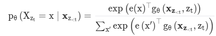

# 학습 내용

---

- Transfer Learning과 Language Modeling
	- 전이학습과 LM의 정의?
- ELMO(Embedding from Language Models)
	- 단어 표현을 문맥에 맞게!
- GPT(Generative Pre-Training Transformer)
	- 거대한 변화의 서막, GPT
- BERT(Bidirectional Encoder Representations from Transformers)
	- ?요까일보 잘 더 면으집뒤
- Transformer-XL(Transformer Extra Long)
	- 길이는 더 이상 문제 X!
- XLNet, BART
	- 더 길게, 더 다양하게
- ALBERT(A Lite BERT for Self-supervised Learning of Language Representations)
	- 트랜스포머도 가볍게 만들 수 있음
- T5(Text-to-Text Transfer Transformer)
	- 전이학습을 극한까지 향상
- Switch Transformer
	- T5도 가볍게 만들 수...있나?
- ERNIE
	- 마스킹 _ 법을 통해 la_guage rep__sent_tion을 향상

---

## Transfer Learning과 Language Modeling

---

Transfer Learning(전이 학습)?

	특정 환경에서 학습을 마친 신경망(일부 혹은 전부)을 유사하거나 다른 환경에서 사용하는 것을 의미

		-> 적은 데이터로도 성능을 곧잘 만들어 낼 수 있다는 이점

Language Modeling(언어 모델)?

	입력으로 주어진 시퀀스의 다음을 학습하는 과정에서 주어진 시퀀스가 얼마나 자연스러운지를 학습하게 됨

		-> 언어의 패턴과 규칙을 학습하여 전반적인 언어의 특징을 익히게 됨

			-> 즉, 이 언어 모델이 바로 pretrained model이 되는 것

fine-tuning?

	주어진 문제(다운스트림 테스크 혹은 downstream task)를 잘 풀기 위해 pretrained model을 재학습시키는 것

최근 NLP의 가장 큰 흐름

	Transformer!!

		트랜스포머가 기반 모델들이 탄생(GPT, BERT 등)

---

## ELMO(Embedding from Language Models)

---

ELMo??

	문맥(context)을 반영한 임베딩을 pretrained model로 구현한 첫 번째 사례

		-> 언어 모델을 이용하여 임베딩을 한 것

ELMo의 구조

1. character-level CNN

	- 입력된 문자들 간의 관계를 파악하고 임베딩 벡터로 변환하는 역할
	- character level로 문자를 인식
		- 해당 character의 유니코드 ID를 입력를 받음
		- 밥이라는 단어를 입력으로 받으면 ㅂㅏㅂ에 해당되는 유니코드 235, 176, 165 세 개의 숫자가 됨
	- 단어의 시작과 끝에 해당하는 스페셜 토큰 BOW와 EOW에 해당하는 유니코드를 앞뒤로 붙여줌
	- 각 유니코드 아이디에 해당하는 행 벡터를 참조하여 붙임
	- 만들어진 벡터에 (n x 임베딩 차원 수) 사이즈의 필터로 컨볼루션하여 피처맵 생성, max-pooling하여 하나의 값을 뽑아냄
		- n은 한 번에 몇 개의 문자들을 함께 볼 것인가를 의미
		- original 코드에서는 각기 다른 사이즈를 가진 7개의 필터를 이용하여 2048차원의 벡터를 만듦

2. bidirectional LSTM

	- character-level CNN을 통과하여 만들어진 벡터들은 bidirectional LSTM을 통과
	- pretrain시에 bidirectional LSTM은 주어진 입력에 다음에 올 단어들을 예측
		- bidirectional? 양방향으로 학습하는 것을 의미
		- 주어진 입력을 한 번은 순방향으로, 한 번은 역방향으로 각각 2개의 LSTM layer를 통과하게 됨
		- 모델의 사이즈와 학습에 걸리는 시간이 늘어날 수는 있지만 그만큼 성능이 좋음
		- 순방향과 역방향으로 LSTM을 통과한 히든 벡터들은 이후 softmax(소프트 맥스)를 취해 다음 단어를 예측
		- 순방향과 역방향의 벡터를 합치거나 더하지 않음

	- 단어를 하나씩 하나씩 슬라이딩하여 다음 단어를 예측하면서 문장 내의 단어와 단어들 사이의 관계를 학습

3. ELMO 임베딩 레이어

	- pretrain이 끝나고 finetuning을 하는 과정에서 만들어짐

	- 구하려고 하는 토큰에 대한 각 층의 출력값을 모두 가지고 옴
		- 각 층의 출력값이라고 하면, 임베딩 벡터(character-level CNN을 통과한 후 나오는 벡터), 각각의 LSTM layer에서의 hidden vector를 의미
	- 각 층 1,2,...,i..마다 가중치 s1,s2,...si..를 곱해 모두 더함
	- 다운스트림 태스크의 가중치 γ를 곱함
		- 가중치 si와 γ는 다운스트림 태스크별로 finetuning 시 학습되는 값들
	- 구하고자 하는 토큰에 대한 각 층의 출력값을 가중합한 것

ELMo의 구조 도식화

---

## GPT(Generative Pre-Training Transformer)

---

GPT??

	트랜스포머의 decoder 구조만을 이용하여 만든 네트워크

GPT의 구조

- 빨간색 박스 부분

	1. Embedding

		- 텍스트의 Embedding으로 BPE(Byte-pair Encoding) 를 사용
			- BPE? 모든 단어를 문자(바이트)들의 집합으로 취급하여 자주 등장하는 문자 쌍을 합치는 subword tokenization
			- 처음 보는 단어일지라도 문자(알파벳)들의 조합으로 나타내어 OOV 문제를 해결 가능
		- position encoding(포지션 인코딩)도 함께 사용

	2. Masked Multi-Head Attention
		- 모든 것을 병렬적으로 처리하는 트랜스포머에게 자기회귀적(Autoregressive)인 특성을 부여하기 위해 만든 장치
		- 훈련 단계에서 디코더에게 정답 문장을 매 스텝 단위로 단어 하나씩 알려주고 그다음 단어를 예측(Next Token Prediction)하게 하는 형태로 학습되는 형태

	- 비지도 학습을 통해 문장의 자연스러운 순서를 학습
		- GPT는 문자 생성에 매우 특화되어 있음

- 파란색 박스 부분

	- downstream task에 맞게 finetuning
	- 두 개의 Objective가 존재
		- 두 가지의 문제를 동시에 푸는 것
		- text prediction, text classification
		- 실제 풀어야 하는 문제인 주요 task와 동시에 보조적으로 또 다른 문제를 풀 때 (Auxiliary objective) 주요 task에 대한 정확도가 더 올라갔음을 확인

GPT 코드 살펴보기

	'''

	class TFAttention(tf.keras.layers.Layer):
	    def __init__(self, nx, n_ctx, config, scale=False, **kwargs):
	        super().__init__(**kwargs)

	        n_state = nx  # in Attention: n_state=768 (nx=n_embd)
	        # [switch nx => n_state from Block to Attention to keep identical to TF implem]
	        assert n_state % config.n_head == 0
	        self.n_ctx = n_ctx
	        self.n_head = config.n_head
	        self.split_size = n_state
	        self.scale = scale
	        self.output_attentions = config.output_attentions

	        self.c_attn = TFConv1D(n_state * 3, nx, initializer_range=config.initializer_range, name="c_attn")
	        self.c_proj = TFConv1D(n_state, nx, initializer_range=config.initializer_range, name="c_proj")
	        self.attn_dropout = tf.keras.layers.Dropout(config.attn_pdrop)
	        self.resid_dropout = tf.keras.layers.Dropout(config.resid_pdrop)
	        self.pruned_heads = set()

	    def prune_heads(self, heads):
	        pass

	    @staticmethod
	    def causal_attention_mask(nd, ns, dtype):
	        """
	        1-2) masked attention에서 설명한 masking 부분
	        """
	        i = tf.range(nd)[:, None]
	        j = tf.range(ns)
	        m = i >= j - ns + nd
	        return tf.cast(m, dtype)

	    def _attn(self, q, k, v, attention_mask, head_mask, output_attentions, training=False):
					"""
					1-2) attention 계산
	        q, k, v 의 shape : [batch, heads, sequence, features]
					"""

	        w = tf.matmul(q, k, transpose_b=True)
	        if self.scale:
	            dk = tf.cast(shape_list(k)[-1], tf.float32)  # scale attention_scores
	            w = w / tf.math.sqrt(dk)

	        # w shape : [batch, heads, dst_sequence, src_sequence]
	        _, _, nd, ns = shape_list(w)
	        b = self.causal_attention_mask(nd, ns, dtype=w.dtype)
	        b = tf.reshape(b, [1, 1, nd, ns])
	        w = w * b - 1e4 * (1 - b)

	        if attention_mask is not None:
	            # attention mask 적용
	            w = w + attention_mask

	        w = tf.nn.softmax(w, axis=-1)
	        w = self.attn_dropout(w, training=training)

	        # Mask heads if we want to
	        if head_mask is not None:
	            w = w * head_mask

	        outputs = [tf.matmul(w, v)]
	        if output_attentions:
	            outputs.append(w)
	        return outputs

	    def merge_heads(self, x):
	        x = tf.transpose(x, [0, 2, 1, 3])
	        x_shape = shape_list(x)
	        new_x_shape = x_shape[:-2] + [x_shape[-2] * x_shape[-1]]
	        return tf.reshape(x, new_x_shape)

	    def split_heads(self, x):
	        x_shape = shape_list(x)
	        new_x_shape = x_shape[:-1] + [self.n_head, x_shape[-1] // self.n_head]
	        x = tf.reshape(x, new_x_shape)
	        return tf.transpose(x, (0, 2, 1, 3))  # (batch, head, seq_length, head_features)

	    def call(self, x, layer_past, attention_mask, head_mask, use_cache, output_attentions, training=False):
	        x = self.c_attn(x)
	        query, key, value = tf.split(x, 3, axis=2)
	        query = self.split_heads(query)
	        key = self.split_heads(key)
	        value = self.split_heads(value)
	        if layer_past is not None:
	            past_key, past_value = tf.unstack(layer_past, axis=0)
	            key = tf.concat([past_key, key], axis=-2)
	            value = tf.concat([past_value, value], axis=-2)

	        # keras serialization을 위한 코드
	        if use_cache:
	            present = tf.stack([key, value], axis=0)
	        else:
	            present = (None,)

	        attn_outputs = self._attn(query, key, value, attention_mask, head_mask, output_attentions, training=training)
	        a = attn_outputs[0]

	        a = self.merge_heads(a)
	        a = self.c_proj(a)
	        a = self.resid_dropout(a, training=training)

	        outputs = [a, present] + attn_outputs[1:]
	        return outputs  # a, present, (attentions)

	class TFMLP(tf.keras.layers.Layer):
	"""
	Transformer의 Decoder Block에서 Feed Foward를 구현해 둔 부분
	"""
	    def __init__(self, n_state, config, **kwargs):
	        super().__init__(**kwargs)
	        nx = config.n_embd
	        self.c_fc = TFConv1D(n_state, nx, initializer_range=config.initializer_range, name="c_fc")
	        self.c_proj = TFConv1D(nx, n_state, initializer_range=config.initializer_range, name="c_proj")
	        self.act = get_tf_activation("gelu")
	        self.dropout = tf.keras.layers.Dropout(config.resid_pdrop)

	    def call(self, x, training=False):
	        h = self.act(self.c_fc(x)) # conv1d로 flatten 후 activation 적용
	        h2 = self.c_proj(h)
	        h2 = self.dropout(h2, training=training)
	        return h2

	class TFBlock(tf.keras.layers.Layer):
	"""
	Transformer의 Decoder Block을 구현해 둔 부분
	"""
	    def __init__(self, n_ctx, config, scale=False, **kwargs):
	        super().__init__(**kwargs)
	        nx = config.n_embd
	        inner_dim = config.n_inner if config.n_inner is not None else 4 * nx
	        self.ln_1 = tf.keras.layers.LayerNormalization(epsilon=config.layer_norm_epsilon, name="ln_1")
	        self.attn = TFAttention(nx, n_ctx, config, scale, name="attn")
	        self.ln_2 = tf.keras.layers.LayerNormalization(epsilon=config.layer_norm_epsilon, name="ln_2")
	        self.mlp = TFMLP(inner_dim, config, name="mlp")

	    def call(self, x, layer_past, attention_mask, head_mask, use_cache, output_attentions, training=False):
	        a = self.ln_1(x)
	        output_attn = self.attn(
	            a, layer_past, attention_mask, head_mask, use_cache, output_attentions, training=training
	        )
	        a = output_attn[0]  # output_attn: a, present, (attentions)
	        x = x + a

	        m = self.ln_2(x)
	        m = self.mlp(m, training=training)
	        x = x + m

	        outputs = [x] + output_attn[1:]
	        return outputs  # x, present, (attentions)

	@keras_serializable
	class TFGPT2MainLayer(tf.keras.layers.Layer):
	"""
	모델의 전체 구조
	"""
	    config_class = GPT2Config

	    def __init__(self, config, *inputs, **kwargs):
	        super().__init__(*inputs, **kwargs)
	        self.output_attentions = config.output_attentions
	        self.output_hidden_states = config.output_hidden_states
	        self.use_cache = config.use_cache
	        self.return_dict = config.use_return_dict

	        self.num_hidden_layers = config.n_layer
	        self.vocab_size = config.vocab_size
	        self.n_embd = config.n_embd

	        self.wte = TFSharedEmbeddings(
	            config.vocab_size, config.hidden_size, initializer_range=config.initializer_range, name="wte"
	        )
	        self.wpe = tf.keras.layers.Embedding(
	            config.n_positions,
	            config.n_embd,
	            embeddings_initializer=get_initializer(config.initializer_range),
	            name="wpe",
	        )
	        self.drop = tf.keras.layers.Dropout(config.embd_pdrop)
	        self.h = [TFBlock(config.n_ctx, config, scale=True, name="h_._{}".format(i)) for i in range(config.n_layer)]
	        self.ln_f = tf.keras.layers.LayerNormalization(epsilon=config.layer_norm_epsilon, name="ln_f")

	    def get_input_embeddings(self):
	        return self.wte

	    def set_input_embeddings(self, value):
	        self.wte.weight = value
	        self.wte.vocab_size = self.wte.weight.shape[0]

	    def _prune_heads(self, heads_to_prune):
	        """
	        Prunes heads of the model. heads_to_prune: dict of {layer_num: list of heads to prune in this layer}
	        """
	        raise NotImplementedError

	    def call(
	        self,
	        inputs,
	        past=None,
	        attention_mask=None,
	        token_type_ids=None,
	        position_ids=None,
	        head_mask=None,
	        inputs_embeds=None,
	        use_cache=None,
	        output_attentions=None,
	        output_hidden_states=None,
	        return_dict=None,
	        training=False,
	    ):
	        if isinstance(inputs, (tuple, list)):
	            input_ids = inputs[0]
	            past = inputs[1] if len(inputs) > 1 else past
	            attention_mask = inputs[2] if len(inputs) > 2 else attention_mask
	            token_type_ids = inputs[3] if len(inputs) > 3 else token_type_ids
	            position_ids = inputs[4] if len(inputs) > 4 else position_ids
	            head_mask = inputs[5] if len(inputs) > 5 else head_mask
	            inputs_embeds = inputs[6] if len(inputs) > 6 else inputs_embeds
	            use_cache = inputs[7] if len(inputs) > 7 else use_cache
	            output_attentions = inputs[8] if len(inputs) > 8 else output_attentions
	            output_hidden_states = inputs[9] if len(inputs) > 9 else output_hidden_states
	            return_dict = inputs[10] if len(inputs) > 10 else return_dict
	            assert len(inputs) <= 11, "Too many inputs."
	        elif isinstance(inputs, (dict, BatchEncoding)):
	            input_ids = inputs.get("input_ids")
	            past = inputs.get("past", past)
	            attention_mask = inputs.get("attention_mask", attention_mask)
	            token_type_ids = inputs.get("token_type_ids", token_type_ids)
	            position_ids = inputs.get("position_ids", position_ids)
	            head_mask = inputs.get("head_mask", head_mask)
	            inputs_embeds = inputs.get("inputs_embeds", inputs_embeds)
	            use_cache = inputs.get("use_cache", use_cache)
	            output_attentions = inputs.get("output_attentions", output_attentions)
	            output_hidden_states = inputs.get("output_hidden_states", output_hidden_states)
	            return_dict = inputs.get("return_dict", return_dict)
	            assert len(inputs) <= 11, "Too many inputs."
	        else:
	            input_ids = inputs

	        output_attentions = output_attentions if output_attentions is not None else self.output_attentions
	        output_hidden_states = output_hidden_states if output_hidden_states is not None else self.output_hidden_states
	        use_cache = use_cache if use_cache is not None else self.use_cache
	        return_dict = return_dict if return_dict is not None else self.return_dict

	        if input_ids is not None and inputs_embeds is not None:
	            raise ValueError("You cannot specify both input_ids and inputs_embeds at the same time")
	        elif input_ids is not None:
	            input_shape = shape_list(input_ids)
	            input_ids = tf.reshape(input_ids, [-1, input_shape[-1]])
	        elif inputs_embeds is not None:
	            input_shape = shape_list(inputs_embeds)[:-1]
	        else:
	            raise ValueError("You have to specify either input_ids or inputs_embeds")

	        if past is None:
	            past_length = 0
	            past = [None] * len(self.h)
	        else:
	            past_length = shape_list(past[0][0])[-2]
	        if position_ids is None:
	            position_ids = tf.range(past_length, input_shape[-1] + past_length, dtype=tf.int32)[tf.newaxis, :]

	        if attention_mask is not None:
	            # 3D attention mask 만들기
	            # Sizes : [batch_size, 1, 1, to_seq_length]
	            # 3D attention mask를 [batch_size, num_heads, from_seq_length, to_seq_length]로 브로드캐스팅

	            attention_mask = attention_mask[:, tf.newaxis, tf.newaxis, :]

	            # attention_mask가 1.0이면 포함, 0.0이면 미포함 하여 attention 계산
	            attention_mask = tf.cast(attention_mask, tf.float32)
	            attention_mask = (1.0 - attention_mask) * -10000.0
	        else:
	            attention_mask = None

	        # head_mask가 1.0이면, head를 유지
	        # attention_probs : shape bsz x n_heads x N x N
	        # input head_mask : shape [num_heads] 또는 [num_hidden_layers x num_heads]
	        # head_mask : shape [num_hidden_layers x batch x num_heads x seq_length x seq_length]
	        if head_mask is not None:
	            raise NotImplementedError
	        else:
	            head_mask = [None] * self.num_hidden_layers
	            # head_mask = tf.constant([0] * self.num_hidden_layers)

	        position_ids = tf.reshape(position_ids, [-1, shape_list(position_ids)[-1]])

	        if inputs_embeds is None:
	            inputs_embeds = self.wte(input_ids, mode="embedding")
	        position_embeds = self.wpe(position_ids)
	        if token_type_ids is not None:
	            token_type_ids = tf.reshape(token_type_ids, [-1, shape_list(token_type_ids)[-1]])
	            token_type_embeds = self.wte(token_type_ids, mode="embedding")
	        else:
	            token_type_embeds = 0
	        hidden_states = inputs_embeds + position_embeds + token_type_embeds
	        hidden_states = self.drop(hidden_states, training=training)

	        output_shape = input_shape + [shape_list(hidden_states)[-1]]

	        presents = () if use_cache else None
	        all_attentions = () if output_attentions else None
	        all_hidden_states = () if output_hidden_states else None
	        for i, (block, layer_past) in enumerate(zip(self.h, past)):
	            if output_hidden_states:
	                all_hidden_states = all_hidden_states + (tf.reshape(hidden_states, output_shape),)

	            outputs = block(
	                hidden_states,
	                layer_past,
	                attention_mask,
	                head_mask[i],
	                use_cache,
	                output_attentions,
	                training=training,
	            )

	            hidden_states, present = outputs[:2]
	            if use_cache:
	                presents = presents + (present,)

	            if output_attentions:
	                all_attentions = all_attentions + (outputs[2],)

	        hidden_states = self.ln_f(hidden_states)

	        hidden_states = tf.reshape(hidden_states, output_shape)
	        # Add last hidden state
	        if output_hidden_states:
	            all_hidden_states = all_hidden_states + (hidden_states,)

	        if output_attentions:
	            attention_output_shape = input_shape[:-1] + [-1] + shape_list(all_attentions[0])[-2:]
	            all_attentions = tuple(tf.reshape(t, attention_output_shape) for t in all_attentions)

	        if not return_dict:
	            return tuple(v for v in [hidden_states, presents, all_hidden_states, all_attentions] if v is not None)

	        return TFBaseModelOutputWithPast(
	            last_hidden_state=hidden_states,
	            past_key_values=presents,
	            hidden_states=all_hidden_states,
	            attentions=all_attentions,
	        )

	'''

Input Transformation

	 -> input을 변형해 다양한 task 수행 가능

GPT vs. GPT2 vs. GPT3

[GPT-2](https://cdn.openai.com/better-language-models/language_models_are_unsupervised_multitask_learners.pdf)
[GPT3](https://arxiv.org/pdf/2005.14165)

파라미터 사이즈 차이

	GPT vs. GPT2 

		-> 10배 정도 키우고 성능을 개선
	
	GPT vs. GPT2 vs. GPT3

		-> GPT1의 1000배, GPT2의 100 배 이상의 파라미터를 갖췄고, 성능도 크게 향상

GPT3가 할 수 있는 작업

	- 언어 관련 문제 풀이
	- 랜덤 글짓기
	- 간단한 사칙 연산
	- 번역
	- 간단한 웹 코딩
	- 문장 교정 등

GPT3 모델에서의 개선점

	- 모델과 데이터의 크기를 늘리고, 학습 시간을 늘렸음
	- modified initialization, pre-normalization, reversable tokenization을 적용
	- 트랜스포머 레이어의 attention 패턴에 대해 dense와 locally banded sparse attention을 번갈아 사용

GPT Neo?

	GPT3를 복제한 GPT-Neo라는 모델이 EleutherAI라는 비영리 오픈 소스 연구 단체에서 오픈 소스로 공개

[GPT-Neo](https://github.com/EleutherAI/gpt-neo)
[GPT-J-6B](https://github.com/kingoflolz/mesh-transformer-jax/#gpt-j-6b)
[GPT-NeoX](https://github.com/EleutherAI/gpt-neox)

---

## BERT(Bidirectional Encoder Representations from Transformers)

---

ELMo vs. GPT

	- GPT
		- input을 한 방향으로만(uni-direction) 보게 됨
	- BERT
		- 양방향(bi-direction)으로 input을 보고 있는 것을 확인 가능

또 다른 큰 차이점

	트랜스포머의 encoder만을 사용한 모델!!

BERT의 구조

1. Transformer Encoder Block

	1. Embedding(임베딩)

		- 기존의 트랜스포머와는 유사하지만 다른 임베딩 체계를 가지고 있음
			- Token Embedding
				- Wordpiece을 이용하여 3만 개의 vocabulary를 학습
				- 학습한 Wordpiece model을 이용하여 token 임베딩
			- Segment Embedding
				- 두 가지 sentence를 입력으로 받기 때문에 이 두 가지 sentence를 구분해야 할 필요 존재
				- 모델 입장에서 주르륵 이어진 텍스트들의 덩어리를 나누어주는 역할
				- 그림에서도 [SEP]토큰으로 구분된 두 sentence에서 앞부분은 A, 뒷부분은 B로 나누어 임베딩하는 것을 확인 가능
			- Position Embedding
				- 문장 내에 절대적인 위치(순서)를 알려주기 위함
	
		- 세 가지 임베딩을 모두 합산해 주면 BERT의 임베딩이 완성됨

BERT의 특별한 토큰

	- [CLS] : sentence의 시작을 알리는 토큰
	- [SEP] : sentence의 종결을 알리는 토큰, sentence를 구분하는 데에 사용하기도 함
	- [MASK]: 마스크 토큰
	- [PAD] : 배치 데이터의 길이를 맞춰주기 위한 토큰

2. Activation Function(활성화 함수) : GELU

	ReLU대신 GELU 사용

	-> 음수에서도 완만한 곡선을 그리며 미분을 가능

BERT의 학습

	BERT는 양방향(Bi-direction)을 강조한 모델!!

1. Masked LM(MLM)

	- 마스크 된 토큰([MASK)만 맞추면 되는 masked LM(MLM)을 제안
		- input sequence의 순서에 상관없이 전체 문장을 모두 볼 수 있게 됨
	- 학습 데이터의 전체에서 15% 를 [MASK] 토큰으로 랜덤하게 바꿈
		- 80%는 [MASK]토큰
		- 10%는 무작위로 랜덤한 토큰
		- 나머지 10%는 원래의 토큰을 그대로 사용
		- finetuning시 input에 [MASK]토큰이 등장하지 않기 때문

2. Next Sentence Prediction (NSP)

	- 다음 문장인지 확인하기
		- 두 sentence가 연속해서 오는지의 여부를 학습
		- [CLS]여름의 마지막 해수욕 누가 제일 늦게 바다에서 나왔나 [SEP] 그 사람이 바다의 뚜껑 닫지 않고 돌아가[SEP] → TRUE(IsNext)
		- [CLS]여름의 마지막 해수욕 누가 제일 늦게 바다에서 나왔나 [SEP] 한강에서 자전거 타며 아이스 아메리카노를 마시고 싶다[SEP] → FALSE(NotNext)
	- task가 너무 쉬워지는 것을 방지하기 위해 max_num_tokens라는 것을 정의
		- 데이터의 90%는 max_num_tokens가 max_sequence_length가 같도록 만들고, 나머지 10%의 데이터는 max_num_tokens가 max_sequence_length보다 짧게 되도록 랜덤으로 정함
		- 두 개의 sentence의 단어 총수가 max_num_tokens보다 작아질 때까지 두 sentence 중 단어 수가 많은 쪽의 문장 맨 앞 또는 맨 뒤 단어를 하나씩 제거
		- 문장 맨 앞의 단어를 선택할지 맨 뒤의 단어의 선택할지는 50%의 확률로 정함

3. Fine-tuning Task

	BERT 또한 다양한 task들을 수행하기 때문에 input transformation을 이용

BERT의 모델 코드

	'''

	class TFBertPreTrainingLoss:
	    """
	    BERT의 경우 Pretraining으로 NSP + MLM 두 가지를 함께 학습하게 됨. 그것을 위한 loss 
			-100으로 label(logit)이 되어있는 경우 loss 계산 시 제외
	    """

	    def compute_loss(self, labels, logits):
	        loss_fn = tf.keras.losses.SparseCategoricalCrossentropy(
	            from_logits=True, reduction=tf.keras.losses.Reduction.NONE
	        )

	        masked_lm_active_loss = tf.not_equal(tf.reshape(labels["labels"], (-1,)), -100)
	        masked_lm_reduced_logits = tf.boolean_mask(
	            tf.reshape(logits[0], (-1, shape_list(logits[0])[2])),
	            masked_lm_active_loss,
	        )
	        masked_lm_labels = tf.boolean_mask(tf.reshape(labels["labels"], (-1,)), masked_lm_active_loss)
	        next_sentence_active_loss = tf.not_equal(tf.reshape(labels["next_sentence_label"], (-1,)), -100)
	        next_sentence_reduced_logits = tf.boolean_mask(tf.reshape(logits[1], (-1, 2)), next_sentence_active_loss)
	        next_sentence_label = tf.boolean_mask(
	            tf.reshape(labels["next_sentence_label"], (-1,)), mask=next_sentence_active_loss
	        )
	        masked_lm_loss = loss_fn(masked_lm_labels, masked_lm_reduced_logits)
	        next_sentence_loss = loss_fn(next_sentence_label, next_sentence_reduced_logits)
	        masked_lm_loss = tf.reshape(masked_lm_loss, (-1, shape_list(next_sentence_loss)[0]))
	        masked_lm_loss = tf.reduce_mean(masked_lm_loss, 0)

	        return masked_lm_loss + next_sentence_loss

	class TFBertEmbeddings(tf.keras.layers.Layer):
	    """
			1-1)에 해당하는 부분으로 3가지 embedding을 만들고 그 embedding을 모두 합산하여 layer normalize와 dropout을 적용
			"""

	    def __init__(self, config, **kwargs):
	        super().__init__(**kwargs)

	        self.vocab_size = config.vocab_size
	        self.hidden_size = config.hidden_size
	        self.initializer_range = config.initializer_range
	        self.position_embeddings = tf.keras.layers.Embedding(
	            config.max_position_embeddings,
	            config.hidden_size,
	            embeddings_initializer=get_initializer(self.initializer_range),
	            name="position_embeddings",
	        )
	        self.token_type_embeddings = tf.keras.layers.Embedding(
	            config.type_vocab_size,
	            config.hidden_size,
	            embeddings_initializer=get_initializer(self.initializer_range),
	            name="token_type_embeddings",
	        )

	        self.LayerNorm = tf.keras.layers.LayerNormalization(epsilon=config.layer_norm_eps, name="LayerNorm")
	        self.dropout = tf.keras.layers.Dropout(config.hidden_dropout_prob)

	    def build(self, input_shape):
	        """shared word embedding layer """
	        with tf.name_scope("word_embeddings"):
	            # Create and initialize weights. The random normal initializer was chosen
	            # arbitrarily, and works well.
	            self.word_embeddings = self.add_weight(
	                "weight",
	                shape=[self.vocab_size, self.hidden_size],
	                initializer=get_initializer(self.initializer_range),
	            )

	        super().build(input_shape)

	    def call(
	        self,
	        input_ids=None,
	        position_ids=None,
	        token_type_ids=None,
	        inputs_embeds=None,
	        mode="embedding",
	        training=False,
	    ):
	        """
	        input의 token embeddings
	        Args:
	            inputs: int64 tensors (shape [batch_size, length]) 3개를 담은 리스트: (input_ids, position_ids, token_type_ids)
	            mode: "embedding" | "linear"
	        Returns:
	            outputs: mode == "embedding"; output embedding tensor(float32, shape [batch_size, length, embedding_size])
											 mode == "linear", output linear tensor(float32, shape [batch_size, length, vocab_size])
	        Raises:
	            ValueError: if mode is not valid.
					"""

	        if mode == "embedding":
	            return self._embedding(input_ids, position_ids, token_type_ids, inputs_embeds, training=training)
	        elif mode == "linear":
	            return self._linear(input_ids)
	        else:
	            raise ValueError("mode {} is not valid.".format(mode))

	    def _embedding(self, input_ids, position_ids, token_type_ids, inputs_embeds, training=False):
	        """input tensor에 기반하여 임베딩 적용"""
	        assert not (input_ids is None and inputs_embeds is None)

	        if input_ids is not None:
	            input_shape = shape_list(input_ids)
	        else:
	            input_shape = shape_list(inputs_embeds)[:-1]

	        seq_length = input_shape[1]

	        if position_ids is None:
	            position_ids = tf.range(seq_length, dtype=tf.int32)[tf.newaxis, :]

	        if token_type_ids is None:
	            token_type_ids = tf.fill(input_shape, 0)

	        if inputs_embeds is None:
	            inputs_embeds = tf.gather(self.word_embeddings, input_ids)

	        position_embeddings = tf.cast(self.position_embeddings(position_ids), inputs_embeds.dtype)
	        token_type_embeddings = tf.cast(self.token_type_embeddings(token_type_ids), inputs_embeds.dtype)
	        embeddings = inputs_embeds + position_embeddings + token_type_embeddings
	        embeddings = self.LayerNorm(embeddings)
	        embeddings = self.dropout(embeddings, training=training)

	        return embeddings

	    def _linear(self, inputs):
	        """
	 			  linear layer를 통해서 input의 logit을 계산
	        Args:
	            inputs: float32 tensor (shape [batch_size, length, hidden_size])
	        Returns:
	            float32 tensor (shape [batch_size, length, vocab_size])
	        """
	        batch_size = shape_list(inputs)[0]
	        length = shape_list(inputs)[1]
	        x = tf.reshape(inputs, [-1, self.hidden_size])
	        logits = tf.matmul(x, self.word_embeddings, transpose_b=True)

	        return tf.reshape(logits, [batch_size, length, self.vocab_size])

	class TFBertSelfAttention(tf.keras.layers.Layer):
	    def __init__(self, config, **kwargs):
	        super().__init__(**kwargs)

	        if config.hidden_size % config.num_attention_heads != 0:
	            raise ValueError(
	                "The hidden size (%d) is not a multiple of the number of attention "
	                "heads (%d)" % (config.hidden_size, config.num_attention_heads)
	            )

	        self.num_attention_heads = config.num_attention_heads
	        assert config.hidden_size % config.num_attention_heads == 0
	        self.attention_head_size = int(config.hidden_size / config.num_attention_heads)
	        self.all_head_size = self.num_attention_heads * self.attention_head_size
	        self.query = tf.keras.layers.Dense(
	            self.all_head_size, kernel_initializer=get_initializer(config.initializer_range), name="query"
	        )
	        self.key = tf.keras.layers.Dense(
	            self.all_head_size, kernel_initializer=get_initializer(config.initializer_range), name="key"
	        )
	        self.value = tf.keras.layers.Dense(
	            self.all_head_size, kernel_initializer=get_initializer(config.initializer_range), name="value"
	        )
	        self.dropout = tf.keras.layers.Dropout(config.attention_probs_dropout_prob)

	    def transpose_for_scores(self, x, batch_size):
	        x = tf.reshape(x, (batch_size, -1, self.num_attention_heads, self.attention_head_size))

	        return tf.transpose(x, perm=[0, 2, 1, 3])

	    def call(self, hidden_states, attention_mask, head_mask, output_attentions, training=False):
	        batch_size = shape_list(hidden_states)[0]
	        mixed_query_layer = self.query(hidden_states)
	        mixed_key_layer = self.key(hidden_states)
	        mixed_value_layer = self.value(hidden_states)
	        query_layer = self.transpose_for_scores(mixed_query_layer, batch_size)
	        key_layer = self.transpose_for_scores(mixed_key_layer, batch_size)
	        value_layer = self.transpose_for_scores(mixed_value_layer, batch_size)

	        # "query"와 "key"의 dot product : raw attention scores
	        attention_scores = tf.matmul(
	            query_layer, key_layer, transpose_b=True
	        )  # (batch size, num_heads, seq_len_q, seq_len_k)
	        dk = tf.cast(shape_list(key_layer)[-1], attention_scores.dtype)  # scale attention_scores
	        attention_scores = attention_scores / tf.math.sqrt(dk)

	        if attention_mask is not None:
	            attention_scores = attention_scores + attention_mask

	        # Normalize the attention scores to probabilities.
	        attention_probs = tf.nn.softmax(attention_scores, axis=-1)

	        attention_probs = self.dropout(attention_probs, training=training)

	        if head_mask is not None:
	            attention_probs = attention_probs * head_mask

	        context_layer = tf.matmul(attention_probs, value_layer)
	        context_layer = tf.transpose(context_layer, perm=[0, 2, 1, 3])
	        context_layer = tf.reshape(
	            context_layer, (batch_size, -1, self.all_head_size)
	        )  # (batch_size, seq_len_q, all_head_size)
	        outputs = (context_layer, attention_probs) if output_attentions else (context_layer,)

	        return outputs

	class TFBertSelfOutput(tf.keras.layers.Layer):
	    def __init__(self, config, **kwargs):
	        super().__init__(**kwargs)

	        self.dense = tf.keras.layers.Dense(
	            config.hidden_size, kernel_initializer=get_initializer(config.initializer_range), name="dense"
	        )
	        self.LayerNorm = tf.keras.layers.LayerNormalization(epsilon=config.layer_norm_eps, name="LayerNorm")
	        self.dropout = tf.keras.layers.Dropout(config.hidden_dropout_prob)

	    def call(self, hidden_states, input_tensor, training=False):
	        hidden_states = self.dense(hidden_states)
	        hidden_states = self.dropout(hidden_states, training=training)
	        hidden_states = self.LayerNorm(hidden_states + input_tensor)

	        return hidden_states

	class TFBertAttention(tf.keras.layers.Layer):
	    def __init__(self, config, **kwargs):
	        super().__init__(**kwargs)

	        self.self_attention = TFBertSelfAttention(config, name="self")
	        self.dense_output = TFBertSelfOutput(config, name="output")

	    def prune_heads(self, heads):
	        raise NotImplementedError

	    def call(self, input_tensor, attention_mask, head_mask, output_attentions, training=False):
	        self_outputs = self.self_attention(
	            input_tensor, attention_mask, head_mask, output_attentions, training=training
	        )
	        attention_output = self.dense_output(self_outputs[0], input_tensor, training=training)
	        outputs = (attention_output,) + self_outputs[1:]  # add attentions if we output them

	        return outputs

	class TFBertIntermediate(tf.keras.layers.Layer):
	"""
	Transformer Block에서의 feedforward
	"""
	    def __init__(self, config, **kwargs):
	        super().__init__(**kwargs)

	        self.dense = tf.keras.layers.Dense(
	            config.intermediate_size, kernel_initializer=get_initializer(config.initializer_range), name="dense"
	        )

	        if isinstance(config.hidden_act, str):
	            self.intermediate_act_fn = get_tf_activation(config.hidden_act)
	        else:
	            self.intermediate_act_fn = config.hidden_act

	    def call(self, hidden_states):
	        hidden_states = self.dense(hidden_states)
	        hidden_states = self.intermediate_act_fn(hidden_states)

	        return hidden_states

	class TFBertOutput(tf.keras.layers.Layer):
	    def __init__(self, config, **kwargs):
	        super().__init__(**kwargs)

	        self.dense = tf.keras.layers.Dense(
	            config.hidden_size, kernel_initializer=get_initializer(config.initializer_range), name="dense"
	        )
	        self.LayerNorm = tf.keras.layers.LayerNormalization(epsilon=config.layer_norm_eps, name="LayerNorm")
	        self.dropout = tf.keras.layers.Dropout(config.hidden_dropout_prob)

	    def call(self, hidden_states, input_tensor, training=False):
	        hidden_states = self.dense(hidden_states)
	        hidden_states = self.dropout(hidden_states, training=training)
	        hidden_states = self.LayerNorm(hidden_states + input_tensor)

	        return hidden_states

	class TFBertLayer(tf.keras.layers.Layer):
	"""
	Transformer Encoder Block과 동일한 구조 : Attention,Feedforward,dropout,layer nomalization
	"""
	    def __init__(self, config, **kwargs):
	        super().__init__(**kwargs)

	        self.attention = TFBertAttention(config, name="attention")
	        self.intermediate = TFBertIntermediate(config, name="intermediate")
	        self.bert_output = TFBertOutput(config, name="output")

	    def call(self, hidden_states, attention_mask, head_mask, output_attentions, training=False):
	        attention_outputs = self.attention(
	            hidden_states, attention_mask, head_mask, output_attentions, training=training
	        )
	        attention_output = attention_outputs[0]
	        intermediate_output = self.intermediate(attention_output)
	        layer_output = self.bert_output(intermediate_output, attention_output, training=training)
	        outputs = (layer_output,) + attention_outputs[1:]  # add attentions if we output them

	        return outputs

	class TFBertEncoder(tf.keras.layers.Layer):
	"""
	Transformer Encoder Block(코드 상에서 TFBertLayer)를 n_layer만큼 여러개 쌓은 구조
	"""
	    def __init__(self, config, **kwargs):
	        super().__init__(**kwargs)

	        self.layer = [TFBertLayer(config, name="layer_._{}".format(i)) for i in range(config.num_hidden_layers)]

	    def call(
	        self,
	        hidden_states,
	        attention_mask,
	        head_mask,
	        output_attentions,
	        output_hidden_states,
	        return_dict,
	        training=False,
	    ):
	        all_hidden_states = () if output_hidden_states else None
	        all_attentions = () if output_attentions else None

	        for i, layer_module in enumerate(self.layer):
	            if output_hidden_states:
	                all_hidden_states = all_hidden_states + (hidden_states,)

	            layer_outputs = layer_module(
	                hidden_states, attention_mask, head_mask[i], output_attentions, training=training
	            )
	            hidden_states = layer_outputs[0]

	            if output_attentions:
	                all_attentions = all_attentions + (layer_outputs[1],)

	        # Add last layer
	        if output_hidden_states:
	            all_hidden_states = all_hidden_states + (hidden_states,)

	        if not return_dict:
	            return tuple(v for v in [hidden_states, all_hidden_states, all_attentions] if v is not None)

	        return TFBaseModelOutput(
	            last_hidden_state=hidden_states, hidden_states=all_hidden_states, attentions=all_attentions
	        )

	class TFBertPooler(tf.keras.layers.Layer):
	    def __init__(self, config, **kwargs):
	        super().__init__(**kwargs)

	        self.dense = tf.keras.layers.Dense(
	            config.hidden_size,
	            kernel_initializer=get_initializer(config.initializer_range),
	            activation="tanh",
	            name="dense",
	        )

	    def call(self, hidden_states):
	        # 첫 번째 토큰의 hidden state를 얻기 위해 pool
	        first_token_tensor = hidden_states[:, 0]
	        pooled_output = self.dense(first_token_tensor)

	        return pooled_output

	class TFBertPredictionHeadTransform(tf.keras.layers.Layer):
	    def __init__(self, config, **kwargs):
	        super().__init__(**kwargs)

	        self.dense = tf.keras.layers.Dense(
	            config.hidden_size, kernel_initializer=get_initializer(config.initializer_range), name="dense"
	        )

	        if isinstance(config.hidden_act, str):
	            self.transform_act_fn = get_tf_activation(config.hidden_act)
	        else:
	            self.transform_act_fn = config.hidden_act

	        self.LayerNorm = tf.keras.layers.LayerNormalization(epsilon=config.layer_norm_eps, name="LayerNorm")

	    def call(self, hidden_states):
	        hidden_states = self.dense(hidden_states)
	        hidden_states = self.transform_act_fn(hidden_states)
	        hidden_states = self.LayerNorm(hidden_states)

	        return hidden_states

	class TFBertLMPredictionHead(tf.keras.layers.Layer):
	    def __init__(self, config, input_embeddings, **kwargs):
	        super().__init__(**kwargs)

	        self.vocab_size = config.vocab_size
	        self.transform = TFBertPredictionHeadTransform(config, name="transform")

	        # input embeddings과 동일한 weight를 가지고 있지만 각각의 token에 대하여 output만 바이어스를 가지고 있음
	        self.input_embeddings = input_embeddings

	    def build(self, input_shape):
	        self.bias = self.add_weight(shape=(self.vocab_size,), initializer="zeros", trainable=True, name="bias")

	        super().build(input_shape)

	    def call(self, hidden_states):
	        hidden_states = self.transform(hidden_states)
	        hidden_states = self.input_embeddings(hidden_states, mode="linear")
	        hidden_states = hidden_states + self.bias

	        return hidden_states

	class TFBertMLMHead(tf.keras.layers.Layer):
	"""
	2-1)Masked LM을 위한 class
	"""
	    def __init__(self, config, input_embeddings, **kwargs):
	        super().__init__(**kwargs)

	        self.predictions = TFBertLMPredictionHead(config, input_embeddings, name="predictions")

	    def call(self, sequence_output):
	        prediction_scores = self.predictions(sequence_output)

	        return prediction_scores

	class TFBertNSPHead(tf.keras.layers.Layer):
	"""
	2-2)NSP를 위한 class
	"""
	    def __init__(self, config, **kwargs):
	        super().__init__(**kwargs)

	        self.seq_relationship = tf.keras.layers.Dense(
	            2, kernel_initializer=get_initializer(config.initializer_range), name="seq_relationship"
	        )

	    def call(self, pooled_output):
	        seq_relationship_score = self.seq_relationship(pooled_output)

	        return seq_relationship_score

	@keras_serializable
	class TFBertMainLayer(tf.keras.layers.Layer):
	"""
	모델의 전체 구조
	"""
	    config_class = BertConfig

	    def __init__(self, config, **kwargs):
	        super().__init__(**kwargs)

	        self.num_hidden_layers = config.num_hidden_layers
	        self.initializer_range = config.initializer_range
	        self.output_attentions = config.output_attentions
	        self.output_hidden_states = config.output_hidden_states
	        self.return_dict = config.use_return_dict
	        self.embeddings = TFBertEmbeddings(config, name="embeddings")
	        self.encoder = TFBertEncoder(config, name="encoder")
	        self.pooler = TFBertPooler(config, name="pooler")

	    def get_input_embeddings(self):
	        return self.embeddings

	    def set_input_embeddings(self, value):
	        self.embeddings.word_embeddings = value
	        self.embeddings.vocab_size = value.shape[0]

	    def _prune_heads(self, heads_to_prune):
	        """
	        heads_to_prune: dict of {layer_num: list of heads to prune in this layer}
	        """
	        raise NotImplementedError

	    def call(
	        self,
	        inputs,
	        attention_mask=None,
	        token_type_ids=None,
	        position_ids=None,
	        head_mask=None,
	        inputs_embeds=None,
	        output_attentions=None,
	        output_hidden_states=None,
	        return_dict=None,
	        training=False,
	    ):
	        if isinstance(inputs, (tuple, list)):
	            input_ids = inputs[0]
	            attention_mask = inputs[1] if len(inputs) > 1 else attention_mask
	            token_type_ids = inputs[2] if len(inputs) > 2 else token_type_ids
	            position_ids = inputs[3] if len(inputs) > 3 else position_ids
	            head_mask = inputs[4] if len(inputs) > 4 else head_mask
	            inputs_embeds = inputs[5] if len(inputs) > 5 else inputs_embeds
	            output_attentions = inputs[6] if len(inputs) > 6 else output_attentions
	            output_hidden_states = inputs[7] if len(inputs) > 7 else output_hidden_states
	            return_dict = inputs[8] if len(inputs) > 8 else return_dict
	            assert len(inputs) <= 9, "Too many inputs."
	        elif isinstance(inputs, (dict, BatchEncoding)):
	            input_ids = inputs.get("input_ids")
	            attention_mask = inputs.get("attention_mask", attention_mask)
	            token_type_ids = inputs.get("token_type_ids", token_type_ids)
	            position_ids = inputs.get("position_ids", position_ids)
	            head_mask = inputs.get("head_mask", head_mask)
	            inputs_embeds = inputs.get("inputs_embeds", inputs_embeds)
	            output_attentions = inputs.get("output_attentions", output_attentions)
	            output_hidden_states = inputs.get("output_hidden_states", output_hidden_states)
	            return_dict = inputs.get("return_dict", return_dict)
	            assert len(inputs) <= 9, "Too many inputs."
	        else:
	            input_ids = inputs

	        output_attentions = output_attentions if output_attentions is not None else self.output_attentions
	        output_hidden_states = output_hidden_states if output_hidden_states is not None else self.output_hidden_states
	        return_dict = return_dict if return_dict is not None else self.return_dict

	        if input_ids is not None and inputs_embeds is not None:
	            raise ValueError("You cannot specify both input_ids and inputs_embeds at the same time")
	        elif input_ids is not None:
	            input_shape = shape_list(input_ids)
	        elif inputs_embeds is not None:
	            input_shape = shape_list(inputs_embeds)[:-1]
	        else:
	            raise ValueError("You have to specify either input_ids or inputs_embeds")

	        if attention_mask is None:
	            attention_mask = tf.fill(input_shape, 1)

	        if token_type_ids is None:
	            token_type_ids = tf.fill(input_shape, 0)

	        embedding_output = self.embeddings(input_ids, position_ids, token_type_ids, inputs_embeds, training=training)

					# 3D attention mask 만들기
	        # Sizes : [batch_size, 1, 1, to_seq_length]
	        # 3D attention mask를 [batch_size, num_heads, from_seq_length, to_seq_length]로 브로드캐스팅

	        extended_attention_mask = attention_mask[:, tf.newaxis, tf.newaxis, :]

					# attention_mask가 1.0이면 포함, 0.0이면 미포함 하여 attention 계산
	        extended_attention_mask = tf.cast(extended_attention_mask, embedding_output.dtype)
	        extended_attention_mask = (1.0 - extended_attention_mask) * -10000.0

	        # head_mask가 1.0이면, head를 유지
	        # attention_probs : shape bsz x n_heads x N x N
	        # input head_mask : shape [num_heads] 또는 [num_hidden_layers x num_heads]
	        # head_mask : shape [num_hidden_layers x batch x num_heads x seq_length x seq_length
	        if head_mask is not None:
	            raise NotImplementedError
	        else:
	            head_mask = [None] * self.num_hidden_layers
	            # head_mask = tf.constant([0] * self.num_hidden_layers)

	        encoder_outputs = self.encoder(
	            embedding_output,
	            extended_attention_mask,
	            head_mask,
	            output_attentions,
	            output_hidden_states,
	            return_dict,
	            training=training,
	        )

	        sequence_output = encoder_outputs[0]
	        pooled_output = self.pooler(sequence_output)

	        if not return_dict:
	            return (
	                sequence_output,
	                pooled_output,
	            ) + encoder_outputs[1:]

	        return TFBaseModelOutputWithPooling(
	            last_hidden_state=sequence_output,
	            pooler_output=pooled_output,
	            hidden_states=encoder_outputs.hidden_states,
	            attentions=encoder_outputs.attentions,
	        )

	'''

BERT 논문

[BERT: Pre-training of Deep Bidirectional Transformers for Language Understanding](https://arxiv.org/abs/1810.04805)

---

## Transformer-XL(Transformer Extra Long)

---

transformer-XL?

	기존의 언어 모델과 트랜스포머가 가지고 있던 한계점을 개선한 모델

		-> 좀 더 긴 context를 어떻게 담을 것인가에 대해 고민한 모델

transformer-XL의 구조

1. Vanilla Transformer LMs

	- 트랜스포머는 max_seq_length가 정해져 있음
		- 모델이 감당할 수 있을 만큼 텍스트를 잘라서 학습
		- 이전 segment에서 학습했던 context는 무시되고, 지금 학습을 하고 있는 segment 안에서만 context를 고려
		- segment1과 segment2는 전혀 공유하는 context가 없이 단절

	- 테스트시 슬라이딩을 하면서 생기는 문제
		- 일정 길이의 context를 보고 한 단어를 예측
		- 그다음에 딱 한 개만큼만 슬라이딩하여 새로운 context를 만들고 다시 연산해 하나의 단어를 예측
		- 이전 context를 조금씩이나마 유지할 수 있을지 모르지만 연산에 드는 비용이 급증

2. Segment-level recurrence with state reuse

	- 위 첫번째 문제를 해결하기 위해 recurrence 메커니즘 도입
		- 학습 시에 이전 segment에서 계산했었던 hidden state를 사용하는 것
		- context fragmentation 해결
		- long-term dependency 유지

	- 위 두번째 문제도 해결 가능
		- 이미 계산한 hidden state의 정보를 메모리에 가지고 있다가 cache를 하기 때문에 계속해서 반복하여 똑같은 연산을 할 필요 X
		- 속도도 더욱 빨라질 수 있음

3. Relative Positional Encodings

	segment-level의 recurrence 메커니즘을 적용하면 한 가지 문제 발생

		-> 포지션 정보를 어떻게 추가할 것인가???

			-> segment들 사이에서의 상대적인 위치 정보가 필요

	- 상대적인 포지션 인코딩(Relative Positional Encodings) 방법 제안
		- 상대적인 정보를 임베딩 레이어가 아닌 attention 연산 시에 주입
	

	- R은 상대적인 포지션 정보를 encoding한 매트릭스
		- R의 i번째 행은 i와 다른 단어들 간의 상대적인 포지션을 알려줌
		- i와 j의 상대적인 거리 이용
		- sinusoid encoding matrix 사용

	- 학습 가능한 파라미터 u, v 추가
		- 절대적인 포지션이 아닌 상대적인 포지션 정보를 이용하게 되면서 query는 그 위치에 상관없이 똑같은 query vector를 사용하게 됨
		- 포지션에 상관없이 같은 값인 벡터 u와 v로 대신하게 되었음

	- Wk,E와 Wk,R
		- content-based key vectors와 location-based key vectors를 독립적으로 만들기 위해 분리

transformer-XL의 특징

	auxiliary losses 없이도 뛰어난 성능을 낼 수 있음

transformer-XL 논문

[Transformer-XL: Attentive Language Models](https://arxiv.org/pdf/1901.02860)

---

## XLNet, BART

---

XLNet?

	transformer-XL을 이용한 아키텍처!

		-> 트랜스포머보다 더 넓은 범위의 문맥을 볼 수 있다는 것을 강조하게 위해서 XLNet이라는 이름이 붙었다고 함

XLNet 논문

[XLNet: Generalized Autoregressive Pretraining for Language Understanding](https://arxiv.org/abs/1906.08237)

임베딩 모델의 최근 흐름

	- AR 모델
		- 이전 문맥을 바탕으로 다음 단어를 예측
		- 문맥을 양방향으로 볼 수 없음

	- AE 모델
		- 앞뒤 문맥을 모두 살펴 [MASK] 단어를 예측
		- 토큰 사이의 의존 관계를 학습할 수 없음
		- fine-tuning과 evaluation 시 [MASK] 토큰이 보이지 않아 불일치 발생

퍼뮤테이션(Permutation) 모델

	 AR과 AE의 장점만을 취함

		-> AE처럼 양방향 context를 모두 볼 수 있는 동시에, AR처럼 예측해야 할 토큰들 간의 dependency를 놓치지 않고 학습할 수 있음

permutation 언어 모델의 한계점

	셔플된 토큰 시퀀스가 [3, 2, 4, 1]과 [3, 2, 1, 4]일 경우 모델은 동일한 입력을 받아 다른 단어를 예측해야 함

Two-Stream Self-Attention?

	위와 같은 문제를 해결하기 위해 제안

	- 쿼리 스트림(query stream)과 컨텐트 스트림(content stream)을 혼합한 것
		- 쿼리 스트림은 T 시점 이전의 토큰 정보와 T 시점의 위치 정보를 나타냄
		- 컨텐트 스트림은 기존의 self-attention과 같이 T 시점과 T 시점 이전의 토큰 정보를 사용

	(a) -> 콘텐트 스트림

	(b) -> 쿼리 스트림

	(c) -> 두 개의 스트림 어텐션을 사용한 permutation 언어 모델을 나타낸 것

	-> 타겟 포지션 Zt 를 식에 추가함으로써 동일한 representation으로 다른 타깃을 맞출 수 있음

	T 시점과 T 시점 이후를 모두 고려하기 위해 2가지 hidden representation을 사용해야 함

		-> 이 두 가지를 모두 사용할 수 있는 transformer 구조가 Two-Steam Self-Attention

BART?

	특정 task가 아닌 다양한 task에 적용할 수 있도록 seq2seq 구조로 만들어진 denoising auto-encoder

		-> AR 모델과 AE 모델의 장점을 사용한 모델

	-> Encoder에서는 BERT와 같은 구조
	   Decoder에서는 GPT와 같은 구조를 가지고 있음

		-> 손상된 text를 입력받아 bidirectional 모델로 인코딩
		   정답 text에 대한 likelihood를 Autoregressive decoder로 계산

fine-tuning 진행시

	- 손상되지 않은 문서가 encoder와 decoder 모두에 들어감
	- decoder의 최종 hidden state로부터의 representations 사용

BART는 noising이 자유롭다!

	- Token Masking
		- 임의의 토큰을 마스킹하고 복구하는 방식
	- Token Deletion
		- 임의의 토큰을 삭제하고 그 토큰의 위치를 찾는 방식
	- Text Infilling
		- 포아송 분포를 따르는 길이의 text span을 생성해 하나의 마스크 토큰으로 마스킹하고, 그 토큰에 몇 개의 토큰이 존재하는지 예측
	- Sentence Permutaion: 문장의 순서를 랜덤으로 섞는 방식
		- Document Rotation: 토큰 하나를 정해 그 토큰을 시작점으로 하여 회전시킨 후, 문서의 시작점을 찾도록 학습

BART 논문

[BART: Denoising Sequence-to-Sequence Pre-training for NaturalLanguage Generation, Translation, and Comprehension](https://arxiv.org/abs/1910.13461)

---

## ALBERT(A Lite BERT for Self-supervised Learning of Language Representations)

---

ALBERT?

	- '성능은 유지하면서 메모리는 적게 쓰는 좀 더 가벼운 BERT를 만들 수 없을까?'라는 질문에서부터 출발
	- 기본 구조는 BERT를 따름
		- 트랜스포머의 encoder를 기반, activation function(활성화 함수)으로는 GELU 사용

더 가벼운 BERT를 만들기 위해 세 가지 아이디어 적용

1. Factorized embedding parameterization

	-  input의 token embedding(E)과 hidden layer(H)
		- ALBERT는 E를 H보다 작게 만들어서 parameter의 수를 줄임
		- token embedding은 context와 무관한, 그저 token을 벡터화한 것에 불과
		- 오히려 H의 사이즈가 클수록 성능이 높아질 가능성이 있음
		- E의 사이즈를 줄여도 성능과는 크게 연관이 없어 보임
	
	- 무작정 E나 H의 사이즈를 변경할 수는 없음
		- BERT에서는 E와 H를 같도록(tying) 모델을 설계했기 때문
		- 임베딩 벡터는 V * H(혹은 E)의 매트릭스
		- 성능을 위해서라면 V도 너무 작아서는 안됨

	- 어떻게 효과적으로 적당한 V를 유지하면서, H는 키우고 E는 줄일 수 있을까?
		- matrix factorization(행렬 분해)!!
		- V * H의 매트릭스를 V * E와 E * H의 매트릭스로 나누는 것

	-> H의 사이즈는 유지한 채 E의 사이즈를 줄일 수 있음

2. Cross-layer parameter sharing

	- parameter를 공유하는 방법
		- layer간의 모든 parameter들을 공유

	- 어떤 layer를 어디까지 공유하는 걸까??

	-> 더 많은 부분을 공유할수록 모델의 parameter의 수는 줄어들지만(경량화) 성능은 저하

		-> 그럼에도 기본적으로 모든 parameter들을 공유하고 있음

3. Inter-sentence coherence loss

	Next Sentence Prediction(NSP)

		-> 두 문장의 연관 관계 보다 두 문장의 topic 차이를 구별하는 것에 가까울 수 있다는 것

	NSP를 과감하게 삭제하고 이를 Sentence Order Prediction(SOP)로 대체!!

	SOP?

		-> 임의로 문장을 샘플링하는 것이 아니라, 실제 두 문장의 순서를 바꾸어 학습 데이터를 만듬

			-> 두 문장의 순서가 원래의 데이터의 순서와 일치한다면 positive, 순서가 원래 데이터와 반대로 되어있다면 negative이 되는 것

	-> 모델은 기존의 NSP보다 훨씬 더 복잡한 언어적 사이의 연관성을 이해할 수 있데 되는 것

---

## T5(Text-to-Text Transfer Transformer)

---

