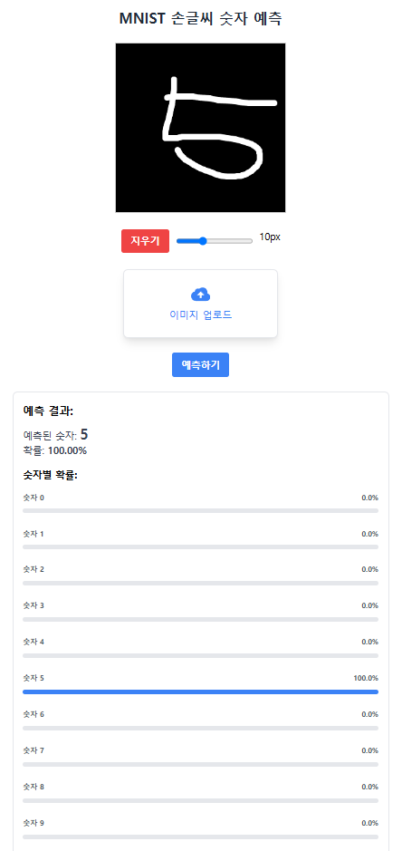

# 학습 내용

---

- FastAPI로 우리가 만든 모델 직접 배포

---

## FastAPI로 우리가 만든 모델 직접 배포

---

프로젝트에서 필요한 패키지

	- fastapi
	- uvicorn
	- tensorflow
	- pillow
	- python-multipart

첫번째 실습

[FastAPI Tutorial | ML Engineer를 위한 MLOps](https://mlops-for-mle.github.io/tutorial/en/docs/fastapi/fastapi-tutorial)

	ML Engineer를 위한 MLOps에서 FastAPI Tutorial 진행 하면서 FastAPI 학습

두번째 실습

	FastAPI를 활용해서 웹페이지를 구축

	- 디렉토리 구성

		your_project_directory/
		│
		├── main.py
		├── model.keras # 여러분들이 W&B로 실험해서 나온 모델 결과물들
		│
		├── templates/
		│   └── index.html
		│
		└── static/
		    └── (필요한 경우 CSS, JS, 이미지 파일들)

