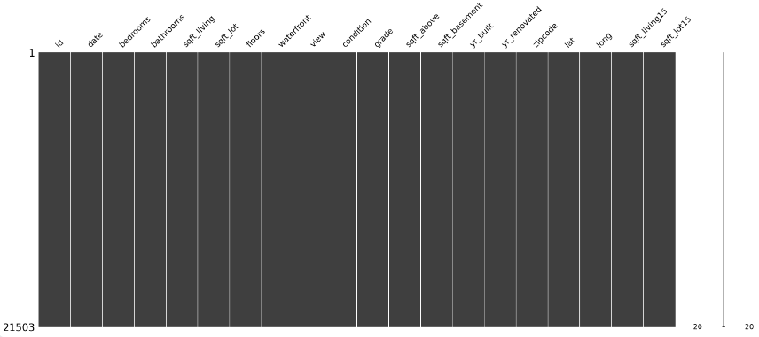
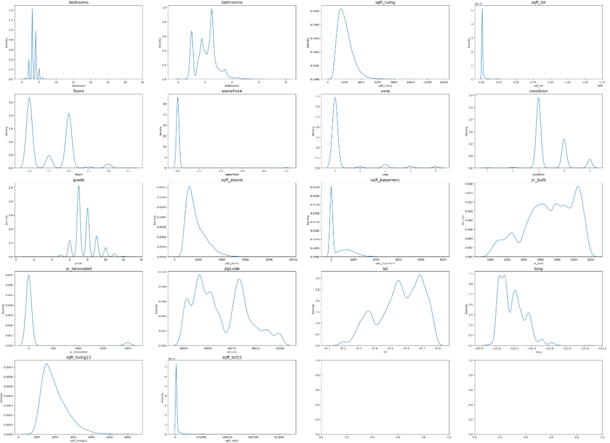
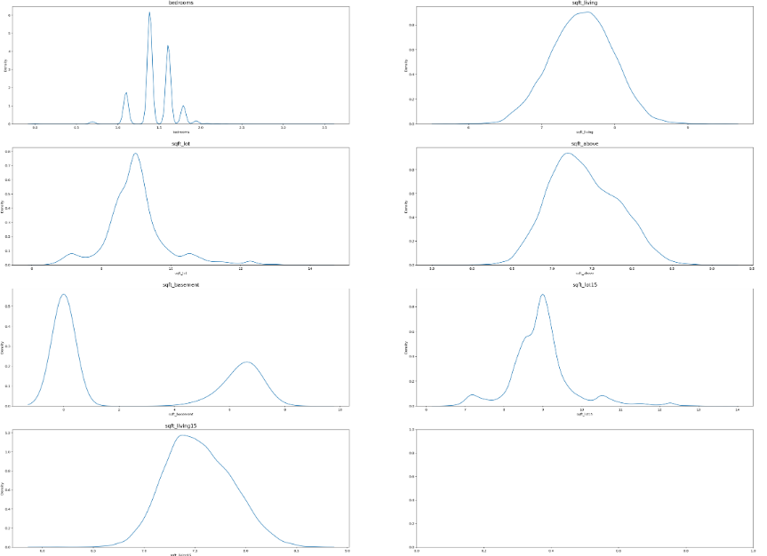
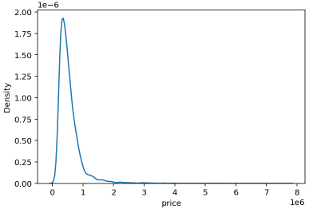
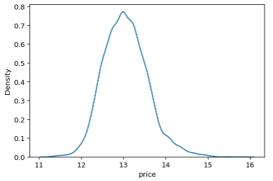
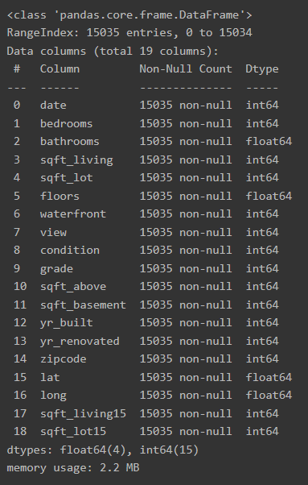
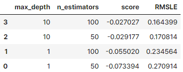

# 학습 내용
- 대회 소개
- baseline 모델을 사용해 주어진 문제를 해결, 결과를 제출하는 방법을 익힘
- baseline 모델의 성능 향상 방법 익힘

---

## 대회 소개

---

[캐글 코리아와 함께하는 2nd ML 대회 - House Price Prediction](https://www.kaggle.com/c/2019-2nd-ml-month-with-kakr)

	- 평가 방식 -> RMSE
	- "집값"을 예측하는 문제
 	- 하루 최대 제출 횟수 -> 5번

---

데이터 확인 

	예측해야 하는 컬럼 -> price

---

데이터 파일 

	train.csv를 활용해서 데이터를 뜯어보고 모델을 학습시킨 후, test.csv 파일의 데이터에 대해 price를 예측해서 sample_submission.csv의 형식에 맞는 형태로 캐글에 제출

---

## baseline 셋팅하기

---

[2019 ML month 2nd baseline 커널](https://www.kaggle.com/code/kcs93023/2019-ml-month-2nd-baseline)

### 다른 사람의 커널을 ipynb 파일로 다운받아 사용하기

---

캐글의 커널(Kernel)?

	우리가 쓰는 주피터 노트북 형태의 파일이 캐글 서버에서 실행될 때 그 프로그램을 일컫는 개념

---

	캐글 자체의 서버에서 baseline 노트북 파일을 돌리고 모델 학습을 시킬 수 있음
	
	1. 위와 같이 보이는 화면에서 Copy and Edit 버튼을 클릭
	2. 아래와 같이 웹상에서 코드를 돌려볼 수 있는 커널 창이 뜸
	3. File > Download 를 통해 커널을 ipynb 파일로 다운

---

## 라이브러리, 데이터 가져오기

---

라이브러리 가져오기

	'''

	import matplotlib.pyplot as plt
	%matplotlib inline
	%config InlineBackend.figure_format = 'retina'

	import warnings
	warnings.filterwarnings("ignore")

	import os
	from os.path import join

	import pandas as pd
	import numpy as np

	import missingno as msno

	from sklearn.ensemble import GradientBoostingRegressor
	from sklearn.model_selection import KFold, cross_val_score
	import xgboost as xgb
	import lightgbm as lgb

	import matplotlib.pyplot as plt
	import seaborn as sns

	'''

---

파일 경로 지정

	'''

	data_dir = os.getenv("HOME")+'/aiffel/kaggle_kakr_housing/data'
	# hint : os.getenv를 사용하거나 직접 경로를 작성

	train_data_path = join(data_dir, 'train.csv')
	sub_data_path = join(data_dir, 'test.csv')      # 테스트, 즉 submission 시 사용할 데이터 경로

	'''

---

## 데이터 이해하기

---

데이터 살펴보기 

	1. ID : 집을 구분하는 번호
	2. date : 집을 구매한 날짜
	3. price : 타겟 변수인 집의 가격
	4. bedrooms : 침실의 수
	5. bathrooms : 침실당 화장실 개수
	6. sqft_living : 주거 공간의 평방 피트
	7. sqft_lot : 부지의 평방 피트
	8. floors : 집의 층수
	9. waterfront : 집의 전방에 강이 흐르는지 유무 (a.k.a. 리버뷰)
	10. view : 집이 얼마나 좋아 보이는지의 정도
	11. condition : 집의 전반적인 상태
	12. grade : King County grading 시스템 기준으로 매긴 집의 등급
	13. sqft_above : 지하실을 제외한 평방 피트
	14. sqft_basement : 지하실의 평방 피트
	15. yr_built : 집을 지은 년도
	16. yr_renovated : 집을 재건축한 년도
	17. zipcode : 우편번호
	18. lat : 위도
	19. long : 경도
	20. sqft_living15 : 근처 15 가구의 주거 공간, 평방 피트
	21. sqft_lot15 : 근처 15가구의 부지, 평방 피트

---

데이터 불러오기

	'''

	data = pd.read_csv(train_data_path)
	sub = pd.read_csv(sub_data_path)

	'''

---

학습에 맞게 데이터 분류

	'''

	y = data['price']
	del data['price']

	train_len = len(data)
	data = pd.concat((data, sub), axis=0)

	'''

		전체 데이터에 대해 탐색해보기 위해 두 데이터를 pd.concat 메서드를 사용해 합침 -> 학습을 진행 할때 다시 분리해서 사용해야 하기 때문에 데이터를 합치기 전 train_len에 training data의 개수를 저장

---

간단한 전처리

missingno 라이브러리(matrix 메서드)를 사용 -> 데이터에 결측치 상태를 시각화를 통해 확인 가능

	'''

	msno.matrix(data)

	'''

		 data라는 DataFrame을 매트릭스 모양 그대로 시각화한 것 -> 특정 row, col에 NaN이라는 결측치가 있었다면 해당 부분이 하얗게 나옴

---

데이터프레임 인덱싱

	id 컬럼 사용

	순서

		- id컬럼이 결측치인지 확인합니다.
		- 결측치인 데이터만 뽑아냅니다.
		- 결측치인 데이터의 개수를 셉니다.

	'''

	null_check = pd.isnull(data['id'])
	print(null_check)

	null_data = data.loc[null_check, 'id']
	print(null_data.head())

	print(f'id: {len(null_data.values)}')

	'''

한번에 실행!

	'''

	print('{} : {}'.format('id', len(data.loc[pd.isnull(data['id']), 'id'].values)))

	'''

모든 컬럼 적용

	'''

	for c in data.columns:
	    print('{} : {}'.format(c, len(data.loc[pd.isnull(data[c]), c].values)))

	'''

---

id, data 변수 정리

	필요 없는 id 컬럼을 제거 -> 제출할 때를 대비하여 sub_id 변수에 id 칼럼을 저장

	'''

	sub_id = data['id'][train_len:]
	del data['id']

	'''

	date 컬럼은 apply 함수로 필요한 부분까지만 잘라줌 -> 연/월 데이터만 사용하기 위함

	'''

	data['date'] = data['date'].apply(lambda x : str(x[:6]))

	'''

---

시각화

	'''

	fig, ax = plt.subplots(5, 4, figsize=(40, 30))

	# id 변수(count==0인 경우)는 제외하고 분포를 확인합니다.
	count = 1
	columns = data.columns
	for row in range(5):
	    for col in range(4):
	        sns.kdeplot(data=data[columns[count]], ax=ax[row][col])
	        ax[row][col].set_title(columns[count], fontsize=15)
	        count += 1
	        if count == 19 :
	            break

	'''

		bedrooms, sqft_living, sqft_lot, sqft_above, sqft_basement, sqft_living15, sqft_lot15 변수가 한쪽으로 치우친 경향을 보임 ->  로그 변환(log-scaling) 사용 ->  데이터 분포를 정규분포에 가깝게 만들 수 있음

---

로그 변환후 시각화

	np.log1p()를 활용 -> 로그 변환

	'''

	skew_columns = ['bedrooms', 'sqft_living', 'sqft_lot', 'sqft_above', 'sqft_basement', 'sqft_lot15', 'sqft_living15']

	for c in skew_columns:
	    data[c] = np.log1p(data[c].values)

	'''

시각화

	'''

	fig, ax = plt.subplots(4, 2, figsize=(40, 30))   # 가로스크롤 때문에 그래프 확인이 불편하다면 figsize의 x값을 조절해 보세요. 

	# id 변수(count==0인 경우)는 제외하고 분포를 확인합니다.
	count = 0
	columns = data.columns
	for row in range(4):
	    for col in range(2):
	        sns.kdeplot(data=data[skew_columns[count]], ax=ax[row][col])
	        ax[row][col].set_title(skew_columns[count], fontsize=15)
	        count += 1
	        if count == 7 :
	            break

	'''

		이전보다 훨씬 치우침이 줄어든 분포 확인 가능!

---

train_len을 인덱스를 활용 -> 학습 데이터 / 테스트 데이터 나눠주기

	'''

	sub = data.iloc[train_len:, :]
	x = data.iloc[:train_len, :]

	'''

---

## 모델 설계 

---

블렌딩(blending)?

	하나의 개별 모델을 사용하는 것이 아니라 다양한 여러 모델을 종합하여 결과를 얻는 기법 (앙상블 기법이라 하기도함)

---

Q. 앙상블 기법 중 가장 기본적인 것은 보팅(Voting)과 에버리징(Averaging)입니다. 각각은 무엇이고, 언제 쓰이나요?

	- 서로 다른 알고리즘을 가진 분류기를 결합하는 방식
	- Voting -> 분류
	- Averaging -> 회귀

---

Average Blending

	모델은 부스팅 계열인 gboost, xgboost, lightgbm 세 가지 사용

	'''

	gboost = GradientBoostingRegressor(random_state=2019)
	xgboost = xgb.XGBRegressor(random_state=2019)
	lightgbm = lgb.LGBMRegressor(random_state=2019)

	models = [{'model':gboost, 'name':'GradientBoosting'}, {'model':xgboost, 'name':'XGBoost'},
	          {'model':lightgbm, 'name':'LightGBM'}]

	'''

---

Cross Validation

	교차 검증을 통해 모델의 성능을 간단히 평가

	'''

	def get_cv_score(models):
	    kfold = KFold(n_splits=5).get_n_splits(x.values)
	    for m in models:
	        CV_score = np.mean(cross_val_score(m['model'], X=x.values, y=y, cv=kfold))
	        print(f"Model: {m['name']}, CV score:{CV_score:.4f}")

	get_cv_score(models)

	'''
		
		결과
			Model: GradientBoosting, CV score:0.8598
			Model: XGBoost, CV score:0.8860
			Model: LightGBM, CV score:0.8819

		cross_val_score() 함수는 회귀모델을 전달할 경우 R^^2 점수를 반환 -> R^^2값은 1에 가까울수록 모델이 잘 학습되었다는 것을 나타냄

---

훈련 및 예측

'''

	def AveragingBlending(models, x, y, sub_x):
	    for m in models : 
	        m['model'].fit(x.values, y)
    
	    predictions = np.column_stack([
	        m['model'].predict(sub_x.values) for m in models
	    ])
	    return np.mean(predictions, axis=1)

	y_pred = AveragingBlending(models, x, y, sub)
	y_pred

	'''

---

sample_submission.csv 파일로 저장후 제출

	'''

	result = pd.DataFrame({
	    'id' : sub_id, 
	    'price' : y_pred
	})

	data_dir = os.getenv('HOME')+'/aiffel/kaggle_kakr_housing/data'
	my_submission_path = join(data_dir, 'my_submission.csv')

	result.to_csv(my_submission_path, index=False)

	'''

---

## 제출하기

---

	1. Step 1에 점선으로 보이는 제출 박스를 클릭, submission.csv 파일을 해당 박스 안에 드래그앤드롭 -> 파일이 업로드 됨
	2. Step 2에 원하는 메세지를 작성한 후 Make Submission을 클릭

---

## baseline모델 성능 향상

---

### 다시 한 번, 데이터 준비

---

Q8. 머신러닝에서 '파라미터' (혹은 모델 파라미터) 와 '하이퍼 파라미터'는 각각 무엇이고, 어떻게 다를까요?

	파라미터는 모델의 매개변수?
	
	하이퍼 파라미터는 직접 설정해줘야되는 변수? 매개변수?

---

데이터 준비

'''

	data_dir = os.getenv('HOME')+'/aiffel/kaggle_kakr_housing/data'

	train_data_path = join(data_dir, 'train.csv')
	test_data_path = join(data_dir, 'test.csv') 

	train = pd.read_csv(train_data_path)
	test = pd.read_csv(test_data_path)

	'''

---

전처리

	'''

	train['date'] = train['date'].apply(lambda i: i[:6]).astype(int)

	y = train['price']
	del train['price']

	del train['id']

	test['date'] = test['date'].apply(lambda i: i[:6]).astype(int)
	del test['id']

	'''

타켓 데이터인 y(가격) 시각화

	'''

	sns.kdeplot(data=y)

	'''

로그 변환 후 시각화

	'''

	y = np.log1p(y)

	sns.kdeplot(y)
	plt.show()

	'''

---

전체 데이터의 자료형 확인

	'''

	train.info()

	'''

---

### 함수 정의

---

모델별 RMSE 계산 함수 정의

	'''

	from sklearn.model_selection import train_test_split
	from sklearn.metrics import mean_squared_error

	from xgboost import XGBRegressor
	from lightgbm import LGBMRegressor
	from sklearn.ensemble import GradientBoostingRegressor, RandomForestRegressor

	def rmse(y_test, y_pred):
	    return np.sqrt(mean_squared_error(np.expm1(y_test), np.expm1(y_pred)))

	# random_state는 모델초기화나 데이터셋 구성에 사용되는 랜덤 시드값입니다. 
	#random_state=None    # 이게 초기값입니다. 아무것도 지정하지 않고 None을 넘겨주면 모델 내부에서 임의로 선택합니다.  
	random_state=2020        # 하지만 우리는 이렇게 고정값을 세팅해 두겠습니다. 

	gboost = GradientBoostingRegressor(random_state=random_state)
	xgboost = XGBRegressor(random_state=random_state)
	lightgbm = LGBMRegressor(random_state=random_state)
	rdforest = RandomForestRegressor(random_state=random_state)

	models = [gboost, xgboost, lightgbm, rdforest]

	def get_scores(models, train, y):
    
	    df = {}

	    for model in models:
	        # 모델 이름 획득
	        model_name = model.__class__.__name__

	        # train, test 데이터셋 분리
	        # random_state를 사용하여 고정하고 train과 test 셋의 비율은 8:2로 합니다.
	        x_train,x_test,y_train,y_test=train_test_split(train,y,test_size=0.2,random_state=1561)

	        # 모델 학습
	        model.fit(x_train,y_train)
	        
	        # 예측
	        y_pred=model.predict(x_test)

	        # 예측 결과의 rmse값 저장
	        df[model_name] = rmse(y_test,y_pred)
        
	        # data frame에 저장
	        score_df = pd.DataFrame(df, index=['RMSE']).T.sort_values('RMSE', ascending=False)
        
	    return df

	get_scores(models, train, y)

	'''

	각 모델의 이름은 다음과 같이 클래스의 __name__ 속성에 접근해서 얻을 수 있음

	결과
	
		{'GradientBoostingRegressor': 145010.83579502482, 'XGBRegressor': 127783.3767084659,'LGBMRegressor': 121754.46096321102,'RandomForestRegressor': 148807.13488389298}

---

### 그리드 탐색

---

그리드 탐색?

	사람이 먼저 탐색할 하이퍼 파라미터의 값들을 정해두고, 그 값들로 만들어질 수 있는 모든 조합을 탐색 -> 특정 값에 대한 하이퍼 파라미터 조합을 모두 탐색하고자 할 때 유리함

랜덤 탐색?

	사람이 탐색할 하이퍼 파라미터의 공간만 정해두고, 그 안에서 랜덤으로 조합을 선택해서 탐색하는 방법

		- 그리드 탐색 -> 사람이 정해둔 값들로 이루어지는 조합만 탐색하기 때문에 최적의 조합을 놓칠 수 있음 /  탐색 공간이 매우 제한적임
		- 랜덤 탐색에 -> 말 그대로 랜덤으로 탐색하기 때문에 최적의 조합을 찾을 수 있는 가능성이 언제나 열려 있음. 하지만 그 가능성 또한 랜덤성에 의존하기 때문에 언제나 최적을 찾는다는 보장은 없음 / 탐색하는 공간이 훨씬 넓음

---

(sklearn.model_selection 라이브러리)GridSearchCV 에 입력되는 인자

	- param_grid : 탐색할 파라미터의 종류 (딕셔너리로 입력)
	- scoring : 모델의 성능을 평가할 지표
	- cv : cross validation을 수행하기 위해 train 데이터셋을 나누는 조각의 개수
	- verbose : 그리드 탐색을 진행하면서 진행 과정을 출력해서 보여줄 메세지의 양 (숫자가 클수록 더 많은 메세지를 출력합니다.)
	- n_jobs : 그리드 탐색을 진행하면서 사용할 CPU의 개수

---

그리드 탐색 함수 정의

	'''

	from sklearn.model_selection import GridSearchCV

	def my_GridSearch(model, train, y, param_grid, verbose=2, n_jobs=5):
	    # GridSearchCV 모델로 초기화
	    grid_model = GridSearchCV(model, param_grid=param_grid, scoring='neg_mean_squared_error', \
	                              cv=5, verbose=verbose, n_jobs=n_jobs)
    
	    # 모델 fitting
	    grid_model.fit(train, y)

	    # 결과값 저장
	    params = grid_model.cv_results_['params']
	    score = grid_model.cv_results_['mean_test_score']
    
	    # 데이터 프레임 생성
	    results = pd.DataFrame(params)
	    results['score'] = score
    
	    # RMSLE 값 계산 후 정렬
	    results['RMSLE'] = np.sqrt(-1 * results['score'])
	    results = results.sort_values('RMSLE')

	    return results	

	'''

---

### 학습 및 예측

---

그리트 탐색 실시

	'''

	param_grid = {
	    'n_estimators': [50, 100],
	    'max_depth': [1, 10],
	}

	model = LGBMRegressor(random_state=random_state)
	my_GridSearch(model, train, y, param_grid, verbose=2, n_jobs=5)

	'''

		가장 좋은 조합은 -> max_depth=10, n_estimators=100

해당 파라미터로 구성된 모델 구축 및 학습, 예측

	'''

	model = LGBMRegressor(max_depth=10, n_estimators=100, random_state=random_state)
	model.fit(train, y)
	prediction = model.predict(test)
	prediction = np.expm1(prediction)
	prediction

	'''

sample_submission.csv 파일을 가져와 수정 후 저장

	'''

	data_dir = os.getenv('HOME')+'/aiffel/kaggle_kakr_housing/data'

	submission_path = join(data_dir, 'sample_submission.csv')
	submission = pd.read_csv(submission_path)

	submission['price'] = prediction

	submission_csv_path = '{}/submission_{}_RMSLE_{}.csv'.format(data_dir, 'lgbm', '0.164399')
	submission.to_csv(submission_csv_path, index=False)

	'''

