# 학습 내용

---

1. 포켓몬 그 데이터는 어기서 구할까
	1. 안녕, 포켓몬과 인사해!
	2. 포켓몬, 그 데이터는 어디서 구할까
	3. 포켓몬 데이터 불러오기
2. 전설의 포켓몬? 먼저 샅샅이 살펴보자!
	1. 결측치와 전체 컬럼
	2. ID와 이름
	3. 포켓몬의 속성
	4. 모든 스탯의 총합
3. 전설의 포켓몬과 일반 포켓몬, 그 차이는?
	1. 전설의 포켓몬의 Total값
	2. 전설의 포켓몬의 이름
4. 모델에 넣기 위해! 데이터 전처리하기
	1. 이름의 길이가 10 이상인가?
	2. 이름에 자주 쓰이는 토큰 추출
	3. Type 1 & 2! 범주형 데이터 전처리하기
5. 가랏, 몬스터볼!
	1. 가장 기본 데이터로 만드는 베이스라인
	2. 의사 결정 트리 모델 학습시키기
	3. 피처 엔지니어링 데이터로 학습시키면 얼마나 차이가 날까?
	4. 의사 결정 트리 모델 다시 학습시키기

---

## 안녕, 포켓몬과 인사해!

---

전설의 포켓몬?

	전설적으로 내려오는 존재!

	모습을 쉽게 볼 수도 없고, 실제로 존재하는지도 직접 보기 전에는 알 수 없는 그런 존재

---

목표!
	
	전설의 포켓몬 구별하기
---

## 포켓몬, 그 데이터는 어디서 구할까?

---

[(캐글) Pokemon with stats](https://www.kaggle.com/datasets/abcsds/pokemon)

	kaggle 데이터셋 활용

---

Q. 이 데이터셋은 포켓몬 게임, 포켓몬 카드, 포켓몬 고 중 어떤 것의 데이터셋인가요?
	
	포켓몬 게임 데이터셋

---

Q. 데이터셋에는 총 몇 가지의 정보가 담겨있으며, 각각은 무엇을 뜻하나요?

	11가지

	# : 각 포켓몬의 ID

	이름 : 각 포켓몬의 이름

	유형 1 : 각 포켓몬은 유형을 가지고 있으며, 이는 공격에 대한 약점/저항력을 결정합니다.

	유형 2 : 일부 포켓몬은 듀얼타입이며 2가지 특성을 가지고 있습니다.

	총합 : 이후의 모든 통계의 합계, 포켓몬의 강도에 대한 일반적인 가이드

	HP : 체력, 즉 생명력은 포켓몬이 기절하기 전에 얼마나 많은 피해를 견딜 수 있는지를 정의합니다.

	공격 : 일반 공격(예: 스크래치, 펀치)에 대한 기본 수정치

	방어력 : 일반 공격에 대한 기본 데미지 저항력

	SP Atk : 특수 공격, 특수 공격의 기본 수정치(예: 화염 폭발, 버블 빔)

	SP 방어력 : 특수 공격에 대한 기본 데미지 저항력

	속도 : 각 라운드마다 어떤 포켓몬이 먼저 공격하는지 결정합니다.

---

## 포켓몬 데이터 불러오기

---

라이브러리 import

	'''

	import numpy as np
	import pandas as pd
	import seaborn as sns
	import matplotlib.pyplot as plt
	%matplotlib inline
	%config InlineBackend.figure_format = 'retina'

	'''

---

데이터셋을 pandas로 불러오기

	'''

	import os
	csv_path = os.getenv("HOME") +"/aiffel/pokemon_eda/data/Pokemon.csv"
	original_data = pd.read_csv(csv_path)

	'''

---

데이터 확인 

	'''

	pokemon = original_data.copy()
	print(pokemon.shape)
	pokemon.head()

	'''

		데이터셋 -> 총 800행, 13열

---

Legendary == True -> legendary, Legendary == False -> ordinary에 저장

	'''

	legendary = pokemon[pokemon["Legendary"] == True].reset_index(drop=True)
	ordinary = pokemon[pokemon["Legendary"] == False].reset_index(drop=True)

	'''

		65개의 데이터만 전설의 포켓몬!

---

## 결측치와 전체 컬럼

---

결측치 확인

	'''

	pokemon.isnull().sum()

	'''

		Type 2 컬럼에만 총 386개의 결측치 존재

---

전체 컬럼 출력 

	'''

	pokemon.columns

	'''

		- # : 포켓몬 Id number. 성별이 다르지만 같은 포켓몬인 경우 등은 같은 #값을 가진다. int
		- Name : 포켓몬 이름. 포켓몬 각각의 이름으로 저장되고, 800개의 포켓몬의 이름 데이터는 모두 다르다. (unique) str
		- Type 1 : 첫 번째 속성. 속성을 하나만 가지는 경우 Type 1에 입력된다. str
		- Type 2 : 두 번째 속성. 속성을 하나만 가지는 포켓몬의 경우 Type 2는 NaN(결측값)을 가진다. str
		- Total : 전체 6가지 스탯의 총합. int
		- HP : 포켓몬의 체력. int
		- Attack : 물리 공격력. (scratch, punch 등) int
		- Defense : 물리 공격에 대한 방어력. int
		- Sp. Atk : 특수 공격력. (fire blast, bubble beam 등) int
		- Sp. Def : 특수 공격에 대한 방어력. int
		- Speed : 포켓몬 매치에 대해 어떤 포켓몬이 먼저 공격할지를 결정. (더 높은 포켓몬이 먼저 공격한다) int
		- Generation : 포켓몬의 세대. 현재 데이터에는 6세대까지 있다. int
		- Legendary : 전설의 포켓몬 여부. !! Target feature !! bool

---

## ID & 이름

---

총 몇 종류의 #값이 존재하는지 확인

	'''

	len(set(pokemon["#"]))

	'''

		721개 존재(set 자료형은 중복 데이터 존재 X)

---

유일한 이름의 개수 확인

	'''

	len(set(pokemon["Name"]))

	'''

		800개 존재

---

## 포켓몬의 속성

---

Type 1 & 2의 종류

	'''

	len(list(set(pokemon["Type 1"]))), len(list(set(pokemon["Type 2"])))

	'''

		Type 1 -> 18개 / Type 2 -> 19개

---

집합으로 만들고 차집합 확인

	'''

	set(pokemon["Type 2"]) - set(pokemon["Type 1"])

	'''

		결과: {nan} -> NaN 데이터 외의 나머지 18가지 속성은 Type 1, Type 2 모두 같음

---

포켓몬들의 모든 Type을 types 변수에 저장

	'''

	types = list(set(pokemon["Type 1"]))

	'''

---

Type 2가 NaN인 포켓몬의 수 확인

	'''

	pokemon["Type 2"].isna().sum()

	'''

		결과: 386 ->  386개의 포켓몬은 속성을 하나만 가지고, 나머지는 두 개의 속성을 가짐

	NaN값의 개수를 확인 -> isna() 메서드 활용

---

Type 1 데이터 시각화

	'''

	plt.figure(figsize=(10, 7))  # 화면 해상도에 따라 그래프 크기를 조정해 주세요.

	plt.subplot(211)
	sns.countplot(data=ordinary, x="Type 1", order=types).set_xlabel('')
	plt.title("[Ordinary Pokemons]")

	plt.subplot(212)
	sns.countplot(data=legendary, x="Type 1", order=types).set_xlabel('')
	plt.title("[Legendary Pokemons]")

	plt.show()

	'''
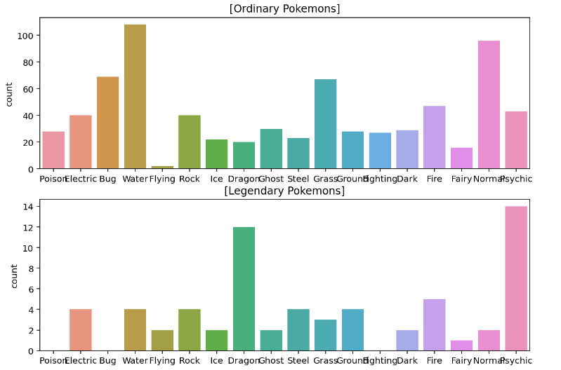

---

Q. 일반 포켓몬의 속성 분포와 전설의 포켓몬의 속성 분포는 어떤 차이가 있나요?

	일반 포켓몬은 물,노말,벌레 타입이 많고,

	전설의 포켓몬은 에스퍼, 드래곤이 많다.

---

피벗 테이블(pivot table)로 각 속성에 Legendary 포켓몬들이 몇 퍼센트씩 있는지 확인

	'''

	pd.pivot_table(pokemon, index="Type 1", values="Legendary").sort_values(by=["Legendary"], ascending=False)

	'''

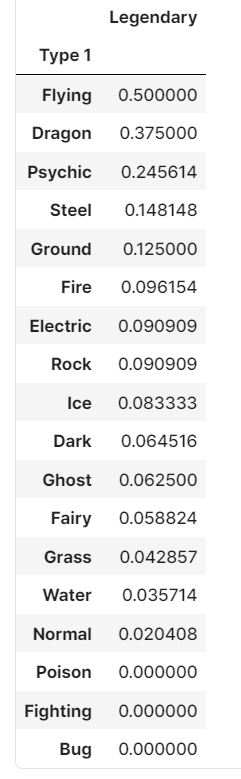

		Legendary 비율이 가장 높은 속성 -> Flying, 50% 비율

---

Type 2 데이터 시각화

	'''

	plt.figure(figsize=(12, 10))  # 화면 해상도에 따라 그래프 크기를 조정해 주세요.

	plt.subplot(211)
	sns.countplot(data=ordinary, x="Type 2", order=types).set_xlabel('')
	plt.title("[Ordinary Pokemons]")

	plt.subplot(212)
	sns.countplot(data=legendary, x="Type 2", order=types).set_xlabel('')
	plt.title("[Legendary Pokemons]")

	plt.show()

	'''

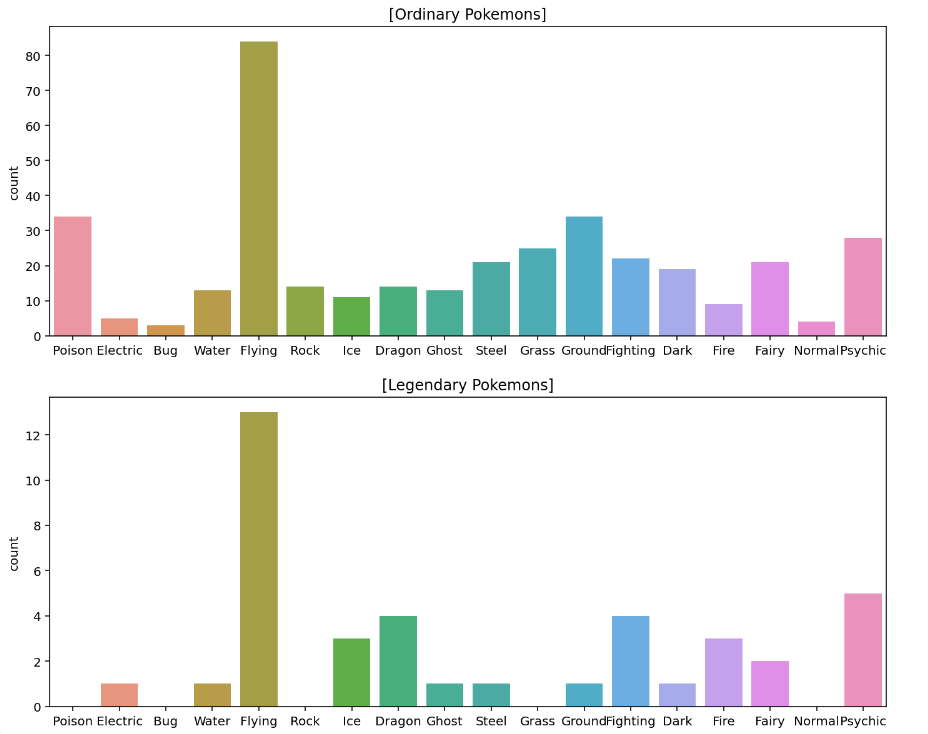

		Flying 속성의 경우 두 경우 다 가장 많지만,

		일반 포켓몬에는 Grass, Rock, Poison같은 속성이 많은 반면 전설의 포켓몬은 하나도 없음

---

피벗 테이블로도 확인

	'''

	pd.pivot_table(pokemon, index="Type 2", values="Legendary").sort_values(by=["Legendary"], ascending=False)

	'''

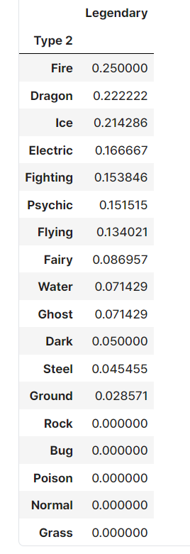

		Type 2에서는 Fire 속성 포켓몬의 Legendary 비율이 25%로 가장 높음

---

## 모든 스탯의 총합

---

모든 스탯의 종류를 stats라는 변수에 저장

	'''

	stats = ["HP", "Attack", "Defense", "Sp. Atk", "Sp. Def", "Speed"]

	'''

---

Q. 'pokemon['Total'].values'와 'pokemon[stats].values의 총합'이 같은 포켓몬의 수를 확인해봅시다.

	'''

	len(pokemon[pokemon['Total'].values==pokemon[stats].values.sum(axis=1)])

	'''

		결과: 800 -> Total값과 모든 stats의 총합이 모든 포켓몬이 같음

---

Total 값과 Legendary 는 어떤 관계?

	'''

	fig, ax = plt.subplots()
	fig.set_size_inches(12, 6)  # 화면 해상도에 따라 그래프 크기를 조정해 주세요.

	sns.scatterplot(data=pokemon, x="Type 1", y="Total", hue="Legendary")
	plt.show()

	'''

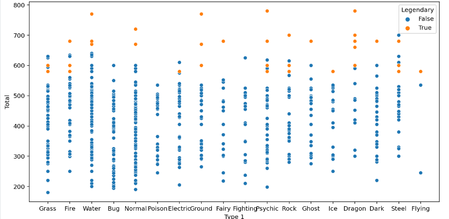

	Legendary 여부에 따라 색깔(hue)을 달리함

		전설의 포켓몬은 주로 Total 스탯 값이 높다는 것이 확인 가능함

---

## 세부 스텟

---

Q. 각각의 스탯에 대한 scatter plot을 6개의 subplot으로 표현

'''

	figure, ((ax1, ax2, ax3), (ax4, ax5, ax6)) = plt.subplots(nrows=2, ncols=3)
	figure.set_size_inches(12, 18)  # 화면 해상도에 따라 그래프 크기를 조정해 주세요.

	# "HP" 스탯의 scatter plot
	sns.scatterplot(data=pokemon, y="Total", x="HP", hue="Legendary", ax=ax1)

	# "Attack" 스탯의 scatter plot
	sns.scatterplot(data=pokemon, y="Total", x="Attack", hue="Legendary", ax=ax2)

	# "Defense" 스탯의 scatter plot
	sns.scatterplot(data=pokemon, y="Total", x="Defense", hue="Legendary", ax=ax3)

	# "Sp. Atk" 스탯의 scatter plot
	sns.scatterplot(data=pokemon, y="Total", x="Sp. Atk", hue="Legendary", ax=ax4)

	# "Sp. Def" 스탯의 scatter plot
	sns.scatterplot(data=pokemon, y="Total", x="Sp. Def", hue="Legendary", ax=ax5)

	# "Speed" 스탯의 scatter plot
	sns.scatterplot(data=pokemon, y="Total", x="Speed", hue="Legendary", ax=ax6)

	plt.show()

	'''

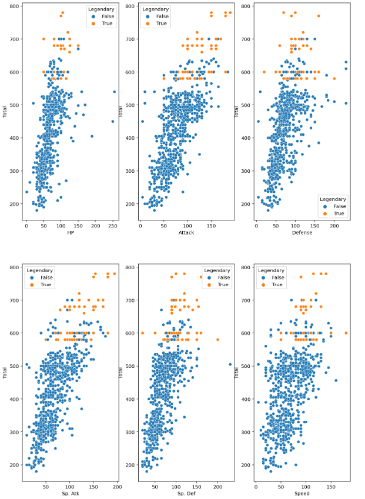

	- HP, Defense, Sp. Def
		
		- 전설의 포켓몬은 주로 높은 스탯을 갖지만, 이 세 가지에서는 일반 포켓몬이 전설의 포켓몬보다 특히 높은 몇몇 포켓몬이 있습니다.

		- 그러나 그 포켓몬들도 Total 값은 특별히 높지 않은 것으로 보아 특정 스탯만 특별히 높은, 즉 특정 속성에 특화된 포켓몬들로 보입니다. (ex. 방어형, 공격형 등)

	- Attack, Sp. Atk, Speed

		- 이 세 가지 스탯은 Total과 거의 비례합니다.

		- 전설의 포켓몬이 각 스탯의 최대치를 차지하고 있습니다.

---

## 포켓몬 세개

---

각 세대에 대한 포켓몬의 수를 확인

	'''

	plt.figure(figsize=(12, 10))   # 화면 해상도에 따라 그래프 크기를 조정해 주세요.

	plt.subplot(211)
	sns.countplot(data=ordinary, x="Generation").set_xlabel('')
	plt.title("[Ordinary Pokemons]")
	plt.subplot(212)
	sns.countplot(data=legendary, x="Generation").set_xlabel('')
	plt.title("[Legendary Pokemons]")
	plt.show()

	'''

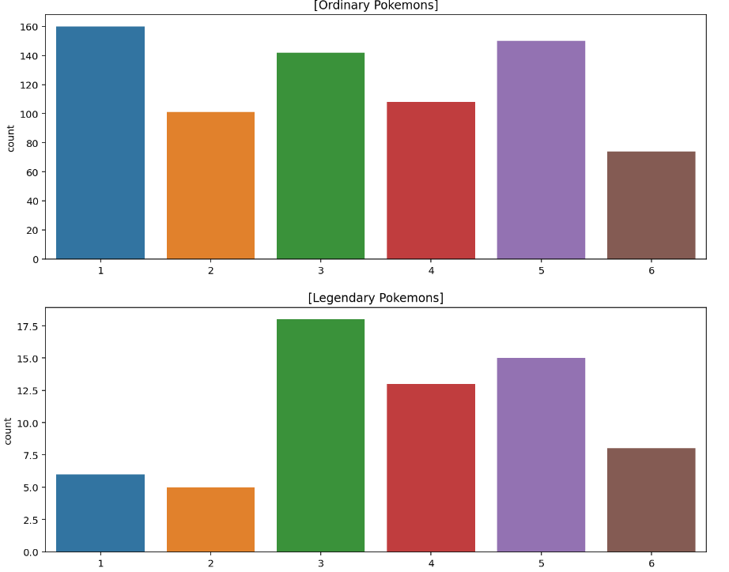

		전설의 포켓몬은 1, 2세대에는 많지 않았나 보네요. 3세대부터 많아졌다가, 6세대에 다시 줄어든 것을 확인

---

## Total 값 차이 확인

---

Total 값을 속성(Type 1)별로 확인

	'''

	fig, ax = plt.subplots()
	fig.set_size_inches(8, 4)

	sns.scatterplot(data=legendary, y="Type 1", x="Total")
	plt.show()

	'''
<F12>
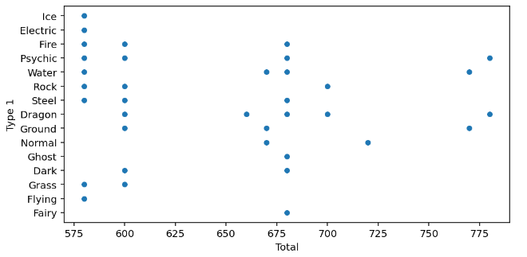

		전설의 포켓몬들의 Total값들이 600과 같은 특정한 값에 몰려있다!

		__즉, Total값은 legendary인지 아닌지를 예측하는 데에 중요한 컬럼일 것이라는 결론__

---

## 이름 차이 확인

---

비슷한 이름을 가진 포켓몬들의 모임

	'''

	n1, n2, n3, n4, n5 = legendary[3:6], legendary[14:24], legendary[25:29], legendary[46:50], legendary[52:57]
	names = pd.concat([n1, n2, n3, n4, n5]).reset_index(drop=True)

	'''
		"MewTwo", "Latias", "Latios", "Kyogre", "Groudon", "Rayquaza", "Kyurem" 등의 포켓몬은 비슷한 이름을 가진 포켓몬이 다수 존재

---

이름에 forme가 들어가는 여러 가지 전설의 포켓몬이 있는 경우도 존재

	'''

	formes = names[13:23]

	'''

		이름에 forme가 들어가면 이는 전설의 포켓몬일 확률이 아주 높음

---

legendary와 ordinary 각각에 모두 "name_count"라는 이름의 길이를 나타내는 컬럼 생성

	'''

	legendary["name_count"] = legendary["Name"].apply(lambda i: len(i))    
	ordinary["name_count"] = ordinary["Name"].apply(lambda i: len(i)) 

	'''

---

name_count 컬럼의 특성 확인

	'''

	plt.figure(figsize=(12, 10))   # 화면 해상도에 따라 그래프 크기를 조정해 주세요.

	plt.subplot(211)
	sns.countplot(data=legendary, x="name_count").set_xlabel('')
	plt.title("Legendary")
	plt.subplot(212)
	sns.countplot(data=ordinary, x="name_count").set_xlabel('')
	plt.title("Ordinary")
	plt.show()

	'''

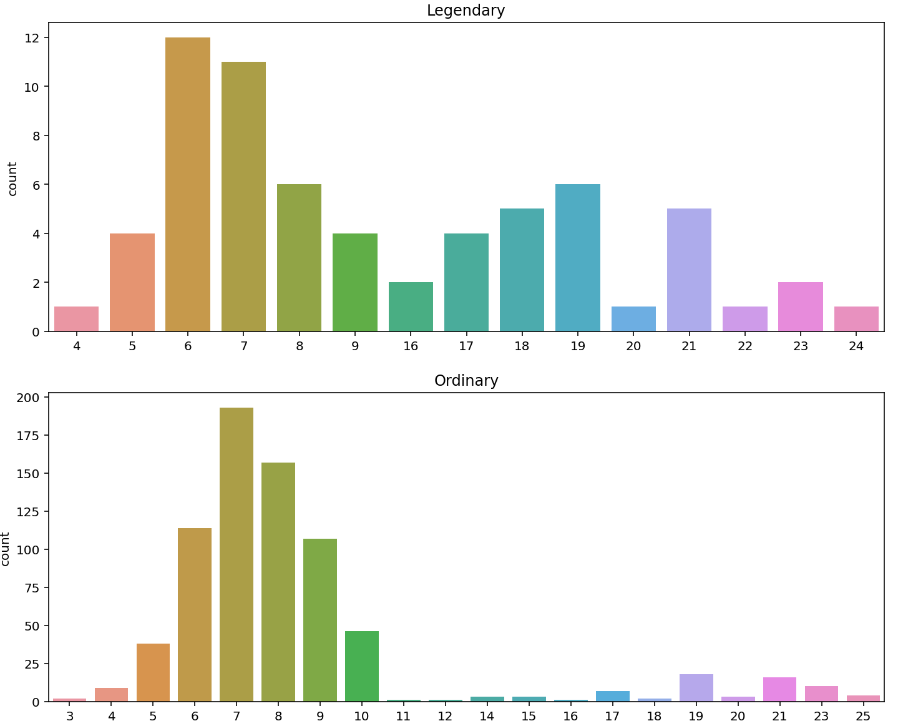

		 전설의 포켓몬은 16 이상의 긴 이름을 가진 포켓몬이 많은 반면, 일반 포켓몬은 10 이상의 길이를 가지는 이름의 빈도가 아주 낮음

---

전설의 포켓몬과 일반 포켓몬이  이름이 10 이상일 확률

	'''

	print(round(len(legendary[legendary["name_count"] > 9]) / len(legendary) * 100, 2), "%")
	print(round(len(ordinary[ordinary["name_count"] > 9]) / len(ordinary) * 100, 2), "%")

	'''

		전설의 포켓몬의 확률 -> 41%, 일반 포켓몬의 확률 -> 16% 

---

## 이름의 길이가 10 이상인가?

---

이름의 길이를 확인(name_count 컬럼 생성)

	'''

	pokemon["name_count"] = pokemon["Name"].apply(lambda i: len(i))

	'''

---

이름의 길이가 10 이상인가 아닌가(long_name 컬럼 생성)
	
	'''

	pokemon["long_name"] = pokemon["name_count"] >= 10

	'''

---

## 이름에 자주 쓰이는 토큰 추출

---

### 알파벳이 아닌 문자가 들어간 경우 전처리

---

띄어쓰기가 없는 컬럼 생성

	'''

	pokemon["Name_nospace"] = pokemon["Name"].apply(lambda i: i.replace(" ", ""))

	'''

---

알파벳으로만 이루어졌는지 확인(name_isalpha 컬럼 생성)

	'''

	pokemon["name_isalpha"] = pokemon["Name_nospace"].apply(lambda i: i.isalpha())

	'''

	isalpha() 함수 활용

---

알파벳이 아닌 다른 문자가 이름에 포함된 것 확인

	'''

	pokemon[pokemon["name_isalpha"] == False]

	'''

		이름에 알파벳이 아닌 것을 포함하는 경우는 9마리뿐!

---

이름 바꾸기

	'''

	pokemon = pokemon.replace(to_replace="Nidoran♀", value="Nidoran F")
	pokemon = pokemon.replace(to_replace="Nidoran♂", value="Nidoran M")
	pokemon = pokemon.replace(to_replace="Farfetch'd", value="Farfetchd")
	pokemon = pokemon.replace(to_replace="Mr. Mime", value="Mr Mime")
	pokemon = pokemon.replace(to_replace="Porygon2", value="Porygon Two")
	pokemon = pokemon.replace(to_replace="Ho-oh", value="Ho Oh")
	pokemon = pokemon.replace(to_replace="Mime Jr.", value="Mime Jr")
	pokemon = pokemon.replace(to_replace="Porygon-Z", value="Porygon Z")
	pokemon = pokemon.replace(to_replace="Zygarde50% Forme", value="Zygarde Forme")

	pokemon.loc[[34, 37, 90, 131, 252, 270, 487, 525, 794]]

	'''

	 pandas의 replace 함수 사용

---

### 띄어쓰기 & 대문자 기준으로 분리해 토큰화

---

정규식 re 패키지를 사용

	'''

	import re

	'''

	정규표현식 사용 -> re 패키지 사용

---

토큰화 메서드 정의

	'''

	def tokenize(name):
	    name_split = name.split(" ")
	    tokens = []
	    for part_name in name_split:
	        a = re.findall('[A-Z][a-z]*', part_name)
	        tokens.extend(a)
        
	    return np.array(tokens)

	'''

---

전설의 포켓몬 데이터셋에 적용

	'''

	all_tokens = list(legendary["Name"].apply(tokenize).values)

	token_set = []
	for token in all_tokens:
	    token_set.extend(token)

	print(len(set(token_set)))
	print(len(token_set))

	'''

		총 120개, 중복 제외 65개

---

어떤 토큰이 가장 많이 쓰였는지 찾기
	
	'''

	from collections import Counter

	most_common = Counter(token_set).most_common(10)
	most_common

	'''

		전설의 포켓몬 이름에는 Forme가 15번이나 쓰임, 진화를 했을 때 붙는 이름인 Mega도 6번 쓰임

---

전설의 포켓몬 이름에 등장하는 토큰이 포켓몬의 이름에 있는지의 여부를 나타내는 컬럼 생성

	'''

	for token, _ in most_common:
	    # pokemon[token] = ... 형식으로 사용하면 뒤에서 warning이 발생합니다
	    pokemon[f"{token}"] = pokemon["Name"].str.contains(token)

	'''

		름에 맞게 True 또는 False가 처리됨

		전설의 포켓몬이 많이 가지는 Forme와 같은 토큰의 컬럼 값이 True라면 그 포켓몬은 전설의 포켓몬일 확률이 높다고 판단 가능

---

## Type1 & 2 범주형 데이터 전처리

---

18개의 컬럼에 대해 원-핫 인코딩 작업

	'''

	for t in types:
	    pokemon[t] = (pokemon["Type 1"] == t) | (pokemon["Type 2"] == t)
    
	pokemon[[["Type 1", "Type 2"] + types][0]].head()

	'''

		Type별로 원-핫 인코딩이 잘 됨을 확인 가능

---

## 가장 기본 데이터로 만드는 베이스라인

---

베이스라인 모델?

	가장 기초적인 방법으로 만든 모델로써 성능 하한선을 제공함 -> 새롭게 만들 모델이 맞는 방향으로 가고 있는지 확인 가능

---

학습시킬 컬럼 선택

	'''

	features = ['Total', 'HP', 'Attack', 'Defense', 'Sp. Atk', 'Sp. Def', 'Speed', 'Generation']
	X=original_data[features]

	target = 'Legendary'
	y=original_data[target]

	'''

---

학습 데이터와 테스트 데이터가 분리

	'''

	from sklearn.model_selection import train_test_split

	X_train, X_test, y_train, y_test = train_test_split(X, y, test_size=0.2, random_state=15)

	'''

---

## 의사 결정 트리 모델 학습시키기

---

모델 정의

	'''

	from sklearn.tree import DecisionTreeClassifier

	model = DecisionTreeClassifier(random_state=25)

	'''

---

모델 학습 및 성능 확인

	'''

	from sklearn.metrics import confusion_matrix
	from sklearn.metrics import classification_report

	model.fit(X_train, y_train)
	y_pred = model.predict(X_test)

	print(confusion_matrix(y_test, y_pred))

	print(classification_report(y_test, y_pred))

	'''

	결과: [[144,   3],[  5,   8]]

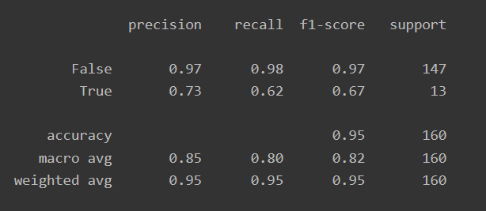

		 Recall이 낮다는 것은 분모에 있는 FN값이 높다는 것 -> 전설의 포켓몬인데 일반 포켓몬이라고 판단하는 경우가 많음

---

## 피쳐 엔지니어링 데이터로 학습시키면 얼마나 차이가 날까?

---

학습시킬 컬럼 선택
	
	'''

	features = ['Total', 'HP', 'Attack', 'Defense','Sp. Atk', 'Sp. Def', 'Speed', 'Generation', 
	            'name_count','long_name', 'Forme', 'Mega', 'Mewtwo','Deoxys', 'Kyurem', 'Latias', 'Latios',
	            'Kyogre', 'Groudon', 'Hoopa','Poison', 'Ground', 'Flying', 'Normal', 'Water', 'Fire',
	            'Electric','Rock', 'Dark', 'Fairy', 'Steel', 'Ghost', 'Psychic', 'Ice', 'Bug', 'Grass', 'Dragon', 'Fighting']
	X=pokemon[features]

	target = "Legendary"
	y=pokemon['Legendary']

	'''

---

학습 데이터와 테스트 데이터가 분리

	'''

	X_train, X_test, y_train, y_test = train_test_split(X, y, test_size=0.2, random_state=15)

	'''

---

## 의사 결정 트리 모델 다시 학습시키기

---

	'''

	model = DecisionTreeClassifier(random_state=25)

	model.fit(X_train, y_train)
	y_pre=model.predict(X_test)

	print(confusion_matrix(y_test, y_pre))

	print(classification_report(y_test, y_pre))

	'''

	결과: [[141   6], [  1  12]]

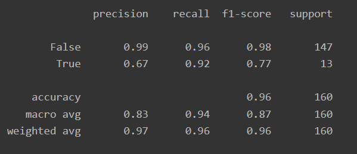

		recall값이 무려 0.92으로 상승!!

