# 학습 내용

---

- "사용한 연수"만 가지고 맥북 중고가 맞춰보기
	- 데이터 확인하기
	- 모델 구축
	- 손실함수 정의하기
	- 손실함수 줄이기
	- 한 단계 한 단계 학습!
- 다양한 정보로 원하는 값을 예측해 보기
	- 데이터 확인하기
	- 손실함수 정의
	- 직접 그래디언티 계산하기
	- 모델 학습
	- 라이브러리로 깔끔하게!

---

## 맥북 데이터 확인하기

---

데이터 준비

	'''

	import pandas as pd

	macbook = pd.read_csv('~/aiffel/bike_regression/data/macbook.csv')
	macbook.head()

	'''

		사용 연수를 나타내는 used_years, 중고 가격을 나타내는 price 두 열로 이루어져 있음 -> 총 80행

---

데이터 시각화

	'''

	import matplotlib.pyplot as plt
	# 실행한 브라우저에서 바로 그림을 볼 수 있게 해줌
	%matplotlib inline 
	%config InlineBackend.figure_format = 'retina' # 더 높은 해상도로 출력한다.

	plt.scatter(macbook['used_years'], macbook['price'])
	plt.show()

	'''

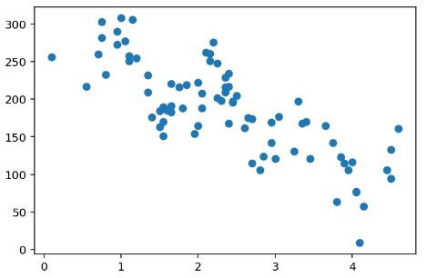

---

상관관계?

	한 변수가 커짐에 따라 다른 변수가 작아지는 관계 -> 피어슨 상관계수로 표현 가능

	- 각 이미지 위에 써있는 숫자 -> 상관계수(-1 ~ 1)
	- 상관관계가 없다면 -> 0 / 상관관계가 강하다면 상관계수의 절대값 증가
	- 상관 계수
		- 양의 값 -> 한 변수가 커질수록 다른 변수의 값도 커짐(양의 상관관계)
		- 음의 값 -> 한 변수가 커질수록 다른 변수의 값은 작아짐(음의 상관관계)
	- 데이터의 분포가 직선에 가까울수록 상관계수 값은 -1 또는 1에 가까워짐
	- 데이터의 분포가 넓게 퍼지며 원에 가까워질수록 상관계수의 값은 0에 가까워짐
	- 상관계수는 '기울기'를 이야기하는 것 / 두 변수 간의 패턴을 나타내는 것 X ->  두 변수 간에 한 변수가 변함에 따라 다른 변수의 값이 어떻게 변하는지에 대한 '상호적인 관계의 정도'를 나타내는 것
	

---

Q. 위에서 두 변수는 상관관계가 있나요? 있다면 어떤 상관관계가 있나요?

	있음, 상관관계가 -1 에 가까움

---

상관계수 구해보기

	'''

	import numpy as np

	# np.corrcoef(x, y)를 사용합니다.
	np.corrcoef(macbook['used_years'], macbook['price'])

	'''

		array([[ 1.        , -0.78972238],[-0.78972238,  1.        ]]) 

		대각선에 해당하는 (0, 0) 위치와 (1, 1) 위치 -> 각각 첫 번째 변수와 첫 번째 변수, 두 번째 변수와 두 번째 변수끼리의 상관계수를 나타내기 때문에 항상 1이 됨

---

## 모델 구축

---

model?

	특정 정보를 입력받아서 그 정보에 따라 원하는 값을 예측하여 값을 출력하는 함수

---

문제 정의

	사용 연수를 입력받아서, 중고가를 예측

	'''

	x = macbook["used_years"].values
	y = macbook["price"].values

	'''

---

일차함수 모델

	'''

	def model(x, w, b):
	    y = w * x + b
	    return y

	'''

---

모델 학습?

	모델이 입력을 받았을 때 정답값에 가까운 출력을 낼 수 있는 최적의 "매개변수", 혹은 "파라미터" 를 찾는다는 뜻

	 100 = w × 2 + b / 40 = w × 5 + b 연립 방정식으로 w=-20, b=140, 즉 y = -20x + 140 이라는 방정식을 구할 수 있음

---

데이터 시각화

	'''

	# x축, y축 그리기
	plt.axvline(x=0, c='black')
	plt.axhline(y=0, c='black')

	# y = wx + b 일차함수 그리기
	x = np.linspace(0, 8, 9)
	y = model(x, w=-20, b=140) # y = -20x + 140
	plt.plot(y)

	# 나의 (x, y) 점 찍기
	x_data = [2, 5, 6]
	y_data = [100, 40, 20]
	plt.scatter(x_data, y_data, c='r', s=50)

	plt.show()

	'''	

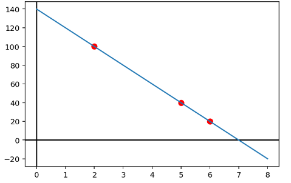

---

오차를 최소화하는 모델
	

	- y=wx+b라는 함수에서 위와 같이 최적의 직선이 될 수 있는 w와 b값을 찾는다는 의미
	- w와 b같은 값을 보통 "매개변수" 또는 "파라미터", 또는 "가중치" 라고 함

---

## 손실함수 정의하기

---

손실함수?

	직 불완전한 현재의 모델이 출력하는 값과 실제 정답 간의 차이

---

ex)

	'''

	w = 3.1
	b = 2.3

	x = np.linspace(0, 5, 6)
	y = model(x, w, b) # y = 3.1x + 2.3
	plt.plot(y, c='r')

	plt.scatter(macbook['used_years'], macbook['price'])
	plt.show()

	'''

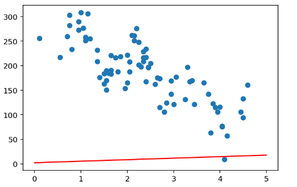

	'''

	x = macbook["used_years"].values
	prediction = model(x, w, b) # 현재 w = 3.1, b = 2.3

	macbook['prediction'] = prediction

	'''

---

정답과 예측값 간의 차이

'''

	def RMSE(a, b):
	    mse = ((a - b) ** 2).mean()  # 두 값의 차이의 제곱의 평균
	    rmse = mse ** 0.5        # MSE의 제곱근
	    return rmse

	x = macbook["used_years"].values
	y = macbook["price"].values

	predictions = model(x, w, b)

	rmse = RMSE(predictions, y)

	'''

		모델이 너무나 부정확하기 때문에 rmse값이 매우 크게 나타남!!

---

손실함수?

	모델의 예측값과 정답값에 대한 차이를 계산하는 함수 -> 손실함수(loss function) / 비용함수(cost function) 라고 부름

	'''

	def loss(x, w, b, y):
	    predictions = model(x, w, b)
	    L = RMSE(predictions, y)
	    return L

	'''

---

## 손실함수 줄이기

---

기울기와 경사하강법(Gradient Descent)

	위 그래프의 x축은 w이고, y축은 손실함수의 함수값, loss값 ->  값에 따른 손실함수 그래프

현재의 w를 최적의 w로 옮길 수 있을까?

	- 만약 현재의 w가 최적의 w의 왼쪽 에 위치하고 있다면 현재의 w가 최적의 w보다 작다는 의미이므로 우리는 현재의 w가 커지도록 늘려야 합니다.
	- 반대로 오른쪽 에 위치하고 있다면 현재의 w 값이 최적의 w 값보다 크다는 의미이므로 현재의 w 값이 작아지도록 줄여야 합니다.

문제 -> 최적의 w 값이 무엇인지를 모르기 때문에, 현재 w 값 또한 최적의 w보다 큰지 혹은 작은지를 알 수 없다 점!

	- 왼쪽 점은 자기 자신의 위치보다 오른쪽으로 갈수록 손실함수값이 점점 작아지기 때문에 그 점에서 그린 접선은 오른쪽 아래로 향하는 방향 이고, 그 기울기는 음수 입니다.
	- 오른쪽 점은 자기 자신의 위치보다 왼쪽으로 갈수록 손실함수값이 점점 작아지기 때문에 그 점에서 그린 접선은 왼쪽 아래로 향하는 방향이고, 그 기울기는 양수 입니다.

		기울기는 항상 자기 자신보다 함수값이 작아지는 방향 을 알려줌

		∴  -현재 w에서의 기울기를 구한다.
		  - 기울기가 음수라면, 현재 w를 키운다.
		  - 기울기가 양수라면, 현재 w를 줄인다.

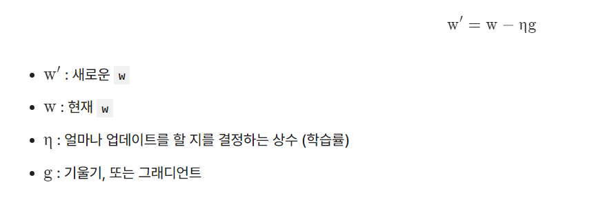

---

미분으로 경사 구하기

수치 미분?

	수학적으로 정확한 값은 아니지만 근사한 미분계수 값을 찾는 방법

두 가지의 기울기를 모두 계산하는 gradient 함수

	x를 0.0001로 두고 계산

	'''

	def gradient(x, w, b, y):
	    dw = (loss(x, w + 0.0001, b, y) - loss(x, w, b, y)) / 0.0001
	    db = (loss(x, w, b + 0.0001, y) - loss(x, w, b, y)) / 0.0001
	    return dw, db

	'''

---

## 한 단계 한 단계 학습!

---

하이퍼 파라미터

	경사하강법에서 필요했던 학습률, η 상수를 정의

	'''

	LEARNING_RATE = 1

	'''

---

모델 최적화

	'''

	x = macbook["used_years"].values
	y = macbook["price"].values

	w = 3.1
	b = 2.3

	losses = []

	for i in range(1, 2001):
	    dw, db = gradient(x, w, b, y)   # 3, 4번: 모델이 prediction을 예측하고, 손실함수값을 계산함과 동시에 기울기 계산
	    w -= LEARNING_RATE * dw         # 5번: w = w - η * dw 로 업데이트
	    b -= LEARNING_RATE * db         # 5번: b = b - η * db 로 업데이트 
	    L = loss(x, w, b, y)            # 현재의 loss 값 계산
	    losses.append(L)                # loss 값 기록
	    if i % 100 == 0:
	        print('Iteration %d : Loss %0.4f' % (i, L))

	plt.plot(losses)
	plt.show()

	'''

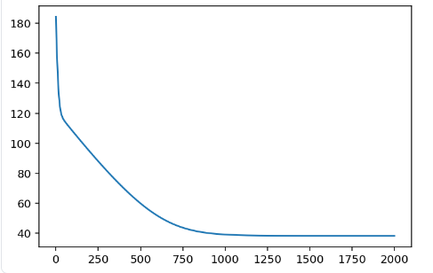

	'''

	# 모델에 넣을 x 값들 준비
	x = np.linspace(0, 5, 6)

	# x, w, b를 모델에 넣어 y값 출력
	y = model(x, w, b)

	# 일차함수 y 그리기
	plt.plot(y, c="r")

	# 원본 데이터 점찍기
	plt.scatter(macbook['used_years'], macbook['price'])
	plt.show()

	'''

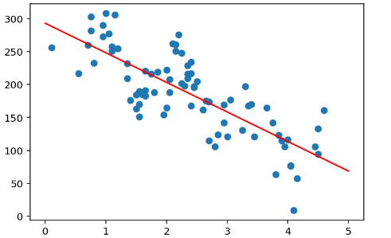

---

새로운 데이터 학습

	'''

	test = pd.read_csv("~/aiffel/bike_regression/data/macbook_test.csv")

	test_x = test['used_years'].values
	test_y = test['price'].values

	prediction = model(test_x, w, b)
	test['prediction'] = prediction
	test['error'] = test['price'] - test['prediction']
	rmse = ((test['error'] ** 2).sum() / len(test)) ** 0.5

	# 모델 일차함수 그리기
	x = np.linspace(0, 5, 6)
	y = model(x, w, b)
	plt.plot(y, c="r")

	# 실제 데이터 값
	plt.scatter(test['used_years'], test['price'])

	# 모델이 예측한 값
	plt.scatter(test['used_years'], test['prediction'])
	plt.show()

	'''

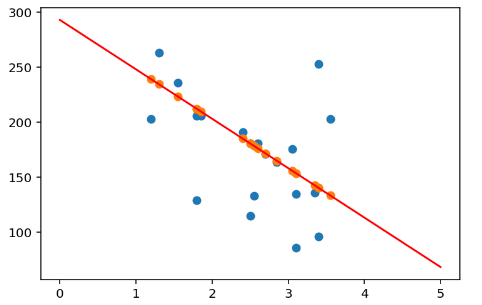

---

## 팁 데이터 확인하기

---

	'''

	import seaborn as sns

	tips = sns.load_dataset("tips")

	'''

		총 244개의 행과 7개의 열로 이루어져 있군요.
		
		각 데이터는 total_bill, tip, sex, smoker, day, time, size 7개의 정보를 담고 있습니다.

		각 컬럼은 다음과 같은 정보를 나타내죠.

			- total_bill : 테이블의 전체 지불 금액
			- tip : 팁으로 낸 금액
			- sex : 계산한 손님의 성별
			- smoker : 손님 중 흡연자 포함 여부
			- day : 요일
			- time : 시간
			- size : 테이블 인원수

---

문자열 데이터에 대해서는 0, 1 로 변환

	'''

	import pandas as pd
	tips = pd.get_dummies(tips, columns=['sex', 'smoker', 'day', 'time'])

	'''

		문자열 데이터는 모두 사라지고, 대신 sex_Male, sex_Female과 같이 각 카테고리에 대한 컬럼이 새롭게 만들어짐(One-Hot Encoding)

---

선형 회귀?

	선형 방정식을 활용해서 원하는 값을 예측하는 모델을 설계하고 학습시키는 방법

회귀?

	연속된 실수값을 예측하는 문제

---

표기법

	y=W1X1+W2X2+W3X3+W4X4+W5WX+5W6X6+W7X7+W8X8+W9X9+W10X10+W11X11+W12X12+b

	y=W0+W1X1+W2X2+W3X3+W4X4+W5WX+5W6X6+W7X7+W8X8+W9X9+W10X10+W11X11+W12X12

	y=W0*1+W1X1+W2X2+W3X3+W4X4+W5WX+5W6X6+W7X7+W8X8+W9X9+W10X10+W11X11+W12X12

		모두 같은 식을 표기한 것

---

## 손실함수 정의

---

데이터 준비 

	'''

	from sklearn.model_selection import train_test_split

	X = tips[['total_bill', 'size', 'sex_Male', 'sex_Female', 'smoker_Yes', 'smoker_No',
	          'day_Thur', 'day_Fri', 'day_Sat', 'day_Sun', 'time_Lunch', 'time_Dinner']].values
	y = tips['tip'].values

	X_train, X_test, y_train, y_test = train_test_split(X, y, test_size=0.2, random_state=42)

	'''

W와 b는 랜덤한 값으로 초기값 설정 / model, mse, loss 메서드 정의

	'''

	import numpy as np

	def model(X, W, b):
	    predictions = 0
	    for i in range(12):
	        predictions += X[:, i] * W[i]
	    predictions += b
	    return predictions

	def MSE(a, b):
	    mse = ((a - b) ** 2).mean()  # 두 값의 차이의 제곱의 평균
	    return mse

	def loss(X, W, b, y):
	    predictions = model(X, W, b)
	    L = MSE(predictions, y)
	    return L

	W = np.random.rand(12)
	b = np.random.rand()

	'''

---

## 직접 그래디언트 계산하기

---

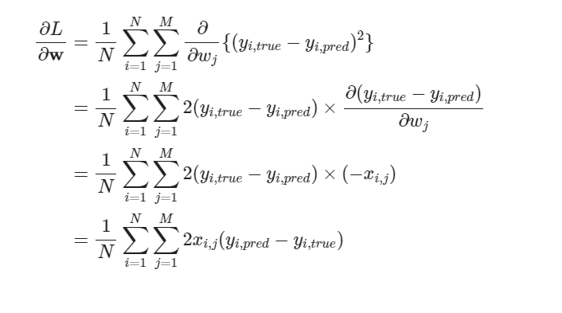
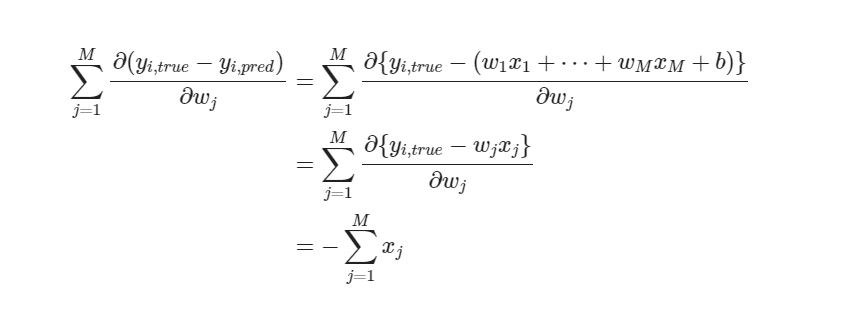

				↓ 

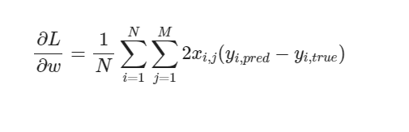

		손실함수에 대한 미분

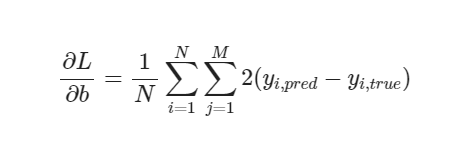

		b에 대한 미분

그대로 코드로 구현

	'''

	def gradient(X, W, b, y):
	    # N은 데이터 포인트의 개수
	    N = len(y)
    
	    # y_pred 준비
	    y_pred = model(X, W, b)
    
	    # 공식에 맞게 gradient 계산
	    dW = 1/N * 2 * X.T.dot(y_pred - y)
        
	    # b의 gradient 계산
	    db = 2 * (y_pred - y).mean()
	    return dW, db

	'''

---

## 모델 학습

---

학습률 0.0001

	'''

	import matplotlib.pyplot as plt

	LEARNING_RATE = 0.0001

	losses = []

	for i in range(1, 1001):
	    dW, db = gradient(X_train, W, b, y_train)
	    W -= LEARNING_RATE * dW
	    b -= LEARNING_RATE * db
	    L = loss(X_train, W, b, y_train)
	    losses.append(L)
	    if i % 10 == 0:
	        print('Iteration %d : Loss %0.4f' % (i, L))

	plt.plot(losses)
	plt.show()

	'''

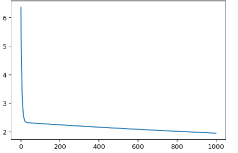

mse 값

	'''

	prediction = model(X_test, W, b)
	mse = loss(X_test, W, b, y_test)

	'''

예측

	'''

	plt.scatter(X_test[:, 0], y_test)
	plt.scatter(X_test[:, 0], prediction)
	plt.show()

	'''

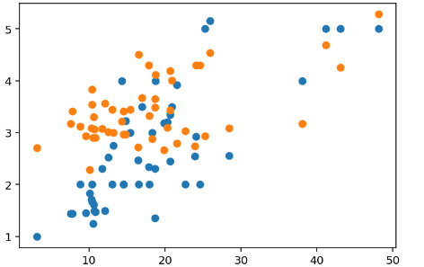

---

## 라이브러리로 깔끔하게!

---

데이터 준비

	'''

	tips = sns.load_dataset("tips")
	tips = pd.get_dummies(tips, columns=['sex', 'smoker', 'day', 'time'])
	tips = tips[['total_bill', 'size', 'sex_Male', 'sex_Female', 'smoker_Yes', 'smoker_No',
	             'day_Thur', 'day_Fri', 'day_Sat', 'day_Sun', 'time_Lunch', 'time_Dinner', 'tip']]

	X = tips[['total_bill', 'size', 'sex_Male', 'sex_Female', 'smoker_Yes', 'smoker_No',
	          'day_Thur', 'day_Fri', 'day_Sat', 'day_Sun', 'time_Lunch', 'time_Dinner']].values
	y = tips['tip'].values

	X_train, X_test, y_train, y_test = train_test_split(X, y, test_size=0.2, random_state=42)

	'''

모델 준비 / 학습

	'''

	from sklearn.linear_model import LinearRegression
	from sklearn.metrics import mean_squared_error

	model = LinearRegression()
	model.fit(X_train, y_train)

	predictions = model.predict(X_test)

	mse = mean_squared_error(y_test, predictions)

	plt.scatter(X_test[:, 0], y_test, label="true")
	plt.scatter(X_test[:, 0], predictions, label="pred")
	plt.legend()
	plt.show()

	'''

