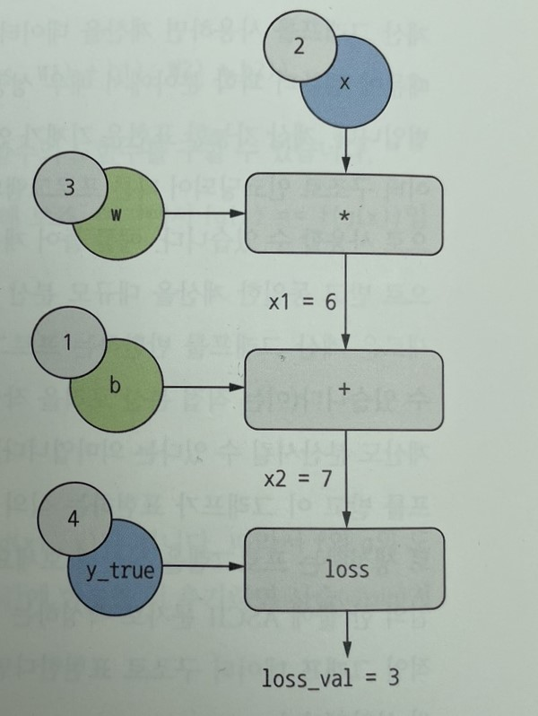
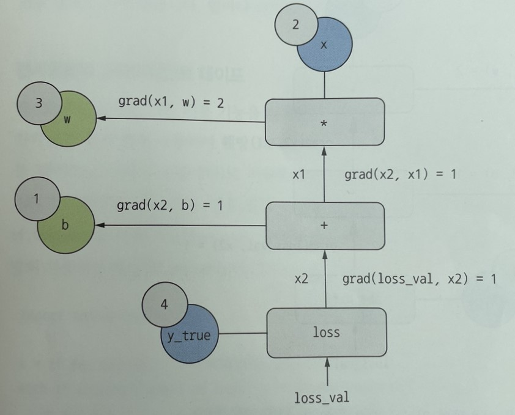
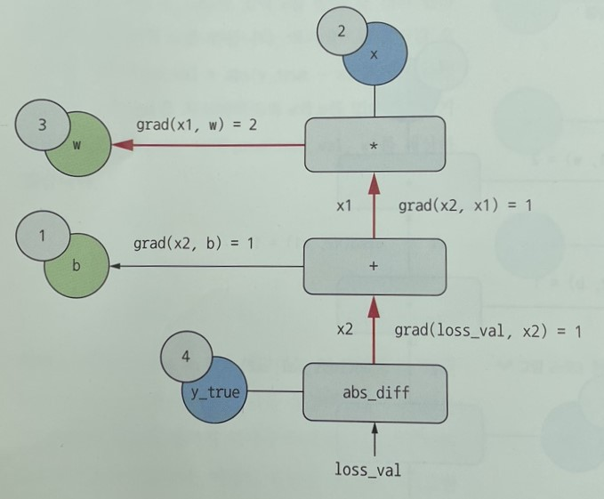

# 학습 내용
---

- 신경망과의 첫 만남
- 신경망을 위한 데이터 표현 
- 신경망의 톱니바퀴: 텐서 연산
- 신경망의 엔진: 그레이디언트 기반 최적화
- 첫 번째 예제 다시 살펴보기

---

## 신경망과의 첫 만남

---

Mnist?

	- 흑백 손글씨 숫자 이미지(28*28)를 10개의 범주(0~9)로 분류하는 것
	- 1980년대 미국 국립표준기술연구소에서 수집한 6만개의 훈련 이미지, 1만개의 테스트 이미지로 구성
	- 딥러닝계의 "Hello world"라 생각해도 됨

		MNIST 샘플 이미지

---

'''

from tensorflow.keras.datasets import mnist

(train_images,train_labels),(test_images,test_labels)=mnist.load_data()
train_images.shape
len(train_labels)

test_images.shape
len(test_labels)

'''

		- 훈련 이미지  -> (60000, 28, 28)
		- 훈련 라벨 -> 60000
		- 테스트 이미지 -> (10000, 28, 28)
		- 테스트 라벨 -> 10000

---

Mnist 모델링 순서

	- 훈련 데이터(train_images,train_labels)를 네트워크에 주입
	- 네트워트 -> 이미지와 레이블을 연관시킬 수 있도록 학습
	- test_images에 대한 예측을 네트워크에 요청
	- 이 예측이 test_labels와 맞는지 확인

	'''

	from tensorflow import keras
	from tensorflow.keras import layers

	model=keras.Sequential([
	    layers.Dense(512,activation="relu"),
	    layers.Dense(10,activation="softmax")
	])

	model.compile(optimizer="rmsprop",
	              loss="sparse_categorical_crossentropy",
	              metrics=["accuracy"])

	train_images=train_images.reshape(60000,28*28)
	train_images=train_images.astype("float32")/255
	test_images=test_images.reshape(10000,28*28)
	test_images=test_images.astype("float32")/255

	model.fit(train_images,train_labels,epochs=5,batch_size=128)

	test_digits=test_images[0:10]
	pred=model.predict(test_digits)
	print(pred)

	test_loss,test_acc=model.evaluate(test_images,test_labels)
	print(f"테스트 정확도: {test_acc}")

	'''

		- 층(layer) -> 데이터를 위한 필터 -> 주어진 문제에 더 의미 있는 표현을 입력된 데이터로부터 추출
		- 완전 연결된 신경망 층인 Dense 층 2개가 연속
		- 마지막 층 -> 10개의 확률 점수(현재 숫자 이미지가 10개의 숫자 클래스 중 하나에 속할 확률)가 들어 있는 배열(모두 더하면 1)을 반환하는 softmax 분류 층
		- 컴파일 단계에 세가지가 더 필요
			- 옵티마이저
			- 손실 함수
			- 모니터링할 지표
		- 0과 1 사이로 스케일 조정 필요 -> 이미지 데이터: [0,255] 사이의 값인 uint8의(60000,28,28) -> 0과 1 사이의 값을 가지는 float32의 (60000,28*28)
		- fit() 메서드를 통해 훈련
		- predict() 메서드를 통해 예측
		- evaluate() 메서드를 통해 정확도 확인 가능 -> 위 모델은 과적합(정확도: 97.8%)

---

## 신경망을 위한 데이터 표현

---

텐서?

	- 기본 데이터 구조
	- 데이터를 위한 컨테이너

---

### 스칼라

---

	- 하나의 숫자만 담고 있는 텐서
	- numpy에서 float32,float64 숫자를 의미
	- 랭크-0 텐서로 표현 가능

---

### 벡터

---

	- 숫자의 배열을 의미
	- 랭크-1 텐서, 1D 텐서로 표현 가능
	- 5개의 원소를 가지고 있음 -> 5차원(5D) 백터

---

### 행렬

---

	- 백터의 배열을 의미
	- 랭크-2 텐서, 2D 텐서로 표현 가능
	- 2개의 축이 존재(행,열)

---

### 랭크-3 텐서(3D 텐서)

---

	- 행렬의 배열을 의미
	- 숫자가 채워진 직육면체 형태로 해석 가능
	- 랭트-3 텐서의 배열 -> 랭크-4 텐서

---

### 텐서의 핵심 속성

---

	- 축의 개수(랭크)
		- 랭크-3 텐서 -> 3개의 축, 행렬 -> 2개의 축
		- nidm 속성에 저장되어 있음
	- 크기
		- 텐서의 각 축을 따라 얼마나 많은 차원이 있는지 나타낸 튜플
	- 데이터 타입(dtype)
		- 텐서의 포함된 데이터의 타입
		- float16,float32,float64,uint8, 텐서플로애서는 string을 사용하기도 함

---

### 넘파이로 텐서 조작

---

trina_images[i] -> 슬라이싱

슬라이싱?
		배열에 있는 특정 원소를 선택하는 것

ex)

	- train_images[10:100] -> 인덱스 0 ~ 100까지 선택
	- train_images[10:100,:,:] -> :은 전체 인덱스 선택
	- 음수 인덱스 -> 현재 에서 상대적인 위치를 나타냄
	- train_images[:,7:-7,7:-7] -> 정중앙에 위치한 14*14 이미지 선택

---

### 배치 데이터

---

데이터 텐서의 첫 번째 축 -> 샘플 축(샘플 차원)

	딥러닝 모델은 전체 데이터 셋 -> 작은 배치로 나눔

	배치 데이터의 첫 번째 축 -> 배치 축(배치 차원)

---

### 텐서의 실제 사례

---

	- 벡터 데이터
		- (samples, featurs)크기의 랭크-2 텐서
		- 각 샘플은 특성으로 구성된 벡터
	- 시계열 데이터 / 시퀀스 대이터
		- (samples, timesteps, featurs)크기의 랭크-3 텐서
		- 특성 벡터의 시퀀스
		- 길이 -> timesteps
	- 이미지
		- (samples, height, width, channels) / (samples, channels, height, width)크기의 랭크-4 텐서
		- 픽셀의 2D 격자, 각 픽셀은 수치 값(channel)의 벡터
	- 동영상
		- (samples, frames, height, width, channels) / (samples, frames, channels, height, width)크기의 랭크-5 텐서
		- 각 샘플 -> 이미지의 시퀀스
		- 길이 -> frames

---

### 벡터 데이터
---

대부분의 경우에 해당됨

	- 하나의 데이터 포인트가 벡터로 인코딩 -> (배치 데이터)랭크-2 텐서로 인코딩
	- 첫번째 축 -> 샘플축, 두번째 축 -> 특성 축

ex)

사람의 나이,성별, 소득으로 구성된 각 인구 통계 데이터. 10만 명이 포함된 전체 데이터 셋

	(100000, 3)크기의 랭크-2 텐서

---

### 시계열 데이터 / 시퀀스 데이터

---

	- 데이터에서 시간이(또는 연속된 순서가) 중요 -> 시간 축을 포함한 랭크-3 텐서로 저장
	- 각 샘플은 벡터의 시퀀스(랭크-2 텐서)로 인코딩 -> (배치 데이터)랭크-3 텐서로 인코딩
	- 시간 축 -> 항상 두 번째 축이 관례

ex)

1분마다 현재 주식 가격, 지난 1분동안에 최고 가격과 최소 가격을 저장. 

	- 하루 동안 거래 데이터 -> (390,3)의 행렬로 인코딩
		- 1분 마다 데이터는 3D 벡터로 인코딩됨
		- 하루의 거래 시간 -> 390분
	- 250일치 거래 데이터 -> (250, 390, 3)크기의 랭크-3 텐서로 저장

각 트윗 -> 128개의 알파벳으로 구성된 280개의 문자 스퀀스

	- 각 문자가 128개의 이진 백터로 인코딩 -> (280, 128)크기의 랭크-2 텐서로 인코딩
	- 100만 개의 트윗 데이터셋 -> (1000000, 280, 128)크기의 텐서에 저장

---

### 이미지 데이터

---

	- 전형적으로 높이, 너비, 컬러 채널의 3차원으로 이루어짐
	- 관례상 이미지 텐서 -> 항상 랭크-3 텐서로 저장

ex)

256*256 크기의 흑백 이미지 128개

	(128, 256, 256, 1)크기의 텐서에 저장

컬러 이미지 일땐

	(128, 256, 256, 3)크기에 텐서에 저장

지정하는 방식

	- 채널 마지막
		- (samples, height, width, channels)처럼 컬러 채널의 깊이를 끝에 배치
	- 채널 우선
		- (samples, channels, height, width)처럼 컬러 채널의 깊이를 배치 축 바로 뒤에 배치

---

### 비디오 데이터

---

	- 현실에서 랭크-5 텐서가 필요한 몇 안되는 데이터 중 하나
	- 비디오 -> 프레임의 연속 -> 각 프레임 == 하나의 컬러 이미지
	- 프레임 -> (height, width, color_depth)의 랭크-3 텐서로 저장
	- 프레임의 연속 -> (frames, height, width, color_depth)의 랭크-4 텐서로 저장
	- 여러 비디오의 배치 -> (samples, frames, height, width, color_depth)의 랭크-5 텐서로 저장

ex)

60초짜리 144*256 비디오 클립을 초당 4프레임으로 샘플링(240프레임)한 비디오 클립 4개

	(4, 240, 144, 256, 3)크기의 텐서에 저장

---

## 신경망의 톱니바퀴:텐서 연산

---

심층 신경망이 학습한 모든 변환을 수치 데이터 텐서에 적용하는 몇 종류의 텐서 연산으로 나타낼 수 있음

keras.layers.Dense(512,activation="relu")

	-> output=relu(dot(W, input)+b)

		- 입력 텐서와 텐서 W 사이의 접곰(dot)
		- 점곱으로 만들어진 행렬과 벡터 b 사이의 덧셈(+)
		- relu 연산 -> relu(x) == max(x,0)

---

### 원소별 연산

---

	- relu 함수와 덧셈 -> 원소별 연산
	- 각 원소에 독립적으로 적용

	최적화된 넘파이 내장 함수로 이런 연산들을 처리 -> BLAS 구현에 복잡한 일들을 위임함

		BLAS?

			고도로 병렬화되고 효율적인 저수준의 텐서 조작 루틴, 포트란 / C 언어로 구현되어 있음

---

### 브로드캐스팅?

---

	크기가 다른 두텐서가 더해질 경우 ->  모호하지 않고 실행 가능 하다면 작은 텐서가 큰 텐서의 크기에 맞추는것

단계

	1. 큰 텐서의 ndim에 맞도록 잗은 텐서에 축(브로드캐스팅 축)이 추가됨
	2. 작은 텐서가 새 축을 따라서 큰 텐서의 크기에 맞도록 반복됨

ex)

행렬 (32,10), 벡터(10,)이 존재 할때

	1. 벡터에 첫 번째 축(브로드캐스팅 축)을 추가 -> (1,10)
	2. 크기에 맞게 반복 -> (32,10)이 되야 하므로 31번 더 반복함

특징

	- 반복된 연산은 완전히 가상적임
	- 메모리 수준이 아니라 알고리즘 수준에서 발생함

---

### 텐서 곱셈

---

점곱(dot)으로도 표현

	- 가장 널리 사용되고 유용한 텐서 연산
	- np.dot() 메서드를 사용해 수행

두 벡터의 점곱

	스칼라가 되므로 원소 개수가 같은 벡터끼리 가능

행렬 x, 벡터 y의 점곱

	- x[1].shape == y[0].shape일때 성립
	- y와 x의 행 사이에서 점곱이 발생 -> 벡터가 반환

두 텐서중 하나라도 dim > 1 일때

	교환 법칙 X (dot(x,y) != dot(y,x))

두 행렬 간의 점 곱

	- x[1].shape == y[0].shape일때 성립
	- (x[0].shape,y[1].shape) 크기의 행렬이 됨

---

### 텐서 크기 변환

---

	- 특정 크기에 맞춰 열과 행을 재배열한다는 뜻
	- np.reshape() 메서드 사용

특별한 크기 변환

	- 전치 -> 행렬의 행과 열을 바꾸는 것 [a,b] => [b,a]
	- np.transpose() 메서드 사용

---

### 텐서 연산의 기하학적 해석

---

	A = [0.5, 1], B = [1, 0.25]일때 위와 같은 그림으로 벡터의 덧셈을 나타냄

	일반적으로 아핀 변환affine transformation 23, 회전, 스케일링scaling 등처럼 기본적인 기하학적 연산은 텐서 연산으로 표현될 수 있음

---

### 딥러닝의 기하학적 해석

---

	1. 하나는 빨간색이고 다른 하나는 파란색인 2개의 색종이가 있음
	2. 두장을 겹친 다음 뭉쳐서 작은 공을 만듦
	3. 종이공 -> 입력 데이터 / 색종이 -> 분류 문제의 데이터 클래스

		신경망이 해야 할 일 -> 공을 펼쳐서 두 클래스가 다시 깔끔하게 분리되는 변환을 찾는 것

	-> 고차원 공간에서 복잡하고 심하게 꼬여 있는 데이터의 매니폴드에 대한 깔끔한 표현을 찾는 일

		- 기초적인 연산을 길게 연결하여 복잡한 기하학적 변환을 조금씩 분해하는 방식 ≒  종이 공을 펴치기 위한 전력
                - 심층 신경망의 각 층은 데이터를 조금씩 풀어 주는 변환을 적용 -> 복잡한 분해 과정을 처리 가능

__매니폴드???__

	-> 고차원 데이터(강아지의 디테일(뽀족한 귀, 발바닥 젤리, 삐죽삐죽한 털 등등))를 저차원에서도 잘 표현 하는 공간을 의미

---

## 신경망의 엔진: 그레이디언트 기반 최적화

---

output = relu(dot(W, input)+b) -> 각 층이 입력 데이터를 변환 시키는 식

	위 식 W, b => 가중치 / 훈련되는 파라미터 (W == 커널(kernel) / b == 편향(bias))

		-> 훈련 데이터를 모델에 노출시켜서 학습된 정보가 담겨 있음

	1. 초기 -> 가중치 행렬이 작은 난수로 정의(무작위 초기화)
	2. 피드백 신호에 기초하여 -> 가중치가 점진적으로 조정

		-> 이런 점진적 조정 / 훈련이 머신 러닝의 핵심!

훈련 반복 루프

	1. 훈련 샘플 x와 이에 상응하는 타킷 y_true의 배치를 추출
	2. x를 사용해 모델을 실행(정방향 패스), 예측 y_pred를 구함
	3. y_pred와 y_true의 차이를 측정, 이 배치에 대한 모델의 손실을 계산
	4. 배치에 대한 손실이 감소되도록 모델의 모든 가중치를 업데이트

		가중치 업데이트에 경사 하강법이 사용됨

경사하강법?

	모델에 사용하는 모든 함수는 입력을 매끄럽고 연속적인 방식으로 변환(미분 가능)

---

### 도함수란?

---

f(x) = y

---

	x 값을 조금 변경 -> y 값도 조금만 변경
		
	-> 연속성의 개념

---

	-> 점 p에서 f의 도함수를 나타낸 것

		- 기울기 a가 음수일때 양수 x 만큼 조금 이동 -> f(x) 감소
		- 기울기 a가 양수일때 음수 x 만큼 조금 이동 -> f(x) 감소

			∴ a의 절대값 -> 이런 증감이 얼마나 빠르게 이러날지 알려줌
		
		모든 미분 가능한 함수 f(x)에 대해 x 값을 f의 국부적인 선형 근사인 그 지점의 기울기로 매핑하는 도함수 f'(x)가 존재함
---

함수를 미분할 수 있다는 것은 f(x)의 값을 최소화 하는 x 값을 찾는 작업인 최적화에 매우 강력한 도구

ex)
	
	f(x)값을 감소 -> x를 도함수의 방향과 반대로 조금 이동

---

### 텐서 연산의 도함수: 그레이디언트

---

그레이디언트?

	- 텐서 연산(텐서 함수)의 도함수
	- 텐서 함수가 설명하는 다차원 표면의 곡률을 나타냄 -> 입력 파라미터가 바뀔 때 함수의 출력이 어떻게 바뀌는지 결정

ex)

W를 사용해 예측 y_pred를 계산, 타킷 y_true사이의 손실 / 차이를 계산

'''

y_pred=dot(W,x)
loss_value=loss(y_pred,y_true)

'''

loss_value가 작아지도록 W를 업데이트하는 방법?
		

	W 값을 손실 값에 매핑하는 함수로 해석 가능 -> loss_value=f(W)

	1. 현재 W 값을 W0이라 가정
	2. 점 W0에서 f의 도함수 -> W와 크기가 같은 텐서 grand(loss_value,W0)
	3. 이 텐서의 각 원소 grand(loss_value,W0)[i,j] -> W0[i,j]를 수정 했을때 loss_value가 바뀌는 방향과 크기를 나타냄
	4. 텐서 grand(loss_value,W0)가 W0에서 함수 f(W)=loss_value의 그레이디언트 / W0 근처에서 W에 대한 loss_value의 그레이디언트라고 정의 가능

		∴ f(x)입장에서 그레이디언트의 반대 방향으로 W를 이동하면 loss_value(=f(x))의 값을 줄일 수 있음

---

### 확률적 경사 하강법

---

도함수가 0이 되는 지점을 모두 찾고 이중에서 어떤 포인트의 함수 값이 가장 작은지 확인 하는 것

	-> 가장 작은 손실 함수의 값을 만드는 가중치의 조합을 해석적으로 찾는 것

		-> W에 대한 식 grand(f(W),W)=0을 풀면 해결

			-> N(모델의 다중치의 개수)개의 변수로 이루어진 다항식이므로 해석적으로 해결하는 것이 어려움

				해결책!

					1. 훈련 샘플 배치 x와 이에 상응하는 타킷 y_true를 추출
					2. x로 모델을 실행하고 예측 y_pred를 구함(정방향 패스)
					3. 이 배치에서 y_pred와 y_true 사의이 오차를 측정해 모델의 손실을 계산
					4. 모델의 파라미터에 대한 손실 함수의 그레이디언트를 계산(역방향 패스)
					5. 그레이디언트의 반대 방향으로 파라미터를 조금 이동 
						- ex) W -= learning_rate*gradient -> 배치에 대한 손실이 조금 감소
						- learning_rate(학습률) -> 경사 하강법 과정의 속도를 조절하는 스칼라 값

위에서 제시한 해결책

	__미니 배치 확률적 경사 하강법(미니 배치 SGD)__

		확률적 -> 각 배치 데이터가 무작위로 선택된다는 의미

	위 그림에서 볼 수 있듯이 learning_rate 값을 적절히 고르는 것이 중요!

---

진정한 SGD

	반복마다 하나의 샘플과 하나의 타킷을 뽑는 것

---

배치 경사 하강법(배치 SDG)

	가용한 모든 데이터를 사용해 반복을 실행

---

	진정한 SDG, 배치 SDG의 효율적인 절충안 -> 적절한 크기의 미니 배치 SDG

---

위 그림은 1D 파라미터 공간에서 경사 하강법을 설명
	
	-> 실제로는 매우 고차원 공간에서 경사 하강법을 사용

	2D 손실 함수의 표면을 따라 진행하는 경사 하강법을 시각화

		-> 저차원표현으로 얻은 직관이 실전과 항상 맞지는 않다!!

---

####  옵티마이저

---

옵티마이저?

	업데이트할 다음 가중치를 계산할 때 현재 그레이디언트값만 보지 않고 이전에 업데이트된 가중치를 여러 가지 다른 방식을 고려하는 최적화 방법을 일컫음
	
	ex) 모멘텀을 사용한 SGD, Adagrad, RMSprop 등이 있음

모멘텀?

	SGD에 있는 2대의 문제점인 수렴 속도와 지역 최솟값을 해결

	어떤 파라미터 값에서는 지역 최솟값에 도달해 갇히게 될 수 있음

		-> 손실 곡선 위로 작은 공을 굴린다 생각할 때 모멘텀이 충분하면 공이 골짜기에 갇히지 않고 전역 최솟값에 도달 하게됨

			-> 모멘텀은 현재 기울기 값(현재 가속도), 현재(과거의 가속도로 인한) 속도를 함께 고려해 각 단계에서 공을 움직임

				-> 현재 그레이디언트 값뿐만 아니라 이전에 업테이트한 파라미터에 기초해 파라마터 W를 업데이트함
			
				ex)

					'''

					past_velocity = 0.
					momentum = 0.1     # 모멘텀 상수
					while loss > 0.01: # 최적화 반복 루프
					    w, loss, gradient = get_current_parameters()
					    velocity = momentum * past_velocity - learning_rate * gradient
					    w = w + momentum * velocity - learning_rate * gradient
					    past_velocity = velocity
					    update_parameter(w)

					'''

---

### 도함수 연결: 역전파 알고리즘

---

층을 가진 모델의 가중치에 대한 손실의 그레이디언트 구하는 방법?

	-> 역전파 알고리즘

		-> 간단한 연산의 도함수를 사용해 (기초적인 연산을 조합한)복잡한 연산의 그레이디언트를 쉽게 계산하는 방법

---

#### 연쇄 법칙

---

위 코드에서 정의한 모델 -> 함수로 정의

	연쇄법칙 사용

	'''

	loss_value=loss(y_true,softmax(dot(relu(dot(inputs,W1)+b2),W2)+b2))

	'''

		신경망의 그레이디언트 값을 계산하는 데 연쇄 법칙을 적용하는 것 -> 역전파 알고리즘

---

#### 계산 그래프를 활용한 자동 미분

---

	정방향 패스 실행

        역방향 패스 실행

	역방향 패스에서 loss_val부터 w까지의 경로

		- grad(loss_val,w)= 1*1*2=2
		- grad(loss_val,b)= 1*1=1

			방금  수행한 것 -> 역전파 알고리즘!

	텐서플로와 같이 자동 미분이 가능한 최신 프레임워크를 사용해 신경망을 구현

---

#### 텐서플로의 그레이디언트 테이프

---

GradientTape?

	자동 미분 기능을 활용할 수 있는 API

	''''

	import tensorflow as tf

	x=tf.Variable(0.) -------- 초깃값 0으로 스칼라 변수를 생성
	with tf.GradientTape() as tape: -------- GradientTape 블록을 시작
	    y=2*x+3 -------- 이 블록 안에서 변수에 텐서 연산을 적용
	grad_of_y_wrt_x=tape.gradient(y,x) -------- tape를 사용해서 변수 x에 대한 출력 y의 그레이디언트를 계산

	'''

---

## 첫 번째 예제 다시 살펴보기

---

