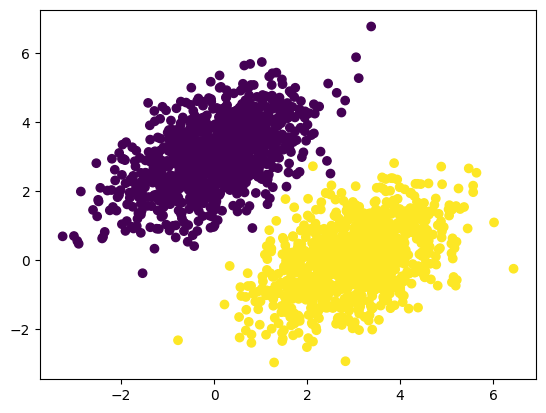

# 학습내용

---

- 텐서플로 시작하기
- 신경망의 구조: 핵심 Keras API 이해하기

---

## 텐서플로 시작하기

---

	- 저수준(텐서플로 API)
		- 텐서
		- 텐서 연산
		- 역전파
	- 고수준(케라스 API)
		- 모델을 구성하는 층
		- 손실 함수
		- 옵티마이저
		- 측정 지표
		- 훈련 루프

---

### 상수 텐서와 변수

---

텐서 만드는 방법?

    - 모두 1인 텐서 → tf.ones() 메서드 사용
    - 모두 0인 텐서 → tf.zeros() 메서드 사용
    - 랜덤 값인 텐서 → tf.random.normal() 메서드 사용(인자로 평균, 표준편차 값을 정할 수 있음)

텐서에  값 할당하는 방법?
    - 텐서는 값을 할당 못함
    - 그러므로 텐서플로우 변수로 선언
    - v=tf.Variable(initial_value=tf.random.normal(shape=(3,1))) → Variable() 메서드 사용
    - v.assign(),v.assign_add(),assign_sub() 메서드를 통해 변수 원소를 변경 가능

---

	텐서는 연산이 모두 바로 실행 → 즉시 실행 모드라 부름

---

### GradientTape API

---

사용법

	1. GradientTape 블록을 시작
	2. 하나 또는 여러 입력 텐서에 대해 계산을 수행
	3. 입력에 대해 결과 그레이디언트를 구함

	'''

	input_var=tf.Variable(initial_value=3)
	with tf.GradientTape() as tape:
	  result=tf.square(input_var)
	gradient=tape.gradient(result,input_var)

	'''

---

tape.gradient()의 입력 텐서

	변수뿐만 아니라 어떤 텐서라도 가능

		-> 텐서플로는 기본적으로 훈련 가능한 변수만 추적

상수 텐서의 경우

	-> tape.watch() 매서드를 호출해 추적한다는것을 수동으로 알려 줘어야 함

	'''

	input_const=tf.constant(3.)
	with tf.GradientTape() as tape:
	  tapr.watch(input_const)
	  result=tf.square(input_const)
	gradient=tape.gradient(result,input_const)

	'''

---

이계도 그레이디언트?

	그레이디언트의 그레이디언트

	ex)

		시간에 대한 물체의 그레이디언트 -> 물체의 속도, 이계도 그레이디언트 -> 가속도

		'''

		time=tf.Variable(0.)
		with tf.GradientTape() as outer_tape:
		  with tf.GradientTape() as inner_tape:
		    position=4.9*time**2
		  speed=inner_tape.gradient(position,time)
		acceleration=outer_tape.gradient(speed,time)

		'''

---

엔드-투-엔드 예제: 텐서플로 선형 분류기

	순서

	1. 두 클래스의 랜덤한 포인트 생성하기 → 좌표평면의 점들을 생성
	2. 두 클래스를 한 배열로 쌓기 → np.vstack()을 이용해 한 배열로 쌓기
	3. 타깃 생성 → 1,2번 과정과 동일하게 타킷 생성
	4. 그래프로 시각화 → matplotlib를 이용해 시각화
	5. 선형 분류기의 변수 생성 → input_dim / output_dim 값 설정후 그 값을 토대로 W(가중치), b(바이어스) 변수 생성
	6. 정방향 패스 함수 정의 → tf.matmul() 메서드를 통해 각층의 입력데이터의 변환을 계산
	7. 평균 제곱 오파 손실 함수 정의 → mse 구하는 공식
	8. 훈련 스텝 함수 정의 → GradientTape를 통해 가중치에 대한 손실의 그레디언트를 구하고 가중치 업데이트
	9. 배치 훈련 루프 → 훈련
	10. 예측

	'''

	# 1
	num_samples_per_class=1000
	negative_samples=np.random.multivariate_normal(
	    mean=[0,3],
	    cov=[[1,0.5],[0.5,1]],
	    size=num_samples_per_class)
	positive_samples=np.random.multivariate_normal(
	    mean=[3,0],
	    cov=[[1,0.5],[0.5,1]],
	    size=num_samples_per_class)

	# 2
	inputs=np.vstack((negative_samples,positive_samples)).astype(np.float32)

	# 3
	targets=np.vstack((np.zeros((num_samples_per_class,1), dtype= "float32"),
	                  np.ones((num_samples_per_class,1), dtype= "float32")))

	# 4
	import matplotlib.pyplot as plt
	
	plt.scatter(inputs[:,0],inputs[:,1],c=targets[:,0])
	plt.show()

	# 5
	input_dim=2
	output_dim=1
	W=tf.Variable(initial_value=tf.random.uniform(shape=(input_dim,output_dim)))
	b=tf.Variable(initial_value=tf.zeros(shape=(output_dim)))

	# 6
	def model(inputs):
	  return tf.matmul(inputs,W)+b

	# 7
	def square_loss(targets,predictions):
	  per_sample_losses=tf.square(targets-predictions)
	  return tf.reduce_mean(per_sample_losses)

	# 8
	learning_rate=0.1

	def training_step(inputs,targets):
	  with tf.GradientTape() as tape:
	    predictions=model(inputs)
	    loss=square_loss(targets,predictions)
	  grad_loss_wrt_W, grad_loss_wrt_b=tape.gradient(loss,[W,b])
	  W.assign_sub(grad_loss_wrt_W*learning_rate)
	  b.assign_sub(grad_loss_wrt_b*learning_rate)
	  return loss

	# 9
	for step in range(40):
	  loss=training_step(inputs,targets)
	  print(f"{step}번째 스텝의 손실: {loss:.4f}")

	# 10
	predictions=model(inputs)
	plt.scatter(inputs[:,0],inputs[:,1],c=predictions[:,0]>0.5)
	plt.show()

	'''

	랜덤 포인트 시각화

훈련 과정의 손실

	'''

	0번째 스텝의 손실: 3.6422
	1번째 스텝의 손실: 0.4880
	2번째 스텝의 손실: 0.1784
	3번째 스텝의 손실: 0.1311
	4번째 스텝의 손실: 0.1176
	5번째 스텝의 손실: 0.1090
	6번째 스텝의 손실: 0.1016
	7번째 스텝의 손실: 0.0949
	8번째 스텝의 손실: 0.0888
	9번째 스텝의 손실: 0.0832
	10번째 스텝의 손실: 0.0781
	11번째 스텝의 손실: 0.0735
	12번째 스텝의 손실: 0.0692
	13번째 스텝의 손실: 0.0654
	14번째 스텝의 손실: 0.0619
	15번째 스텝의 손실: 0.0586
	16번째 스텝의 손실: 0.0557
	17번째 스텝의 손실: 0.0530
	18번째 스텝의 손실: 0.0506
	19번째 스텝의 손실: 0.0483
	20번째 스텝의 손실: 0.0463
	21번째 스텝의 손실: 0.0444
	22번째 스텝의 손실: 0.0427
	23번째 스텝의 손실: 0.0412
	24번째 스텝의 손실: 0.0398
	25번째 스텝의 손실: 0.0385
	26번째 스텝의 손실: 0.0373
	27번째 스텝의 손실: 0.0362
	28번째 스텝의 손실: 0.0352
	29번째 스텝의 손실: 0.0343
	30번째 스텝의 손실: 0.0335
	31번째 스텝의 손실: 0.0328
	32번째 스텝의 손실: 0.0321
	33번째 스텝의 손실: 0.0315
	34번째 스텝의 손실: 0.0309
	35번째 스텝의 손실: 0.0304
	36번째 스텝의 손실: 0.0299
	37번째 스텝의 손실: 0.0295
	38번째 스텝의 손실: 0.0291
	39번째 스텝의 손실: 0.0287

	'''

	
	예측 시각화

---

## 신경망의 구조: 핵심 Keras API 이해하기

---

### 층: 딥러닝의 구성 요소

---

층?

	하나 이상의 텐서를 입력으로 받고 하나 이상의 텐서를 출력하는 데이터 처리 모듈

---

	대부분 가중치라는 층의 상태를 가짐

가중치?

	확률적 경사 하강법으로 학습되는 하나 이상의 텐서 -> 신경망이 학습한 지식이 담겨 있음

---

층의 종류

	밀집 연결 층, 완전 연결층(밀집 층), 순환 층, 합성곱 층이 존재

---

Layer?

	상태(가중치)와 연산(정방향 패스)을 캡슐화한 객체

---

자동 크기 추론

	앞선 층의 크기에 맞도록 동적으로 만들어짐

---

### 층에서 모델로

---

딥러닝 모델?

	층으로 구성된 그래

종류

	- Sequential
	- 2개의 가지를 가진 네트워크
	- 멀티헤드 네트워크
	- 잔차 연결

---

모델의 구조

	가설 공간을 정의

		-> 가능성 있는 공간안에서 피드백 신호의 도움을 받아 입력 데이터의 유용한 표현을 찾는것

---

### 컴파일 단계: 학습 과정 설정

---

	- 손실 함수
	- 옵티마이저
	- 측정 지표

보통 매개변수 값을 문자열로 지정

	인스턴스 객체로 지정 가능 -> ex) optimizer=keras.optimizers.RMSprop()

사용할 객체를 상세히 성절 가능

	ex) optimizer=keras.optimizers.RMSprop(learning_rate=1e-4)

---

### 손실 함수 선택하기

---

이진 분류 문제

	이진 크로스엔트로피(binary crossentropy)

다중 분류 문제

	범주형 크로스엔트로피(categorical crossentropy)

---

### fit() 메서드 이해하기

---

fit() 메서드?

	훈련 루프 구현

주요 매개변수

	- 훈련할 데이터
	- 훈련할 에포크 횟수
	- 미니 배치 경사 하강법의 각 에포크에서 사용할 배치 크기

메서드 호출

	'''

	history=model.fit(
	    inputs,
	    targets,
	    epochs=5,
	    batch_size=128
	)

	'''

	history 객체 반환

		-> loss / 특정 측정 지표 이름의 키와 각 에포크 값의 리스트 매핑

---

### 검증 데이터에서 손실과 측정 지표 모니터링 하기

---

검증 데이터?

	새로운 데이터에 모델이 어떻게 동작하는지 예상하기 위해 훈련 데이터의 일부를 떼어 놓은 것

사용법

	fit() 메서드의 validation_data 매개변수 사용

	'''

	model=keras.Sequential([keras.layers.Dense(1)])
	model.compile(optimizer=keras.optimizers.RMSprop(learning_rate=0.1),
	              loss=keras.losses.MeanSquaredError(),
	              metrics=[keras.metrics.BinaryAccuracy()])

	indices_permutaion=np.random.permutation(len(inputs))
	shuffled_inputs=inputs[indices_permutaion]
	shuffled_targets=targets[indices_permutaion]

	num_validation_samples=int(0.3*len(inputs))
	val_inputs=shuffled_inputs[:num_validation_samples]
	val_targets=shuffled_targets[:num_validation_samples]
	training_inputs=shuffled_inputs[num_validation_samples:]
	training_targets=shuffled_targets[num_validation_samples:]

	model.fit(training_inputs,
	          training_targets,
	          epochs=5,
	          batch_size=16,
	          validation_data=(val_inputs,val_targets))

	'''

---

	훈련데이터와 검증 데이터를 엄격하게 분리하는 것이 필수!!

---

### 추론: 훈련한 모델 사용하기

---

추론?

	새로운 데이터에서 예측을 만드는 것

사용법

	predict() 메서드 사용

	'''

	predictions=model.predict(val_inputs,batch_size=128)
	print(predictions[:10])

	'''

		각 입력 샘플에 대한 모델의 예측을 나타내는 스칼라 점수를 얻음

