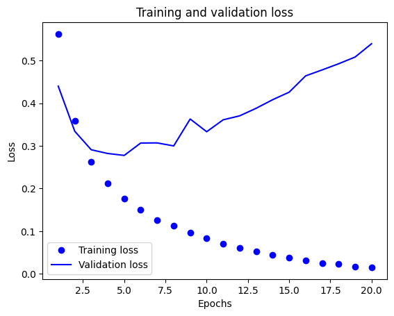
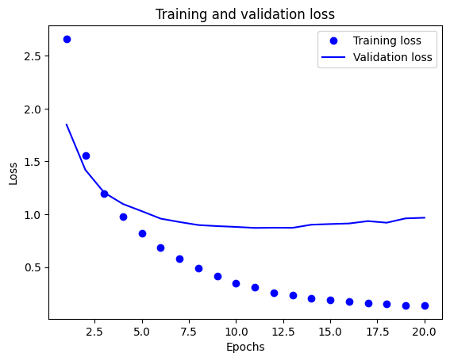
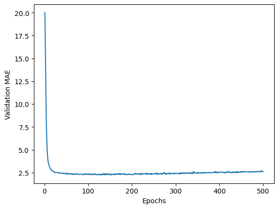

# 학습 내용

---

- 이진 분류 문제
- 다중 분류 문제
- 회귀 문제

---

분류와 회귀에서 사용하는 용어

	- 샘플 / 입력 -> 모델에 주입될 하나의 데이터 포인트
	- 예측 / 출력 -> 모델로부터 나온 값
	- 타킷 -> 정답, 예측해야 하는 값
	- 예측 오차 / 손실 값 -> 모델의 예측과 타깃 사이의 거리를 측정한 값
	- 클래스 -> 분류 문제에서 선택할 수있는 레이블의 집합
	- 레이블 -> 분류 문제에서 클래스 할당의 구체적인 사례
	- 참 값 / 애너테이션 -> 데이터셋에 대한 모든 타깃
	- 이진 분류 -> 각 입력 샘플이 2개의 베타적인 범주로 구분되는 분류 작업
	- 다중 분류 -> 각 입력 샘플이 2개 이상의 범주로 구분되는 분류 작업
	- 다중 래이블 분류 -> 각 입력 샘플이 여러개의 레이블에 할당될 수 있는 분류 작업
	- 스칼라 회귀 -> 타킷이 연속적인 스칼라 값을 예측하는 작업
	- 벡터 회귀 -> 타킷이 연속적인 값의 집합을 예측하는 작업
	- 미니 배치 / 배치 -> 모델에 의해 동시에 처리되는 소량의 샘플 묶음

---

## 이진 분류 문제

---

### IMDB 데이터 셋

---

	인터넷 영화 데이터베이스로부터 가져온 양극단의 리뷰 5만개로 이루어져 있음

		- 케라스에 포함되어 있음
		- 전처리되어 있어 각 리뷰 -> 숫자 시퀀스로 변환되어 있음
		
	'''

	from tensorflow.keras.datasets import imdb

	(train_data, train_labels), (test_data,test_labels)=imdb.load_data(num_words=10000)
	
	print(train_labels[0])
	print(max([max(sequence)for sequence in train_data]))

	'''

		- train_label, test_label -> 부정을 나타내는 0 / 긍정을 나타내는 1의 리스트
		- 가장 자주 등장하는 단어 1만 개로 제한

---

### 데이터 준비

---

리스트를 텐서로 바꾸는 두가지 방법

	- 같은 길이가 되도록 리스트에 패딩을 추가 (samples,max_length) 크기의 정수 텐서로 변환
	- 리스트를 멀티-핫-인코딩하여 0과 1의 벡터로 변환
		- [8,5] -> 인덱스 8과 5 위치는 1, 그외는 0

---

멀티-핫-인코딩 사용

	'''

	import numpy as np

	def vectorize_sequences(sequences,dimension=10000):
	  results=np.zeros((len(sequences),dimension))
	  for i ,sequence in enumerate(sequences):
	    for j in sequence:
	      results[i,j]=1.
	  return results

	x_train=vectorize_sequences(train_data)
	x_test=vectorize_sequences(test_data)

	# 레이블 -> 벡터화
	y_train=np.asarray(train_labels).astype("float32")
	y_test=np.asarray(test_labels).astype("float32")

	'''

---

### 신경망 모델 만들기

---

	'''

	from tensorflow import keras
	from tensorflow.keras import layers
	
	model=keras.Sequential([
	    layers.Dense(16, activation="relu"),
	    layers.Dense(16, activation="relu"),
	    layers.Dense(1, activation="sigmoid")
	])

	'''

		- Dense layer -> input=relu(dot(W,input)+b)
		- 16개의 유닛 -> 가중치 행렬 W의 크기가 (input_dimension, 16)
		- 입력 데이터와 W를 점곱 -> 입력 데이터가 16차원으로 표현된 공간으로 투영
		- 유닛을 늘리면 -> 더 복잡한 표현을 학습 가능 / 계산 비용 증가, 원하지 않는 패턴 학습 가능

	음수 -> 0 으로 만드는 함수

		활성화 함수가 필요한 이유?

			선형 변환(아핀 변환)만 학습 가능 

				-> 가설 공간을 풍부하게 만들어 층을 깊게 만드는 장점을 살리기 위함

	임의 값을 0 ~ 1 사이로 압축

	'''

	model.compile(optimizer="rmsprop",
	              loss="binary_crossentropy",
	              metrics=["accuracy"])

	'''

		손실 함수와 옵티마이저 선택

			이진분류 -> binary_crossentropy 손실이 적합

				확률을 출력하는 모델을 사용할때 크로스엔트로피가 최선의 선택

					-> 크로스엔티로피?

						정보 이론 분야에서 온 개념으로 확률 분포 간의 차이를 측정(원본 분포와 예측 분포 사이를 측정)

			옵티마이저 -> rmsprop 

				-> 일반적으로 거의 모든 문제에 기본 선택

---

### 훈련 검증

---

	'''

	x_val=x_train[:10000]
	partial_x_train=x_train[10000:]

	y_val=train_labels[:10000]
	partial_y_train=train_labels[10000:]

	history=model.fit(partial_x_train,
	                  partial_y_train,
	                  epochs=20,
	                  batch_size=512,
	                  validation_data=(x_val,y_val))

	import matplotlib.pyplot as plt
	
	history_dict=history.history
	loss_values=history_dict["loss"]
	val_loss_values=history_dict["val_loss"]
	epochs=range(1,len(loss_values)+1)
	plt.plot(epochs,loss_values,"bo",label="Training loss")
	plt.plot(epochs,val_loss_values,"b",label="Validation loss")
	plt.title("Training and validation loss")
	plt.xlabel("Epochs")
	plt.ylabel("Loss")
	plt.legend()
	plt.show()

	'''

	훈련과 검증 손실

	'''

	plt.clf()
	acc=history_dict["accuracy"]
	val_acc=history_dict["val_accuracy"]
	plt.plot(epochs,acc,"bo",label="Training acc")
	plt.plot(epochs,val_acc,"b",label="Validation acc")
	plt.title("Training and validation accuracy")
	plt.xlabel("Epochs")
	plt.ylabel("Accuracy")
	plt.legend()
	plt.show()

	'''

	훈련과 검증 정확도

---

	네번째 에포크에서 그래프가 역전 -> 과대적합(과적합)

---

	'''

	model=keras.Sequential([
	    layers.Dense(16, activation="relu"),
	    layers.Dense(16, activation="relu"),
	    layers.Dense(1, activation="sigmoid")
	])
	model.compile(optimizer="rmsprop",
	              loss="binary_crossentropy",
	              metrics=["accuracy"])
	model.fit(x_train,train_labels,epochs=4,batch_size=512)
	results=model.evaluate(x_test,test_labels)
	results

	'''

		에포크 4번으로 변경 -> 88%의 정확도

---

### 새로운 데이터에 대해 예측하기

---

	'''

	model.predict(x_test)

	'''

	결과
	
		array([[0.20626965],
		       [0.9992903 ],
		       [0.8893139 ],
		       ...,
		       [0.11796745],
		       [0.06832196],
		       [0.58850294]], dtype=float32)

---

## 다중 분류 문제

---

46개의 상호 베타적인 토픽을 분류하는 다중 분류(단일 레이블 다중 분류)

---

### 로이터 데이터셋

---

	1986년 로이터에서 공개한 짧은 뉴스 기사와 토픽의 집합

	'''

	from tensorflow.keras.datasets import reuters
	(train_data,train_labels),(test_data,test_labels)=reuters.load_data(num_words=10000)

	print(train_labels[10])

	'''

		데이터에서 가장 자주 등장하는 단어 1만 개로 제한

		레이블 -> 0 ~ 45 사이의 정수

---

### 데이터 준비

---

	'''

	x_train=vectorize_sequences(train_data)
	x_test=vectorize_sequences(test_data)

	from tensorflow.keras.utils import to_categorical

	y_train=to_categorical(train_labels)
	y_test=to_categorical(test_labels)

	'''

		원-핫-인코딩 사용

---

### 모델 구성

---

	'''

	model=keras.Sequential([
	    layers.Dense(64,activation="relu"),
	    layers.Dense(64,activation="relu"),
	    layers.Dense(46,activation="softmax")
	])

	model.compile(optimizer="rmsprop",
	              loss="categorical_crossentropy",
	              metrics=["accuracy"])

	'''

		최선의 손실 함수 -> categorical_crossentropy(두 확률 분포 사이의 거리를 측정)

---

### 훈련 검증

---

	'''

	x_val=x_train[:1000]
	partial_x_train=x_train[1000:]

	y_val=y_train[:1000]
	partial_y_train=y_train[1000:]

	history=model.fit(partial_x_train,
	                  partial_y_train,
	                  epochs=20,
	                  batch_size=512,
	                  validation_data=(x_val,y_val))

	loss=history.history["loss"]
	val_loss=history.history["val_loss"]
	epochs=range(1,len(loss)+1)
	plt.plot(epochs,loss,"bo",label="Training loss")
	plt.plot(epochs,val_loss,"b",label="Validation loss")
	plt.title("Training and validation loss")
	plt.xlabel("Epochs")
	plt.ylabel("Loss")
	plt.legend()
	plt.show()

	'''

		훈련과 검증 손실
	
	'''

	plt.clf()
	acc=history_dict["accuracy"]
	val_acc=history_dict["val_accuracy"]
	plt.plot(epochs,acc,"bo",label="Training acc")
	plt.plot(epochs,val_acc,"b",label="Validation acc")
	plt.title("Training and validation accuracy")
	plt.xlabel("Epochs")
	plt.ylabel("Accuracy")
	plt.legend()
	plt.show()

	'''

	훈련과 검증 정확도

		-> 9번째 에포크 이후 과대적합

---

	'''

	model=keras.Sequential([
	    layers.Dense(64,activation="relu"),
	    layers.Dense(64,activation="relu"),
	    layers.Dense(46,activation="softmax")
	])

	model.compile(optimizer="rmsprop",
	              loss="categorical_crossentropy",
	              metrics=["accuracy"])

	model.fit(partial_x_train,
	        partial_y_train,
	        epochs=9,
	        batch_size=512,
	        validation_data=(x_val,y_val))

	results=model.evaluate(x_test,y_test)
	results

	'''

		에포크를 9로 변경 -> 80% 정확도

---

	'''

	import copy

	test_labels_copy=copy.copy(test_labels)
	np.random.shuffle(test_labels_copy)
	hits_array=np.array(test_labels)==np.array(test_labels_copy)
	hits_array.mean()

	'''

		랜덤한 분류기 정확도 -> 19%

---

### 새로운 데이터에 대해 예측하기

---

	'''

	predictions=model.predict(x_test)
	np.argmax(predictions[0])

	'''

	결과: 3

---

### 레이블과 손실을 다루는 다른 방법

---

정수 인코딩

	'''

	y_train=np.array(train_labels)
	y_test=np.array(test_labels)

	model.compile(optimizer="rmsprop",
	              loss="sparse_categorical_crossentropy",
	              metrics=["accuracy"])

	'''

		정수 레이블 -> sparse_categorical_crossentropy(categorical_crossentropy와 수학적으론 동일)

---

### 충분히 큰 중간층을 두어야 하는 이유

	'''

	model=keras.Sequential([
	    layers.Dense(64,activation="relu"),
	    layers.Dense(4,activation="relu"),
	    layers.Dense(46,activation="softmax")
	])

	model.compile(optimizer="rmsprop",
	              loss="categorical_crossentropy",
	              metrics=["accuracy"])

	model.fit(partial_x_train,
	        partial_y_train,
	        epochs=9,
	        batch_size=512,
	        validation_data=(x_val,y_val))

	'''

		- 중간층의 유닛이 46개 보다 많이 적음 -> 정보의 병목 현상이 일어남
		- 검증 정확도가 71%로 8% 정도 감소

---

## 회귀 문제

---

개별적인 레이블 대신 연속적인 값을 예측하는 

						회귀!!

---

### 보스턴 주택 가격 데이터셋

---

	1970년 중반 보스턴 외각의 범죄율, 지방세율 등의 데이터가 주어졌을때 주택 가격의 중간 값을 예측

	'''

	from tensorflow.keras.datasets import boston_housing
	(train_data,train_targets),(test_data,test_targets)=boston_housing.load_data()

	'''
	
---

### 데이터 준비

---

상이한 스케일 -> 특성별로 정규화

	평균이 0, 표준편차가 1로 정규화

	'''

	mean=train_data.mean(axis=0)
	train_data-=mean
	std=train_data.std(axis=0)
	train_data/=std
	test_data-=mean
	test_data/=std

	'''

---

### 모델 구성

---

	'''

	def build_model():
	  model=keras.Sequential([
	      layers.Dense(64,activation="relu"),
	      layers.Dense(64,activation="relu"),
	      layers.Dense(1)
	  ])
	  model.compile(optimizer="rmsprop",loss="mse",metrics=["mae"])
	  return model

	'''

		- 마지막 층은 유닛만 존재, 활성화 함수 x -> 전형적인 스칼라 회귀 구성
		- 손실 함수: mse(평균 제곱 오차) -> 예측과 타깃 사이 거리의 제곱
		- 모니터링을 위한 지표: mae(평균 절대 오차) -> 예측과 타킷 사이 거리의 절댓값

---

### k-겹 검증을 사용한 훈련 검증

---

데이터 수가 많지 않음 -> k-겹 교차 검증 사용

k-겹 교차 검증?

	데이터를 k개로 분할로 나누고, k개의 모델을 각각 만들어 k-1개의 분할에서 훈련하고 나머지 분할에서 평가하는 방법

		모델 검증 점수 -> k개의 검증 점수의 평균

	'''

	k=4
	num_val_samples=len(train_data)//k
	num_epochs=100
	all_scores=[]
	for i in range(k):
	  print(f"#{i}번째 폴드 처리중")
	  val_data=train_data[i*num_val_samples:(i+1)*num_val_samples]
	  val_targets=train_targets[i*num_val_samples:(i+1)*num_val_samples]
	  partial_train_data=np.concatenate(
	      [train_data[:i*num_val_samples],
	       train_data[(i+1)*num_val_samples:]],
	       axis=0)
	  partial_train_targets=np.concatenate(
	      [train_targets[:i*num_val_samples],
	       train_targets[(i+1)*num_val_samples:]],
	       axis=0)
	  model=build_model()
	  model.fit(partial_train_data,partial_train_targets,
	            epochs=num_epochs,batch_size=16,verbose=0)
	  val_mse,val_mae=model.evaluate(val_data,val_targets,verbose=0)
	  all_scores.append(val_mae)

	np.mean(all_scores)

	'''

	에포크 100일때 결과
		
		2.2803761065006256

---

에포크 500으로 변경

	에포크별 검증 mae

	처음 10개 데이터를 제외한 에포크별 검증 mae

		mae가 120~140 에포크 이후 줄어드는것이 멈춤

---

	'''

	model=build_model()
	model.fit(train_data,train_targets,
	          epochs=130,batch_size=16,verbose=0)
	test_mse_score,test_mae_score=model.evaluate(test_data,test_targets)
	test_mae_score

	'''

		에포크 130으로 훈련 -> 2.194587469100952(2190달러 정도 차이)

---

### 새로운 데이터에 대해 예측하기

---

	'''

	predictions=model.predict(test_data)
	predictions[0]

	'''

	결과:

		array([7.7055483], dtype=float32) -> 첫번째 주택의 가격은 약 7천달러

