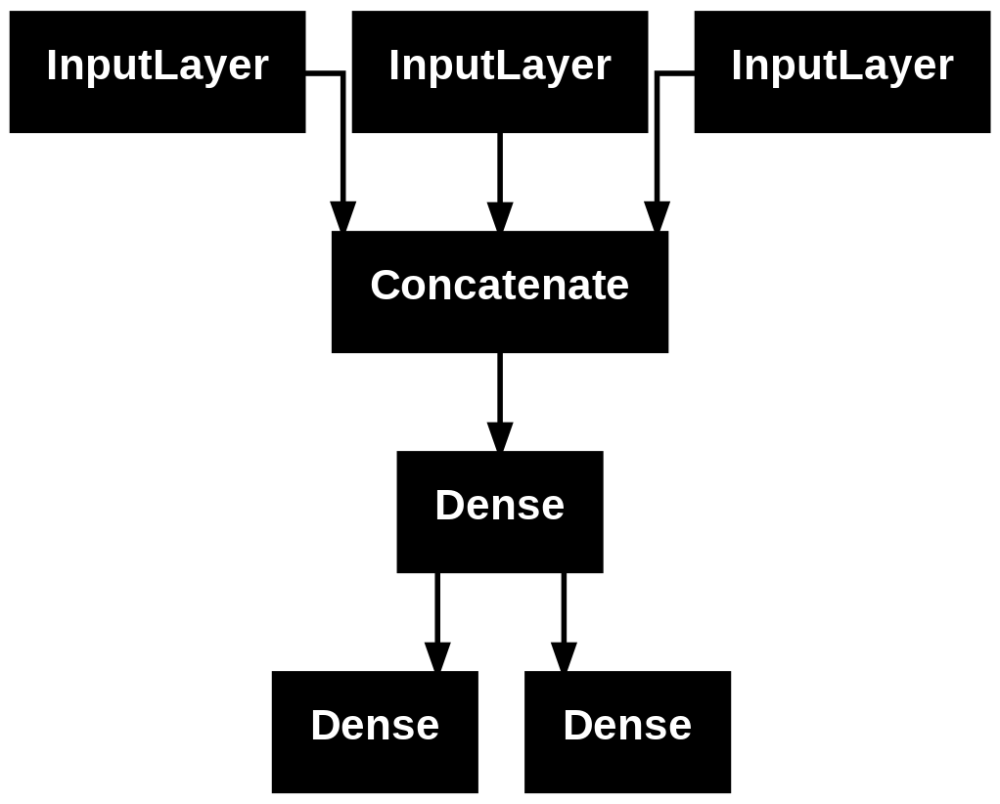
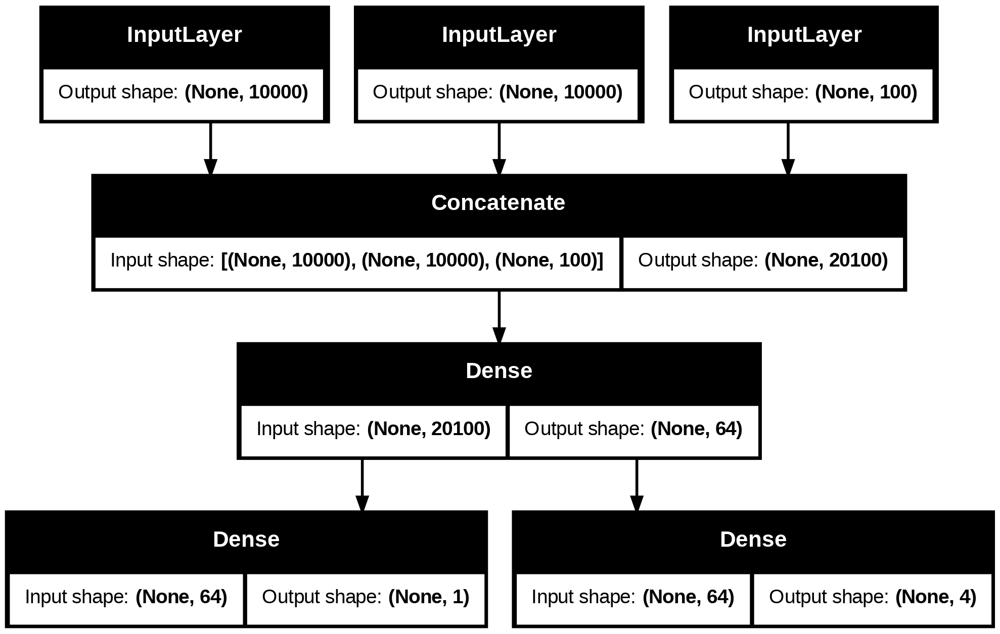

# 학습 내용

---

- 다양한 워크폴로
- 케라스 모델을 만드는 여러 방법
- 내장된 훈련 루프와 평가 루프 사용
- 사용자 정의 훈련, 평가 루프 만들기

---

## 다양한 워크플로

---

케라스 API 설계

	복잡성의 단계적 공개 원칙을 따름

		-> 시작은 쉽게 하고, 필요할 때 단계마다 점진적으로 학습하여 아주 복잡한 경우를 처리할 수 있음

케라스를 사용하는 방법 

	여러가지 존재

	API를 기반으로 하는 워크플로의 구성 요소를 다른 워크플로에서 사용 가능

		-> 워크플로 간에 서로 호출 가능

---

## 케라스 모델을 만드는 여러 방법

---

모델을 만드는 API 세가지

- Sequential 모델

	가장 시작하기 쉬운 API -> 단순히 층을 쌓을 수만 있음

- 함수형 API 

	그래프 같은 모델 구조를 따름

	사용성과 유연성 사이의 적절한 중간 지점에 해당

		∴ 가장 널리 사용되는 모델 구축 API

- Model 서브클래싱

	모든 것을 밑바닥부터 직접 만들 수 있는 저수준 방법

	모든 상세한 내용을 완전히 제어하고 싶른 경우에 적합

		-> 여러 가지 케라스 내장 기능을 사용하지 못하기 때문에 실수가 발생할 위험이 많음

---

### Sequentail 모델

---

	'''

	from tensorflow import keras
	from tensorflow.keras import layers

	model=keras.Sequential([
	    layers.Dense(64,activation="relu"),
	    layers.Dense(10,activation="softmax")
	])

	'''

동일한 모델을 add() 메서드를 통해 점진적으로 만들 수 있음

	'''

	model=keras.Sequential()
	model.add(layers.Dense(64,activation="relu"))
	model.add(layers.Dense(10,activation="softmax"))

	'''

		층은 처음 호출될 때 만들어진다(가중치를 만듦)

			-> 입력 크기를 알기 전까지 가중치를 만들 수 없음

	'''

	model.weights

	'''

	결과: []

	'''

	model.build(input_shape=(None,3))
	model.weights

	'''

	결과: 

	'''

	[<KerasVariable shape=(3, 64), dtype=float32, path=sequential_1/dense_2/kernel>,
	 <KerasVariable shape=(64,), dtype=float32, path=sequential_1/dense_2/bias>,
	 <KerasVariable shape=(64, 10), dtype=float32, path=sequential_1/dense_3/kernel>,
	 <KerasVariable shape=(10,), dtype=float32, path=sequential_1/dense_3/bias>]

	'''

		-> input_shape=(None,3) 여기서 None은 어떤 배치 크기도 가능하다는 의미

	'''
	
	model.summary()

	'''

	결과:

	'''

	Model: "sequential_1"
	┏━━━━━━━━━━━━━━━━━━━━━━━━━━━━━━━━━━━━━━┳━━━━━━━━━━━━━━━━━━━━━━━━━━━━━┳━━━━━━━━━━━━━━━━━┓
	┃ Layer (type)                         ┃ Output Shape                ┃         Param # ┃
	┡━━━━━━━━━━━━━━━━━━━━━━━━━━━━━━━━━━━━━━╇━━━━━━━━━━━━━━━━━━━━━━━━━━━━━╇━━━━━━━━━━━━━━━━━┩
	│ dense_2 (Dense)                      │ (None, 64)                  │             256 │
	├──────────────────────────────────────┼─────────────────────────────┼─────────────────┤
	│ dense_3 (Dense)                      │ (None, 10)                  │             650 │
	└──────────────────────────────────────┴─────────────────────────────┴─────────────────┘
	 Total params: 906 (3.54 KB)
	 Trainable params: 906 (3.54 KB)
	 Non-trainable params: 0 (0.00 B)

	'''

		-> 케라스에서 모델과 층을 포함해서 모든 것에 이름을 지정 가능

	'''

	model=keras.Sequential(name="my_example_model")
	model.add(layers.Dense(64,activation="relu",name="my_first_layer"))
	model.add(layers.Dense(10,activation="softmax",name="my_last_layer"))
	model.build((None,3))
	model.summary()

	'''

	결과:

	'''

	Model: "my_example_model"
	┏━━━━━━━━━━━━━━━━━━━━━━━━━━━━━━━━━━━━━━┳━━━━━━━━━━━━━━━━━━━━━━━━━━━━━┳━━━━━━━━━━━━━━━━━┓
	┃ Layer (type)                         ┃ Output Shape                ┃         Param # ┃
	┡━━━━━━━━━━━━━━━━━━━━━━━━━━━━━━━━━━━━━━╇━━━━━━━━━━━━━━━━━━━━━━━━━━━━━╇━━━━━━━━━━━━━━━━━┩
	│ my_first_layer (Dense)               │ (None, 64)                  │             256 │
	├──────────────────────────────────────┼─────────────────────────────┼─────────────────┤
	│ my_last_layer (Dense)                │ (None, 10)                  │             650 │
	└──────────────────────────────────────┴─────────────────────────────┴─────────────────┘
	 Total params: 906 (3.54 KB)
	 Trainable params: 906 (3.54 KB)
	 Non-trainable params: 0 (0.00 B)

	'''

		-> 모델 생성후 summary() 메서드를 호출하면 현재 모델을 확인 가능

			-> 모델의 build() 메서드를 호출 전까지 summary() 메서드 호출 불가

Squential 모델의 가중치를 바로 생성하는 방법

	모델의 입력 크기를 미리 지정

		-> Input 클래스 사용

	'''

	model=keras.Sequential()
	model.add(keras.Input(shape=(3,)))
	model.add(layers.Dense(64,activation="relu"))
	model.summary()

	'''

	결과:

	'''

	Model: "sequential_3"
	┏━━━━━━━━━━━━━━━━━━━━━━━━━━━━━━━━━━━━━━┳━━━━━━━━━━━━━━━━━━━━━━━━━━━━━┳━━━━━━━━━━━━━━━━━┓
	┃ Layer (type)                         ┃ Output Shape                ┃         Param # ┃
	┡━━━━━━━━━━━━━━━━━━━━━━━━━━━━━━━━━━━━━━╇━━━━━━━━━━━━━━━━━━━━━━━━━━━━━╇━━━━━━━━━━━━━━━━━┩
	│ dense_4 (Dense)                      │ (None, 64)                  │             256 │
	└──────────────────────────────────────┴─────────────────────────────┴─────────────────┘
	 Total params: 256 (1.00 KB)
	 Trainable params: 256 (1.00 KB)
	 Non-trainable params: 0 (0.00 B)

	'''

---

### 함수형 API

---

Sequential 모델의 단점

	하나의 입력과 하나의 출력을 가지며 순서대로 층을 쌓은 모델만 표현 가능

		
		다중 입력, 다중 출력, 비선형적인 구조를 가진 데이터

			-> 함수형 API를 사용한 모델을 사용

---

간단한 예제

	'''

	inputs=keras.Input(shape=(3,),name="my_input")
	features=layers.Dense(64,activation="relu")(inputs)
	outputs=layers.Dense(10,activation="softmax")(features)
	model=keras.Model(inputs=inputs,outputs=outputs)
	model.summary()

	'''

	결과:

	'''

	Model: "functional_5"
	┏━━━━━━━━━━━━━━━━━━━━━━━━━━━━━━━━━━━━━━┳━━━━━━━━━━━━━━━━━━━━━━━━━━━━━┳━━━━━━━━━━━━━━━━━┓
	┃ Layer (type)                         ┃ Output Shape                ┃         Param # ┃
	┡━━━━━━━━━━━━━━━━━━━━━━━━━━━━━━━━━━━━━━╇━━━━━━━━━━━━━━━━━━━━━━━━━━━━━╇━━━━━━━━━━━━━━━━━┩
	│ my_input (InputLayer)                │ (None, 3)                   │               0 │
	├──────────────────────────────────────┼─────────────────────────────┼─────────────────┤
	│ dense_9 (Dense)                      │ (None, 64)                  │             256 │
	├──────────────────────────────────────┼─────────────────────────────┼─────────────────┤
	│ dense_10 (Dense)                     │ (None, 10)                  │             650 │
	└──────────────────────────────────────┴─────────────────────────────┴─────────────────┘
	 Total params: 906 (3.54 KB)
	 Trainable params: 906 (3.54 KB)
	 Non-trainable params: 0 (0.00 B)

	'''

		1. inputs 객체(심볼릭 텐서) -> 모델이 처리할 데이터의 크기, dtype에 대한 정보를 가짐
		2. 층을 만들고 입력을 호출 -> 크기와 dtype 정보가 업데이트된 새로운 심볼릭 텐서 반환
		3. 최종 출력을 얻은 후 입력과 출력을 Model 클래스에 전달해 모델 객체 생성

---

다중 입력, 다중 출력 모델

리스트와 같은 형태가 아니라

	그래프를 닮음

		-> 입력이 여러개, 출력이 여러개

			-> 함수형 API가 빛을 발함

ex)

	'''

	vocabulary_size=10000
	num_tags=100
	num_departments=4

	title=keras.Input(shape=(vocabulary_size,),name="title")
	text_body=keras.Input(shape=(vocabulary_size,),name="text_body")
	tags=keras.Input(shape=(num_tags,),name="tags")

	features=layers.concatenate([title,text_body,tags])
	features=layers.Dense(64,activation="relu")(features)

	priority=layers.Dense(1,activation="sigmoid",name="priority")(features)
	department=layers.Dense(num_departments,activation="softmax",name="department")(features)

	model=keras.Model(inputs=[title,text_body,tags],
	                  outputs=[priority,department])

	'''

		-> 간단하고 레고 블록 같지만 층으로 구성된 어떤 그래프도 정의할 수 있는 매우 유연한 방법

---

다중 입력, 다중 출력 모델 훈련

	입력과 출력 데이터의 리스트로 fit() 메서드 호출

	'''

	import numpy as np

	num_samples=1280

	title_data=np.random.randint(0,2,size=(num_samples,vocabulary_size))
	text_body_data=np.random.randint(0,2,size=(num_samples,vocabulary_size))
	tags_data=np.random.randint(0,2,size=(num_samples,num_tags))

	priority_data=np.random.random(size=(num_samples,1))
	department_data=np.random.randint(0,2,size=(num_samples,num_departments))

	model.compile(optimizer="rmsprop",
	              loss=["mean_squared_error","categorical_crossentropy"],
	              metrics=[["mean_absolute_error"],["accuracy"]])
	model.fit([title_data,text_body_data,tags_data],
	          [priority_data,department_data],
	          epochs=1)
	model.evaluate([title_data,text_body_data,tags_data],
	               [priority_data,department_data])
	priority_preds,department_preds=model.predict([[title_data,text_body_data,tags_data]])

	'''

입력 순서에 신경 쓰고 싶지 않다면

	Input 객체와 출력 층에 부여한 이름을 활용해 데이터를 딕셔너리로 전달 가능

	'''

	model.compile(optimizer="rmsprop",
	              loss={"priority":"mean_squared_error",
	                    "department":"categorical_crossentropy"},
	              metrics={"priority":["mean_absolute_error"],"department":["accuracy"]})
	model.fit({"title":title_data,"text_body":text_body_data,"tags":tags_data},
	          {"priority":priority_data,"department":department_data},
	          epochs=1)
	model.evaluate({"title":title_data,"text_body":text_body_data,"tags":tags_data},
	               {"priority":priority_data,"department":department_data})
	priority_preds,department_preds=model.predict({"title":title_data,"text_body":text_body_data,"tags":tags_data})

	'''

---

함수형 API의 장점: 층 연결 구조 활용

함수형 모델

	명시적인 그래프 데이터 구조

		-> 층이 어떻게 연결되어 있는지 조사하고 이전 그래프 노드(층의 출력)를 새 모델의 일부로 재사용 가능

			-> 모델 시각화와 특성 추출 두가지 중요한 기능 가능해짐

모델의 연결 구조(모델의 토폴로지) 시각화

	'''

	keras.utils.plot_model(model,"ticket_classifier.png")

	'''

	'''

	keras.utils.plot_model(model,"ticket_classifier.png",show_shapes=True)

	'''

		-> 모델에 있는 각 층의 입출력 크기 추가

			-> 텐서 크기에 None은 배치 크기를 나타냄(어떤 크기의 배치에서도 사용 가능)

각 층에 대해 layer.input과 layer.output을 출력

	'''

	model.layers

	model.layers[3].input

	model.layers[3].optput

	'''

	결과:

	'''
	
	[<InputLayer name=title, built=True>,
	 <InputLayer name=text_body, built=True>,
	 <InputLayer name=tags, built=True>,
	 <Concatenate name=concatenate, built=True>,
	 <Dense name=dense_11, built=True>,
	 <Dense name=priority, built=True>,
	 <Dense name=department, built=True>]

	[<KerasTensor shape=(None, 10000), dtype=float32, sparse=None, name=title>,
	 <KerasTensor shape=(None, 10000), dtype=float32, sparse=None, name=text_body>,
	 <KerasTensor shape=(None, 100), dtype=float32, sparse=None, name=tags>]

	<KerasTensor shape=(None, 20100), dtype=float32, sparse=False, name=keras_tensor_14>

	'''

