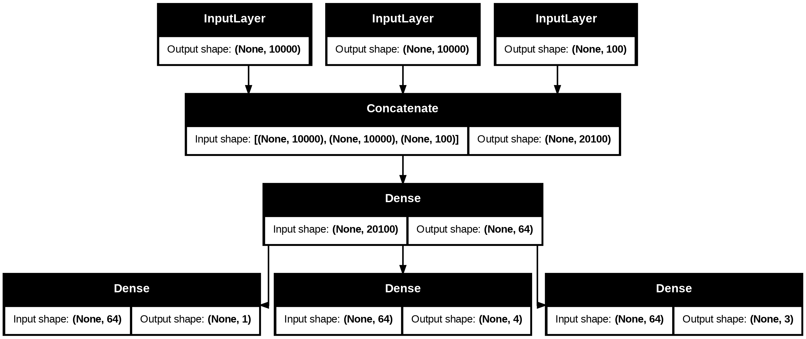
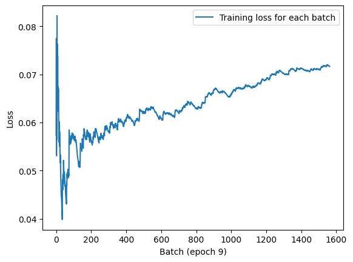
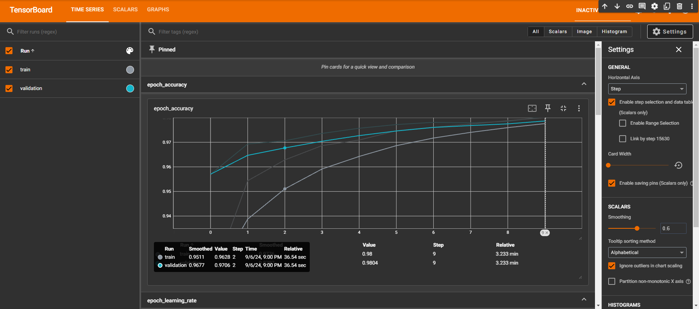

# 학습 내용

---

- 다양한 워크폴로
- 케라스 모델을 만드는 여러 방법
- 내장된 훈련 루프와 평가 루프 사용
- 사용자 정의 훈련, 평가 루프 만들기

---

## 다양한 워크플로

---

케라스 API 설계

	복잡성의 단계적 공개 원칙을 따름

		-> 시작은 쉽게 하고, 필요할 때 단계마다 점진적으로 학습하여 아주 복잡한 경우를 처리할 수 있음

케라스를 사용하는 방법 

	여러가지 존재

	API를 기반으로 하는 워크플로의 구성 요소를 다른 워크플로에서 사용 가능

		-> 워크플로 간에 서로 호출 가능

---

## 케라스 모델을 만드는 여러 방법

---

모델을 만드는 API 세가지

- Sequential 모델

	가장 시작하기 쉬운 API -> 단순히 층을 쌓을 수만 있음

- 함수형 API 

	그래프 같은 모델 구조를 따름

	사용성과 유연성 사이의 적절한 중간 지점에 해당

		∴ 가장 널리 사용되는 모델 구축 API

- Model 서브클래싱

	모든 것을 밑바닥부터 직접 만들 수 있는 저수준 방법

	모든 상세한 내용을 완전히 제어하고 싶른 경우에 적합

		-> 여러 가지 케라스 내장 기능을 사용하지 못하기 때문에 실수가 발생할 위험이 많음

---

### Sequentail 모델

---

	'''

	from tensorflow import keras
	from tensorflow.keras import layers

	model=keras.Sequential([
	    layers.Dense(64,activation="relu"),
	    layers.Dense(10,activation="softmax")
	])

	'''

동일한 모델을 add() 메서드를 통해 점진적으로 만들 수 있음

	'''

	model=keras.Sequential()
	model.add(layers.Dense(64,activation="relu"))
	model.add(layers.Dense(10,activation="softmax"))

	'''

		층은 처음 호출될 때 만들어진다(가중치를 만듦)

			-> 입력 크기를 알기 전까지 가중치를 만들 수 없음

	'''

	model.weights

	'''

	결과: []

	'''

	model.build(input_shape=(None,3))
	model.weights

	'''

	결과: 

	'''

	[<KerasVariable shape=(3, 64), dtype=float32, path=sequential_1/dense_2/kernel>,
	 <KerasVariable shape=(64,), dtype=float32, path=sequential_1/dense_2/bias>,
	 <KerasVariable shape=(64, 10), dtype=float32, path=sequential_1/dense_3/kernel>,
	 <KerasVariable shape=(10,), dtype=float32, path=sequential_1/dense_3/bias>]

	'''

		-> input_shape=(None,3) 여기서 None은 어떤 배치 크기도 가능하다는 의미

	'''
	
	model.summary()

	'''

	결과:

	'''

	Model: "sequential_1"
	┏━━━━━━━━━━━━━━━━━━━━━━━━━━━━━━━━━━━━━━┳━━━━━━━━━━━━━━━━━━━━━━━━━━━━━┳━━━━━━━━━━━━━━━━━┓
	┃ Layer (type)                         ┃ Output Shape                ┃         Param # ┃
	┡━━━━━━━━━━━━━━━━━━━━━━━━━━━━━━━━━━━━━━╇━━━━━━━━━━━━━━━━━━━━━━━━━━━━━╇━━━━━━━━━━━━━━━━━┩
	│ dense_2 (Dense)                      │ (None, 64)                  │             256 │
	├──────────────────────────────────────┼─────────────────────────────┼─────────────────┤
	│ dense_3 (Dense)                      │ (None, 10)                  │             650 │
	└──────────────────────────────────────┴─────────────────────────────┴─────────────────┘
	 Total params: 906 (3.54 KB)
	 Trainable params: 906 (3.54 KB)
	 Non-trainable params: 0 (0.00 B)

	'''

		-> 케라스에서 모델과 층을 포함해서 모든 것에 이름을 지정 가능

	'''

	model=keras.Sequential(name="my_example_model")
	model.add(layers.Dense(64,activation="relu",name="my_first_layer"))
	model.add(layers.Dense(10,activation="softmax",name="my_last_layer"))
	model.build((None,3))
	model.summary()

	'''

	결과:

	'''

	Model: "my_example_model"
	┏━━━━━━━━━━━━━━━━━━━━━━━━━━━━━━━━━━━━━━┳━━━━━━━━━━━━━━━━━━━━━━━━━━━━━┳━━━━━━━━━━━━━━━━━┓
	┃ Layer (type)                         ┃ Output Shape                ┃         Param # ┃
	┡━━━━━━━━━━━━━━━━━━━━━━━━━━━━━━━━━━━━━━╇━━━━━━━━━━━━━━━━━━━━━━━━━━━━━╇━━━━━━━━━━━━━━━━━┩
	│ my_first_layer (Dense)               │ (None, 64)                  │             256 │
	├──────────────────────────────────────┼─────────────────────────────┼─────────────────┤
	│ my_last_layer (Dense)                │ (None, 10)                  │             650 │
	└──────────────────────────────────────┴─────────────────────────────┴─────────────────┘
	 Total params: 906 (3.54 KB)
	 Trainable params: 906 (3.54 KB)
	 Non-trainable params: 0 (0.00 B)

	'''

		-> 모델 생성후 summary() 메서드를 호출하면 현재 모델을 확인 가능

			-> 모델의 build() 메서드를 호출 전까지 summary() 메서드 호출 불가

Squential 모델의 가중치를 바로 생성하는 방법

	모델의 입력 크기를 미리 지정

		-> Input 클래스 사용

	'''

	model=keras.Sequential()
	model.add(keras.Input(shape=(3,)))
	model.add(layers.Dense(64,activation="relu"))
	model.summary()

	'''

	결과:

	'''

	Model: "sequential_3"
	┏━━━━━━━━━━━━━━━━━━━━━━━━━━━━━━━━━━━━━━┳━━━━━━━━━━━━━━━━━━━━━━━━━━━━━┳━━━━━━━━━━━━━━━━━┓
	┃ Layer (type)                         ┃ Output Shape                ┃         Param # ┃
	┡━━━━━━━━━━━━━━━━━━━━━━━━━━━━━━━━━━━━━━╇━━━━━━━━━━━━━━━━━━━━━━━━━━━━━╇━━━━━━━━━━━━━━━━━┩
	│ dense_4 (Dense)                      │ (None, 64)                  │             256 │
	└──────────────────────────────────────┴─────────────────────────────┴─────────────────┘
	 Total params: 256 (1.00 KB)
	 Trainable params: 256 (1.00 KB)
	 Non-trainable params: 0 (0.00 B)

	'''

---

### 함수형 API

---

Sequential 모델의 단점

	하나의 입력과 하나의 출력을 가지며 순서대로 층을 쌓은 모델만 표현 가능

		
		다중 입력, 다중 출력, 비선형적인 구조를 가진 데이터

			-> 함수형 API를 사용한 모델을 사용

---

간단한 예제

	'''

	inputs=keras.Input(shape=(3,),name="my_input")
	features=layers.Dense(64,activation="relu")(inputs)
	outputs=layers.Dense(10,activation="softmax")(features)
	model=keras.Model(inputs=inputs,outputs=outputs)
	model.summary()

	'''

	결과:

	'''

	Model: "functional_5"
	┏━━━━━━━━━━━━━━━━━━━━━━━━━━━━━━━━━━━━━━┳━━━━━━━━━━━━━━━━━━━━━━━━━━━━━┳━━━━━━━━━━━━━━━━━┓
	┃ Layer (type)                         ┃ Output Shape                ┃         Param # ┃
	┡━━━━━━━━━━━━━━━━━━━━━━━━━━━━━━━━━━━━━━╇━━━━━━━━━━━━━━━━━━━━━━━━━━━━━╇━━━━━━━━━━━━━━━━━┩
	│ my_input (InputLayer)                │ (None, 3)                   │               0 │
	├──────────────────────────────────────┼─────────────────────────────┼─────────────────┤
	│ dense_9 (Dense)                      │ (None, 64)                  │             256 │
	├──────────────────────────────────────┼─────────────────────────────┼─────────────────┤
	│ dense_10 (Dense)                     │ (None, 10)                  │             650 │
	└──────────────────────────────────────┴─────────────────────────────┴─────────────────┘
	 Total params: 906 (3.54 KB)
	 Trainable params: 906 (3.54 KB)
	 Non-trainable params: 0 (0.00 B)

	'''

		1. inputs 객체(심볼릭 텐서) -> 모델이 처리할 데이터의 크기, dtype에 대한 정보를 가짐
		2. 층을 만들고 입력을 호출 -> 크기와 dtype 정보가 업데이트된 새로운 심볼릭 텐서 반환
		3. 최종 출력을 얻은 후 입력과 출력을 Model 클래스에 전달해 모델 객체 생성

---

다중 입력, 다중 출력 모델

리스트와 같은 형태가 아니라

	그래프를 닮음

		-> 입력이 여러개, 출력이 여러개

			-> 함수형 API가 빛을 발함

ex)

	'''

	vocabulary_size=10000
	num_tags=100
	num_departments=4

	title=keras.Input(shape=(vocabulary_size,),name="title")
	text_body=keras.Input(shape=(vocabulary_size,),name="text_body")
	tags=keras.Input(shape=(num_tags,),name="tags")

	features=layers.concatenate([title,text_body,tags])
	features=layers.Dense(64,activation="relu")(features)

	priority=layers.Dense(1,activation="sigmoid",name="priority")(features)
	department=layers.Dense(num_departments,activation="softmax",name="department")(features)

	model=keras.Model(inputs=[title,text_body,tags],
	                  outputs=[priority,department])

	'''

		-> 간단하고 레고 블록 같지만 층으로 구성된 어떤 그래프도 정의할 수 있는 매우 유연한 방법

---

다중 입력, 다중 출력 모델 훈련

	입력과 출력 데이터의 리스트로 fit() 메서드 호출

	'''

	import numpy as np

	num_samples=1280

	title_data=np.random.randint(0,2,size=(num_samples,vocabulary_size))
	text_body_data=np.random.randint(0,2,size=(num_samples,vocabulary_size))
	tags_data=np.random.randint(0,2,size=(num_samples,num_tags))

	priority_data=np.random.random(size=(num_samples,1))
	department_data=np.random.randint(0,2,size=(num_samples,num_departments))

	model.compile(optimizer="rmsprop",
	              loss=["mean_squared_error","categorical_crossentropy"],
	              metrics=[["mean_absolute_error"],["accuracy"]])
	model.fit([title_data,text_body_data,tags_data],
	          [priority_data,department_data],
	          epochs=1)
	model.evaluate([title_data,text_body_data,tags_data],
	               [priority_data,department_data])
	priority_preds,department_preds=model.predict([[title_data,text_body_data,tags_data]])

	'''

입력 순서에 신경 쓰고 싶지 않다면

	Input 객체와 출력 층에 부여한 이름을 활용해 데이터를 딕셔너리로 전달 가능

	'''

	model.compile(optimizer="rmsprop",
	              loss={"priority":"mean_squared_error",
	                    "department":"categorical_crossentropy"},
	              metrics={"priority":["mean_absolute_error"],"department":["accuracy"]})
	model.fit({"title":title_data,"text_body":text_body_data,"tags":tags_data},
	          {"priority":priority_data,"department":department_data},
	          epochs=1)
	model.evaluate({"title":title_data,"text_body":text_body_data,"tags":tags_data},
	               {"priority":priority_data,"department":department_data})
	priority_preds,department_preds=model.predict({"title":title_data,"text_body":text_body_data,"tags":tags_data})

	'''

---

함수형 API의 장점: 층 연결 구조 활용

함수형 모델

	명시적인 그래프 데이터 구조

		-> 층이 어떻게 연결되어 있는지 조사하고 이전 그래프 노드(층의 출력)를 새 모델의 일부로 재사용 가능

			-> 모델 시각화와 특성 추출 두가지 중요한 기능 가능해짐

모델의 연결 구조(모델의 토폴로지) 시각화

	'''

	keras.utils.plot_model(model,"ticket_classifier.png")

	'''

	'''

	keras.utils.plot_model(model,"ticket_classifier.png",show_shapes=True)

	'''

		-> 모델에 있는 각 층의 입출력 크기 추가

			-> 텐서 크기에 None은 배치 크기를 나타냄(어떤 크기의 배치에서도 사용 가능)

각 층에 대해 layer.input과 layer.output을 출력

	'''

	model.layers

	model.layers[3].input

	model.layers[3].optput

	'''

	결과:

	'''
	
	[<InputLayer name=title, built=True>,
	 <InputLayer name=text_body, built=True>,
	 <InputLayer name=tags, built=True>,
	 <Concatenate name=concatenate, built=True>,
	 <Dense name=dense_11, built=True>,
	 <Dense name=priority, built=True>,
	 <Dense name=department, built=True>]

	[<KerasTensor shape=(None, 10000), dtype=float32, sparse=None, name=title>,
	 <KerasTensor shape=(None, 10000), dtype=float32, sparse=None, name=text_body>,
	 <KerasTensor shape=(None, 100), dtype=float32, sparse=None, name=tags>]

	<KerasTensor shape=(None, 20100), dtype=float32, sparse=False, name=keras_tensor_14>

	'''

		-> 특성 추출을 수행해 다른 모델에서 중간 특성을 재사용하는 모델을 만들 수 있음

	'''

	features=model.layers[4].output
	difficulty=layers.Dense(3,activation="softmax",name="difficulty")(features)
	new_model=keras.Model(
	    inputs=[title,text_body,tags],
	    outputs=[priority,department,difficulty]
	)

	keras.utils.plot_model(new_model,"updated_ticket_classifier.png",show_shapes=True)

	'''

		-> 중간충의 출력을 재사용해 새로운 모델을 만듦

---

### Model 서브클래싱

---

	- '''__init__()''' 메서드 -> 모델이 사용할 층을 정의
	- call() 메서드 -> 앞서 만든 층을 사용해 모델의 정방향 패스 정의
	- 서브클래스의 객채 생성후 데이터와 함께 호출해 가중치를 만듦

---

이전 예제 서브클래싱 모델로 다시 만들기

	'''

	class CustomerTicketModel(keras.Model):
	  def __init__(self,num_departments):
	    super().__init__()
	    self.concat_layer=layers.Concatenate()
	    self.mixing_layer=layers.Dense(64,activation="relu")
	    self.priority_scorer=layers.Dense(1,activation="sigmoid")
	    self.department_classifier=layers.Dense(num_departments,activation="softmax")

	  def call(self,inputs):
	    title=inputs["title"]
	    text_body=inputs["text_body"]
	    tags=inputs["tags"]
	    features=self.concat_layer([title,text_body,tags])
	    features=self.mixing_layer(features)
	    priority=self.priority_scorer(features)
	    department=self.department_classifier(features)
	    return priority,department

	model=CustomerTicketModel(num_departments=4)
	priority,department=model({"title":title_data,"text_body":text_body_data,"tags":tags_data})

	'''

		-> 꼭 부모 클래스의 생성자를 호출 해야함!!!

Model을 상속하여 만든 모델을 컴파일하고 훈련할 수 있음

	'''

	model.compile(optimizer="rmsprop",
	              loss=["mean_squared_error","categorical_crossentropy"],
	              metrics=[["mean_absolute_error"],["accuracy"]])
	model.fit({"title":title_data,"text_body":text_body_data,"tags":tags_data},
	          [priority_data,department_data],
	          epochs=1)
	model.evaluate({"title":title_data,"text_body":text_body_data,"tags":tags_data},
	               [priority_data,department_data])
	priority_preds,department_preds=model.predict({"title":title_data,"text_body":text_body_data,"tags":tags_data})

	'''

		주의사항

			- 손실(loss)과 측정 지표(metrics), 타킷 데이터의 구조로 전달 하는 값의 개수 == call() 메서드가 반환 하는 것의 개수

			- 입력 데이터의 구조는 call()메서드가 기대하는 것과 일치 해야 함

Model 서브클래싱 워크플로

	모델을 만드는 가장 유연한 방법

		-> call() 메서드가 for 루프 안에서 층을 사용, 재귀적으로 호출

			-> 모든 것이 가능, 하지만 책임은 내가 져야함

---

주의: 서브클래싱된 모델이 지원하지 않는 것

	- 모델 로직을 많이 책임져야 하며 잠재적인 오류 가능성이 높음
	- 결과적으로 더 많은 디버깅 작업 수행
	- 한 덩어리의 바이트코드임을 명심
	
	ex) 서로 연결되는 방식이 call() 메서드 안에 감추어져 있음

		-> 정방향 패스는 완전한 블랙박스가 됨

---

여러 방식을 혼합하여 사용

	'''

	class Classifier(keras.Model):
	  def __init__(self,num_classes=2):
	    super().__init__()
	    if num_classes == 2:
	      num_units=1
	      activation="sigmoid"
	    else:
	      num_units=num_classes
	      activation="softmax"

	    self.dense=layers.Dense(num_units,activation=activation)
	  def call(self, inputs):
	    return self.dense(inputs)

	inputs=keras.Input(shape=(3,))
	features=layers.Dense(64,activation="relu")(inputs)
	outputs=Classifier(num_classes=10)(features)
	model=keras.Model(inputs=inputs,outputs=outputs)

	'''

		-> 함수형 모델에서 서브클래싱 층이나 모델 사용 가능

	'''

	inputs=keras.Input(shape=(64,))
	outputs=layers.Dense(1,activation="sigmoid")(inputs)
	binary_classifier=keras.Model(inputs=inputs,outputs=outputs)

	class MyModel(keras.Model):
	  def __init__(self,num_classes=2):
	    super().__init__()
	    self.dense=layers.Dense(64,activation="relu")
	    self.classifier=binary_classifier
	  def call(self,inputs):
	    features=self.dense(inputs)
	    return self.classifier(features)

	model=MyModel()

	'''

		-> 서브클래싱 층이나 모델의 일부로 함수형 모델을 사용 가능

---

작업에 적합한 도구 사용

함수형 API

	쉬운 사용성과 유연성 사이에 적절한 절충점

		- 층 연결 구조를 활용하여 모델의 출력이나 특성 추출과 같은 용도에 잘 맞음
		- 모델을 층의 유향 비순환 그래프로 표현 가능하다면 Model 서브클래싱보단 이 방식을 권장

---

## 내장된 훈련 루프와 평가 루프 사용

---

워크플로를 커스터마이징할 수 있는 몇가지 방법

	- 사용자 정의 측정 지표를 전달
	- fir() 메서드에 콜백을 전달하여 훈련하는 동안 특정 시점에 수행될 행동을 예약

---

### 사용자 정의 지표 만들기

---

지표

	- 모델의 성능을 측정하는 열쇠

		-> 훈련 데이터 성능과 테스트 데이터 성능 차이를 측정하는 것이 중요!

	- 케라스 지표는 keras.metrics.Metric 클래스를 상속한 클래스
	- 텐서플로 변수레 내부 상태가 저장
	- 역전파로 업데이트 X
	- 상태 업데이트 로직을 update_state()메서드 안에 직접 작성

ex) RMSE 정의 지표 구현

	'''

	import tensorflow as tf

	class RootMeanSquaredError(keras.metrics.Metric):
	  def __init__(self,name="rmse",**kwargs):
	    super().__init__(name=name,**kwargs)
	    self.mse_sum=self.add_weight(name="mae_sum",initializer="zeros")
	    self.total_samples=self.add_weight(name="total_samples",initializer="zeros",dtype="int32")
	
	  def update_state(self,y_true,y_pred,sample_weight=None):
	    y_true=tf.one_hot(y_true,depth=tf.shape(y_pred)[1])
	    mse=tf.reduce_sum(tf.square(y_true-y_pred))
	    self.mse_sum.assign_add(mse)
	    num_samples=tf.shape(y_pred)[0]
	    self.total_samples.assign_add(num_samples)

	  def result(self):
	    return tf.sqrt(self.mse_sum/tf.cast(self.total_samples,tf.float32))
	
	  def reset_state(self):
	    self.mse_sum.assign(0.)
	    self.total_samples.assign(0)

	model=get_mnist_model()
	model.compile(optimizer="rmsprop",
	              loss="sparse_categorical_crossentropy",
	              metrics=["accuracy",RootMeanSquaredError()])
	model.fit(train_images,train_labels,
	          epochs=3,
	          validation_data=(val_images,val_labels))
	test_metrics=model.evaluate(test_images,test_labels)

	'''
	
		-> 진행 표시줄에 RMSE 값도 표시됨

---

### 콜백 사용

---

케라스의 콜백?

	- model.fit() 호출을 종이 비행기 -> 자동 드론
	- 훈련하는 동안 모델은 여러 지점에서 콜백을 호출

콜백을 사용하는 사례

	- 모델 체크포인트 저장 -> 훈련하는 동안 어떤 지점에서 모델의 현재 가중치를 저장
	- 조기 종료 -> 검증 손실이 더 이상 향상되지 않을 때 훈련을 중지, 훈련하는 동안 얻은 가장 좋은 모델 저장
	- 하이퍼파라미터 값을 동적으로 조정 -> 옵티마이저의 학습률 같은 경우
	- 훈련과 검증 지표를 로그에 기록, 모델이 학습한 표현이 업데이터될 때마다 시각화 -> fit() 메서드의 진행 표시줄도 하나의 콜백

---

ModelCheckpoint, EarlyStopping 콜백

	검증 손실이 더 이상 향상되지 않을 때훈련을 멈춤 -> EarlyStopping 콜백을 사용해 구현

EarlyStopping 콜백

	정해진 에포크 동안 모니터링 지표가 향상되지 않을 때 훈련을 중지

ModelCheckpoint 콜백

	훈련 에포크 동안 가장 좋은 모델만 저장 가능

	'''

	callbacks_list=[
	    keras.callbacks.EarlyStopping(
	        monitor="val_accuracy",
	        patience=2
	    ),
	    keras.callbacks.ModelCheckpoint(
	        filepath="checkpoint_path.keras",
	        monitor="val_loss",
	        save_best_only=True
	    )
	]

	model=get_mnist_model()
	model.compile(optimizer="rmsprop",
	              loss="sparse_categorical_crossentropy",
	              metrics=["accuracy"])
	model.fit(train_images,train_labels,
	          epochs=10,
	          callbacks=callbacks_list,
	          validation_data=(val_images,val_labels))

	'''

	'''

	model=keras.models.load_model("checkpoint_path.keras")

	'''

		-> 저장된 모델을 로드

---

### 사용자 정의 콜백 만들기

---

	keras.callbacks.Callback 클래스를 상속받아 구현

다음과 같은 메서드 구현 가능

	- on_epoch_begin(epoch,logs) -> 각 에포크가 시작할 때 호출
	- on_epoch_end(epoch,logs) -> 각 에포크가 끝날 때 호출
	- on_batch_begin(batch,logs) -> 각 배치 처리가 시작하기 전에 호출
	- on_batch_end(batch,logs) -> 각 배치 처리가 끝난 후에 호출
	- on_train_begin(logs) -> 훈련이 시작될 때 호출
	- on_train_end(logs) -> 훈련이 끝날 때 호출

		-> 모두 logs 매개변수와 함께 호출

			logs

				-> 이전 배치, 에포크 / 훈련 실행에 대한 정보(훈련과 검증 지표)가 담긴 딕셔너리

	'''

	from matplotlib import pyplot as plt

	class LossHistory(keras.callbacks.Callback):
	  def on_train_begin(self,logs):
	    self.per_batch_losses=[]
	  def on_batch_end(self,batch,logs):
	    self.per_batch_losses.append(logs.get("loss"))
	  def on_epoch_end(self,epoch,logs):
	    plt.clf()
	    plt.plot(range(len(self.per_batch_losses)), self.per_batch_losses,label="Training loss for each batch")
	    plt.xlabel(f"Batch (epoch {epoch})")
	    plt.ylabel("Loss")
	    plt.legend()
	    plt.savefig(f"plot_at_epoch_{epoch}")
	    self.per_batch_losses=[]

	model=get_mnist_model()
	model.compile(optimizer="rmsprop",
	              loss="sparse_categorical_crossentropy",
	              metrics=["accuracy"])
	model.fit(train_images,train_labels,
	          epochs=10,
	          callbacks=[LossHistory()],
	          validation_data=(val_images,val_labels))

	'''

---

### 텐서보드를 사용한 모니터링과 시각화

---

좋은 연구를 하거나 좋은 모델을 개발하려면

	모델 내부에서 어떤 일이 일어나는지 자주 그리고 많은 피드백을 받아야 함

텐서보드?

	- 로컬에서 실행할 수 있는 브라우저 기반 애플리케이션
	- 훈련하는 동안 모델 안에서 일어나는 모든 것을 모니터링하기 위한 가장 좋은 방법

텐서보드를 사용해 수행할 수 있는 일

	- 훈련하는 동안 측정 지표를 시각적으로 모니터링
	- 모델 구조를 시각화
	- 활성화 출력과 그레이디언트의 히스토그램을 그림
	- 임베딩을 3D로 표현

	'''

	model=get_mnist_model()
	model.compile(optimizer="rmsprop",
	              loss="sparse_categorical_crossentropy",
	              metrics=["accuracy"])
	tensorboard=keras.callbacks.TensorBoard(log_dir="/full_path_to_your_log_dir")
	model.fit(train_images,train_labels,epochs=10,validation_data=(val_images,val_labels),callbacks=[tensorboard])

	'''

		-> 콜백에 로그를 지정할 위치를 지정하면 됨

	'''

	# 일반
	tensorboard --logdir /full_path_to_your_log_dir

	# colab
	%load_ext tensorboard
	%tensorboard --logdir /full_path_to_your_log_dir

	'''

---

## 사용자 정의 훈련, 평가 루트 만들기

---

내장 fit() 워크플로

	지도 학습에만 초점이 맞추어져 있음

내장 fit() 메서드로 충분하지 않은 상황이라면

	자신만의 훈련 로직을 직접 작성

전형적인 훈련 루프

	- 그레디언트 테이프 란에서 정방향 패스 실시(모델의 출력을 계산)
	- 모델 가중치에 대한 손실의 그레이디언트를 계산
	- 현재 배치 데이터에 대한 손실 값을 낮추는 방향으로 모델 가중치 업데이트

---

### 훈련 VS 추론

Dropout 층과 같은 일부 케라스 층

	- 훈련과 추론에서 동작이 다름
	- call() 메서드에 training 불리언 매개변수 제공
		- training=True -> dropout 정상 작동
		- training=False -> 아무런 변화 없음
	- 정방향 패스 -> predictions=model(inputs,training=true)
	- 그레이디언트 추출 -> tape.gradients(loss,model.trainable_weights)
		- 훈련 가능한 가중치 -> 역전파로 업데이트
		- 훈련되지 않는 가중치 -> 정방향 패스 동안 엄데이트

케라스에 훈련되지 않는 가중치를 가진 층

	batch Normalization 층

코드화

	'''

	def train_step(inputs,targets):
	  with tf.GrandientTape() as tape:
	    prediction=model(inputs,training=True)
	    loss=loss_fn(target,prediction)
	  gradients=tape.gradients(loss,model.trainable_weights)
	  optimizer.apply_gradients(zip(model.trainable_weights,gradients))

	'''

---

### 측정 지표의 저수준 사용법

---

저수준 특정 지표

	단순히 각 배치의 타킷과 예측에 대한 update_state(y_true,y_pred)를 호출, result() 메서드로 현재 지표 값을 얻음

	'''

	metric=keras.metrics.SparseCategoricalAccuracy()
	target=[0,1,2]
	prediction=[[1,0,0],[0,1,0],[0,0,1]]
	metric.update_state(target,prediction)
	current_result=metric.result()
	print(f"결과: {current_result:.2f}")

	'''

모델의 손실처럼 스칼라 값의 평균을 추척해야 될 수도 있음

	keras.metric.Mean 사용

	'''

	values=[0,1,2,3,4]
	mean_tracker=keras.metrics.Mean()
	for value in values:
	  mean_tracker.update_state(value)
	print(f"평균 지표: {mean_tracker.result():.2f}")

	'''

현재 결과를 재설정

	metric,rest_state() 메서드 사용

---

### 완전한 훈련과 평가 루프

---

정방향 패스, 역방향 패스, 지표 추적 -> fit()과 유사한 훈련 스템 함수로 연결

	'''

	model=get_mnist_model()

	loss_fn=keras.losses.SparseCategoricalCrossentropy()
	optimizer=keras.optimizers.RMSprop()
	metrics=[keras.metrics.SparseCategoricalAccuracy()]
	loss_tracking_metric=keras.metrics.Mean()

	def train_step(inputs,targets):
	  with tf.GrandientTape as tape:
	    prediction=model(inputs,training=True)
	    loss=loss_fn(targets,prediction)
	  grandients=tape.gradient(loss,model.trainable_weights)
	  optimizer.apply_gradients(zip(grandients,model.trainable_weights))
	  logs={}
	  for metric in metrics:
	    metric.update_state(targets,prediction)
	    logs[metric.name]=metric.result()
	  loss_tracking_metric.update_state(loss)
	  logs["loss"]=loss_tracking_metric.result()
	  return logs

	def reset_metrics():
	  for metric in metrics:
	    metric.reset_state()
	  loss_tracking_metric.reset_state()

	'''

훈련 루프 구성

	'''

	training_dataset=tf.data.Dataset.from_tensor_slices(
	    (train_images,train_labels))
	training_dataset=training_dataset.batch(32)
	epochs=3
	for epoch in range(epochs):
	  reset_metrics()
	  for inputs_batch,targets_batch in training_dataset:
	    log=train_step(inputs_batch,targets_batch)
	  print(f"{epoch}번째 에포크 결과")
	  for key,value in logs.item():
	    print(f"...{key}: {value:.4f}")

	'''

		-> tf.data.Dataset 객체를 사용해 넘파이 데이터를 크기가 32인 배치로 데이터를 순회하는 반복자로 바꿈

평가 루프 구성

	'''

	import tensorflow as tf
	def test_step(inputs,targets):
	  prediction=model(inputs,training=False)
	  loss=loss_fn(targets,prediction)

	  logs={}
	  for metric in metrics:
	    metric.update_state(targets,prediction)
	    logs["val_"+metric.name]=loss_tracking_metric.result()
	    return logs

	val_dataset=tf.data.Dataset.from_tensor_slices((val_images,val_labels))
	val_dataset=val_dataset.batch(32)
	reset_metrics()
	for inputs_batch, targets_batch in val_dataset:
	  logs=test_step(inputs_batch,targets_batch)
	print("평가 결과:")
	for key,value in logs.items():
	  print(f"...{key}: {value:.4f}")

	'''

		-> 간단한 for 루프로 하나의 배치 데이터를 처리하는 test_step() 함수 반복 호출

		-> training=False로 설정 해야됨

---

### tf.function으로 성능 높이기

---

실행 속도

	직접 구현한 로직 < 내장된 fit() / evaluate() 메서드

		-> 계산 그래프로 컴파일하는 것이 더 성능이 좋아짐

	'''

	@tf.function
	def test_step(inputs,targets):
	  prediction=model(inputs,training=False)
	  loss=loss_fn(targets,prediction)

	  logs={}
	  for metric in metrics:
	    metric.update_state(targets,prediction)
	    logs["val_"+metric.name]=loss_tracking_metric.result()
	    return logs

	val_dataset=tf.data.Dataset.from_tensor_slices((val_images,val_labels))
	val_dataset=val_dataset.batch(32)
	reset_metrics()
	for inputs_batch, targets_batch in val_dataset:
	  logs=test_step(inputs_batch,targets_batch)
	print("평가 결과:")
	for key,value in logs.items():
	  print(f"...{key}: {value:.4f}")
`
	'''

		-> @tf.function 데코레이션 하나만 추가하면 됨

---

### fit() 메서드를 사용자 정의 루프로 활용

---

밑바닥부터 완전한 사용자 정의 훈련 루프를 정의

	-> 유연성은 높지만, 많은 코드를 작성해야 하고 콜백이나 분산 훈련 같은 fit() 메서드가 제동하는 많은 편리한 기능을 사용 X

---

사용자 정의 훈련 알고리즘이 필요, 하지만 케라스에 내장된 훈련 로직의 기능을 활용

	사용자 정의 훈련 스텝 함수만 제공, 나머지 처리는 프레임워크에 위임

		-> Model 클래스의 train_step() 메서드(fit() 메서드가 배치 데이터마다 호출)를 오버라이딩하면 됨

	'''

	loss_fn=keras.losses.SparseCategoricalCrossentropy()
	loss_tracker=keras.metrics.Mean(name="loss")

	class CustomModel(keras.Model):
	  def train_step(self,data):
	    inputs,targets=data
	    with tf.GradientTape() as tape:
	      prediction=self(inputs,training=True)
	      loss=loss_fn(targets,prediction)
	    gradients=tape.gradient(loss,self.trainable_weights)
	    self.optimizer.apply_gradients(zip(gradients,self.trainable_weights))
	    loss_tracker.update_state(loss)
	    return {"loss":loss_tracker.result()}

	@property
	def metrics(self):
	  return [loss_tracker]

	'''

		1. keras.Model을 상속한 클래스 생성
		2. train_step(self,data) 메서드 오버라이딩
		3. 모델의 Metric 객체를 반환하는 metric 속성 구현
			-> 매 에포크 시작이나 evaluate()를 호출할 때 모델이 지표 객체들의 reser_state() 메서드를 자동으로 호출

	'''

	@property
        def metrics(self) -> 에포크 마다 재설정할 지표 나열해 지정
	
	'''
	
	'''

	inputs=keras.Input(shape=(28*28,))
	outputs=layers.Dense(512,activation="relu")(inputs)
	outputs=layers.Dropout(0.5)(outputs)
	outputs=layers.Dense(10,activation="softmax")(outputs)
	model=CustomModel(inputs,outputs)

	model.compile(optimizer=keras.optimizers.RMSprop())
	model.fit(train_images,train_labels,epochs=3)

	'''

		보통 때처럼 fit() 메서드로 훈련 가능

주의사항

	- 어떤 방식으로 신경망을 구성하든 이 방식은 사용 가능
	- 프레임워크다 알아서 처리하기 때문에 오버라이딩할 때 @tf.function 데코레이션를 사용할 필요가 없음

---

compile() 메서드를 통해 지표와 손실 설정

참조 가능한 메서드

	- self.compiled_loss -> 메서드에 전달된 손실 함수
	- self.compiled_metrics -> 메서드에 전달된 지표 목록이 포함되어 있는 객체, self.compiled_metric.update_state()를 호출하여 모든 지표를 동시에 업데이트 가능
	- self.metric -> 전달할 실제 지표 목록(손실을 추적하는 지표도 포함)

	'''

	class CustomModel(keras.Model):
	  def train_step(self,data):
	    inputs,targets=data
	    with tf.GradientTape() as tape:
	      prediction=self(inputs,training=True)
	      loss=self.compiled_loss(targets,prediction)
	    gradients=tape.gradient(loss,self.trainable_weights)
	    self.optimizer.apply_gradients(zip(gradients,self.trainable_weights))
	    self.compiled_metrics.update_state(targets,prediction)
	    loss_tracker.update_state(loss)
	    return {m.name:m.result() for m in self.metrics}

	inputs=keras.Input(shape=(28*28,))
	outputs=layers.Dense(512,activation="relu")(inputs)
	outputs=layers.Dropout(0.5)(outputs)
	outputs=layers.Dense(10,activation="softmax")(outputs)
	model=CustomModel(inputs,outputs)

	model.compile(optimizer=keras.optimizers.RMSprop(),
	              loss=keras.losses.SparseCategoricalCrossentropy(),
	              metrics=[keras.metrics.SparseCategoricalAccuracy()])
	model.fit(train_images,train_labels,epochs=3)

	'''
