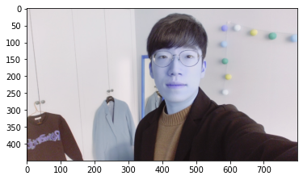
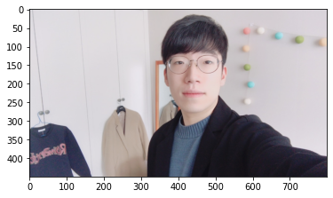
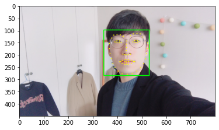
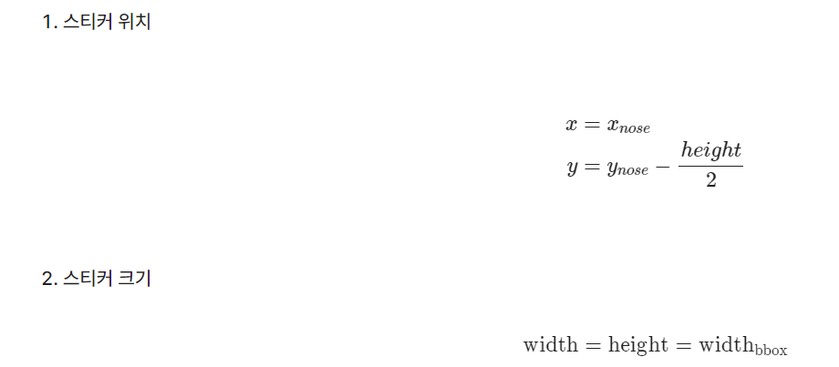
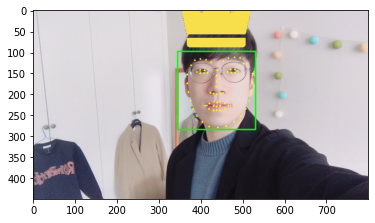
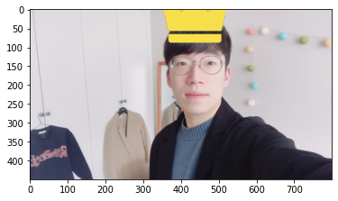

# 학습 내용

---

- OpenCV 라이브러리
- 얼굴 검출 face detection
- 얼굴 랜드마크 face landmark
- 스티커 적용하기

---

## OpenCV 라이브러리

---

랜드마크?

	스티커를 세밀하게 자연스럽게 적용하기 위해서 눈, 코,입, 귀와 같은 얼굴 각각의 위치를 찾아내는 기술 (= 조정(alignment))

카메라 스티커앱 만드는 순서

	1. 얼굴이 포함된 사진 준비
	2. 사진으로부터 얼굴 영역(face landmark)를 찾아냄 -> 그러기 위해선 얼굴의 bounding box를 만저 찾아야함
	3. 찾아진 영역으로 부터 머리에 왕관 스트커를 붙여놓음

활용할 사진

필요한 패키지 import
	
	'''

	import os # 환경 변수나 디렉터리, 파일 등의 OS 자원을 제어할 수 있게 해주는 모듈
	import cv2 # OpenCV라이브러리 → 컴퓨터 비전 관련 프로그래밍을 쉽게 할 수 있도록 도와주는 라이브러리
	import matplotlib.pyplot as plt # 다양한 데이터를 많은 방법으로 도식화 할 수 있도록 하는 라이브러리
	import numpy as np # 다차원 배열을 쉽게 처리하고 효율적으로 사용할 수 있도록 하는 라이브러리
	import dlib # 이미지 처리 및 기계 학습, 얼굴인식 등을 할 수 있는 c++ 로 개발된 고성능의 라이브러리 

	'''

이미지 읽어오기

	'''

	my_image_path = 'aiffel/camera_sticker/images/image.png' # 본인 이미지가 있는 경로를 가지고 온다.
	img_bgr = cv2.imread(my_image_path)    # OpenCV로 이미지를 불러옵니다
	img_show = img_bgr.copy()      # 출력용 이미지를 따로 보관합니다
	plt.imshow(img_bgr) # 이미지를 출력하기 위해 출력할 이미지를 올려준다. (실제 출력은 하지 않음)
	plt.show() # 이미지를 출력해준다. (실제 출력)

	'''

	-> 얼굴 색에 왜이렇게 푸른빛이 감도는 이유?

		 opencv의 특징 -> BGR(파랑, 녹색, 빨강)을 사용

색깔 보정

	'''

	# plt.imshow 이전에 RGB 이미지로 바꾸는 것을 잊지마세요. 
	img_rgb = cv2.cvtColor(img_bgr, cv2.COLOR_BGR2RGB)
	plt.imshow(img_rgb) # 이미지 실제 출력하기 위해 이미지를 올려줌 (원하는 사이즈의 픽셀을 원하는 색으로 채워서 만든 그림이라고 합니다.)
	plt.show() # 이미지 실제 출력

	'''

---

Q. cv2.imread('img.png', 0) 에서 0 은 무슨 의미일까요?

	cv2.IMREAD_GRAYSCALE : 이미지를 Grayscale로 읽어 들입니다. 실제 이미지 처리시 중간단계로 많이 사용합니다.

---

## 얼굴 검출 face detection

---

	object detection 기술을 이용해 얼굴의 위치 찿기

dlib의 face detector?

	HOG(Histogram of Oriented Gradients)와 SVM(Support Vector Machine)을 사용해서 얼굴을 찾음

HOG??

	이미지에서 색상의 변화량을 나타낸 것

SVM?

	선형 분류기 

		-> 얼굴이냐 아니냐를 구분하는 것이 중요하기 때문에 사용

얼굴의 위치의 위치를 찾는 방법?

	sliding window를 사용

sliding window??

	작은 영역(window)을 이동해가며 확인하는 방법

		-> 큰 이미지의 작은 영역을 잘라 얼굴이 있는지 확인하고, 다시 작은 영역을 옆으로 옮겨 얼굴이 있는지 확인하는 방식

코드화

	'''

	# detector를 선언합니다
	detector_hog = dlib.get_frontal_face_detector() # 기본 얼굴 감지기를 반환

	img_rgb = cv2.cvtColor(img_bgr, cv2.COLOR_BGR2RGB)
	dlib_rects = detector_hog(img_rgb, 1)   # (image, num of image pyramid)

	for dlib_rect in dlib_rects: # 찾은 얼굴 영역의 좌표
	    l = dlib_rect.left() # 왼쪽
	    t = dlib_rect.top() # 위쪽
	    r = dlib_rect.right() # 오른쪽
	    b = dlib_rect.bottom() # 아래쪽

	    cv2.rectangle(img_show, (l,t), (r,b), (0,255,0), 2, lineType=cv2.LINE_AA) # 시작점의 좌표와 종료점 좌표로 직각 사각형을 그림

	img_show_rgb =  cv2.cvtColor(img_show, cv2.COLOR_BGR2RGB)
	plt.imshow(img_show_rgb)
	plt.show()

	'''

		-> detector_hog의 두 번째 파라미터는 이미지 피라미드 수를 의미

			이미지 피리미드?

				-> upsampling 방법를 통해 크기를 키우는 것

					-> 이미지 피라미드에서 얼굴을 다시 검출하면 작게 촬영된 얼굴을 크게 볼 수 있기 때문에 더 정확한 검출이 가능

		-> dlib detector 는 dlib.rectangles 타입의 객체를 반환합니다. dlib.rectangles 는 dlib.rectangle 객체의 배열 형태로 이루어져 있습니다.

			-> dlib.rectangle객체는 left(), top(), right(), bottom(), height(), width() 등의 멤버 함수를 포함

---

## 얼굴 랜드마크 face landmark

---

이목구비의 위치를 추론하는 것?

	face landmark localization 기술이라 함

		-> detection 의 결과물인 bounding box 로 잘라낸(crop) 얼굴 이미지를 이용

Object keypoint estimation 알고리즘?

	Face landmark와 같이 객체 내부의 점을 찾는 기술을 object keypoint estimation이라함

	- top-down : bounding box를 찾고 box 내부의 keypoint를 예측

	- bottom-up : 이미지 전체의 keypoint를 먼저 찾고 point 관계를 이용해 군집화 해서 box 생성

		-> 여기선 첫 번째 방식 사용

---

Dlib landmark localization

	-> 잘라진 얼굴 이미지에서 위의 68개의 이목구비 위치를 찾음

landmark 모델 불러오기

	'''

	model_path = 'aiffel/camera_sticker/models/shape_predictor_68_face_landmarks.dat'
	    # 저장한 landmark 모델의 주소를 model_path 변수에 저장
	landmark_predictor = dlib.shape_predictor(model_path)
	    # dlib 라이브러리의 shape_predictor 함수를 이용하여 모델을 불러옴
	    # landmark_predictor는 RGB이미지와 dlib.rectangle를 입력 받고 dlib.full_object_detection를 반환
	    # dlib.rectangle: 내부를 예측하는 박스
	    # dlib.full_object_detection: 각 구성 요소의 위치와, 이미지 상의 객체의 위치를 나타냄

	'''

		-> landmark_predictor의 입력: RGB 이미지, dlib.rectangle / 출력: lib.full_object_detection 를 반환

	'''

	list_landmarks = []
	    # 랜드마크의 위치를 저장할 list 생성    

	# 얼굴 영역 박스 마다 face landmark를 찾아냅니다
	# face landmark 좌표를 저장해둡니다
	for dlib_rect in dlib_rects:
	    points = landmark_predictor(img_rgb, dlib_rect)
	        # 모든 landmark의 위치정보를 points 변수에 저장
	    list_points = list(map(lambda p: (p.x, p.y), points.parts()))
	        # 각각의 landmark 위치정보를 (x,y) 형태로 변환하여 list_points 리스트로 저장
	    list_landmarks.append(list_points)
	        # list_landmarks에 랜드마크 리스트를 저장

	print(len(list_landmarks[0]))
	    # 얼굴이 n개인 경우 list_landmarks는 n개의 원소를 갖고
	    # 각 원소는 68개의 랜드마크 위치가 나열된 list 
	    # list_landmarks의 원소가 1개이므로 list_landmarks[1]을 호출하면 IndexError가 발생

	'''

		-> points 는 dlib.full_object_detection 의 객체이기 때문에 parts() 함수로 개별 위치에 접근 가능

			-> list_points 는 tuple (x, y) 68개로 이루어진 리스트

				-> 68개의 랜드마크가 얼굴 개수만큼 저장

랜드마크를 이미지에 출력

	'''

	# list_landmarks의 원소가 1개이므로 아래 반복문은 한번만 실행됨
	for landmark in list_landmarks:
	    for point in landmark:
	        cv2.circle(img_show, point, 2, (0, 255, 255), -1)
	            # cv2.circle: OpenCV의 원을 그리는 함수
	            # img_show 이미지 위 각각의 point에
	            # 크기가 2이고 (0, 255, 255)색으로 내부가 채워진(-1) 원을 그림
	            # (마지막 인수가 자연수라면 그만큼의 두께의 선으로 원이 그려짐)
	img_show_rgb = cv2.cvtColor(img_show, cv2.COLOR_BGR2RGB)
	    # RGB 이미지로 전환
	plt.imshow(img_show_rgb)
	    # 이미지를 준비
	plt.show()
	    # 이미지를 출력

	'''

---

## 스티커 적용하기

---

	-> 랜드마크를 기준으로 '눈썹 위 얼굴 중앙' 에 스티커를 씌우자!

		-> 비율로 계산(스티커 위치, 스티컼 크기)

---

Q. 스티커의 위치를 얼굴의 윗 쪽에 놓고 싶은데 왜 스티커의 y좌표는 '코'의 y좌표에서 'height/2' 값을 뺀 값으로 설정한 것일까요?

	왜냐하면 사진의 맨 위 y 좌표 값이 0이고 사진의 밑으로 내려갈수록 y 좌표 값이 커지기 때문입니다.

---

	'''

	# zip() : 두 그룹의 데이터를 서로 엮어주는 파이썬의 내장 함수
	# dlib_rects와 list_landmarks 데이터를 엮어 주었음
	# dlib_rects : 얼굴 영역을 저장하고 있는 값
	# → rectangles[[(345, 98) (531, 284)]]
	# list_landmarks : 68개의 랜드마크 값 저장(이목구비 위치(x,y))
	# → [[(368, 153), (368, 174), (371, 195), (376, 215), (382, 235), (391, 252), (404, 266), (420, 277), (441, 279), (461, 276), (480, 266), (495, 252), (508, 235), (516, 216), (520, 195), (523, 173), (524, 151), (377, 131), (386, 119), (399, 116), (413, 118), (425, 124), (454, 121), (466, 114), (481, 112), (494, 114), (503, 127), (439, 143), (438, 156), (438, 169), (437, 182), (423, 197), (431, 199), (438, 200), (446, 199), (454, 197), (391, 147), (399, 142), (409, 143), (416, 149), (408, 150), (399, 150), (464, 147), (472, 141), (482, 141), (489, 145), (482, 149), (473, 149), (411, 227), (421, 222), (432, 218), (439, 220), (446, 218), (458, 222), (471, 227), (458, 234), (446, 238), (438, 238), (431, 238), (420, 235), (415, 227), (432, 227), (439, 228), (447, 227), (466, 227), (446, 228), (438, 229), (431, 228)]]

	for dlib_rect, landmark in zip(dlib_rects, list_landmarks): # 얼굴 영역을 저장하고 있는 값과 68개의 랜드마크를 저장하고 있는 값으로 반복문 실행
	    print (landmark[30]) # 코의 index는 30 입니다
	    x = landmark[30][0] # 이미지에서 코 부위의 x값
	    y = landmark[30][1] - dlib_rect.height()//2 # 이미지에서 코 부위의 y값 - 얼굴 영역의 세로를 차지하는 픽셀의 수//2 → (437, 182-(186+1//2))
	    w = h = dlib_rect.width() # 얼굴 영역의 가로를 차지하는 픽셀의 수 (531-345+1) → max(x) - min(x) +1(픽셀의 수 이기 때문에 1을 더해줌 → 픽셀 수는 점 하나로도 1이 됨)
	    print (f'(x,y) : ({x},{y})')
	    print (f'(w,h) : ({w},{h})')

	'''

	결과: (437, 182) / (x,y) : (437,89) / (w,h) : (187,187)

스티커 이미지를 읽어오기

	'''

	sticker_path = os.getenv('HOME')+'/aiffel/camera_sticker/images/king.png' # 왕관 이미지의 경로
	img_sticker = cv2.imread(sticker_path) # 스티커 이미지를 불러옵니다 // cv2.imread(이미지 경로) → image객체 행렬을 반환
	img_sticker = cv2.resize(img_sticker, (w,h)) # 스티커 이미지 조정 → w,h는 얼굴 영역의 가로를 차지하는 픽셀의 수(187) // cv2.resize(image객체 행렬, (가로 길이, 세로 길이))
	print (img_sticker.shape) # 사이즈를 조정한 왕관 이미지의 차원 확인

	'''

	결과: (187, 187, 3)

원본 이미지에 스티커 이미지를 추가하기 위해서 x, y 좌표를 조정

	'''

	# x,y,w,h 모두 위에서 반복문 안에서 지정해준 값임
	# x는 이미지에서 코 부위의 x값 = 437
	# y는 이미지에서 코 부위의 y값 = 89
	# w는 얼굴 영역의 가로를 차지하는 픽셀의 수 = 187
	# h는 얼굴 영역의 가로를 차지하는 픽셀의 수 = 187
	refined_x = x - w // 2 # 437 - (187//2) = 437-93 = 344
	refined_y = y - h # 89-187 = -98
	# 원본 이미지에 스티커 이미지를 추가하기 위해서 x, y 좌표를 조정합니다. 이미지 시작점은 top-left 좌표이기 때문입니다.
	# 즉, refined_x, refined_y값에서 왕관 이미지가 시작됨
	print (f'(x,y) : ({refined_x},{refined_y})') # 음수 발생 : 이미지 범위를 벗어남
	# 우리는 현재 이마 자리에 왕관을 두고 싶은건데, 이마위치 - 왕관 높이를 했더니 이미지의 범위를 초과하여 음수가 나오는 것
	# opencv는 ndarray데이터를 사용하는데, ndarray는 음수인덱스에 접근 불가하므로 스티커 이미지를 잘라 줘야 한다.

	'''

		-> 이미지 시작점은 top-left 좌표

	결과: (x,y) : (344,-98)

음수의 의미??

	-> 스티커의 시작점이 얼굴 사진의 영역을 벗어나면 음수로 표현됨

	-> opencv 데이터는 numpy ndarray 형태의 데이터를 사용

		-> ndarray는 음수 인덱스에 접근할 수 없기 때문에 음수에 대한 예외 처리를 해줘야 함

			-> 그림에서 보시는 것처럼 원본 이미지의 범위를 벗어난 스티커 부분을 제거해야 함

예외 처리

	'''

	# 왕관 이미지가 이미지 밖에서 시작하지 않도록 조정이 필요함
	# 좌표 순서가 y,x임에 유의한다. (y,x,rgb channel)
	# 현재 상황에서는 -y 크기만큼 스티커를 crop 하고, top 의 x좌표와 y 좌표를 각각의 경우에 맞춰 원본 이미지의 경계 값으로 수정하면 아래와 같은 형식으로 나옵니다.
	# 음수값 만큼 왕관 이미지(혹은 추후 적용할 스티커 이미지)를 자른다.
	if refined_x < 0: 
	    img_sticker = img_sticker[:, -refined_x:]
	    refined_x = 0
	# 왕관 이미지를 씌우기 위해 왕관 이미지가 시작할 y좌표 값 조정
	if refined_y < 0:
	    img_sticker = img_sticker[-refined_y:, :] # refined_y가 -98이므로, img_sticker[98: , :]가 된다. (187, 187, 3)에서 (89, 187, 3)이 됨 (187개 중에서 98개가 잘려나감)
	    refined_y = 0

	print (f'(x,y) : ({refined_x},{refined_y})')

	'''

	결과: (x,y) : (344,0)

원본 이미지에 스티커를 적용

	'''

	# sticker_area는 원본이미지에서 스티커를 적용할 위치를 crop한 이미지 입니다.
	# 예제에서는 (344,0) 부터 (344+187, 0+89) 범위의 이미지를 의미합니다.
	# 좌표 순서가 y,x임에 유의한다. (y,x,rgb channel)
	# img_show[refined_y:refined_y+img_sticker.shape[0], refined_x:refined_x+img_sticker.shape[1]]
	# img_show[0:0+89, 344:344+187]
	# img_show[0:89, 344:531]
	# 즉, x좌표는 344~531 / y좌표는 0~89가 됨
	sticker_area = img_show[refined_y:refined_y+img_sticker.shape[0], refined_x:refined_x+img_sticker.shape[1]]
	# 왕관 이미지에서 사용할 부분은 0이 아닌 색이 있는 부분을 사용합니다.
	# 왕관 이미지에서 0이 나오는 부분은 흰색이라는 뜻, 즉 이미지가 없다는 소리임.
	# 현재 왕관 이미지에서는 왕관과 받침대 밑의 ------ 부분이 됨
	# 그렇기 때문에 0인 부분(이미지가 없는 부분)은 제외하고 적용
	# sticker_area는 원본 이미지에서 스티커를 적용할 위치를 미리 잘라낸 이미지입니다.
	# 즉, 왕관 이미지에서 왕관 이미지가 없는 부분(왕관과 받침대 밑의 ------ 부분)은 원본 이미지에서 미리 잘라놓은 sticker_area(스티커 적용할 부분 만큼 원본 이미지에서 자른 이미지)를 적용하고,
	# 나머지 부분은 스티커로 채워주면 됨
	# np.where는 조건에 해당하는 인덱스만 찾아서 값을 적용하는 방법이다.
	# 아래 코드에서는 img_sticker가 0일 경우(왕관 이미지에서 왕관 부분 제외한 나머지 이미지)에는 sticker_area(원본 이미지에서 스티커를 적용할 위치를 미리 잘라낸 이미지)를 적용하고,
	# 나머지 부분은 img_sticker(왕관 이미지)를 적용한다.
	img_show[refined_y:refined_y+img_sticker.shape[0], refined_x:refined_x+img_sticker.shape[1]] = \
	    np.where(img_sticker==0,sticker_area,img_sticker).astype(np.uint8)

	'''

결과 이미지를 출력

	'''

	# 왕관 이미지를 적용한 이미지를 보여준다.
	# 얼굴 영역(7-3)과 랜드마크(7-4)를 미리 적용해놓은 img_show에 왕관 이미지를 덧붙인 이미지가 나오게 된다.)
	plt.imshow(cv2.cvtColor(img_show, cv2.COLOR_BGR2RGB))
	plt.show()

	'''

최종 결과만 출력

	'''

	# 왕관 이미지
	sticker_area = img_bgr[refined_y:refined_y +img_sticker.shape[0], refined_x:refined_x+img_sticker.shape[1]]
	# img_bgr은 7-2에서 rgb로만 적용해놓은 원본 이미지이다. 
	img_bgr[refined_y:refined_y +img_sticker.shape[0], refined_x:refined_x+img_sticker.shape[1]] = \
	    np.where(img_sticker==0,sticker_area,img_sticker).astype(np.uint8)
	plt.imshow(cv2.cvtColor(img_bgr, cv2.COLOR_BGR2RGB)) # rgb만 적용해놓은 원본 이미지에 왕관 이미지를 덮어 씌운 이미지가 나오게 된다.
	plt.show()

	'''

