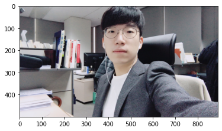
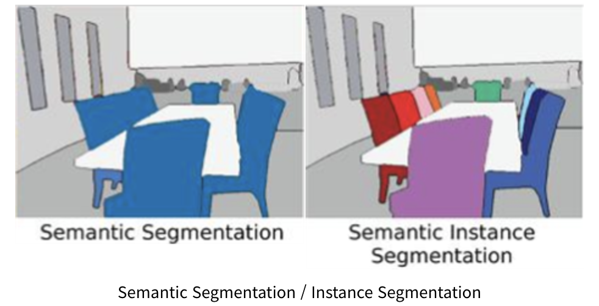
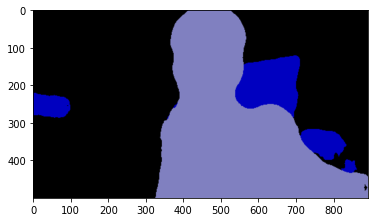
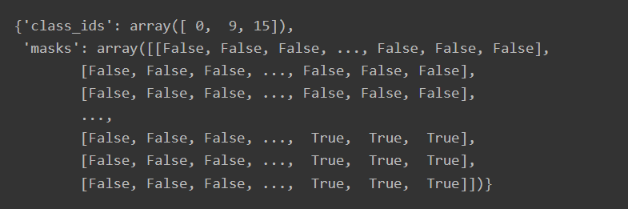
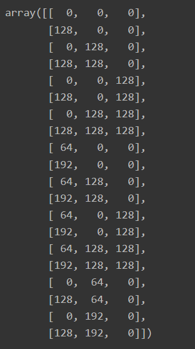
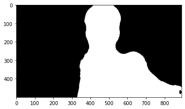
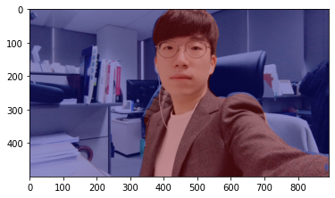
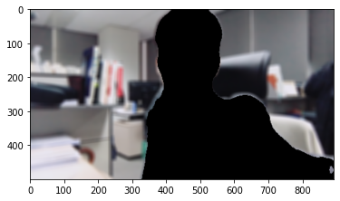

# 학습 내용 

---

- 셸로우 포커스 만들기 (1) 사진을 준비하자
- 셸로우 포커스 만들기 (2) 세그멘테이션으로 사람 분리하기
- 셸로우 포커스 만들기 (3) 시맨틱 세그멘테이션 다뤄보기
- 셸로우 포커스 만들기 (4) 배경 흐리게 하기
- 셸로우 포커스 만들기 (5) 흐린 배경과 원본 영상 합성

---

## 셸로우 포커스 만들기 (1) 사진을 준비하자

---

후가공 '인물사진 모드'인 사진 만드는 순서

	- 배경이 있는 셀카를 촬영합니다. (배경과 사람의 거리가 약간 멀리 있으면 좋습니다.)
	- 시맨틱 세그멘테이션(Semantic segmentation)으로 피사체(사람)와 배경을 분리합니다.
	- 블러링(blurring) 기술로 배경을 흐리게 합니다.
	- 피사체를 배경의 원래 위치에 합성합니다.

---

활용할 사진

필요한 라이브러리 import

	'''

	# os: Operating System의 줄임말로, 운영체제에서 제공되는 여러 기능을 파이썬에서 사용할 수 있도록 함 (Ex. 디렉토리 경로 이동, 시스템 환경 변수 가져오기 등)
	# urllib: URL 작업을 위한 여러 모듈을 모은 패키지. (Ex. urllib.request, urllib.parse, ...)
	# cv2: OpenCV 라이브러리로, 실시간 컴퓨터 비전을 목적으로 한 프로그래밍 라이브러리
	# numpy(NumPy): 행렬이나 대규모 다차원 배열을 쉽게 처리할 수 있도록 지원하는 라이브러리. 데이터 구조 외에도 수치 계산을 위해 효율적으로 구현된 기능을 제공
	# pixellib: 이미지 및 비디오 segmentation을 수행하기 위한 라이브러리. 
	# pixellib.semantic: segmentation 기법 중, semantic segmentation을 쉽게 사용할 수 있도록 만든 라이브러리
	# matplotlib: 파이썬 프로그래밍 언어 및 수학적 확장 NumPy 라이브러리를 활용한 플로팅 라이브러리로, 데이터 시각화 도구
	import os
	import urllib
	import cv2
	import numpy as np
	from pixellib.semantic import semantic_segmentation
	from matplotlib import pyplot as plt

	'''

이미지 읽어오기

	'''
	
	# os 모듈에 있는 getenv() 함수를 이용하여 읽고싶은 파일의 경로를 file_path에 저장
	# 준비한 이미지 파일의 경로를 이용하여, 이미지 파일을 읽음
	# cv2.imread(경로): 경로에 해당하는 이미지 파일을 읽어서 변수에 저장
	img_path = os.getenv('HOME')+'/aiffel/human_segmentation/images/my_image.png'  
	img_orig = cv2.imread(img_path) 

	print(img_orig.shape)

	# cv2.cvtColor(입력 이미지, 색상 변환 코드): 입력 이미지의 색상 채널을 변경
	# cv2.COLOR_BGR2RGB: 이미지 색상 채널을 변경 (BGR 형식을 RGB 형식으로 변경)
	# plt.imshow(): 저장된 데이터를 이미지의 형식으로 표시, 입력은 RGB(A) 데이터 혹은 2D 스칼라 데이터
	# https://matplotlib.org/stable/api/_as_gen/matplotlib.pyplot.imshow.html
	# plt.show(): 현재 열려있는 모든 figure를 표시 (여기서 figure는 이미지, 그래프 등)
	# https://matplotlib.org/stable/api/_as_gen/matplotlib.pyplot.show.html
	plt.imshow(cv2.cvtColor(img_orig, cv2.COLOR_BGR2RGB))
	plt.show()

	'''

---

## 셸로우 포커스 만들기 (2) 세그멘테이션으로 사람 분리하기

---

이미지 세그멘테이션(image segmentation)?

	이미지에서 픽셀 단위로 관심 객체를 추출하는 방법

		-> 모든 픽셀에 라벨을 할당, 라벨이 같은 객체들은 "공통적인 특징"을 가진다는 가정이 존재

시맨틱 세그멘테이션(semantic segmentation)?

	우리가 인식하는 세계처럼 물리적 의미 단위로 인식하는 세그멘테이션

		-> 이미지에서 픽셀을 사람, 자동차, 비행기 등의 물리적 단위로 분류(classification)하는 방법

			-> 추상적인 정보를 이미지에서 추출해 내는 방법(사람이 누구인지 관계없이 같은 라벨로 표현)

인스턴스 세그멘테이션(Instance segmentation)?

	사람 개개인별로 다른 라벨을 가지게 함

		->  여러 사람이 한 이미지에 등장할 때 각 객체를 분할해서 인식하자는 것이 목표

---

Q. 인스턴스 세그멘테이션 데이터셋과 라벨이 존재하면 시맨틱 세그멘테이션을 학습시킬 수 있을까요?

	인스턴스의 id 뿐만이 아닌 클래스 라벨이 존재해야 시맨틱 세그멘테이션으로 학습이 가능합니다. 근본적으로는 다른 개념이지만 대부분의 데이터셋은 인스턴스 라벨이 있는 경우 클래스 라벨도 함께 존재합니다.

---

딥러닝에 기반한 방법 이전에는 어떻게 이미지 세그멘테이션을 했을까?

워터쉐드 세그멘테이션(watershed segmentation)?

	이미지에서 영역을 분할하는 가장 간단한 방법은 물체의 '경계'를 나누는 것 / 참조([opencv-python tutorial](https://opencv-python.readthedocs.io/en/latest/doc/27.imageWaterShed/imageWaterShed.html))

		- 이미지는 그레이스케일(grayscale)로 변환하면 0~255의 값을 가짐
		- 픽셀 값을 이용해서 각 위치의 높고 낮음을 구분할 수 있음
		- 낮은 부분부터 서서히 '물'을 채워 나간다고 생각하면 각 영역에서 점점 물이 차오르다가 넘치는 시점이 생기게 됨
		- 그 부분을 경계선으로 만들면 물체를 서로 구분할 수 있게 됨

---

## 셸로우 포커스 만들기 (3) 시맨틱 세그멘테이션 다뤄보기

---

DeepLab이라는 세그멘테이션 모델을 이용

	DeepLab에 대한 자세한 설명([DeepLab V3+: Encoder-Decoder with Atrous Separable Convolution for Semantic Image Segmentation](https://bloglunit.wordpress.com/2018/07/02/deeplab-v3-encoder-decoder-with-atrous-separable-convolution-for-semantic-image-segmentation/))

DeepLab 모델을 준비

	PixelLib를 이용하면 편하게 사용 가능

	'''

	# 저장할 파일 이름을 결정합니다
	# 1. os.getenv(x)함수는 환경 변수x의 값을 포함하는 문자열 변수를 반환합니다. model_dir 에 "/aiffel/human_segmentation/models" 저장
	# 2. #os.path.join(a, b)는 경로를 병합하여 새 경로 생성 model_file 에 "/aiffel/aiffel/human_segmentation/models/deeplabv3_xception_tf_dim_ordering_tf_kernels.h5" 저장
	# 1
	model_dir = os.getenv('HOME')+'/aiffel/human_segmentation/models' 
	# 2
	model_file = os.path.join(model_dir, 'deeplabv3_xception_tf_dim_ordering_tf_kernels.h5') 

	# PixelLib가 제공하는 모델의 url입니다
	model_url = 'https://github.com/ayoolaolafenwa/PixelLib/releases/download/1.1/deeplabv3_xception_tf_dim_ordering_tf_kernels.h5' 

	# 다운로드를 시작합니다
	urllib.request.urlretrieve(model_url, model_file) # urllib 패키지 내에 있는 request 모듈의 urlretrieve 함수를 이용해서 model_url에 있는 파일을 다운로드 해서 model_file 파일명으로 저장

	'''

다운로드한 모델을 이용해 PixelLib로 우리가 사용할 세그멘테이션 모델 생성

	'''

	model = semantic_segmentation() #PixelLib 라이브러리 에서 가져온 클래스를 가져와서 semantic segmentation을 수행하는 클래스 인스턴스를 만듬
	model.load_pascalvoc_model(model_file) # pascal voc에 대해 훈련된 예외 모델(model_file)을 로드하는 함수를 호출

	'''

모델에 이미지입력

	'''

	segvalues, output = model.segmentAsPascalvoc(img_path) # segmentAsPascalvoc()함 수 를 호출 하여 입력된 이미지를 분할, 분할 출력의 배열을 가져옴, 분할 은 pacalvoc 데이터로 학습된 모델을 이용

	'''

		->  PASCAL VOC 데이터로 학습된 모델을 이용

			-> 모델마다 학습시킨 데이터에 따라 결괏값이 달라지므로 어떤 데이터를 학습시켰는지 확인하는 것은 매우 중요

	- [PASCAL VOC](http://host.robots.ox.ac.uk/pascal/VOC/)

PASCAL VOC 데이터의 라벨 종류 정의

	'''

	#pascalvoc 데이터의 라벨종류
	LABEL_NAMES = [
	    'background', 'aeroplane', 'bicycle', 'bird', 'boat', 'bottle', 'bus',
	    'car', 'cat', 'chair', 'cow', 'diningtable', 'dog', 'horse', 'motorbike',
	    'person', 'pottedplant', 'sheep', 'sofa', 'train', 'tv'
	]
	len(LABEL_NAMES)

	'''

	결과: 21

		-> background를 제외하면 20개의 클래스 존재

모델에서 나온 출력값 확인

	'''

	#segmentAsPascalvoc() 함수 를 호출하여 입력된 이미지를 분할한 뒤 나온 결과값 중 output을 matplotlib을 이용해 출력
	plt.imshow(output)
	plt.show()

	'''

입력된 이미지를 분할한 뒤 나온 결과값 중 배열값을 출력

	'''

	segvalues # segmentAsPascalvoc() 함수를 호출하여 입력된 이미지를 분할한 뒤 나온 결과값 중 배열값을 출력

	'''

pacalvoc에 담겨있는 라벨을 출력

	'''

	#segvalues에 있는 class_ids를 담겨있는 값을 통해 pacalvoc에 담겨있는 라벨을 출력
	for class_id in segvalues['class_ids']:
	    print(LABEL_NAMES[class_id])

	'''

	결과: background / chair / person

output 

	-> 세그멘테이션이 된 결과가 각각 다른 색상으로 담겨 있음

segvalues

	-> class_ids와 masks 존재

		-> class_ids를 통해 어떤 물체가 담겨 있는지 알 수 있음

물체마다 output에 어떤 색상으로 나타나 있는지 확인

	'''

	# 아래 코드를 이해하지 않아도 좋습니다
	# PixelLib에서 그대로 가져온 코드입니다
	# 주목해야 할 것은 생상 코드 결과물이예요!

	#컬러맵 만들기 
	colormap = np.zeros((256, 3), dtype = int)
	ind = np.arange(256, dtype=int)

	for shift in reversed(range(8)):
	    for channel in range(3):
	        colormap[:, channel] |= ((ind >> channel) & 1) << shift
	    ind >>= 3

	colormap[:20] #생성한 20개의 컬러맵 출력

	'''

	-> PixelLib에 따르면 위와 같은 색을 사용한다고 함

사람을 나타내는 15번째 색상은 ?

	'''

	colormap[15] #컬러맵 15에 해당하는 배열 출력 (pacalvoc에 LABEL_NAMES 15번째인 사람)

	'''

	결과: array([192, 128, 128])

		-> colormap은 RGB 순서

RGB 순서로 바꾸기

	'''

	seg_color = (128,128,192) # 색상순서 변경 - colormap의 배열은 RGB 순이며 output의 배열은 BGR 순서로 채널 배치가 되어 있어서

	'''

seg_color로만 이루어진 마스크 생성

	'''

	# output의 픽셀 별로 색상이 seg_color와 같다면 1(True), 다르다면 0(False)이 됩니다
	# seg_color 값이 person을 값이 므로 사람이 있는 위치를 제외하고는 gray로 출력
	# cmap 값을 변경하면 다른 색상으로 확인이 가능함
	seg_map = np.all(output==seg_color, axis=-1) 
	print(seg_map.shape) 
	plt.imshow(seg_map, cmap='gray')
	plt.show()

	'''

원래 이미지와 겹쳐 보기

	'''

	# 원본이미지를 img_show에 할당한뒤 이미지 사람이 있는 위치와 배경을 분리해서 표현한 color_mask 를 만든뒤 두 이미지를 합쳐서 출력
	img_show = img_orig.copy()

	# True과 False인 값을 각각 255과 0으로 바꿔줍니다
	img_mask = seg_map.astype(np.uint8) * 255

	# 255와 0을 적당한 색상으로 바꿔봅니다
	color_mask = cv2.applyColorMap(img_mask, cv2.COLORMAP_JET)

	# 원본 이미지와 마스트를 적당히 합쳐봅니다
	# 0.6과 0.4는 두 이미지를 섞는 비율입니다.
	img_show = cv2.addWeighted(img_show, 0.6, color_mask, 0.4, 0.0)

	plt.imshow(cv2.cvtColor(img_show, cv2.COLOR_BGR2RGB))
	plt.show()

	'''

---

## 셸로우 포커스 만들기 (4) 배경 흐리게 하기

---

배경을 흐리게 만글기

	blur() 함수를 이용

	'''

	# (13,13)은 blurring kernel size를 뜻합니다
	# 다양하게 바꿔보세요
	img_orig_blur = cv2.blur(img_orig, (13,13))

	# plt.imshow(): 저장된 데이터를 이미지의 형식으로 표시한다.
	# cv2.cvtColor(입력 이미지, 색상 변환 코드): 입력 이미지의 색상 채널을 변경
	# cv2.COLOR_BGR2RGB: 원본이 BGR 순서로 픽셀을 읽다보니
	# 이미지 색상 채널을 변경해야함 (BGR 형식을 RGB 형식으로 변경)   
	plt.imshow(cv2.cvtColor(img_orig_blur, cv2.COLOR_BGR2RGB))
	plt.show()

	'''

흐려진 이미지에서 세그멘테이션 마스크를 이용해 배경만 추출

	'''

	# cv2.cvtColor(입력 이미지, 색상 변환 코드): 입력 이미지의 색상 채널을 변경
	# cv2.COLOR_BGR2RGB: 원본이 BGR 순서로 픽셀을 읽다보니
	# 이미지 색상 채널을 변경해야함 (BGR 형식을 RGB 형식으로 변경) 
	img_mask_color = cv2.cvtColor(img_mask, cv2.COLOR_GRAY2BGR)

	# cv2.bitwise_not(): 이미지가 반전됩니다. 배경이 0 사람이 255 였으나
	# 연산을 하고 나면 배경은 255 사람은 0입니다.
	img_bg_mask = cv2.bitwise_not(img_mask_color)

	# cv2.bitwise_and()을 사용하면 배경만 있는 영상을 얻을 수 있습니다.
	# 0과 어떤 수를 bitwise_and 연산을 해도 0이 되기 때문에 
	# 사람이 0인 경우에는 사람이 있던 모든 픽셀이 0이 됩니다. 결국 사람이 사라지고 배경만 남아요!
	img_bg_blur = cv2.bitwise_and(img_orig_blur, img_bg_mask)
	plt.imshow(cv2.cvtColor(img_bg_blur, cv2.COLOR_BGR2RGB))
	plt.show()
	
	'''

---

## 셸로우 포커스 만들기 (5) 흐린 배경과 원본 영상 합성

---

배경 영상과 사람 영상을 합치기

	'''

	# np.where(조건, 참일때, 거짓일때)
	# 세그멘테이션 마스크가 255인 부분만 원본 이미지 값을 가지고 오고 
	# 아닌 영역은 블러된 이미지 값을 사용합니다.
	img_concat = np.where(img_mask_color==255, img_orig, img_bg_blur)
	# plt.imshow(): 저장된 데이터를 이미지의 형식으로 표시한다.
	# cv2.cvtColor(입력 이미지, 색상 변환 코드): 입력 이미지의 색상 채널을 변경
	# cv2.COLOR_BGR2RGB: 원본이 BGR 순서로 픽셀을 읽다보니 
	# 이미지 색상 채널을 변경해야함 (BGR 형식을 RGB 형식으로 변경)
	plt.imshow(cv2.cvtColor(img_concat, cv2.COLOR_BGR2RGB))
	plt.show()

	'''

Q. 이번에는 사람 부분을 블러로, 배경 부분을 원본으로 출력

	'''

	# 힌트 : img_mask_color 옵션을 적절히 조정해주고, img_orig, img_orig_blur 를 활용하세요.
	img_concat = np.where(img_mask_color==255, img_orig_blur, img_orig )
	plt.imshow(cv2.cvtColor(img_concat, cv2.COLOR_BGR2RGB))
	plt.show()

	'''

`
