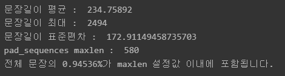
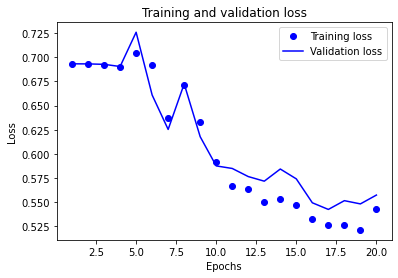
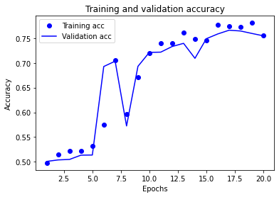
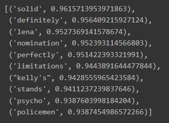
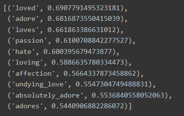

# 학습 내용

---

- 텍스트 감정분석의 유용성
- 텍스트 데이터의 특징
- 텍스트를 숫자로 표현하는 방법
- Embedding 레이어의 등장
- 시퀀스 데이터를 다루는 RNN
	- 시퀀스 데이터, RNN의 구조
- RNN의 효율성
- IMDB 영화리뷰 감성분석
	- IMDB 데이터셋 분석
	- 딥러닝 모델 설계와 훈련
	-  Word2Vec의 적용

---

## 텍스트 감정분석의 유용성

---

Q. 텍스트 데이터에서만 얻을 수 있는 유용한 정보는 무엇인가요? 그 유용성은 텍스트 데이터의 어떤 특징으로부터 비롯되는 것인가요?

	SNS 등에서 광범위한 분량의 텍스트 데이터를 쉽게 얻을 수 있는데, 이 데이터는 소비자들의 개인적, 감성적 반응이 직접 담겨 있을뿐더러 실시간 트렌드를 빠르게 반영하는 데이터이기도 하다.

Q. 텍스트 감성분석 접근법을 크게 2가지로 나누면 무엇과 무엇이 있나요?

	기계학습 기반 접근법과 감성사전 기반 접근법

Q. 사전 기반의 감성분석이 기계학습 기반 접근법 대비 가지는 한계점을 2가지만 들어 주세요.

	1 정의된 것만 사용 2 이모티콘 , 속어

Q. 감성분석 등 텍스트 분류 모델이 다른 데이터분석 업무에 어떤 도움을 줄 수 있나요?

	스팸 필터링

Q. 라벨링 비용이 많이 드는 머신러닝 기반 감성분석의 비용을 절감하면서 정확도를 크게 향상시킬 수 있는 자연어처리 기법에는 무엇이 있나요?

	워드 임베딩

---

## 텍스트 데이터의 특징

---

2가지 문제 발생

	- 텍스트를 어떻게 숫자 행렬로 표현할 수 있나요?
	- 텍스트에는 순서가 중요합니다. 입력 데이터의 순서를 인공지능 모델에 어떻게 반영해야 하나요?

해결책

	- Encoding
	- Embedding

---

## 텍스트를 숫자로 표현하는 방법

---

단어 사전을 만들어 볼 수는 있음

	 단어와 그 단어의 의미를 나타내는 벡터를 짝지어 보려고 하는 것

ex)

짧은 문장으로 이루어진 텍스트 데이터를 처리

	'''

	# 처리해야 할 문장을 파이썬 리스트에 옮겨 담았습니다.
	sentences=['i feel hungry', 'i eat lunch', 'now i feel happy']

	# 파이썬 split() 메소드를 이용해 단어 단위로 문장을 쪼개 봅니다.
	word_list = 'i feel hungry'.split()
	print(word_list)

	'''

	결과: ['i', 'feel', 'hungry']

텍스트 데이터로부터 사전을 만들기 위해 모든 문장을 단어 단위로 쪼갠 후에 파이썬 딕셔너리(dict) 자료구조로 표현

	'''

	index_to_word={}  # 빈 딕셔너리를 만들어서

	# 단어들을 하나씩 채워 봅니다. 채우는 순서는 일단 임의로 하였습니다. 그러나 사실 순서는 중요하지 않습니다. 
	# <BOS>, <PAD>, <UNK>는 관례적으로 딕셔너리 맨 앞에 넣어줍니다. 
	index_to_word[0]='<PAD>'  # 패딩용 단어
	index_to_word[1]='<BOS>'  # 문장의 시작지점
	index_to_word[2]='<UNK>'  # 사전에 없는(Unknown) 단어
	index_to_word[3]='i'
	index_to_word[4]='feel'
	index_to_word[5]='hungry'
	index_to_word[6]='eat'
	index_to_word[7]='lunch'
	index_to_word[8]='now'
	index_to_word[9]='happy'

	print(index_to_word)

	'''

	결과: {0: '<PAD>', 1: '<BOS>', 2: '<UNK>', 3: 'i', 4: 'feel', 5: 'hungry', 6: 'eat', 7: 'lunch', 8: 'now', 9: 'happy'}

 {텍스트:인덱스} 구조로 변경

	'''

	word_to_index={word:index for index, word in index_to_word.items()}
	print(word_to_index)

	'''

	결과: {'<PAD>': 0, '<BOS>': 1, '<UNK>': 2, 'i': 3, 'feel': 4, 'hungry': 5, 'eat': 6, 'lunch': 7, 'now': 8, 'happy': 9}

텍스트 데이터 -> 숫자

	'''

	# 문장 1개를 활용할 딕셔너리와 함께 주면, 단어 인덱스 리스트로 변환해 주는 함수를 만들어 봅시다.
	# 단, 모든 문장은 <BOS>로 시작하는 것으로 합니다. 
	def get_encoded_sentence(sentence, word_to_index):
	    return [word_to_index['<BOS>']]+[word_to_index[word] if word in word_to_index else word_to_index['<UNK>'] for word in sentence.split()]

	print(get_encoded_sentence('i eat lunch', word_to_index))

	'''

	결과: [1, 3, 6, 7]

		- <BOS> -> 1
		- i -> 3
		- eat -> 6
		- lunch -> 7

	-> 정수 인코딩

전체 정수 인코딩

	'''

	# 여러 개의 문장 리스트를 한꺼번에 숫자 텐서로 encode해 주는 함수입니다. 
	def get_encoded_sentences(sentences, word_to_index):
	    return [get_encoded_sentence(sentence, word_to_index) for sentence in sentences]

	# sentences=['i feel hungry', 'i eat lunch', 'now i feel happy'] 가 아래와 같이 변환됩니다. 
	encoded_sentences = get_encoded_sentences(sentences, word_to_index)
	print(encoded_sentences)

	'''

	결과: [[1, 3, 4, 5], [1, 3, 6, 7], [1, 8, 3, 4, 9]]

decode -> 원래 텍스트 데이터로 복구

	'''

	# 숫자 벡터로 encode된 문장을 원래대로 decode하는 함수입니다. 
	def get_decoded_sentence(encoded_sentence, index_to_word):
	    return ' '.join(index_to_word[index] if index in index_to_word else '<UNK>' for index in encoded_sentence[1:])  #[1:]를 통해 <BOS>를 제외

	print(get_decoded_sentence([1, 3, 4, 5], index_to_word))

	'''

	결과: i feel hungry

	'''

	# 여러 개의 숫자 벡터로 encode된 문장을 한꺼번에 원래대로 decode하는 함수입니다. 
	def get_decoded_sentences(encoded_sentences, index_to_word):
	    return [get_decoded_sentence(encoded_sentence, index_to_word) for encoded_sentence in encoded_sentences]

	# encoded_sentences=[[1, 3, 4, 5], [1, 3, 6, 7], [1, 8, 3, 4, 9]] 가 아래와 같이 변환됩니다.
	print(get_decoded_sentences(encoded_sentences, index_to_word))

	'''

	결과: ['i feel hungry', 'i eat lunch', 'now i feel happy']

---

## Embedding 레이어의 등장

---

텍스트가 숫자로 변환되어 인공지능 모델의 입력으로 사용될 수 있음

	이 벡터는 텍스트에 담긴 언어의 의미와 대응되는 벡터가 아니라 임의로 부여된 단어의 순서에 불과

우리가 하려는 것

	단어와 그 단어의 의미를 나타내는 벡터를 짝짓는 것!

		-> 단어의 의미를 나타내는 벡터를 훈련 가능한 파라미터로 놓고 이를 딥러닝을 통해 학습

			-> Embedding 레이어

임베딩(Embedding)이란?

	사람이 쓰는 자연어를 기계가 이해할 수 있는 숫자형태인 vector로 바꾼 결과 혹은 그 일련의 과정 전체를 의미

임베딩을 통해 할수있는 것?

	단어나 문장 사이의 코사인 유사도가 가장 높은 단어를 구하는 등의 계산, 단어들 사이의 의미/문법적 정보 도출 벡터 간 연산으로 단어 사이 문법적 관계 도출, 전이 학습(transfer learning)

성능 향상

	품질 좋은 임베딩을 쓸수록 모델의 성능이 좋아짐

주의해야 할 점

	Embedding 레이어의 인풋이 되는 문장 벡터는 그 길이가 일정해야 함

해결방법

	tf.keras.preprocessing.sequence.pad_sequences 메서드 사용해 문장 벡터 뒤에 패딩(<PAD>)을 추가하여 길이를 일정하게 맞춰줌

ex)

	'''

	vocab_size = len(word_to_index)  # 위 예시에서 딕셔너리에 포함된 단어 개수는 10
	word_vector_dim = 4    # 그림과 같이 4차원의 워드 벡터를 가정합니다.

	embedding = tf.keras.layers.Embedding(input_dim=vocab_size, output_dim=word_vector_dim, mask_zero=True)

	# tf.keras.preprocessing.sequence.pad_sequences를 통해 word vector를 모두 일정 길이로 맞춰주어야 
	# embedding 레이어의 input이 될 수 있음에 주의해 주세요. 
	raw_inputs = np.array(get_encoded_sentences(sentences, word_to_index), dtype=object)
	raw_inputs = tf.keras.preprocessing.sequence.pad_sequences(raw_inputs,
	                                                       value=word_to_index['<PAD>'],
	                                                       padding='post',
	                                                       maxlen=5)
	output = embedding(raw_inputs)
	print(output)

	'''

Q. output의 shape=(3, 5, 4)에서 3, 5, 4의 의미는 각각 무엇일까요?

	3 -> 샘플 수 / 4 -> 문장의 최대 길이 / 5 -> 축의 수

---

## 시퀀스 데이터를 다루는 RNN

---

텍스트 데이터를 다루는 데 주로 사용되는 딥러닝 모델

	Recurrent Neural Network(RNN)

시퀀스 데이터?

	입력이 시간 축을 따라 발생하는 데이터

ex) 

	- at time=0s : 듣는이의 귀에 들어온 input='i'
	- at time=1s : 듣는이의 귀에 들어온 input='feel'
	- at time=2s : 듣는이의 귀에 들어온 input='hungry'

Q. RNN의 정의대로라면 t=4 시점의 state h4는 t=4 시점의 input x4와 t=3 시점의 state h3가 결정합니다. 그렇다면 h4에는 t<4 이전의 입력 x1, x2, x3의 정보는 반영되지 않는 것일까요?

	반영됨

이전 예제에 RNN 모델 사용

	'''

	vocab_size = 10  # 어휘 사전의 크기입니다(10개의 단어)
	word_vector_dim = 4  # 단어 하나를 표현하는 임베딩 벡터의 차원수입니다. 

	model = tf.keras.Sequential()
	model.add(tf.keras.layers.Embedding(vocab_size, word_vector_dim, input_shape=(None,)))
	model.add(tf.keras.layers.LSTM(8))   # 가장 널리 쓰이는 RNN인 LSTM 레이어를 사용하였습니다. 이때 LSTM state 벡터의 차원수는 8로 하였습니다. (변경 가능)
	model.add(tf.keras.layers.Dense(8, activation='relu'))
	model.add(tf.keras.layers.Dense(1, activation='sigmoid'))  # 최종 출력은 긍정/부정을 나타내는 1dim 입니다.

	model.summary()

	'''

	결과:

	'''

	Model: "sequential"
	_________________________________________________________________
	Layer (type)                 Output Shape              Param #   
	=================================================================
	embedding_1 (Embedding)      (None, None, 4)           40        
	_________________________________________________________________
	lstm (LSTM)                  (None, 8)                 416       
	_________________________________________________________________
	dense (Dense)                (None, 8)                 72        
	_________________________________________________________________
	dense_1 (Dense)              (None, 1)                 9         
	=================================================================
	Total params: 537
	Trainable params: 537
	Non-trainable params: 0
	_________________________________________________________________

	'''

---

## RNN의 효율성

---

다른 모델

	- 1-D Convolution Neural Network(1-D CNN)
	- GlobalMaxPooling1D() 레이어 하나만 사용하는 모델

1-D Convolution Neural Network(1-D CNN)

	'''

	vocab_size = 10  # 어휘 사전의 크기입니다(10개의 단어)
	word_vector_dim = 4   # 단어 하나를 표현하는 임베딩 벡터의 차원 수입니다. 

	model = tf.keras.Sequential()
	model.add(tf.keras.layers.Embedding(vocab_size, word_vector_dim, input_shape=(None,)))
	model.add(tf.keras.layers.Conv1D(16, 7, activation='relu'))
	model.add(tf.keras.layers.MaxPooling1D(5))
	model.add(tf.keras.layers.Conv1D(16, 7, activation='relu'))
	model.add(tf.keras.layers.GlobalMaxPooling1D())
	model.add(tf.keras.layers.Dense(8, activation='relu'))
	model.add(tf.keras.layers.Dense(1, activation='sigmoid'))  # 최종 출력은 긍정/부정을 나타내는 1dim 입니다.

	'''
GlobalMaxPooling1D() 레이어 하나만 사용하는 모델

	'''

	vocab_size = 10  # 어휘 사전의 크기입니다(10개의 단어)
	word_vector_dim = 4   # 단어 하나를 표현하는 임베딩 벡터의 차원 수입니다. 

	model = tf.keras.Sequential()
	model.add(tf.keras.layers.Embedding(vocab_size, word_vector_dim, input_shape=(None,)))
	model.add(tf.keras.layers.GlobalMaxPooling1D())
	model.add(tf.keras.layers.Dense(8, activation='relu'))
	model.add(tf.keras.layers.Dense(1, activation='sigmoid'))  # 최종 출력은 긍정/부정을 나타내는 1dim 입니다.

	'''

---

## IMDB 데이터셋 분석

---

IMDb Large Movie Dataset?

	 50000개의 영어로 작성된 영화 리뷰 텍스트로 구성

	- 긍정 -> 1 라벨
	- 부정 -> 0 라벨

	25000개 -> 훈련용 데이터 / 25000개 -> 테스트용 데이터

데이터 로드

	'''

	imdb = tf.keras.datasets.imdb

	# IMDb 데이터셋 다운로드 
	(x_train, y_train), (x_test, y_test) = imdb.load_data(num_words=10000)
	print(f"훈련 샘플 개수: {len(x_train)}, 테스트 개수: {len(x_test)}")

	'''

	결과: 훈련 샘플 개수: 25000, 테스트 개수: 25000

		(num_words)를 10000으로 지정 -> 그 개수만큼의 word_to_index 딕셔너리까지 생성된 형태로 데이터셋이 생성

매핑 보정 작업 실시

	'''

	#실제 인코딩 인덱스는 제공된 word_to_index에서 index 기준으로 3씩 뒤로 밀려 있습니다.  
	word_to_index = {k:(v+3) for k,v in word_to_index.items()}

	# 처음 몇 개 인덱스는 사전에 정의되어 있습니다.
	word_to_index["<PAD>"] = 0
	word_to_index["<BOS>"] = 1
	word_to_index["<UNK>"] = 2  # unknown
	word_to_index["<UNUSED>"] = 3

	index_to_word = {index:word for word, index in word_to_index.items()}

	print(index_to_word[1])     # '<BOS>' 가 출력됩니다. 
	print(word_to_index['the'])  # 4 이 출력됩니다. 
	print(index_to_word[4])     # 'the' 가 출력됩니다.

	'''

데이터셋 상의 문장의 길이를 통일

	'''

	total_data_text = list(x_train) + list(x_test)
	# 텍스트데이터 문장길이의 리스트를 생성한 후
	num_tokens = [len(tokens) for tokens in total_data_text]
	num_tokens = np.array(num_tokens)
	# 문장길이의 평균값, 최대값, 표준편차를 계산해 본다. 
	print('문장길이 평균 : ', np.mean(num_tokens))
	print('문장길이 최대 : ', np.max(num_tokens))
	print('문장길이 표준편차 : ', np.std(num_tokens))

	# 예를들어, 최대 길이를 (평균 + 2*표준편차)로 한다면,  
	max_tokens = np.mean(num_tokens) + 2 * np.std(num_tokens)
	maxlen = int(max_tokens)
	print('pad_sequences maxlen : ', maxlen)
	print(f'전체 문장의 {np.sum(num_tokens < max_tokens) / len(num_tokens)}%가 maxlen 설정값 이내에 포함됩니다. ')

	'''

한 가지 유의해야 하는 것

	문장 뒤쪽('post') padding과 앞쪽('pre') padding이 모델의 성능 차이 발생

Q. RNN 활용 시 pad_sequences의 padding 방식은 'post'와 'pre' 중 어느 것이 유리할까요? 그 이유는 무엇일까요?

	pre / 뒤쪽 데이터가 더 중요하기 때문

padding 적용

	'''

	x_train = tf.keras.preprocessing.sequence.pad_sequences(x_train,
	                                                        value=word_to_index["<PAD>"],
	                                                        padding='post', # 혹은 'pre'
	                                                        maxlen=maxlen)

	x_test = tf.keras.preprocessing.sequence.pad_sequences(x_test,
	                                                       value=word_to_index["<PAD>"],
	                                                       padding='post', # 혹은 'pre'
	                                                       maxlen=maxlen)

	'''

---

## 딥러닝 모델 설계와 훈련

---

RNN 모델 설계

	'''

	vocab_size = 10000    # 어휘 사전의 크기입니다(10,000개의 단어)
	word_vector_dim = 16  # 워드 벡터의 차원 수 (변경 가능한 하이퍼파라미터)

	model = tf.keras.Sequential()
	model.add(tf.keras.layers.Embedding(vocab_size, word_vector_dim, input_shape=(None,)))
	model.add(tf.keras.layers.LSTM(8))   # 가장 널리 쓰이는 RNN인 LSTM 레이어를 사용하였습니다. 이때 LSTM state 벡터의 차원수는 8로 하였습니다. (변경 가능)
	model.add(tf.keras.layers.Dense(8, activation='relu'))
	model.add(tf.keras.layers.Dense(1, activation='sigmoid'))  # 최종 출력은 긍정/부정을 나타내는 1dim 입니다.

	'''

검증셋(validation set) 분리

	'''

	# validation set 10000건 분리
	x_val = x_train[:10000]   
	y_val = y_train[:10000]

	# validation set을 제외한 나머지 15000건
	partial_x_train = x_train[10000:]  
	partial_y_train = y_train[10000:]

	'''

model 학습

	'''

	model.compile(optimizer='adam',
	              loss='binary_crossentropy',
	              metrics=['accuracy'])
              
	epochs=20  # 몇 epoch를 훈련하면 좋을지 결과를 보면서 바꾸어 봅시다. 

	history = model.fit(partial_x_train,
	                    partial_y_train,
	                    epochs=epochs,
	                    batch_size=512,
	                    validation_data=(x_val, y_val),
	                    verbose=1)

	'''

모델 평가

	'''

	results = model.evaluate(x_test,  y_test, verbose=2)

	print(results)
	
	'''

	결과: 782/782 - 5s - loss: 0.5646 - accuracy: 0.7471 / [0.5646101236343384, 0.7470800280570984]

시각화

	'''

	import matplotlib.pyplot as plt

	acc = history_dict['accuracy']
	val_acc = history_dict['val_accuracy']
	loss = history_dict['loss']
	val_loss = history_dict['val_loss']

	epochs = range(1, len(acc) + 1)

	# "bo"는 "파란색 점"입니다
	plt.plot(epochs, loss, 'bo', label='Training loss')
	# b는 "파란 실선"입니다
	plt.plot(epochs, val_loss, 'b', label='Validation loss')
	plt.title('Training and validation loss')
	plt.xlabel('Epochs')
	plt.ylabel('Loss')
	plt.legend()

	plt.show()

	'''

	'''

	plt.clf()   # 그림을 초기화합니다

	plt.plot(epochs, acc, 'bo', label='Training acc')
	plt.plot(epochs, val_acc, 'b', label='Validation acc')
	plt.title('Training and validation accuracy')
	plt.xlabel('Epochs')
	plt.ylabel('Accuracy')
	plt.legend()

	plt.show()

	'''

---

## Word2Vec의 적용

---

감성 분류 모델이 학습이 잘 되었다면

	Embedding 레이어에 학습된 우리의 워드 벡터들도 의미 공간상에 유의미한 형태로 학습되었을 것

Embedding 레이어 가중치 저장후 유사한 단어 확인

	'''

	embedding_layer = model.layers[0]
	weights = embedding_layer.get_weights()[0]

	# 학습한 Embedding 파라미터를 파일에 써서 저장합니다. 
	word2vec_file_path = os.getenv('HOME')+'/aiffel/sentiment_classification/data/word2vec.txt'
	f = open(word2vec_file_path, 'w')
	f.write('{} {}\n'.format(vocab_size-4, word_vector_dim))  # 몇개의 벡터를 얼마 사이즈로 기재할지 타이틀을 씁니다.

	# 단어 개수(에서 특수문자 4개는 제외하고)만큼의 워드 벡터를 파일에 기록합니다. 
	vectors = model.get_weights()[0]
	for i in range(4,vocab_size):
	    f.write('{} {}\n'.format(index_to_word[i], ' '.join(map(str, list(vectors[i, :])))))
	f.close()

	from gensim.models.keyedvectors import Word2VecKeyedVectors

	word_vectors = Word2VecKeyedVectors.load_word2vec_format(word2vec_file_path, binary=False)

	word_vectors.similar_by_word("love")

	'''

Word2Vec?

	구글에서 제공하는 사전학습된(Pretrained) 워드 임베딩 모델

		-> 무려 1억 개의 단어로 구성된 Google News dataset을 바탕으로 학습

Q. 사전에 학습된 Word2Vec 등의 임베딩 모델을 활용하는 전이학습(Transfer Learning)이 유리한 이유를 설명해 보세요.

	좋은 임베딩을 사용하면 원하는 단어를 더 좋게 매칭 시키기 때문?

Word2Vec 모델 로드

	'''

	from gensim.models import KeyedVectors

	word2vec_path = os.getenv('HOME')+'/aiffel/sentiment_classification/data/GoogleNews-vectors-negative300.bin.gz'
	word2vec = KeyedVectors.load_word2vec_format(word2vec_path, binary=True, limit=1000000)

	'''

		-> 상위 100만 개만 limt으로 조건을 주어 로딩

유사한 단어 찾기

	'''

	# 메모리를 다소 많이 소비하는 작업이니 유의해 주세요.
	word2vec.similar_by_word("love")

	'''

모델의 임베딩 레이어를 Word2Vec의 것으로 교체해 다시 학습

	'''

	vocab_size = 10000    # 어휘 사전의 크기입니다(10,000개의 단어)
	word_vector_dim = 300  # 워드 벡터의 차원수
	embedding_matrix = np.random.rand(vocab_size, word_vector_dim)

	# embedding_matrix에 Word2Vec 워드 벡터를 단어 하나씩마다 차례차례 카피한다.
	for i in range(4,vocab_size):
	    if index_to_word[i] in word2vec:
	        embedding_matrix[i] = word2vec[index_to_word[i]]

	from tensorflow.keras.initializers import Constant

	# 모델 구성
	model = tf.keras.Sequential()
	model.add(tf.keras.layers.Embedding(vocab_size, 
	                                 word_vector_dim, 
	                                 embeddings_initializer=Constant(embedding_matrix),  # 카피한 임베딩을 여기서 활용
	                                 input_length=maxlen, 
	                                 trainable=True))   # trainable을 True로 주면 Fine-tuning
	model.add(tf.keras.layers.Conv1D(16, 7, activation='relu'))
	model.add(tf.keras.layers.MaxPooling1D(5))
	model.add(tf.keras.layers.Conv1D(16, 7, activation='relu'))
	model.add(tf.keras.layers.GlobalMaxPooling1D())
	model.add(tf.keras.layers.Dense(8, activation='relu'))
	model.add(tf.keras.layers.Dense(1, activation='sigmoid')) 

	# 학습의 진행
	model.compile(optimizer='adam',
	              loss='binary_crossentropy',
	              metrics=['accuracy'])
              
	epochs=20  # 몇 epoch를 훈련하면 좋을지 결과를 보면서 바꾸어 봅시다. 

	history = model.fit(partial_x_train,
	                    partial_y_train,
	                    epochs=epochs,
	                    batch_size=512,
	                    validation_data=(x_val, y_val),
	                    verbose=1)

	# 테스트셋을 통한 모델 평가
	results = model.evaluate(x_test,  y_test, verbose=2)

	print(results)

	'''

	결과: 782/782 - 2s - loss: 0.4930 - accuracy: 0.8661 / [0.49299851059913635, 0.8660799860954285]

		-> 5% 이상의 성능 향상
