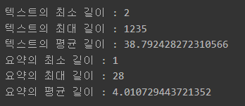
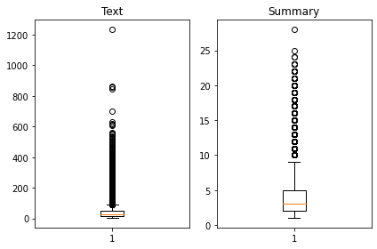
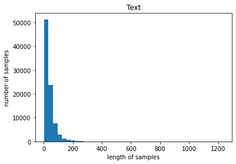
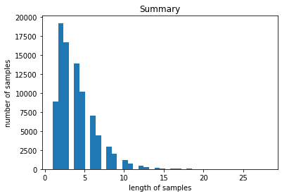
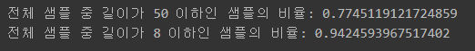
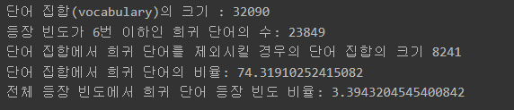
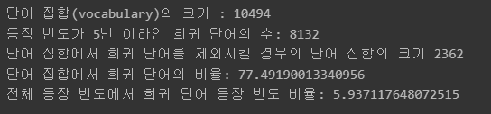
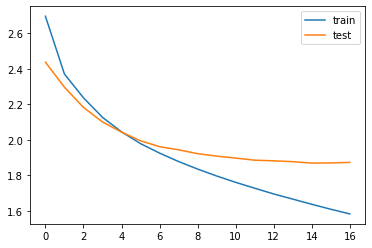
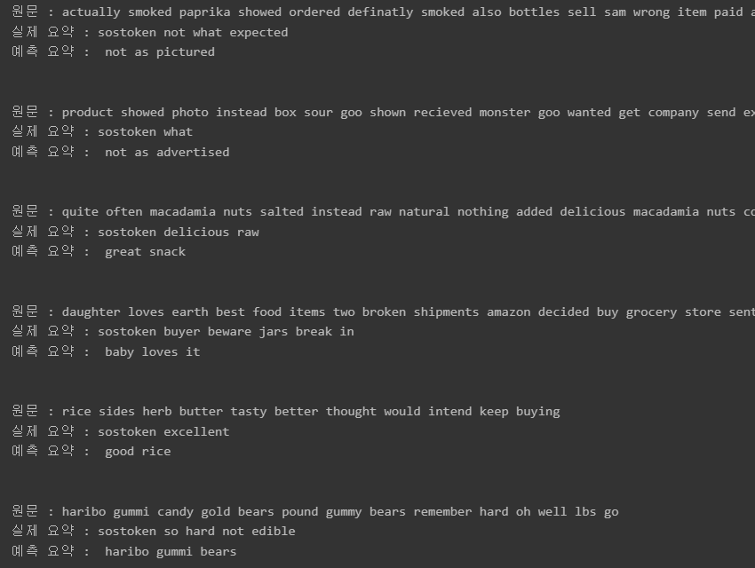
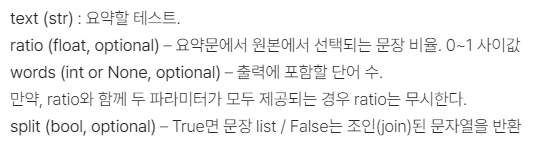

# 학습 내용

---

- 텍스트 요약(Text Summarization)
	- 추출적 요약(Extractive Summarization), 추상적 요약(Abstractive Summarization)에 대해서 알아봄
- 인공 신경망으로 텍스트 요약 훈련
	- seq2seq 모델에 대한 개요와 구조 그리고 요소들에 대해서 알아봄
- 데이터 준비
	- (Kaggle 제공)아마존 리뷰 데이터셋을 다운 후, 데이터 확인
- 데이터 전처리
	- 불용어 제거, 정규화, 정수인코딩 등의 데이터 전처리 과정 구현
- 모델 설계
	- 인코더와 디코더, 어텐션을 설계후 코드 구현
- 모델 훈련
	- EarlyStopping에 대해서 알아보고, 이를 적용해 모델 학습
- 인퍼런스 모델 구현
	- (정수 인덱스 행렬)결과값 -> 실제 데이터로 복원하는 인퍼런스 모델 구현
- 모델 테스트
	- 예측 요약문과 실제 요약문을 비교
- 추출적 요약 수행
	- summa 패키지를 사용해 추출적 요약(Extractive Summarization) 수행

---

## 텍스트 요약(Text Summarization)이란?

텍스트 요약(Text Summarization)이란?

	긴 길이의 문서(Document) 원문을 핵심 주제만으로 구성된 짧은 요약(Summary) 문장들로 변환하는 것

중요한 것

	요약 전후에 정보 손실 발생이 최소화되어야 한다는 점

1. 추출적 요약(Extractive Summarization)

	단어 그대로 원문에서 문장들을 추출해서 요약하는 방식

단점

	결과로 나온 문장들 간의 호응이 자연스럽지 않을 수 있다는 것

작동 방식

	(전통적인 머신 러닝 방식)텍스트 랭크(TextRank)와 같은 알고리즘 사용

2. 추상적 요약(Abstractive Summarization)

	원문으로부터 내용이 요약된 새로운 문장을 생성해내는 것

---

Q. RNN은 학습 데이터의 길이가 길어질수록 먼 과거의 정보를 현재에 전달하기 어렵다는 문제가 있습니다. 이 문제를 해결하기 위해 LSTM과 GRU가 등장했고, 이 둘도 부족해서 어텐션(Attention) 메커니즘이 등장했지요. 이 문제의 이름은 무엇인가요?

	장기기억 의존성 문제

Q. 구글에서 텍스트 요약을 위해 시도했던 접근법 중에, 텍스트마이닝 분야의 '역문서빈도(IDF)같은' 지표를 활용해 문서 안에서 중요해 보이는 부분을 추출하고 그걸 요약문에 담는 방식을 썼을 때의 문제점은 무엇이었나요?

	문맥 이해 부족

Q. 구글은 짧은 문장. 요약문을 생성하는 모델을 딥 러닝을 통해 end-to-end로 설계하도록 했어요. 구글이 메일서비스에 적용한 자동 회신(Smart Reply) 기능을 만든 것과 비슷한 딥러닝 기법이기도 한 인코더와 디코더의 구조로 구성된 이 딥 러닝 아키텍처의 이름은 무엇일까요?

	스퀀스-투-스퀀스

---

## 인공 신경망으로 텍스트 요약 훈련

---

seq2seq?

	두 개의 RNN 아키텍처를 사용하여 입력 시퀀스로부터 출력 시퀀스를 생성해 내는 자연어 생성 모델

LSTM?

	바닐라 RNN과 다른 점은 다음 time step의 셀에 hidden state뿐만 아니라, cell state도 함께 전달한다는 점

---

시작 토큰과 종료 토큰

seq2seq 구조

	- 시작 토큰 SOS가 입력 -> 각 시점마다 단어를 생성
	- 종료 토큰 EOS를 예측하는 순간까지 멈추지 않음

---

어텐션 메커니즘을 통한 새로운 컨텍스트 벡터 사용

기존의 seq2seq 한계점

	인코더의 마지막 time step의 hidden state를 컨텍스트 벡터로 사용

		->  기존 RNN의 한계로 인해 이 컨텍스트 정보에는 이미 입력 시퀀스의 많은 정보가 손실이 된 상태

어텐션 메커니즘(Attention Mechanism)?

	인코더의 모든 step의 hidden state의 정보가 컨텍스트 벡터에 전부 반영되도록 하는 것

작동 방식 

	인코더의 모든 hidden state가 동일한 비중으로 반영되는 것이 아니라, 디코더의 현재 time step의 예측에 인코더의 각 step이 얼마나 영향을 미치는지에 따른 가중합으로 계산되는 방식

주의해야 할 것

	 hidden state의 가중치 값은 디코더의 현재 스텝이 어디냐에 따라 계속 달라진다는 점

		-> 디코더의 현재 문장 생성 부위가 주어부인지 술어부인지 목적어인지 등에 따라 인코더가 입력 데이터를 해석한 컨텍스트 벡터가 다른 값이 된다는 것

---

## 데이터 준비

---

사용할 데이터셋

	 Kaggle에서 제공된 아마존 리뷰 데이터셋

불용어 사전

	 NLTK의 불용어(stopwords)를 사용

NLTK?

	Natural Language Toolkit의 축약어로 영어 기호, 통계, 자연어 처리를 위한 라이브러리

불용어 사전을 다운 및 필요한 라이브러리 immport

	'''

	import nltk
	nltk.download('stopwords')

	import numpy as np
	import pandas as pd
	import os
	import re
	import matplotlib.pyplot as plt
	from nltk.corpus import stopwords
	from bs4 import BeautifulSoup 
	from tensorflow.keras.preprocessing.text import Tokenizer 
	from tensorflow.keras.preprocessing.sequence import pad_sequences
	import urllib.request
	import warnings
	warnings.filterwarnings("ignore", category=UserWarning, module='bs4')

	'''

데이터 10만 개의 샘플로 제한

	'''

	data = pd.read_csv(os.getenv("HOME")+"/aiffel/news_summarization/data/Reviews.csv", nrows=100000)

	'''

 Summary 컬럼과 Text 컬럼만 사용

	'''

	data = data[["Summary","Text"]]

	'''

---

## 데이터 정리

---

중복 샘플과 NULL 값이 존재하는 샘플 제거

중복 제거

	'''

	# inplace=True 를 설정하면 DataFrame 타입 값을 return 하지 않고 data 내부를 직접적으로 바꿉니다
	data.drop_duplicates(subset = ['Text'], inplace=True)

	'''

결측치 확인후 제거

	'''

	print(data.isnull().sum())

	'''

	'''

	data.dropna(axis=0, inplace=True)

	'''

---

텍스트 정규화와 불용어 제거

같은 의미인데도 다른 표현쓰인 단어

	it'll == it will / mustn't == must not

		-> 같은 표현으로 통일시켜줘야 함

			->  텍스트 정규화(text normalization)

[정규화 사전](https://stackoverflow.com/questions/19790188/expanding-english-language-contractions-in-python)

위 링크를 참고해 정규화 사전 정의

	'''

	contractions = {"ain't": "is not", "aren't": "are not","can't": "cannot", "'cause": "because", "could've": "could have", "couldn't": "could not",
	                           "didn't": "did not",  "doesn't": "does not", "don't": "do not", "hadn't": "had not", "hasn't": "has not", "haven't": "have not",
	                           "he'd": "he would","he'll": "he will", "he's": "he is", "how'd": "how did", "how'd'y": "how do you", "how'll": "how will", "how's": "how is",
	                           "I'd": "I would", "I'd've": "I would have", "I'll": "I will", "I'll've": "I will have","I'm": "I am", "I've": "I have", "i'd": "i would",
	                           "i'd've": "i would have", "i'll": "i will",  "i'll've": "i will have","i'm": "i am", "i've": "i have", "isn't": "is not", "it'd": "it would",
	                           "it'd've": "it would have", "it'll": "it will", "it'll've": "it will have","it's": "it is", "let's": "let us", "ma'am": "madam",
	                           "mayn't": "may not", "might've": "might have","mightn't": "might not","mightn't've": "might not have", "must've": "must have",
	                           "mustn't": "must not", "mustn't've": "must not have", "needn't": "need not", "needn't've": "need not have","o'clock": "of the clock",
	                           "oughtn't": "ought not", "oughtn't've": "ought not have", "shan't": "shall not", "sha'n't": "shall not", "shan't've": "shall not have",
	                           "she'd": "she would", "she'd've": "she would have", "she'll": "she will", "she'll've": "she will have", "she's": "she is",
	                           "should've": "should have", "shouldn't": "should not", "shouldn't've": "should not have", "so've": "so have","so's": "so as",
	                           "this's": "this is","that'd": "that would", "that'd've": "that would have", "that's": "that is", "there'd": "there would",
	                           "there'd've": "there would have", "there's": "there is", "here's": "here is","they'd": "they would", "they'd've": "they would have",
	                           "they'll": "they will", "they'll've": "they will have", "they're": "they are", "they've": "they have", "to've": "to have",
	                           "wasn't": "was not", "we'd": "we would", "we'd've": "we would have", "we'll": "we will", "we'll've": "we will have", "we're": "we are",
	                           "we've": "we have", "weren't": "were not", "what'll": "what will", "what'll've": "what will have", "what're": "what are",
	                           "what's": "what is", "what've": "what have", "when's": "when is", "when've": "when have", "where'd": "where did", "where's": "where is",
	                           "where've": "where have", "who'll": "who will", "who'll've": "who will have", "who's": "who is", "who've": "who have",
	                           "why's": "why is", "why've": "why have", "will've": "will have", "won't": "will not", "won't've": "will not have",
	                           "would've": "would have", "wouldn't": "would not", "wouldn't've": "would not have", "y'all": "you all",
	                           "y'all'd": "you all would","y'all'd've": "you all would have","y'all're": "you all are","y'all've": "you all have",
	                           "you'd": "you would", "you'd've": "you would have", "you'll": "you will", "you'll've": "you will have",
	                           "you're": "you are", "you've": "you have"}

	print("정규화 사전의 수: ", len(contractions))

	'''

	결과: 정규화 사전의 수:  120

불용어(stopwords)?

	텍스트에는 자주 등장하지만 자연어 처리를 할 때 실질적으로 별 도움이 되지 않는 단어들

불용어 사전 확인

	'''

	print('불용어 개수 :', len(stopwords.words('english') ))
	print(stopwords.words('english'))

	'''

	결과: 불용어 개수 : 179 / ['i', 'me', 'my', 'myself', 'we', 'our', 'ours', 'ourselves', 'you', "you're", "you've", "you'll", "you'd", 'your', 'yours', 'yourself', 'yourselves', 'he', 'him', 'his', 'himself', 'she', "she's", 'her', 'hers', 'herself', 'it', "it's", 'its', 'itself', 'they', 'them', 'their', 'theirs', 'themselves', 'what', 'which', 'who', 'whom', 'this', 'that', "that'll", 'these', 'those', 'am', 'is', 'are', 'was', 'were', 'be', 'been', 'being', 'have', 'has', 'had', 'having', 'do', 'does', 'did', 'doing', 'a', 'an', 'the', 'and', 'but', 'if', 'or', 'because', 'as', 'until', 'while', 'of', 'at', 'by', 'for', 'with', 'about', 'against', 'between', 'into', 'through', 'during', 'before', 'after', 'above', 'below', 'to', 'from', 'up', 'down', 'in', 'out', 'on', 'off', 'over', 'under', 'again', 'further', 'then', 'once', 'here', 'there', 'when', 'where', 'why', 'how', 'all', 'any', 'both', 'each', 'few', 'more', 'most', 'other', 'some', 'such', 'no', 'nor', 'not', 'only', 'own', 'same', 'so', 'than', 'too', 'very', 's', 't', 'can', 'will', 'just', 'don', "don't", 'should', "should've", 'now', 'd', 'll', 'm', 'o', 're', 've', 'y', 'ain', 'aren', "aren't", 'couldn', "couldn't", 'didn', "didn't", 'doesn', "doesn't", 'hadn', "hadn't", 'hasn', "hasn't", 'haven', "haven't", 'isn', "isn't", 'ma', 'mightn', "mightn't", 'mustn', "mustn't", 'needn', "needn't", 'shan', "shan't", 'shouldn', "shouldn't", 'wasn', "wasn't", 'weren', "weren't", 'won', "won't", 'wouldn', "wouldn't"]

데이터 전처리 함수 정의

	'''

	# 데이터 전처리 함수
	def preprocess_sentence(sentence, remove_stopwords=True):
	    sentence = sentence.lower() # 텍스트 소문자화
	    sentence = BeautifulSoup(sentence, "lxml").text #  , <a href = ...> 등의 html 태그 제거
	    sentence = re.sub(r'\([^)]*\)', '', sentence) # 괄호로 닫힌 문자열 (...) 제거 Ex) my husband (and myself!) for => my husband for
	    sentence = re.sub('"','', sentence) # 쌍따옴표 " 제거
	    sentence = ' '.join([contractions[t] if t in contractions else t for t in sentence.split(" ")]) # 약어 정규화
	    sentence = re.sub(r"'s\b","", sentence) # 소유격 제거. Ex) roland's -> roland
	    sentence = re.sub("[^a-zA-Z]", " ", sentence) # 영어 외 문자(숫자, 특수문자 등) 공백으로 변환
	    sentence = re.sub('[m]{2,}', 'mm', sentence) # m이 3개 이상이면 2개로 변경. Ex) ummmmmmm yeah -> umm yeah
    
	    # 불용어 제거 (Text)
	    if remove_stopwords:
	        tokens = ' '.join(word for word in sentence.split() if not word in stopwords.words('english') if len(word) > 1)
	    # 불용어 미제거 (Summary)
	    else:
	        tokens = ' '.join(word for word in sentence.split() if len(word) > 1)
	    return tokens

	'''

		-> 요약 결과문이 자연스러운 문장이 되려면 이 불용어들이 Summary에는 남아 있는 게 더 좋을 것

데이터 전처리

	'''

	clean_text = []
	clean_summary = []

	for x in data["Text"]:
	    clean_text.append(preprocess_sentence(x))

	for x in data["Summary"]:
	    clean_summary.append(preprocess_sentence(x,False))

	'''

		-> 정제 과정에서 문장의 모든 단어가 사라지는 경우가 있을 수 있음

정제된 데이터 -> 데이터프레임화

	'''

	data['Text'] = clean_text
	data['Summary'] = clean_summary

	# 빈 값을 Null 값으로 변환
	data.replace('', np.nan, inplace=True)

	'''

다시 결측값 확인후 처리

	'''

	print(data.isnull().sum())

	'''

	'''

	data.dropna(axis=0, inplace=True)
	print('전체 샘플수 :', (len(data)))

	'''

---

## 훈련데이테 테스트데이터 나누기

---

샘플의 최대 길이 정하기

Text와 Summary의 최소, 최대, 평균 길이를 구하고 또한 길이 분포를 시각화

	'''

	# 길이 분포 출력
	import matplotlib.pyplot as plt

	text_len = [len(s.split()) for s in data['Text']]
	summary_len = [len(s.split()) for s in data['Summary']]

	print('텍스트의 최소 길이 : {}'.format(np.min(text_len)))
	print('텍스트의 최대 길이 : {}'.format(np.max(text_len)))
	print('텍스트의 평균 길이 : {}'.format(np.mean(text_len)))
	print('요약의 최소 길이 : {}'.format(np.min(summary_len)))
	print('요약의 최대 길이 : {}'.format(np.max(summary_len)))
	print('요약의 평균 길이 : {}'.format(np.mean(summary_len)))

	plt.subplot(1,2,1)
	plt.boxplot(text_len)
	plt.title('Text')
	plt.subplot(1,2,2)
	plt.boxplot(summary_len)
	plt.title('Summary')
	plt.tight_layout()
	plt.show()

	plt.title('Text')
	plt.hist(text_len, bins = 40)
	plt.xlabel('length of samples')
	plt.ylabel('number of samples')
	plt.show()

	plt.title('Summary')
	plt.hist(summary_len, bins = 40)
	plt.xlabel('length of samples')
	plt.ylabel('number of samples')
	plt.show()

	'''

최대 길이 정의

	'''

	text_max_len = 50
	summary_max_len = 8

	'''

얼마나 많은 샘플들을 자르지 않고 포함할 수 있는지 통계 확인

	'''

	def below_threshold_len(max_len, nested_list):
	  cnt = 0
	  for s in nested_list:
	    if(len(s.split()) <= max_len):
	        cnt = cnt + 1
	  print('전체 샘플 중 길이가 %s 이하인 샘플의 비율: %s'%(max_len, (cnt / len(nested_list))))

	below_threshold_len(text_max_len, data['Text'])
	below_threshold_len(summary_max_len,  data['Summary'])

	'''

text_max_len과 summary_max_len의 길이보다 큰 샘플을 제외

	'''

	data = data[data["Text"].apply(lambda x: len(x.split()) <= text_max_len) &
	              data["Summary"].apply(lambda x: len(x.split()) <= summary_max_len)]

	print('전체 샘플수 :', (len(data)))

	'''
	결과: 전체 샘플수 : 65818

---

시작 토큰과 종료 토큰 추가

(시작 토큰)sostoken, (종료 토큰)eostoken 추가

	'''

	# 요약 데이터에는 시작 토큰과 종료 토큰을 추가한다.
	data['decoder_input'] = data['Summary'].apply(lambda x : 'sostoken '+ x)
	data['decoder_target'] = data['Summary'].apply(lambda x : x + ' eostoken')

	'''

인코더의 입력, 디코더의 입력과 레이블 -> Numpy 타입

	'''

	encoder_input = np.array(data['Text']) # 인코더의 입력
	decoder_input = np.array(data['decoder_input']) # 디코더의 입력
	decoder_target = np.array(data['decoder_target']) # 디코더의 레이블

	'''

---

훈련 데이터 테스트 데이터 분리

encoder_input과 크기와 형태가 같은 순서가 섞인 정수 시퀀스 생성

	'''

	indices = np.arange(encoder_input.shape[0])
	np.random.shuffle(indices)

	'''

이 정수 시퀀스를 이용해 다시 데이터의 샘플 순서를 정의

	'''

	encoder_input = encoder_input[indices]
	decoder_input = decoder_input[indices]
	decoder_target = decoder_target[indices]

	'''

8:2의 비율 분리

	'''

	n_of_val = int(len(encoder_input)*0.2)

	encoder_input_train = encoder_input[:-n_of_val]
	decoder_input_train = decoder_input[:-n_of_val]
	decoder_target_train = decoder_target[:-n_of_val]

	encoder_input_test = encoder_input[-n_of_val:]
	decoder_input_test = decoder_input[-n_of_val:]
	decoder_target_test = decoder_target[-n_of_val:]

	'''

---

## 정수 인코딩

---

단어 집합(vocabulary) 만들기 및 정수 인코딩

단어 집합(vocabulary) 생성

	Keras의 토크나이저 사용

	'''
	src_tokenizer = Tokenizer() # 토크나이저 정의
	src_tokenizer.fit_on_texts(encoder_input_train) # 입력된 데이터로부터 단어 집합 생성

	'''

빈도수가 낮은 단어들 제외

	'''

	threshold = 7
	total_cnt = len(src_tokenizer.word_index) # 단어의 수
	rare_cnt = 0 # 등장 빈도수가 threshold보다 작은 단어의 개수를 카운트
	total_freq = 0 # 훈련 데이터의 전체 단어 빈도수 총 합
	rare_freq = 0 # 등장 빈도수가 threshold보다 작은 단어의 등장 빈도수의 총 합

	# 단어와 빈도수의 쌍(pair)을 key와 value로 받는다.
	for key, value in src_tokenizer.word_counts.items():
	    total_freq = total_freq + value

	    # 단어의 등장 빈도수가 threshold보다 작으면
	    if(value < threshold):
	        rare_cnt = rare_cnt + 1
	        rare_freq = rare_freq + value

	print('단어 집합(vocabulary)의 크기 :', total_cnt)
	print('등장 빈도가 %s번 이하인 희귀 단어의 수: %s'%(threshold - 1, rare_cnt))
	print('단어 집합에서 희귀 단어를 제외시킬 경우의 단어 집합의 크기 %s'%(total_cnt - rare_cnt))
	print("단어 집합에서 희귀 단어의 비율:", (rare_cnt / total_cnt)*100)
	print("전체 등장 빈도에서 희귀 단어 등장 빈도 비율:", (rare_freq / total_freq)*100)

	'''

단어 집합의 크기를 8,000으로 제한

	'''

	src_vocab = 8000
	src_tokenizer = Tokenizer(num_words=src_vocab) # 단어 집합의 크기를 8,000으로 제한
	src_tokenizer.fit_on_texts(encoder_input_train) # 단어 집합 재생성

	'''

		num_words 매개변수를 사용 ->  단어 집합의 크기 제한

텍스트 -> 정수

	'''

	# 텍스트 시퀀스를 정수 시퀀스로 변환
	encoder_input_train = src_tokenizer.texts_to_sequences(encoder_input_train) 
	encoder_input_test = src_tokenizer.texts_to_sequences(encoder_input_test)

	'''

Summary 데이터에도 적용

	'''

	tar_tokenizer = Tokenizer()
	tar_tokenizer.fit_on_texts(decoder_input_train)

	threshold = 6
	total_cnt = len(tar_tokenizer.word_index) # 단어의 수
	rare_cnt = 0 # 등장 빈도수가 threshold보다 작은 단어의 개수를 카운트
	total_freq = 0 # 훈련 데이터의 전체 단어 빈도수 총 합
	rare_freq = 0 # 등장 빈도수가 threshold보다 작은 단어의 등장 빈도수의 총 합

	# 단어와 빈도수의 쌍(pair)을 key와 value로 받는다.
	for key, value in tar_tokenizer.word_counts.items():
	    total_freq = total_freq + value

	    # 단어의 등장 빈도수가 threshold보다 작으면
	    if(value < threshold):
	        rare_cnt = rare_cnt + 1
	        rare_freq = rare_freq + value

	print('단어 집합(vocabulary)의 크기 :', total_cnt)
	print('등장 빈도가 %s번 이하인 희귀 단어의 수: %s'%(threshold - 1, rare_cnt))
	print('단어 집합에서 희귀 단어를 제외시킬 경우의 단어 집합의 크기 %s'%(total_cnt - rare_cnt))
	print("단어 집합에서 희귀 단어의 비율:", (rare_cnt / total_cnt)*100)
	print("전체 등장 빈도에서 희귀 단어 등장 빈도 비율:", (rare_freq / total_freq)*100)

	'''

	'''

	tar_vocab = 2000
	tar_tokenizer = Tokenizer(num_words=tar_vocab) 
	tar_tokenizer.fit_on_texts(decoder_input_train)
	tar_tokenizer.fit_on_texts(decoder_target_train)

	# 텍스트 시퀀스를 정수 시퀀스로 변환
	decoder_input_train = tar_tokenizer.texts_to_sequences(decoder_input_train) 
	decoder_target_train = tar_tokenizer.texts_to_sequences(decoder_target_train)
	decoder_input_test = tar_tokenizer.texts_to_sequences(decoder_input_test)
	decoder_target_test = tar_tokenizer.texts_to_sequences(decoder_target_test)

	'''

길이 0인 decoder_input, decoder_target

	sostoken, eostoken 토큰 값만 남아있음

		∴ 요약문의 길이가 1인 경우 삭제

요약문의 길이가 1인 경우 삭제

	'''

	drop_train = [index for index, sentence in enumerate(decoder_input_train) if len(sentence) == 1]
	drop_test = [index for index, sentence in enumerate(decoder_input_test) if len(sentence) == 1]

	print('삭제할 훈련 데이터의 개수 :', len(drop_train))
	print('삭제할 테스트 데이터의 개수 :', len(drop_test))

	encoder_input_train = [sentence for index, sentence in enumerate(encoder_input_train) if index not in drop_train]
	decoder_input_train = [sentence for index, sentence in enumerate(decoder_input_train) if index not in drop_train]
	decoder_target_train = [sentence for index, sentence in enumerate(decoder_target_train) if index not in drop_train]

	encoder_input_test = [sentence for index, sentence in enumerate(encoder_input_test) if index not in drop_test]
	decoder_input_test = [sentence for index, sentence in enumerate(decoder_input_test) if index not in drop_test]
	decoder_target_test = [sentence for index, sentence in enumerate(decoder_target_test) if index not in drop_test]

	print('훈련 데이터의 개수 :', len(encoder_input_train))
	print('훈련 레이블의 개수 :', len(decoder_input_train))
	print('테스트 데이터의 개수 :', len(encoder_input_test))
	print('테스트 레이블의 개수 :', len(decoder_input_test))

	'''

---

패딩

패딩 작업?

	서로 다른 길이의 샘플들을 병렬 처리하기 위해 같은 길이로 맞춰주는 것

패딩 적용

	'''

	encoder_input_train = pad_sequences(encoder_input_train, maxlen=text_max_len, padding='post')
	encoder_input_test = pad_sequences(encoder_input_test, maxlen=text_max_len, padding='post')
	decoder_input_train = pad_sequences(decoder_input_train, maxlen=summary_max_len, padding='post')
	decoder_target_train = pad_sequences(decoder_target_train, maxlen=summary_max_len, padding='post')
	decoder_input_test = pad_sequences(decoder_input_test, maxlen=summary_max_len, padding='post')
	decoder_target_test = pad_sequences(decoder_target_test, maxlen=summary_max_len, padding='post')

	'''

---

## 모델 설계

LSTM 인코더 설계

	'''

	from tensorflow.keras.layers import Input, LSTM, Embedding, Dense, Concatenate, TimeDistributed
	from tensorflow.keras.models import Model
	from tensorflow.keras.callbacks import EarlyStopping, ModelCheckpoint

	# 인코더 설계 시작
	embedding_dim = 128
	hidden_size = 256

	# 인코더
	encoder_inputs = Input(shape=(text_max_len,))

	# 인코더의 임베딩 층
	enc_emb = Embedding(src_vocab, embedding_dim)(encoder_inputs)

	# 인코더의 LSTM 1
	# encoder_lstm1 = LSTM(hidden_size, return_sequences=True, return_state=True ,dropout = 0.4, recurrent_dropout = 0.4)
	encoder_lstm1 = LSTM(hidden_size, return_sequences=True, return_state=True ,dropout = 0.4)
	x = encoder_lstm1(enc_emb)

	# 인코더의 LSTM 2
	encoder_lstm2 = LSTM(hidden_size, return_sequences=True, return_state=True ,dropout = 0.4)
	x = encoder_lstm2(x)

	# 인코더의 LSTM 3
	encoder_lstm3 = LSTM(hidden_size, return_sequences=True, return_state=True ,dropout = 0.4)
	encoder_outputs, state_h, state_c = encoder_lstm3(x)

	'''

디코더 설계

	'''

	# 디코더 설계
	decoder_inputs = Input(shape=(None,))

	# 디코더의 임베딩 층
	dec_emb_layer = Embedding(tar_vocab, embedding_dim)
	dec_emb = dec_emb_layer(decoder_inputs)

	# 디코더의 LSTM
	# decoder_lstm = LSTM(hidden_size, return_sequences=True, return_state=True, dropout=0.4, recurrent_dropout=0.2)
	decoder_lstm = LSTM(hidden_size, return_sequences=True, return_state=True, dropout=0.4)
	decoder_outputs, _, _ = decoder_lstm(dec_emb, initial_state=[state_h, state_c])

	'''

디코더의 출력층 설계

	'''

	# 디코더의 출력층
	decoder_softmax_layer = Dense(tar_vocab, activation='softmax')
	decoder_softmax_outputs = decoder_softmax_layer(decoder_outputs) 

	# 모델 정의
	model = Model([encoder_inputs, decoder_inputs], decoder_softmax_outputs)
	model.summary()

	'''

	결과:

	'''

	Model: "model"
	__________________________________________________________________________________________________
	Layer (type)                    Output Shape         Param #     Connected to                     
	==================================================================================================
	input_1 (InputLayer)            [(None, 50)]         0                                            
	__________________________________________________________________________________________________
	embedding (Embedding)           (None, 50, 128)      1024000     input_1[0][0]                    
	__________________________________________________________________________________________________
	lstm (LSTM)                     [(None, 50, 256), (N 394240      embedding[0][0]                  
	__________________________________________________________________________________________________
	input_3 (InputLayer)            [(None, None)]       0                                            
	__________________________________________________________________________________________________
	lstm_1 (LSTM)                   [(None, 50, 256), (N 525312      lstm[0][0]                       
	                                                                 lstm[0][1]                       
	                                                                 lstm[0][2]                       
	__________________________________________________________________________________________________
	embedding_2 (Embedding)         (None, None, 128)    256000      input_3[0][0]                    
	__________________________________________________________________________________________________
	lstm_2 (LSTM)                   [(None, 50, 256), (N 525312      lstm_1[0][0]                     
	                                                                 lstm_1[0][1]                     
	                                                                 lstm_1[0][2]                     
	__________________________________________________________________________________________________
	lstm_4 (LSTM)                   [(None, None, 256),  394240      embedding_2[0][0]                
	                                                                 lstm_2[0][1]                     
	                                                                 lstm_2[0][2]                     
	__________________________________________________________________________________________________
	dense (Dense)                   (None, None, 2000)   514000      lstm_4[0][0]                     
	==================================================================================================
	Total params: 3,633,104
	Trainable params: 3,633,104
	Non-trainable params: 0
	__________________________________________________________________________________________________

	'''

---

어텐션 메커니즘

	Bahdanau 스타일의 어텐션 사용

	'''

	from tensorflow.keras.layers import AdditiveAttention

	# 어텐션 층(어텐션 함수)
	attn_layer = AdditiveAttention(name='attention_layer')

	# 인코더와 디코더의 모든 time step의 hidden state를 어텐션 층에 전달하고 결과를 리턴
	attn_out = attn_layer([decoder_outputs, encoder_outputs])

	# 어텐션의 결과와 디코더의 hidden state들을 연결
	decoder_concat_input = Concatenate(axis=-1, name='concat_layer')([decoder_outputs, attn_out])

	# 디코더의 출력층
	decoder_softmax_layer = Dense(tar_vocab, activation='softmax')
	decoder_softmax_outputs = decoder_softmax_layer(decoder_concat_input)

	# 모델 정의
	model = Model([encoder_inputs, decoder_inputs], decoder_softmax_outputs)
	model.summary()

	'''

	결과:

	'''

	Model: "model_1"
	__________________________________________________________________________________________________
	Layer (type)                    Output Shape         Param #     Connected to                     
	==================================================================================================
	input_1 (InputLayer)            [(None, 50)]         0                                            
	__________________________________________________________________________________________________
	embedding (Embedding)           (None, 50, 128)      1024000     input_1[0][0]                    
	__________________________________________________________________________________________________
	lstm (LSTM)                     [(None, 50, 256), (N 394240      embedding[0][0]                  
	__________________________________________________________________________________________________
	input_3 (InputLayer)            [(None, None)]       0                                            
	__________________________________________________________________________________________________
	lstm_1 (LSTM)                   [(None, 50, 256), (N 525312      lstm[0][0]                       
	                                                                 lstm[0][1]                       
	                                                                 lstm[0][2]                       
	__________________________________________________________________________________________________
	embedding_2 (Embedding)         (None, None, 128)    256000      input_3[0][0]                    
	__________________________________________________________________________________________________
	lstm_2 (LSTM)                   [(None, 50, 256), (N 525312      lstm_1[0][0]                     
	                                                                 lstm_1[0][1]                     
	                                                                 lstm_1[0][2]                     
	__________________________________________________________________________________________________
	lstm_4 (LSTM)                   [(None, None, 256),  394240      embedding_2[0][0]                
	                                                                 lstm_2[0][1]                     
	                                                                 lstm_2[0][2]                     
	__________________________________________________________________________________________________
	attention_layer (AdditiveAttent (None, None, 256)    256         lstm_4[0][0]                     
	                                                                 lstm_2[0][0]                     
	__________________________________________________________________________________________________
	concat_layer (Concatenate)      (None, None, 512)    0           lstm_4[0][0]                     
	                                                                 attention_layer[0][0]            
	__________________________________________________________________________________________________
	dense_1 (Dense)                 (None, None, 2000)   1026000     concat_layer[0][0]               
	==================================================================================================
	Total params: 4,145,360
	Trainable params: 4,145,360
	Non-trainable params: 0
	__________________________________________________________________________________________________

	'''

---

## 모델 훈련

---

훈련 진행

	'''

	model.compile(optimizer='rmsprop', loss='sparse_categorical_crossentropy')
	es = EarlyStopping(monitor='val_loss', patience=2, verbose=1)
	history = model.fit(x=[encoder_input_train, decoder_input_train], y=decoder_target_train, \
	          validation_data=([encoder_input_test, decoder_input_test], decoder_target_test), \
	          batch_size=256, callbacks=[es], epochs=50)

	'''

		-> val_loss(검증 데이터의 손실)을 관찰하다가, 검증 데이터의 손실이 줄어들지 않고 증가하는 현상이 2회(patience=2) 관측되면 학습을 멈추도록 설정

train_loss, val_loss 시각화

	'''

	plt.plot(history.history['loss'], label='train')
	plt.plot(history.history['val_loss'], label='test')
	plt.legend()
	plt.show()

	'''

---

## 인퍼런스 모델 구현

---

정수 인덱스 행렬 -> 실제 데이터 복원

필요한 3개의 사전 정의

	'''

	src_index_to_word = src_tokenizer.index_word # 원문 단어 집합에서 정수 -> 단어를 얻음
	tar_word_to_index = tar_tokenizer.word_index # 요약 단어 집합에서 단어 -> 정수를 얻음
	tar_index_to_word = tar_tokenizer.index_word # 요약 단어 집합에서 정수 -> 단어를 얻음

	'''

정답 문장이 없는 인퍼런스 단계

	만들어야 할 문장의 길이만큼 디코더가 반복 구조로 동작

		-> 인퍼런스를 위한 모델을 별도로 설계

인퍼런스 인코더 설계

	'''

	# 인코더 설계
	encoder_model = Model(inputs=encoder_inputs, outputs=[encoder_outputs, state_h, state_c])

	# 이전 시점의 상태들을 저장하는 텐서
	decoder_state_input_h = Input(shape=(hidden_size,))
	decoder_state_input_c = Input(shape=(hidden_size,))

	dec_emb2 = dec_emb_layer(decoder_inputs)

	# 문장의 다음 단어를 예측하기 위해서 초기 상태(initial_state)를 이전 시점의 상태로 사용. 이는 뒤의 함수 decode_sequence()에 구현
	# 훈련 과정에서와 달리 LSTM의 리턴하는 은닉 상태와 셀 상태인 state_h와 state_c를 버리지 않음.
	decoder_outputs2, state_h2, state_c2 = decoder_lstm(dec_emb2, initial_state=[decoder_state_input_h, decoder_state_input_c])

	'''

인퍼런스 디코더 설계

	어텐션 메커니즘 사용

	'''

	# 어텐션 함수
	decoder_hidden_state_input = Input(shape=(text_max_len, hidden_size))
	attn_out_inf = attn_layer([decoder_outputs2, decoder_hidden_state_input])
	decoder_inf_concat = Concatenate(axis=-1, name='concat')([decoder_outputs2, attn_out_inf])

	# 디코더의 출력층
	decoder_outputs2 = decoder_softmax_layer(decoder_inf_concat) 

	# 최종 디코더 모델
	decoder_model = Model(
	    [decoder_inputs] + [decoder_hidden_state_input,decoder_state_input_h, decoder_state_input_c],
	    [decoder_outputs2] + [state_h2, state_c2])

	'''

단어 시퀀스를 완성하는 함수 정의

	'''

	def decode_sequence(input_seq):
	    # 입력으로부터 인코더의 상태를 얻음
	    e_out, e_h, e_c = encoder_model.predict(input_seq)

	     # <SOS>에 해당하는 토큰 생성
	    target_seq = np.zeros((1,1))
	    target_seq[0, 0] = tar_word_to_index['sostoken']

	    stop_condition = False
	    decoded_sentence = ''
	    while not stop_condition: # stop_condition이 True가 될 때까지 루프 반복

 	       output_tokens, h, c = decoder_model.predict([target_seq] + [e_out, e_h, e_c])
	        sampled_token_index = np.argmax(output_tokens[0, -1, :])
	        sampled_token = tar_index_to_word[sampled_token_index]

	        if (sampled_token!='eostoken'):
	            decoded_sentence += ' '+sampled_token

 	       #  <eos>에 도달하거나 최대 길이를 넘으면 중단.
	        if (sampled_token == 'eostoken'  or len(decoded_sentence.split()) >= (summary_max_len-1)):
	            stop_condition = True

	        # 길이가 1인 타겟 시퀀스를 업데이트
	        target_seq = np.zeros((1,1))
	        target_seq[0, 0] = sampled_token_index

	        # 상태를 업데이트 합니다.
	        e_h, e_c = h, c

	    return decoded_sentence

	'''

---

## 모델 테스트

---

정수 시퀀스 -> 텍스트 시퀀스 함수 정의

	'''

	# 원문의 정수 시퀀스를 텍스트 시퀀스로 변환
	def seq2text(input_seq):
	    temp=''
	    for i in input_seq:
	        if (i!=0):
	            temp = temp + src_index_to_word[i]+' '
	    return temp

	# 요약문의 정수 시퀀스를 텍스트 시퀀스로 변환
	def seq2summary(input_seq):
	    temp = ''
	    for i in input_seq:
	        # 0은 패딩된 값이므로 제외
	        if (i != 0 and i != tar_index_to_word.get('sostoken', -1) and i != tar_index_to_word.get('eostoken', -1)):
	            temp = temp + tar_index_to_word[i] + ' '
	    return temp.strip()

	'''

테스트

	'''

	for i in range(50, 100):
	    print("원문 :", seq2text(encoder_input_test[i]))
	    print("실제 요약 :", seq2summary(decoder_input_test[i]))
	    print("예측 요약 :", decode_sequence(encoder_input_test[i].reshape(1, text_max_len)))
	    print("\n")

	'''

---

## 추출적 요약 수행

---

패키지 설치

	'''

	pip install summa

	'''

데이터 다운

	'''

	import requests
	from summa.summarizer import summarize

	text = requests.get('http://rare-technologies.com/the_matrix_synopsis.txt').text

	'''

---

summarize 사용

Summa의 summarize()의 매개변수

추출적 요약 수행

	'''

	print('Summary:')
	print(summarize(text, ratio=0.005))

	'''

	결과:

	'''
 
	Summary:
	Morpheus, Trinity, Neo, Apoc, Switch, Mouse and Cypher are jacked into the Matrix.
	Trinity brings the helicopter down to the floor that Morpheus is on and Neo opens fire on the three Agents.

	'''

		- 출력 결과 -> list 
			- split=True

단어의 수로 요약문의 크기를 조절

	'''

	print('Summary:')
	print(summarize(text, words=50))

	'''

	결과:

	'''

	Summary:
	Trinity takes Neo to Morpheus.
	Morpheus, Trinity, Neo, Apoc, Switch, Mouse and Cypher are jacked into the Matrix.
	Trinity brings the helicopter down to the floor that Morpheus is on and Neo opens fire on the three Agents.

	'''
