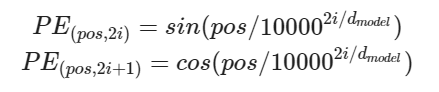
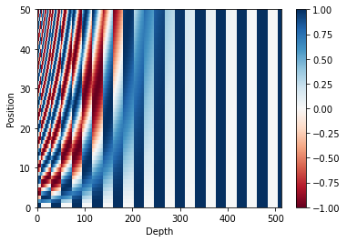
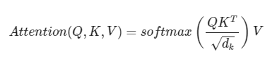
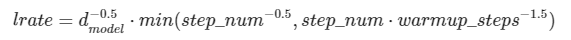

# 학습 내용

---

- 트랜스포머 구조 확인
- 트랜스포머, 인코더, 디코더
- 트랜스포머의 입력 이해
- 어텐션? 어텐션!
- 스케일드 닷 프로덕트 어텐션
- 머리가 여러개인 어텐션
- 마스킹
- 인코더
- 디코더
- 챗봇 병렬 데이터 받아오기
- 병렬 데이터 전처리
- 모델 정의 및 학습
- 챗봇 테스트

---

## 트랜스포머 구조 확인

---

트랜스포머?

	어텐션 매커니즘만으로 구성된 모델

트랜스포머 구조

	인코더 층(Encoder layer, 왼쪽) 과 디코더 층(Decoder layer, 오른쪽)

		-> 각 블록은 N개씩 반복 배치

			-> 인코더 층 N개가 이어져있고, 디코더 층 N개가 이어짐

인코더층 

	2개의 서브 레이어 존재

		- 멀티헤드 셀프 어텐션 (인코더 셀프 어텐션)
		- 피드포워드 신경망

	N번을 반복 통과한 후, 디코더 층으로 계산 결과를 보냄

디코더

	3개의 서브레이어 존재

		- 마스크드 멀티헤드 셀프 어텐션 (디코더 셀프 어텐션)
		- 멀티헤드 어텐션 (인코더-디코더 셀프 어텐션)
		- 피드포워드 신경망

	N번 반복 통과한 후, 계산 결과를 출력

임베딩 출력을 입력하기 전

	포지셔널 인코딩을 합치게 됨

---

## 트랜스포머, 인코더, 디코더

---

기존 구조

	인코더와 디코더 구성

		->  입력 문장을 넣으면 출력 문장을 내뱉음

트랜스포머 내부

	- 인코더의 층을 -> 정보를 뽑아냄
	- 디코더의 층을 -> 출력 문장의 단어를 하나씩 생성

트랜스포머 내부 확대

---
Q. 트랜스포머에서 인코더와 디코더는 어떤 역할을 수행하나요?

	- 인코더: 입력 문장을 임베딩하고 문장의 의미를 파악(문맥 이해)하여 디코더에 전달
	- 디코더: 인코더에서 전달 받은 정보를 기반으로 문장을 생성
---

## 트랜스포머의 입력 이해

필요한 라이브러리 import

	'''

	import tensorflow as tf
	import tensorflow_datasets as tfds
	import os
	import re
	import numpy as np
	import matplotlib.pyplot as plt

	'''

벡터화 과정?

	단어를 임베딩 벡터로 변환하는 과정

트랜스포머의 다른점

	임베딩 벡터에 포지셔널 인코딩(positional Encoding)을 더해 입력으로 사용

인코더 입력 부분 확대

이렇게 하는 이유?

	트랜스포머는 입력 -> 문장에 있는 모든 단어를 한꺼번에 입력으로 받기 때문

				->  'I ate lunch'와 'lunch ate I'를 구분할 수 없을지도 모름

	-> 같은 단어라도 그 단어가 문장의 몇 번째 어순으로 입력되었는지를 모델에 추가로 알려 주기 위함

		-> 위치 정보를 가진 벡터(Positional Encoding) 값을 더해줌

포지셔널 인코딩의 벡터값 공식

	- 사인 함수와 코사인 함수의 값을 임베딩 벡터에 더해줌
		- 단어의 순서 정보를 더해줌
	- 임베딩 벡터와 포지셔널 인코딩의 덧셈
		- (임베딩 벡터가 모여 만들어진)문장 벡터 행렬과 포지셔널 인코딩 행렬의 덧셈 연산
	- d_model ->  임베딩 벡터의 차원 의미
	- pos -> 입력 문장에서의 임베딩 벡터의 위치를 나타냄
	- i -> 임베딩 벡터 내의 차원의 인덱스 의미

---
Q. 한 문장에 같은 단어 A가 여러 번 등장하였다고 가정해보겠습니다. 임베딩 문장 행렬에 포지셔널 인코딩을 해주었을 때와 해주지 않았을 때, 트랜스포머가 임베딩 문장 행렬 내의 다수의 A 단어 벡터로부터 얻을 수 있는 정보의 차이는 어떤 것이 있을까요?

	같은 단어라고 하더라도 포지셔널 인코딩을 해준 경우에는 임베딩 벡터값이 달라지므로, 같은 단어라고 해도 각각 다른 위치에 등장했다는 사실을 모델에 알려줄 수 있음
---

포지셔널 인코딩 구현

	'''

	# 포지셔널 인코딩 레이어
	class PositionalEncoding(tf.keras.layers.Layer):

	  def __init__(self, position, d_model):
	    super(PositionalEncoding, self).__init__()
	    self.pos_encoding = self.positional_encoding(position, d_model)

	  def get_angles(self, position, i, d_model):
	    angles = 1 / tf.pow(10000, (2 * (i // 2)) / tf.cast(d_model, tf.float32))
 	   return position * angles

	  def positional_encoding(self, position, d_model):
	    # 각도 배열 생성
	    angle_rads = self.get_angles(
 	       position=tf.range(position, dtype=tf.float32)[:, tf.newaxis],
	        i=tf.range(d_model, dtype=tf.float32)[tf.newaxis, :],
	        d_model=d_model)

	    # 배열의 짝수 인덱스에는 sin 함수 적용
 	   sines = tf.math.sin(angle_rads[:, 0::2])
	    # 배열의 홀수 인덱스에는 cosine 함수 적용
	    cosines = tf.math.cos(angle_rads[:, 1::2])

	    # sin과 cosine이 교차되도록 재배열
	    pos_encoding = tf.stack([sines, cosines], axis=0)
	    pos_encoding = tf.transpose(pos_encoding,[1, 2, 0]) 
	    pos_encoding = tf.reshape(pos_encoding, [position, d_model])

	    pos_encoding = pos_encoding[tf.newaxis, ...]
	    return tf.cast(pos_encoding, tf.float32)

	  def call(self, inputs):
	    return inputs + self.pos_encoding[:, :tf.shape(inputs)[1], :]

	'''

행의 크기가 50, 열의 크기가 512인 행렬을 만드는 코드를 완성후 입력 벡터 모양 시각화

	'''

	r=50
	c=512

	sample_pos_encoding = PositionalEncoding(r, c)

	plt.pcolormesh(sample_pos_encoding.pos_encoding.numpy()[0], cmap='RdBu')
	plt.xlabel('Depth')
	plt.xlim((0, 512))
	plt.ylabel('Position')
	plt.colorbar()
	plt.show()

	'''

---
Q. 임베딩 벡터의 차원이 256이고 최대 문장의 길이가 30인 텍스트를 입력으로 하는 트랜스포머를 구현한다고 하였을 때, 적절한 포지셔널 인코딩 행렬의 크기를 추측해보고 위에 구현한 포지셔널 인코딩 레이어를 사용해 표현해 보세요.

	sample_pos_encoding = PositionalEncoding(30, 256)
---

## 어텐션? 어텐션!

---

어텐션???

	1. 주어진 '쿼리(Query)'에 대해서 모든 '키(Key)'와의 유사도를 각각 구함
	2. 구해낸 이 유사도를 키(Key)와 맵핑되어있는 각각의 '값(Value)'에 반영
	3. 유사도가 반영된 '값(Value)'을 모두 더함

		-> 어텐션 값(Attention Value)

트랜스포머에서 사용된 어텐션

	- (인코더) 인코더 셀프 어텐션
	- (디코더) 디코더 셀프 어텐션
	- (디코더) 인코더-디코더 어텐션

트랜스포머의 어텐션 함수에 사용되는 변수

	쿼리(Query), 키(Key), 밸류(Value)

		-> 단어 (정보를 함축한) 벡터

	단어 벡터?

		-> 임베딩 벡터 X, 트랜스포머의 여러 연산을 거친 후의 단어 벡터

각 어텐션 살펴보기

	- 인코더 셀프 어텐션
		- 인코더의 입력으로 들어간 문장 내 단어들이 서로 유사도를 구함
	- 디코더 셀프 어텐션
		- 단어를 1개씩 생성하는 디코더가 이미 생성된 앞 단어들과의 유사도를 구함
	- 인코더-디코더 어텐션
		- 디코더가 잘! 예측하기 위해서 인코더에 입력된 단어들과 유사도를 구함

		-> 두 가지가 셀프 어텐션임!!

셀프 어텐션(Self Attention)??

	유사도를 구하는 대상이 다른 문장의 단어가 아니라 현재 문장 내의 단어들이 서로 유사도를 구하는 경우

	ex)  위 그림에서 그것(it) 에 해당하는 것은 과연 길(street)? 동물(animal)?

		셀프 어텐션 -> 입력 문장 내의 단어들끼리 유사도를 구하여 그것(it) 이 동물(animal) 과 연관되었을 확률이 높다는 것을 찾아냄

---

## 스케일드 닷 프로덕트 어텐션

---

어텐션 값을 구하는 공식

	Q, K, V -> 각각 쿼리(Query), 키(Key), 값(Value)

어텐션 값 구하는 방법

	1. 주어진 '쿼리(Query)'에 대해서 모든 '키(Key)'와의 유사도를 각각 구함
	2. 구해낸 이 유사도를 키(Key)와 맵핑되어있는 각각의 '값(Value)'에 반영
	3. 유사도가 반영된 '값(Value)'을 모두 더함

기억해야 할 것

	1. Q, K, V
		- 단어 벡터를 행으로 하는 문장 행렬
	2. 벡터의 내적(dot product)
		- 벡터의 유사도를 의미
	3. 특정 값을 분모로 사용하는 것
		- 값의 크기를 조절하는 스케일링(Scaling)을 위함

그림으로 표현

1. Q와 K의 전치 행렬을 곱하는 것

	문장 행렬 Q * 문장 행렬 K = 초록색 행렬

	초록색 행렬이 의미?

		-> 각 단어 벡터의 유사도가 모두 기록된 유사도 행렬

2. 스케일링, Normalize, 문장 행렬 V와 곱

	-> 어텐션 값(Attention Value)를 얻을 수 있음

스케일드 닷 프로덕트 어텐션(Scaled Dot Product Attention)??

	1. 내적(dot product)을 통해 단어 벡터 간 유사도를 구함
	2. 특정 값을 분모로 나눠  Q와 K의 유사도를 구함

		-> 유사도를 구하는 방법이 스케일드 닷 프로덕트(scaled dot product)이기 때문

스케일드 닷 프로덕트 어텐션 구현

	'''

	# 스케일드 닷 프로덕트 어텐션 함수
	def scaled_dot_product_attention(query, key, value, mask):
	  # 어텐션 가중치는 Q와 K의 닷 프로덕트
 	 matmul_qk = tf.matmul(query, key, transpose_b=True)

	  # 가중치를 정규화
	  depth = tf.cast(tf.shape(key)[-1], tf.float32)
	  logits = matmul_qk / tf.math.sqrt(depth)

	  # 패딩에 마스크 추가
	  if mask is not None:
	    logits += (mask * -1e9)

	  # softmax적용
	  attention_weights = tf.nn.softmax(logits, axis=-1)

	  # 최종 어텐션은 가중치와 V의 닷 프로덕트
	  output = tf.matmul(attention_weights, value)
	  return output

	'''

---

## 머리가 여러 개인 어텐션

---

병렬로 어텐션 수행하기

	num_heads 변수 -> 몇 개의 어텐션 연산을 수행할지 결정

	(트랜스포머의 초기 입력)문장 행렬의 크기 ->  문장의 길이: 행 / d_model: 열

병렬로 수행하는 방법

	1. 문장 행렬을 num_heads의 수만큼 쪼개서 어텐션을 수행
	2. num_heads의 개수만큼의 어텐션 값 행렬을 다시 하나로 concatenate

비유

	각자 문제지를 나눠서 푼 후에 마지막에 다시 결과를 합침

멀티-헤드 어텐션

	-> num_heads의 값이 8일 때, 병렬로 수행되는 어텐션이 서로 다른 셀프 어텐션 결과를 얻을 수 있음을 보여줌

		-> 각각 다른 관점에서 어텐션을 수행하므로 한 번의 어텐션만 수행했다면 놓칠 수도 있던 정보를 캐치

	∴ 어텐션을 병렬로 수행하는 것 -> 멀티 헤드 어텐션

멀티 헤드 어텐션 구현

	'''

	class MultiHeadAttention(tf.keras.layers.Layer):

 	 def __init__(self, d_model, num_heads, name="multi_head_attention"):
	    super(MultiHeadAttention, self).__init__(name=name)
 	   self.num_heads = num_heads
	    self.d_model = d_model

	    assert d_model % self.num_heads == 0

	    self.depth = d_model // self.num_heads

	    self.query_dense = tf.keras.layers.Dense(units=d_model)
	    self.key_dense = tf.keras.layers.Dense(units=d_model)
	    self.value_dense = tf.keras.layers.Dense(units=d_model)

	    self.dense = tf.keras.layers.Dense(units=d_model)

	  def split_heads(self, inputs, batch_size):
	    inputs = tf.reshape(
	        inputs, shape=(batch_size, -1, self.num_heads, self.depth))
	    return tf.transpose(inputs, perm=[0, 2, 1, 3])

	  def call(self, inputs):
	    query, key, value, mask = inputs['query'], inputs['key'], inputs[
	        'value'], inputs['mask']
	    batch_size = tf.shape(query)[0]

	    # Q, K, V에 각각 Dense를 적용합니다
	    query = self.query_dense(query)
	    key = self.key_dense(key)
	    value = self.value_dense(value)

	    # 병렬 연산을 위한 머리를 여러 개 만듭니다
	    query = self.split_heads(query,batch_size)
	    key = self.split_heads(key,batch_size)
	    value = self.split_heads(value,batch_size)

	    # 스케일드 닷 프로덕트 어텐션 함수
	    scaled_attention = scaled_dot_product_attention(query, key, value, mask)

	    scaled_attention = tf.transpose(scaled_attention, perm=[0, 2, 1, 3])

	    # 어텐션 연산 후에 각 결과를 다시 연결(concatenate)합니다
	    concat_attention = tf.reshape(scaled_attention,
	                                  (batch_size, -1, self.d_model))

	    # 최종 결과에도 Dense를 한 번 더 적용합니다
	    outputs = self.dense(concat_attention)

	    return outputs

	'''

---

## 마스킹

---

마스킹(Masking)??

	특정 값들을 가려서 실제 연산에 방해가 되지 않도록 하는 기법

	- 패딩 마스킹(Padding Masking)
	- 룩 어헤드 마스킹(Look-ahead masking)

1. 패딩 마스킹(Padding Masking)

	패딩?

		-> 문장의 길이가 서로 다를 때, 모든 문장의 길이를 동일하게 해주는 과정에서 정해준 길이보다 짧은 문장의 경우에는 숫자 0을 채워서 문장의 길이를 맞춰주는 자연어 처리 전처리 방법

	

		-> 케라스의 pad_sequences()를 사용해 패딩을 하는 과정을 시각화

	문제점

	: 이렇게 주어진 숫자 0은 실제 의미가 있는 단어가 아니므로 실제 어텐션 등과 같은 연산에서는 제외할 필요가 생김

	해결 방법

	: 패딩 마스킹!! ->  이를 위해 숫자 0인 위치를 체크

	패딩 마스킹 구현

		'''

		def create_padding_mask(x):
		  mask = tf.cast(tf.math.equal(x, 0), tf.float32)
		  # (batch_size, 1, 1, sequence length)
		  return mask[:, tf.newaxis, tf.newaxis, :]

		'''

	ex) print(create_padding_mask(tf.constant([[1, 2, 0, 3, 0], [0, 0, 0, 4, 5]])))

		 -> 결과: tf.Tensor( [[[[0. 0. 1. 0. 1.]]], [[[1. 1. 1. 0. 0.]]]], shape=(2, 1, 1, 5), dtype=float32)

2. 룩 어헤드 마스킹(Look-ahead masking)

	트랜스포머의 문장을 입력받을 때 입력받는 방법

		-> 문장 행렬을 만들어 한 번에 행렬 형태로 입력으로 들어간다는 특징

	문제점

	: 위치와 상관없이 모든 단어를 참고해서 다음 단어를 예측할 수 있음

	해결 방법

	: 룩 어헤드 마스킹 기법!! -> 자신보다 다음에 나올 단어를 참고하지 않도록 가리는 기법

	작동 방식

	Query 단어 뒤에 나오는 Key 단어들에 대해서는 마스킹

	

		- 빨간색으로 색칠된 부분 -> 마스킹을 표현
			- 실제 어텐션 연산에서 가리는 역할을 하여 어텐션 연산 시에 현재 단어를 기준으로 이전 단어들하고만 유사도를 구할 수 있음

	ex) Query 단어가 '찾고'라고 한다면

		-> '찾고'라는 행에는 <s>, <나는>, <행복을>, <찾고>까지의 열만 보이고 그 뒤 열은 아예 빨간색으로 칠해져 있음

			-> 나머지 부분은 유사도를 구할 수 없도록 해놓았음

	룩 어헤드 마스킹 구현

		'''

		def create_look_ahead_mask(x):
		  seq_len = tf.shape(x)[1]
		  look_ahead_mask = 1 - tf.linalg.band_part(tf.ones((seq_len, seq_len)), -1, 0)
		  padding_mask = create_padding_mask(x)
		  return tf.maximum(look_ahead_mask, padding_mask)

		'''

	ex) print(create_look_ahead_mask(tf.constant([[1, 2, 3, 4, 5]])))

		-> 결과: '''

			 tf.Tensor(
			 [[[[0. 1. 1. 1. 1.]
			 [0. 0. 1. 1. 1.]
			 [0. 0. 0. 1. 1.]
			 [0. 0. 0. 0. 1.]
			 [0. 0. 0. 0. 0.]]]], shape=(1, 1, 5, 5), dtype=float32)

			 '''

	이 마스킹과 패딩 마스킹은 별개!!!

		-> 내부적으로 앞서 구현한 패딩 마스크 함수도 호출

		ex) print(create_look_ahead_mask(tf.constant([[0, 5, 1, 5, 5]])))

			-> '''

			   tf.Tensor(
			   [[[[1. 1. 1. 1. 1.]
			   [1. 0. 1. 1. 1.]
			   [1. 0. 0. 1. 1.]
			   [1. 0. 0. 0. 1.]
			   [1. 0. 0. 0. 0.]]]], shape=(1, 1, 5, 5), dtype=float32)

			   '''

---

## 인코더

---

인코더 층 구조

	-> 셀프 어텐션, 피드 포워드 신경망으로 구성됨

		 셀프 어텐션 -> 멀티 헤드 어텐션으로 병렬적으로 이루어짐

인코더 하나의 레이어 구현

	'''

	# 인코더 하나의 레이어를 함수로 구현.
	# 이 하나의 레이어 안에는 두 개의 서브 레이어가 존재합니다.
	def encoder_layer(units, d_model, num_heads, dropout, name="encoder_layer"):
	  inputs = tf.keras.Input(shape=(None, d_model), name="inputs")

	  # 패딩 마스크 사용
	  padding_mask = tf.keras.Input(shape=(1, 1, None), name="padding_mask")

	  # 첫 번째 서브 레이어 : 멀티 헤드 어텐션 수행 (셀프 어텐션)
	  attention = MultiHeadAttention(
	      d_model, num_heads, name="attention")({
	          'query': inputs,
	          'key': inputs,
	          'value': inputs,
	          'mask': padding_mask
	      })

	  # 어텐션의 결과는 Dropout과 Layer Normalization이라는 훈련을 돕는 테크닉을 수행
	  attention = tf.keras.layers.Dropout(rate=dropout)(attention)
	  attention = tf.keras.layers.LayerNormalization(
	      epsilon=1e-6)(inputs + attention)
	
	  # 두 번째 서브 레이어 : 2개의 완전연결층
	  outputs = tf.keras.layers.Dense(units=units, activation='relu')(attention)
	  outputs = tf.keras.layers.Dense(units=d_model)(outputs)

	  # 완전연결층의 결과는 Dropout과 LayerNormalization이라는 훈련을 돕는 테크닉을 수행
	  outputs = tf.keras.layers.Dropout(rate=dropout)(outputs)
	  outputs = tf.keras.layers.LayerNormalization(
	      epsilon=1e-6)(attention + outputs)

	  return tf.keras.Model(
	      inputs=[inputs, padding_mask], outputs=outputs, name=name)

	'''

그림으로 표현

인코더 구조

	- 인코더 층을 임베딩 층(Embedding layer) 과 포지셔널 인코딩(Positional Encoding) 을 연결
		- 원하는 만큼 인코더 층을 쌓음
	- 훈련을 돕는 Layer Normalization이라는 테크닉이 사용
	- 하이퍼파라미터인 num_layers 개수의 인코더 층을 쌓음

인코더 구현

	'''

	def encoder(vocab_size,
 	           num_layers,
	            units,
 	           d_model,
	            num_heads,
	            dropout,
	            name="encoder"):
	  inputs = tf.keras.Input(shape=(None,), name="inputs")

	  # 패딩 마스크 사용
	  padding_mask = tf.keras.Input(shape=(1, 1, None), name="padding_mask")

	  # 임베딩 레이어
	  embeddings = tf.keras.layers.Embedding(vocab_size, d_model)(inputs)
	  embeddings *= tf.math.sqrt(tf.cast(d_model, tf.float32))

	  # 포지셔널 인코딩
	  embeddings = PositionalEncoding(vocab_size, d_model)(embeddings)

 	 outputs = tf.keras.layers.Dropout(rate=dropout)(embeddings)

	  # num_layers만큼 쌓아올린 인코더의 층.
	  for i in range(num_layers):
	    outputs = encoder_layer(
	        units=units,
	        d_model=d_model,
	        num_heads=num_heads,
	        dropout=dropout,
	        name="encoder_layer_{}".format(i),
	    )([outputs, padding_mask])

	  return tf.keras.Model(
	      inputs=[inputs, padding_mask], outputs=outputs, name=name)

	'''

---

## 디코더

---

디코더 층 구성

	-> 셀프 어텐션, 인코더-디코더 어텐션, 피드 포워드 신경망으로 구성

		인코더-디코더 어텐션

			-> Query가 디코더의 벡터인 반면에 Key와 Value가 인코더의 벡터(인코더가 입력 문장으로부터 정보를 디코더에 전달하는 과정)

	셀프 어텐션, 인코더-디코더 어텐션

		-> 스케일드 닷 프로덕트 어텐션을 멀티 헤드 어텐션으로 병렬적으로 수행

디코더 하나의 레이어 구현

	'''

	# 디코더 하나의 레이어를 함수로 구현.
	# 이 하나의 레이어 안에는 세 개의 서브 레이어가 존재합니다.
	def decoder_layer(units, d_model, num_heads, dropout, name="decoder_layer"):
	  inputs = tf.keras.Input(shape=(None, d_model), name="inputs")
	  enc_outputs = tf.keras.Input(shape=(None, d_model), name="encoder_outputs")
	  look_ahead_mask = tf.keras.Input(
	      shape=(1, None, None), name="look_ahead_mask")
	  padding_mask = tf.keras.Input(shape=(1, 1, None), name='padding_mask')

	  # 첫 번째 서브 레이어 : 멀티 헤드 어텐션 수행 (셀프 어텐션)
	  attention1 = MultiHeadAttention(
	      d_model, num_heads, name="attention_1")(inputs={
	          'query': inputs,
	          'key': inputs,
	          'value': inputs,
	          'mask': look_ahead_mask
	      })

	  # 멀티 헤드 어텐션의 결과는 LayerNormalization이라는 훈련을 돕는 테크닉을 수행
	  attention1 = tf.keras.layers.LayerNormalization(
	      epsilon=1e-6)(attention1 + inputs)

	  # 두 번째 서브 레이어 : 마스크드 멀티 헤드 어텐션 수행 (인코더-디코더 어텐션)
	  attention2 = MultiHeadAttention(
	      d_model, num_heads, name="attention_2")(inputs={
	          'query': attention1,
	          'key': enc_outputs,
	          'value': enc_outputs,
	          'mask': padding_mask
	      })

	  # 마스크드 멀티 헤드 어텐션의 결과는
	  # Dropout과 LayerNormalization이라는 훈련을 돕는 테크닉을 수행
	  attention2 = tf.keras.layers.Dropout(rate=dropout)(attention2)
	  attention2 = tf.keras.layers.LayerNormalization(
	      epsilon=1e-6)(attention2 + attention1)

	  # 세 번째 서브 레이어 : 2개의 완전연결층
	  outputs = tf.keras.layers.Dense(units=units, activation='relu')(attention2)
	  outputs = tf.keras.layers.Dense(units=d_model)(outputs)

	  # 완전연결층의 결과는 Dropout과 LayerNormalization 수행
	  outputs = tf.keras.layers.Dropout(rate=dropout)(outputs)
	  outputs = tf.keras.layers.LayerNormalization(
	      epsilon=1e-6)(outputs + attention2)

	  return tf.keras.Model(
	      inputs=[inputs, enc_outputs, look_ahead_mask, padding_mask],
	      outputs=outputs,
	      name=name)

	'''

디코더 구조

	- 임베딩 층(Embedding layer) 과 포지셔널 인코딩(Positional Encoding) 을 연결
		- 원하는 만큼 디코더 층을 쌓음
	- 인코더와 마찬가지로 num_layers 개수의 디코더 층을 쌓음

디코더 구현

	'''

	def decoder(vocab_size,
	            num_layers,
	            units,
	            d_model,
	            num_heads,
	            dropout,
	            name='decoder'):
	  inputs = tf.keras.Input(shape=(None,), name='inputs')
	  enc_outputs = tf.keras.Input(shape=(None, d_model), name='encoder_outputs')
	  look_ahead_mask = tf.keras.Input(
	      shape=(1, None, None), name='look_ahead_mask')

	  # 패딩 마스크
	  padding_mask = tf.keras.Input(shape=(1, 1, None), name='padding_mask')
  
	  # 임베딩 레이어
	  embeddings = tf.keras.layers.Embedding(vocab_size, d_model)(inputs)
	  embeddings *= tf.math.sqrt(tf.cast(d_model, tf.float32))

	  # 포지셔널 인코딩
	  embeddings = PositionalEncoding(vocab_size, d_model)(embeddings)

	  # Dropout이라는 훈련을 돕는 테크닉을 수행
	  outputs = tf.keras.layers.Dropout(rate=dropout)(embeddings)

	  for i in range(num_layers):
	    outputs = decoder_layer(
 	       units=units,
 	       d_model=d_model,
	        num_heads=num_heads,
	        dropout=dropout,
	        name='decoder_layer_{}'.format(i),
	    )(inputs=[outputs, enc_outputs, look_ahead_mask, padding_mask])

	  return tf.keras.Model(
	      inputs=[inputs, enc_outputs, look_ahead_mask, padding_mask],
	      outputs=outputs,
	      name=name)

	'''

---

## 챗봇 병렬 데이터 받아오기

---

사용할 데이터셋

	Cornell Movie-Dialogs Corpus -> 영화 및 TV 프로그램에서 사용되었던 대화의 쌍으로 구성된 데이터셋

대화의 쌍??

	기본적으로 먼저 말하는 사람의 대화 문장이 있고, 그에 응답하는 대화 문장의 쌍으로 이루어짐

데이터 다운

	'''

	path_to_zip = tf.keras.utils.get_file(
	    'cornell_movie_dialogs.zip',
	    origin='http://www.cs.cornell.edu/~cristian/data/cornell_movie_dialogs_corpus.zip',
	    extract=True)

	path_to_dataset = os.path.join(
	    os.path.dirname(path_to_zip), "cornell movie-dialogs corpus")

	path_to_movie_lines = os.path.join(path_to_dataset, 'movie_lines.txt')
	path_to_movie_conversations = os.path.join(path_to_dataset,'movie_conversations.txt')

	'''

샘플수 제한

	'''

	# 사용할 샘플의 최대 개수
	MAX_SAMPLES = 50000

	'''

전처리 함수 정의

	'''

	# 전처리 함수
	def preprocess_sentence(sentence):
	  # 입력받은 sentence를 소문자로 변경하고 양쪽 공백을 제거
	  sentence = sentence.lower().strip()

	  # 단어와 구두점(punctuation) 사이의 거리를 만듭니다.
	  # 예를 들어서 "I am a student." => "I am a student ."와 같이
	  # student와 온점 사이에 거리를 만듭니다.
	  sentence = re.sub(r"([?.!,])", r" \1 ", sentence)
	  sentence = re.sub(r'[" "]+', " ", sentence)

	  # (a-z, A-Z, ".", "?", "!", ",")를 제외한 모든 문자를 공백인 ' '로 대체합니다.
	  sentence = re.sub(r'[^a-zA-Z.,?!]', ' ', sentence)
 	 sentence = sentence.strip()
	  return sentence

	'''

데이터셋을 구성하기 위한 데이터 로드 함수 정의

	'''

	# 질문과 답변의 쌍인 데이터셋을 구성하기 위한 데이터 로드 함수
	def load_conversations():
	  id2line = {}
	  with open(path_to_movie_lines, errors='ignore') as file:
	    lines = file.readlines()
	  for line in lines:
	    parts = line.replace('\n', '').split(' +++$+++ ')
	    id2line[parts[0]] = parts[4]

	  inputs, outputs = [], []
	  with open(path_to_movie_conversations, 'r') as file:
	    lines = file.readlines()

	  for line in lines:
 	   parts = line.replace('\n', '').split(' +++$+++ ')
	    conversation = [line[1:-1] for line in parts[3][1:-1].split(', ')]

	    for i in range(len(conversation) - 1):
 	     # 전처리 함수를 질문에 해당되는 inputs와 답변에 해당되는 outputs에 적용.
 	     inputs.append(preprocess_sentence(id2line[conversation[i]]))
	      outputs.append(preprocess_sentence(id2line[conversation[i + 1]]))

	      if len(inputs) >= MAX_SAMPLES:
	        return inputs, outputs
	  return inputs, outputs

	'''

데이터셋 구성

	'''

	# 데이터를 로드하고 전처리하여 질문을 questions, 답변을 answers에 저장합니다.
	questions, answers = load_conversations()
	print('전체 샘플 수 :', len(questions))
	print('전체 샘플 수 :', len(answers))

	'''

	결과: 전체 샘플 수 : 50000 / 전체 샘플 수 : 50000

---

## 병렬 데이터 전처리

---

단어장(Vocabulary) 생성

	'''

	import tensorflow_datasets as tfds

	# 질문과 답변 데이터셋에 대해서 Vocabulary 생성
	tokenizer = tfds.deprecated.text.SubwordTextEncoder.build_from_corpus(questions + answers, target_vocab_size=2**13)

	'''

시작 토큰, 종료 토큰 단어장에 추가

	'''

	# 시작 토큰과 종료 토큰에 고유한 정수를 부여합니다.
	START_TOKEN, END_TOKEN = [tokenizer.vocab_size], [tokenizer.vocab_size + 1]

	'''

단어장 크기 설정

	'''

	# 시작 토큰과 종료 토큰을 고려하여 +2를 하여 단어장의 크기를 산정합니다.
	VOCAB_SIZE = tokenizer.vocab_size + 2

	'''

정수로 인코딩(Integer encoding) & 패딩(Padding)

	'''

	# 샘플의 최대 허용 길이 또는 패딩 후의 최종 길이
	MAX_LENGTH = 40

	# 정수 인코딩, 최대 길이를 초과하는 샘플 제거, 패딩
	def tokenize_and_filter(inputs, outputs):
	  tokenized_inputs, tokenized_outputs = [], []
  
 	 for (sentence1, sentence2) in zip(inputs, outputs):
	    # 정수 인코딩 과정에서 시작 토큰과 종료 토큰을 추가
	    sentence1 = START_TOKEN + tokenizer.encode(sentence1) + END_TOKEN
	    sentence2 = START_TOKEN + tokenizer.encode(sentence2) + END_TOKEN

	    # 최대 길이 40 이하인 경우에만 데이터셋으로 허용
	    if len(sentence1) <= MAX_LENGTH and len(sentence2) <= MAX_LENGTH:
	      tokenized_inputs.append(sentence1)
	      tokenized_outputs.append(sentence2)
  
	  # 최대 길이 40으로 모든 데이터셋을 패딩
	  tokenized_inputs = tf.keras.preprocessing.sequence.pad_sequences(
	      tokenized_inputs, maxlen=MAX_LENGTH, padding='post')
	  tokenized_outputs = tf.keras.preprocessing.sequence.pad_sequences(
	      tokenized_outputs, maxlen=MAX_LENGTH, padding='post')
  
	  return tokenized_inputs, tokenized_outputs

	'''

데이터셋에 적용

	'''

	questions, answers = tokenize_and_filter(questions, answers)

	'''

교사 강요(Teacher Forcing) 사용

tf.data.Dataset API???

	훈련 프로세스의 속도가 빨라지도록 입력 파이프라인을 구축하는 API

		질문과 답변의 쌍 -> tf.data.Dataset의 입력으로 넣어주는 작업

트랜스포머 디코더에 교사 강요(Teacher Forcing) 적용

	answers[:, :-1]를 디코더의 입력값, answers[:, 1:]를 디코더의 레이블로 사용

	'''

	BATCH_SIZE = 64
	BUFFER_SIZE = 20000

	# 디코더는 이전의 target을 다음의 input으로 사용합니다.
	# 이에 따라 outputs에서는 START_TOKEN을 제거하겠습니다.
	dataset = tf.data.Dataset.from_tensor_slices((
	    {
	        'inputs': questions,
	        'dec_inputs': answers[:, :-1]
	    },
	    {
	        'outputs': answers[:, 1:]
	    },
	))

	dataset = dataset.cache()
	dataset = dataset.shuffle(BUFFER_SIZE)
	dataset = dataset.batch(BATCH_SIZE)
	dataset = dataset.prefetch(tf.data.experimental.AUTOTUNE)

	'''

---

## 모델 정의 및 학습

---

트랜스포머 함수 정의

	'''

	def transformer(vocab_size,
	                num_layers,
	                units,
	                d_model,
	                num_heads,
	                dropout,
	                name="transformer"):
	  inputs = tf.keras.Input(shape=(None,), name="inputs")
	  dec_inputs = tf.keras.Input(shape=(None,), name="dec_inputs")

	  # 인코더에서 패딩을 위한 마스크
	  enc_padding_mask = tf.keras.layers.Lambda(
	      create_padding_mask, output_shape=(1, 1, None),
	      name='enc_padding_mask')(inputs)

	  # 디코더에서 미래의 토큰을 마스크 하기 위해서 사용합니다.
	  # 내부적으로 패딩 마스크도 포함되어져 있습니다.
	  look_ahead_mask = tf.keras.layers.Lambda(
	      create_look_ahead_mask,
	      output_shape=(1, None, None),
	      name='look_ahead_mask')(dec_inputs)

	  # 두 번째 어텐션 블록에서 인코더의 벡터들을 마스킹
	  # 디코더에서 패딩을 위한 마스크
	  dec_padding_mask = tf.keras.layers.Lambda(
	      create_padding_mask, output_shape=(1, 1, None),
	      name='dec_padding_mask')(inputs)

	  # 인코더
	  enc_outputs = encoder(
	      vocab_size=vocab_size,
	      num_layers=num_layers,
	      units=units,
	      d_model=d_model,
	      num_heads=num_heads,
	      dropout=dropout,
	  )(inputs=[inputs, enc_padding_mask])

	  # 디코더
	  dec_outputs = decoder(
	      vocab_size=vocab_size,
	      num_layers=num_layers,
	      units=units,
	      d_model=d_model,
	      num_heads=num_heads,
	      dropout=dropout,
	  )(inputs=[dec_inputs, enc_outputs, look_ahead_mask, dec_padding_mask])

	  # 완전연결층
	  outputs = tf.keras.layers.Dense(units=vocab_size, name="outputs")(dec_outputs)

	  return tf.keras.Model(inputs=[inputs, dec_inputs], outputs=outputs, name=name)

	'''

모델 생성

	'''

	tf.keras.backend.clear_session()

	# 하이퍼파라미터
	NUM_LAYERS = 2 # 인코더와 디코더의 층의 개수
	D_MODEL = 256 # 인코더와 디코더 내부의 입, 출력의 고정 차원
	NUM_HEADS = 8 # 멀티 헤드 어텐션에서의 헤드 수 
	UNITS = 512 # 피드 포워드 신경망의 은닉층의 크기
	DROPOUT = 0.1 # 드롭아웃의 비율

	model = transformer(
	    vocab_size=VOCAB_SIZE,
	    num_layers=NUM_LAYERS,
	    units=UNITS,
	    d_model=D_MODEL,
	    num_heads=NUM_HEADS,
	    dropout=DROPOUT)

	model.summary()

	'''

	결과:

	'''

	Model: "transformer"
	__________________________________________________________________________________________________
	Layer (type)                    Output Shape         Param #     Connected to                     
	==================================================================================================
	inputs (InputLayer)             [(None, None)]       0                                            
	__________________________________________________________________________________________________
	dec_inputs (InputLayer)         [(None, None)]       0                                            
	__________________________________________________________________________________________________
	enc_padding_mask (Lambda)       (None, 1, 1, None)   0           inputs[0][0]                     
	__________________________________________________________________________________________________
	encoder (Functional)            (None, None, 256)    3188736     inputs[0][0]                     
	                                                                 enc_padding_mask[0][0]           
	__________________________________________________________________________________________________
	look_ahead_mask (Lambda)        (None, 1, None, None 0           dec_inputs[0][0]                 
	__________________________________________________________________________________________________
	dec_padding_mask (Lambda)       (None, 1, 1, None)   0           inputs[0][0]                     
	__________________________________________________________________________________________________
	decoder (Functional)            (None, None, 256)    3716096     dec_inputs[0][0]                 
	                                                                 encoder[0][0]                    
	                                                                 look_ahead_mask[0][0]            
	                                                                 dec_padding_mask[0][0]           
	__________________________________________________________________________________________________
	outputs (Dense)                 (None, None, 8338)   2142866     decoder[0][0]                    
	==================================================================================================
	Total params: 9,047,698
	Trainable params: 9,047,698
	Non-trainable params: 0
	__________________________________________________________________________________________________

	'''

손실 함수(Loss function) 정의

	레이블인 시퀀스에 패딩이 되어 있으므로, loss를 계산할 때 패딩 마스크를 적용

	'''

	def loss_function(y_true, y_pred):
	  y_true = tf.reshape(y_true, shape=(-1, MAX_LENGTH - 1))
  
	  loss = tf.keras.losses.SparseCategoricalCrossentropy(
	      from_logits=True, reduction='none')(y_true, y_pred)

	  mask = tf.cast(tf.not_equal(y_true, 0), tf.float32)
	  loss = tf.multiply(loss, mask)

	  return tf.reduce_mean(loss)
	
	'''

커스텀 된 학습률(Learning rate)

	커스텀 학습률 스케줄링??

		-> 모델학습 초기에 learning rate를 급격히 높였다가, 이후 train step이 진행됨에 따라 서서히 낮추어 가면서 안정적으로 수렴하게 하는 고급 기법

	

		-> 커스텀 학습률 스케줄러를 통한 아담 옵티마이저 사용

	'''

	class CustomSchedule(tf.keras.optimizers.schedules.LearningRateSchedule):

 	 def __init__(self, d_model, warmup_steps=4000):
	    super(CustomSchedule, self).__init__()

	    self.d_model = d_model
	    self.d_model = tf.cast(self.d_model, tf.float32)

	    self.warmup_steps = warmup_steps

	  def __call__(self, step):
	    arg1 = tf.math.rsqrt(step)
	    arg2 = step * (self.warmup_steps**-1.5)

	    return tf.math.rsqrt(self.d_model) * tf.math.minimum(arg1, arg2)

	'''

모델 컴파일

	'''

	learning_rate = CustomSchedule(D_MODEL)

	optimizer = tf.keras.optimizers.Adam(
	    learning_rate, beta_1=0.9, beta_2=0.98, epsilon=1e-9)

	def accuracy(y_true, y_pred):
	  y_true = tf.reshape(y_true, shape=(-1, MAX_LENGTH - 1))
	  return tf.keras.metrics.sparse_categorical_accuracy(y_true, y_pred)

	model.compile(optimizer=optimizer, loss=loss_function, metrics=[accuracy])

	'''

훈련

	'''

	EPOCHS = 10
	model.fit(dataset, epochs=EPOCHS, verbose=1)

	'''

---

## 챗봇 테스트

---

예측 과정

	1. 새로운 입력 문장에 대해서는 훈련 때와 동일한 전처리를 거침
	2. 입력 문장을 토크나이징하고, START_TOKEN과 END_TOKEN을 추가
	3. 패딩 마스킹과 룩 어헤드 마스킹 계산
	4. 디코더는 입력 시퀀스로부터 다음 단어를 예측
	5. 디코더는 예측된 다음 단어를 기존의 입력 시퀀스에 추가하여 새로운 입력으로 사용
	6. END_TOKEN이 예측되거나 문장의 최대 길이에 도달하면 디코더는 동작을 멈춤

레퍼런스 함수 정의

	'''

	def decoder_inference(sentence):
	  sentence = preprocess_sentence(sentence)

	  # 입력된 문장을 정수 인코딩 후, 시작 토큰과 종료 토큰을 앞뒤로 추가.
	  # ex) Where have you been? → [[8331   86   30    5 1059    7 8332]]
	  sentence = tf.expand_dims(
 	     START_TOKEN + tokenizer.encode(sentence) + END_TOKEN, axis=0)

	  # 디코더의 현재까지의 예측한 출력 시퀀스가 지속적으로 저장되는 변수.
	  # 처음에는 예측한 내용이 없음으로 시작 토큰만 별도 저장. ex) 8331
 	 output_sequence = tf.expand_dims(START_TOKEN, 0)

	  # 디코더의 인퍼런스 단계
	  for i in range(MAX_LENGTH):
	    # 디코더는 최대 MAX_LENGTH의 길이만큼 다음 단어 예측을 반복합니다.
	    predictions = model(inputs=[sentence, output_sequence], training=False)
	    predictions = predictions[:, -1:, :]

	    # 현재 예측한 단어의 정수
	    predicted_id = tf.cast(tf.argmax(predictions, axis=-1), tf.int32)

	    # 만약 현재 예측한 단어가 종료 토큰이라면 for문을 종료
	    if tf.equal(predicted_id, END_TOKEN[0]):
	      break

	    # 예측한 단어들은 지속적으로 output_sequence에 추가됩니다.
	    # 이 output_sequence는 다시 디코더의 입력이 됩니다.
	    output_sequence = tf.concat([output_sequence, predicted_id], axis=-1)

	  return tf.squeeze(output_sequence, axis=0)

	'''

챗봇의 대답을 얻는 함수 정의

	'''

	def sentence_generation(sentence):
	  # 입력 문장에 대해서 디코더를 동작 시켜 예측된 정수 시퀀스를 리턴받습니다.
	  prediction = decoder_inference(sentence)

	  # 정수 시퀀스를 다시 텍스트 시퀀스로 변환합니다.
	  predicted_sentence = tokenizer.decode(
	      [i for i in prediction if i < tokenizer.vocab_size])

	  print('입력 : {}'.format(sentence))
	  print('출력 : {}'.format(predicted_sentence))

	  return predicted_sentence

	'''

테스트

	'''

	sentence_generation('Where have you been?')

	'''

	결과: i m sorry .

	'''

	sentence_generation("what happen")

	'''

	결과: you re gonna kill me !
