# 학습 내용

---

- 왜 쓰는가? 왜 필요하죠?
- 종류와 예시

---

## 왜 쓰는가? 왜 필요하죠?

---

Common challanges in ML 머신러닝이 겪고 있는 어려움들

- **‼️ Data Quality**
    - GIGO
    - 고려해야 할 요소 : accuracy, completeness, consistency, timeliness
        - Accuracy
            - 훈련 데이터 특성(feature)과 정답 레이블 (ground truth’s label) 이 일치하는지
                - 데이터 수집 후 오타, 중복 항목 등 우리가 일반적으로 EDA 하는 것들이나
                - column 같은 형식
                    - 이미지의 경우에는 channel, ratio 등이 될 수 있을 것 같음
            - 왜 중요한가
                - **모델이 전적으로 정답 라벨에 의존해서 배우게 되니까!**
            - 잘 안된다면?
                - **모델이 부적절한 가중치를 배우게 된다 → 모델이 ㅅ레기(?)가 된다! GIGO**
        - Completeness
            - 모델이 학습하는 카테고리 = 모델의 world view
                - 모델이 학습하는 카테고리에 대해, 데이터는 카테고리의 내 데이터의 다양성을 다 담아야 함
                - 모델이 학습하는 카테고리는 보편적이어야 함
                    - ex 적은 카테코리만 학습한다면
                        - 10개 품종의 고양이만 학습한다면
                            - 11번째 고먐미 품종은 예측할 수 없음
                        - ex 고양이의 얼굴만 학습한다면
                            - 전신사진 넣었을 때 예측할 수 없음
                - 필요에 따라, 모델이 취급하는 데이터의 범위에 따라, 어플리케이션이 원하는 범위에 따라 잘 커버할 수 있어야 한다 가 되겠음
        - Consistency
            - 일관된 기준 없는 데이터 품질 → 모델 성능 약화
                - ex ) 감정 분석 데이터 수집 시, 라벨러의 편향에 따라 실제로는 비슷한 느낌의 각 데이터가 다른 category를 가지게 되는 경우
        - Timeliness
            - 데이터 수집의 적시성이 고려되어야 함
            
        - DB 도메인에서 고려하는 Data quality의 요소는 : https://checkwhoiam.tistory.com/132
            
            
- **‼️ Reproducibility**
    - 일반적인 프로그래밍이라면 같은 input에 대해 항상 동일한 결과를 보장함
    - ML은 랜덤성이 좀 있음
    - Training 단계에서, seed, hyperparameters, 라이브러리 환경, data 등등 일치 시키면 같은 모델을 재생산 하는 것은 가능 → 병렬화에 사용 예측
    
- **‼️ Data Drift**
    - 기술의 발전이나 사회 변화 등에 영향을 받아 데이터도 변함
        - ex) 기존의 첨단 테크 : cell phone , mp3 등등 → 이제는 smartphone으로 바뀜
    - 이 변화, data drift에 맞추어, 지속적으로
        - 훈련 데이터 업데이트
        - 재훈련
        - 특정 그룹에 연관된 weight 재설정
        
        등을  수행해야 함
        
- **‼️ Scale**
    - 모델 훈련 및 서빙 시, 비용 최소화를 고려해야 함

- **위의 문제들을 트러블슈팅**
    - 문제를 발견 / 해결하는 방법
        - 문제가 생겼을 때, 발생지점 특정
    - 반복적으로 발생하는 문제에 대한 해결
    - 구조화된 패턴을 가지는 개발 가이드
        - 안티패턴 방지

- 잘 되면 좋은 부분
    - 비용
    - **자동화**

- **다만 디자인 패턴은 귀납적인 경험으로 정의된 것이기 때문에, 100% 정답이 될 수는 없습니다**

---

## 종류와 예시

---

- 종류와 예시
    - SERVING 패턴 : 모델 서빙 패턴 (PRODUCTION LEVEL에서)
    - TRAINING 패턴 : 학습 파이프라인을 구성하기 위한 패턴
    - QA패턴 : 모델 성능 평가 패턴 (PRODUCTION LEVEL에서)
    - OPERATION 패턴 : 모델 운영 패턴
    - [**다음 페이지](https://mercari.github.io/ml-system-design-pattern/README_ko.html)에서 각 패턴의 소개를 확인하실 수 있습니다**
    - 필수로 알아야 할 패턴
        - [필수 패턴 소개글](https://modulabs.co.kr/blog/ml_system_pattern_2/)을 먼저 확인해주세요
            - 체크포인트
                - **왜 쓰는가?**
                    - 훈련 실패
                        - 훈련 마치기 전에 강제종료가 된다면?
                        - 결과가 잘 나오다가 어느 순간부터 엉망진창이 된다면?
                    - Fine tuning
                        - 처음부터 훈련하기에는 훈련비용이 너무 크다
                        - **기존의 훈련구간에서 훈련을 재시작 하는 경우 비용을 많이 줄일 수 있음**
                - **그래서 무엇인가?**
                    - 훈련 중 저장하는 모델의 가중치와 상태
                    - Tensorflow의 모델 저장의 경우 2가지 타입을 지원
                        - [Checkpoint](https://www.tensorflow.org/guide/checkpoint?hl=ko)
                            - 모델의 가중치와 상태정보 (state) 저장
                                - Optimizer, momentum, learning rate 등
                                - epoch, metric, log
                            - 훈련 분기를 만들 때 유용
                        - [SaveModel](https://www.tensorflow.org/guide/saved_model?hl=ko)
                            - 모델 아키텍쳐와 가중치를 저장
                            - 배포용으로 주로 사용
                    - 고려해볼 점
                        - 배포한 모델에 대한 기록의 필요 여부
                            - 배포 모델은 추론을 위한 학습한 weight만 가지고 있음
                                - 딥러닝 모델의 경우 추가 학습을 위해서는 훈련이 얼마나 진행되었는지, 학습 상태는 어떤지 정보가 추가적으로 필요함 (epoch,  learning curve, learning rate와 그 scheduler, batch size 등)
                                    - 없으면 정확한 모니터링을 위해 더 시간이 소요될 것이며, 추가 비용이 발생 혹은 모델을 망쳐버릴 수도 있을 것이니까!
                        - 가용가능한 메모리와 훈련 비용, I/O 처리 시간
                            - 매 체크포인트를 저장하기 vs 주기 만들기
                            >> 메모리와 훈련 비용, I/O 처리 시간을 고려해서 적절한 체크포인트 저장
                - 어떤 지점의 체크포인트를 가져와야 할까?
                    - 모델의 성능이 가장 좋다고 생각하는 지점은?
                    - 요기
                        
                        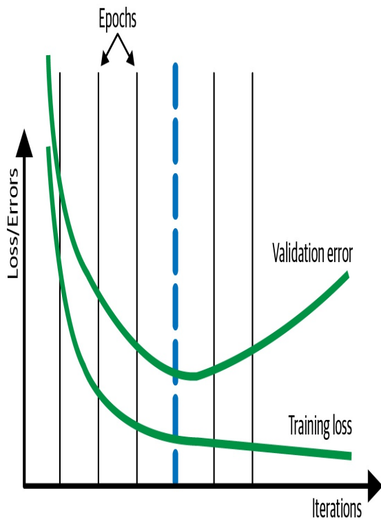
                        
                    - 추가로 더 학습한다면? (혹은 학습이 정체된 상황에서)
                    어떤 변화를 줘서 성능을 더 끌어낼 수 있을까 / 혹은 대체제로 어떤 대처를 할 수 있을까?
                        - **새로운 데이터셋을 학습시키거나 (어그멘테이션도 맥락상 같은 역할) → 전이학습**
                        - LR을 줄이거나
                        - 규제
            - 전이학습(Transfer Learning, [전이학습_뭐였더라](https://meaningful96.github.io/deeplearning/Transferlearning/))
                - 왜 하는가?
                    - 시간 = 학습 비용 (= GPU)
                    - 데이터의 부족
                - 방법
                    - 그림
                        
                        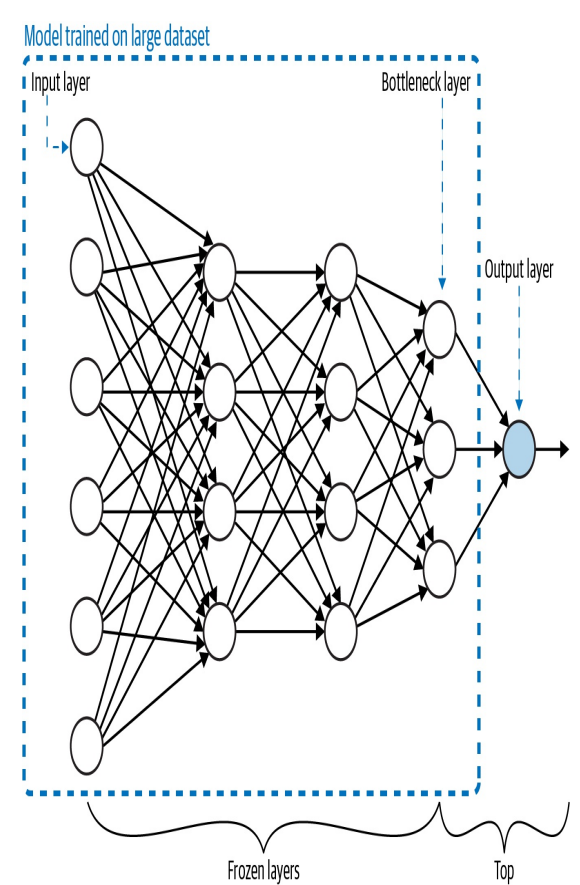
                        
                    1. Pretrained model에 새로운 네트워크 추가
                    2. Pretrained model 부분의 weight를 freeze 시킨 후
                    3. 새로 추가한 네트워크를 훈련, 상황에 따라 기존 네트워크의 일부(혹은 전체) freeze를 해제시킨 후 추가 훈련
                - 어째서 유효한가
                    - Pretrained model의 경우 - **학습하고자 하는 대상**에 대한 일반적인 특징을 이미 학습한 상태
                        - 훈련된 모델의 경우 저층(앞쪽)에서는 저차원의 특징들을 이미 학습함
                            - 새로 들어오는 데이터 또한 저차원에서는 같은 특징을 가지고 있으므로 (ex : 선, 모서리) 다시 학습하지 않아도 됨
                            - 이런 점을 고려하여, 물론 학습하고자 하는 대상의 데이터타입은 일치시켜야 함 (이미지라면 이미지 pretrained 모델을 불러오는 것)
                        - 이미지 모델의 경우 edge,  shape 등
                        - 언어 모델의 경우 단어 간의 상관 관계, sequence가 이루어내는 의미 등
                - 구분
                    - Feature extraction VS Fine-tuning
                        - Feature extraction
                            - pretrained model의 가중치를 그대로 사용, 고정시킴
                            - 마지막 레이어만 재학습시킴 (linear prove 가 이런 종류)
                        - Fine tuning
                            - 초기값으로는 pretrained model의 가중치를 사용
                            - 모델의 일부 레이어(후반부) + head를 재학습
                            - low lr로 전체 모델을 천천히 재학습
                        - 둘의 비교
                            
                            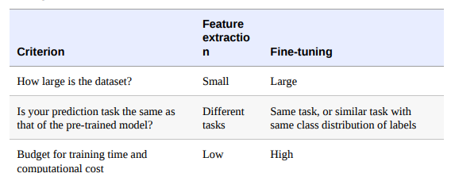
                            
                    - Pretrained model 찾기
                        - [Tensorflow Hub](https://www.kaggle.com/models?tfhub-redirect=true), [HuggingFace Hub](https://huggingface.co/docs/hub/index)
                        - 논문 저자들은 위 플랫폼 사용 혹은 Github repo에서 google drive link 형태로 제공
                        - 직접 만들기
                - 실습
                    
                    Tensorflow Hub 사용해보기
                    
                    https://www.tensorflow.org/hub?hl=ko
                    
                    https://www.tensorflow.org/hub/tutorials/tf2_image_retraining?hl=ko
                    
            - 안티패턴
                - [안티패턴 소개글](https://modulabs.co.kr/blog/ml_system_pattern/)을 먼저 확인해주세요
                    - **only-me**
                        - 개인 컴퓨터에서 개발 환경을 세팅 해서 완성된 모델이 개인 환경에 완전히 의존하는 문제.
                        - 추후 개인환경에 변화가 생기면 모델을 재현 할 수 없는 리스크 발생.
                        
                        → 개발 환경한 동일한 환경을 실제 시스템에 구축해야 함. (requirement.txt 를 작성하는 등)
                        
                        → 모델 초기 단계부터 코드 리뷰를 실시하고, 시스템 전체의 실행 로직에 대해 서로 이해해야 함
                        
                        → 모두가 공유 할 수 있는 시스템을 만들어야 함.
                        
                    - **training code in serving**
                        - 코드 및 라이브러리 의존성이 다름.
                        - 리소스 요구 사항이 다름. - 모델 학습에선 GPU, 대용량 cpu등 필요한 반면 사전학습된 모델은 필요 없음
                        - 배치vs실시간 처리 방식이 다름. 서빙에서는 실시간으로 요청된 데이터를 개별적 처리해야함
                        - 보안 요구사항이 다름. 서빙은 외부 API 공개를 해야 하기에 유의
                        
                        → (공통) OS, 프로그래밍언어, 라이브러리 버전 등 기본 실행 환경 통일
                        
                        → (공통) 데이터 전/후처리, 모델예측 등 코어 로직
                        
                        → (분리) 학습용 코드, 라이브러리
                        
                        → (분리) 학습 전용 리소스
                        
                        → (분리) 운영환경에 불필욯나 부가 기능(모니터링, 자동 스케일링, 장애대응 등)
                        
                    - **all-in-one**
                        - 제한된 라이브러리 및 알고리즘 선택, 복잡한 장애, 불필요한 운영 비용
                        
                        → 서버당 하나의 모델 배포 **마이크로서비스 아키텍처(MSA)**
                        
                - [**다음 페이지](https://mercari.github.io/ml-system-design-pattern/README_ko.html)에서 각 패턴의 안티패턴을 확인 후 간단하게 정리해봅시다!**
                    - SERVING 패턴의 안티패턴
                        
                        What is this?
                        
                        실제 운영 환경에서 **ML모델을 이용할 수 있도록하는** 일련의 시스템 디자인
                        
                        (패턴 = 특정 경우/문제들의 공통된 양상 집합)
                        
                        - **서빙안티패턴 #1 : All-in-one pattern**
                            
                            1 서버 : N 모델실행
                            
                            <Case>
                            
                            - 하나의 서버 또는 하나의 서버 그룹에서 **여러 예측 모델을 실행**하는 경우
                            
                            <Situation>
                            
                            - 하나의 제품에서 여러 예측 모델을 배포하고 싶은 경우가 있지만, 하나의 서버 또는 하나의 서버 그룹에서 여러 예측 모델을 실행하는 것은 추천하지 않습니다. 
                            why?
                            모든 모델을 단일 환경에서 실행하면 **서버 비용을 줄일 수 있지만,** 소프트웨어 개발, 트러블슈팅, 업데이트의 어려움으로 **운영 비용이 증가**할 수 있습니다.
                            - 여러 모델을 운영하는 경우, 특별한 이유가 없다면 서버당 한 모델의 마이크로 서비스 아키텍처로 배포하는 것을 추천합니다.
                            - https://mercari.github.io/ml-system-design-pattern/Serving-patterns/Anti-patterns/All-in-one-pattern/design_ko.html
                            
                            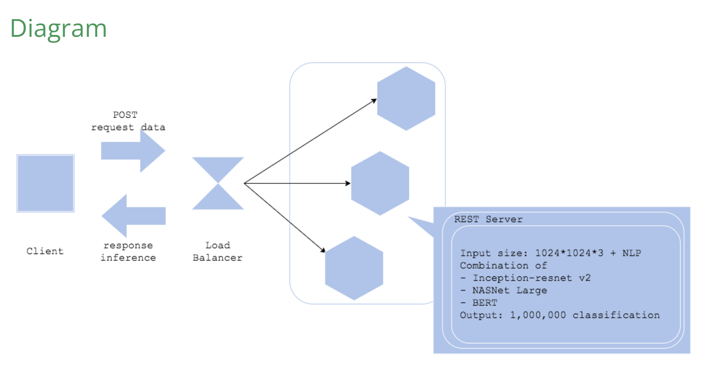
                            
                        - **서빙안티패턴 #2 :Online bigsize pattern**
                            
                            다양한 온라인 서비스에서 시간이 오래 걸리는 경우들의 양상(패턴)
                            <Case>
                            
                            - 실시간 대응이 필요한 온라인 서비스의 경우 또는 시스템에 예측에 **오랜 시간**이 걸리는 큰 모델을 배치하는 경우
                            - 예측의 **평균 지연 시간**이 요구되는 성능을 충족하지 못하는 경우
                            - 배치 시스템에서 **예측 횟수 또는 평균 지연 시간**이 예상되는 완료 시간보다 **긴 경우**
                            
                            <Situation>
                            
                            웹 서비스와 배치 시스템을 포함한 모든 서비스에는 완료 시간에 대한 요구 사항이 있습니다.
                            
                            (ex. 웹 서비스에서는 모든 요청의 평균 응답 시간이 1초 이하)
                            
                            작업의 소요되는 시간을 측정할 수 있는 유용한 단위는 머신러닝 시스템이 예측에 소비하는 평균 초로, 이 단위를 기준으로 요구 사항에 충족할 수 있게 모델과 예측 시스템을 설계해야 합니다. 특히 시간이 많이 걸릴 수 있는 복잡하고 거대한 딥러닝 모델을 사용하는 경우에는 어떻게든 최적화해야 합니다.
                            
                            장점 : 크고 복잡한 모델이 패턴에서 돌아갈 시 성능 좋음
                            
                            단점 : 속도-비용-정확성 문제
                            (서버 스케일아웃하면, 속도&정확성 Up, 비용도 Up) 
                            
                            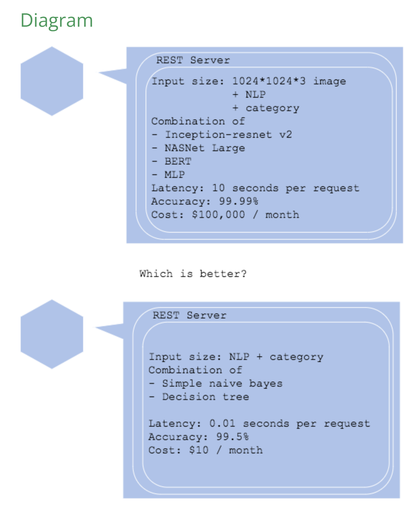
                            
                        
                    - TRAINING 패턴의 안티패턴
                        - **Only-me pattern**
                            - 정의
                                - 개인 컴퓨터에서 주피터 노트북을 이용하여 머신러닝 모델을 개발하는 경우
                            - 개인 환경에 완전히 의존한 모델
                                - 어떠한 순간에 업데이트로 인해 환경 설정들이 변하여 모델 재현이 불가능해질 수 있는 리스크 존재
                            - 실제 운영 환경에서 모델 실행 및 릴리즈 하기 어려움
                            
                            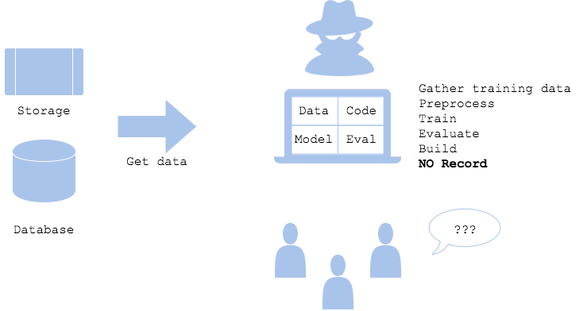
                            
                        - **Training code in serving pattern**
                            - 정의
                                - 학습, 실험, 평가에만 사용되야 하는 코드가 서빙 코드에 들어간 경우.
                                - 학습, 실험, 평가를 위한 환경과 구성이 서빙에도 들어간 경우.
                            - Training vs serving
                                - 학습 및 서비스 환경의 표준화해야 하는 부분:
                                    - OS, 언어, 라이브러리 버전들
                                    - 전처리, 예측, 후처리 등에 사용되는 코드와 로직
                                - 분리되어야 하는 부분:
                                    - 학습에 이용되는 코드와 로직
                                    - 학습을 위한 라이브러리나 리소스들(학습용 GPU, 대용량 CPU나 RAM, 내부 네트워크와 내부 데이터 웨어하우스)과의 의존성
                            - 장기적으로 비용과 보안, 기밀정보(네트워크와 데이터 액세스)보호 측면으로는 반드시 분리하는 것이 좋음
                            
                            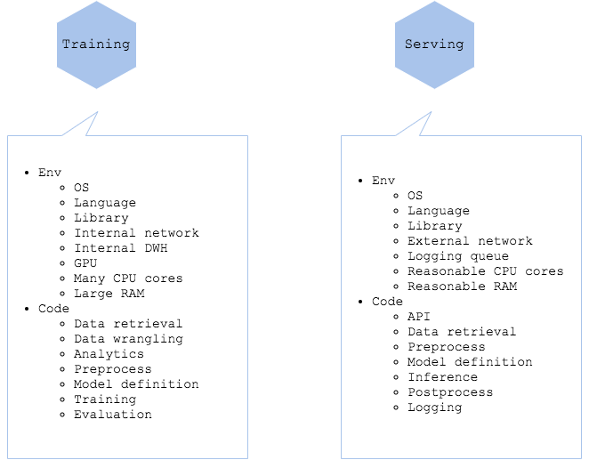
                            
                        - **Too many pipes pattern**
                            - 정의
                                - 학습 파이프라인이 너무 다양하고 복잡한 경우.
                                - 데이터 소스가 너무 많고 가져오는 방법이 적절히 추상화되어있지 않은 경우.
                            - 파이프라인을 다양하게 사용될 수 있도록 만들어야 함
                                - 최대한 단순화하여 장애를 격리하고 재사용성을 높이는 것이 중요
                            - 데이터 소스와 액세스 방법의 다양함
                                - 적절하게 데이터 웨어하우스(RDB, NoSQL, NAS, 웹 API, 클라우드 스토리지, Hadoop 등)를 선택하고 정리하는 것이 중요
                            - 운영하기 어려울 수 있음
                            
                            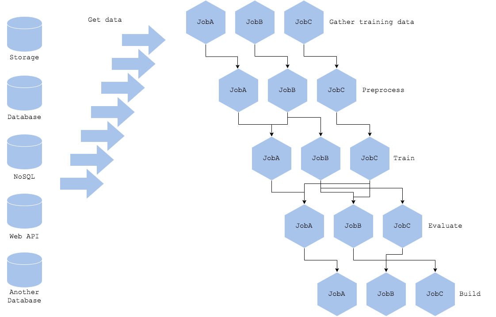
                            
                    - QA 패턴의 안티패턴
                        - QA 패턴: 예측 서버와 모델을 평가하기 위한 패턴
                            - Shadow AB-testing pattern
                                - 사용
                                    - 새로운 예측 모델이 운영 환경 데이터에서 잘 작동하는지 확인하고 싶은 경우
                                    - 새로운 예측 서버가 운영 부하를 견딜 수 있는지 확인하고 싶은 경우
                                - 아키텍처
                                    - 여러 예측 모델 및 서버를 운영 환경 데이터를 통해 검증하는 아키텍처
                                    - 모든 서비스에 예측 요청을 전송하지만 예측 응답은 현재 모델에만 보냄
                                    - 프록시 서버: 예측 모델의 프로필과 모들 예측 결과를 DW에 저장
                                - 다이어그램
                                    
                                    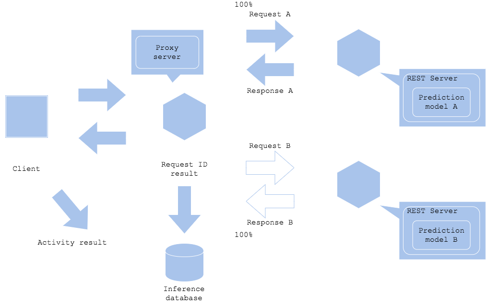
                                    
                                - 참고: https://mercari.github.io/ml-system-design-pattern/QA-patterns/Shadow-ab-test-pattern/design_ko.html
                            - Online AB-testing pattern
                                - 사용
                                    - 새로운 예측 모델이 운영 환경 데이터를 통한 예측 결과 확인이 필요한 경우
                                    - 새로운 예측 서버가 운영 환경 액세스 부하를 견디는지 확인하고 싶은 경우
                            - Loading test pattern
                        - Anti-patterns
                            - Offline only pattern
                                - 사용
                                    - ML 모델이 오프라인 테스트 데이터로만 평가되는 경우
                                - 상황
                                    - 모델의 유용성 판단은 테스트 데이터가 아닌 반드시 실제 비지니스를 기준으로 평가해야 함
                                    - 예측 모델로 출시한 모델은 운영 환경에서 효과를 검증해야 함
                                    - 테스트 환경과 달리 운영 환경에서의 성능이 저조하거나 나빠질 경우 모델 사용 전으로 롤백
                                        - 이때 parameter-based serving pattern을 사용하면 부정적인 영향을 최소화하며 롤백이 가능함
                                - 다이어그램
                                    
                                    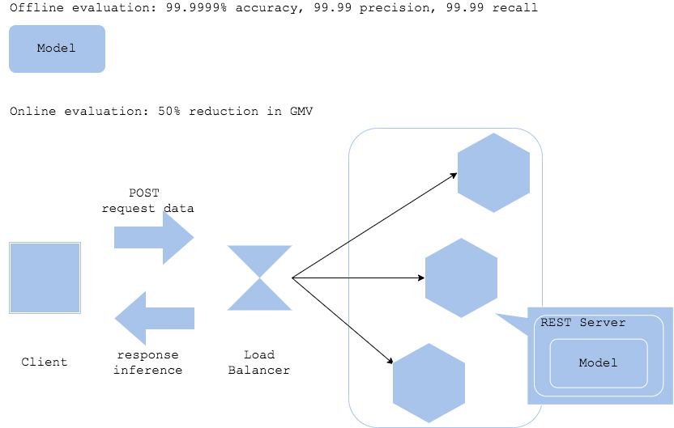
                                    
                                - 문제
                                    - 비지니스에 미치는 영향을 기준으로 모델 평가가 어려움
                                - 해결 방안
                                    - 프로덕션 모델로 개선할 KPI 정의 & 출시 전후 상태 비교 분석
                                        - 이를 위해 로그 정의, 수집 과정이 필요함
                                    - 분석 후 결과를 기반으로 모델 사용 여부 및 개선 방법 도출
                    -  OPERATION 패턴의 안티패턴
                        
                        **ML 학습 시스템의 설정과 로깅, 모니터링, 알람 시스템을 위한 관리 및 운영 패턴들**
                        
                        - **Model-in-image Pattern(이미지 내 모델 패턴)**
                            
                            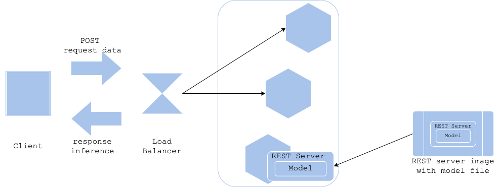
                            
                            모델을 컨테이너 이미지 안에 포함시켜 배포하는 방식
                            
                            - 장: 모델, 필요 라이브러리 포함 ⇒ 일관된 환경 쉽게 배포 실행
                            - 단: 모델 업데이트 시 새로운 이미지 다시 빌드 후 배포
                        - **Model-load Pattern(모델 로드 패턴)**
                            
                            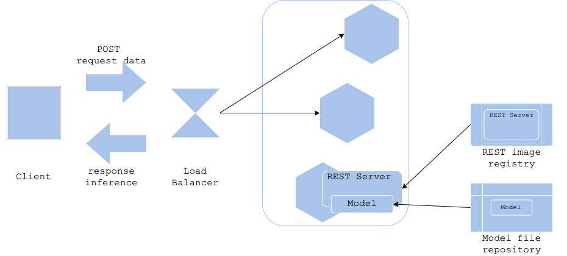
                            
                            모델이 별도의 저장소에서 로드되어 애플리케이션이 실행될 때마다 최신 모델 반영
                            
                            - 장: 모델의 업데이트 간단, 서비스 재시작없이 최신 모델 반영
                            - 단: 모델 로드 지연 가능성 및 외부 연결 의존성 증가
                        - **Data Model Versioning Pattern(데이터 모델 버전관리 패턴)**
                            
                            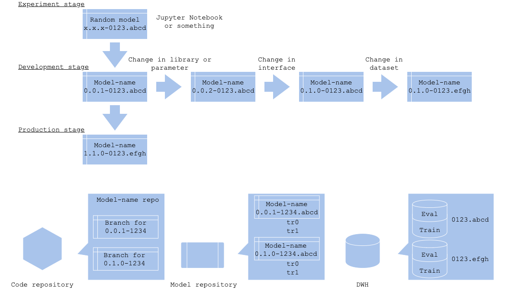
                            
                            데이터 모델의 버전 관리를 통해 여러 버전의 모델 운영으로 일관성 유지 방법
                            
                            - 장: 과거 버전과 호환성 유지, 과거 데이터 사용해 새로운 모델 검증 및 비교 가능
                            - 단: 버전 관리의 복잡성 증가
                        - **Prediction Log Pattern(모델 예측 로그 패턴)**
                            
                            
                            
                            모델의 예측 결과와 입력 데이터를 모두 로그로 남기는 패턴
                            
                            - 장: 예측의 성능 분석 모니터링 및 디버깅 오류 분석 유용
                            - 단: 저장소 및 처리 비용 증가
                        - **Prediction Monitoring Pattern**(모델 예측 모니터링 패턴)
                            
                            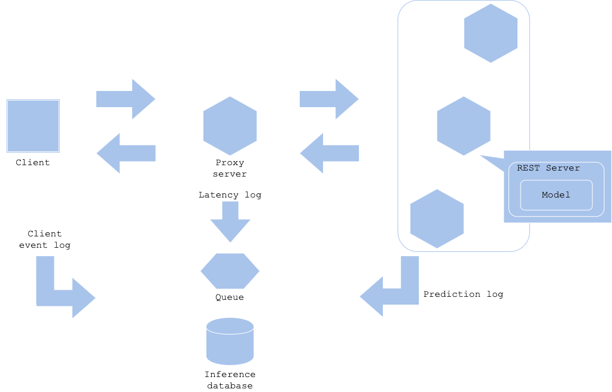
                            
                            실시간 모델 예측 성능 모니터링 패턴
                            
                            - 장: 예측 결과의 품질을 지속적으로 추적해 모델 성능을 실시간 관리, 문제 조기 탐지
                            - 단: 지속적인 모니터링 시스템 구축 및 유지 필요
                        - **Parameter-based Serving Pattern(파라미터 기반 서빙 패턴)**
                            
                            
                            
                            모델 서빙 시 입력에 따라 다른 파라미터 사용해 모델을 다르게 동작
                            
                            - 장: 특정 환경 등 다양한 상황에 맞춘 모델 서빙 가능(파라미터 동적 조정)
                            - 단: 복잡성 증가 및 잘못된 파라미터 설정 시 성능 최하
                        - **Condition-based Serving Pattern(조건 기반 서빙 패턴)**
                            
                            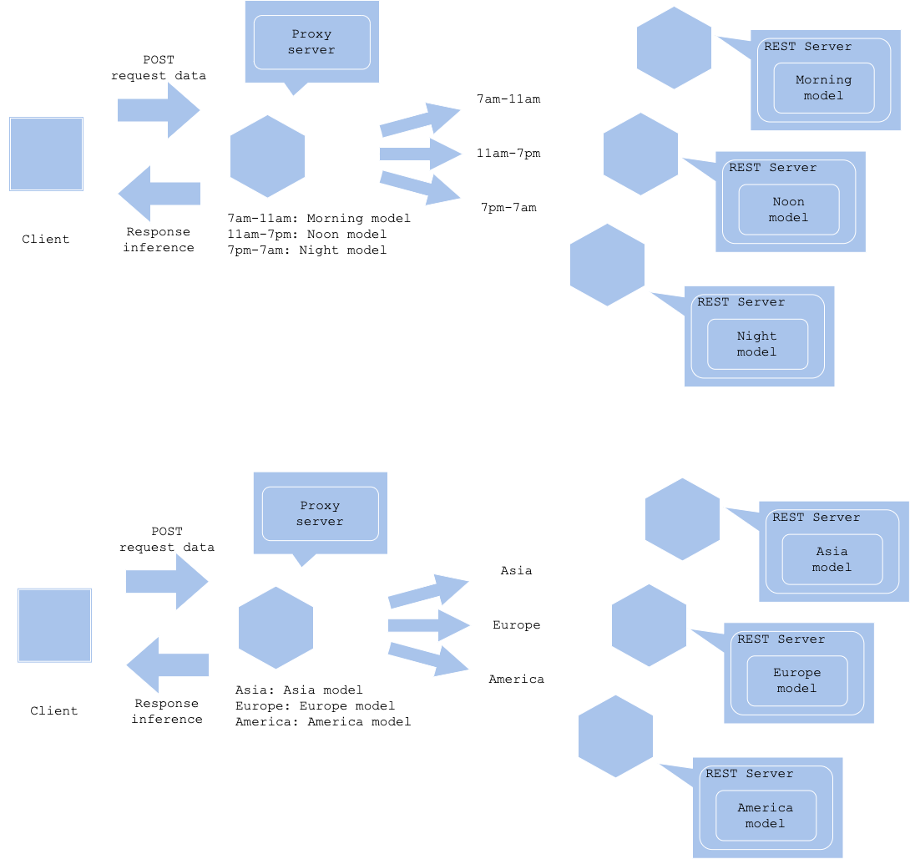
                            
                            조건에 따라 서로 다른 모델을 서빙하는 방식
                            
                            - 특정 조건⇒간단한 모델, 복잡한 문제⇒정교한 모델
                            - 장: 효율적인 자원 활용 및 상황에 맞는 모델 제공
                            - 단: 조건 설정의 복잡성 증가
                            
                        
                        - 안티패턴
                            - No logging pattern
                                - 로그나 프로파일을 관리하지 않는 경우
                                    - 로그가 없으면, 시스템을 블랙박스처럼 만들어 에러를 찾고 트러블 슈팅을 하는것이 불가능해짐
                                
                                → 최소한의 Fatal, Error, Warning, Info 레벨의 로그를 남겨야 함
                                
                                → 추적 가능한 이벤트 로그를 정의하고 구현해야 함.
                                
                                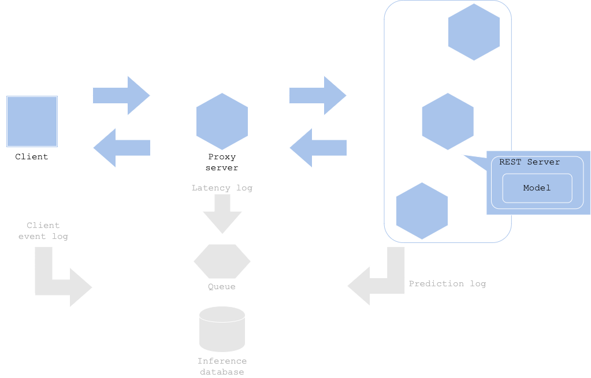
                                
                            - Nobody knows pattern
                                - 머신러닝 시스템이 실제 운영 서비스에서 돌고 있지만, 아무도 그 시스템을 무엇을 위해 작동하는지 모르는 경우
                                    - 팀 프로젝트의 멤버가 고정되지 않아 일에 대한 정보가 없음
                                    
                                    → 문서화 하여 남겨야 함
                                    
                                    - 실제 기기(센서 등)의 변화를 머신러닝 시스템에 반영해야 함을 간과한 경우
                                    
                                    → 프로그램 전체의 동작 work flow를 작성해두어야 할 것 같음
                                    
                                - 누구의 리뷰도 없이 코드, 모델, 설정값을 변경 할 수 있는 경우
                                    
                                    
                                
                                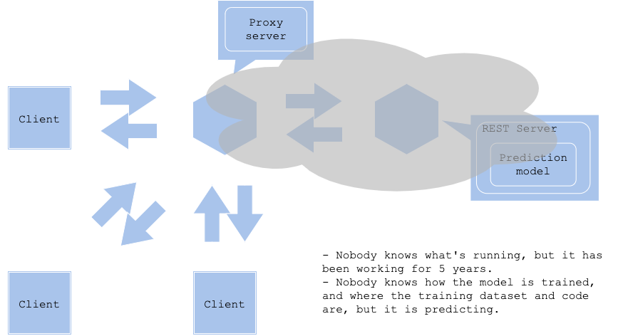
