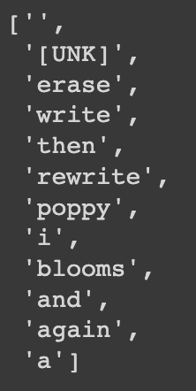
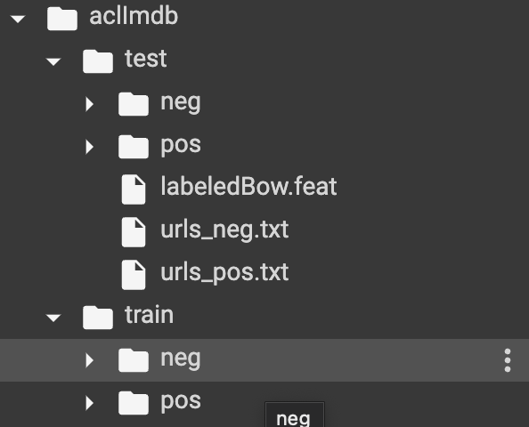
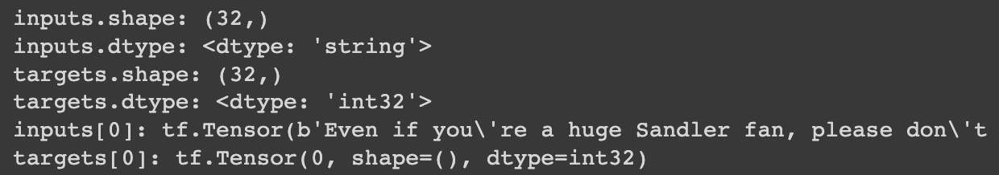
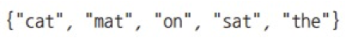
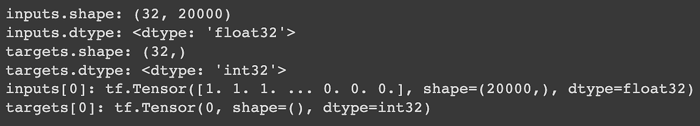
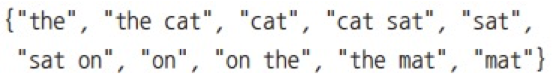
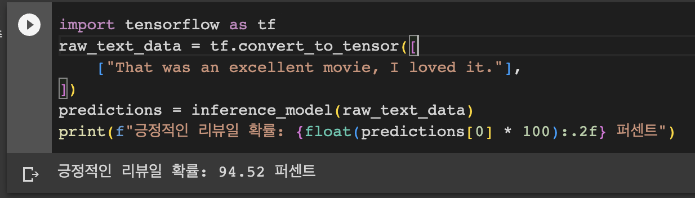
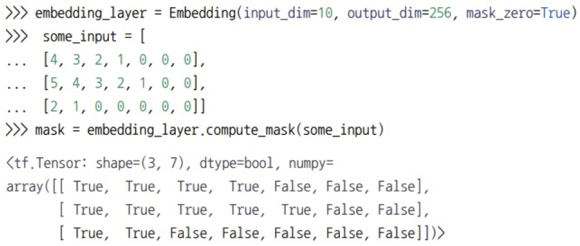

# 학습 내용

---

- 자연어 처리 소개
- 텍스트 데이터 준비
- 단어 그룹을 표현하는 두 가지 방법: 집합 / 시퀀스
- 트랜스포머 아키텍쳐
- 텍스트 분류를 넘어: 시쿼스-투-시퀀스 학습

---

## 자연어 처리 소개

---

자연어 처리 종류

	- 텍스트 분류
	- 콘텐츠 필터링
	- 감성 분석
	- 언어 모델링
	- 번역
	- 요약 등등

---

## 텍스트 데이터 준비

---

미분 가능한 함수인 딥러닝 델

	-> 수치 텐서만 처리 가능

텍스트 벡터화?

	텍스트를 수치 텐서로 바꾸는 과정

	1. 텍스트 표준화
	2. 토큰 단위로 분할 -> 토큰화
	3. 각 토큰 수치 벡터로 변환

---

### 텍스트 표준화

---

텍스트 표준화?
	
	모델이 인코딩 차이를 고려하지 않도록 이를 제거하기 위한 기초적인 특성 공학의 한 형태

		-> 검색 엔진을 만들 때도 동일한 작업을 수행해야 함

가장 간단하고 널리 사용되는 표준화 방법

	소문자로 바꾸고 구두점 문자를 삭제

	ex) “Sunset came; I stared at the México sky. isn’t nature splendid?”

		-> "sunset came i stared at the méxico sky isnt nature splendid"

어간 추출?

	어형이 변형된 단어를 공통된 하나의 표현으로 바꾸는 것

	ex)

		"cats" -> "[cat]"

		"was staring", "stared" -> "[stare]"

	-> 머신 러닝에서 드물게 사용됨

장점

	모델에 필요한 훈련 데이터가 줄어들고 일반화가 더 잘됨

단점

	일정량의 정보를 삭제할 수도 있다는 점

---

### 텍스트 분할(토큰화)

---

텍스트 표준화 다음 스텝

	벡터화할 단위(토큰)로 나눔 -> 토큰화

세가지 방법

	- 단어 수준 토큰화 -> 토큰이 공백으로 (또는 구두점으로) 구분된 부분 문자열
		- ex) "staring" -> "star+ing" / "called" -> "call+ed"
	- N-그램 토큰화 -> 토큰 N개의 연속된 단어 그룹
		- ex) "the cat" / "he was" -> 2-그램(또는 바이그램(bigram)) 토큰
	- 문자 수준 토큰화 -> 각 문자가 하나의 토큰
		- 텍스트 생성 / 음성 인식 같은 특별한 작업에서만 사용

	-> 일반적으로 단어 수준 토큰화 / N-그램 토큰화를 항상 사용

---

N-그램과 BoW

ex) "the cat sat on the mat." 

	2-그램의 집합

	-> {"the", "the cat", "cat", "cat sat", "sat", "sat on", "on", "on the", "the mat", "mat"}

		-> 2-그램 가방(bag of 2-gram)
		
	3-그램의 집합

	-> {"the", "the cat", "cat", "cat sat", "the cat sat", "sat", "sat on", "on", "cat sat on", "on the", "sat on the", "the mat", "mat", "on the mat"}

		-> 2-그램 가방(bag of 2-gram)

	가방(bag)?

		-> 다루고자 하는 것이 토큰의 집합

		-> 특정한 순서 X

	이런 종류의 토큰화 방법

	-> BoW(또는 Bag-of-N-gram)

		-> 얕은 학습 방법의 언어 처리 모델에 사용되는 경향이 있음

	딥러닝 시퀀스 모델 -> 이런 수동적인 방식을 계층적인 특성 학습으로 대체

	1D 컨브넷, 순환 신경망, 트랜스포머 -> 단어와 문자 그룹에 대한 특성을 학습할 수 있음

	장점

		-> 그룹들을 명시적으로 알려 주지 않아도 연속된 단어나 문자의 시퀀스에 노출되면 자동으로 학습

---

### 어휘 사전 인덱싱

---

토큰화 다음 스텝

	각 토큰을 수치 표현으로 인코딩

어휘 사전 인덱싱?

	훈련 데이터에 있는 모든 토큰의 인덱스(어휘 사전)를 만들어 어휘 사전의 각 항목에 고유한 정수를 할당하는 방법 

	ex) 

	'''

	vocabulary = {}
	for text in dataset:
	    text = standardize(text)
	    tokens = tokenize(text)
	    for token in tokens:
	    	if token not in vocabulary:
	        	vocabulary[token] = len(bocabulary)

	'''

		-> 이 정수를 신경망이 처리할 수 있도록 원-핫 벡터 같은 벡터 인코딩으로 바꿀 수 있음

어휘 사전의 개수를 제한하는 이유?

	고유한 토큰이 굉장히 많음

		-> 드믄 토큰을 인덱싱하면 특성 공간이 과도하게 커지게 됨(거의 아무런 정보가 없을 것)

	일반적으로 2만개 / 3만개로 제한

간과해서는 안되는 중요한 사항

	어휘 사전 인덱스에서 새로운 토큰을 찾을 때 이 토큰이 항상 존재하지 않을 수 있음

		-> KeyError 에러 발생

	-> 예외 어휘 인덱스 사용

예외 어휘 인덱스(OOV 인댁스)?

	- 어휘 사전에 없는 모든 토큰에 대응됨
	- 일반적으로 1 할당
	- 디코딩 -> "[UNK]" 

왜 0이 아니고 1을 사용할까?

	->  0은 이미 사용되는 토큰(마스킹(masking) 토큰)!

마스킹(masking) 토큰?

	단어가 아니라 무시할 수 있는 토큰을 의미함

		-> 시퀀스 데이터를 패딩하기 위해 사용됨

패딩을 하는 이유?

	배치 데이터는 동일해야 하기 때문에 배치에 있는 모든 시퀀스는 길이가 같아야 함

		-> 길이가 짧은 시퀀스는 가장 긴 시퀀스 길이에 맞추어 패딩

---

### TextVectorization 층

---

TextVectorization 층?

	케라스에서 제공

	'''

	from tensorflow.keras.layers import TextVectorization
	text_vectorization = TextVectorization(
	        output_mode="int",
	)

	'''

		-> 텍스트 표준화를 위해 소문자로 바꾸고 구두점을 제거, 토큰화를 위해 공백으로 나눔

 tf.string 텐서를 처리할 때?

	사용자 정의 함수를 사용해야 함!

	ex)

	'''

	import re
	import string
	import tensorflow as tf

	def custom_standardization_fn(string_tensor):
	    lowercase_string = tf.strings.lower(string_tensor) # 문자열을 소문자로 빠군다.
	    return tf.strings.regex_replace( # 구두점 문자를 빈 문자열로 바꾼다.
	        lowercase_string, f"[{re.escape(string.punctuation)}]", "")

	def custom_split_fn(string_tensor):
	    return tf.strings.split(string_tensor) # 공백을 기준으로 문자열을 나눈다.

	text_vectorization = TextVectorization(
	    output_mode="int",
	    standardize=custom_standardization_fn,
	    split=custom_split_fn,
	)

	'''

텍스트 말뭉치의 어휘 사전 인덱싱?

	adapt() 메서드 호출

		-> 매개변수 Dataset 객체 / 파이썬 문자열의 리스트를 사용 해야함

			-> 문자열을 반환해야 하기 때문

	ex)

	'''

	dataset = [
	    "I write, erase, rewrite",
	    "Erase again, and then",
	    "A poppy blooms.",
	]
	text_vectorization.adapt(dataset)

	'''

계산된 어휘 사전 추출?

	get_vocabulary() 메서드 사용

		-> 정수 시퀀스로 인코딩된 텍스트를 단어로 다시 변환할 때 유용

	ex)

	'''

	text_vectorization.get_vocabulary()

	'''

tmi

	어휘 사전의 항목 

		-> 빈도 순으로 정렬되어 있음

---

tf.data 파이프라인 또는 모델의 일부로 TextVectorization 층 사용

문제점

	대부분 딕셔너리 룩업(lookup) 연산이기 때문에 GPU(또는 TPU)에서 실행할 수 없고 CPU에서만 실행

		-> 모델을 GPU에서 훈련한다면 TextVecrorization 층이 CPU에서 실행된 후 그 출력을 GPU로 보낼 것

TextVectorization 층을 사용하는 방법이 두 가지

	- tf.data 파이프라인에 넣는 것
	- 모델의 일부로 만드는 것

1. tf.data 파이프라인

	'''

	int sequence_dataset = string_dataset.map( # string_dataset은 문자열 탠서를 반환하는 데이터셋
	text_vectorization,
	num_parallel_calls=4) # num_parallel_calls 매개변수를 사용하여 여러 개의 CPU 코어에서 map() 메서드를 병렬화

	'''
	
	- CPU에서 데이터 처리를 비동기적으로 수행할 수 있음
		-  GPU가 벡터화된 데이터 배치에서 모델을 실행할 때 CPU가 원시 문자열의 다음 배치를 벡터화
	- 모델을 GPU나 TPU에서 훈련한다면 최상의 성능을 얻을 수 있음

2. 모델의 일부

	'''

	# 문자열을 기대하는 심볼릭 입력을 만든다.
	text_input = keras.input(shape=(), dtype="string")

	# 텍스트 벡터화 층을 적용한다.
	vectorized_text = text_vectorization(text_input)

	# 일반적인 함수형 API 모델처럼 그 위에 새로운 층을 추가할 수 있다.
	embedded_input = keras.layers.Embedding(...)(vectorized_text)
	output = ...
	model = keras.Model(text_input, output)

	'''
	
	- 벡터화 단계가 모델의 일부이므로 모델의 나머지 부분과 동기적으로 수행
		- 훈련 단계마다 (GPU에 놓인) 모델의 나머지 부분이 실행되기 위해 (CPU에 놓인) TextVectorization 층의 출력이 준비되기를 기다린다는 의미
	- 모델을 제품 환경에 배포해야 한다면 좋은 방법

---

## 단어 그룹을 표현하는 두 가지 방법: 집합 / 시퀀스

---

중요한 것

	(단어를 문장으로 구성하는 방식인)단어 순서를 인코딩하는 방법

자연어에서 순서 문제?

	순서는 확실히 중요하지만 의미와 관계는 간단하지 않음

여러 NLP 아키텍쳐를 발생시킨 핵심 질문?

	어떻게 단어의 순서를 표현하는가??

		-> 1. 단어의 순서를 무시하고 텍스트를 단어의 (순서가 없는) 집합으로 처리하는 것 (BoW 모델)
		   2. 단어의 순서를 고려 (시퀀스 모델)

---

### IMDB 영화 리뷰 데이터 준비

---

1. 데이터 준비
	
	앤드류 마스(Andrew Maas)의 스탠포드 페이지에서 데이터셋을 내려받고 압출을 해제

	'''

	!curl -O https://ai.stanford.edu/~amaas/data/sentiment/aclImdb_v1.tar.gz
	!tar -xf aclImdb_v1.tar.gz

	'''

	- train/pos/ 디렉터리에는 1만 2,500개의 텍스트 파일이 담겨 있음
	- 각 파일은 훈련 데이터로 사용할 긍정적인 영화 리뷰의 텍스트를 담고 있으며, 부정적인 리뷰는 "neg" 디렉터리에 담겨 있음
	- 모두 합해서 훈련용으로 2만 5,000개의 텍스트 파일이 있고 테스트를 위해 또 다른 2만 5,000개의 파일이 있음	

train/unsup 디렉터리 삭제

	필요하지 않으므로 디렉토리 삭제

	'''

	!rm -r aclImdb/train/unsup

	'''

2. 데이터 살펴보기

	실제 모델이 하는 작업에 대한 직관을 기를 수 있기에 데이터를 살펴보는 것이 좋음

	'''

	!cat aclImdb/train/pos/4077_10.txt

	'''

	결과: I first saw this back in the early 90s on UK TV, i did like it then but i missed the chance to tape it, many years passed but the film always stuck with me and i lost hope of seeing it TV again, the main thing that stuck with me was the end, the hole castle part really touched me, its easy to watch, has a great story, great music, the list goes on and on, its OK me saying how good it is but everyone will take there own best bits away with them once they have seen it, yes the animation is top notch and beautiful to watch, it does show its age in a very few parts but that has now become part of it beauty, i am so glad it has came out on DVD as it is one of my top 10 films of all time. Buy it or rent it just see it, best viewing is at night alone with drink and food in reach so you don't have to stop the film.  Enjoy

3. 검증 세트 생성

	훈련 텍스트 파일에서 20%를 새로운 디렉터리 aclimdb/val로 덜어 내어 검증 세트 생성

	'''

	import os, pathlib, shutil, random

	base_dir = pathlib.Path("aclImdb")
	val_dir = base_dir / "val"
	train_dir = base_dir / "train"
	for category in ("neg", "pos"):
	    os.makedirs(val_dir / category)
	    files = os.listdir(train_dir / category)
	    random.Random(1337).shuffle(files) # 코드를 여러 번 실행해도 동일한 검증 세트가 만들어지도록 랜덤 시드를 지정하여 훈련 파일 목록을 섞는다.

	    # 훈련 파일 중 20%를 검증 세트로 덜어 낸다.
	    num_val_samples = int(0.2 * len(files))
	    val_files = files[-num_val_samples:]

	    # 파일을 aclimdb/val/neg 와 aclimdb/val/pos로 옮긴다.
	    for fname in val_files:
	        shutil.move(train_dir / category / fname,
	                    val_dir / category / fname)

	'''

4. Dataset 객체 생성

	image_dataset_from_directory() 메서드를 사용해 Dataset 객체 생성

	'''

	from tensorflow import keras
	batch_size = 32

	train_ds = keras.utils.text_dataset_from_directory(
	    "aclImdb/train", batch_size=batch_size
	)
	val_ds = keras.utils.text_dataset_from_directory(
	    "aclImdb/val", batch_size=batch_size
	)
	test_ds = keras.utils.text_dataset_from_directory(
	    "aclImdb/test", batch_size=batch_size
	)

	'''

		dataset 객체

			->  텐서플로의 tf.string 텐서인 입력과 "0" 또는 "1"로 인코딩된 int32텐서인 타깃을 반환

5. 첫 번째 배치의 크기와 dtype 출력

	'''

	for inputs, targets in train_ds:
	    print("inputs.shape:", inputs.shape)
	    print("inputs.dtype:", inputs.dtype)
	    print("targets.shape:", targets.shape)
	    print("targets.dtype:", targets.dtype)
	    print("inputs[0]:", inputs[0])
	    print("targets[0]:", targets[0])
	    break

	'''

---

### 단어를 집합으로 처리: BoW 방식

---

1. 이진 인코딩을 사용한 유니그램

개별 단어 == 유니그램

	ex) "the cat sat on the mat"

				↓

장점

	전체 텍스트를 하나의 벡터로 표현할 수 있다는 것

		-> 벡터의 각 원소는 한 단어의 존재 유무를 표시

- TextVectorization 층으로 데이터 전처리

	'''

	text_vectorization = TextVectorization(
	    # 가장 많이 등장하는 2만 개 단어로 어휘 사전을 제한한다.
	    # 그렇지 않으면 훈련 데이터에 있는 모든 단어를 인덱싱하게 된다.
	    # 아마도 수만 개의 단어가 한 번 또는 두 번만 등장하면 유용하지 않을 것이다.
	    # 일반적으로 텍스트 분류에서 2만 개는 적절한 어휘 사전 크기이다.
	    max_tokens=20000,

	    # 멀티-핫 이진 벡터로 출력 토큰을 인코딩한다.
	    output_mode="multi_hot",
	)
	# (레이블 없이) 원시 텍스트 입력만 반환하는 데이터셋을 준비한다.
	text_only_train_ds = train_ds.map(lambda x, y: x)

	# adapt() 메서드로 이 데이터셋의 어휘 사전을 인덱싱한다.
	text_vectorization.adapt(text_only_train_ds)

	# 훈련, 검증, 테스트 데이터셋을 전처리한다.
	# 다중 CPU 코어를 활용하기 위해 num_parallel_calls 매개변수를 지정한다.
	binary_1gram_train_ds = train_ds.map(
	    lambda x, y: (text_vectorization(x), y),
	    num_parallel_calls=4)
	binary_1gram_val_ds = val_ds.map(
	    lambda x, y: (text_vectorization(x), y),
	    num_parallel_calls=4)
	binary_1gram_test_ds = test_ds.map(
	    lambda x, y: (text_vectorization(x), y),
	    num_parallel_calls=4)

	'''

		멀티-핫 인코딩된 이진 단어 벡터

			-> 하나의 단어씩 처리(유니그램)

- 이진 유니그램 데이터셋의 출력 확인

	'''

	for inputs, targets in binary_1gram_train_ds:
	    print("inputs.shape:", inputs.shape)
	    print("inputs.dtype:", inputs.dtype)
	    print("targets.shape:", targets.shape)
	    print("targets.dtype:", targets.dtype)
	    print("inputs[0]:", inputs[0])
	    print("targets[0]:", targets[0])
	    break

	'''

-  모든 예제에서 사용할 모델 생성 함수 정의

	'''

	from tensorflow import keras
	from tensorflow.keras import layers

	def get_model(max_tokens=20000, hidden_dim=16):
	    inputs = keras.Input(shape=(max_tokens,))
	    x = layers.Dense(hidden_dim, activation="relu")(inputs)
	    x = layers.Dropout(0.5)(x)
	    outputs = layers.Dense(1, activation="sigmoid")(x)
	    model = keras.Model(inputs, outputs)
	    model.compile(optimizer="rmsprop",
	                  loss="binary_crossentropy",
	                  metrics=["accuracy"])
	    return model

	'''

- 이진 유니그램 모델 훈련, 테스트

	'''

	model = get_model()
	model.summary()
	callbacks = [
	    keras.callbacks.ModelCheckpoint("binary_1gram.keras",
	                                    save_best_only=True)
	]

	# 데이터셋의 cache() 메서드를 호출하여 메모리에 캐싱한다.
	# 이렇게 하면 첫 번째 에포크 에서 한 번만 전처리하고 이후 에포크에서는 전처리된 텍스트를 재사용한다.
	# 메모리에 들어갈 만큼 작은 데이터일 때 사용할 수 있다.
	model.fit(binary_1gram_train_ds.cache(),
	          validation_data=binary_1gram_val_ds.cache(),
	          epochs=10,
	          callbacks=callbacks)
	model = keras.models.load_model("binary_1gram.keras")
	print(f"테스트 정확도: {model.evaluate(binary_1gram_test_ds)[1]:.3f}")

	'''

	결과: 테스트 정확도 88.8%

---

2. 이진 인코딩을 사용한 바이그램

단어 순서를 무시?

	하나의 개념이 여러 단어로 표현 가능 하기에 단어 순서를 무시하는 것은 매우 파괴적!

해결책

	 N-그램을 사용

		-> 국부적인 순서 정보를 BoW 표현에 추가하게 됨

	ex) "the cat sat on the mat"

				↓

N-그램 반환 하는 방법

	ngrams=n 매개변수 전달

- 바이그램을 반환하는 TextVectorization 층 생성

	'''

	text_vectorization = TextVectorization(
	    ngrams=2,
	    max_tokens=20000,
	    output_mode="multi_hot",
	)

	'''

- 이진 바이그램 모델 훈련, 테스트

	'''

	text_vectorization.adapt(text_only_train_ds)
	binary_2gram_train_ds = train_ds.map(
	    lambda x, y: (text_vectorization(x), y),
	    num_parallel_calls=4)
	binary_2gram_val_ds = val_ds.map(
	    lambda x, y: (text_vectorization(x), y),
	    num_parallel_calls=4)
	binary_2gram_test_ds = test_ds.map(
	    lambda x, y: (text_vectorization(x), y),
	    num_parallel_calls=4)

	model = get_model()
	model.summary()
	callbacks = [
	    keras.callbacks.ModelCheckpoint("binary_2gram.keras",
	                                    save_best_only=True)
	]
	model.fit(binary_2gram_train_ds.cache(),
	          validation_data=binary_2gram_val_ds.cache(),
	          epochs=10,
	          callbacks=callbacks)
	model = keras.models.load_model("binary_2gram.keras")
	print(f"테스트 정확도: {model.evaluate(binary_2gram_test_ds)[1]:.3f}")

	'''

	결과: 테스트 정확도 89.6%

		-> 국부적인 순서가 매우 중요하다는 것

---

3. TF-IDF 인코딩을 사용한 바이그램

개별 단어나 N-그램의 등장 횟수를 카운트한 정보를 추가할 수 있음

	-> 텍스트에 대한 단어의 히스토그램(histogram)을 사용

장점

	텍스트 분류 작업 -> 한 샘플에 단어가 얼마나 많이 등장하는지가 중요

- 토큰 카운트를 반환하는 TextVectorization 층 생성

	'''

	text_vectorization = TextVectorization(
	    ngrams=2,
	    max_tokens=20000,
	    output_mode="count"
	)

	'''

문제 발생

	"the", "a", "is", "are" 단어는 분류 작업에 거의 쓸모없는 특성임에도 항상 단어 카운트 히스토그램을 압도하여 다른 단어의 카운트를 무색하게 만듦

해결 방법

	정규화!

		 -> 각 특성에서 평균을 빼면 희소성이 깨짐

			-> 나눗셈만 이용하는 정규화 방식을 사용해야 함

가장 좋은 정규화 방법

	TF-IDF 정규화(단어 빈도-역문서 빈도(Term Frequency-inverse Document Frequency))

---

TF-IDF 정규화 이해하기

	- 거의 모든 단어에 등장하는 ("the"나 "a" 같은) 단어는 별로 유용하지 않았음
	- 전체 텍스트 중 일부에서만 나타나는 ("Herzog" 같은) 단어는 매우 독특하므로 중요

		 -> TF-IDF는 두 아이디어를 합친 측정 방법

계산 방법

	1. 현재 문서에 단어가 등장하는 횟수인 '단어 빈도'로 해당 단어에 가중치 부여
	2. 데이터셋 전체에 단어가 등장하는 횟수인 '문서 빈도'로 나눔

코드화

	'''

	def tfidf(term, document, dataset):
	    term_freq = document.count(term)
	    doc_freq = math.log(sum(doc.count(term) for doc in dataset) + 1)
	    return term_freq / doc_freq

	'''

---

TF-IDF 구현

	널리 사용되는 방법이기 때문에 TextVectorization 층에 구현되어 있음

		-> utput_mode 매개변수를 "tf_idf"로 바꾸기만 하면 사용할 수 있음

- TF-IDF 가중치가 적용된 출력을 반환하는 TextVectorization 층 생성

	'''

	text_vectorization = TextVectorization(
	    ngrams=2,
	    max_tokens=20000,
	    output_mode="tf_idf",
	)

	'''

- TF-IDF 바이그램 모델 훈련, 테스트

	'''

	# 텐서플로 2.8.x 버전에서 TF-IDF 인코딩을 GPU에서 수행할 때 오류가 발생할 수 있습니다.
	# 텐서플로 2.9에서 이 이슈가 해결되었지만 코드를 테스트할 시점에 코랩의 텐서플로 버전은 2.8.2이기 때문에 
	# 에러를 피하기 위해 CPU를 사용하여 텍스트를 변환합니다.
	with tf.device("cpu"):
	    # adapt() 메서드를 호출하면 어휘 사전과 TF-IDF 가중치를 학습합니다.
	    text_vectorization.adapt(text_only_train_ds)

	tfidf_2gram_train_ds = train_ds.map(
	    lambda x, y: (text_vectorization(x), y),
	    num_parallel_calls=4)
	tfidf_2gram_val_ds = val_ds.map(
	    lambda x, y: (text_vectorization(x), y),
	    num_parallel_calls=4)
	tfidf_2gram_test_ds = test_ds.map(
	    lambda x, y: (text_vectorization(x), y),
	    num_parallel_calls=4)

	model = get_model()
	model.summary()
	callbacks = [
	    keras.callbacks.ModelCheckpoint("tfidf_2gram.keras",
	                                    save_best_only=True)
	]
	model.fit(tfidf_2gram_train_ds.cache(),
	          validation_data=tfidf_2gram_val_ds.cache(),
	          epochs=10,
	          callbacks=callbacks)
	model = keras.models.load_model("tfidf_2gram.keras")
	print(f"테스트 정확도: {model.evaluate(tfidf_2gram_test_ds)[1]:.3f}")

	'''

	결과: 테스트 정확도 88.8% 

		-> 많은 텍스트 분류 데이터셋에서 기본 이진 인코딩에 비해 TF-IDF를 사용했을 때 일반적으로 1퍼센트 포인트의 성능을 높일 수 있음

---

원시 문자열을 처리하는 모델 내보내기

문제점

	tf.data 파이프라인의 일부로 텍스트 표준화, 분할, 인덱싱을 수행

		-> 파이프라인과 독립적으로 실행되는 모델을 내보내야 한다면 자체적인 텍스트 전처리를 사용해야 함

해결 방법

	TextVectorization 층을 재사용하는 새로운 모델을 만들고 방금 훈련된 모델을 추가

	'''

	inputs = keras.Input(shape=(1,), dtype="string") # 하나의 입력 샘플은 하나의 문자열
	processed_inputs = text_vectorization(inputs) # 텍스트 전처리를 수행
	outputs = model(processed_inputs) # 이전에 훈련된 모델을 적용
	inference_model = keras.Model(inputs, outputs) # 엔드-투-엔드 모델을 만듦

	'''

테스트

	'''

	import tensorflow as tf
	raw_text_data = tf.convert_to_tensor([
	    ["That was an excellent movie, I loved it."],
	])
	predictions = inference_model(raw_text_data)
	print(f"긍정적인 리뷰일 확률: {float(predictions[0] * 100):.2f} 퍼센트")

	'''

---

### 단어를 시퀀스로 처리: 시퀀스 모델 방식

---

시퀀스 모델?

	원시 단어 시퀀스를 몯델에 전달해 스스로 이런 특성을 학습

시퀀스 모델 구현 방법

	1. 입력 샘플 -> 정수 인덱스의 시퀀스 변환
	2. 각 정수를 벡터로 매핑 -> 벡터 시퀀스 생성
	3. 인접한 벡터의 특징을 비교할 수 있는 층(RNN, 트랜스포머)에 전달

---

첫 번째 예제

- 정수 시퀀스 데이터셋 준비

	'''

	from tensorflow.keras import layers

	max_length = 600
	max_tokens = 20000
	text_vectorization = layers.TextVectorization(
	    max_tokens=max_tokens,
	    output_mode="int",

	    # 적당한 입력 크기를 유지하기 위해 입력에서 600개 단어 이후는 잘라 버린다.
	    # 평균 리뷰 길이가 233개의 단어고 600개의 단어보다 긴 리뷰는 5%뿐이므로 합리적인 선택이다.
	    output_sequence_length=max_length,
	)
	text_vectorization.adapt(text_only_train_ds)

	int_train_ds = train_ds.map(
	    lambda x, y: (text_vectorization(x), y),
	    num_parallel_calls=4)
	int_val_ds = val_ds.map(
	    lambda x, y: (text_vectorization(x), y),
	    num_parallel_calls=4)
	int_test_ds = test_ds.map(
	    lambda x, y: (text_vectorization(x), y),
	    num_parallel_calls=4)

	'''

- 원-핫 인코딩된 벡터 시퀀스로 시퀀스 모델 생성

	'''

	import tensorflow as tf

	# 입력은 정수 시퀀스이다.
	inputs = keras.Input(shape=(None,), dtype="int64")

	# 정수를 20,000차원의 이진 벡터로 인코딩한다.
	embedded = tf.one_hot(inputs, depth=max_tokens)

	# 양방향 LSTM 층을 추가
	x = layers.Bidirectional(layers.LSTM(32))(embedded)
	x = layers.Dropout(0.5)(x)

	# 마지막으로 분류 층을 추가한다.
	outputs = layers.Dense(1, activation="sigmoid")(x)
	model = keras.Model(inputs, outputs)
	model.compile(optimizer="rmsprop",
	              loss="binary_crossentropy",
	              metrics=["accuracy"])
	model.summary()

	'''

- 첫 번째 시퀀스 모델 훈련

	'''

	callbacks = [
	    keras.callbacks.ModelCheckpoint("one_hot_bidir_lstm.keras",
	                                    save_best_only=True)
	]
	model.fit(int_train_ds, validation_data=int_val_ds, epochs=10, callbacks=callbacks)
	model = keras.models.load_model("one_hot_bidir_lstm.keras")
	print(f"테스트 정확도: {model.evaluate(int_test_ds)[1]:.3f}")

	'''

	결과:
	
		- 모델의 훈련이 매우 느림
			- 각 입력 샘플은 (600, 20000) 크기의 행렬로 인코딩되어 있어 결국 하나의 영화 리뷰는 1,200만 개의 부동 소수점으로 이루어지게 됨
			- 양방향 LSTM이 해야 할 일이 많음
		- 모델의 테스트 정확도는 87%에 그침
			- 이진 유니그램 모델만큼 성능이 좋지 않음

	단점의 해결책

		단어 임베딩(word embedding)

---

단어 임베딩 이해하기

	- 원-핫 인코딩으로 무언가를 인코딩했다면 특성 공학을 수행한 것
		- 특성 공간의 구조에 대한 기초적인 가정을 모델에 주입한 것
	- 이 가정은 인코딩하는 토큰은 서로 독립적이라는 것을 의미
		- 사실 원-핫 벡터는 서로 모두 직교
	- 단어는 구조적인 공간을 형성
		- 단어에 공유되는 정보가 있음
	- 단어 "movie"와 "film"은 대부분의 문장에서 동일한 의미로 사용
		- 두 단의 벡터가 동일하거나 매우 가까워야 함
		- 두 단어 벡터 사이의 기하학적 관계는 단어 사이의 의미 관계를 반영해야 함
	- ex) 합리적인 단어 벡터 공간에서는 동의어가 비슷한 단어 벡터로 임베딩될 것이라고 기대
		- 이런 공간에서는 일반적으로 두 단어 벡터 사이의 기하학적 거리(예를 들어 코사인 거리나 L2 거리)가 단어 사이의 '의미 거리'에 연관되어 있다고 생각할 수 있음
		- 다른 의미를 가지는 단어는 서로 멀리 떨어져 있고 관련이 있는 단어는 가까이 놓여 있어야 함

단어 임베딩(word embedding)?

	정확히 위에서 설명한 이를 위한 단어의 벡터 표현

		- 사람의 언어를 구조적인 기하학적 공간에 매핑
		- 저차원의 부동 소수점 벡터(즉, 희소한 벡터가 아니라 밀집 벡터)
		- 많은 정보를 더 적은 차원으로 압축

		- 구조적인 표현이며 이 구조는 데이터로부터 학습
		- 비슷한 단어는 가까운 위치에 임베딩
		- 더 나아가 임베딩 공간의 특정 방향이 의미를 가질 수 있음

ex)

	- 4개의 단어 cat, dog, wolf, tiger가 2D 평면에 임베딩되어 있음
	- 이 벡터 표현을 사용하여 단어 간의 의미 관계를 기하학적 변환으로 인코딩할 수 있음
	- ex) cat에서 tiger로 이동하는 것과 dog에서 wolf로 이동하는 것을 같은 벡터로 나타낼 수 있음
		- 애완동물에서 야생 동물로 이동하는 것으로 해석할 수 있음
	- ex) dog에서 cat으로 이동하는 것과 wolf에서 tiger로 이동하는 벡터
		- 개과에서 고양이과로 이동하는 벡터로 해석할 수 있음
	- 실제 단어 임베딩 공간에서 의미 있는 기하학적 변환의 일반적인 예 -> '성별' 벡터와 '복수(plural)' 벡터
		- 'king' 벡터에 'female' 벡터를 더하면 'queen' 벡터가 됨
		- 'plural' 벡터를 더하면 'kings'가 됨
	- 단어 임베딩 공간에는 일반적으로 이런 해석 가능하고 잠재적으로 유용한 수천 개의 벡터가 있음

단어 임베딩을 만드는 방법

	- 현재 작업(예를 들어 문서 분류나 감성 예측)과 함께 단어 임베딩을 학습 
		-  랜덤한 단어 벡터로 시작, 신경망의 가중치를 학습하는 것과 같은 방식으로 단어 벡터를 학습
	- 현재 풀어야 할 문제와 다른 머신 러닝 작업에서 미리 계산된 단어 임베딩을 모델에 로드
		- 사전 훈련된 단어 임베딩(pretrained word embedding)이라고 부름

---

Embedding 층으로 단어 임베딩 학습

좋은 단어 임베딩 공간을 만드는 것?

	문제에 따라 크게 달라짐

		영어로 된 영화 리뷰의 감성 분석 모델을 위한 완벽한 단어 임베딩 공간 != 영어 법률 문서 분류 모델을 위한 완벽한 단어 임베딩 공간

			-> 특정한 의미 관계의 중요성이 작업에 따라 다르기 때문임

	∴ 새로운 작업에는 새로운 임베딩을 학습하는 것이 타당

새로운 임베딩 학습하는 방법

	역전파를 사용하여 쉽게 만들 수 있고 케라스를 사용하면 더 쉬움

		-> Embedding 층의 가중치를 학습

- Embedding 층 만들기

	'''

	# Embedding 층은 적어도 2개의 매개변수가 필요하다. 가능한 토큰의 개수와 임배딩 차원(여기에서는 256)이다.
	embedding_layer = layers.Embedding(input_dim=max_tokens, output_dim=256)

	'''

		정수를 입력으로 받아 내부 딕셔너리에서 이 정수에 연관된 벡터를 찾아 반환

			-> 딕셔너리 룩업(lookup)

Embedding 층 특징

	- 입력: 크기가 (batch_size, sequence_length)인 랭크-2 정수 텐서
		- 각 항목은 정수의 시퀀스
	- 반환: 크기가 (batch_size, sequence_length, embedding_dimensionality)인 랭크-3 부동 소수점 텐서
	- 가중치(토큰 벡터를 위한 내부 딕셔너리)는 다른 층과 마찬가지로 랜덤하게 초기화
	- 훈련 중 -> 이 단어 벡터는 역전파를 통해 점차 조정되고 후속 모델이 사용할 수 있도록 임베딩 공간을 구성
	- 훈련 종료 -> 임베딩 공간은 특정 문제에 전문화된 여러 가지 구조를 가지게 됨

- 밑바닥부터 훈련하는 Embedding 층을 사용한 모델

	'''

	inputs = keras.Input(shape=(None,), dtype="int64")
	embedded = layers.Embedding(input_dim=max_tokens, output_dim=256)(inputs)
	x = layers.Bidirectional(layers.LSTM(32))(embedded)
	x = layers.Dropout(0.5)(x)
	outputs = layers.Dense(1, activation="sigmoid")(x)
	model = keras.Model(inputs, outputs)
	model.compile(optimizer="rmsprop",
	              loss="binary_crossentropy",
	              metrics=["accuracy"])
	model.summary()

	callbacks = [
	    keras.callbacks.ModelCheckpoint("embeddings_bidir_lstm.keras",
	                                    save_best_only=True)
	]
	model.fit(int_train_ds, validation_data=int_val_ds, epochs=10, callbacks=callbacks)
	model = keras.models.load_model("embeddings_bidir_lstm.keras")
	print(f"테스트 정확도: {model.evaluate(int_test_ds)[1]:.3f}")

	'''

		- 원-핫 모델보다 훨씬 빠르고 테스트 정확도는 비슷함(86.6%)
			- LSTM이 256차원 벡터만 처리하기 때문에

		- 여전히 기본적인 바이그램 모델의 결과보다 차이가 남
			- 이 모델이 약간 적은 데이터를 사용하기 때문(600개의 단어 이후 시퀀스는 잘라 버림)

---

패딩과 마스킹 이해하기

입력 시퀀스가 0으로 가득 차 있으면?

	모델의 성능에 나쁜 영향을 미침

	TextVectorization 층에 output_sequence_length=max_length(600)옵션 사용했기 때문

		-> 600개의 토큰보다 긴 문장은 600개의 토큰 길이로 잘림 / 600개의 토큰보다 짧은 문장은 600개의 토큰이 되도록 끝에 0을 채움

두 RNN 층이 병렬로 실행되는 양방향 RNN을 사용

	원래 순서대로 토큰을 바라보는 RNN 층은 마지막에 패딩이 인코딩된 벡터만 처리하게 됨

		-> 원래 문장이 짧다면 수백 번 이를 반복할 수 있음

			-> 내부 상태에 저장된 정보는 이 의미 없는 입력을 처리하면서 점차 사라지게 될 것

	해결 방법

		-> 마스킹(masking)

마스킹(masking)?

	- 1과 0으로 이루어진 (batch_size, sequence_length) 크기의 텐서(또는 True/False 불리언)
	- mask[i,t] 원소는 샘플 i의 타임스텝 t를 건너뛰어야 할지 말아야 할지를 나타냄(mask[i,t]가 0 또는 False이면 이 타임스텝을 건너뛰고 그렇지 않으면 처리)
	- 활성화 -> Embedding 층에 mask_zero=True를 지정
	- compute_mask() 메서드로 어떤 입력에 대한 마스킹을 추출할 수 있음

	- 실전에서는 수동으로 마스킹을 관리할 필요가 거의 없음
	- 케라스가 마스킹을 처리할 수 있는 모든 층에 (시퀀스에 부착된 메타데이터(metadata)의 일부로) 자동으로 전달
	- 이 마스킹을 사용하여 RNN 층은 마스킹된 스텝을 건너뜀
	- 모델이 전체 시퀀스를 반환한다면 손실 함수도 마스킹을 사용하여 출력 시퀀스에서 마스킹된 스텝을 건너뛸 것

- 마스킹을 활용화한 Embedding 층 사용

	'''

	inputs = keras.Input(shape=(None,), dtype="int64")
	embedded = layers.Embedding(
	    input_dim=max_tokens, output_dim=256, mask_zero=True)(inputs)
	x = layers.Bidirectional(layers.LSTM(32))(embedded)
	x = layers.Dropout(0.5)(x)
	outputs = layers.Dense(1, activation="sigmoid")(x)
	model = keras.Model(inputs, outputs)
	model.compile(optimizer="rmsprop",
  	            loss="binary_crossentropy",
	            metrics=["accuracy"])
	model.summary()

	callbacks = [
	    keras.callbacks.ModelCheckpoint("embeddings_bidir_lstm_with_masking.keras",
	                                    save_best_only=True)
	]
	model.fit(int_train_ds, validation_data=int_val_ds, epochs=10, callbacks=callbacks)
	model = keras.models.load_model("embeddings_bidir_lstm_with_masking.keras")
	print(f"테스트 정확도: {model.evaluate(int_test_ds)[1]:.3f}")

	'''

	결과: 테스트 정확도 87.6%

