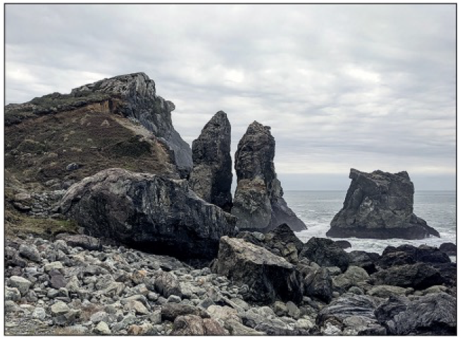
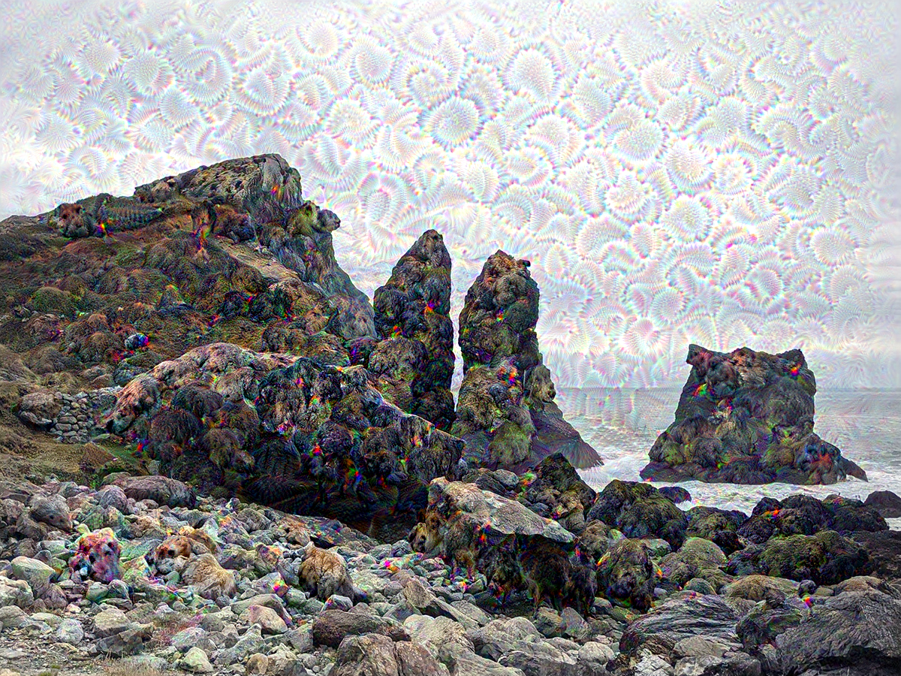
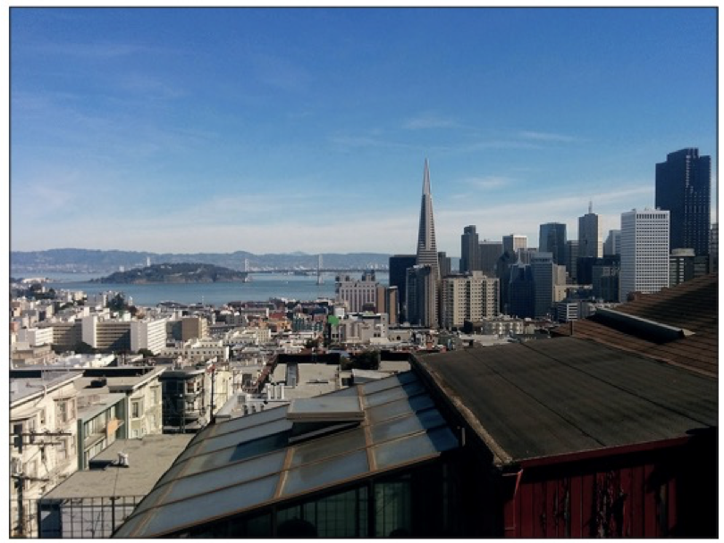
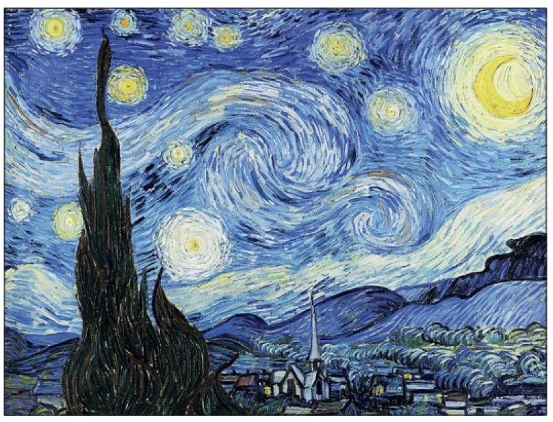
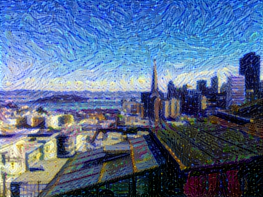
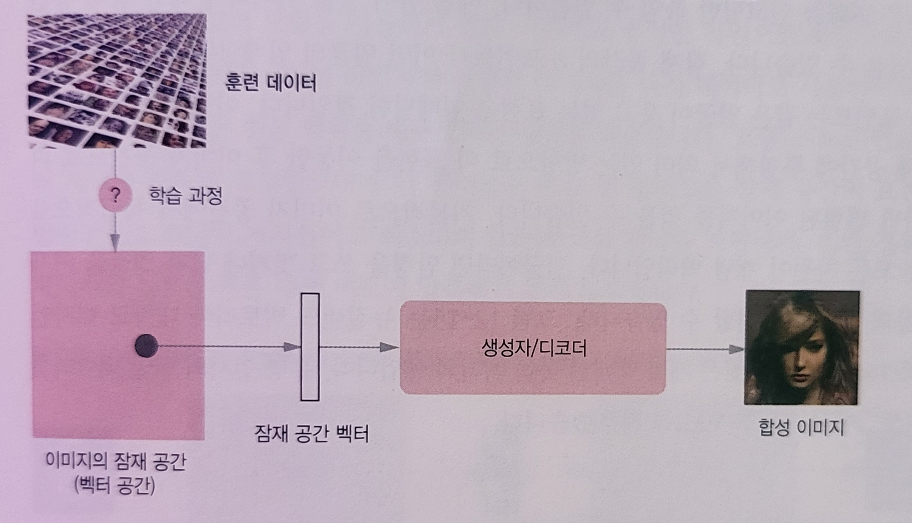
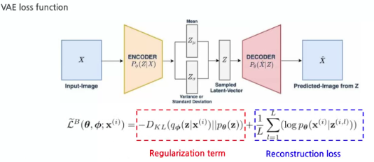
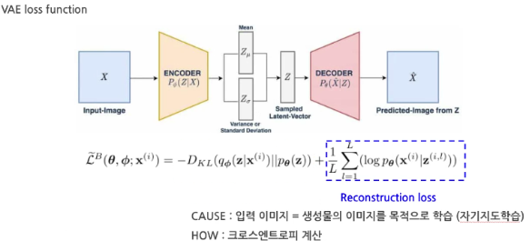
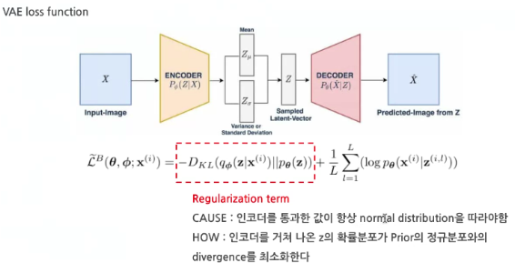
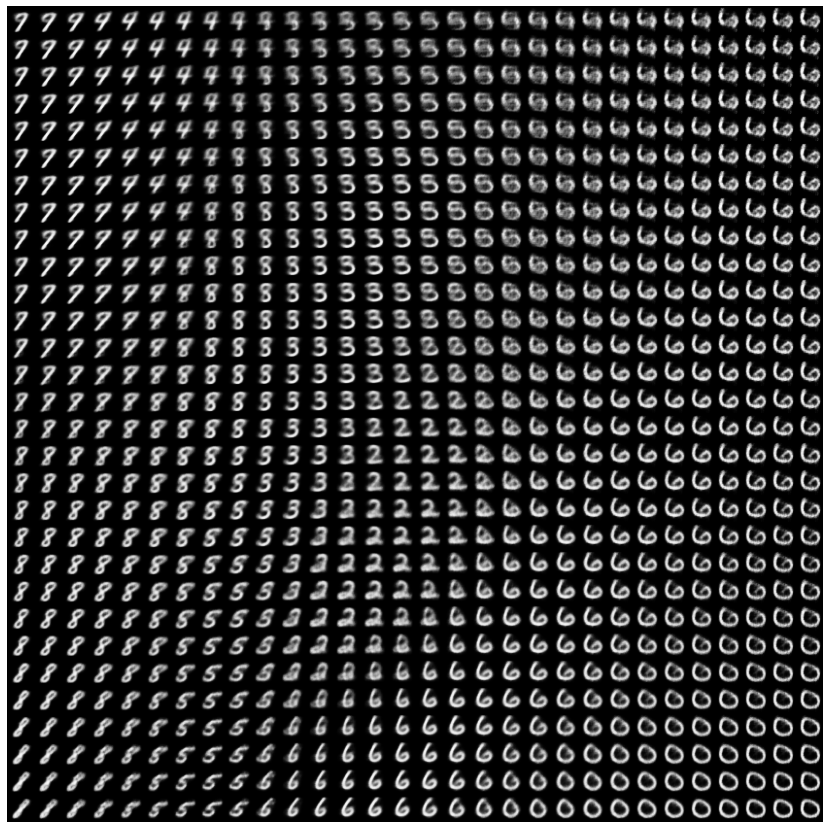

# 학습 내용

---

- 텍스트 생성
- 딥드림
- 뉴럴 스타일 트랜스퍼
- 변이형 오토인코더 사용한 이미지 생성
- 생성적 적대 신경망 소개

---

인공지능 -> 우리 생활과 일에 지능을 더함

	여러 분야에서 특히 예술에서느 AI가 사람의 능력을 증가시키는 도구로 사용

		-> 인공적인 지능이 아니라 확장된 지능

예술 창작

	대부분 간단한 패턴 인식과 기교로 만들어짐

		-> 여기에 AI가 필요함

사람의 지각, 언어, 예술 작품

	모두 통계적 구조를 가짐

		-> 딥러닝 알고리즘은 이 구조를 학습하는 데 뛰어남

머신러닝 모델

	1. 이미지, 음악, 글의 통계적 잠재 공간을 학습
	2. 잠재 공간에서 샘플을 뽑아 새로운 예술 작품을 만듦

잠재 공간 샘플링

	- 예술가의 능력을 높이는 붓이 될 수 있음
	- 창작 가능성을 늘림
	- 상상의 공간을 확장시킴

---

## 텍스트 생성

---

### 시퀀스 데이터를 어떻게 생성할끼?

---

일반적인 방법

	이전 토큰을 입력으로 사용해 시퀀스의 다음 1개 또는 몇 개의 토큰을 (트랜스포머 / RNN으로) 예측하는 것

ex)	"the cat is on the"란 입력이 주어짐

	다음 타킥 "mat"을 예측하도록 모델을 훈련

언어 모델?

	이전 토큰들이 주어졌을 때 다음 토큰의 확률을 모델링할 수 있는 네트워크

		-> 언어의 통계적 구조인 잠재 공간을 탐색

언어 모델을 사용해 한 단어씩 텍스트를 생성하는 과정

	1. 초기 텍스트 문자열을 주입(조건 데이터)
	2. 새로운 글자나 단어를 생성
	3. 생성된 출력을 다시 입력 데이터로 추가

		1 ~ 3 번 과정을 여러번 반복

		-> 사람이 쓴 문장과 거의 비슷함

---

### 샘플링 전력의 중요성

---

텍스트 생성할 때 중요한 것

	다음 문자을 선택하는 방법

샘플링 방법

	- 탐욕적 샘플링 
		- 항상 가장 높은 확률을 가진 글자 선택하는 방법
	- 확률적 샘플링
		- 확률 분포에서 샘플링 하는 과정에 무작위성을 주입하는 방법

모델의 소프트맥스 출력

	확률적 샘플링을 사용하기 좋음

한 가지 문제점

	샘플링 과정에서 무작위성의 양을 조절할 방법 X

특징

	- 작은 엔트로피
		- 예상 가능한 구조를 가진 시퀀스 생성
	- 높은 엔트로피
		- 놀랍고 창의적인 시퀀스 생성

해결 가능한 파라미터

	소프트맥스 온도

		-> 샘플링에 사용되는 확률 분포의 엔트로피를 나타냄

---

### 케라스를 사용한 텍스트 생성 모델 구현

---

1. 데이터 준비
---

IMDB 영화 리뷰 데이터셋 사용

	'''

	!wget https://ai.stanford.edu/~amaas/data/sentiment/aclImdb_v1.tar.gz
	!tar -xf aclImdb_v1.tar.gz

	'''

데이터셋 생성

	'''

	# TensorFlow와 Keras를 사용하여 텍스트 데이터셋을 생성하고 전처리
	import tensorflow as tf
	from tensorflow import keras

	'''
	keras.utils.text_dataset_from_dictionary: 이 함수를 사용해서 디렉토리에서 텍스트 데이터셋을 생성
	매개변수 역할
	dictionary: 데이터셋이 있는 디렉토리를 결정
	label_mode: 레이블 모드를 지정. 여기서는 None으로 설정하여 레이블 없이 데이터를 생성
	batch_size: 배치 크기를 지정
	'''
	dataset = keras.utils.text_dataset_from_directory(
	    directory="aclImdb", label_mode=None, batch_size=256)

	# 이 리뷰에 많이 등장하는   HTML태그를 제거.
	# 텍스트 분류에서 중요하지 않기 때문
	dataset = dataset.map(lambda x: tf.strings.regex_replace(x, " ", " "))

	'''

textvectorization을 사용해 벡터화

	'''

	# TensorFlow의 Keras 라이브러리 TextVectorization을 사용하여 텍스트 데이터를 벡터화하는 작업을 수행
	# 텍스트 데이터를 숫자로 변환하여 딥러닝 모델에 입력으로 사용할 수 있도록 전처리
	from tensorflow.keras.layers import TextVectorization

	sequence_length = 100

	# 가장 자주 등장하는 1만 5,000개 단어만 사용.
	# 그 외 단어는 모두 OOV 토큰인 "[UNK]"로 처리
	vocab_size = 15000

	text_vectorization = TextVectorization(
    
	    # 벡터화할 때 사용할 최대 단어 수를 제한하는 역할.
	    # 여기서는 가장 자주 등장하는 상위 1만 5,000개의 단어만 사용하도록 설정
	    max_tokens=vocab_size,

	    # 정수 단어 인덱스의 시퀀스를 반환하도록 설정
	    output_mode="int",

	    # 모델에 입력으로 사용할 시퀀스의 길이를 결정. 
	    # 길이가 100인 입력과 타깃을 사용(타깃을 한 스텝 차이가 나기 때문에 실제로 모델은 99개의 단어 시퀀스를 보게 된다.)
	    output_sequence_length=sequence_length,
	)

	# adapt메서드를 사용하여 데이터셋을 기반으로 벡터화 모델을 학습하고 적용
	# 이로써 모델은 데이터셋의 특성에 따라 단어를 인덱싱하고 벡터화하는데 필요한 정보를 얻게 됨
	text_vectorization.adapt(dataset)

	'''

언어 모델링 데이터셋 생성

	'''

	# 텍스트 데이터를 언어 모델을 학습하기 위한 데이터셋으로 변환하는 작업을 수행

	# prepare_lm_dataset: 입력된 텍스트 배치를 정수 시퀀스의 배치로 변환하는 작업을 수행
	# text_vectorization 모델을 사용하여 텍스트를 정수 시퀀스로 벡터화한 후, 시퀀스의 마지막 단어를 제외한 입력과 시퀀스의 첫 단어를 제외한 타깃을 생성
	def prepare_lm_dataset(text_batch):

	    # 텍스트(문자열)의 배치를 정수 시퀀스의 배치로 변환
	    vectorized_sequences = text_vectorization(text_batch)

	    # 시퀀스의 마지막 단어를 제외한 입력을 만든다.
	    x = vectorized_sequences[:, :-1]

	    # 시퀀스의 첫 단어를 제외한 타깃을 만든다.
	    y = vectorized_sequences[:, 1:]
	    return x, y

	# dataset.map 메서드를 사용하여 입렉 데이터셋에 'prepare_lm_dataset'함수를 적용하여 데이터셋을 변환한 결과
	lm_dataset = dataset.map(prepare_lm_dataset, num_parallel_calls=4)

	'''

---

트랜스포머 기반의 시퀀스-투-시퀀스 모델

일반 시퀀스 모델 사용시 발생하는 이슈 

	- N개 보다 적은 단어로 예측을 시작할 수 있어야 함
		- 그렇지 않으면 비교적 긴 시작 문장을 사용해야 하는 제약이 생김
	- 훈련에 사용하는 많은 시퀀스 
		- 중복되어 있음

2가지 이슈를 해결하기 위한 방법

	시퀀스-투-시퀀스 모델 사용

텍스트 생성의 특징

	- 소스 시퀀스가 존재 X
		- 과거의 토큰이 주어지면 타킷 시퀀스에 있는 다음 토큰을 예측하는 것뿐이기 때문
	- 디코더만 사용해 수행 가능
		- 코잘 패딩 덕분에 N+1을 예측하기 위해 0 ~ N까지의 단어만 바라볼 것

2. 간단한 트랜스포머 기반 언어 모델 구성
---

PositionalEmbedding과 TransformerDecoder 정의

	'''

	import tensorflow as tf
	from tensorflow.keras import layers

	# 입력된 토큰 시퀀스에 위치 정보를 추가하는 레이어
	class PositionalEmbedding(layers.Layer):
	    def __init__(self, sequence_length, input_dim, output_dim, **kwargs):
	        super().__init__(**kwargs)

	        # 입력 토큰을 임베딩하는 레이어
	        self.token_embeddings = layers.Embedding(
	            input_dim=input_dim, output_dim=output_dim)
        
	        # 위치 정보를 임베딩하는 레이어
	        self.position_embeddings = layers.Embedding(
	            input_dim=sequence_length, output_dim=output_dim)
        
	        self.sequence_length = sequence_length
	        self.input_dim = input_dim
	        self.output_dim = output_dim

	    # 입력 시퀀스에 토큰 임베딩과 위치 임베딩을 더한 결과를 반환
	    def call(self, inputs):
	        length = tf.shape(inputs)[-1]
	        positions = tf.range(start=0, limit=length, delta=1)
	        embedded_tokens = self.token_embeddings(inputs)
	        embedded_positions = self.position_embeddings(positions)
	        return embedded_tokens + embedded_positions

	    # 입력 시퀀스에서 패딩을 마스킹하는 마스크를 생성
	    def compute_mask(self, inputs, mask=None):
	        return tf.math.not_equal(inputs, 0)

	    def get_config(self):
	        config = super(PositionalEmbedding, self).get_config()
	        config.update({
	            "output_dim": self.output_dim,
	            "sequence_length": self.sequence_length,
	            "input_dim": self.input_dim,
	        })
	        return config

	# 트랜스포머 디코더 계층을 정의하는 클래스
	class TransformerDecoder(layers.Layer):
	    def __init__(self, embed_dim, dense_dim, num_heads, **kwargs):
	        super().__init__(**kwargs)
	        self.embed_dim = embed_dim
	        self.dense_dim = dense_dim
	        self.num_heads = num_heads

	        # attention_1, attention_2는 각각 입력 시퀀스에 대한 셀프 어텐션과 인코더 출력에 대한 어텐션을 수행하는 MultiHeadAttention 레이어
	        self.attention_1 = layers.MultiHeadAttention(
	          num_heads=num_heads, key_dim=embed_dim)
	        self.attention_2 = layers.MultiHeadAttention(
	          num_heads=num_heads, key_dim=embed_dim)
        
	        # 어텐션 출력을 밀집 연산하는 Sequential 레이어
	        self.dense_proj = keras.Sequential(
	            [layers.Dense(dense_dim, activation="relu"),
	             layers.Dense(embed_dim),]
	        )

	        # layernorm_1, layernorm_2, layernorm3는 각각 레이어 정규화 레이어이다.
	        self.layernorm_1 = layers.LayerNormalization()
	        self.layernorm_2 = layers.LayerNormalization()
	        self.layernorm_3 = layers.LayerNormalization()
	        self.supports_masking = True

	    def get_config(self):
	        config = super(TransformerDecoder, self).get_config()
	        config.update({
	            "embed_dim": self.embed_dim,
	            "num_heads": self.num_heads,
	            "dense_dim": self.dense_dim,
	        })
	        return config

	    # 인과적 마스크(케이블러티 마스크)를 생성하는 함수
	    # 인과적 마스크: 현재 위치의 토큰이 미래의 위치에 영향을 미치지 않도록 하는 역할을 함
	    def get_causal_attention_mask(self, inputs):
	        input_shape = tf.shape(inputs)
	        batch_size, sequence_length = input_shape[0], input_shape[1]
	        i = tf.range(sequence_length)[:, tf.newaxis]
	        j = tf.range(sequence_length)
	        mask = tf.cast(i >= j, dtype="int32")
	        mask = tf.reshape(mask, (1, input_shape[1], input_shape[1]))
	        mult = tf.concat(
	            [tf.expand_dims(batch_size, -1),
	             tf.constant([1, 1], dtype=tf.int32)], axis=0)
	        return tf.tile(mask, mult)

	    # 입력, 인코더 출력, 마스크를 입력으로 받아 디코더 계층의 연산을 수행하고 결과를 반환
	    def call(self, inputs, encoder_outputs, mask=None):
	        causal_mask = self.get_causal_attention_mask(inputs)
	        if mask is not None:
	            padding_mask = tf.cast(
	                mask[:, tf.newaxis, :], dtype="int32")
	            padding_mask = tf.minimum(padding_mask, causal_mask)
	        attention_output_1 = self.attention_1(
	            query=inputs,
	            value=inputs,
	            key=inputs,
	            attention_mask=causal_mask)
	        attention_output_1 = self.layernorm_1(inputs + attention_output_1)
	        attention_output_2 = self.attention_2(
	            query=attention_output_1,
	            value=encoder_outputs,
	            key=encoder_outputs,
	            attention_mask=padding_mask,
	        )
	        attention_output_2 = self.layernorm_2(
	            attention_output_1 + attention_output_2)
	        proj_output = self.dense_proj(attention_output_2)
	        return self.layernorm_3(attention_output_2 + proj_output)

	'''

모델 정의

	'''

	from tensorflow.keras import layers

	# 임베딩 차원, 잠재 차원 및 어텐션 헤드의 수를 정의
	embed_dim = 256
	latent_dim = 2048
	num_heads = 2

	# 모델의 입력을 정의. 이 경우 가변 길이의 정수 시퀀스를 입력으로 사용
	inputs = keras.Input(shape=(None,), dtype="int64")

	# PositionalEmbedding클래스를 사용하여 입력 데이터에 위치 임베딩을 적용
	x = PositionalEmbedding(sequence_length, vocab_size, embed_dim)(inputs)

	# TransformerDecoder클래스를 사용하여 디코더 레이어를 생성. 인코더 출력을 입력으로 받고, 디코더의 출력을 계산한다.
	x = TransformerDecoder(embed_dim, latent_dim, num_heads)(x, x)

	# 출력 시퀀스 타임스텝마다 가능한 어휘 사전의 단어에 대해 소프트맥스 확률을 계산한다.
	outputs = layers.Dense(vocab_size, activation="softmax")(x)

	# 입력과 출력을 연결하여 최종 모델을 생성
	model = keras.Model(inputs, outputs)

	# 모델을 컴파일한다. 손실 함수로 'sparse_categorical_crossentropy'를 사용하며, 옵티마이저로 rmsprop을 사용
	model.compile(loss="sparse_categorical_crossentropy", optimizer="rmsprop")

	'''

---

### 가변 온도 샘플링을 사용한 텍스트 생성 콜백

---

다양한 온도로 텍스트 생성

	콜백을 사용해 에포크가 끝날 때마다 실행

3. 텍스트 생성 콜백 정의 및 모델 훈련
---

	'''

	import numpy as np

	# 단어 인덱스를 문자열로 매핑하는 딕셔너리. 텍스트 디코딩에 사용
	tokens_index = dict(enumerate(text_vectorization.get_vocabulary()))

	# 주어진 확률 분포를 기반으로 온도를 적용하여 다음 단어를 샘플링하는 함수. 온도가 높을수록 더 다양한 샘플링 결과가 나올 수 있다.
	def sample_next(predictions, temperature=1.0):
	    predictions = np.asarray(predictions).astype("float64")
	    predictions = np.log(predictions) / temperature
	    exp_preds = np.exp(predictions)
	    predictions = exp_preds / np.sum(exp_preds)
	    probas = np.random.multinomial(1, predictions, 1)
	    return np.argmax(probas)

	# 콜백 클래스로, 몯ㄹ의 에포크 종료 시마다 새로운 텍스트를 생성하는 역할을 한다. 생성할 텍스트의 길이, 모델 입력 길이, 샘플링 온도 등을 설정할 수 있다.
	class TextGenerator(keras.callbacks.Callback):
	    def __init__(self,
	                 prompt, # 텍스트 생성을 위한 시작 문장
	                 generate_length, # 생성할 단어 계수
	                 model_input_length,
	                 temperatures=(1.,), # 샘플링에 사용할 온도 범위
	                 print_freq=1):
	        self.prompt = prompt
	        self.generate_length = generate_length
	        self.model_input_length = model_input_length
	        self.temperatures = temperatures
	        self.print_freq = print_freq

	    # 에포크 종료 시 호출된다. 지정된 시작 문장으로부터 모델을 사용하여 텍스트를 생성하고 출력한다. 다양한 온도 값을 사용하여 텍스트를 생성하는 결과를 비교한다.
	    def on_epoch_end(self, epoch, logs=None):
	        if (epoch + 1) % self.print_freq != 0:
	            return
	        for temperature in self.temperatures:
	            print("== Generating with temperature", temperature)

	            # 시작 단어에서부터 텍스트를 생성한다.
	            sentence = self.prompt
	            for i in range(self.generate_length):
	                # 현재 시퀀스를 모델에 주입한다.
	                tokenized_sentence = text_vectorization([sentence])
	                predictions = self.model(tokenized_sentence)

	                # 마지막 타임스텝의 예측을 추출하여 다음 언어를 샘플링한다.
	                next_token = sample_next(predictions[0, i, :])
	                sampled_token = tokens_index[next_token]
	
	                # 새로운 단어를 현재 시퀀스에 추가하고 반복한다.
	                sentence += " " + sampled_token
	            print(sentence)

	prompt = "This movie"

	# TextGenerator 콜백 클래스의 인스턴스를 생성하여 설정한다. 이 콜백은 모델의 에포크 종료 시마다 주어진 시작 문장으로부터 다양한 온도 값에 대한 텍스트를 생성하고 출력한다.
	text_gen_callback = TextGenerator(
	    prompt,
	    generate_length=50,
	    model_input_length=sequence_length,

	    # 텍스트 샘플링에 다양한 온도를 사용하여 텍스트 생성에 미치는 온도의 영향을 확인
	    temperatures=(0.2, 0.5, 0.7, 1., 1.5))

	model.fit(lm_dataset, epochs=200, callbacks=[text_gen_callback])

	'''

	결과:

	'''

	temperature=0.2

	            “this movie is a [UNK] of the original movie and the first half hour of the 

	             movie is pretty good but it is a very good movie it is a good movie for the

	             time period”

	            “this movie is a [UNK] of the movie it is a movie that is so bad that it is a

	             [UNK] movie it is a movie that is so bad that it makes you laugh and cry at

	             the same time it is not a movie i dont think ive ever seen”

	temperature=0.5

	            “this movie is a [UNK] of the best genre movies of all time and it is not a

	             good movie it is the only good thing about this movie i have seen it for the

	             first time and i still remember it being a [UNK] movie i saw a lot of years”

	            “this movie is a waste of time and money i have to say that this movie was

	             a complete waste of time i was surprised to see that the movie was made

	             up of a good movie and the movie was not very good but it was a waste of

	             time and”

	temperature=0.7

	            “this movie is fun to watch and it is really funny to watch all the characters

	             are extremely hilarious also the cat is a bit like a [UNK] [UNK] and a hat

	             [UNK] the rules of the movie can be told in another scene saves it from

	             being in the back of ”

	            “this movie is about [UNK] and a couple of young people up on a small boat

	             in the middle of nowhere one might find themselves being exposed to a

	             [UNK] dentist they are killed by [UNK] i was a huge fan of the book and i

	             havent seen the original so it”

	temperature=1.0

	            “this movie was entertaining i felt the plot line was loud and touching but on

	              a whole watch a stark contrast to the artistic of the original we watched

	              the original version of england however whereas arc was a bit of a little too

	              ordinary the [UNK] were the present parent [UNK]”

	            “this movie was a masterpiece away from the storyline but this movie was

	              simply exciting and frustrating it really entertains friends like this the actors

	              in this movie try to go straight from the sub thats image and they make it a

	              really good tv show”

	temperature=1.5

	            “this movie was possibly the worst film about that 80 women its as weird

	             insightful actors like barker movies but in great buddies yes no decorated

	             shield even [UNK] land dinosaur ralph ian was must make a play happened

	             falls after miscast [UNK] bach not really not wrestlemania seriously sam

	             didnt exist”

	            “this movie could be so unbelievably lucas himself bringing our country

	             wildly funny things has is for the garish serious and strong performances

	             colin writing more detailed dominated but before and that images gears

	             burning the plate patriotism we you expected dyan bosses devotion to

	             must do your own duty and another”

	'''

		- 낮은 온도는 단조로운 반복적인 텍스트를 생성
			- 이로 인해 생성된 텍스트가 자주 반복되는 현상이 발생
		- 높은 온도에서 생성된 텍스트는 흥미롭고 다양한 결과를 만들어냄
			- 예상치 못한 내용이 등장하며 창의성을 발휘
			- 구조가 무너져 랜덤한 출력이 될 수 있
				- 무작위성이 강조되어 예측하기 어려운 텍스트가 생성
		- 0.7 정도의 온도가 적절한 결과를 만들어 내는 것으로 보임

---

## 딥드림

---

딥드림??

	합성곱 신경망이 학습한 표현을 사용해 예술적으로 이미지를 조작하는 기법

딥드림 알고리즘

	컨브넷 필터 시각화 기법과 거의 동일

	- 특정 필터가 아닌 전체 층의 활성화를 최대화
		- 한꺼번에 많은 특성을 섞어 시각화
	- 빈 이미지 / 노이즈가 조금 있는 입력이 아니라 이미 가지고 있는 이미지 사용
		- 기존 시각 패턴을 바탕으로 예술적인 스타일로 왜곡
	- 시각 품질을 높이기 위해 여러 다른 스케일(옥타브)로 처리

---

### 케라스 딥드림 구현

--- 

1. 이미지 다운
---

	'''

	# TensorFlow와 Keras를 사용하여 이미지를 로드하고 표시하는 작업을 수행
	from tensorflow import keras
	import matplotlib.pyplot as plt

	# 이미지 파일을 다운로드하고 저장할 경로를 설정한다. get_file함수는 지정된 URL에서 파일을 다운로드하고 해당 파일의 경로를 반환한다.
	base_image_path = keras.utils.get_file(
	    "coast.jpg", origin="https://img-datasets.s3.amazonaws.com/coast.jpg")

	# 축을 표시하지 않도록 설정
	plt.axis("off")

	# 다운로드한 이미지를 로드하고 imshow 함수를 사용하여 이미지를 표시한다. 
	plt.imshow(keras.utils.load_img(base_image_path))

	'''

사전 훈련된 모델

	딥드림에서 사용된 커브넷 -> 인셉션 모델

2. 사전 훈련된 inceptionV3 모델 로드하기
---

	'''

	# TensorFlow의 Keras 라이브러리에서 inception_v3 모델을 불러오기 위해 해당 모듈을 임포트
	from tensorflow.keras.applications import inception_v3

	# InceptionV3 클래스를 사용하여 InceptionV3 모델을 불러온다. 매개변수로는 다음을 사용
	# weights="imagenet": ImageNet 데이터셋에서 사전 훈련된 가중치를 사용
	# include_top=False : 마지막 fully connected 레이어를 포함하지 않고 모델을 불러온다. 이렇게 함으로 모델의 마지막 레이어를 제외하고 특성 추출 부분만을 사용할 수 있다.
	model = inception_v3.InceptionV3(weights="imagenet", include_top=False)

	'''

다양한 중간층의 활성화를 반환하는 특성 추출 모델을 생성

	경사 상승법 동안 최대화할 손실에 대한 각 층의 기여도에 가중치를 주기 위해 스칼라 값을 선택

3. 딥드림 손실에 대한 각 층의 기여도 설정
---

	'''

	layer_settings = { 
	    # 활성화를 최대화할 층과 전체 손실에 대한 가중치. 이 설정을 바꾸면 새로운 시각 효과를 얻을 수 있음
	    "mixed4": 1.0,
	    "mixed5": 1.5,
	    "mixed6": 2.0,
	    "mixed7": 2.5,
	}

	# 각 층의 심볼릭 출력을 모으는 역할
	# model.get_layer를 사용하여 각 층의 심볼릭 출력을 'output_dict'에 저장
	outputs_dict = dict(
	    [
	        (layer.name, layer.output)
	        for layer in [model.get_layer(name) for name in layer_settings.keys()]
	    ]
	)

	# 각 타깃 층의 활성화 값을 (하나의 딕셔너리로) 변환하는 모델
	# 이렇게 생성된 feature_extractor 모델은 딥드림 단계에서 각 층의 활성화 값을 활용하는 데 사용
	feature_extractor = keras.Model(inputs=model.inputs, outputs=outputs_dict)

	'''

손실 계산

	경사 상승법을 사용하여 각 스케일에서 최대화할 값 계산

		- 여러 층에 있는 모든 필터 활성화를 동시에 최대화
		- 상위 층의 활성화의 L2놈에 가중치를 준 평균을 최대화

4. 딥드림 손실
---

	'''

	def compute_loss(input_image):
	    # feature_extractor를 사용하여 입력 이미지의 다양한 중간층에서의 활성화 값을 추출한다
	    features = feature_extractor(input_image)

	    # 손실을 0으로 초기화
	    loss = tf.zeros(shape=())

	    for name in features.keys():
	        # 미리 설정된 layer_settings에 따라 각 층에 대한 가중치 개수를 가져옴. 이 가중치는 해당 층의 활성화 값이 최대화되는 정도를 조절한다.
	        coeff = layer_settings[name]

	        activation = features[name]
        
	        # 경계 부근의 인공적인 패턴을 피하기 위해 테두리가 아닌 픽셀만 손실에 추가
	        # 활성화 값의 제곱을 계산하고 해당 값의 평균을 구한다
	        # 가중치 계수를 곱하여 최종 손실에 누적
	        loss += coeff * tf.reduce_mean(tf.square(activation[:, 2:-2, 2:-2, :]))

	    # 최종적으로 계산된 손실 값을 반환
	    return loss

	'''

5. 경사 상승법 정의
---

	'''

	import tensorflow as tf

	@tf.function # tf.function으로 컴파일하여 훈련 스텝의 속도를 높인다.
	# 현재 이미지에 대한 딥드림 손실의 그레이디언트를 계산하고, 그레이디언트를 정규화하여 이미지를 업데이트하는 함수
	def gradient_ascent_step(image, learning_rate):

	    # 현재 이미지에 대한 딥드림 손실의 그레이디언트를 계산
	    with tf.GradientTape() as tape:
	        tape.watch(image)
	        loss = compute_loss(image)
	    grads = tape.gradient(loss, image)

	    # 그레이디언트를 L2 정규화하여 방향을 정규화한다.
	    grads = tf.math.l2_normalize(grads)

	    # 이미지를 학습률('learning_rate')과 그레이디언트를 이용하여 업데이트한다
	    image += learning_rate * grads

	    # 손실과 업데이트된 이미지를 반환한다.
	    return loss, image

	def gradient_ascent_loop(image, iterations, learning_rate, max_loss=None): # 주어진 이미지 스케일(옥타브)에 대한 경사 상승법을 수행
	    # iterations 횟수만큼 딥드림 손실을 증가시키는 방향으로 반복적으로 이미지를 업데이트
	    for i in range(iterations):
	        loss, image = gradient_ascent_step(image, learning_rate)

	        # 손실이 일정 임계 값을 넘으면 중지(과도하게 최적화하면 원치 않는 이미지를 만들 수 있음)
	        if max_loss is not None and loss > max_loss:
	            break
        
	        # 각 손실에서의 손실 값을 출력
	        print(f"... 스텝 {i}에서 손실 값: {loss:.2f}")
	    return image

	'''

딥드림 알고리즘의 바깥쪽 루프

옥타브 스케일

	3개의 다른 '옥타브'로 이미지를 처리

훈련 스타일

	가장 작은 값에서 가장 큰 값까지 각 옥타브에서 gradient_ascent_loop()로 경사 상승법 단계를 30번 실행하여 앞서 정의한 손실을 최대화

옥타브 간 이미지 크기 조정

	작은 이미지에서 시작하여 점점 크기를 키움 

		-> 각 옥타브 사이에서는 이미지가 40% 증가

6. 필요한 파라미터 정의
---

	'''

	step = 20. # 경사 상승법 단계 크기
	num_octave = 3 # 경사 상승법을 실행할 스케일 횟수
	octave_scale = 1.4 # 연속적인 스케일 사이의 크기 비율
	iterations = 30 # 스케일 단계마다 수행할 경사 상승법 단계 횟수
	max_loss = 15. # 이보다 손실이 커지면 현재 스케일에서 경사 상승법 과정을 중지

	'''

7. 이미지 처리 유틸리티 정의
---

	'''

	import numpy as np

	# 이미지를 로드하고 크기를 바꾸어 적절한 배열로 변환하는 유틸리티 함수
	def preprocess_image(image_path):
	    img = keras.utils.load_img(image_path)
	    img = keras.utils.img_to_array(img)
	    img = np.expand_dims(img, axis=0)
	    img = keras.applications.inception_v3.preprocess_input(img)
	    return img

	# 넘파이 배열을 이미지로 변환하는 유틸리티 함수
	def deprocess_image(img):
	    img = img.reshape((img.shape[1], img.shape[2], 3))

	    # inceptionV3전처리 복원하기
	    img += 1.0
	    img *= 127.5

	    # unit8로 바꾸고 [0,255] 범위로 클리핑한다.
	    img = np.clip(img, 0, 255).astype("uint8")
	    return img
	
	'''
---
tips

스케일을 연속적으로 증가

	이미지 디테일을 많이 잃게 됨

해결방법

	스케일을 늘린 후 이미지에 손실된 디테일 재주입

ex) 작은 이미지:s / 큰 이미지:l

	크기 l로 변경된 원본 이미지와 크기 s로 변경된 원본 이미지 사이의 차이를 계산

		-> 이 차이가 s -> l로 변경되었을 때 잃어버린 디테일
---

8. 연속적인 여러 개의 '옥타브'에 걸쳐 경사 상승법 실행
---

	'''

	# 테스트 이미지를 로드한다.
	original_img = preprocess_image(base_image_path)

	# 원본 이미지의 형태(shape)의 높이와 너비를 추출한다.
	original_shape = original_img.shape[1:3]

	# 여러 옥타브에서 이미지 크기를 계산한다. 이미지를 크게 변형하면서 작은 세부 사항을 고려할 수 있도록 하기 위함
	successive_shapes = [original_shape]
	for i in range(1, num_octave):
	    shape = tuple([int(dim / (octave_scale ** i)) for dim in original_shape])
	    successive_shapes.append(shape)
	successive_shapes = successive_shapes[::-1]

	# 원본 이미지를 첫 번째 옥타브의 크기로 줄인다.
	shrunk_original_img = tf.image.resize(original_img, successive_shapes[0])

	# 이미지를 복사한다(원본 이미지는 그대로 보관). 이후 경사 상승법을 적용하여 이미지를 수정할 것
	img = tf.identity(original_img)

	# 여러 옥타브에 대해 반복
	for i, shape in enumerate(successive_shapes):
	    print(f"{shape} 크기의 {i}번째 옥타브 처리")

	    # 딥드림 이미지 스케일을 높인다.(현재 옥타브의 크기로 이미지를 조절)
	    img = tf.image.resize(img, shape)

	    # 경사 상승법을 실행하고 딥드림 이미지를 수정한다.
	    img = gradient_ascent_loop(
	        img, iterations=iterations, learning_rate=step, max_loss=max_loss
	    )

	    # 작은 버전의 원본 이미지의 스케일을 높인다. 픽셀 경계가 보일 것이다.
	    upscaled_shrunk_original_img = tf.image.resize(shrunk_original_img, shape)

	    # 이 크기에 해당하는 고해상도 버전의 원본 이미지를 계산한다.
	    same_size_original = tf.image.resize(original_img, shape)

	    # 두 이미지의 차이가 스케일을 높였을 때 손실된 디테일이다.
	    lost_detail = same_size_original - upscaled_shrunk_original_img

	    # 손실된 디테일을 딥드림 이미지에 다시 주입한다.
	    img += lost_detail

	    # 다음 옥타브를 위해 작은 버전의 원본 이미지를 현재 옥타브 크기로 다시 조절한다.
	    shrunk_original_img = tf.image.resize(original_img, shape)

	# 최종 경과를 저장한다.
	keras.utils.save_img("dream.png", deprocess_image(img.numpy()))

	'''

---

## 뉴럴 스타일 트랜스퍼

---

뉴럴 스타일 트랜스퍼?

	타킷 이미지의 콘텐츠를 보존하면서 참조 이미지의 스타일을 타킷 이미지에 적용

스타일?

	질감, 색깔, 이미지에 있는 다양한 크디의 시각 요소를 의미

		-> 위 그림(빈센트 반 고흐(Vincent Van Gogh)의 <별이 빛나는 밤(Starry Night)>)에서 파란색과 노란색의 원을 그리는 듯한 붓질을 하나의 스타일

콘텐츠?

	이미지에 있는 고수준의 대형 구조 의미

		-> 튀빙겐 사진의 건물

스타일 트랜스퍼의 목표

	참조 이미지의 스타일을 적용하면서 원본 이미지의 콘텐츠를 보존하는 것

손실 함수 수학적으로 정의

	loss = distance(style(reference_image) - style(combination_image)) + distance(content(original_image) - content(combination_image))

		- distance -> (L2 노름 같은)노름 함수
		- content -> 이미지의 콘텐츠 표현을 계산

	최소화 하면?

		- style(combination_image)는 style(reference_image)와 유사해짐
		- content(combination_image)는 content(original_image)와 유사해짐

---

### 콘텐츠 손실

---

네트워크 하위 층의 활성화

	지역적 정보를 가짐

네트워크 상위 층의 활성화

	전역적, 추상적 정보를 가짐

네트워크

	이미지를 다른 크기의 콘텐츠로 분해한다고 볼 수 있음

		-> 상위 층 표현은 추상적 이미지 콘텐츠를 찾는 데 활용

콘텐츠 손실?

	1. 타깃 이미지와 생성된 이미지를 컨브넷에 주입하여 상위 층 활성화를 계산한 후
	2. 이 두 값의 L2놈(norm)을 사용하여 생성된 이미지를 타깃 이미지와 유사하게 만드는 방법

		-> 컨브넷의 상위 층에서 이미지 콘텐츠를 보존하는데 사용

---

### 스타일 손실

---

스타일 손실

	여러 컨브넷 층을 사용

		-> 각 층의 활성화 출력의 그람 행렬을 이용

그람 행렬?

	층 내 특성 맵들의 내적

		-> 특성 간의 상간관계를 나타냄

	-> 이로써 특정 크기의 공간적 패턴 통계를 잡아내며 택스처에 해당

스타일 손실 계산법

	1. 스타일 참조 이미지와 생성된 이미지를 이용해 각 층의 활성화를 계산한 후
	2. 이러한 상관관계를 유사하게 유지하도록 만들어 생성된 이미지에서 텍스처가 원본과 유사하게 보이도록 함

---
tips

콘텐츠 보존

	원본 이미지와 생성된 이미지의 상위 층 활성화 유사성 유지, 두 이미지는 컨브넷에서 동일한 것으로 인식되어야 함
스타일 보존

	저수준 및 고수준 층에서 활성화의 상관관계 유사성 유지. 특성 상관관계는 텍스처를 의미하며, 생성된 이미지와 스타일 참조 이미지는 다양한 크기의 텍스처를 공유해야 함

---

### 케라스로 뉴럴 스타일 트랜스퍼 구현

---

컨브넷?

	어떤 사전 훈련된 컨브넷이든 사용하여 구현 가능

		-> VGG19 네트워크를 사용(합성곱 층이 3개 더 추가)

구현 과정

	1. 스타일 참조 이미지, 베이스 이미지, 생성된 이미지에 대한 VGG19의 층 활성화를 동시에 계산하는 네트워크를 설정
	2. 각 이미지의 활성화를 이용하여 설명한 대로 손실 함수를 정의
	3. 손실을 최소화하여 원하는 스타일 트랜스퍼를 구현
	4. 경사 하강법을 활용해 손실 함수를 최소화하는 과정을 설정

1. 스타일 이미지와 콘텐츠 이미지 준비하기
---

	이미지 크기를 높이가 400 픽셀에 맞춰 변경

	'''

	from tensorflow import keras

	# keras.utils.get_file 함수를 사용하여 변환할 이미지와 스타일 이미지를 다운로드
	base_image_path = keras.utils.get_file( # 변환할 이미지 경로
	    "sf.jpg", origin="https://img-datasets.s3.amazonaws.com/sf.jpg")
	style_reference_image_path = keras.utils.get_file( # 스타일 이미지 경로
	    "starry_night.jpg", origin="https://img-datasets.s3.amazonaws.com/starry_night.jpg")

	# keras.utils.load_img 함수를 사용하여 기본 이미지의 크기를 가져온다
	original_width, original_height = keras.utils.load_img(base_image_path).size

	# 생성할 이미지의 높이를 설정하고, 원래 이미지 비율에 맞춰 너비를 계산
	img_height = 400
	img_width = round(original_width * img_height / original_height)

	'''

	-> (콘텐츠 이미지)놉 힐에서 본 샌프란시스코

	-> (스타일 이미지)반 고흐의 <별이 빛나는 밤>

2. 입출력할 이미지의 로드, 전처리, 사후 처리를 위한 유틸리티 함수 정의
---

	'''

	import numpy as np

	# 이미지를 로드하고, 크기를 바꾸어 적절한 배열로 변환하는 유틸리티 함수
	def preprocess_image(image_path): 
	    img = keras.utils.load_img(
	        image_path, target_size=(img_height, img_width))
	    img = keras.utils.img_to_array(img)
	    img = np.expand_dims(img, axis=0)
	    img = keras.applications.vgg19.preprocess_input(img)
	    return img

	# 넘파이 배열을 이미지로 변환하는 함수
	def deprocess_image(img):
	    img = img.reshape((img_height, img_width, 3))

	    # ImageNet의 평균 픽셀 값을 더한다. 이는 vgg19.preprocess_input함수에서 수행한 변환을 복원한다.
	    img[:, :, 0] += 103.939
	    img[:, :, 1] += 116.779
	    img[:, :, 2] += 123.68

	    # 이미지를 "BGR"에서 "RGB"로 변환한다. 이것도 vgg19.preprocess_input 함수에서 수행한 변환을 복원하기 위해서이다.
	    img = img[:, :, ::-1]
    
	    img = np.clip(img, 0, 255).astype("uint8")
	    return img

	'''

3. 사전 훈련된 VGG19 모델을 사용해 특성 추출기 만들기
---

	'''

	# ImageNet에서 사전 훈련된 가중치로 VGG19 모델을 만든다.
	model = keras.applications.vgg19.VGG19(weights="imagenet", include_top=False)

	# 모델의 상위층 활성화 값을 추출하기 위해 각 층의 출력을 딕셔너리로 저장한다.
	outputs_dict = dict([(layer.name, layer.output) for layer in model.layers])

	# 이 모델은 모든 타깃 층의 활성화 값을 (하나의 딕셔너리로) 변환한다.
	feature_extractor = keras.Model(inputs=model.inputs, outputs=outputs_dict)

	'''

4. 콘텐츠 손실, 스타일 손실 정의
---

	'''

	# 손실 함수를 정의하는 부분. 손실은 원본 이미지와 생성된 이미지의 차이를 제곱하여 모든 픽셀의 값을 합산한 값
	def content_loss(base_img, combination_img):
	    return tf.reduce_sum(tf.square(combination_img - base_img))

	# 주어진 텐서 x의 그람 행렬을 계산한다
	def gram_matrix(x):
	    x = tf.transpose(x, (2, 0, 1)) # 입력 텐서의 차원을 변환한다.
	    features = tf.reshape(x, (tf.shape(x)[0], -1)) # 텐서를 2D 행렬로 변환한다.
	    gram = tf.matmul(features, tf.transpose(features)) # 2D 행렬과 그 전치행렬을 곱하여 그람 행렬을 계산한다.
	    return gram

	# 스타일 참조 이미지와 생성된 이미지 간의 손실을 계산한다
	def style_loss(style_img, combination_img):
	    S = gram_matrix(style_img) # 스타일 이미지의 그람 행렬을 계산한다.
	    C = gram_matrix(combination_img) # 생성된 이미지의 그람 행렬을 계산한다
	    channels = 3 # 컬러 채널의 수(RGB)
	    size = img_height * img_width # 이미지의 크기

	    # 그람 행렬 간의 제곱 차이를 계산하고 손실을 적절하게 스케일링
	    return tf.reduce_sum(tf.square(S - C)) / (4.0 * (channels ** 2) * (size ** 2))

	'''

5. 추가적인 손실(총 변위 손실) 함수 정의
---

	이미지의 공간적인 부드러움을 유지하고 격자 무늬가 나타나는 것을 방지하여 생성된 이미지의 자연스러움을 촉진하는 역할

		-> 일종의 규제 항으로 이해할 수 있음

	'''

	def total_variation_loss(x):
	    # a는 이미지 x의 세로 방향 픽셀 간의 차이의 제곱을 나타냄.
	    a = tf.square(
	        x[:, : img_height - 1, : img_width - 1, :] - x[:, 1:, : img_width - 1, :]
	    )

	    # b는 이미지 x의 가로 방향 픽셀 간의 차이의 제곱을 나타냄
	    b = tf.square(
	        x[:, : img_height - 1, : img_width - 1, :] - x[:, : img_height - 1, 1:, :]
	    )

	    # a와 b의 제곱 값들을 더한 후 1.25제곱근을 취한 값을 모두 합산하여 변환. 이 값은 이미지의 전체 변화량을 나타내는 총 변동 손실
	    return tf.reduce_sum(tf.pow(a + b, 1.25))

	'''

6. 최소화할 최종 손실 정의
---

	세 손실의 가중치 평균을 최소화함

	'''

	style_layer_names = [ # 스타일 손실에 사용할 층
	    "block1_conv1",
	    "block2_conv1",
	    "block3_conv1",
	    "block4_conv1",
	    "block5_conv1",
	]

	# 콘텐츠 손실에 사용할 층
	content_layer_name = "block5_conv2"

	# 총 변이 손실의 기여 가중치
	total_variation_weight = 1e-6

	# 스타일 손실의 기여 가중치
	style_weight = 1e-6

	# 콘텐츠 손실의 기여 가중치
	content_weight = 2.5e-8

	def compute_loss(combination_image, base_image, style_reference_image):
	    # 입력 이미지를 합쳐서 하나의 텐서로 만든다.
	    input_tensor = tf.concat(
	        [base_image, style_reference_image, combination_image], axis=0
	    )

	    # 각 이미지에 대한 활성화 값을 추출한다.
	    features = feature_extractor(input_tensor)
    
	    # 손실을 0으로 초기화
	    loss = tf.zeros(shape=())

	    # 콘텐츠 손실을 더한다.
	    layer_features = features[content_layer_name]
	    base_image_features = layer_features[0, :, :, :]
	    combination_features = layer_features[2, :, :, :]
	    loss = loss + content_weight * content_loss(
	        base_image_features, combination_features
	    )

	    # 스타일 손실을 더한다.
	    for layer_name in style_layer_names:
	        layer_features = features[layer_name]
	        style_reference_features = layer_features[1, :, :, :]
	        combination_features = layer_features[2, :, :, :]
	        style_loss_value = style_loss(
	          style_reference_features, combination_features)
	        loss += (style_weight / len(style_layer_names)) * style_loss_value

	    # 총 변위 손실을 더한다
	    loss += total_variation_weight * total_variation_loss(combination_image)

	    # 손실값 반환
	    return loss

	'''

		content_weight?

			생성된 이미지에 타깃 콘텐츠가 얼마나 나타날지를 조절하는 계수

		-> content_weight값을 높이면 생성된 이미지에 원본 콘텐츠가 강조될 수 있음

7. 경사 하강법 단계 설정
---

	'''

	import tensorflow as tf

	@tf.function # tf.function으로 컴파일하여 훈련 스텝의 속도를 높인다.
	def compute_loss_and_grads(combination_image, base_image, style_reference_image):
	    with tf.GradientTape() as tape:
	        loss = compute_loss(combination_image, base_image, style_reference_image)
	    grads = tape.gradient(loss, combination_image)
	    return loss, grads

	optimizer = keras.optimizers.SGD(
	    keras.optimizers.schedules.ExponentialDecay( 
	        # 학습률 100에서 시작하여 100 스텝마다 4%씩 감소시킨다.
	        initial_learning_rate=100.0, decay_steps=100, decay_rate=0.96
	    )
	)

	base_image = preprocess_image(base_image_path)
	style_reference_image = preprocess_image(style_reference_image_path)
	# 훈련하는 동안 합성된 이미지를 업데이트하기 때문에 Variable에 저장
	combination_image = tf.Variable(preprocess_image(base_image_path))

	iterations = 4000
	for i in range(1, iterations + 1):
	    loss, grads = compute_loss_and_grads(
	        combination_image, base_image, style_reference_image
	    )	

    	# 스타일 트랜스퍼 손실이 감소되는 방향으로 합성 이미지를 업데이트한다.
    	optimizer.apply_gradients([(grads, combination_image)])

    	if i % 100 == 0:
        	print(f"{i}번째 반복: loss={loss:.2f}")
	        img = deprocess_image(combination_image.numpy())
	        fname = f"combination_image_at_iteration_{i}.png"

	        # 일정한 간격으로 합성 이미지를 저장
	        keras.utils.save_img(fname, img)

	'''

	- 이미지의 텍스처를 변화시키거나 전이하는 것
		- 스타일 이미지의 텍스처가 비슷한 패턴을 가지고 있을 때 효과적으로 작동
	- 매우 추상적인 결과물은 만들어내지 못함
	- 느리지만 간단한 변환을 수행하여 작고 빠른 컨브넷을 사용하여 학습할 수 있음

---

## 변이형 오토인코더를 사용한 이미지 생성

---

### 이미지의 잠재 공간에서 샘플링

---

이미지 생성의 핵심 아이디어

	각 포인트가 실제와 같은 이미지로 매핑될 수 있는 저차원 잠재 공간의 표현을 만드는 것 

생성자 / 디코더 ??

	잠재 공간의 한 포인트를 입력 받아 이미지(픽셀 그리드)를 출력하는 모듈

이미지 생성 과정

	1. 잠재 공간을 학습
	2. 잠재 공간에서 포인트 하나를 샘플링
	3. 이미지 공간으로 매핑해 이미지 생성

---

### 이미지 변형을 위한 개념 벡터

---

개념 벡터?

	잠재 공간이나 임베딩 공간이 주어지면 이 공간의 어떤 방향은 원본 데이터의 흥미로운 변화를 인코딩한 축일 수 있음

ex) 얼굴 이미지에 대한 잠재 공간에 웃음 벡터 존재

	z 포인트 -> 어떤 얼굴의 표현 임베딩한 것

	z+s 포인트 -> 같은 얼굴이 웃고 있는 표현 임베딩한 것

	주의할 점

		z+s 포인트가 웃는 얼굴 표현 이라고 해서 s 포인트가 웃는 입모양 포인트라고 단정 지을 수 없음

---

### 변이형 오토인코더

---

오토인코더(AE)?

	- 입력을 저차원 잠재 공간으로 임코딩한 후 디코딩하여 복원하는 네트워크
	- 인코더가 주된 역할
		-  데이터를 압축(인코딩)하여 저차원 표현(latent space)으로 변환하는 것이 핵심
	- 디코더는 부가적인 부분
		- 인코더로부터 나온 저차원 표현을 다시 원본 데이터로 복원하는 역할

전통 오토인코더(AE)의 한계점

	- 특별히 유용하거나 구조화가 잘된 잠재 공간을 만들지 못함
	- 압축도 아주 뛰어나지 않음

변이형 오토인코더(VAE)?

	- 딥러닝과 베이즈 추론의 아이디어를 혼합한 오토인코더의 최신 버전
	- 디코더가 주된 역할
		- 잠재 공간에서 샘플링한 잠재 변수로부터 데이터를 생성하는 것이 핵심
	- 인코더는 부가적인 부분
		- 입력 데이터를 확률 분포(보통 정규분포)로 매핑하여 잠재 변수의 평균과 분산을 예측하는 역할

변이형 오토인코더(VAE) 특징

	- 약간의 통계 기법을 통해 연속적이고 구조적인 잠재 공간 학습 가능
	- 평균과 분산 파라미터를 사용해 이 분포에서 무작위로 하나의 샘플 추출
	- 잠재 공간에서 샘플링한 모든 포인트는 유요한 출력으로 디코딩 됨

변이형 오토인코더(VAE) 동작 순서

	1. 인코더 모듈이 입력 샘플 input_img를 잠재 공간의 두 파라미터 z_mean과 z_log_var로 변환
	2. 입력 이미지가 생성되었다고 가정한 잠재 공간의 정규 분포에서 포인트 z를 z = z_mean + exp(0.5 * z_log_var) * epsilon 처럼 무작위로 샘플링
		- epsilon은 작은 값을 가진 랜덤 텐서입니다.
	3. 디코더 모듈은 잠재 공간의 이 포인트를 원본 입력 이미지로 매핑해 복원

		- 잠재 공간의 위치(z_mean)
			- input_img와 비슷한 이미지로 디코딩될 것
			- 잠재 공간을 연속적이고 의미 있는 공간으로 만들어 줌
		- 잠재 공간은 매우 구조적이고 개념 벡터로 다루기에 적합함

변이형 오토인코더(VAE)의 손실 함수

	- 재구성 손실(reconstruction loss)
		- 원본 입력값을 출력으로 생성할 수 있게 복원해주는 loss
			- VAE에서 decoder의 output pi 는 베르누이 분포(이진분류) 를 따른다고 가정
		- binary cross entropy
			- predicted value pi 와 target value xi 의 차이를 구하기 위함

	- 규제 손실(regularization loss)
		- 표준 정규분포에서 샘플링 된 값 p(z)과 encoder output 인  qϕ(z|xi)qϕ(z|xi) 의 차이가 적도록 해주는 loss
			- 정규분포로 근사하게 만들기 위함
		- KLdivergence 계산 사용
			- 두개의 확률 분포에 대한 차이를 비교
			- 확률 분포 Q, P
				- Q의 분포와 P의 분포가 어느 정도 닮았는지 수치적으로 파악 가능

변이형 오토인코더(VAE)의 간단한 코드화

	'''

	# 입력을 평균과 분산 파라미터로 인코딩
	z_mean, z_log_variance = encoder(input_img)

	# 무작위로 선택한 작은 epsilon 값을 사용해 잠재 공간의 포인트 샘플링
	z = z_mean + exp(z_log_variance) * epsilon

	# z를 이미지로 디코딩
	reconstructed_img = decoder(z)

	# 입력 이미지와 재구성 이미지를 매핑한 오토인코더 모델을 훈련
	model = Model(input_img, reconstructed_img)

	'''

---

### 케라스로 VAE 구현

---

VAE 모델 구성

	- 인코더 네트워크 -> 실제 이미지를 잠재 공간의 평균과 분산으로 변환
	- 샘플링 층 -> 평균과 분산을 받아 잠재 공간에서 랜덤한 포인트 샘플링
	- 디코더 네트워크 -> 잠재 공간의 포인트를 이미지로 변환

1. VAE 인코더 네트워크
---

	'''

	VAE 인코더 네트워크

	from tensorflow import keras
	from tensorflow.keras import layers

	latent_dim = 2

	encoder_inputs = keras.Input(shape=(28, 28, 1))
	x = layers.Conv2D(32, 3, activation="relu", strides=2, padding="same")(encoder_inputs)
	x = layers.Conv2D(64, 3, activation="relu", strides=2, padding="same")(x)
	x = layers.Flatten()(x)
	x = layers.Dense(16, activation="relu")(x)
	z_mean = layers.Dense(latent_dim, name="z_mean")(x)
	z_log_var = layers.Dense(latent_dim, name="z_log_var")(x)
	encoder = keras.Model(encoder_inputs, [z_mean, z_log_var], name="encoder")

	encoder.summary()

	'''

	결과:

	'''

	Model: "encoder"
	__________________________________________________________________________________________________
	 Layer (type)                   Output Shape         Param #     Connected to                     
	==================================================================================================
	 input_1 (InputLayer)           [(None, 28, 28, 1)]  0           []                               
                                                                                                  
	 conv2d (Conv2D)                (None, 14, 14, 32)   320         ['input_1[0][0]']                
                                                                                                  
	 conv2d_1 (Conv2D)              (None, 7, 7, 64)     18496       ['conv2d[0][0]']                 
                                                                                                  
	 flatten (Flatten)              (None, 3136)         0           ['conv2d_1[0][0]']               
                                                                                                  
	 dense (Dense)                  (None, 16)           50192       ['flatten[0][0]']                
                                                                                                  
	 z_mean (Dense)                 (None, 2)            34          ['dense[0][0]']                  
	                                                                                                  
	 z_log_var (Dense)              (None, 2)            34          ['dense[0][0]']                  
                                                                                                  
	==================================================================================================
	Total params: 69,076
	Trainable params: 69,076
	Non-trainable params: 0
	__________________________________________________________________________________________________

	'''

2. 잠재 공간 샘플링 층
---

	'''

	import tensorflow as tf

	class Sampler(layers.Layer):
	    def call(self, z_mean, z_log_var):
	        batch_size = tf.shape(z_mean)[0]
	        z_size = tf.shape(z_mean)[1]
	        epsilon = tf.random.normal(shape=(batch_size, z_size))
	        return z_mean + tf.exp(0.5 * z_log_var) * epsilon

	'''

3. 잠재 공간 포인트를 이미지로 매핑하는 VAE 디코더 네트워크
---

	'''

	latent_inputs = keras.Input(shape=(latent_dim,))
	x = layers.Dense(7 * 7 * 64, activation="relu")(latent_inputs)
	x = layers.Reshape((7, 7, 64))(x)
	x = layers.Conv2DTranspose(64, 3, activation="relu", strides=2, padding="same")(x)
	x = layers.Conv2DTranspose(32, 3, activation="relu", strides=2, padding="same")(x)
	decoder_outputs = layers.Conv2D(1, 3, activation="sigmoid", padding="same")(x)
	decoder = keras.Model(latent_inputs, decoder_outputs, name="decoder")

	decoder.summary()

	'''

	결과:

	'''

	Model: "decoder"
	_________________________________________________________________
	 Layer (type)                Output Shape              Param #   
	=================================================================
	 input_2 (InputLayer)        [(None, 2)]               0         
                                                                 
	 dense_1 (Dense)             (None, 3136)              9408      
                                                                 
	 reshape (Reshape)           (None, 7, 7, 64)          0         
                                                                 
	 conv2d_transpose (Conv2DTra  (None, 14, 14, 64)       36928     
	 nspose)                                                         
                                                                 
	 conv2d_transpose_1 (Conv2DT  (None, 28, 28, 32)       18464     
	 ranspose)                                                       
                                                                 
	 conv2d_2 (Conv2D)           (None, 28, 28, 1)         289       
                                                                 
	=================================================================
	Total params: 65,089
	Trainable params: 65,089
	Non-trainable params: 0
	_________________________________________________________________

	'''

4. 사용자 정의 train_step() 메서드를 사용하는 VAE 모델
---

	'''

	class VAE(keras.Model):
	    def __init__(self, encoder, decoder, **kwargs):
	        super().__init__(**kwargs)
	        self.encoder = encoder
	        self.decoder = decoder
	        self.sampler = Sampler()
	        self.total_loss_tracker = keras.metrics.Mean(name="total_loss")
	        self.reconstruction_loss_tracker = keras.metrics.Mean(
	            name="reconstruction_loss")
	        self.kl_loss_tracker = keras.metrics.Mean(name="kl_loss")

	    @property
	    def metrics(self):
	        return [self.total_loss_tracker,
                self.reconstruction_loss_tracker,
	                self.kl_loss_tracker]

	    def train_step(self, data):
	        with tf.GradientTape() as tape:
	            z_mean, z_log_var = self.encoder(data)
	            z = self.sampler(z_mean, z_log_var)
	            reconstruction = decoder(z)
	            reconstruction_loss = tf.reduce_mean(
	                tf.reduce_sum(
	                    keras.losses.binary_crossentropy(data, reconstruction),
	                    axis=(1, 2)
	                )
	            )
	            kl_loss = -0.5 * (1 + z_log_var - tf.square(z_mean) - tf.exp(z_log_var))
	            total_loss = reconstruction_loss + tf.reduce_mean(kl_loss)
	        grads = tape.gradient(total_loss, self.trainable_weights)
	        self.optimizer.apply_gradients(zip(grads, self.trainable_weights))
	        self.total_loss_tracker.update_state(total_loss)
	        self.reconstruction_loss_tracker.update_state(reconstruction_loss)
	        self.kl_loss_tracker.update_state(kl_loss)
	        return {
	            "total_loss": self.total_loss_tracker.result(),
	            "reconstruction_loss": self.reconstruction_loss_tracker.result(),
	            "kl_loss": self.kl_loss_tracker.result(),
	        }

	'''

		-> 자기지도 학습(입력을 타킷으로 사용)

5. VAE 훈련
---

	'''

	import numpy as np

	(x_train, _), (x_test, _) = keras.datasets.mnist.load_data()
	mnist_digits = np.concatenate([x_train, x_test], axis=0)
	mnist_digits = np.expand_dims(mnist_digits, -1).astype("float32") / 255

	vae = VAE(encoder, decoder)
	vae.compile(optimizer=keras.optimizers.Adam(), run_eagerly=True)
	vae.fit(mnist_digits, epochs=30, batch_size=128)

	'''

		- 사용자 정의 층에서 손실을 관리
			- compile() 메서드에 별도로 손실 지정 X
			- loss=None
			- 훈련시 타킷 데이터를 전달하지 않는다는 의미

6. 잠재 공간에서 이미지 그리드를 샘플링하기
---

	'''

	import matplotlib.pyplot as plt

	n = 30
	digit_size = 28
	figure = np.zeros((digit_size * n, digit_size * n))

	grid_x = np.linspace(-1, 1, n)
	grid_y = np.linspace(-1, 1, n)[::-1]

	for i, yi in enumerate(grid_y):
	    for j, xi in enumerate(grid_x):
	        z_sample = np.array([[xi, yi]])
	        x_decoded = vae.decoder.predict(z_sample)
	        digit = x_decoded[0].reshape(digit_size, digit_size)
	        figure[
	            i * digit_size : (i + 1) * digit_size,
	            j * digit_size : (j + 1) * digit_size,
	        ] = digit

	plt.figure(figsize=(15, 15))
	start_range = digit_size // 2
	end_range = n * digit_size + start_range
	pixel_range = np.arange(start_range, end_range, digit_size)
	sample_range_x = np.round(grid_x, 1)
	sample_range_y = np.round(grid_y, 1)
	plt.xticks(pixel_range, sample_range_x)
	plt.yticks(pixel_range, sample_range_y)
	plt.xlabel("z[0]")
	plt.ylabel("z[1]")
	plt.axis("off")
	plt.imshow(figure, cmap="Greys_r")
	plt.show()

	'''

	- 잠재 공간의 한 경로를 따라서 한 숫자가 다른 숫자로 자연스럽게 바뀜
	- 이 공간의 특정 방향은 어떤 의미를 가짐
		-  ‘6으로 가는 방향’, ‘9로 가는 방향’ 등등

---

## 생성적 적대 신경망 소개

---
