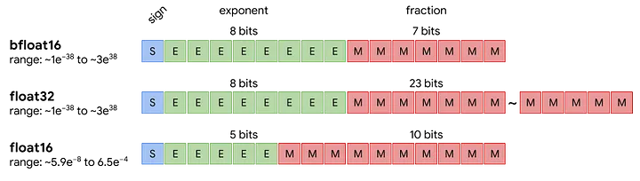
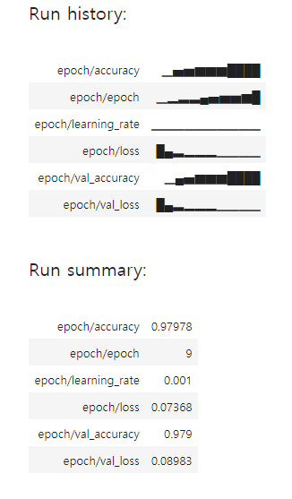
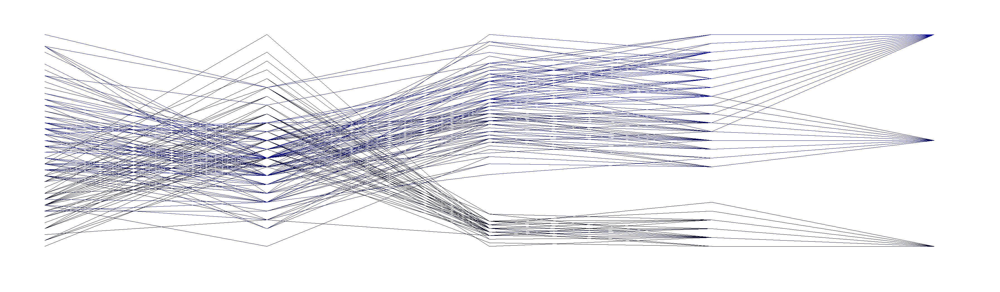
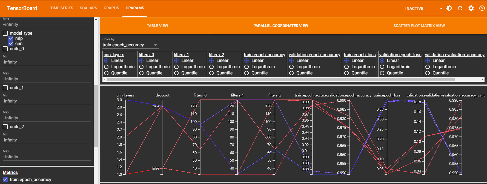

# 학습 내용

---

- 하이퍼파라미터 튜닝
- 모델 앙상블
- 혼합 정밀도

---

## 하이퍼파라미터 튜닝

---

하이퍼파라미터 최적화 과정

	1. 일련의 하이퍼파라미터를 자동으로 선택
	2. 선택된 하이퍼파라미터로 모델을 만듦
	3. 훈련 데이터에 학습하고 검증 데이터에서 성능을 측정
	4. 다음으로 시도할 하이퍼파라미터 자동으로 선택
	5. 위 과정 반복
	6. 마지막으로 테스트 데이터에서 성능 측정

		-> 반복 실험으로 좋은 파라미터를 찾을 수 있지만, 많은 비용 발생

			-> 케라스에서 최적의 파라미터를 쉽고 빠르게 찾을 수 있는 도구 지원

Keras Tuner?

	TensorFlow 프로그램에 대한 최적의 하이퍼파라미터 세트를 선택하는 데 도움을 주는 라이브러리

---

### KerasTuner API

---

[keras Tuner](https://www.tensorflow.org/tutorials/keras/keras_tuner?hl=ko)

---

hp??

	하이퍼파라미터 클래스

		-> 탐색 공간(search space) 내부의 값들과 현재 값 모두를 포함

종류

	- 모델 하이퍼파라미터 -> 히든 레이어 수, 레이어 너비
	- 알고리즘 하이퍼파라메터 -> optimizer 종류, learning rate

ex)

	'''

	# hp가 선언된 함수 -> model-units, learning_rate
	def model_builder(hp):
	  model = keras.Sequential()
	  model.add(keras.layers.Flatten(input_shape=(28, 28)))

	  # Tune the number of units in the first Dense layer
	  # Choose an optimal value between 32-512
	  hp_units = hp.Int('units', min_value = 32, max_value = 512, step = 32)
	  model.add(keras.layers.Dense(units = hp_units, activation = 'relu'))
	  model.add(keras.layers.Dense(10))

	  # Tune the learning rate for the optimizer 
	  # Choose an optimal value from 0.01, 0.001, or 0.0001
	  hp_learning_rate = hp.Choice('learning_rate', values = [1e-2, 1e-3, 1e-4]) 

	  model.compile(optimizer = keras.optimizers.Adam(learning_rate = hp_learning_rate),
	                loss = keras.losses.SparseCategoricalCrossentropy(from_logits = True), 
	                metrics = ['accuracy'])

	  return model

	'''

---

Tuners??

	하이퍼파라메터 탐색 전략을 정하는 클래스

		-> Oracle에서 받은 hp값으로 모델을 생성, 훈련, 평가하여, 모델을 Oracle에게 제공

			-> 음식을 만들 때 다양한 조미료를 조금씩 바꿔가며 최고의 맛을 찾는 과정과 비슷

ex)

	'''

	# Hyperband 튜너 사용 
	# 인스턴스화하려면 최적화할 하이퍼모델인 objective, 및 
		# 훈련할 최대 epoch 수(max_epochs)를 지정
	# Hyperband 튜닝 알고리즘은 적응형 리소스 할당 및 조기 중단을 사용하여 
		#고성능 모델에서 신속하게 수렴 ->  스포츠 챔피언십 스타일 브래킷 사용
		# 몇 개의 epoch에 대해 많은 수의 모델을 훈련하고 최고 성능을 보이는 
	# 절반만 다음 단계로 넘깁
	tuner = kt.Hyperband(model_builder,
	                     objective = 'val_accuracy', 
	                     max_epochs = 10,
	                     factor = 3,
	                     directory = 'my_dir',
	                     project_name = 'intro_to_kt')

	# 하이퍼파라미터 검색을 실행하기 전에 훈련 단계가 끝날 때마다 
		# 훈련 결과를 지우도록 콜백을 정의                     
	class ClearTrainingOutput(tf.keras.callbacks.Callback):
	  def on_train_end(*args, **kwargs):
	    IPython.display.clear_output(wait = True)

	# 하이퍼파라미터 검색 실행
	tuner.search(img_train, label_train, epochs = 10, validation_data = (img_test, label_test), callbacks = [ClearTrainingOutput()])

	# 최적의 하이퍼파라미터 추출
	best_hps = tuner.get_best_hyperparameters(num_trials = 1)[0]

	print(f"""
	The hyperparameter search is complete. The optimal number of units in the first densely-connected
	layer is {best_hps.get('units')} and the optimal learning rate for the optimizer
	is {best_hps.get('learning_rate')}.
	""")

	-----------------------------------------------

	Trial 30 Complete [00h 00m 37s]
	val_accuracy: 0.8826000094413757

	Best val_accuracy So Far: 0.8834999799728394
	Total elapsed time: 00h 07m 24s
	INFO:tensorflow:Oracle triggered exit

	The hyperparameter search is complete. The optimal number of units in the first densely-connected
	layer is 512 and the optimal learning rate for the optimizer
	is 0.001.

	------------------------------------------------

	# 최적의 하이퍼파라미터로 모델을 재훈련
	model = tuner.hypermodel.build(best_hps)
	model.fit(img_train, label_train, epochs = 10, validation_data = (img_test, label_test))

	'''

---

Oracle??

	KerasTuner의 모든 검색 알고리즘에서 사용하는 기본 클래스

		-> 모델 평가 결과를 Tuner에게서 받아 새로운 hp 값을 제공합니다

			-> trial object를 통해 위의 Tuner간의 정보 교환이 이루어지게 된다고 설명

Tuner에 내장된 검색 알고리즘을 간편하게 사용할 수도 있지만, Oracle을 함께 사용할 경우 얻을 수 있는 장점

	서브 클래싱하여 나만의 튜닝 알고리즘을 작성 가능

---

HyperModel??

	사전 정의된 ‘특정 모델 : ResNet, XceptionNet 등’을 위한 탐색 공간

		-> HyperResNet, HyperException 등 Tuner에 내장된 모델을 활용(커스텀 가능)

---

## 모델 앙상블

---

보팅

	- 여러 모델들을 사용, 결과에 대해 다수결에 의거, 모델의 예측값을 종합하여 수행  (분류라면 다수결, 회귀라면 평균) 
	- 단일 모델의 성능 보다 앙상블의 후보 모델이 얼마나 다양한지가 중요
		- 성능이 좋은 모델의 결과에 가중치를 주어 진행함으로 개선가능

배깅

	- 중복을 허용하여 데이터를 랜덤 샘플링하는 부트스트랩 방식으로 여러개의 하위 데이터셋을 구축 후
	- 한 종류의 여러 모델을 훈련, 이를 통합하여 최종 모델 제작
	- 학습 데이터가 충분하지 않을 때 성능 향상을 할 수 있는 기법
	- 대규모 데이터를 사용할 때 용이함
		- 전체적인 분산 감소 → 오버피팅 줄여줌
		- 병렬화 가능 → 계산 성능 향상
		- 데이터가 중복되어 사용되기 때문에 데이터 편향이 일어 날 수 있음

부스팅

	- 이전 모델이 제대로 예측하지 못한 데이터에 가중치를 부여하고, 다음 모델이 학습하는 방법 
		-모델1 예측 → 잘못 예측한 데이터 가중치 부여 → 모델2 예측 → 가중치부여 → 모델3..
	- 오답에 높은 가중치를 부여하므로, 정확도가 높아짐
		- Overfitting 가능성이 있음
		- regularization, 반복 횟수 제한 등으로 예방 가능

스태깅

	- 데이터셋에 대한 개별 모델의 예측값들을  최종 모델이 재학습
	- 개별 모델의 예측값들은 메타 피처데이터, 최종 모델은 메타 모델이라고 칭함
	- 기초 모델의 성능에 많이 좌우됨 
		- 기초 모델들의 accurucy가 0.5~0.6 정도면 스태킹 성능도 당연히 좋지 않음

💡 높은 정확도를 가진 모델이 무조건 좋은 모델일까요?

	- 지나치게 덩치가 큰 경우에는 속도가 느릴 수 있습니다
	- 작은 디바이스에 올리기 힘들 수 있습니다

		모델 제작 시에는 경제성을 고려해보아야 합니다

		특히 훈련할 때 걸리는 시간과, GPU 비용을 생각하면 더 그렇습니다

		이런 측면에서, 성능 저하를 크게 시키지 않으면서도 모델을 경량화 시키는 기법이 발달했습니다. 

---

## 혼합 정밀도

---

32bit (성능) ↔ 16bit (메모리와 속도) 의 강점

	중요한 부분에서는 32bit 연산 유지, 나머지에서 16bit 연산 사용

		-> 정확도 손실을 최소화하면서, 속도/메모리 이득을 취할 수 있음

수치적 안정성이 필요한 곳에는 32bit 사용

	- 모델의 가중치 업데이트
	- 그래디언트 계산
	- 배치 정규화 계산
	- transfer learning 시

정밀도가 중요하지 않은 곳에는 16bit 연산 활용

	- Activation 시
	- 입력 데이터 표현
	- 순전파/역전파 과정에서의 일부 연산

---

## 시각화

---

W&B (wandb)??

	다양한 시각화와 하이퍼파라미터 튜닝 자동화를 지원

	'''

	YOUR_WANDB_KEY = "YOUR KEY"

	import wandb
	# from wandb.keras import

	wandb.login(key = YOUR_WANDB_KEY)

	wandb.init(
	    project = "first-wandb-project",

	    config = {
	        "epochs" : 10,
	        "dataset" : 'mnist',
	    }
	)

	from wandb.keras import WandbMetricsLogger

	model = get_mnist_model()
	model.compile(optimizer="rmsprop",
	              loss="sparse_categorical_crossentropy",
	              metrics=["accuracy"])

	model.fit(train_images, train_labels,
	          epochs=10,
	          validation_data=(val_images, val_labels),
	          callbacks=[WandbMetricsLogger()])

	wandb.finish()

	'''

---

	- W&B 사용을 위해, 먼저 wandb 객체에 로그인 후 초기화 과정 필요!
	- 초기화에서, 제일 중요한 것은 '프로젝트의 이름' 과 저장하고 싶은 config 값들을 설정하는 것
	- learning late, batch size등의 하이퍼파라메터와, 모델아키텍쳐, 데이터셋 등을 간편하게 실험에 포함시킬 수 있음

	- W&B에서는 다양한 logger class등을 지원해 간편하게 훈련상황을 추적할 수 있도록 도와줌
	- 혹은, 직접 train loop를 통해 추적하고 싶은 항목들을 정의 가능
	- 여기서는 metric을 추적하는 WandbMetricsLogger를 사용하도록 하겠습니다.

	- 훈련을 수행 후, 여러분들의 wandb 프로젝트 페이지로 접속 후 훈련 추이에 대해 확인 가능
	- WandB는 실험을 기록하는 Log 기능 외에도, 모델 아티팩트(가중치 등)를 wandb에 저장, 버전을 관리할 수 있는 Artifect, 여러 하이퍼파라미터 조합을 정의, 실험을 병렬로 수행할 수 있는 Sweep 등
		- 모델 비교, 실험 버전 관리, 병렬 실행 등 다양한 기능을 제공하는, 시각화 도구를 넘어서는 강력한 툴
	- 주피터 노트북에서 실행할 경우에는, 꼭 다음의 구문(wandb.finish())을 실행!

---

Parallel Graph??

	입력 필드 X만큼 Y축을 만들고 동일한 행에 있는 값을 선으로 연결해 시각화

		- Feature 간의 관계 알기 위해 사용
		- 실험 시 최적 성능의 모델을 위한 HyperParameter를 찾기 위해 사용

Feature 간의 관계 Visualization

	Tabular data 나 NLP 태스크 -> Parallel graph로 데이터 자체의 상관관계나, 모델이 동작 시 관여하는 부분에 대해 시각화

	'''

	import plotly.express as px

	df = px.data.iris()

	fig = px.parallel_coordinates(df, color="species_id", labels={"species_id": "Species",
	                "sepal_width": "Sepal Width", "sepal_length": "Sepal Length",
	                "petal_width": "Petal Width", "petal_length": "Petal Length", },
	                             color_continuous_scale=px.colors.diverging.Tealrose,
	                             color_continuous_midpoint=2)
	
	fig.show()

	'''

	-> 클래스별로 각 feature가 어떤 상관관계가 있는지 한눈에 파악가능

HyperParameter 시각화

	'''
	
	# 모델 정의, Tuner 정의 부분 생략...

	tuner.search(
	    x_train,
	    y_train,
	    validation_split=0.2,
	    epochs=10,
	    callbacks=[keras.callbacks.TensorBoard("/tmp/tb_logs")], # 위 설정한 디렉토리에 callback으로 로그가 기록됩니다
	)

	'''

---

Optuna??

	W&B를 대체하거나, 결합해서 함께 쓸 수 있는 뛰어난 툴

		-> 웹 대시보드를 통해서 시각화하는 툴

	- 최적화 과정에서 각 시도(trial)의 성능(목표값)을 시각화
	- 특정 하이퍼파라미터 값에 따른 목표 함수의 변화를 시각화
	- 학습 도중 실험의 중간 결과를 시각화 등등

		-> 하이퍼파라메터 샘플링 전략이나, 분산훈련 최적화 등 지원
