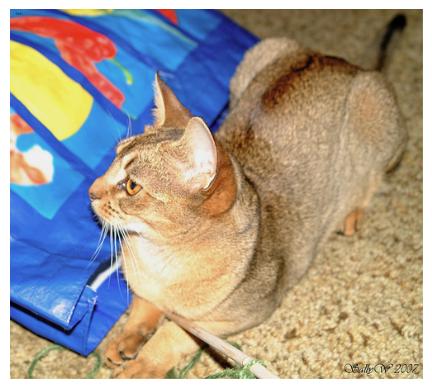
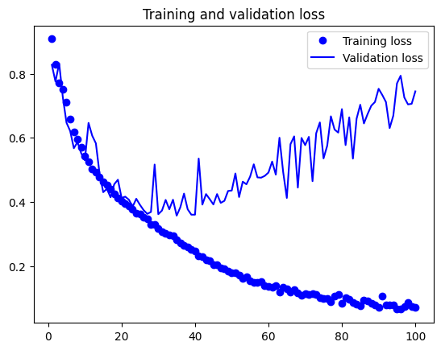
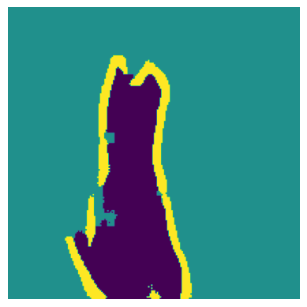
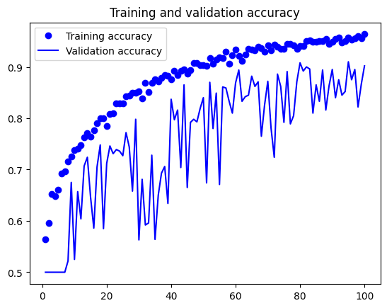
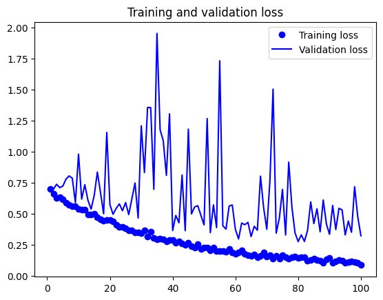

# 학습 내용

---

- 세 가지 주요 컴퓨터 비전 작업
- 이미지 분할 예제
- 최신 컨브넷 아키텍쳐 패턴
- 컨브넷이 학습한 것 해석

---

## 세 가지 주요 컴퓨터 비전 작업

---

3개의 주요 컴퓨터 비전 작업

	- 이미지 분류 -> 이미지에 하나 이상의 레이블을 할당하는 것이 목표(단일 레이블 분류 / 다중 레이블 분류)
	- 이미지 분할 -> 이미지를 다른 영역으로'나누'거나 '분할'하는것이 목표(각 영역은 일반적으로 하나의 범주를 나타냄)
	- 객체 탐지 -> 이미지에 있는 관심 객체 주변에 (바운딩 박스)라고 부르는 사각형을 그리는 것이 목표

여러 가지 틈새 분야에 해당하는 작업

	- 이미지 유사도 평가 -> 두 이미지가 시각적으로 얼마나 비슷한지 추정
	- 키포인트 감지 -> 얼굴 특징과 같이 이미지에서 관심 속성을 정확히 짚어 내기
	- 포즈 추정
	- 3D 메시 추정 등등

---

## 이미지 분할 예제

---

이미지 분할?

	모델을 사용해 이미지 안의 각 픽셀에 클래스를 할당하는 것

		-> 이미지를 여러 다른 영역('배경'과 '전경' / '도로', '자동차', '보도')으로 분할

이미지 분할의 종류

	- 시맨틱 분할 -> 각 픽셀이 돌립적으로 'cat'과 같은 하나의 의미를 가진 범주로 분류
	- 인스턴스 분할 -> 이미지 픽셀을 범주로 분류하는 것뿐만 아니라 개별 격체 인스턴스를 구분

---

시맨틱 분할을 위한 데이터

	Oxford-IIIT pets 테이터셋 사용

분할 마스크?

	이미지 분할에서 레이블에 해당

		-> 입력 이미지와 동일한 크기의 이미지고 컬러 채널은 하나

이 테이터셋의 경우

	분할 마스크의 픽셀 -> 3개의 정수 값 중 하나를 가짐

	- 1(전경)
	- 2(배경)
	- 3(윤곽)

데이터셋 다운

	'''

	!wget http://www.robots.ox.ac.uk/~vgg/data/pets/data/images.tar.gz
	!wget http://www.robots.ox.ac.uk/~vgg/data/pets/data/annotations.tar.gz
	!tar -xf images.tar.gz
	!tar -xf annotations.tar.gz

	'''

		-> wget / tar 셸 명령으로 데이터셋을 내려받고 압축을 품

			-> 입력 사진은 images/ 폴더에 JPG 파일로 저장되어 있음

				-> 분할 마스크는 annotations/trimaps/ 폴더에 같은 이름의 PNG 파일로 저장되어 있음

입력 파일 경로, 분할 마스크 파일 경로 각각 리스트로 구성

	'''

	import os

	input_dir="images/"
	target_dir="annotations/trimaps"

	input_img_paths=sorted(
	    [os.path.join(input_dir,fname)
	    for fname in os.listdir(input_dir)
	    if fname.endswith(".jpg")]
	)
	target_paths=sorted(
	    [os.path.join(target_dir,fname)
	    for fname in os.listdir(target_dir)
	    if fname.endswith(".png") and not fname.startswith(".")]
	)

	'''

입력, 분할 마스크 의 샘플 이미지 확인

	'''

	import matplotlib.pyplot as plt
	from tensorflow.keras.utils import load_img,img_to_array

	plt.axis("off")
	plt.imshow(load_img(input_img_paths[9]))

	def display_target(target_array):
	  normalized_array=(target_array.astype("uint8")-1)*127
	  plt.axis("off")
	  plt.imshow(normalized_array[:,:,0])

	img=img_to_array(load_img(target_paths[9],color_mode="grayscale"))
	display_target(img)

	'''

입력과 타깃을 2대의 넘파이 배열로 로드, 이 배열을 훈련과 검증 셋으로 나눔

	'''

	import numpy as np
	import random

	img_size=(200,200)
	num_imgs=len(input_img_paths)

	random.Random(1337).shuffle(input_img_paths)
	random.Random(1337).shuffle(target_paths)

	def path_to_input_image(path):
	  return img_to_array(load_img(path,target_size=img_size))
	def path_to_target(path):
	  img=img_to_array(load_img(path,target_size=img_size,color_mode="grayscale"))
	  img=img.astype("uint8")-1
	  return img

	input_imgs=np.zeros((num_imgs,)+img_size+(3,),dtype="float32")
	targets=np.zeros((num_imgs,)+img_size+(1,),dtype="uint8")
	for i in range(num_imgs):
	  input_imgs[i]=path_to_input_image(input_img_paths[i])
	  targets[i]=path_to_target(target_paths[i])

	num_val_samples=1000
	train_inputs=input_imgs[:-num_val_samples]
	train_targets=targets[:-num_val_samples]
	val_inputs=input_imgs[-num_val_samples:]
	val_targets=targets[-num_val_samples:]

	'''

		-> 입력과 타깃 모두 200*200 크기로 변경

			-> 입력 경로, 타킷 경로가 동일한 순서를 유지하도록 시드 값을 동일하게 사용

				-> 전체 이미지를 input_imgs에 float32 배열로 로드, 타킷 마스트는 targets에 uint8로 로드

---

모델 정의

	'''

	from tensorflow import keras
	from tensorflow.keras import layers

	def get_model(img_size,num_classes):
	  inputs=keras.Input(shape=img_size+(3,))
	  x=layers.Rescaling(1./255)(inputs)
	  x=layers.Conv2D(64,3,strides=2,activation="relu",padding="same")(x)
	  x=layers.Conv2D(64,3,activation="relu",padding="same")(x)
	  x=layers.Conv2D(128,3,strides=2,activation="relu",padding="same")(x)
	  x=layers.Conv2D(128,3,activation="relu",padding="same")(x)
	  x=layers.Conv2D(256,3,strides=2,activation="relu",padding="same")(x)
	  x=layers.Conv2D(256,3,activation="relu",padding="same")(x)

	  x=layers.Conv2DTranspose(256,3,activation="relu",padding="same")(x)
	  x=layers.Conv2DTranspose(256,3,activation="relu",padding="same",strides=2)(x)
	  x=layers.Conv2DTranspose(128,3,activation="relu",padding="same")(x)
	  x=layers.Conv2DTranspose(128,3,activation="relu",padding="same",strides=2)(x)
	  x=layers.Conv2DTranspose(64,3,activation="relu",padding="same")(x)
	  x=layers.Conv2DTranspose(64,3,activation="relu",padding="same",strides=2)(x)
	  outputs=layers.Conv2D(num_classes,3,activation="softmax",padding="same")(x)

	  model=keras.Model(inputs,outputs)
	  return model

	model=get_model(img_size,3)
	model.summary()

	'''

		-> 각 출력 픽셀을 3개의 범주중 하나로 분류하기 위해 3개의 필터와 softmax 활성화 함수를 가진 Conv2D층으로 모델 종료

	결과:

	'''

	Model: "functional"
	┏━━━━━━━━━━━━━━━━━━━━━━━━━━━━━━━━━━━━━━┳━━━━━━━━━━━━━━━━━━━━━━━━━━━━━┳━━━━━━━━━━━━━━━━━┓
	┃ Layer (type)                         ┃ Output Shape                ┃         Param # ┃
	┡━━━━━━━━━━━━━━━━━━━━━━━━━━━━━━━━━━━━━━╇━━━━━━━━━━━━━━━━━━━━━━━━━━━━━╇━━━━━━━━━━━━━━━━━┩
	│ input_layer (InputLayer)             │ (None, 200, 200, 3)         │               0 │
	├──────────────────────────────────────┼─────────────────────────────┼─────────────────┤
	│ rescaling (Rescaling)                │ (None, 200, 200, 3)         │               0 │
	├──────────────────────────────────────┼─────────────────────────────┼─────────────────┤
	│ conv2d (Conv2D)                      │ (None, 100, 100, 64)        │           1,792 │
	├──────────────────────────────────────┼─────────────────────────────┼─────────────────┤
	│ conv2d_1 (Conv2D)                    │ (None, 100, 100, 64)        │          36,928 │
	├──────────────────────────────────────┼─────────────────────────────┼─────────────────┤
	│ conv2d_2 (Conv2D)                    │ (None, 50, 50, 128)         │          73,856 │
	├──────────────────────────────────────┼─────────────────────────────┼─────────────────┤
	│ conv2d_3 (Conv2D)                    │ (None, 50, 50, 128)         │         147,584 │
	├──────────────────────────────────────┼─────────────────────────────┼─────────────────┤
	│ conv2d_4 (Conv2D)                    │ (None, 25, 25, 256)         │         295,168 │
	├──────────────────────────────────────┼─────────────────────────────┼─────────────────┤
	│ conv2d_5 (Conv2D)                    │ (None, 25, 25, 256)         │         590,080 │
	├──────────────────────────────────────┼─────────────────────────────┼─────────────────┤
	│ conv2d_transpose (Conv2DTranspose)   │ (None, 25, 25, 256)         │         590,080 │
	├──────────────────────────────────────┼─────────────────────────────┼─────────────────┤
	│ conv2d_transpose_1 (Conv2DTranspose) │ (None, 50, 50, 256)         │         590,080 │
	├──────────────────────────────────────┼─────────────────────────────┼─────────────────┤
	│ conv2d_transpose_2 (Conv2DTranspose) │ (None, 50, 50, 128)         │         295,040 │
	├──────────────────────────────────────┼─────────────────────────────┼─────────────────┤
	│ conv2d_transpose_3 (Conv2DTranspose) │ (None, 100, 100, 128)       │         147,584 │
	├──────────────────────────────────────┼─────────────────────────────┼─────────────────┤
	│ conv2d_transpose_4 (Conv2DTranspose) │ (None, 100, 100, 64)        │          73,792 │
	├──────────────────────────────────────┼─────────────────────────────┼─────────────────┤
	│ conv2d_transpose_5 (Conv2DTranspose) │ (None, 200, 200, 64)        │          36,928 │
	├──────────────────────────────────────┼─────────────────────────────┼─────────────────┤
	│ conv2d_6 (Conv2D)                    │ (None, 200, 200, 3)         │           1,731 │
	└──────────────────────────────────────┴─────────────────────────────┴─────────────────┘
	 Total params: 2,880,643 (10.99 MB)
	 Trainable params: 2,880,643 (10.99 MB)
	 Non-trainable params: 0 (0.00 B)

	'''

		-> 이미지 절반으로 세번 다운샘플링 진행 -> 마지막 합성곱 층의 출력 (25,25,256)

			-> 처음 절반의 목적: 이미지를 작은 특성 맵으로 인코딩하는 것(일종의 압축)

다운샘플링 방식의 차이

	- 이미지 분류 -> MaxPooling2D 층을 사용해 특성 맵을 다운샘플링
	- 이미지 분할 -> 합성곱 층마다 스트라이드를 추가해 다운샘플링

	이미지 분할

		모델의 출력으로 픽셀별 타킷 마스크를 생성해야 하므로 정보의 공간상 위치에 많은 관심을 둠

			-> 2*2 최대 플링을 사용하면 풀링 윈도우 안의 위치 정보가 완전히 삭제됨

		-> 스트라이드 합성곱은 위치 정보를 유지하면서 특성 맵을 다운샘플링하는 작업에 더 잘 맞음

Conv2DTranspose 층?

	다운샘플링이 아닌 특성 맵을 업샘플링하는 것

		-> 모델의 처음 절반은 (25,25,256) 크기의 특성 맵 출력 하지만 최종 출력은 타킷 마스크의 크기인 (200,200,3)과 동일 해야함

	-> 업샘플링을 학습하는 합성곱 층으로 생각할 수 있음

		ex) 
			(100,100,64) 크기의 입력 Conv2D(128,3,strids=2,padding"same") 층에 통과 -> 출력의 크기(50,50,128)

			(50,50,128) 크기의 입력 Conv2D(64,3,strids=2,padding"same") 층에 통과 -> 출력의 크기(25,25,64)

	∴  (25,25,256) 크기의 특성 맵으로 압축 후 -> (200,200,3) 크기의 이미지로 복원

---

모델 컴파일 & 훈련, 시각화

	'''

	model.compile(optimizer="rmsprop",loss="sparse_categorical_crossentropy")
	callbacks=[
	  keras.callbacks.ModelCheckpoint("oxford_segmentation.keras",save_best_only=True)
	]
	history=model.fit(train_inputs,train_targets,batch_size=32,epochs=100,validation_data=(val_inputs,val_targets),callbacks=callbacks)

	epochs=range(1,len(history.history["loss"])+1)
	loss=history.history["loss"]
	val_loss=history.history["val_loss"]
	plt.figure()
	plt.plot(epochs,loss,"bo",label="Training loss")
	plt.plot(epochs,val_loss,"b",label="Validation loss")
	plt.title("Training and validation loss")
	plt.legend()
	plt.show

	'''

		-> 에포크 25 근처에서 과대적합 시작

---

예측

	'''

	from tensorflow.keras.utils import array_to_img

	model=keras.models.load_model("oxford_segmentation.keras")
	i=4
	test_img=val_inputs[i]
	plt.axis("off")
	plt.imshow(array_to_img(test_img))

	mask=model.predict(np.expand_dims(test_img,0))[0]

	def display_mask(pred):
	  mask=np.argmax(pred,axis=-1)
	  mask*=127
	  plt.axis("off")
	  plt.imshow(mask)

	display_mask(mask)

	'''

---

## 최신 컨브넷 아키텍처 패턴

---

모델의 '아키텍처'

	모델을 만드는 데 사용된 일련의 선택

	- 사용할 층
	- 층의 설정
	- 층을 연결하는 방법

		-> 모델의 가설 공간을 정의

특성 공학과 마찬가지로 좋은 가설 공간은 현재 문제와 솔루션에 대한 사전 지식(prior knowledge)을 인코딩

모델 아키텍처가 성공과 실패를 가름하는 경우가 많음

	- 적절하지 않은 아키텍처를 선택하면 모델이 차선의 성능에 갇힐 수 있으며 많은 양의 훈련 데이터가 도움이 되지 않을 것
	- 반대로 좋은 모델 아키텍처는 학습을 가속하고 모델이 훈련 데이터를 효율적으로 사용하게 만들어 대규모 데이터셋의 필요성을 줄여 줌

		- 좋은 모델 아킨텍처는 탐색 공간의 크기를 줄이거나 탐색 공간의 좋은 위치에 쉽게 수렴할 수 있는 구조

특성 공학이나 데이터 큐레이션과 마찬가지로 모델 아키텍처는 경사 하강법이 해결할 문제를 간단하게 만드는 것

몇 가지 핵심적인 컨브넷 아키텍처의 모법 사례

	- 잔차 연결
	- 배치 정규화
	- 분리 합성곱

---

### 모듈화, 계층화, 재사용

---

복잡한 시스템

	-> 단순하게 만들고 싶다면 일반적으로 적용할 수 있는 방법

MHR 공식

	- 형태를 알아보기 힘든 복잡한 구조 -> 모듈화
	- 모듈 -> 계층화
	- 모듈을 적절하게 여러곳에 재사용 -> 추상화

아키텍처?

	용어가 사용되는 거의 모든 영억에 있는 시스템 구조의 기초가 됨

코드를 리팩터링

	-> 소프트웨어 아키텍처를 수행했다고 말함

딥러닝 모델 아키텍처?

	모듈화, 계층화, 재사용을 영리하게 활용하는 것

모든 컨브넷 아키텍처

	층으로만 구성되어 있지 않도 반복되는 층 그룹(블록 / 모듈)으로 구성

		-> VGG16 구조((합성곱,합성곱,최대 플링)블록이 반복되는 구조)

대부분의 컨브넷 특징

	피라미드와 같은 구조(계층 구조)를 가지는 경우가 많음

		-> 필터 개수가 층이 깊어질수록 늘어남, 특성 맵의 크기는 줄어듬

	일반적으로 작은 층을 깊게 쌓은 모델이 큰 층을 얇게 쌓은 것보다 성능이 좋음

		-> 그레이디언트 소실 문제로 인해 층을 쌓을 수 있는 정도에 한계가 있음

			-> 이런 문제가 잔차 연결을 탄생시킴

---

### 잔차 연결

---

순차적인 딥러닝 모델에서 역전파는 옮겨 말하기 게임과 매우 비슷함

	- 다음과 같이 함수가 연결되어 있다고 생각해 보자

	f1을 조정하려면 f2, f3, f4에 오차 정보를 통과시켜야 함

		-> 연속적으로 놓인 각 함수에는 일정량의 잡음이 있음

			-> 함수 연결이 너무 깊으면 이 잡음이 그레이디언트 정보를 압도하기 시작하고 역전파가 동작하지 않게 됨

	∴ 이런 현상 -> 그레이디언트 소실 문제라고 함

해결 방법

	연결된 각 함수를 비파괴적으로 만들면 됨

		-> 이전 입력에 담긴 잡음 없는 정보를 유지

			-> 이를 구현하는 가장 쉬운 방법 잔차 연결

잔차 연결?

	층이나 블록의 입력을 출력과 더하기만 하면 됨

		-> 파괴적이거나 집음이 있는 블록(ex) relu 활성화 함수 / 드롭아웃층을 가진 블록)을 돌아가는 정보의 지름길과 같음

코드 구현

	'''

	x = ... # 입력 텐서
	residual = x # 원본 입력을 별도로 저장한다. 이를 잔차라고 한다.
	x = block(x) # 이 계산 블록은 파괴적이거나 잡음이 있을 수 있지만 괜찮다.
	x = add([x, residual]) # 원본 입력을 층의 출력에 더한다. 따라서 최종 출력은 항상 원본 입력의 전체 정보를 보존한다.

	'''

		입력을 블록의 출력에 다시 더하는 것

			-> 출력 크기가 입력과 같아야 한다는 것을 의미

		필터의 개수가 늘어난 합성곱 층 / 최대 플링 층 

			-> 활성화 함수가 없는 1*1 Conv2D 층을 사용해 잔차를 원하는 출력 크기로 선형적 투영 가능

필터 개수가 변경 되는 잔차 블럭

	'''

	from tensorflow import keras
	from tensorflow.keras import layers

	inputs=keras.Input(shape=(32,32,3))
	x=layers.Conv2D(32,3,activation="relu")(inputs)
	residual=x
	x=layers.Conv2D(64,3,activation="relu",padding="same")(x)
	residual=layers.Conv2D(64,1)(residual)
	x=layers.add([x,residual])

	'''

		-> 경계 문제(패딩)에 따라 다운샘플링되지 않도록 padding="same"으로 지정

			-> 잔차에 32개의 필터만 존재하므로 1*1 Conv2D 를 사용해 적절한 크기(64개 필터)로 투영

최대 풀링 층을 가진 잔차 블록

	'''

	inputs=keras.Input(shape=(32,32,3))
	x=layers.Conv2D(32,3,activation="relu")(inputs)
	residual=x
	x=layers.Conv2D(64,3,activation="relu",padding="same")(x)
	x=layers.MaxPooling2D(2,padding="same")(x)
	residual=layers.Conv2D(64,1,strides=2)(residual)
	x=layers.add([x,residual])

	'''

		-> 경계 문제(패딩)에 따라 다운샘플링되지 않도록 padding="same"으로 지정	

			-> 잔차에 32개의 필터만 존재하므로 1*1 Conv2D 를 사용해 적절한 크기(64개 필터)로 투영하되 최대 플링 층으로 인한 다운샘플링을 맞추기 위해 strides=2 사용

---

구체적인 예시

	'''

	inputs=keras.Input(shape=(32,32,3))
	x=layers.Rescaling(1./255)(inputs)

	def residual_block(x,filters,pooling=False):
	  residual=x
	  x=layers.Conv2D(filters,3,activation="relu",padding="same")(x)
	  x=layers.Conv2D(filters,3,activation="relu",padding="same")(x)
	  if pooling:
	    x=layers.MaxPooling2D(2,padding="same")(x)
	    residual=layers.Conv2D(filters,1,strides=2)(residual)
	  elif filters != residual.shape[-1]:
	    residual=layers.Conv2D(filters,1)(residual)
	  x=layers.add([x,residual])
	  return x

	x=residual_block(x,filters=32,pooling=True)
	x=residual_block(x,filters=64,pooling=True)
	x=residual_block(x,filters=128,pooling=False)

	x=layers.GlobalAveragePooling2D()(x)
	outputs=layers.Dense(1,activation="sigmoid")(x)
	model=keras.Model(inputs=inputs,outputs=outputs)
	model.summary()

	'''

	결과:

	'''

	Model: "functional"
	┏━━━━━━━━━━━━━━━━━━━━━━━━━━━┳━━━━━━━━━━━━━━━━━━━━━━━━┳━━━━━━━━━━━━━━━━┳━━━━━━━━━━━━━━━━━━━━━━━━┓
	┃ Layer (type)              ┃ Output Shape           ┃        Param # ┃ Connected to           ┃
	┡━━━━━━━━━━━━━━━━━━━━━━━━━━━╇━━━━━━━━━━━━━━━━━━━━━━━━╇━━━━━━━━━━━━━━━━╇━━━━━━━━━━━━━━━━━━━━━━━━┩
	│ input_layer_6             │ (None, 32, 32, 3)      │              0 │ -                      │
	│ (InputLayer)              │                        │                │                        │
	├───────────────────────────┼────────────────────────┼────────────────┼────────────────────────┤
	│ rescaling_3 (Rescaling)   │ (None, 32, 32, 3)      │              0 │ input_layer_6[0][0]    │
	├───────────────────────────┼────────────────────────┼────────────────┼────────────────────────┤
	│ conv2d_14 (Conv2D)        │ (None, 32, 32, 32)     │            896 │ rescaling_3[0][0]      │
	├───────────────────────────┼────────────────────────┼────────────────┼────────────────────────┤
	│ conv2d_15 (Conv2D)        │ (None, 32, 32, 32)     │          9,248 │ conv2d_14[0][0]        │
	├───────────────────────────┼────────────────────────┼────────────────┼────────────────────────┤
	│ max_pooling2d_4           │ (None, 16, 16, 32)     │              0 │ conv2d_15[0][0]        │
	│ (MaxPooling2D)            │                        │                │                        │
	├───────────────────────────┼────────────────────────┼────────────────┼────────────────────────┤
	│ conv2d_16 (Conv2D)        │ (None, 16, 16, 32)     │            128 │ rescaling_3[0][0]      │
	├───────────────────────────┼────────────────────────┼────────────────┼────────────────────────┤
	│ add_2 (Add)               │ (None, 16, 16, 32)     │              0 │ max_pooling2d_4[0][0], │
	│                           │                        │                │ conv2d_16[0][0]        │
	├───────────────────────────┼────────────────────────┼────────────────┼────────────────────────┤
	│ conv2d_17 (Conv2D)        │ (None, 16, 16, 64)     │         18,496 │ add_2[0][0]            │
	├───────────────────────────┼────────────────────────┼────────────────┼────────────────────────┤
	│ conv2d_18 (Conv2D)        │ (None, 16, 16, 64)     │         36,928 │ conv2d_17[0][0]        │
	├───────────────────────────┼────────────────────────┼────────────────┼────────────────────────┤
	│ max_pooling2d_5           │ (None, 8, 8, 64)       │              0 │ conv2d_18[0][0]        │
	│ (MaxPooling2D)            │                        │                │                        │
	├───────────────────────────┼────────────────────────┼────────────────┼────────────────────────┤
	│ conv2d_19 (Conv2D)        │ (None, 8, 8, 64)       │          2,112 │ add_2[0][0]            │
	├───────────────────────────┼────────────────────────┼────────────────┼────────────────────────┤
	│ add_3 (Add)               │ (None, 8, 8, 64)       │              0 │ max_pooling2d_5[0][0], │
	│                           │                        │                │ conv2d_19[0][0]        │
	├───────────────────────────┼────────────────────────┼────────────────┼────────────────────────┤
	│ conv2d_20 (Conv2D)        │ (None, 8, 8, 128)      │         73,856 │ add_3[0][0]            │
	├───────────────────────────┼────────────────────────┼────────────────┼────────────────────────┤
	│ conv2d_21 (Conv2D)        │ (None, 8, 8, 128)      │        147,584 │ conv2d_20[0][0]        │
	├───────────────────────────┼────────────────────────┼────────────────┼────────────────────────┤
	│ conv2d_22 (Conv2D)        │ (None, 8, 8, 128)      │          8,320 │ add_3[0][0]            │
	├───────────────────────────┼────────────────────────┼────────────────┼────────────────────────┤
	│ add_4 (Add)               │ (None, 8, 8, 128)      │              0 │ conv2d_21[0][0],       │
	│                           │                        │                │ conv2d_22[0][0]        │
	├───────────────────────────┼────────────────────────┼────────────────┼────────────────────────┤
	│ global_average_pooling2d  │ (None, 128)            │              0 │ add_4[0][0]            │
	│ (GlobalAveragePooling2D)  │                        │                │                        │
	├───────────────────────────┼────────────────────────┼────────────────┼────────────────────────┤
	│ dense (Dense)             │ (None, 1)              │            129 │ global_average_poolin… │
	└───────────────────────────┴────────────────────────┴────────────────┴────────────────────────┘
	 Total params: 297,697 (1.14 MB)
	 Trainable params: 297,697 (1.14 MB)
	 Non-trainable params: 0 (0.00 B)

	'''

		-> 마지막 블록은 바로 다음에 전역 평균 풀링(global average pooling)을 사용하기 때문에 최대 풀링이 필요하지 않음

---

### 배치 정규화

---

정규화?

	머신 러닝 모델에 주입되는 샘플들을 균일하게 만드는 광범위한 방법

		-> 모델이 학습하고 새로운 데이터에 잘 일반화되도록 도움

배치 정규화?

	- 훈련하는 동안 현재 배치 데이터의 평균과 분산을 사용해 샘플을 정규화
	- 추론에서는 훈련에서 본 배치 데이터에서 구한 평균과 분산의 지수 이동 평균을 사용

배치 정규화가 왜 도움이 되는지 확실히 아는 사람은 없음

배치 정규화의 주요 효과

	잔차 연결과 매우 흡사하게 그레이디언트의 전파를 도와주는 것으로 보임

코드화

	'''

	x = ...
	# Conv2D 층의 출력이 정규화되기 때문에 편향 벡터가 필요하지 않다.
	x = layers.Conv2D(32,3,use_bias=False)(x)
	x = layers.BatchNormalization()(x)

	'''

		-> 정규화 단계는 층 출력의 평균을 0에 맞추기 때문에 BatchNormalization을 사용할 때 편향 벡터가 더 이상 필요하지 않음(편향을 제외한 층 -> 층을 약간 더 가볍게 만들 수 있음)

배치 정규화 사용법

	'''

	x=layers.Conv2D(32.,3,use_bias=False)(x)
	x=layers.BatchNormalization()(x)
	x=layers.Activation("relu")(x)

	'''

		순서

		- Conv2D 층
		- 배치 정규화 층
		- 활성화 층

---

### 깊이별 분리 합성곱

---

깊이별 분리 합성곱?

	1. 입력 채널별로 따로따로 공간 방향의 합성곱을 수행
	2. 점별 합성곱(1*1 합성곱)을 통해 출력 채널을 합침

	-> 공간 특성의 학습 / 채널 방향 특성의 학습을 분리하는 효과를 냄

		-> 공간상의 위치가 높은 상관관계를 가지지만, 채널 간에는 매우 독립적이라는 가정에 의존

특징

	- 일반 합성곱보다 훨씬 적은 개수의 파라미터를 사용, 더 적은 수의 연산을 수행 -> 유사한 표현 능력을 가짐
	- 수렴이 더 빠르고 쉽게 과대적합되지 않는 작은 모델을 만듦

---

### Xcrption 유사 모델에 모두 적용하기

---

지금까지 배운 컨브넷 아키텍처 원칙을 정리하면 다음과 같음

	- 모델은 반복되는 층 블록으로 조직되어야 함. 블록은 일반적으로 여러 개의 합성곱 층과 최대 풀링 층으로 구성
	- 특성 맵의 공간 방향 크기가 줄어듦에 따라 층의 필터 개수는 증가해야 함
	- 깊고 좁은 아키텍처가 넓고 얇은 것보다 나음
	- 층 블록에 잔차 연결을 추가하면 깊은 네트워크를 훈련하는 데 도움이 됨
	- 합성곱 층 다음에 배치 정규화 층을 추가하면 도움이 될 수 있음
	- Conv2D 층을 파라미터 효율성이 더 좋은 SeparableConv2D 층으로 바꾸면 도움이 될 수 있음

위 아키텍쳐 원칙을 적용한 모델

	작은 버전의 Xception 모델과 비슷함

	'''

	inputs=keras.Input(shape=(180,180,3))
	x=data_augmentation(inputs)
	x=layers.Rescaling(1./255)(x)
	x=layers.Conv2D(filters=32,kernel_size=5,use_bias=False)(x)

	for size in [32,64,128,256,512]:
	  residual=x

	  x=layers.BatchNormalization()(x)
	  x=layers.Activation("relu")(x)
	  x=layers.SeparableConv2D(size,3,padding="same",use_bias=False)(x)

	  x=layers.BatchNormalization()(x)
	  x=layers.Activation("relu")(x)
	  x=layers.SeparableConv2D(size,3,padding="same",use_bias=False)(x)

	  x=layers.MaxPooling2D(3,strides=2, padding="same")(x)

	  residual=layers.Conv2D(
	      size,1,strides=2,padding="same",use_bias=False
	  )(residual)
	  x=layers.add([x,residual])

	x=layers.GlobalAveragePooling2D()(x)
	x=layers.Dropout(0.5)(x)
	outputs=layers.Dense(1,activation="sigmoid")(x)
	model=keras.Model(inputs=inputs,outputs=outputs)
	
	model.summary()

	'''

		-> 분리 합성곱의 이면에 있는 "특성 채널은 대체적으로 독립적이다"라는 가정은 RGB 이미지에는 맞지 않음.  빨간색, 녹색, 파란색 컬러 채널은 실제로 매우 높은 상관관계를 가짐

			∴ 이 모델의 첫 번째 층은 일반적인 Conv2D이다. 그다음부터 SeparableConv2D를 사용

		-> 원래 모델에서는 Dense 층 이전에 Flatten 층을 사용 -> 이번 코드엔 GlobalAveragePooling2D 층을 사용

	결과:

	'''
	
	Model: "functional_2"
	┏━━━━━━━━━━━━━━━━━━━━━━━━━━━┳━━━━━━━━━━━━━━━━━━━━━━━━┳━━━━━━━━━━━━━━━━┳━━━━━━━━━━━━━━━━━━━━━━━━┓
	┃ Layer (type)              ┃ Output Shape           ┃        Param # ┃ Connected to           ┃
	┡━━━━━━━━━━━━━━━━━━━━━━━━━━━╇━━━━━━━━━━━━━━━━━━━━━━━━╇━━━━━━━━━━━━━━━━╇━━━━━━━━━━━━━━━━━━━━━━━━┩
	│ input_layer_9             │ (None, 180, 180, 3)    │              0 │ -                      │
	│ (InputLayer)              │                        │                │                        │
	├───────────────────────────┼────────────────────────┼────────────────┼────────────────────────┤
	│ sequential (Sequential)   │ (None, 180, 180, 3)    │              0 │ input_layer_9[0][0]    │
	├───────────────────────────┼────────────────────────┼────────────────┼────────────────────────┤
	│ rescaling_5 (Rescaling)   │ (None, 180, 180, 3)    │              0 │ sequential[1][0]       │
	├───────────────────────────┼────────────────────────┼────────────────┼────────────────────────┤
	│ conv2d_25 (Conv2D)        │ (None, 176, 176, 32)   │          2,400 │ rescaling_5[0][0]      │
	├───────────────────────────┼────────────────────────┼────────────────┼────────────────────────┤
	│ batch_normalization_1     │ (None, 176, 176, 32)   │            128 │ conv2d_25[0][0]        │
	│ (BatchNormalization)      │                        │                │                        │
	├───────────────────────────┼────────────────────────┼────────────────┼────────────────────────┤
	│ activation_1 (Activation) │ (None, 176, 176, 32)   │              0 │ batch_normalization_1… │
	├───────────────────────────┼────────────────────────┼────────────────┼────────────────────────┤
	│ separable_conv2d_1        │ (None, 176, 176, 32)   │          1,312 │ activation_1[0][0]     │
	│ (SeparableConv2D)         │                        │                │                        │
	├───────────────────────────┼────────────────────────┼────────────────┼────────────────────────┤
	│ batch_normalization_2     │ (None, 176, 176, 32)   │            128 │ separable_conv2d_1[0]… │
	│ (BatchNormalization)      │                        │                │                        │
	├───────────────────────────┼────────────────────────┼────────────────┼────────────────────────┤
	│ activation_2 (Activation) │ (None, 176, 176, 32)   │              0 │ batch_normalization_2… │
	├───────────────────────────┼────────────────────────┼────────────────┼────────────────────────┤
	│ separable_conv2d_2        │ (None, 176, 176, 32)   │          1,312 │ activation_2[0][0]     │
	│ (SeparableConv2D)         │                        │                │                        │
	├───────────────────────────┼────────────────────────┼────────────────┼────────────────────────┤
	│ max_pooling2d_6           │ (None, 88, 88, 32)     │              0 │ separable_conv2d_2[0]… │
	│ (MaxPooling2D)            │                        │                │                        │
	├───────────────────────────┼────────────────────────┼────────────────┼────────────────────────┤
	│ conv2d_26 (Conv2D)        │ (None, 88, 88, 32)     │          1,024 │ conv2d_25[0][0]        │
	├───────────────────────────┼────────────────────────┼────────────────┼────────────────────────┤
	│ add_5 (Add)               │ (None, 88, 88, 32)     │              0 │ max_pooling2d_6[0][0], │
	│                           │                        │                │ conv2d_26[0][0]        │
	├───────────────────────────┼────────────────────────┼────────────────┼────────────────────────┤
	│ batch_normalization_3     │ (None, 88, 88, 32)     │            128 │ add_5[0][0]            │
	│ (BatchNormalization)      │                        │                │                        │
	├───────────────────────────┼────────────────────────┼────────────────┼────────────────────────┤
	│ activation_3 (Activation) │ (None, 88, 88, 32)     │              0 │ batch_normalization_3… │
	├───────────────────────────┼────────────────────────┼────────────────┼────────────────────────┤
	│ separable_conv2d_3        │ (None, 88, 88, 64)     │          2,336 │ activation_3[0][0]     │
	│ (SeparableConv2D)         │                        │                │                        │
	├───────────────────────────┼────────────────────────┼────────────────┼────────────────────────┤
	│ batch_normalization_4     │ (None, 88, 88, 64)     │            256 │ separable_conv2d_3[0]… │
	│ (BatchNormalization)      │                        │                │                        │
	├───────────────────────────┼────────────────────────┼────────────────┼────────────────────────┤
	│ activation_4 (Activation) │ (None, 88, 88, 64)     │              0 │ batch_normalization_4… │
	├───────────────────────────┼────────────────────────┼────────────────┼────────────────────────┤
	│ separable_conv2d_4        │ (None, 88, 88, 64)     │          4,672 │ activation_4[0][0]     │
	│ (SeparableConv2D)         │                        │                │                        │
	├───────────────────────────┼────────────────────────┼────────────────┼────────────────────────┤
	│ max_pooling2d_7           │ (None, 44, 44, 64)     │              0 │ separable_conv2d_4[0]… │
	│ (MaxPooling2D)            │                        │                │                        │
	├───────────────────────────┼────────────────────────┼────────────────┼────────────────────────┤
	│ conv2d_27 (Conv2D)        │ (None, 44, 44, 64)     │          2,048 │ add_5[0][0]            │
	├───────────────────────────┼────────────────────────┼────────────────┼────────────────────────┤
	│ add_6 (Add)               │ (None, 44, 44, 64)     │              0 │ max_pooling2d_7[0][0], │
	│                           │                        │                │ conv2d_27[0][0]        │
	├───────────────────────────┼────────────────────────┼────────────────┼────────────────────────┤
	│ batch_normalization_5     │ (None, 44, 44, 64)     │            256 │ add_6[0][0]            │
	│ (BatchNormalization)      │                        │                │                        │
	├───────────────────────────┼────────────────────────┼────────────────┼────────────────────────┤
	│ activation_5 (Activation) │ (None, 44, 44, 64)     │              0 │ batch_normalization_5… │
	├───────────────────────────┼────────────────────────┼────────────────┼────────────────────────┤
	│ separable_conv2d_5        │ (None, 44, 44, 128)    │          8,768 │ activation_5[0][0]     │
	│ (SeparableConv2D)         │                        │                │                        │
	├───────────────────────────┼────────────────────────┼────────────────┼────────────────────────┤
	│ batch_normalization_6     │ (None, 44, 44, 128)    │            512 │ separable_conv2d_5[0]… │
	│ (BatchNormalization)      │                        │                │                        │
	├───────────────────────────┼────────────────────────┼────────────────┼────────────────────────┤
	│ activation_6 (Activation) │ (None, 44, 44, 128)    │              0 │ batch_normalization_6… │
	├───────────────────────────┼────────────────────────┼────────────────┼────────────────────────┤
	│ separable_conv2d_6        │ (None, 44, 44, 128)    │         17,536 │ activation_6[0][0]     │
	│ (SeparableConv2D)         │                        │                │                        │
	├───────────────────────────┼────────────────────────┼────────────────┼────────────────────────┤
	│ max_pooling2d_8           │ (None, 22, 22, 128)    │              0 │ separable_conv2d_6[0]… │
	│ (MaxPooling2D)            │                        │                │                        │
	├───────────────────────────┼────────────────────────┼────────────────┼────────────────────────┤
	│ conv2d_28 (Conv2D)        │ (None, 22, 22, 128)    │          8,192 │ add_6[0][0]            │
	├───────────────────────────┼────────────────────────┼────────────────┼────────────────────────┤
	│ add_7 (Add)               │ (None, 22, 22, 128)    │              0 │ max_pooling2d_8[0][0], │
	│                           │                        │                │ conv2d_28[0][0]        │
	├───────────────────────────┼────────────────────────┼────────────────┼────────────────────────┤
	│ batch_normalization_7     │ (None, 22, 22, 128)    │            512 │ add_7[0][0]            │
	│ (BatchNormalization)      │                        │                │                        │
	├───────────────────────────┼────────────────────────┼────────────────┼────────────────────────┤
	│ activation_7 (Activation) │ (None, 22, 22, 128)    │              0 │ batch_normalization_7… │
	├───────────────────────────┼────────────────────────┼────────────────┼────────────────────────┤
	│ separable_conv2d_7        │ (None, 22, 22, 256)    │         33,920 │ activation_7[0][0]     │
	│ (SeparableConv2D)         │                        │                │                        │
	├───────────────────────────┼────────────────────────┼────────────────┼────────────────────────┤
	│ batch_normalization_8     │ (None, 22, 22, 256)    │          1,024 │ separable_conv2d_7[0]… │
	│ (BatchNormalization)      │                        │                │                        │
	├───────────────────────────┼────────────────────────┼────────────────┼────────────────────────┤
	│ activation_8 (Activation) │ (None, 22, 22, 256)    │              0 │ batch_normalization_8… │
	├───────────────────────────┼────────────────────────┼────────────────┼────────────────────────┤
	│ separable_conv2d_8        │ (None, 22, 22, 256)    │         67,840 │ activation_8[0][0]     │
	│ (SeparableConv2D)         │                        │                │                        │
	├───────────────────────────┼────────────────────────┼────────────────┼────────────────────────┤
	│ max_pooling2d_9           │ (None, 11, 11, 256)    │              0 │ separable_conv2d_8[0]… │
	│ (MaxPooling2D)            │                        │                │                        │
	├───────────────────────────┼────────────────────────┼────────────────┼────────────────────────┤
	│ conv2d_29 (Conv2D)        │ (None, 11, 11, 256)    │         32,768 │ add_7[0][0]            │
	├───────────────────────────┼────────────────────────┼────────────────┼────────────────────────┤
	│ add_8 (Add)               │ (None, 11, 11, 256)    │              0 │ max_pooling2d_9[0][0], │
	│                           │                        │                │ conv2d_29[0][0]        │
	├───────────────────────────┼────────────────────────┼────────────────┼────────────────────────┤
	│ batch_normalization_9     │ (None, 11, 11, 256)    │          1,024 │ add_8[0][0]            │
	│ (BatchNormalization)      │                        │                │                        │
	├───────────────────────────┼────────────────────────┼────────────────┼────────────────────────┤
	│ activation_9 (Activation) │ (None, 11, 11, 256)    │              0 │ batch_normalization_9… │
	├───────────────────────────┼────────────────────────┼────────────────┼────────────────────────┤
	│ separable_conv2d_9        │ (None, 11, 11, 512)    │        133,376 │ activation_9[0][0]     │
	│ (SeparableConv2D)         │                        │                │                        │
	├───────────────────────────┼────────────────────────┼────────────────┼────────────────────────┤
	│ batch_normalization_10    │ (None, 11, 11, 512)    │          2,048 │ separable_conv2d_9[0]… │
	│ (BatchNormalization)      │                        │                │                        │
	├───────────────────────────┼────────────────────────┼────────────────┼────────────────────────┤
	│ activation_10             │ (None, 11, 11, 512)    │              0 │ batch_normalization_1… │
	│ (Activation)              │                        │                │                        │
	├───────────────────────────┼────────────────────────┼────────────────┼────────────────────────┤
	│ separable_conv2d_10       │ (None, 11, 11, 512)    │        266,752 │ activation_10[0][0]    │
	│ (SeparableConv2D)         │                        │                │                        │
	├───────────────────────────┼────────────────────────┼────────────────┼────────────────────────┤
	│ max_pooling2d_10          │ (None, 6, 6, 512)      │              0 │ separable_conv2d_10[0… │
	│ (MaxPooling2D)            │                        │                │                        │
	├───────────────────────────┼────────────────────────┼────────────────┼────────────────────────┤
	│ conv2d_30 (Conv2D)        │ (None, 6, 6, 512)      │        131,072 │ add_8[0][0]            │
	├───────────────────────────┼────────────────────────┼────────────────┼────────────────────────┤
	│ add_9 (Add)               │ (None, 6, 6, 512)      │              0 │ max_pooling2d_10[0][0… │
	│                           │                        │                │ conv2d_30[0][0]        │
	├───────────────────────────┼────────────────────────┼────────────────┼────────────────────────┤
	│ global_average_pooling2d… │ (None, 512)            │              0 │ add_9[0][0]            │
	│ (GlobalAveragePooling2D)  │                        │                │                        │
	├───────────────────────────┼────────────────────────┼────────────────┼────────────────────────┤
	│ dropout (Dropout)         │ (None, 512)            │              0 │ global_average_poolin… │
	├───────────────────────────┼────────────────────────┼────────────────┼────────────────────────┤
	│ dense_1 (Dense)           │ (None, 1)              │            513 │ dropout[0][0]          │
	└───────────────────────────┴────────────────────────┴────────────────┴────────────────────────┘
	 Total params: 721,857 (2.75 MB)
	 Trainable params: 718,849 (2.74 MB)
	 Non-trainable params: 3,008 (11.75 KB)

	'''

		-> 파라미터 개수는 72만 1,857개로 원본 모델의 파라미터 개수 99만 1,041개보다 조금적음

	-> 90.2%의 테스트 정확도를 달성(이전 장의 단순한 모델: 83.5%)

tmi 

	Xception은 최신 이미지 분할 모델인 DeepLabV3의 표준 합성곱을 기반으로 사용

---

## 컨브넷이 학습한 것 해석

---

컴퓨터 비전 애플리케이션을 구축할 때 근복적인 문제

	해석 가능성

		-> 컨브넷이 학습한 것을 시각화하고 컨브넷이 내린 결정을 이해

컨브넷의 표현

	-> 시각적인 개념을 학습한 것이기 때문에 시각화하기에 아주 좋음

가장 사용이 편하고, 유용한 세가지 기법

	- 컨브넷 중간층의 출력(중간층에 있는 활성화)을 시각화 
		- 연속된 컨브넷 층이 입력을 어떻게 변형시키는지 이해하고 개별적인 컨브넷 필터의 의미를 파악하는 데 도움이 됨
	- 컨브넷 필터를 시각화
		- 컨브넷의 필터가 찾으려는 시각적인 패념과 개념이 무엇인지 상세하게 이해하는 데 도움이 됨
	- 클래스 활성화에 대한 히트맵을 이미지에 시각화
		- 어떤 클래스에 속하는데 이미지의 어느 부분이 기여했는지 이해하고 이미지에서 객체의 위치를 추정하는 데 도움이 됨

---

### 중간 활성화 시각화

---

